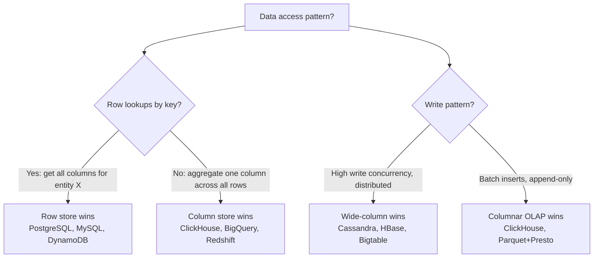
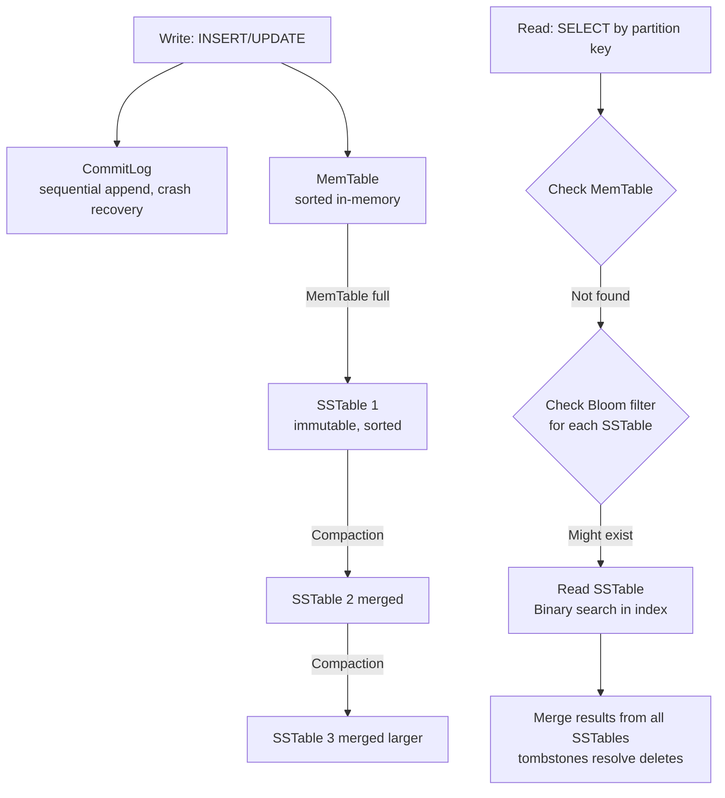
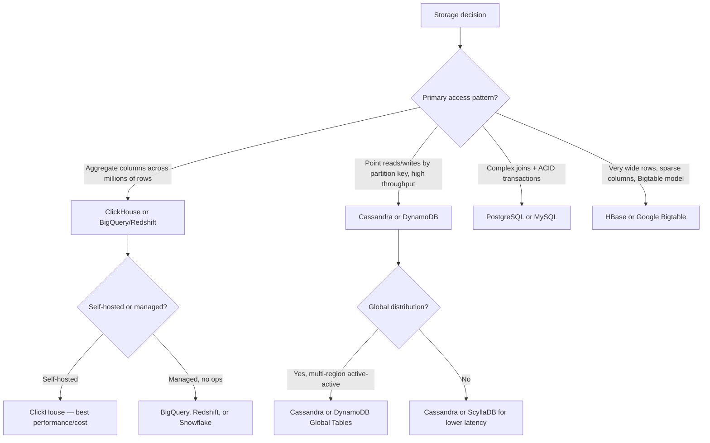

# Column-Store Databases: Cassandra, BigTable, and ClickHouse for Analytics

**Imagine an analytics query: `SELECT sum(revenue) FROM orders WHERE date > '2026-01-01'`.** In a row store, PostgreSQL reads entire rows (order_id, customer_id, product_id, status, address, notes, revenue) — all 120 bytes — even though only the 8-byte `revenue` column matters. For 500 million rows, that's 60 GB of I/O to answer a 4 GB question.

A columnar database reads only the `revenue` column. With delta compression, those 500M float64 values become 800MB. The query completes in seconds instead of minutes. This is the column-store advantage — but it comes with specific write trade-offs that make it wrong for many workloads.

---

## The Problem Class `[Mid]`

Two different workloads, both at massive scale:

**Workload A: High-velocity event ingestion (Cassandra / wide-column)**
- 100,000 writes/second from mobile apps
- Queries: "Give me all events for user X in the last 7 days"
- Pattern: write-heavy, low fan-out reads by partition key

**Workload B: Analytics on historical data (ClickHouse)**
- 10 million rows/second ingestion from Kafka
- Queries: "Revenue by product category, last 30 days, filtered by country"
- Pattern: low write concurrency, full-column aggregations over billions of rows



> 💡 **What this means in practice:** Row stores are optimized for "give me everything about entity X." Column stores are optimized for "compute something across all values of column Y." Most real systems need both — which is why data architectures often use both row stores (OLTP) and column stores (OLAP).

---

## Why the Obvious Solution Fails `[Senior]`

**Attempt 1: Use PostgreSQL with indexes for analytics**

PostgreSQL index scans reduce row reads for selective queries. But for low-selectivity aggregations ("sum of all revenue for last month"), the planner performs a sequential scan — no index helps. 500M rows × 120 bytes = 60 GB I/O regardless.

**Attempt 2: Add materialized views in PostgreSQL**

Materialized views pre-compute aggregations. But they require full refresh or incremental maintenance logic. For real-time analytics, the refresh lag is unacceptable. And the source data is still stored in row format — the optimization is at query time, not storage time.

**Attempt 3: Use Cassandra for analytics**

Cassandra is a wide-column store (not a columnar OLAP engine). Its LSM-tree architecture is optimized for writes and partition key lookups, not full-table aggregations. Running `SELECT sum(revenue) FROM orders` on Cassandra requires a full cluster scan — worse than PostgreSQL because Cassandra has no query optimizer.

---

## The Solution Landscape `[Senior]`

### Solution 1: Apache Cassandra (LSM-tree Wide-Column) `[Senior]`

**What it is**: A distributed wide-column database using LSM-trees (Log-Structured Merge trees) for storage. Designed for high write throughput and geographic distribution. Not columnar in the OLAP sense — columnar in the sense that each row can have different columns.

**How LSM-tree actually works at depth**:

Every write goes to an in-memory structure (MemTable) and a write-ahead log (CommitLog). When MemTable fills (~32MB), it's flushed to disk as an immutable SSTable file. Over time, SSTables accumulate and are periodically merged/compacted.



```
# Pseudocode: LSM-tree write path
def write(partition_key, column, value, timestamp):
    commitlog.append(partition_key, column, value, timestamp)  # O(1) sequential
    memtable.insert(partition_key, column, value, timestamp)   # O(log n) sorted insert

    if memtable.size > FLUSH_THRESHOLD:
        flush_memtable_to_sstable()  # background

# Key insight: WRITES are O(1) sequential — no random I/O
# READS require checking MemTable + bloom filter + SSTable — O(log n) + disk reads
```

**This is the write-read trade-off of LSM-trees**:
- Writes: always sequential appends → very fast, high throughput
- Reads: must check multiple SSTables → slower than B-tree (PostgreSQL), mitigated by bloom filters

**Cassandra partition key design — the most critical decision** `[Staff+]`:

Cassandra distributes data across nodes based on the partition key's token (hash). All rows with the same partition key are stored on the same node. This means:

```cql
-- GOOD: Even distribution, bounded partition size
CREATE TABLE user_events (
    user_id     UUID,
    event_time  TIMESTAMP,
    event_type  TEXT,
    data        BLOB,
    PRIMARY KEY ((user_id), event_time)  -- user_id is partition key
) WITH CLUSTERING ORDER BY (event_time DESC);

-- PROBLEMATIC: All data for one day on one node (hot partition)
CREATE TABLE daily_events (
    event_date  DATE,              -- BAD partition key: only 365 values/year
    event_id    UUID,
    data        BLOB,
    PRIMARY KEY ((event_date), event_id)
);
```

**Hot partition detection** `[Staff+]`:

```bash
# Cassandra: detect hot partitions via nodetool
nodetool tpstats        # thread pool stats — queue buildup indicates hot nodes
nodetool cfstats keyspace.table | grep "Large partitions"

# TableSizes plugin: identify partitions by size
nodetool cfstats myks.user_events | grep "Partition Size"
# Alert: any partition > 100MB (Cassandra recommended max: 100MB)

# DataStax Insights (Cassandra 4.0+): automatic hot partition detection
# Look for: partition_key_histogram showing 1 key with >> average reads
```

**Fixing hot partitions**:

```cql
-- Solution 1: Bucket by time + user
CREATE TABLE user_events_bucketed (
    user_id      UUID,
    week_bucket  INT,             -- partition per user per week
    event_time   TIMESTAMP,
    event_type   TEXT,
    PRIMARY KEY ((user_id, week_bucket), event_time)
);

-- Application computes week_bucket = EXTRACT(WEEK FROM event_time)
-- Each partition covers 1 user × 1 week → bounded size

-- Solution 2: Add random suffix for very hot keys
CREATE TABLE hot_counter (
    metric_name  TEXT,
    shard        INT,             -- random 0-9 shard to distribute writes
    count        COUNTER,
    PRIMARY KEY ((metric_name, shard))
);
-- Application: writes to random shard; reads sum all 10 shards
```

**Sizing guidance** `[Staff+]`:

```
# Cassandra node sizing
# Rule: 1-2 TB of data per node (with replication factor 3)
# At RF=3: total cluster data = 3x raw data
# 30TB raw data: 90TB cluster data / 1.5TB per node = 60 nodes

# Write throughput per node: 50K-100K writes/sec (local coordinator)
# Read throughput per node: 10K-30K reads/sec (requires SSTable merges)

# Memory per node: heap = min(8GB, total_RAM / 4)
# Cassandra JVM heap: 8GB (hard cap — larger heap causes GC pauses)
# Off-heap (row cache, key cache): use remaining RAM

# Compaction strategy selection:
# STCS (SizeTieredCompactionStrategy): write-heavy, acceptable read amplification
# LCS (LeveledCompactionStrategy): read-heavy, lower read amplification, more I/O
# TWCS (TimeWindowCompactionStrategy): time-series, compacts same-window SSTables
```

**Failure modes** `[Staff+]`:
- **Tombstone accumulation**: Deletes in Cassandra are written as tombstones (markers), not immediate deletions. Tombstones accumulate until GC grace period (10 days default) passes, then removed during compaction. Reads must scan through tombstones, degrading performance severely. Symptom: reads timing out on tables with frequent deletes. Fix: `gc_grace_seconds = 86400` (1 day) for non-distributed deletes; use TTL instead of deletes.
- **Read repair overhead**: Cassandra's eventual consistency means replicas can diverge. `read_repair` background repairs increase read I/O. On tables with high read traffic and diverged replicas, this can overwhelm the cluster. Monitor `ReadRepairTasks` in `tpstats`.

---

### Solution 2: ClickHouse (Columnar OLAP) `[Senior]`

**What it is**: A column-oriented OLAP database from Yandex. Designed for petabyte-scale analytics with sub-second query latency. Uses MergeTree family of storage engines.

**How it actually works at depth**:

ClickHouse stores each column as a separate file on disk. For a table with 100 columns, a query touching 3 columns reads only 3% of the total data. Additionally, same-type column data compresses extremely well:

```
# ClickHouse storage structure (simplified)
/var/lib/clickhouse/data/mydb/orders/
  ├── 20260301_1_1_0/        # one "part" (immutable data shard)
  │   ├── order_id.bin       # compressed order_id column values
  │   ├── order_id.mrk2      # mark file (granule index)
  │   ├── revenue.bin        # compressed revenue column values
  │   ├── revenue.mrk2
  │   ├── country.bin
  │   ├── country.mrk2
  │   ├── primary.idx        # sparse primary index
  │   └── columns.txt        # column metadata
```

```sql
-- ClickHouse MergeTree table definition
CREATE TABLE orders (
    order_id    UInt64,
    customer_id UInt32,
    country     LowCardinality(String),  -- efficient for low-cardinality strings
    product_id  UInt32,
    revenue     Decimal(10, 2),
    created_at  DateTime
) ENGINE = MergeTree()
  PARTITION BY toYYYYMM(created_at)      -- monthly partitions
  ORDER BY (country, customer_id, created_at)  -- sort key for data locality
  TTL created_at + INTERVAL 2 YEAR;      -- auto-expire data

-- Analytic query: runs in 200-500ms on 1 billion rows
SELECT
    country,
    sum(revenue) AS total_revenue,
    count() AS order_count
FROM orders
WHERE created_at >= '2026-01-01'
GROUP BY country
ORDER BY total_revenue DESC;
```

**ClickHouse compression ratios** `[Staff+]`:

```
Column type → compression ratio (LZ4 default, ZSTD optional):
  UInt64 (sequential IDs): 4-8x (delta encoding + LZ4)
  DateTime (recent timestamps): 8-20x (delta encoding)
  LowCardinality(String) (country codes): 20-100x (dictionary encoding)
  Decimal/Float (revenue amounts): 3-10x (delta encoding)
  String (free-form text): 1.5-3x (LZ4 only)
  Boolean/small integers: 8-16x

Real-world example:
  100GB raw CSV of orders → 8-15GB in ClickHouse (7-12x compression)
  With ZSTD(3): 5-8GB (15-20x compression)
```

**MergeTree ORDER BY — the most important decision** `[Staff+]`:

The ORDER BY (sort key) determines data locality. Queries that filter on sort key columns benefit from granule skipping (ClickHouse's equivalent of index range scans). Wrong sort key = full column scan instead of 1-10% scan.

```sql
-- Example: Most queries filter by (country, date_range, customer_id)
ORDER BY (country, toStartOfDay(created_at), customer_id)
-- ClickHouse will skip entire granules (8192 rows each) that don't match country+date

-- Anti-pattern: using a unique high-cardinality column as first key
ORDER BY (order_id)  -- BAD: every query touches every granule (no skipping)
ORDER BY (customer_id, created_at)  -- GOOD: customer queries skip to right rows
```

**Sizing guidance** `[Staff+]`:

```
# ClickHouse node sizing
# Read throughput: 10-50 GB/s from local NVMe SSDs (vectorized column reads)
# Write throughput: 100K-2M rows/sec per node (MergeTree batch inserts)

# CRITICAL: Never insert row-by-row into ClickHouse
# Batch inserts only: minimum 1000 rows, optimal 100K-1M rows per INSERT

# Memory per server:
# ClickHouse uses memory proportional to GROUP BY cardinality
# GROUP BY (country, month) = 200 × 12 = 2400 groups = trivial
# GROUP BY (user_id, hour) = 50M × 720 = needs memory management

# Replication: use ReplicatedMergeTree on ClickHouse Keeper (ZooKeeper replacement)
ENGINE = ReplicatedMergeTree('/clickhouse/tables/{shard}/orders', '{replica}')
```

**Failure modes** `[Staff+]`:
- **Part explosion from small inserts**: Each `INSERT` creates a new "part" on disk. Inserting 1 row at a time creates millions of parts — ClickHouse merges parts in background but can fall behind. Result: thousands of small files, query performance degrades, background merges overwhelm disk. Always use batch inserts.
- **Mutation overhead**: `UPDATE` and `DELETE` in ClickHouse are "mutations" — they rewrite entire parts. A single `DELETE WHERE customer_id = 12345` rewrites all parts containing that customer. Use TTL for time-based deletion; avoid ad-hoc deletes.

---

### Solution 3: Google Bigtable / HBase Model `[Senior]`

**What it is**: A wide-column distributed storage system designed for petabyte-scale data with high write throughput. Bigtable is Google's proprietary service; HBase is the open-source equivalent.

**Data model**:
- Each row has a unique row key (sorted lexicographically)
- Rows contain column families (groups of related columns)
- Each cell has timestamp versioning

```
Row key structure matters enormously — determines data locality:
GOOD:  user_id#event_type#timestamp  (same user's events stored together)
BAD:   timestamp#user_id             (writes always hit latest timestamp range → hot tablet)
BAD:   sequential integer IDs        (monotonically increasing → all writes to one tablet)
```

**Salting to prevent hot tablets**:

```python
# Prevent hot spotting with salted row keys
import hashlib

def make_row_key(user_id: str, timestamp: str) -> str:
    # Salt = first 2 chars of SHA256 hash of user_id
    salt = hashlib.sha256(user_id.encode()).hexdigest()[:2]
    return f"{salt}#{user_id}#{timestamp}"

# Now writes distribute across tablets based on salt prefix
# Reads for a specific user scan rows with prefix salt#user_id
```

---

## Trade-off Matrix `[Senior]` → `[Staff+]`

| Dimension | Cassandra (LSM) | ClickHouse (Columnar OLAP) | Bigtable/HBase | PostgreSQL (B-tree) |
|---|---|---|---|---|
| Write throughput | Very high | High (batch only) | Very high | Medium |
| Read: point lookup | Fast (bloom filter) | Slow (full col scan) | Fast (row key) | Fast (index) |
| Read: full aggregation | Very slow | Extremely fast | Very slow | Slow |
| Data model | Wide-column, flexible | Rigid schema | Wide-column, flexible | Relational |
| Consistency | Eventual (tunable) | Eventual (per-replica) | Strong (Bigtable) | Strong (ACID) |
| SQL support | CQL (limited) | Full SQL | No SQL | Full SQL |
| Joins | No | Limited | No | Full |
| Compression ratio | 3-8x | 10-100x | 3-8x | 1-3x |
| Operational cost | High | Medium | Low (managed) | Low |
| Best for | High-write event storage | Analytics aggregations | Metadata, config | OLTP, mixed |

---

## Decision Framework — When to Pick Each `[Senior]` → `[Staff+]`



---

## Production Failure Story `[Staff+]`

**The Cassandra partition explosion**:

A social platform stored all "feed events" for a user in a single Cassandra partition:

```cql
CREATE TABLE user_feed (
    user_id    UUID,
    created_at TIMESTAMP,
    content    TEXT,
    PRIMARY KEY ((user_id), created_at)
);
```

For regular users (< 10,000 events): works fine. For power users with 5-10 million followers who had been active for 5 years: each user's partition held 50 million events, growing to 8GB per partition.

**Symptoms**:
- Feed reads for popular users timing out: Cassandra needed to scan through a 8GB partition
- GC pressure on nodes holding hot partitions: pauses up to 30 seconds
- `nodetool cfstats` showing partition sizes in GB — Cassandra's recommended max is 100MB

**Fix**: Bucket partitions by user + month:

```cql
CREATE TABLE user_feed_v2 (
    user_id    UUID,
    month      INT,              -- yyyymm as integer: 202601
    created_at TIMESTAMP,
    content    TEXT,
    PRIMARY KEY ((user_id, month), created_at)
) WITH CLUSTERING ORDER BY (created_at DESC);

-- Each partition: 1 user × 1 month of activity
-- Power user: 50M events / 60 months = ~833K events/partition (~80MB)
-- Queries for last 30 days: scan 1 partition (current month)
-- Queries for last 90 days: scan 3 partitions (still manageable)
```

**Lesson**: Cassandra partition size must be bounded at design time. Unbounded growth is the #1 Cassandra production failure pattern. Design your partition key to limit max partition size — never assume "users won't grow that much."

---

## Observability Playbook `[Staff+]`

```bash
# Cassandra: critical health checks
nodetool tpstats | grep -E "(ReadStage|WriteStage|CompactionExecutor)"
# Alert: any Active > 0 AND Pending > 0 sustained (thread pool saturation)

nodetool compactionstats
# Alert: compaction pending > 100 (falling behind)

nodetool cfstats keyspace.table | grep -E "(Partition Size|Tombstone)"
# Alert: Max Partition Size > 100MB; Live cells scanned/Tombstone cells scanned ratio < 10

# ClickHouse: query performance
SELECT
    query,
    read_rows,
    read_bytes,
    result_rows,
    memory_usage,
    query_duration_ms
FROM system.query_log
WHERE event_date >= today() - 1
  AND type = 'QueryFinish'
ORDER BY query_duration_ms DESC
LIMIT 20;

-- Alert: read_bytes / result_bytes > 100x (inefficient ORDER BY, wrong sort key)
-- Alert: memory_usage > 10GB (GROUP BY on high-cardinality column)
```

---

## Architectural Evolution `[Staff+]`

**2026 column-store landscape**:

**ScyllaDB replacing Cassandra**: ScyllaDB (Cassandra-compatible, implemented in C++ using Seastar framework) has largely replaced vanilla Cassandra in new deployments. It eliminates Cassandra's JVM GC pauses — ScyllaDB uses per-core sharding with no shared memory, achieving 2-10x better latency consistency. In 2026, most "Cassandra" deployments at new organizations are actually ScyllaDB.

**ClickHouse on Kubernetes with S3 separation**: ClickHouse's compute-storage separation (ClickHouse on S3 / ClickHouse Keeper) reached production maturity in 2025. The 2026 pattern: ClickHouse compute nodes are ephemeral Kubernetes pods; data lives in S3. Scales compute horizontally without moving data.

**Rust-based columnar engines**: DataFusion (Apache Arrow) and Polars are Rust columnar query engines that are being embedded into application code for local analytics — eliminating the need to send data to a remote analytics database for aggregate computations on medium-sized datasets (< 100GB).

**eBPF storage I/O tracing**: Identifying hot partitions in Cassandra or slow MergeTree reads in ClickHouse now uses eBPF storage I/O tracing (`biosnoop`, `ext4slower`) to trace individual disk reads with stack traces — pinpointing slow queries to specific SSTable reads without log parsing.

---

## Decision Framework Checklist `[All Levels]`

- [ ] Identify query pattern first: point lookups = row store; aggregations = column store
- [ ] For Cassandra: design partition key to keep partition size < 100MB at max growth
- [ ] For Cassandra: use TWCS (TimeWindowCompactionStrategy) for time-series data — reduces compaction I/O
- [ ] For Cassandra: monitor tombstone accumulation; use TTL instead of deletes where possible
- [ ] For ClickHouse: always batch inserts (minimum 1000 rows, optimal 100K-1M per INSERT)
- [ ] For ClickHouse: design ORDER BY (sort key) based on your most common WHERE filters
- [ ] For ClickHouse: use `LowCardinality(String)` for columns with < 10K unique values
- [ ] For Bigtable/HBase: never use monotonically increasing row keys — salt to prevent hot tablets
- [ ] Monitor write amplification: Cassandra compaction I/O should be < 3x write throughput
- [ ] Consider ScyllaDB over Cassandra for new deployments — same CQL API, better tail latency

---
*Written by Gaurav Porwal — 10+ Year Engineer | Tech Lead | Product Owner | Business-Minded Builder*
*Last updated: 2026-03-18*
