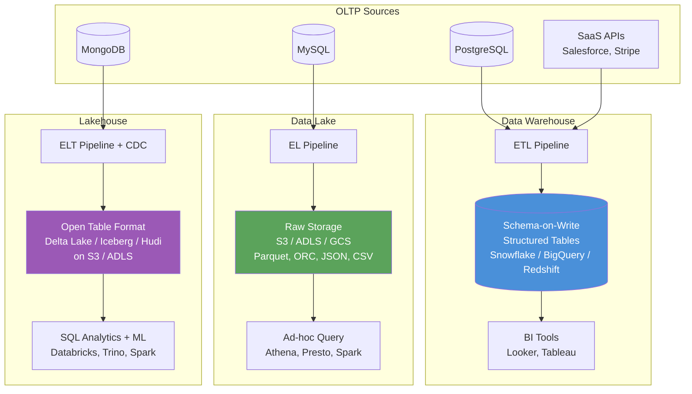
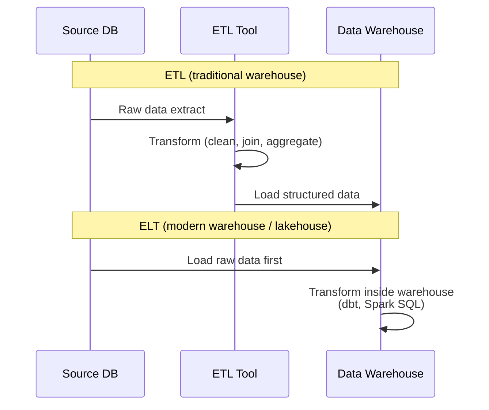

**Running analytics on your production database is how you take down your production database — these three architectures exist to separate that concern cleanly.**

## The Problem Class

### Why You Cannot Run Analytics on Your OLTP Database

Your application database (PostgreSQL, MySQL, Aurora) is built for transactional workloads (OLTP — Online Transaction Processing):

- Many small, fast queries: `SELECT * FROM users WHERE id = 441`
- Row-oriented storage — each row stored together on disk
- Optimized for point reads and updates
- B-tree indexes for fast lookups

Analytics are the opposite (OLAP — Online Analytical Processing):

- Few, massive queries: `SELECT region, SUM(revenue) FROM orders GROUP BY region, MONTH(created_at)`
- Full table scans across millions or billions of rows
- Needs columnar storage — group all values of `revenue` together for fast aggregation
- Benefits from compression ratios that row storage cannot achieve

Running a report query against your OLTP database during peak traffic is a common way to cause a production incident. The table scan competes with application queries for I/O and CPU. The solution is to copy data to a system purpose-built for analytics. That is the core job of all three paradigms below.

## How It Works

### The Three Paradigms



### Data Warehouse

A data warehouse stores data in **structured, schema-on-write tables** optimized for SQL analytics.

- Data must be cleaned and transformed **before** loading (ETL: Extract, Transform, Load)
- Schema is defined upfront — columns, types, constraints
- Columnar storage engine enables fast aggregations
- Designed for SQL — works out of the box with BI tools

**Real cost and performance numbers:**
- Snowflake: scans **1 TB of compressed data in 2–10 seconds** on a medium warehouse
- BigQuery: **$6.25 per TB scanned** (on-demand pricing), or flat-rate slots
- Redshift: provisioned clusters from ~$180/month, or Serverless at ~$3/RPU-hour
- Typical storage: **$20–100/TB/month** (much more expensive than raw S3)

**When to use it:** Structured business data, BI dashboards, stakeholder reports, regulated industries needing strict schema governance.

### Data Lake

A data lake is a **raw storage repository** — typically S3, Azure Data Lake Storage (ADLS), or GCS — that stores data in its original form (JSON, CSV, Parquet, ORC, Avro, images, logs).

- Data is loaded as-is with no transformation required (EL: Extract, Load)
- Schema is applied at query time, not at write time (schema-on-read)
- Storage is cheap, but queries are expensive and slow without optimization
- Supports structured, semi-structured, and unstructured data

**Real cost numbers:**
- S3 standard storage: **$0.023/GB/month** ($23/TB/month)
- Compare to Redshift: ~$1,000/TB/month for RA3 nodes
- Athena (query on S3): **$5 per TB scanned** — but without partitioning and columnar formats, a 10 TB table costs $50 per query

**When to use it:** Machine learning training data, raw event logs, unstructured data (images, audio), long-term data retention at low cost, exploratory analysis.

### Lakehouse

A lakehouse combines the **cheap storage of a data lake** with the **ACID transactions and SQL performance of a data warehouse**, using open table formats that sit on top of object storage.

The three major open table formats:
- **Delta Lake** (Databricks, open-sourced 2019) — transaction log as JSON files alongside Parquet data files
- **Apache Iceberg** (Netflix, open-sourced 2018) — table metadata with snapshot isolation, used by Netflix, Apple, Adobe
- **Apache Hudi** (Uber, open-sourced 2019) — optimized for CDC upserts and incremental processing

**What open table formats add on top of raw Parquet/S3:**
- ACID transactions (concurrent writers without corruption)
- Time travel (query the table as it looked 30 days ago)
- Schema evolution (add/rename columns without rewriting data)
- Partition pruning and file-level statistics for fast queries
- Row-level deletes and updates (critical for GDPR compliance)

### The ETL vs ELT Distinction



**ELT** (Extract, Load, Transform) pushes transformation into the warehouse or lakehouse, where compute is elastic and cheap. Tools like **dbt** (data build tool) define transformations as SQL models that run inside Snowflake, BigQuery, or Spark:

```sql
-- dbt model: models/orders/monthly_revenue.sql
-- This SQL runs inside your warehouse, not on a separate ETL server

{{ config(materialized='table') }}

SELECT
    DATE_TRUNC('month', created_at) AS month,
    region,
    SUM(total_cents) / 100.0 AS revenue_usd,
    COUNT(*) AS order_count,
    AVG(total_cents) / 100.0 AS avg_order_value
FROM {{ ref('stg_orders') }}
WHERE status = 'completed'
GROUP BY 1, 2
ORDER BY 1 DESC, 3 DESC
```

## Implementation

### Decision Tree: Which to Use

```
Does your data have a defined schema and will it stay structured?
├── Yes → Do you have < 50 TB and mostly SQL BI use cases?
│   ├── Yes → Data Warehouse (Snowflake / BigQuery)
│   └── No → Lakehouse (Delta Lake / Iceberg on S3)
│
└── No → Do you need to run ML on raw data or store unstructured files?
    ├── Yes + No SQL needed → Data Lake (S3 + Parquet)
    └── Yes + SQL needed → Lakehouse (Delta Lake / Iceberg)

Special cases:
- Need to delete rows for GDPR? → Lakehouse (row-level deletes)
- Need sub-second queries for embedded analytics? → Warehouse
- Need to train ML models on 100 TB of raw events? → Lake or Lakehouse
- Streaming data that also needs batch queries? → Lakehouse (Hudi / Iceberg)
```

### Setting Up a Lakehouse Table with Delta Lake

```python
from pyspark.sql import SparkSession
from delta import configure_spark_with_delta_pip

spark = configure_spark_with_delta_pip(
    SparkSession.builder
        .appName("orders-lakehouse")
        .config("spark.sql.extensions", "io.delta.sql.DeltaSparkSessionExtension")
        .config("spark.sql.catalog.spark_catalog", "org.apache.spark.sql.delta.catalog.DeltaCatalog")
).getOrCreate()

# Write CDC events from Kafka into a Delta table on S3
def process_cdc_batch(batch_df, batch_id):
    from delta.tables import DeltaTable

    delta_table_path = "s3://data-lake/lakehouse/orders"

    if DeltaTable.isDeltaTable(spark, delta_table_path):
        dt = DeltaTable.forPath(spark, delta_table_path)

        # Merge = upsert + delete in one operation
        dt.alias("target").merge(
            batch_df.alias("source"),
            "target.id = source.id"
        ).whenMatchedUpdate(
            condition="source.op = 'u'",
            set={
                "status": "source.after.status",
                "updated_at": "source.after.updated_at"
            }
        ).whenMatchedDelete(
            condition="source.op = 'd'"
        ).whenNotMatchedInsert(
            condition="source.op = 'c'",
            values={
                "id": "source.after.id",
                "user_id": "source.after.user_id",
                "status": "source.after.status",
                "total_cents": "source.after.total_cents",
                "created_at": "source.after.created_at",
                "updated_at": "source.after.updated_at"
            }
        ).execute()
    else:
        # First run: create the table
        inserts = batch_df.filter("op = 'c'").select("after.*")
        inserts.write.format("delta").save(delta_table_path)

# Time travel: query the table as it was 7 days ago
past_orders = spark.read.format("delta") \
    .option("timestampAsOf", "2026-03-13") \
    .load("s3://data-lake/lakehouse/orders")
```

### Partitioning Strategy for Query Performance

Bad partitioning makes every query scan the entire table. Good partitioning prunes 99% of files.

```python
# Bad: no partitioning — every query scans all files
orders_df.write.format("delta").save("s3://data-lake/orders")

# Good: partition by date and region — most queries filter on these
orders_df \
    .withColumn("year", year("created_at")) \
    .withColumn("month", month("created_at")) \
    .write \
    .format("delta") \
    .partitionBy("year", "month", "region") \
    .save("s3://data-lake/orders")

# Query now scans only 1 month of 1 region instead of the full table
spark.sql("""
    SELECT SUM(total_cents)
    FROM orders
    WHERE year = 2026 AND month = 3 AND region = 'us-east'
""")
```

## Real-World Usage

### Netflix — Apache Iceberg

Netflix open-sourced Apache Iceberg after struggling with Hive table limitations at their data scale. Their data lake holds **exabytes** of data with petabyte-scale Iceberg tables.

Key Iceberg feature Netflix relies on: **snapshot isolation** — concurrent Spark jobs and Trino queries can read and write the same table simultaneously without blocking each other. Netflix runs **thousands of concurrent Spark jobs** against shared Iceberg tables.

Netflix migrated their recommendation model training from raw S3 Parquet to Iceberg, enabling time-travel for reproducible model training on historical snapshots.

### Uber — Data Lake + Presto

Uber's data platform processes CDC from **thousands of microservice databases** into their data lake on HDFS (and later S3). They use Presto for interactive SQL queries and Spark for heavy batch processing.

Uber developed **Apache Hudi** because existing tools could not handle row-level updates at their scale. Processing GDPR deletion requests (right to be forgotten) across petabytes of raw Parquet files was impossible — each delete required rewriting entire files. Hudi's merge-on-read format makes row-level deletes tractable.

Uber's data team runs **500,000+ Presto queries per day** against their data lake.

### Airbnb — Druid + S3

Airbnb uses a hybrid: raw event data lands in S3 as Parquet (data lake layer), then high-cardinality time-series metrics are ingested into **Apache Druid** for sub-second dashboard queries.

The split: warehouse (Hive on S3) for batch reporting, Druid for real-time operational dashboards. Their data engineering team manages **5+ petabytes** of data lake storage.

### LinkedIn — Data Lake

LinkedIn's data lake stores member activity events, feed impressions, and ad clicks. At peak, LinkedIn ingests **~7 trillion events per day** into their Hadoop-based data lake.

They use a warehouse layer on top for business intelligence (internal Hive + Spark SQL) and a separate OLAP store (Pinot, which they also open-sourced) for real-time analytics.

## Trade-offs

| Dimension | Data Warehouse | Data Lake | Lakehouse |
|---|---|---|---|
| Storage cost | High ($20–100/TB/month) | Low ($23/TB/month on S3) | Low ($23/TB/month on S3) |
| Query performance | Excellent (seconds) | Poor without optimization | Good (with table stats + partitioning) |
| Schema enforcement | Strict (schema-on-write) | None (schema-on-read) | Flexible (schema evolution) |
| ACID transactions | Yes | No | Yes (Delta/Iceberg/Hudi) |
| Supports ML training data | Limited | Yes (raw formats) | Yes |
| Supports row-level deletes | Yes | No (rewrite files) | Yes |
| BI tool compatibility | Excellent (native SQL) | Limited | Good (Trino/Spark SQL) |
| Operational complexity | Low (managed service) | Low (S3 is simple) | Medium (Spark/Flink needed) |
| Best tools | Snowflake, BigQuery, Redshift | S3 + Athena/Presto | Databricks, Trino + Delta/Iceberg/Hudi |
| When to choose | Structured BI, dashboards | ML data, raw logs, archives | Mixed workloads, streaming + batch, GDPR |

## Common Pitfalls

1. **The data swamp.** A data lake with no governance becomes a swamp — files with no schema documentation, unknown owners, duplicate datasets with conflicting row counts. Without a data catalog (Apache Atlas, AWS Glue Data Catalog, DataHub) and mandatory metadata standards, your data lake becomes unusable within 18 months. Establish schema registration and data ownership before onboarding the second team.

2. **Schema drift without contracts.** In a warehouse, adding a column to the source table requires an ETL migration. In a lake, a new field just appears in the JSON. Consumers silently break when they can no longer parse the schema they assumed. Use a schema registry (Confluent Schema Registry, Glue Schema Registry) or at minimum enforce column naming conventions and use Parquet/Avro with embedded schemas instead of raw JSON/CSV.

3. **No query performance on raw Parquet.** Querying a 10 TB Parquet directory on S3 without partitioning or statistics scans every file. A query that should take 10 seconds takes 45 minutes and costs $50 on Athena. Always partition by your most common filter dimensions (date, region, entity type) and run `ANALYZE` or equivalent to generate file-level statistics so the query engine can prune files.

4. **Running OLAP queries against your OLTP database.** The most common pitfall of all. A BI tool connects directly to the production PostgreSQL to generate a monthly revenue report. The GROUP BY with a full table scan causes CPU to spike, replication lag increases, and application latency degrades. Always establish an analytics path — even a nightly pg_dump into Athena is better than hitting production.

5. **Treating a lakehouse as a drop-in warehouse replacement.** Lakehouses require Spark or Trino clusters, which have non-trivial startup times (30–90 seconds for a Spark session). For sub-second dashboard queries, a columnar warehouse like BigQuery or Snowflake will outperform a lakehouse. Use the right tool: lakehouse for mixed batch/streaming workloads, warehouse for low-latency BI.

6. **Ignoring small file problems.** Streaming workloads (Kafka → Spark Structured Streaming → Delta Lake) write many small files — often one file per micro-batch per partition. Thousands of 1 MB files perform far worse than hundreds of 128 MB files. Run Delta Lake's `OPTIMIZE` command or Iceberg's `rewrite_data_files` procedure regularly to compact small files.

## Key Takeaways

- Never run analytical queries against your OLTP (production) database — they will compete with application traffic and cause latency spikes.
- A **data warehouse** (Snowflake, BigQuery, Redshift) gives you structured, schema-on-write tables with excellent SQL performance at higher storage cost.
- A **data lake** (S3 + Parquet) gives you cheap raw storage for all data formats, but queries are slow without careful partitioning and columnar formats.
- A **lakehouse** (Delta Lake, Iceberg, Hudi on S3) combines cheap lake storage with ACID transactions, time travel, and row-level deletes — the right choice for mixed workloads, streaming ingestion, and GDPR compliance.
- ELT (push raw data in, transform inside the warehouse) is now preferred over ETL because warehouse compute is elastic and tools like dbt make SQL transformations first-class.
- The critical operational risk for lakes is the data swamp — enforce schema contracts, a data catalog, and data ownership from day one.
