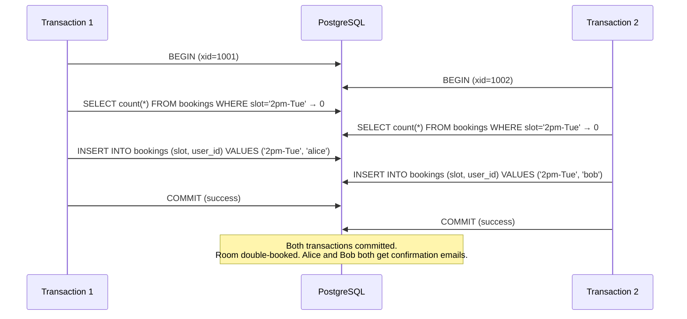
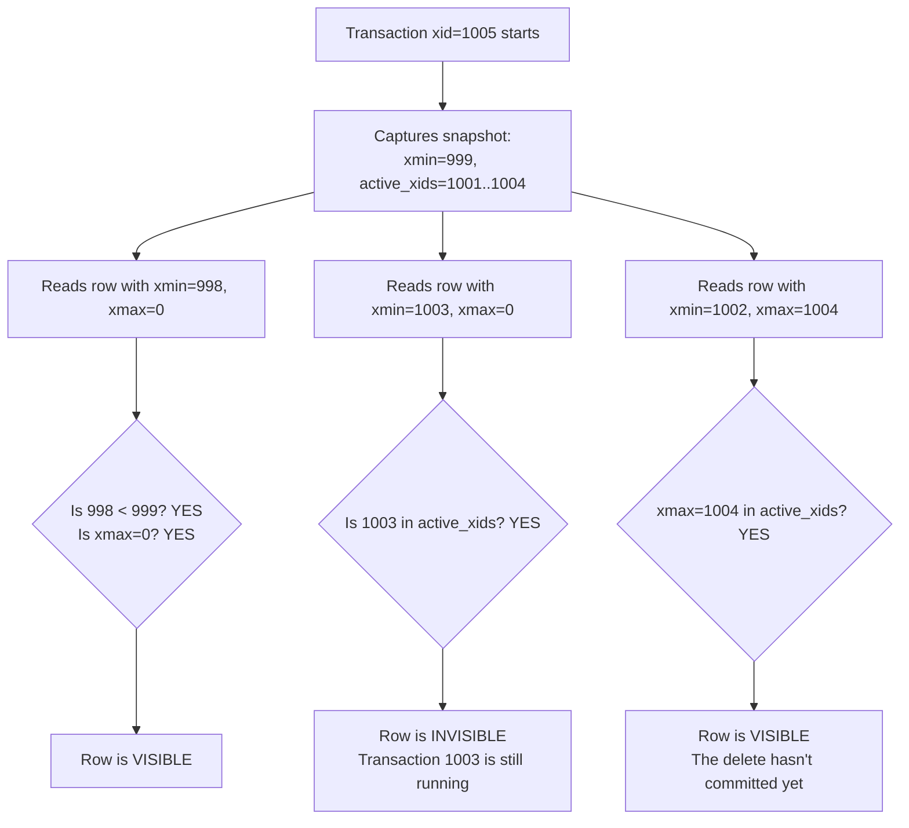
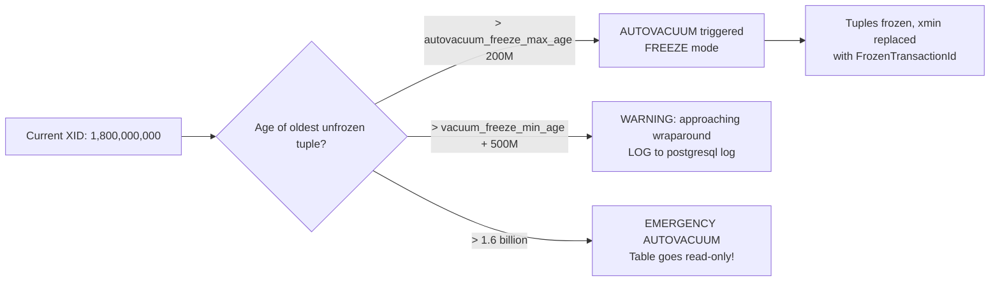
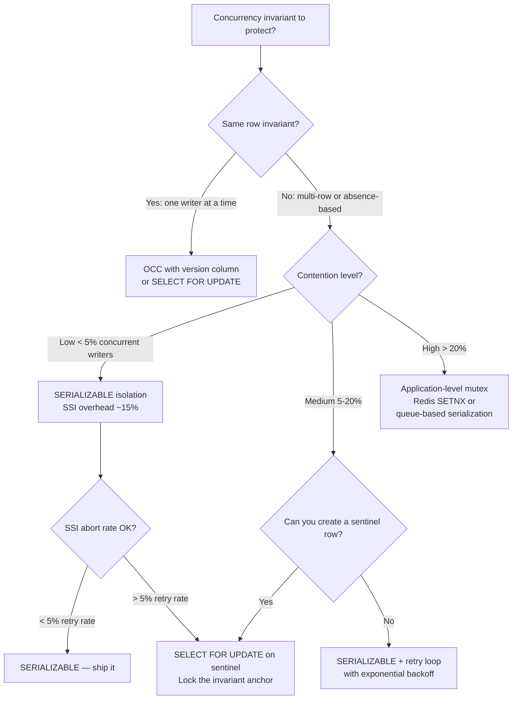

# MVCC: Snapshot Isolation, Write Skew, and Phantom Read Prevention

**Most engineers believe they understand transactions until a double-booking bug hits production at 3am.** The invariant they were protecting — "no two reservations for the same slot" — was correctly enforced in unit tests. But under concurrent load with snapshot isolation, two transactions each read "slot available," both committed, and now two customers hold the same seat.

This is write skew. MVCC causes it. And understanding why requires going one layer deeper into how PostgreSQL's visibility rules actually work.

---

## The Problem Class `[Mid]`

You have a booking system handling 50,000 concurrent users. Two requests arrive within 5ms of each other, both trying to reserve the last available conference room at 2pm Tuesday.



The naive fix — adding a UNIQUE constraint — does not solve write skew when the invariant spans multiple rows. A conference room booking system checking "total bookings < capacity" across multiple rows cannot be protected by a single unique constraint.

This is a **write skew anomaly**: both transactions read a consistent snapshot, make a decision based on that read, and write to disjoint rows. Neither transaction's write conflicts with the other, so both commit. But the combined result violates the business invariant.

---

## Why the Obvious Solution Fails `[Senior]`

**Attempt 1: Add a UNIQUE constraint**
Works only when the invariant is "exactly one row." Fails for capacity-based invariants (max 10 bookings per room per hour).

**Attempt 2: Application-level locking (`SELECT ... FOR UPDATE`)**
Correct — but engineers under-apply it. They lock the rows they intend to write, not the rows whose *absence* defines the invariant. If the room has zero bookings, there's nothing to `SELECT FOR UPDATE` against.

**Attempt 3: Optimistic locking with version columns**
Catches lost updates (two writers on the same row), but not write skew (two writers on *different* rows whose combined state violates an invariant).

**Attempt 4: Use SERIALIZABLE isolation**
This actually works, but engineers avoid it believing it has high overhead. The truth in 2026: PostgreSQL's Serializable Snapshot Isolation (SSI) has ~15% overhead vs READ COMMITTED in most OLTP workloads, not the 3-5x penalty of traditional locking-based serializable.

The real failure is not knowing which concurrency anomaly you're actually facing.

---

## How MVCC Works in PostgreSQL `[Senior]`

PostgreSQL implements MVCC through tuple versioning. Every row has two system columns:

- **`xmin`**: transaction ID (xid) that inserted this version
- **`xmax`**: transaction ID that deleted or updated this version (0 if current)

When your transaction with xid=1005 reads a row, PostgreSQL evaluates visibility:

```
Row is visible if:
  xmin committed AND xmin < snapshot_xmin
  AND (xmax = 0 OR xmax > snapshot_xmax OR xmax not committed)
```

The **snapshot** is captured at transaction start (READ COMMITTED) or at statement start (REPEATABLE READ / SERIALIZABLE). This is what makes snapshot isolation work: you always see a point-in-time consistent view.



**Dead tuples**: When a row is updated, PostgreSQL writes a new version (new xmin) and marks the old version's xmax. The old version becomes a **dead tuple** — no longer visible to any transaction, but still physically present on disk until VACUUM removes it.

A table with 10,000 updates/second at average 100-byte row size generates:
- **864 million dead tuples/day**
- At 100 bytes each: **~86 GB/day of dead tuple bloat** before VACUUM

This is why autovacuum configuration is a performance-critical decision, not an afterthought.

---

## The Solution Landscape `[Senior]`

### Solution 1: SELECT FOR UPDATE with Predicate Locking `[Senior]`

**What it is**: Pessimistic locking that acquires row-level locks on read, preventing concurrent modifications.

**How it actually works at depth**: `SELECT ... FOR UPDATE` sets an exclusive lock on matching rows. Subsequent transactions attempting to lock the same rows block until the first transaction commits or rolls back. For the "zero rows" write skew case, you need a **materialized conflict**: create a sentinel row to lock.

```sql
-- Conference room capacity check (pessimistic approach)
BEGIN;

-- Lock the room row itself, not the bookings
SELECT id FROM rooms WHERE id = $room_id FOR UPDATE;

-- Now check capacity against our locked snapshot
SELECT COUNT(*) FROM bookings
WHERE room_id = $room_id AND slot = $slot;

-- If count < capacity, proceed
INSERT INTO bookings (room_id, slot, user_id) VALUES ($room_id, $slot, $user_id);

COMMIT;
```

**Sizing guidance** `[Staff+]`:
- Lock acquisition adds 0.5-2ms latency per transaction under low contention
- Under high contention (100+ concurrent writers on same room): queue depth grows linearly, P99 latency can reach 500ms-2s
- Maximum recommended concurrent writers per hot row: 20-30 for sub-100ms P99

**Configuration decisions that matter** `[Staff+]`:
```sql
-- Tune lock timeout to prevent indefinite waiting
SET lock_timeout = '2s';

-- Tune deadlock detection interval (default 1s, too slow for high-frequency OLTP)
deadlock_timeout = 100ms  -- postgresql.conf
```

**Failure modes** `[Staff+]`:
- **Deadlock cascade**: Two transactions each lock room A then try to lock room B (and vice versa). PostgreSQL detects and aborts one, but your retry logic must handle `ERROR 40P01: deadlock detected`.
- **Lock starvation**: Long-running OLAP queries holding `ACCESS SHARE` locks can starve DDL. Symptom: `ALTER TABLE` queue depth growing, auto_explain showing lock waits.
- **Lock escalation storms**: Statement-level lock on a partitioned table locks all partitions.

**Observability** `[Staff+]`:
```sql
-- Real-time lock wait monitoring
SELECT
    waiting.pid,
    waiting.query,
    blocking.pid AS blocking_pid,
    blocking.query AS blocking_query,
    pg_blocking_pids(waiting.pid) AS blocked_by
FROM pg_stat_activity waiting
JOIN pg_stat_activity blocking ON blocking.pid = ANY(pg_blocking_pids(waiting.pid))
WHERE waiting.wait_event_type = 'Lock';

-- Key metric: lock_wait_duration_seconds histogram via pg_stat_statements
```

---

### Solution 2: SERIALIZABLE Isolation (SSI) `[Senior]`

**What it is**: PostgreSQL's Serializable Snapshot Isolation — detects dangerous read-write dependencies between concurrent transactions and aborts one if a cycle is detected.

**How it actually works at depth**: SSI tracks **rw-anti-dependencies**: if T1 reads something that T2 later writes, and T2 reads something that T1 writes, SSI detects this cycle and aborts one transaction with `ERROR 40001: could not serialize access`.

This is the correct fix for write skew without requiring application-level sentinel locking.

```sql
-- Clean write skew prevention with SERIALIZABLE
BEGIN ISOLATION LEVEL SERIALIZABLE;

SELECT COUNT(*) FROM bookings
WHERE room_id = $room_id AND slot = $slot;

INSERT INTO bookings (room_id, slot, user_id) VALUES ($room_id, $slot, $user_id);

COMMIT;
-- If another transaction serializes concurrently with a conflicting pattern:
-- ERROR: could not serialize access due to read/write dependencies among transactions
-- DETAIL: Reason code: Canceled on identification as a pivot, during commit attempt.
-- HINT: The transaction might succeed if retried.
```

**Sizing guidance** `[Staff+]`:
- SSI overhead vs READ COMMITTED: **10-20%** for typical OLTP (measured on TPC-C benchmarks, PostgreSQL 15+)
- SSI abort rate under normal load: **0.1-2%** (workload-dependent)
- SSI abort rate under pathological concurrent writes to same predicate: up to **40%** — retry logic becomes critical
- Memory per in-flight serializable transaction: ~1KB for SIREAD lock tracking

**Configuration decisions that matter** `[Staff+]`:
```
# postgresql.conf
max_pred_locks_per_transaction = 64   # default; increase for wide-scan workloads
max_pred_locks_per_relation = -2      # 2x max_pred_locks_per_transaction
max_pred_locks_per_page = 2           # granularity before page-level lock promotion
```

**Failure modes** `[Staff+]`:
- **False abort cascades**: Overly broad predicate scans cause SSI to see false conflicts. Symptom: high `pg_stat_activity` showing `serialization_failure` on unrelated tables.
- **Lock promotion storms**: SSI promotes tuple locks → page locks → relation locks when `max_pred_locks_per_page` is exceeded. Under write-heavy batch loads, this can cause full-table serialization (serializable becomes effectively single-writer).

**Observability** `[Staff+]`:
```sql
SELECT
    deadlocks,
    blk_read_time,
    blk_write_time
FROM pg_stat_database WHERE datname = current_database();

-- Serialization failures tracked via:
-- pg_stat_user_tables.n_dead_tup (proxy for MVCC pressure)
-- Application-level counter: serialization_failure_total
```

---

### Solution 3: Optimistic Concurrency Control (OCC) `[Senior]`

**What it is**: No locks on read. On commit, verify the data you read hasn't changed. If it has, abort and retry.

**How it actually works at depth**: Implemented via version columns or ETags. Each row has a `version INTEGER` or `updated_at TIMESTAMP`. On update, include the version in the WHERE clause and check affected rows.

```sql
-- OCC update pattern
UPDATE bookings
SET status = 'confirmed', version = version + 1
WHERE id = $id AND version = $expected_version;

-- If affected_rows = 0, someone else updated first → retry
```

**Sizing guidance** `[Staff+]`:
- Retry rate under p% contention: approximately `p × (1-p)` per competing transaction pair
- At 10 concurrent writers on same row: expect ~30-40% retry rate
- OCC is optimal when write contention is **< 5%** of transactions. Above 20% contention, 2PL (SELECT FOR UPDATE) has lower effective latency due to retry overhead.

**Failure modes** `[Staff+]`:
- **Livelock**: Under sustained high contention, low-priority transactions may retry indefinitely. Add exponential backoff with jitter (max 32ms + random 0-16ms).
- **Write skew still possible**: OCC prevents lost updates on the same row but does NOT prevent write skew on disjoint rows without predicate-level version checking.

---

## MVCC Operational Concerns: Autovacuum and Transaction ID Wraparound `[Staff+]`

These are not theoretical — transaction ID wraparound has caused production outages at companies including Mailchimp and Sentry.

**Transaction ID Wraparound**: PostgreSQL's xid is a 32-bit integer. After 2.1 billion transactions, it wraps. Any tuples with xmin older than 2.1 billion transactions from the current xid become invisible — **all your data disappears**.

PostgreSQL protects against this with autovacuum freezing: tuples that survive a VACUUM get their xmin replaced with a special frozen indicator, effectively aging them out of the wraparound danger zone.



**Key metrics to monitor**:
```sql
-- Tables approaching wraparound
SELECT
    schemaname, relname,
    age(relfrozenxid) AS xid_age,
    pg_size_pretty(pg_total_relation_size(oid)) AS size,
    2100000000 - age(relfrozenxid) AS txns_until_wraparound
FROM pg_class
WHERE relkind = 'r'
ORDER BY age(relfrozenxid) DESC
LIMIT 20;

-- Alert threshold: age > 1,500,000,000 (1.5 billion)
-- Emergency threshold: age > 1,800,000,000 (1.8 billion)
```

**Dead tuple bloat rate formula**:
```
bloat_rate_GB_per_day = (updates_per_sec × avg_row_size_bytes × 86400) / 1e9

# Example: 10K updates/sec, 200 byte rows
# = (10000 × 200 × 86400) / 1e9 = 172.8 GB/day pre-VACUUM
```

**Autovacuum sizing for high-write tables**:
```sql
-- Per-table autovacuum tuning for hot tables
ALTER TABLE bookings SET (
    autovacuum_vacuum_scale_factor = 0.01,     -- vacuum at 1% dead tuples (not default 20%)
    autovacuum_vacuum_cost_delay = 2,           -- 2ms (default 20ms) — more aggressive
    autovacuum_vacuum_threshold = 1000          -- minimum 1000 dead tuples to trigger
);
```

---

## Trade-off Matrix `[Senior]` → `[Staff+]`

| Dimension | SELECT FOR UPDATE (2PL) | SERIALIZABLE (SSI) | OCC (Version Check) |
|---|---|---|---|
| Write skew prevention | Yes (with sentinel rows) | Yes (automatic) | No (disjoint rows) |
| Lost update prevention | Yes | Yes | Yes |
| Deadlock risk | Yes | No | No |
| Abort/retry required | Only on deadlock | Yes (serialization failure) | Yes (version conflict) |
| Read overhead | None | ~15% | None |
| Write overhead | Lock acquisition | SIREAD lock tracking | Version comparison |
| Ideal contention level | Medium-high | Low-medium | Very low |
| Implementation complexity | Low | Low (just set isolation) | Medium |
| OLAP query impact | High (lock conflicts) | Medium (false aborts) | None |

---

## Decision Framework — When to Pick Each `[Senior]` → `[Staff+]`



---

## Production Failure Story `[Staff+]`

**The airline double-booking incident (composite scenario from multiple post-mortems)**:

A major airline's seat reservation system ran at READ COMMITTED isolation. Developers believed application-level checks sufficed: "Check if seat is available, then book it." This worked fine in testing.

Under Black Friday traffic (400 concurrent booking attempts per second on popular flights), write skew became frequent:

- T1 reads seat 14A: available
- T2 reads seat 14A: available
- T1 commits booking for seat 14A
- T2 commits booking for seat 14A (no conflict — different booking rows)

The UNIQUE constraint was on `(flight_id, seat_id, booking_id)`, not on `(flight_id, seat_id)` — a mistake made to allow cancellations without hard deletes.

**Root cause**: The constraint didn't enforce the invariant. The invariant was "only one *active* booking per seat" — a filtered constraint that wasn't enforced at the DB level.

**Fix applied**:
```sql
-- Partial unique index enforcing the actual business invariant
CREATE UNIQUE INDEX bookings_active_seat_unique
ON bookings (flight_id, seat_id)
WHERE status = 'active';

-- This causes T2's INSERT to fail with unique violation,
-- even under snapshot isolation
```

**Lesson**: Express invariants as database constraints where possible. Constraint checks in PostgreSQL run at statement execution time, not snapshot time — they see the committed state, closing the write skew window.

---

## Observability Playbook `[Staff+]`

```sql
-- 1. MVCC bloat ratio (proxy for vacuum health)
SELECT
    relname,
    n_dead_tup,
    n_live_tup,
    ROUND(n_dead_tup::numeric / NULLIF(n_live_tup + n_dead_tup, 0) * 100, 2) AS dead_ratio,
    last_autovacuum,
    last_autoanalyze
FROM pg_stat_user_tables
WHERE n_live_tup > 10000
ORDER BY dead_ratio DESC;

-- Alert: dead_ratio > 10% on active tables

-- 2. Long-running transactions (MVCC bloat source)
SELECT pid, age(clock_timestamp(), xact_start) AS txn_age, query
FROM pg_stat_activity
WHERE xact_start IS NOT NULL
ORDER BY txn_age DESC;

-- Alert: any transaction > 5 minutes on OLTP

-- 3. Transaction ID age (wraparound risk)
SELECT max(age(relfrozenxid)) FROM pg_class WHERE relkind='r';
-- Alert: > 1 billion; Page: > 1.5 billion; Emergency: > 1.8 billion

-- 4. Lock waits
SELECT count(*) FROM pg_stat_activity WHERE wait_event_type = 'Lock';
-- Alert: > 20 concurrent lock waits
```

**Prometheus metrics to export** (via `pg_exporter`):
- `pg_stat_user_tables_n_dead_tup`
- `pg_database_age` (wraparound proximity)
- `pg_locks_count` by locktype
- `pg_stat_activity_count` by wait_event_type

---

## Architectural Evolution `[Staff+]`

**2026 state of MVCC and concurrency control**:

**eBPF-based lock observability**: Tools like `bpftrace` with PostgreSQL USDT probes now let you trace lock acquisition paths with sub-microsecond granularity without modifying application code. The `postgres` binary ships with tracepoints at `lock__wait__start`, `lock__wait__done` — production-safe profiling that was impossible pre-2024.

**Rust-based storage engines**: Neon (serverless PostgreSQL) and other cloud-native forks have reimplemented MVCC at the storage layer with Rust, enabling multi-region snapshot isolation with ~50ms cross-region read consistency — not possible with WAL-based streaming replication alone.

**Distributed MVCC**: CockroachDB and YugabyteDB implement MVCC with HLC (Hybrid Logical Clocks) for distributed serializable isolation. The 2026 approach: use these when you need cross-region serializable transactions; use PostgreSQL SSI when you need single-region serializable with lower overhead.

**Platform engineering shift**: The 2026 pattern is encoding isolation requirements in infrastructure-as-code (Terraform/Pulumi database modules), where the `isolation_level` is a required field alongside `instance_class` — preventing READ COMMITTED becoming the default through organizational inertia.

---

## Decision Framework Checklist `[All Levels]`

- [ ] Identify the exact anomaly you're protecting against: lost update, write skew, or phantom read
- [ ] Can the invariant be expressed as a database constraint (UNIQUE, CHECK)? Do that first.
- [ ] If invariant spans multiple rows: use SERIALIZABLE isolation or SELECT FOR UPDATE on a sentinel row
- [ ] Measure actual SSI abort rate in staging before dismissing it as "too expensive"
- [ ] Configure `lock_timeout` on all OLTP transactions to prevent unbounded blocking
- [ ] Monitor `age(relfrozenxid)` — alert at 1 billion, page-on-call at 1.5 billion
- [ ] Set per-table autovacuum parameters for any table with > 1000 writes/sec
- [ ] Ensure retry logic exists for all transactions that can receive `40001` or `40P01`
- [ ] Run `EXPLAIN (ANALYZE, BUFFERS)` with `track_io_timing = on` on queries under concurrent load
- [ ] Test write skew specifically: write concurrent-load tests that verify business invariants, not just individual transaction correctness

---
*Written by Gaurav Porwal — 10+ Year Engineer | Tech Lead | Product Owner | Business-Minded Builder*
*Last updated: 2026-03-18*
