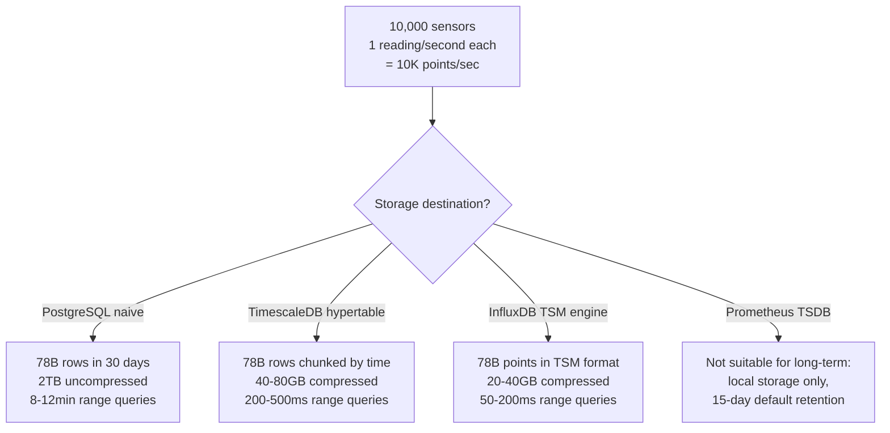
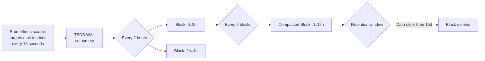
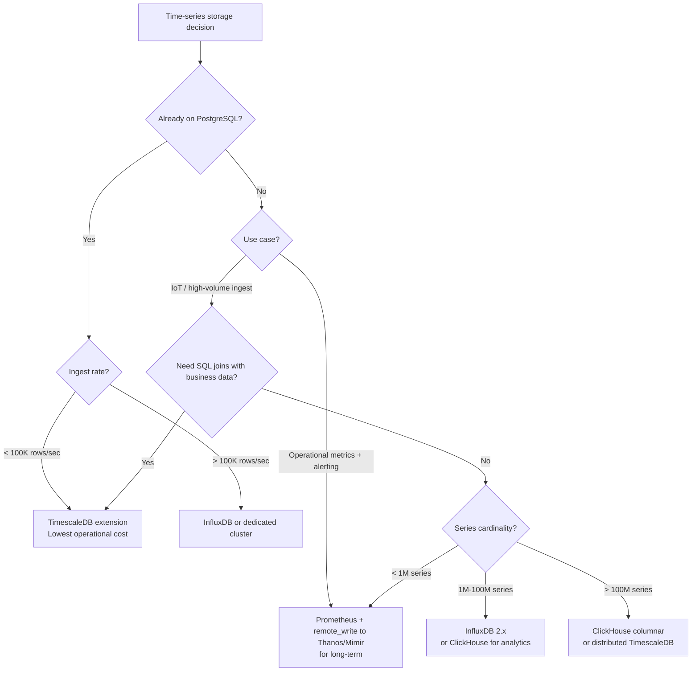

# Time-Series Databases: InfluxDB, TimescaleDB, and Prometheus TSDB Trade-offs

**Your application emits 50,000 metrics data points per second. At 16 bytes per point, that's 800KB/s — 69 GB/day — 25 TB/year.** Most of that data is useless after 90 days. The right time-series database can compress it 50-100x, auto-expire old data, and answer range queries over billions of rows in milliseconds. The wrong one will have you sharding PostgreSQL at 2am.

---

## The Problem Class `[Mid]`

Imagine a fleet monitoring system for 10,000 IoT sensors. Each sensor emits a reading every second: temperature, humidity, pressure. That's 30,000 data points per second, 2.6 billion per day.

A naive approach stores these in a PostgreSQL table:

```sql
CREATE TABLE sensor_readings (
    sensor_id    INTEGER,
    recorded_at  TIMESTAMP,
    metric       VARCHAR(50),
    value        DOUBLE PRECISION
);
-- Index: (sensor_id, recorded_at)
```

After 30 days: 78 billion rows. Query for "average temperature by sensor, last 24 hours": PostgreSQL index scan across 864 million rows. Runtime: 8-12 minutes. Disk: 2TB for 30 days of data with no compression.

A time-series database built for this workload stores the same data in 40-100GB (20-50x compression), answers the same query in 50-200ms via columnar time-bucketing, and auto-expires data older than your retention window.



> 💡 **What this means in practice:** Time-series workloads have unique properties: writes are always appends (never random updates), reads are almost always range scans by time, and old data can be compressed aggressively because precision matters less as data ages. Generic databases aren't optimized for any of these.

---

## Why the Obvious Solution Fails `[Senior]`

**Attempt 1: Partitioned PostgreSQL table**

```sql
CREATE TABLE readings PARTITION BY RANGE (recorded_at);
CREATE TABLE readings_2026_03 PARTITION OF readings
FOR VALUES FROM ('2026-03-01') TO ('2026-04-01');
```

This helps query performance via partition pruning. But PostgreSQL's row format is still row-oriented: for a time-range query selecting only `value` across all sensors, PostgreSQL reads entire rows (including `sensor_id`, `metric`, timestamps) to extract a single column. Columnar databases avoid this read amplification entirely.

**Attempt 2: PostgreSQL + JSONB for flexible schema**

```sql
CREATE TABLE readings (
    sensor_id INTEGER,
    recorded_at TIMESTAMP,
    data JSONB
);
```

JSONB is flexible but uncompressible (JSON structure prevents delta encoding). Write performance drops 30-40% vs plain columns. Columnar compression becomes impossible. This is strictly worse for metrics.

**Attempt 3: Prometheus for everything**

Prometheus TSDB is purpose-built for metrics but has hard limitations: local storage only (by design), default 15-day retention, 2GB block limit per compaction window. It is designed for operational monitoring dashboards, not long-term analytics or event-level data.

---

## The Solution Landscape `[Senior]`

### Solution 1: TimescaleDB (PostgreSQL Extension) `[Senior]`

**What it is**: A PostgreSQL extension that partitions your time-series data into "hypertables" — automatically chunked by time — and adds columnar compression, continuous aggregates, and data retention policies.

**How it actually works at depth**:

TimescaleDB creates hypertables that automatically partition into chunks based on time intervals. A chunk is a regular PostgreSQL table under the hood. Queries benefit from chunk exclusion (only scan relevant time ranges), parallel chunk processing, and — most importantly — columnar compression per chunk.

```sql
-- Create hypertable (still looks like a regular table to application)
CREATE TABLE sensor_readings (
    time       TIMESTAMPTZ NOT NULL,
    sensor_id  INTEGER,
    metric     TEXT,
    value      DOUBLE PRECISION
);

SELECT create_hypertable('sensor_readings', 'time',
    chunk_time_interval => INTERVAL '1 day');

-- Add space partitioning (optional: shard by sensor_id for very high ingest)
SELECT add_dimension('sensor_readings', 'sensor_id', number_partitions => 16);

-- Enable columnar compression on chunks older than 7 days
ALTER TABLE sensor_readings SET (
    timescaledb.compress,
    timescaledb.compress_orderby = 'time DESC',
    timescaledb.compress_segmentby = 'sensor_id, metric'
);

SELECT add_compression_policy('sensor_readings', INTERVAL '7 days');

-- Auto-drop data older than 90 days
SELECT add_retention_policy('sensor_readings', INTERVAL '90 days');
```

**Compression ratios** `[Staff+]`:

```
Typical compression ratios by data type:
  Float64 values (sensor readings): 15-40x compression
  Timestamps (regular interval): 50-200x compression
  Tag columns (low cardinality like metric name): 50-200x compression
  Combined row compression: 20-80x typical

Real numbers from TimescaleDB benchmarks (2024):
  NYSE tick data: 10 million rows/second ingested
  Compression: 92GB raw → 4.6GB compressed (20x)
  Query: SELECT avg(price) for last 24h: 85ms on 50B rows
```

**Continuous aggregates** (pre-computed rollups):

```sql
-- Pre-compute hourly averages so dashboards don't scan raw data
CREATE MATERIALIZED VIEW hourly_sensor_avg
WITH (timescaledb.continuous) AS
SELECT
    time_bucket('1 hour', time) AS hour,
    sensor_id,
    metric,
    avg(value) AS avg_value,
    max(value) AS max_value,
    min(value) AS min_value
FROM sensor_readings
GROUP BY hour, sensor_id, metric;

-- Refresh policy: keep the materialized view up-to-date
SELECT add_continuous_aggregate_policy('hourly_sensor_avg',
    start_offset => INTERVAL '3 hours',
    end_offset   => INTERVAL '1 hour',
    schedule_interval => INTERVAL '1 hour');
```

**Sizing guidance** `[Staff+]`:

```
# Memory sizing for TimescaleDB
# Chunk buffer: hot chunks (last N days) should fit in shared_buffers
# At 10K sensors × 86400 seconds × 16 bytes = 13.8 GB/day raw

# Recommended chunk_time_interval:
#   Targets 25% of shared_buffers per chunk
#   shared_buffers = 32GB → target 8GB/chunk
#   At 13.8 GB/day: chunk_interval = 8GB / (13.8GB/day) ≈ 14 hours
# Use 12h or 1d chunks for this workload

# Storage with compression (20x): 13.8 GB/day / 20 = 690 MB/day
# 90-day retention: 90 × 690MB = 62 GB total (very manageable)
```

**Failure modes** `[Staff+]`:
- **Chunk cache misses**: Queries spanning many chunks (historical range scans) cause chunk swapping in shared_buffers, degrading performance. Mitigate with continuous aggregates for old data.
- **Compression locking**: The compression job holds `SHARE UPDATE EXCLUSIVE` on a chunk. Long-running queries on the same chunk block compression. Set compression job to low priority with `timescaledb.max_background_workers`.
- **Hypertable bloat after schema change**: Adding a column to a hypertable requires `ALTER TABLE` on all existing chunks — each chunk is a separate PostgreSQL table. For 90 days of daily chunks = 90 individual `ALTER TABLE` statements. Slow but online.

---

### Solution 2: InfluxDB `[Senior]`

**What it is**: A purpose-built time-series database with its own storage engine (TSM — Time-Structured Merge tree) and query language (Flux). No SQL heritage.

**How it actually works at depth**:

InfluxDB's data model is fundamentally different from SQL:
- **Measurements**: like table names (`sensor_readings`)
- **Tags**: indexed string key-value pairs (`sensor_id=1001`, `location=warehouse-A`) — used for filtering
- **Fields**: numeric/string values not indexed (`temperature=23.4`)
- **Timestamps**: nanosecond precision, immutable

```
# InfluxDB line protocol write
sensor_readings,sensor_id=1001,location=warehouse-A temperature=23.4,humidity=45.2 1710748800000000000
                ^-- tags (indexed)                   ^-- fields (not indexed)       ^-- timestamp (ns)
```

```python
# Python write example
from influxdb_client import InfluxDBClient, Point

client = InfluxDBClient(url="http://influxdb:8086", token="my-token", org="myorg")
write_api = client.write_api()

point = (
    Point("sensor_readings")
    .tag("sensor_id", "1001")
    .tag("location", "warehouse-A")
    .field("temperature", 23.4)
    .field("humidity", 45.2)
)
write_api.write(bucket="sensors", record=point)
```

**Sizing guidance** `[Staff+]`:

```
InfluxDB storage estimate:
  Raw bytes per point: ~8 bytes (timestamp) + ~2 bytes avg (TSM compression)
  = ~10 bytes/point compressed (vs 16-32 bytes raw in PostgreSQL)

  10K points/sec × 10 bytes × 86400 sec = 8.64 GB/day
  90-day retention: 864 GB total (shard space: typically 7-day shards)

InfluxDB TSM compression ratios:
  Float fields: 10-40x (delta encoding + XOR compression)
  Integer fields: 20-60x (delta-of-delta encoding)
  Timestamps: 100-200x (regular intervals compress to near-zero)
  String fields: 3-10x (no numeric delta encoding)
```

**Configuration decisions that matter** `[Staff+]`:

```toml
# /etc/influxdb/config.toml
[data]
  cache-max-memory-size = "1g"        # WAL cache before flush to TSM
  cache-snapshot-memory-size = "25m"  # Flush cache to TSM at 25MB
  compact-full-write-cold-duration = "4h"  # Full TSM compaction if no writes for 4h
  max-concurrent-compactions = 4      # Parallel compaction goroutines

[http]
  max-body-size = 25000000            # 25MB max write batch size
  max-concurrent-write-limit = 1000  # Max concurrent write requests
```

**Failure modes** `[Staff+]`:
- **Series cardinality explosion**: Tags with unbounded cardinality (e.g., `user_id` as a tag) create millions of time-series entries, each requiring an in-memory index entry. InfluxDB 1.x dies above 10 million series. InfluxDB 2.x handles 100M series but at significant RAM cost. Rule: only low-cardinality values (< 100K unique values) as tags.
- **TSM compaction backlog**: Under sustained high write load, TSM files are written faster than they can be compacted. Disk usage grows unboundedly. Monitor `influxd_tsm_files_total` and `influxd_tsm_compactions_active`.
- **Retention policy silent data loss**: Data past the retention policy window is deleted silently during shard deletion. No warnings, no errors. Ensure your queries stay within retention window or use downsampled data for historical ranges.

---

### Solution 3: Prometheus TSDB `[Senior]`

**What it is**: Prometheus's embedded time-series database, designed specifically for operational metrics and alerting. Pull-based collection model with a local TSDB.

**How it actually works at depth**:

Prometheus TSDB stores data in 2-hour blocks. Each block contains:
- An index (posting lists for label matching)
- Chunk files (compressed time-series data)
- Tombstone files (for deleted series)

Every 2 hours, Prometheus compacts recent data into a block. Every 3 compaction cycles, blocks are merged. After 6-12 hours, recent in-memory data is persisted to disk.



> 💡 **What this means in practice:** Prometheus is designed for the last 15 days of metrics data. It is NOT a long-term storage solution. For long-term storage, use `remote_write` to send data to Thanos, Cortex, Mimir, or InfluxDB.

**Long-term storage pattern** (2026 standard):

```yaml
# prometheus.yml — remote write to long-term storage
global:
  scrape_interval: 15s
  evaluation_interval: 15s

remote_write:
  - url: "http://thanos-receiver:19291/api/v1/receive"
    queue_config:
      capacity: 10000
      max_shards: 30
      max_samples_per_send: 2000
      batch_send_deadline: 5s
    write_relabel_configs:
      - source_labels: [__name__]
        regex: 'go_.*'          # drop high-cardinality Go runtime metrics
        action: drop
```

**Sizing guidance** `[Staff+]`:

```
# Prometheus TSDB local storage sizing
# Rule of thumb from Prometheus docs:
bytes_per_sample = 1-2 bytes (after WAL → TSDB compression)

# For 1M active time-series, 15s scrape interval:
# Samples/sec = 1,000,000 / 15 = 66,667 samples/sec
# Storage/day = 66,667 × 86,400 × 1.5 bytes = 8.64 GB/day
# 15-day retention = 130 GB local disk

# Memory requirements:
# ~1-2KB per active time-series in memory
# 1M series = 1-2 GB RAM for series index
# Add WAL buffer (default 250MB): total ~2-3 GB RAM for 1M series
```

---

## When to Put Metrics in PostgreSQL `[Senior]`

PostgreSQL is the right choice for time-series data when:

1. **Low ingest rate** (< 1,000 points/second): TimescaleDB overhead isn't worth it
2. **Complex joins with business data**: "Which customers had >5 errors in the last hour?" requires joining metrics with the `customers` table
3. **Already on PostgreSQL**: TimescaleDB as an extension costs nothing operationally — just enable the extension
4. **Compliance/audit**: Metrics that must be immutable for audit trails with complex querying

```sql
-- PostgreSQL works fine for low-volume time-series with partitioning
-- 1,000 events/sec × 30 days = 2.6 billion rows — manageable with partitioning

CREATE TABLE events (
    event_time  TIMESTAMPTZ DEFAULT NOW(),
    user_id     INTEGER,
    event_type  TEXT,
    properties  JSONB
) PARTITION BY RANGE (event_time);

-- Monthly partitions, auto-created by pg_partman
SELECT partman.create_parent(
    p_parent_table => 'public.events',
    p_control => 'event_time',
    p_type => 'range',
    p_interval => 'monthly'
);
```

---

## Trade-off Matrix `[Senior]` → `[Staff+]`

| Dimension | TimescaleDB | InfluxDB | Prometheus TSDB | Plain PostgreSQL |
|---|---|---|---|---|
| Max ingest rate (single node) | 1-5M rows/sec | 500K-2M pts/sec | 1-2M samples/sec | 50-100K rows/sec |
| Compression ratio | 20-80x | 10-40x | 5-15x | 1x (no native) |
| Retention management | Built-in policy | Built-in policy | Local only, 15d | Manual partitions |
| SQL compatibility | Full PostgreSQL | Flux query lang | PromQL | Full PostgreSQL |
| Joins with business data | Yes (PostgreSQL) | No | No | Yes |
| Cardinality limit | No hard limit | ~100M series | ~10M series | No limit |
| Downsampling | Continuous aggregates | Flux tasks | Recording rules | Manual |
| Long-term storage | Yes | Yes | Via remote_write | Yes |
| Operational complexity | Low (Postgres ext) | Medium | Low | Low |
| Cost (self-hosted) | Free OSS | Free OSS | Free | Free |

---

## Decision Framework — When to Pick Each `[Senior]` → `[Staff+]`



---

## Production Failure Story `[Staff+]`

**The InfluxDB cardinality implosion**:

A DevOps team at a SaaS company built an application metrics pipeline that tagged each metric with `user_id` (4.2 million users) and `request_id` (unique per request). Within 48 hours of launch:
- InfluxDB memory usage: 96GB (entire server RAM)
- Series cardinality: 2.1 billion unique time-series
- InfluxDB becomes unresponsive — out-of-memory kills

**Root cause**: InfluxDB indexes every unique tag combination. `user_id` × `request_id` = unbounded series cardinality. Each series takes ~1KB in the in-memory series index.

**The fix**:
```
Before: tag user_id=4209817, request_id=req-abc123-xyz
After:  tag user_tier=enterprise (< 10 unique values)
        field user_id=4209817 (not indexed, no cardinality explosion)
        field request_id=req-abc123-xyz (not indexed)
```

**Lesson**: In InfluxDB, tags = indexed dimensions = multiplies series cardinality. Fields = unindexed values. Use high-cardinality identifiers as fields, not tags. Series cardinality should stay under 10M for reliable InfluxDB operation.

---

## Observability Playbook `[Staff+]`

```sql
-- TimescaleDB: chunk and compression health
SELECT
    h.schema_name,
    h.table_name,
    c.chunk_name,
    pg_size_pretty(c.before_compression_total_bytes) AS before,
    pg_size_pretty(c.after_compression_total_bytes) AS after,
    ROUND(c.before_compression_total_bytes::numeric /
          NULLIF(c.after_compression_total_bytes, 0), 1) AS ratio
FROM timescaledb_information.chunks c
JOIN timescaledb_information.hypertables h ON h.hypertable_name = c.hypertable_name
ORDER BY c.range_start DESC
LIMIT 20;

-- Continuous aggregate lag
SELECT view_name, last_run_status, last_run_duration
FROM timescaledb_information.jobs
WHERE application_name ILIKE '%continuous%';
```

```
# InfluxDB Flux monitoring query
from(bucket: "_monitoring")
  |> range(start: -1h)
  |> filter(fn: (r) => r._measurement == "tsm_files_disk_bytes")
  |> sum()
# Alert: growth rate > 100GB/hour indicates compaction falling behind
```

**Key metrics**:
- TimescaleDB: `timescaledb_compression_ratio` per chunk (alert if < 5x)
- InfluxDB: `influxd_tsm_series_created_total` rate (alert if > 1K/min sustained)
- Prometheus: `prometheus_tsdb_head_series` (alert if > 5M for single instance)

---

## Architectural Evolution `[Staff+]`

**2026 time-series landscape**:

**ClickHouse for hybrid OLAP + time-series**: In 2026, ClickHouse has become the dominant choice for analytics-grade time-series workloads above 1M events/second. Its columnar MergeTree engine with TTL-based data lifecycle management provides 100x+ compression on time-series data while supporting full SQL. Grafana Cloud, Signoz, and several Prometheus-compatible systems use ClickHouse as the backend storage.

**Grafana Mimir and Thanos maturity**: For Prometheus long-term storage, the debate between Thanos (Prometheus federation) and Mimir (Grafana's reimplementation) has resolved in favor of Mimir for new deployments in 2026. Mimir's ingest path (Kafka-based) provides better write scalability and query-time data consistency.

**TimescaleDB vectorized execution**: TimescaleDB 2.14+ (2025) introduced vectorized query execution for compressed chunks, delivering 3-10x query speedups by processing 1000 compressed values at once using SIMD instructions — narrowing the gap with native columnar databases.

**eBPF-based metrics collection**: In 2026, eBPF-based observability (Cilium, Tetragon, Parca) generates time-series metrics at the kernel level without instrumentation code. The implication for TSDB sizing: metric cardinality increases 5-10x compared to application-instrumented metrics. Prometheus TSDB sizing rules from 2022 are no longer valid.

---

## Decision Framework Checklist `[All Levels]`

- [ ] Measure your ingest rate before choosing: < 10K pts/sec = PostgreSQL is fine
- [ ] For TimescaleDB: set `chunk_time_interval` so each chunk is ~25% of `shared_buffers`
- [ ] Enable TimescaleDB compression on chunks older than 7 days — default 20x compression ratio
- [ ] For InfluxDB: never use high-cardinality values (user_id, request_id) as tags — fields only
- [ ] For Prometheus: always configure `remote_write` to Thanos/Mimir — local TSDB is not reliable for > 15 days
- [ ] Define retention policies at setup time, not after disk fills
- [ ] Create downsampled continuous aggregates (hourly, daily) for historical dashboards — don't scan raw data
- [ ] Monitor series cardinality in InfluxDB: alert at 5M series, page at 10M
- [ ] For mixed metrics + business analytics: TimescaleDB — SQL joins are the deciding factor

---
*Written by Gaurav Porwal — 10+ Year Engineer | Tech Lead | Product Owner | Business-Minded Builder*
*Last updated: 2026-03-18*
