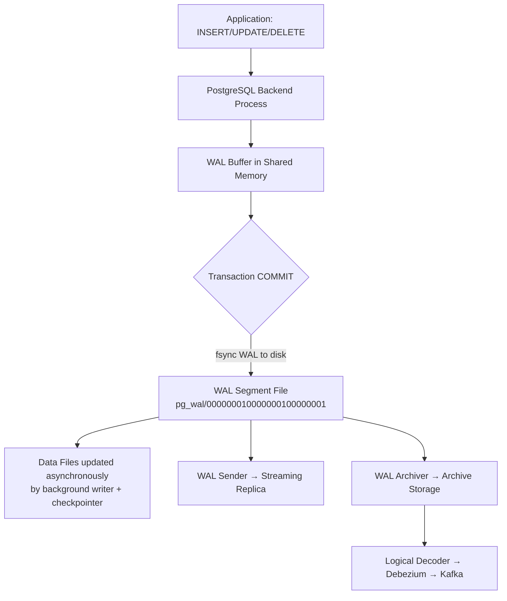
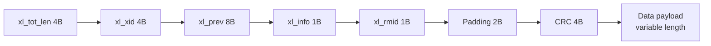
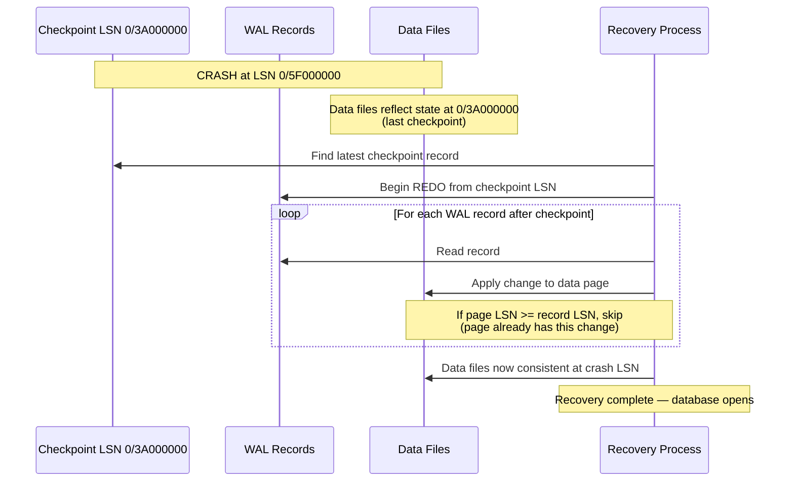
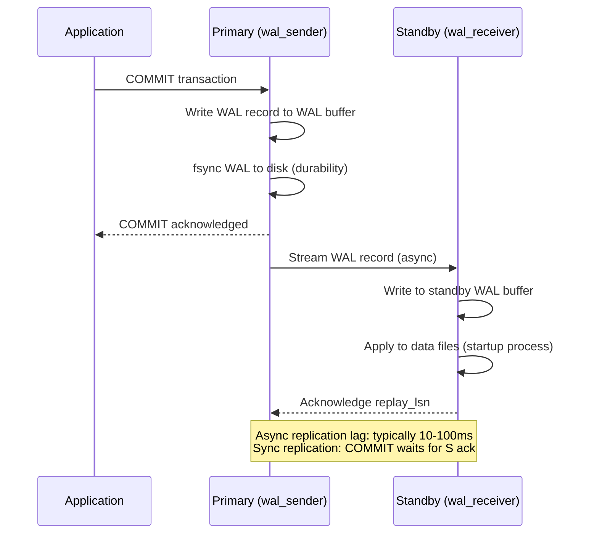
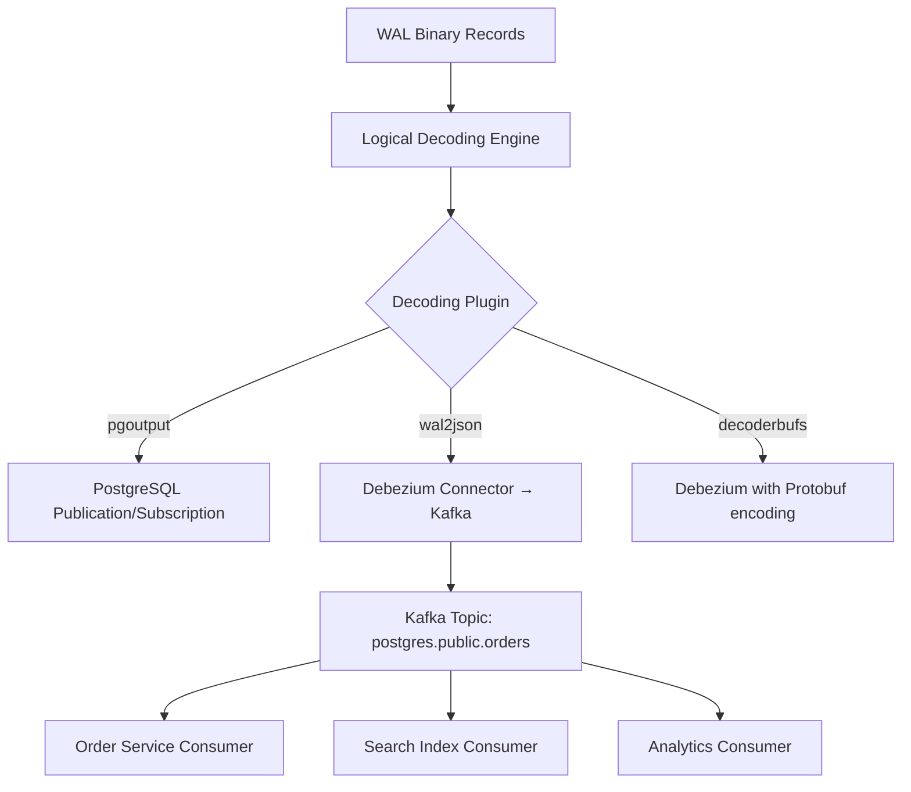
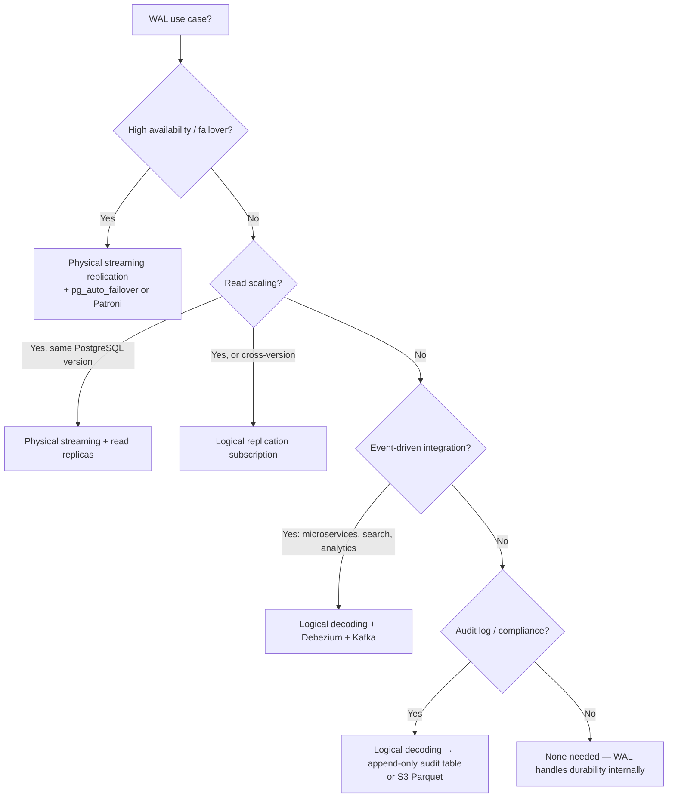

# Write-Ahead Logging: Crash Recovery, Replication, and CDC at Scale

**Every database write you've ever made went to a log before it touched the actual data file.** This is not a PostgreSQL quirk — it is the foundational invariant of every production-grade database system. Understanding WAL is understanding how durability, replication, and change data capture all emerge from the same primitive.

Get WAL wrong operationally — replica falls 20 minutes behind, WAL segments pile up, disk fills at 3am — and you discover these mechanics the hard way.

---

## The Problem Class `[Mid]`

Your PostgreSQL primary is handling 15,000 writes/second. At this rate:
- A crash at any point must lose zero committed transactions
- A read replica must stay within 500ms lag for read-your-writes consistency
- Your event streaming pipeline must capture every row change for downstream microservices

All three requirements are served by the same underlying mechanism: the Write-Ahead Log.



The key insight: **data files are always behind the WAL**. A crash before a checkpoint means data files don't reflect recent commits. WAL replay makes them consistent again.

---

## Why the Obvious Solution Fails `[Senior]`

**Naive approach: write data files synchronously**

If every `COMMIT` fsynced the actual data pages to disk, you'd have durability without WAL. But a single data page is typically 8KB. A transaction touching 100 rows across 30 different heap pages would require 30 random I/O writes to potentially 30 different disk locations.

WAL converts these 30 random writes into a single sequential append — and sequential I/O on spinning disks is 100-1000x faster than random I/O. Even on SSDs, sequential writes have higher throughput and more predictable latency.

**Why "just replicate the data files" doesn't work**:
Replicating at the file block level (like some older MySQL configurations) requires locking pages during transfer, preventing writes, or accepting inconsistency windows. WAL-based replication is the correct primitive: stream the logical change log, apply it at the replica.

---

## WAL Structure Deep Dive `[Senior]`

### LSN: Log Sequence Number

Every WAL record has an **LSN (Log Sequence Number)**: a 64-bit monotonically increasing byte offset into the WAL stream. LSNs identify both WAL position and replication lag.

```
LSN format: 0/3FA12B40
             ^ ^
             | segment number (hex)
             file offset within segment (hex)
```

```sql
-- Current WAL position on primary
SELECT pg_current_wal_lsn();
→ 0/5FA234B8

-- How far behind is the replica?
SELECT
    client_addr,
    state,
    sent_lsn,
    write_lsn,
    flush_lsn,
    replay_lsn,
    pg_size_pretty(sent_lsn - replay_lsn) AS replication_lag_bytes,
    write_lag,
    flush_lag,
    replay_lag
FROM pg_stat_replication;
```

### WAL Segment Files

WAL is written to 16MB segment files (configurable via `wal_segment_size` at `initdb` time, up to 1GB). Filenames encode the timeline and position:

```
000000010000000100000001
^^^^^^^^ ^^^^^^^^ ^^^^^^^^
timeline segment-hi segment-lo
```

Each segment is a fixed-size circular buffer. After a checkpoint, old segments are recycled or archived.

### WAL Record Anatomy

Each WAL record contains:
- **xl_tot_len**: total record length
- **xl_xid**: transaction ID that generated this record
- **xl_prev**: LSN of previous record (for backward scan during recovery)
- **xl_info**: record type (HEAP_INSERT, HEAP_UPDATE, HEAP_DELETE, COMMIT, etc.)
- **xl_rmid**: resource manager ID (Heap, BTree, XLOG, etc.)
- **data**: the actual change (old tuple, new tuple, or both depending on `wal_level`)



---

## The Solution Landscape `[Senior]`

### Solution 1: Crash Recovery via WAL Replay `[Senior]`

**What it is**: When PostgreSQL restarts after a crash, it replays WAL records from the last checkpoint forward to bring data files to a consistent committed state.

**How it actually works at depth**:

Recovery is REDO-only in PostgreSQL. Unlike databases with UNDO logs (Oracle, SQL Server), PostgreSQL never needs to rollback uncommitted transactions in the WAL — because uncommitted changes were never written to data files in a way that would corrupt the committed state. MVCC handles this: uncommitted tuples are visible only to their own transaction.



**Checkpoint mechanics**: A checkpoint flushes all dirty shared_buffers pages to disk and writes a checkpoint record to WAL. This defines the "you can recover from here" boundary. Frequent checkpoints mean shorter recovery time but more I/O during normal operation.

**Sizing guidance** `[Staff+]`:
```
Recovery time estimate:
  wal_generated_between_checkpoints × replay_speed

# replay_speed is typically 3-5x WAL generation speed
# With checkpoint_completion_target=0.9 and checkpoint_timeout=5min:
# Max WAL between checkpoints ≈ checkpoint_timeout × wal_write_rate
# At 50 MB/s WAL: 5 min × 50 MB/s = 15 GB
# Recovery time: 15 GB / (5 × 50 MB/s) = ~60 seconds

# For RTO < 30s: checkpoint_timeout = 2min OR increase checkpoint_completion_target
```

**Configuration decisions that matter** `[Staff+]`:
```
# postgresql.conf
checkpoint_timeout = 5min              # shorter = faster recovery, more I/O
checkpoint_completion_target = 0.9     # spread checkpoint I/O over 90% of interval
max_wal_size = 4GB                    # max WAL between checkpoints (triggers checkpoint)
min_wal_size = 1GB                    # minimum WAL retained (not recycled)
wal_compression = on                  # 30-50% WAL size reduction, ~2% CPU overhead
wal_level = replica                   # minimum for streaming replication
```

**Failure modes** `[Staff+]`:
- **Checkpoint pressure spike**: A bulk load (INSERT 100M rows) generates WAL faster than checkpointer can flush. `max_wal_size` reached, emergency checkpoint triggered, blocking all writes for 1-10 seconds. **Fix**: pre-warm checkpoint before bulk loads, or increase `max_wal_size` temporarily.
- **`full_page_writes` doubling WAL size**: On first write to a page after a checkpoint, PostgreSQL writes the entire 8KB page to WAL (not just the change) to handle partial page writes on crash. This can double WAL volume on write-heavy workloads. Mitigation: use ZFS or ext4 with journaling to guarantee atomic page writes, then set `full_page_writes = off` (risky — only on reliable storage).

**Observability** `[Staff+]`:
```sql
SELECT * FROM pg_stat_bgwriter;
-- Key: checkpoints_timed vs checkpoints_req
-- If checkpoints_req >> checkpoints_timed: max_wal_size too small

SELECT checkpoint_write_time, checkpoint_sync_time
FROM pg_stat_bgwriter;
-- checkpoint_sync_time > 1000ms: storage I/O bottleneck
```

---

### Solution 2: Physical Streaming Replication `[Senior]`

**What it is**: Primary ships WAL bytes to standby; standby replays them, maintaining a byte-for-byte identical data file copy.

**How it actually works at depth**:

The WAL sender process on the primary and WAL receiver process on the standby maintain a persistent TCP connection. WAL records are streamed as they're generated — before the data files are even updated on the primary.



**Synchronous vs Asynchronous**:
- `synchronous_commit = off`: COMMIT returns before WAL is fsynced. Risk of losing last ~200ms of commits on crash. Gain: 2-3x write throughput.
- `synchronous_commit = on` (default): COMMIT waits for WAL fsync on primary only. 0 data loss on primary crash.
- `synchronous_commit = remote_write`: COMMIT waits for replica to receive and write WAL (not fsync). ~10ms extra latency.
- `synchronous_commit = remote_apply`: COMMIT waits for replica to replay WAL. True zero-lag reads. Latency: 20-50ms cross-datacenter.

**Sizing guidance** `[Staff+]`:
```
WAL sender memory per replica:
  wal_sender_timeout = 60s (default)
  wal_keep_size = 1GB (minimum WAL retained for replica catch-up)

# If replica falls behind by > wal_keep_size, it's disconnected
# and needs pg_basebackup to rejoin. Size for:
  wal_keep_size ≥ max_expected_replica_lag_seconds × wal_generation_rate_MB/s

# At 50 MB/s WAL, 5-minute max lag: wal_keep_size = 15GB
```

**Failure modes** `[Staff+]`:
- **WAL retention overflow**: Replica falls behind (maintenance, network partition). Primary recycles WAL the replica needs. Replica disconnects with `ERROR: requested WAL segment already removed`. Requires full `pg_basebackup` (hours for multi-TB databases). **Prevention**: `wal_keep_size` + replication slots (but slots have their own failure mode).
- **Replication slot WAL bloat**: A replication slot prevents WAL recycling until the consumer acknowledges. If the consumer dies, WAL accumulates without bound. **Monitoring**: `pg_replication_slots.pg_size_pretty(pg_wal_lsn_diff(pg_current_wal_lsn(), restart_lsn))` — alert at 5GB, page-on-call at 20GB.

---

### Solution 3: Logical Decoding for CDC `[Senior]`

**What it is**: PostgreSQL decodes WAL binary records into logical change events (INSERT/UPDATE/DELETE per row) that can be consumed by external systems.

**How it actually works at depth**:

`wal_level = logical` enables additional WAL information: old row values for UPDATE/DELETE, and column-level change data. Logical decoding plugins (`pgoutput`, `wal2json`, `decoderbufs`) interpret these WAL records and emit structured change events.



**Debezium + Kafka setup**:
```sql
-- 1. Set WAL level (requires restart)
-- wal_level = logical in postgresql.conf

-- 2. Create publication for CDC
CREATE PUBLICATION debezium_pub
FOR TABLE orders, order_items, customers
WITH (publish = 'insert, update, delete');

-- 3. Debezium creates a replication slot automatically:
-- slot_name: debezium, plugin: pgoutput
```

**CDC event schema**:
```json
{
  "before": {"id": 1001, "status": "pending", "amount": 99.99},
  "after": {"id": 1001, "status": "shipped", "amount": 99.99},
  "source": {
    "db": "orders_db",
    "table": "orders",
    "lsn": "0/5FA23400",
    "txId": 1048576,
    "ts_ms": 1710748800000
  },
  "op": "u"
}
```

**Sizing guidance** `[Staff+]`:
- Logical decoding CPU overhead on primary: **5-15%** at 10K writes/sec (decoding is compute-bound)
- WAL volume increase with `wal_level = logical`: **20-40%** larger records (includes old row values for UPDATE)
- Debezium lag to Kafka: typically **10-50ms** under normal load; spikes to **500ms-5s** during batch inserts
- Recommended: run Debezium on a **logical replica** (Postgres 16+ supports logical replication from standby), not the primary

**Configuration decisions that matter** `[Staff+]`:
```sql
-- Replication slot lag monitoring (CRITICAL)
SELECT
    slot_name,
    pg_size_pretty(pg_wal_lsn_diff(pg_current_wal_lsn(), restart_lsn)) AS wal_retained,
    active,
    catalog_xmin
FROM pg_replication_slots;

-- If wal_retained > 10GB and slot is inactive: DROP REPLICATION SLOT immediately
-- Disk fill from replication slot is the #1 cause of unexpected primary crashes
```

**Failure modes** `[Staff+]`:
- **Schema evolution breaking consumers**: Debezium captures schema at snapshot time. Adding a column with `NOT NULL DEFAULT` changes the schema. If the consumer doesn't handle schema evolution, it deserialization-fails silently. **Fix**: use Schema Registry (Confluent or Redpanda) with compatibility checking.
- **Replication slot indefinite growth**: Debezium is stopped for maintenance. WAL accumulates. Primary disk fills. All writes fail. **Prevention**: set `max_slot_wal_keep_size = 10GB` (PostgreSQL 13+) to auto-invalidate slots that grow too large.

---

## Trade-off Matrix `[Senior]` → `[Staff+]`

| Dimension | Physical Streaming | Logical Replication | Logical Decoding (CDC) |
|---|---|---|---|
| Replica fidelity | Byte-for-byte identical | Row-level consistent | Change stream, not a replica |
| Cross-version support | Same major version only | PostgreSQL 10+, cross-version | Any consumer |
| DDL replication | Yes (all DDL) | No (DDL not replicated) | Requires schema registry |
| Failover capability | Yes (automatic) | Manual promotion | N/A |
| WAL overhead | Base | Base + 20-40% | Base + 20-40% |
| Streaming lag | 10-100ms | 50-500ms | 50-500ms + Kafka |
| Disaster recovery | Yes | No | No |
| Event-driven integration | No | No | Yes |

---

## Decision Framework — When to Pick Each `[Senior]` → `[Staff+]`



---

## Production Failure Story `[Staff+]`

**The replication slot disk fill incident**:

A fintech platform uses Debezium for CDC, consuming from a replication slot on a 4TB PostgreSQL primary. During a planned Debezium upgrade (30-minute maintenance window), the slot was left active but disconnected.

The primary was generating 800 MB/min of WAL (end-of-month batch processing coincided with the maintenance window). The replication slot prevented WAL recycling.

Timeline:
- T+0: Debezium stopped for upgrade
- T+12min: WAL directory at 50% disk (8GB of 16GB reserved WAL space)
- T+28min: WAL directory at 90%
- T+30min: Disk full. PostgreSQL panics with `PANIC: could not write to file "pg_wal/000000010000001200000044": No space left on device`
- T+30min: **Primary crashes. All writes fail. Recovery requires manual intervention.**

**Fix applied**:
```sql
-- Immediate: drop the inactive slot to free WAL
SELECT pg_drop_replication_slot('debezium_slot');

-- Long-term: set max_slot_wal_keep_size
-- postgresql.conf: max_slot_wal_keep_size = 8GB

-- Alert when slot lag > 4GB:
SELECT slot_name,
  pg_wal_lsn_diff(pg_current_wal_lsn(), restart_lsn) / 1024/1024 AS lag_mb
FROM pg_replication_slots
WHERE pg_wal_lsn_diff(pg_current_wal_lsn(), restart_lsn) > 4 * 1024 * 1024 * 1024;
```

**Lesson**: Replication slots are a footgun. Every slot must have monitoring. `max_slot_wal_keep_size` is a critical safety valve introduced in PostgreSQL 13 — it must be set on every production cluster.

---

## Observability Playbook `[Staff+]`

```sql
-- 1. WAL generation rate
SELECT pg_size_pretty(
    pg_wal_lsn_diff(pg_current_wal_lsn(), '0/0') - lag(pg_wal_lsn_diff(pg_current_wal_lsn(), '0/0'))
      OVER (ORDER BY now())
) AS wal_rate;
-- Easier: track pg_stat_archiver.last_archived_wal timing delta

-- 2. Checkpoint frequency and write amplification
SELECT
    checkpoints_timed,
    checkpoints_req,
    checkpoint_write_time / 1000.0 AS write_seconds,
    checkpoint_sync_time / 1000.0 AS sync_seconds,
    buffers_checkpoint,
    buffers_clean,
    buffers_backend
FROM pg_stat_bgwriter;

-- 3. Replication lag in bytes and time
SELECT
    application_name,
    pg_size_pretty(sent_lsn - replay_lsn) AS byte_lag,
    replay_lag
FROM pg_stat_replication
ORDER BY sent_lsn - replay_lsn DESC;

-- 4. Replication slot retention (CRITICAL)
SELECT
    slot_name, active, plugin,
    pg_size_pretty(pg_wal_lsn_diff(pg_current_wal_lsn(), restart_lsn)) AS wal_retained
FROM pg_replication_slots
ORDER BY pg_wal_lsn_diff(pg_current_wal_lsn(), restart_lsn) DESC;
```

**Alert thresholds**:
- Replication lag > 30s: warning; > 5min: critical
- Slot WAL retained > 5GB: warning; > 10GB: critical (drop slot or increase disk)
- `checkpoints_req` / (`checkpoints_timed` + `checkpoints_req`) > 30%: increase `max_wal_size`
- `checkpoint_sync_time` > 5000ms: storage I/O saturation

---

## Architectural Evolution `[Staff+]`

**WAL in the 2026 landscape**:

**Logical replication from standby (PostgreSQL 16)**: CDC tools no longer need to connect to the primary. Logical decoding now works from a physical standby, eliminating the WAL overhead and CPU load of Debezium from the primary. This is a significant architectural unlock for high-write systems.

**eBPF WAL tracing**: Production WAL latency tracing now uses eBPF kprobes on `XLogInsert` and `XLogFlush` kernel calls, exposing sub-microsecond WAL write latency histograms without any application instrumentation. Tools like `bpftrace` and `pyroscope` have made this operational.

**WAL as an event log**: The 2026 platform engineering pattern treats the PostgreSQL WAL as the system's primary event log. Debezium → Kafka → consumer services is replacing dual-write patterns in microservices migrations. "Database-first" event sourcing: the database is the source of truth, CDC publishes events.

**Distributed WAL**: Neon's storage architecture separates WAL storage from compute — WAL is stored in a distributed log service (similar to AWS Aurora's storage layer), allowing compute nodes to be stateless. WAL replay happens in the storage layer. This enables sub-second compute node startup without checkpoint-based recovery.

**Rust WAL implementations**: PolarDB and other open-source PostgreSQL forks are reimplementing WAL I/O paths in Rust for predictable latency tail — eliminating the `fsync` latency spikes that cause P99 write latency to spike 10-50x under memory pressure.

---

## Decision Framework Checklist `[All Levels]`

- [ ] Set `wal_level = replica` minimum; `logical` only if CDC or logical replication needed (WAL size cost ~40%)
- [ ] Configure `max_wal_size` based on acceptable recovery time: RTO 30s = 1GB; RTO 5min = 15GB
- [ ] Set `wal_compression = on` — saves 30-50% WAL disk I/O, ~2% CPU, net positive on most systems
- [ ] Monitor `checkpoints_req` vs `checkpoints_timed` — frequent unplanned checkpoints indicate `max_wal_size` too small
- [ ] Set `max_slot_wal_keep_size = 10GB` on every cluster using replication slots
- [ ] Alert on replication slot WAL retained > 5GB
- [ ] Alert on replica lag > 60 seconds (replication breakage warning)
- [ ] Test WAL archiver with `pg_basebackup` recovery in staging — verify recovery time meets RTO
- [ ] For CDC: never point Debezium at primary in PostgreSQL 16+ — use logical replication from standby
- [ ] For synchronous replication: use `synchronous_commit = remote_write` not `remote_apply` unless read-your-writes is critical (latency cost is 2-3x)

---
*Written by Gaurav Porwal — 10+ Year Engineer | Tech Lead | Product Owner | Business-Minded Builder*
*Last updated: 2026-03-18*
