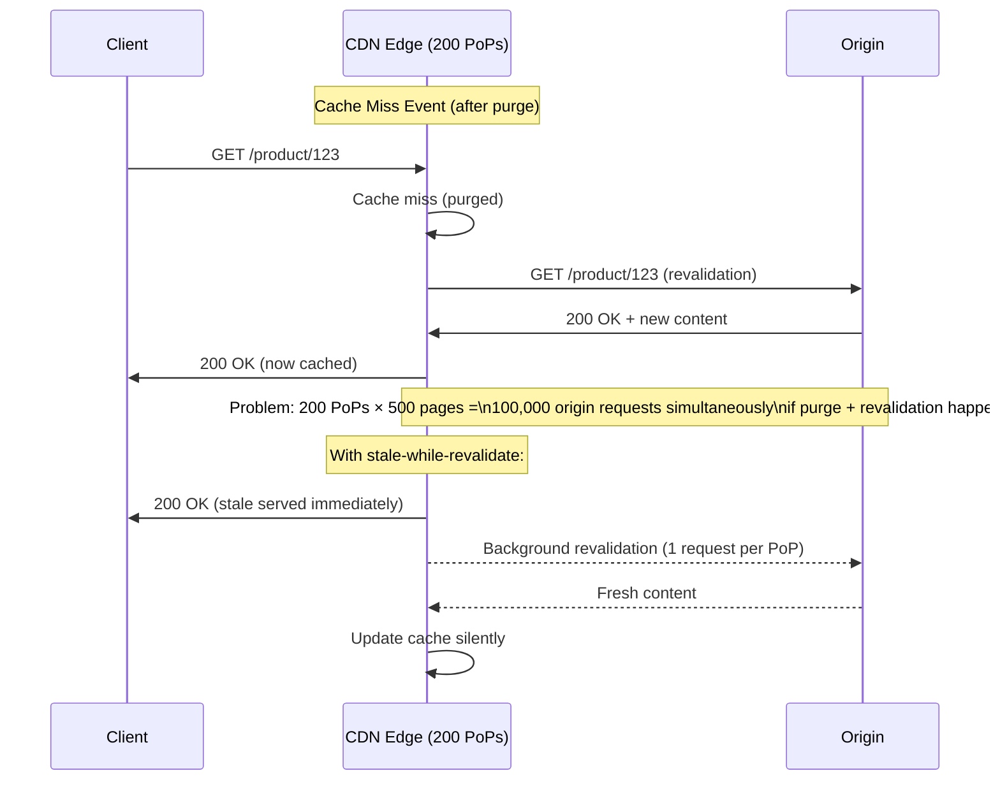
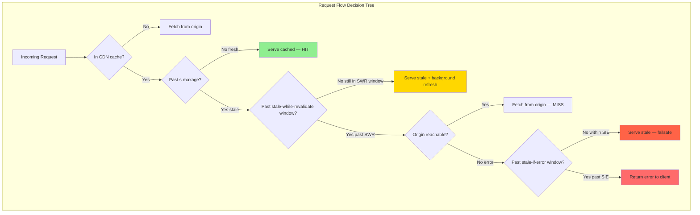
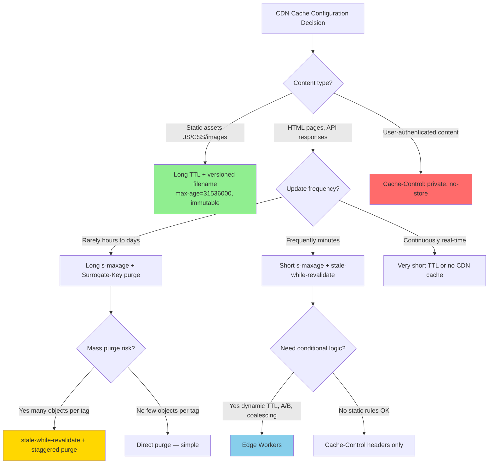

# CDN Caching Deep Dive: Cache-Control, Edge Logic, and Purge Strategies

**Your CDN absorbs 95% of traffic — until you push a content update and it becomes a 95% traffic amplifier pointing at your origin. CDN caching is not just setting max-age; it's designing the contract between origin, edge, and client so that purge, update, and fallback behave correctly under every failure mode.**

---

## The Problem Class `[Mid]`

E-commerce platform. 500 product pages. 50,000 requests/second across 200 CDN PoPs globally. Origin handles 2,500 req/sec (5% miss rate — CDN absorbs the rest).

A content team updates product descriptions for all 500 products. They click "Publish All". Your system sends 500 cache purge requests to the CDN API.

What happens next determines whether this is routine or a P0 incident:

**Scenario A** (naive): 500 purges complete. All 500 product pages become cache misses simultaneously. 50,000 req/sec × 5% miss rate baseline was 2,500 req/sec to origin. But now 500 *specific* pages have 100% miss rate. For popular pages, each carries 200 req/sec to origin = 100,000 req/sec suddenly. Origin is sized for 2,500 req/sec. Origin falls over.

**Scenario B** (thoughtful): Purges are staggered. `stale-while-revalidate` allows CDN to serve stale while fetching fresh. Only 1 revalidation request per PoP per page goes to origin = 500 pages × 200 PoPs = 100,000 revalidations spread over 30 seconds = 3,333/sec. Origin handles it.



The CDN is not a passive component. How you configure `Cache-Control` headers determines whether the CDN protects or endangers your origin.

---

## Why the Obvious Solution Fails `[Senior]`

**"Just set max-age=3600 and forget about it"**: Works for truly static content. Fails for:
- News articles that require corrections within minutes
- Product inventory/pricing that changes intraday
- User-generated content that may be removed (DMCA, moderation)
- A/B test variants that need controlled rollout

**"Delete the file and CDNs will fetch fresh"**: Deleting a URL from your origin doesn't tell CDNs to purge. CDNs serve cached content regardless of origin state until TTL expires or explicit purge.

**"Send a purge API call after every write"**: At low write rates, fine. At 1,000 writes/minute, you're sending 1,000 purge API calls/minute. CDN APIs have rate limits (Fastly: 1,000 purge requests/sec; CloudFront: 3,000 paths/distribution/month on standard, unlimited on Advanced). More importantly, 1,000 simultaneous purges → 1,000 simultaneous origin misses.

**"Use very short TTL (30s) to avoid needing purge"**: 500,000 req/sec × (1/30) miss rate = 16,667 origin req/sec. You've destroyed your CDN's benefit.

---

## The Solution Landscape `[Senior]`

### Solution 1: Cache-Control Header Architecture

**What it is**: A structured set of HTTP response headers that tell browsers, proxies, and CDNs exactly how to cache content, when it expires, and how to handle failures.

**How it actually works at depth**:

The key directives and their semantic contracts:

```
Cache-Control: public, max-age=300, s-maxage=3600, stale-while-revalidate=60, stale-if-error=86400
```

Breaking this down:
- `public`: Cacheable by shared caches (CDNs). Required for CDN caching. Without it, CDN treats content as private.
- `max-age=300`: Browser caches for 5 minutes. After 5 minutes, browser revalidates with conditional GET.
- `s-maxage=3600`: CDN caches for 1 hour (overrides max-age for shared caches). CDN is the authoritative keeper; browser refreshes frequently.
- `stale-while-revalidate=60`: If CDN cache is stale (past s-maxage), serve stale content immediately AND fetch fresh in background. Client sees no latency; background fetch happens concurrently. Window of staleness = up to 60 additional seconds after s-maxage expires.
- `stale-if-error=86400`: If origin returns 5xx or is unreachable, serve stale cache for up to 24 hours. This is your availability backstop.

**Directive interaction matrix**:



**Sizing guidance** `[Staff+]`:

CDN cache efficiency calculation:
```
cache_hit_ratio = 1 - (origin_qps / total_qps)
origin_qps = total_qps × (1 / avg_ttl_seconds) × avg_objects_in_flight

Example:
- 50K total req/sec
- 10K unique URLs
- avg s-maxage = 3600s
- avg simultaneous requests per URL = 50K / 10K = 5

Theoretical miss rate = (10K unique URLs) / (10K × 3600s per TTL) = 0.0003/sec = 2.7 misses/sec
Actual miss rate higher due to TTL distribution, cold starts, purges

Real-world: Aim for > 95% hit rate. Below 85% = review TTL strategy.
```

**Configuration decisions that matter** `[Staff+]`:

Separate `s-maxage` from `max-age`:
```
# Content that changes daily
Cache-Control: public, max-age=60, s-maxage=86400, stale-while-revalidate=300

# Rationale:
# CDN holds for 24h (s-maxage=86400) — reduces origin load
# Browser revalidates every 60s — reduces browser-level staleness
# SWR=300: CDN serves stale up to 5min extra while fetching fresh
```

For authenticated pages — **never cache at CDN layer**:
```
Cache-Control: private, no-store
# OR for user-specific API responses:
Cache-Control: no-cache  # allow revalidation but don't cache
Vary: Authorization, Cookie  # CDN varies cache by these headers
```

**Warning on `Vary` header**: Using `Vary: Accept-Encoding` is safe (CDN caches gzip and brotli versions separately). Using `Vary: Cookie` tells CDN to cache a separate copy for each unique cookie value — which means every logged-in user gets their own CDN cache entry. CDN cache becomes useless for personalized content.

**Failure modes** `[Staff+]`:
- **Cache poisoning via `Vary: Host`**: If CDN is configured to cache varying by `Host` header, an attacker who controls a host header (via request smuggling or misconfigured proxy) can inject malicious content into the cache for legitimate host names.
- **Stale-while-revalidate false security**: `stale-while-revalidate` only triggers background refresh once per CDN node. Under extremely high traffic, the same PoP may serve millions of requests with stale content during the revalidation window if the background fetch is slow.

**Observability** `[Staff+]`:
- `X-Cache: HIT` vs `MISS` vs `STALE` in CDN response headers — log and aggregate
- CDN hit rate by URL pattern (group by path prefix)
- Revalidation rate: how often is SWR triggering background fetches?
- Origin response time p99: spikes correlate with purge events

---

### Solution 2: Surrogate-Key / Cache-Tag Purging

**What it is**: Tag cached objects with semantic keys (surrogate keys). Purge by tag rather than by URL. A single API call purges all objects bearing a tag, regardless of their URLs.

**How it actually works at depth**:

Origin adds a custom header on each response:
```http
HTTP/1.1 200 OK
Cache-Control: public, s-maxage=3600
Surrogate-Key: product-123 category-electronics author-gaurav
Content-Type: text/html
```

CDN stores the tags alongside the cached object. When the product `123` is updated:
```bash
# Fastly
curl -X POST https://api.fastly.com/service/{id}/purge \
  -H "Surrogate-Key: product-123" \
  -H "Fastly-Key: {api_token}"
# Purges ALL objects tagged with product-123 across all PoPs globally

# Varnish (on-premise)
PURGE /purge/tag HTTP/1.1
Host: varnish-host
X-Purge-Tag: product-123
```

**Multi-tag invalidation**:
```
Product page /product/123 is tagged with: product-123, category-electronics, brand-sony
Category page /category/electronics is tagged with: category-electronics

When product 123 price changes:
→ Purge tag: product-123
→ Removes: /product/123 only (correct)

When electronics category layout changes:
→ Purge tag: category-electronics
→ Removes: /product/123, /category/electronics, all electronics product pages
```

**Sizing guidance** `[Staff+]`:

Fan-out calculation for surrogate-key purge:
```
objects_purged = tagged_objects_per_key × PoP_count

At Fastly with 200 PoPs:
- tag: product-123 → 5 objects (product page, API, thumbnails, sidebar widget, breadcrumb)
- purge: 5 × 200 = 1,000 cache evictions globally

For category-level purge:
- tag: category-electronics → 5,000 product pages
- purge: 5,000 × 200 = 1,000,000 cache evictions
- Post-purge origin load = 5,000 pages × (misses before SWR kicks in) × request rate

If 5,000 pages × 10 req/sec each = 50,000 req/sec hitting origin post-purge
→ Origin must handle 50,000 req/sec (likely overwhelming it)
```

**Mitigation for large-tag purge storms**: Use `stale-while-revalidate` + **purge with grace**. Instead of immediately invalidating, mark as stale-and-revalidating. CDN serves stale while fetching fresh — exactly 1 origin request per PoP per object. 5,000 objects × 200 PoPs = 1,000,000 revalidations, but spread over minutes as individual PoPs receive traffic.

**Varnish `xkey` module** (enterprise Varnish): Supports tag-based purging with atomic invalidation and configurable purge ordering. More control than Fastly's native Surrogate-Key.

**Configuration decisions that matter** `[Staff+]`:
- Keep tag sets small per object (< 10 tags). Large tag sets increase CDN memory per cached object.
- Use hierarchical tags: `product-123`, `category-electronics`, `brand-sony` — enables targeted purge at any level of specificity.
- For Cloudflare: use `Cache-Tag` header. For Fastly: `Surrogate-Key`. For CloudFront: CloudFront doesn't natively support tag purge — must use Lambda@Edge to inject headers and custom invalidation logic.

**Failure modes** `[Staff+]`:
- **Tag drift**: A new page type is deployed that should carry tag `product-123` but doesn't. Future purges for product-123 miss this page. Silent staleness.
- **Accidental global purge**: A bug in the tag-assignment code sets `Surrogate-Key: all-content` on every response. An operator purges a single product — all CDN cache is evicted globally. Origin collapses.

---

### Solution 3: Edge Computing — Logic at the CDN

**What it is**: Run code at the CDN edge layer (Cloudflare Workers, Fastly Compute, Lambda@Edge) to implement cache logic that cannot be expressed in static headers.

**Use cases**:
- A/B test routing without origin round-trip
- Personalized cache vary (by user segment, not individual cookie)
- Request coalescing (hold N identical requests, fetch once, respond to all)
- Cache warming (pre-fetch URLs on deploy event)
- Dynamic TTL based on response payload (e.g., shorter TTL if inventory < 10)

**How it actually works at depth** (Cloudflare Workers example):

```javascript
// Cloudflare Worker: Dynamic TTL based on inventory
export default {
  async fetch(request, env, ctx) {
    const cache = caches.default;
    let response = await cache.match(request);

    if (!response) {
      response = await fetch(request);
      const body = await response.json();

      // Dynamic TTL: low inventory = shorter cache time
      const ttl = body.inventory < 10 ? 30 : 3600;
      const headers = new Headers(response.headers);
      headers.set('Cache-Control', `public, s-maxage=${ttl}, stale-while-revalidate=60`);

      response = new Response(JSON.stringify(body), {
        status: response.status,
        headers
      });

      ctx.waitUntil(cache.put(request, response.clone()));
    }
    return response;
  }
}
```

**Request coalescing at edge** — solving the multi-PoP purge storm:
```javascript
// Coalesce: hold concurrent requests for same URL, fetch once
const inFlight = new Map();

async function coalesceRequest(url) {
  if (inFlight.has(url)) {
    return inFlight.get(url);  // return same promise to all waiting
  }
  const promise = fetch(url).finally(() => inFlight.delete(url));
  inFlight.set(url, promise);
  return promise;
}
```

**Sizing guidance** `[Staff+]`:
- Cloudflare Workers: 0 ms cold start (V8 isolates), 10ms CPU time limit per request (50ms on paid plans), 128MB memory. 99th percentile execution: < 5ms.
- Fastly Compute (WASM): < 1ms cold start, 50ms wall time budget. Ideal for latency-sensitive edge logic.
- Lambda@Edge: 100–1000ms cold start (Lambda JVM or container), 5s timeout for viewer-request/viewer-response, 30s for origin-request/origin-response. Latency impact for cold starts is significant.

**Failure modes** `[Staff+]`:
- **Worker CPU limit exceeded**: Cloudflare Workers have a 10ms CPU limit. Complex logic (JSON parsing of large bodies, regex on large strings) can exceed this, causing the request to fall through to origin unprocessed.
- **Edge cache inconsistency**: Cloudflare Workers `caches.default` is scoped per PoP, not global. Purging via Workers API only affects the local PoP's cache unless you explicitly call the Cloudflare global purge API.
- **Infinite loop risk**: Worker fetches from origin. Origin URL passes through the same Worker. Worker calls itself. Rate limit kicks in. 1,000 subrequests per request limit in Cloudflare Workers prevents infinite loops but can exhaust fan-out budgets.

---

## Trade-off Matrix `[Senior]` → `[Staff+]`

| Dimension | Short TTL (≤ 60s) | Long TTL + Tag Purge | stale-while-revalidate | Edge Workers |
|---|---|---|---|---|
| Stale window | 0–60s | Near-zero (on purge) | s-maxage + SWR window | Configurable |
| Origin load | High (1/TTL per object) | Low (burst on purge) | Low (background, 1/PoP) | Depends on logic |
| Purge storm risk | N/A | High on mass purge | Low (SWR absorbs) | Mitigated by coalescing |
| Global consistency | Eventually (TTL) | Fast (< 150ms on Fastly) | Eventual + grace | Programmatic |
| Implementation complexity | Low | Medium | Low | High |
| Cost | Higher origin cost | CDN API calls + storage | CDN storage | Workers compute cost |
| Cache poisoning surface | Low | Low | Low | Medium (code runs at edge) |

---

## Decision Framework `[Senior]` → `[Staff+]`



---

## Production Failure Story `[Staff+]`

**The Global Cache Wipe — Media Platform, 2024**

**Context**: News platform. 2M articles cached on Cloudflare. Average `s-maxage=3600`. 800K req/sec globally. Origin: 50 app servers, each handling 1,600 req/sec max = 80K req/sec total origin capacity.

**Setup**: Platform deployed a new byline format. Content team requested all article pages be purged so the new format would show. Engineer sent: `POST /zones/{id}/purge_cache` with `{"purge_everything": true}`.

**What happened**:
- T+0s: `purge_everything` call completes. All 2M cached articles evicted globally across 200 Cloudflare PoPs.
- T+0s to T+30s: 800K req/sec hitting the CDN, 100% miss rate. All 800K req/sec forwarded to origin.
- T+5s: Origin servers at 10× capacity (800K vs 80K max). Response times climb from 50ms to 30s.
- T+8s: Cloudflare's origin timeout (30s) not yet triggered. Connections pile up. Origin load balancer queue depth: 250,000 requests.
- T+15s: First origin servers start OOM-crashing under connection pressure.
- T+20s: 40% of origin fleet down. Remaining servers unable to handle load. CDN starts returning 503s.
- T+2m: Cloudflare serves 503 responses. Platform is down.
- Recovery: Cloudflare's own [Always Online] served stale cache from a separate copy — partially mitigated. Origin fleet took 35 minutes to recover as servers were cycled.

**Root cause**: `purge_everything` is a global nuclear option. The engineer intended to purge "all content" without understanding that 2M × 200 PoPs = 400M evictions simultaneously, with no stale-while-revalidate safety net.

**Fix implemented**:
1. `purge_everything` removed from any human-accessible tooling. Requires director approval + scheduled maintenance window.
2. All article pages now carry: `stale-while-revalidate=300, stale-if-error=86400`
3. Purge workflow replaced with Surrogate-Key tag-based purge, max 10K objects per batch, 5-second delay between batches
4. Origin autoscaling policy: scale-out trigger at 60% capacity (was 90%)

---

## Observability Playbook `[Staff+]`

**CDN-level metrics** (via CDN analytics API or log forwarding):
```
cdn_hit_rate{path_prefix, method}              # target > 95%
cdn_origin_requests_per_second{path_prefix}    # baseline, alert on spikes
cdn_cache_status{status}                       # HIT / MISS / STALE / EXPIRED / BYPASS

# Per-PoP view
cdn_hit_rate_by_pop{pop_id}                    # detect regional cache issues
cdn_origin_rtt_by_pop{pop_id}                  # PoP → origin latency
```

**Purge event tracking**:
```
purge_events_total{trigger, scope}             # count by URL / tag / global
purge_objects_affected_estimate{tag}           # estimate objects per purge
purge_to_origin_request_correlation            # did purge cause origin spike?

# Alert: if purge_objects_affected > 10K → require review
# Alert: if origin_requests spikes > 2× within 5min of purge event → investigate
```

**Stale serving metrics**:
```
cdn_stale_served_ratio{path_prefix}           # what fraction of responses are stale?
cdn_swr_background_fetch_rate{path_prefix}    # how often is SWR triggering fetches?
```

---

## Architectural Evolution `[Staff+]`

**2016–2020**: `Cache-Control: max-age=N`. Set TTL, accept staleness. Purge via URL-by-URL API calls. Primitive.

**2020–2022**: Surrogate-Key / Cache-Tag adoption for intelligent purging. CDN providers built tag-based invalidation as first-class APIs. Fastly's Instant Purge (< 150ms global propagation) made real-time invalidation viable.

**2022–2024**: Edge computing matured. Cloudflare Workers and Fastly Compute moved cache logic to the edge. Request coalescing, dynamic TTL, A/B caching — all without origin round-trips.

**2025–2026 patterns**:
- **Cloudflare Cache Rules 2.0**: Declarative rule engine for cache behavior — no code required. Define TTL, SWR, stale-if-error by URL pattern, request headers, geolocation. Replaces most Workers use-cases with configuration.
- **Cloudflare R2 + Cache API**: Store content in R2 (S3-compatible, no egress fees). Cache API serves R2 objects at edge. Eliminates origin entirely for static + semi-static content.
- **Perma-cache patterns**: Immutable content URLs (versioned filenames + `max-age=31536000, immutable`) with instant redirect updates at CDN level (302 from `/product/image/latest` to `/product/image/v42`). Zero TTL compromise for large binary assets.
- **AI-driven cache TTL**: Experimental — ML models predict optimal TTL per content type based on update frequency patterns. Cloudflare has early access programs. Not production-ready in 2026 but expected mainstream by 2027.
- **HTTP/3 QUIC cache hints**: QUIC's stream multiplexing allows CDN to push cache-refreshed responses to persistent connections, enabling sub-100ms cache refresh propagation to active clients without polling.

---

## Decision Framework Checklist `[All Levels]`

- [ ] **Audit all response headers**: Does every cacheable response have explicit `Cache-Control`? Missing headers = CDN chooses defaults (often conservative = no cache).
- [ ] **Separate `s-maxage` from `max-age`**: CDN TTL and browser TTL serve different purposes; decouple them.
- [ ] **Add `stale-while-revalidate`**: For all content that can tolerate a few seconds of staleness on revalidation. Eliminates revalidation latency spikes.
- [ ] **Add `stale-if-error`**: Minimum 1 hour. Protects against origin failures returning errors to users.
- [ ] **Never use `purge_everything` in production scripts**: Require human review. Use tag-based purge instead.
- [ ] **Calculate post-purge origin load**: (objects_purged × request_rate_per_object) vs origin capacity. Stagger if > 50% origin capacity.
- [ ] **Implement Surrogate-Key tagging**: For any content that is updated independently of its URL.
- [ ] **Monitor per-PoP hit rate**: Regional anomalies indicate misconfigured routing or origin connectivity issues.
- [ ] **Test `stale-if-error` fallback**: Kill your origin. Verify CDN serves stale. Measure stale window.
- [ ] **Review `Vary` header usage**: Any `Vary` on high-cardinality values (Cookie, Authorization) destroys CDN efficiency.

---
*Written by Gaurav Porwal — 10+ Year Engineer | Tech Lead | Product Owner | Business-Minded Builder*
*Last updated: 2026-03-18*
