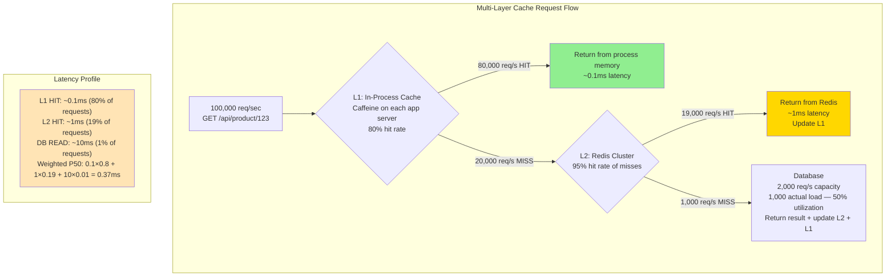
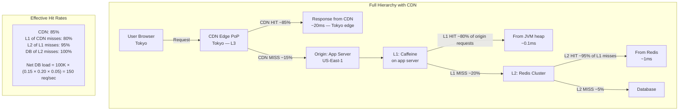
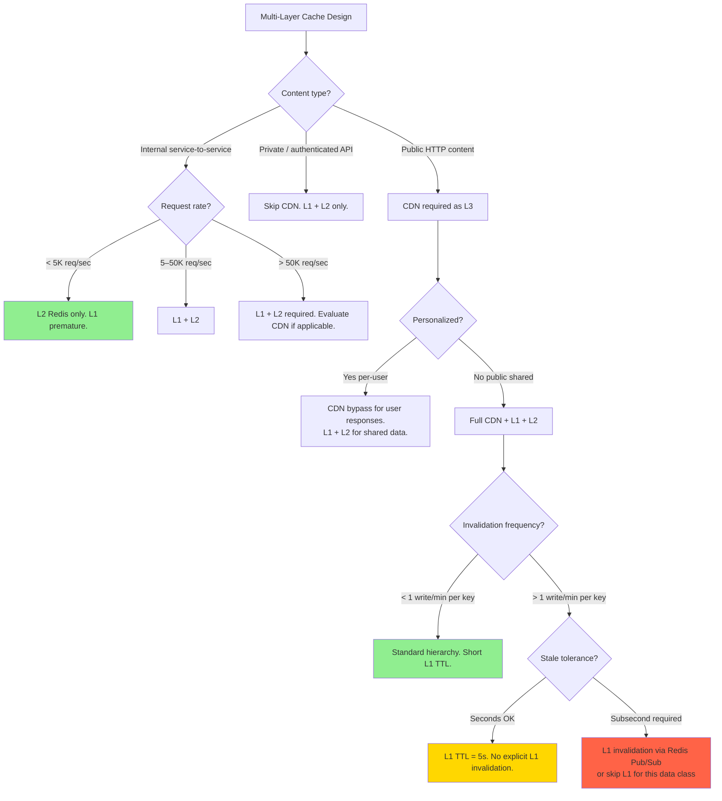

# Multi-Layer Caching: L1/L2/CDN Hierarchies and Coherence at Scale

**A single cache layer absorbs 80% of traffic. Two cache layers absorb 98%. Three layers absorb 99.7%. The math is compelling — but each additional layer adds a consistency surface that, if mismanaged, serves stale data from the wrong layer without anyone noticing for hours.**

---

## The Problem Class `[Mid]`

You have an API serving product catalog data. 100,000 req/sec. Database handles 2,000 req/sec. Without caching: 98,000 requests rejected or timed out every second.

With a single Redis layer (L2) at 97% hit rate: 3,000 cache misses/sec hit the database. Still over capacity.

Adding L1 in-process cache on your 50 app servers: L1 hits 80% of requests, L2 hits 95% of L1 misses. Net miss rate: `(1 - 0.80) × (1 - 0.95) = 0.20 × 0.05 = 1%` = 1,000 req/sec to database. Now well within capacity.



> 💡 **What this means in practice:** Multi-layer caching isn't just about reducing DB load — it compounds hit rates multiplicatively. An L1 with 80% hit rate plus an L2 with 95% hit rate of remaining traffic doesn't give you 80% + 95% = 175% — it gives you 80% + (20% × 95%) = 99% effective hit rate. Each layer covers what the previous layer misses.

---

## Why the Obvious Solution Fails `[Senior]`

**"Just make the single cache bigger"**: A single Redis cluster can be scaled to hundreds of nodes. But every request still makes a network hop to Redis (~1ms). L1 in-process cache eliminates that network hop for hot keys (~0.1ms). For 100K req/sec, 0.9ms difference × 80% L1 hit rate = 72 seconds of latency saved every second across the fleet. More importantly, Redis CPU and network are finite; local memory is effectively free for hot data.

**"Use CDN for everything"**: CDN is L3 in the hierarchy — it works for publicly cacheable content. But:
- Authenticated API responses can't be CDN-cached
- Personalized data varies by user
- Write-heavy workloads don't benefit from CDN caching
- CDN adds geo-distribution complexity for internal service caches

**"Multi-layer caching is premature optimization"**: At < 5K req/sec, probably true. At > 50K req/sec, the math consistently justifies L1. The real risk is not the L1 caching itself — it's the coherence complexity introduced when data changes.

The coherence problem: You write new data to the database. You invalidate L2 (Redis). But 50 app servers each have their own L1 holding stale data. Users on different app servers see different data for up to 5 seconds (L1 TTL). This is usually acceptable for product descriptions; not for inventory counts.

---

## The Solution Landscape `[Senior]`

### Solution 1: L1 In-Process Cache (Caffeine/Guava)

**What it is**: An in-memory cache within each application process. Caffeine (Java) is the de facto standard with near-optimal eviction (W-TinyLFU), async refresh, and stats. Similar: Guava Cache, Node.js `lru-cache`, Python `cachetools`, Go `ristretto`.

**How it actually works at depth**:

```java
// Caffeine cache configuration for product catalog
LoadingCache<String, Product> productCache = Caffeine.newBuilder()
    .maximumSize(100_000)                        // max 100K entries
    .expireAfterWrite(Duration.ofSeconds(5))     // TTL: 5 seconds
    .refreshAfterWrite(Duration.ofSeconds(4))    // async refresh at 4s (before expiry)
    .recordStats()                               // enable hit/miss metrics
    .build(key -> {
        // Cache miss: fetch from L2 (Redis) or DB
        Product p = redisCache.get(key);
        if (p == null) p = database.getProduct(key);
        return p;
    });

// Read — single line, all cache layers handled internally:
Product product = productCache.get("product:123");
// L1 hit: ~0.1ms
// L1 miss → L2 fetch → 1ms, populate L1
// L1+L2 miss → DB fetch → 10ms, populate L2 and L1
```

> 💡 **What `refreshAfterWrite` does:** Instead of expiring the key and forcing the next request to wait for a DB fetch, Caffeine returns the stale value immediately and starts a background refresh. No user experiences the 10ms DB latency — the cache silently refreshes behind the scenes. This is the Caffeine-native version of stale-while-revalidate.

**Sizing guidance** `[Staff+]`:

L1 cache hit rate estimation:
```
hit_rate depends on: working set size vs L1 cache size

Working set = number of unique keys accessed in L1 TTL window
At 100K req/sec, L1 TTL=5s:
Unique keys requested in 5s = depends on access distribution

For Zipf distribution (typical in e-commerce):
- Top 10% of products account for 90% of traffic
- If catalog has 1M products: hot products = 100K
- L1 cache of 100K entries covers the hot set completely
- Expected L1 hit rate: 88-92%

For uniform distribution:
- Hot set = all products equally likely
- At 100K req/sec and 5s TTL: 500K unique requests in 5s
- L1 of 100K covers 20% of unique requests
- Expected L1 hit rate: 20% (poor — Zipf is more realistic)

Rule of thumb: L1 hit rate = fraction of hot keys that fit in L1
Set L1 size to top-N keys by access frequency.
```

Memory sizing:
```
L1 memory = maximumSize × avg_entry_size × overhead_factor

Caffeine overhead: ~200 bytes per entry (key, value reference, statistics, linked list nodes)
Product object size: 2KB average

At 100K entries:
= 100K × (2,048 + 200) = 225MB per JVM heap

For 50 app servers: 225MB × 50 = 11.25GB total RAM across fleet
vs Redis cluster: same 100K entries × 2KB = 200MB at cluster level (shared)

L1 uses more total memory but eliminates network hops for 80%+ of reads.
```

**Configuration decisions that matter** `[Staff+]`:
- `expireAfterWrite` vs `expireAfterAccess`: Use `expireAfterWrite` (absolute TTL). `expireAfterAccess` extends TTL on every access, allowing hot keys to live indefinitely — creates invisible stale data risk.
- `maximumSize` is critical: too small = low hit rate; too large = JVM memory pressure + GC. Profile heap usage under load and set to P90 of what fits in 20% of heap.
- `weakValues()` / `softValues()`: Allows GC to evict cache entries under memory pressure. Sounds good, but makes hit rate non-deterministic. Only use if your app has extremely variable memory profiles.

**Failure modes** `[Staff+]`:
- **Stale data across app servers**: Server A updates a product. L2 (Redis) is invalidated. But Servers B-Z each have their own L1 still holding the stale version. Users on B-Z see old data for up to 5 seconds (L1 TTL).
  - Mitigation: Accept the L1 TTL staleness window, OR implement L1 invalidation via Redis Pub/Sub.
- **Cold start stampede**: New app server starts with empty L1. All requests go to L2/DB for the first 5 seconds (L1 warm-up). At 100K req/sec with 1 new instance, that instance sends 100K req/sec to Redis until L1 warms. See `cache-stampede-prevention.md`.
- **GC pauses with large L1**: A 500MB L1 with frequent GC increases stop-the-world pause duration. Use GC-tuned settings (`G1GC` with `MaxGCPauseMillis=50`). Consider `off-heap` caches (OHC — Off-Heap Cache) for very large L1s.

**Observability** `[Staff+]`:
```java
// Expose Caffeine stats via Micrometer:
CaffeineStatsCounter stats = new CaffeineStatsCounter();
Cache<String, Product> cache = Caffeine.newBuilder()
    .recordStats(() -> stats)
    .build();

// Metrics available:
// cache.hitCount(), cache.missCount(), cache.hitRate()
// cache.loadSuccessCount(), cache.averageLoadPenalty()
// cache.evictionCount(), cache.estimatedSize()
```

---

### Solution 2: L2 Distributed Cache (Redis Cluster)

**What it is**: The shared distributed cache tier. Data is available across all application instances (unlike L1 which is per-process). Provides consistent reads and supports invalidation.

**How it actually works at depth**:

The L2 layer's role in a multi-layer hierarchy:
- Absorbs L1 misses — prevents DB overload
- Provides cross-instance consistency (unlike per-process L1)
- Serves as the authoritative cache layer for invalidation
- Holds larger data sets than L1 (more memory, not bounded by JVM heap)

```python
# L2 cache integration with L1 coherence
class MultiLayerCache:
    def __init__(self, l1_cache, redis_client):
        self.l1 = l1_cache  # in-process LRU
        self.l2 = redis_client

    def get(self, key: str) -> Optional[bytes]:
        # Try L1 first
        value = self.l1.get(key)
        if value is not None:
            return value  # L1 hit — ~0.1ms

        # L1 miss — try L2
        value = self.l2.get(key)
        if value is not None:
            self.l1.set(key, value, ttl=5)  # populate L1
            return value  # L2 hit — ~1ms

        return None  # both miss — caller queries DB

    def set(self, key: str, value: bytes, l2_ttl: int = 3600) -> None:
        self.l2.setex(key, l2_ttl, value)    # write to L2
        self.l1.set(key, value, ttl=5)        # write to L1

    def invalidate(self, key: str) -> None:
        self.l2.delete(key)                   # remove from L2
        self.l1.delete(key)                   # remove from local L1
        # Note: other app server's L1 are NOT invalidated here
        # They will see stale data until their L1 TTL expires
```

**Sizing guidance** `[Staff+]`:

L2 sizing with L1 offloading:
```
Without L1: L2 must handle all 100K req/sec
Required L2 nodes = ceil(100K / 200K_per_node) = 1 node minimum, 2 for HA

With L1 at 80% hit rate: L2 handles 20K req/sec
Required L2 nodes = ceil(20K / 200K_per_node) = 1 node
Savings: Can run smaller Redis cluster with same effective throughput

Memory savings (L2 perspective):
Without L1: L2 holds full hot set (100K entries × 2KB = 200MB)
With L1: L2 still holds full hot set (L1 populates from L2)
Memory savings = 0 (both layers hold same data)

The benefit is reduced L2 operations, not reduced L2 memory.
```

---

### Solution 3: L3 CDN Cache

**What it is**: The outermost cache layer. Handles publicly cacheable HTTP responses. Geographically distributed — serves content from the edge closest to the user.

**How it actually works at depth**:



> 💡 **What this means in practice:** With a full three-layer hierarchy (CDN + L1 + L2), 99.85% of requests never reach your application servers at all (CDN serves them). Of the 0.15% that reach your app, 80% are served by L1. Of the remainder, 95% are served by L2. Only 150 out of 100,000 requests per second hit your database. That's a 667× reduction in DB load.

**Coherence across three layers** `[Staff+]`:

The hard problem: when a product is updated, you must invalidate across all three layers:

```
L2: Redis DEL product:123  → immediate, synchronous, effective in < 1ms
L1: Redis Pub/Sub → each app server clears its L1 entry → effective in < 100ms
CDN: CDN API purge (Fastly/Cloudflare) → effective globally in 100–500ms

Coherence window (time from write to all layers reflecting new data):
= max(L2_invalidation, L1_invalidation, CDN_purge)
= ~500ms (dominated by CDN propagation)

After 500ms, all layers serve the updated data.
```

Ordering matters: invalidate outer layers first, inner layers last:
1. CDN purge (takes longest to propagate)
2. L2 delete (immediate)
3. L1 invalidation via Pub/Sub (fast)

If you invalidate in reverse order: a CDN cache miss triggers an L2 read that returns stale data (L2 not yet invalidated). CDN caches the stale data again. Now CDN is newly warm with stale data.

---

## Trade-off Matrix `[Senior]` → `[Staff+]`

| Layer | Latency | Hit Rate Contribution | Coherence Complexity | Cost |
|---|---|---|---|---|
| L1 (in-process) | ~0.1ms | 60–90% of total requests | High (per-server staleness) | App server memory |
| L2 (Redis) | ~1ms | 90–97% of L1 misses | Medium (single invalidation point) | Redis cluster |
| L3 (CDN) | ~10–50ms (edge) | 70–95% of all requests (for public content) | Medium (CDN API purge) | CDN bandwidth |
| Database query cache | ~1ms | Small (deprecated in MySQL 8+) | Very high | DB RAM |

**Hit rate compounding (example walkthrough)**:
```
Baseline: 100K req/sec

After L3 CDN (85% hit): 15K req/sec reach origin
After L1 (80% of origin hits): 3K req/sec reach L2
After L2 (95% of L1 misses): 150 req/sec reach DB

Database load: 150 req/sec (99.85% reduction)
Latency improvement: 85% of users get CDN response (~20ms), 12% get L1 (~0.1ms), 3% get DB (~10ms)
Weighted average response time: 0.85×20 + 0.12×0.1 + 0.03×10 = 17.3ms
```

---

## Decision Framework `[Senior]` → `[Staff+]`



---

## Production Failure Story `[Staff+]`

**The Price Update That Wasn't — Retail Platform, 2023**

**Context**: Retail platform. Multi-layer cache: CDN (Cloudflare, `s-maxage=3600`) + L2 (Redis, TTL=300s) + L1 (in-process, TTL=60s). Product pricing data served through all layers.

**Incident**: Finance team issues mandatory price correction at 14:32 (competitor mismatch requires legal compliance). Prices updated in DB. Engineer runs invalidation script:
1. Redis DEL for affected 2,400 product keys ✓
2. **Cloudflare purge: NOT included in script** (script was copied from old procedure that predated CDN)

**Result**:
- L2 invalidated → L2 misses → DB queries serve correct prices
- L1 (60s TTL) serves stale for 60s → then also correct
- CDN (`s-maxage=3600`): **still serving old prices for up to 60 more minutes**
- Users seeing CDN-cached pages see wrong prices
- Users who bypass CDN (incognito, fresh cache) see correct prices

**Discovery**: Customer screenshots showing different prices. Support queue spike at 15:00. Root cause identified at 15:18. Cloudflare purge executed at 15:21.

**Impact window**: 49 minutes of wrong prices on CDN-cached pages.

**Fix**:
1. Invalidation script refactored to be multi-layer aware: one command invalidates L1 (via Pub/Sub), L2 (Redis DEL), and CDN (Cloudflare API) atomically.
2. Cache invalidation tested as part of CI: automated test that verifies all layers are invalidated when a product is updated.
3. Post-deploy smoke test: after any invalidation, sample 5 products through CDN and verify prices match DB.

```python
# Fixed multi-layer invalidation function
def invalidate_product_cache(product_ids: List[int]) -> None:
    # L2: Redis DEL
    pipe = redis.pipeline()
    for pid in product_ids:
        pipe.delete(f"product:{pid}")
    pipe.execute()

    # L1: Pub/Sub broadcast to all app servers
    redis.publish("cache_invalidation", json.dumps({
        "keys": [f"product:{pid}" for pid in product_ids]
    }))

    # L3: CDN purge via API
    cloudflare.purge_by_tags([f"product-{pid}" for pid in product_ids])
    # Assumes all product pages tagged with Surrogate-Key: product-{id}

    logger.info(f"Invalidated {len(product_ids)} products across L1, L2, CDN")
```

---

## Observability Playbook `[Staff+]`

**Per-layer metrics**:
```
# L1 metrics (in-process, Micrometer)
l1_cache_hit_rate{app_instance, data_class}     # per-instance hit rate
l1_cache_size{app_instance}                     # current entry count
l1_cache_eviction_rate{app_instance}            # high eviction = L1 too small

# L2 metrics (Redis)
l2_cache_hit_rate{cluster, data_class}          # cluster-level hit rate
l2_ops_per_second{cluster}                      # L2 load (inverse of L1 hit rate × total QPS)

# L3 metrics (CDN)
cdn_hit_rate{pop, path_prefix}                  # CDN hit rate per PoP and path
cdn_origin_requests{path_prefix}                # requests reaching origin

# Cross-layer consistency
consistency_check_stale_rate                    # sampled: cache vs DB disagreement rate
invalidation_propagation_p99_seconds            # time for write to reach all layers
```

**Alert thresholds**:
- L1 hit rate drops > 20% from baseline → L1 too small or access pattern changed
- L2 ops/sec increases > 2× baseline → L1 not offloading effectively
- CDN hit rate drops > 10% → possible purge storm or TTL issue
- `invalidation_propagation_p99_seconds > 5` → CDN propagation delay (check Cloudflare status)

---

## Architectural Evolution `[Staff+]`

**2016–2020**: L1 cache was considered optional. Most teams ran L2 (Redis) only. L1 adoption increased as QPS grew.

**2020–2022**: Caffeine replaced Guava as the standard Java L1 cache (better hit rates with W-TinyLFU). Three-layer hierarchies (L1 + L2 + CDN) became standard at high-traffic platforms.

**2022–2024**: Cache coherence tooling improved. Redis 7.0 `CLIENT TRACKING` for server-assisted L1 invalidation removed the need for application-level Pub/Sub broadcasting.

**2025–2026 patterns**:
- **Redis 8.x Client-Side Caching**: Server tracks which clients have read which keys. When a key changes, Redis notifies all subscribed clients. L1 is kept coherent by Redis itself — no Pub/Sub code required. This is the 2026 standard for L1 invalidation.
- **Distributed in-process caches (Hazelcast Near Cache)**: Near Cache implements L1 semantics with automatic invalidation via the distributed cluster. Transparent multi-layer caching without manual L1/L2 separation.
- **Service mesh caching (Envoy)**: Envoy proxy can cache HTTP responses at the sidecar layer — effectively an L2 that lives in the network layer, not the application. Reduces Redis dependency for stateless API responses.
- **Serverless caches without layer management**: Momento, Upstash handle tier management internally. The caller sees a single API; the platform decides whether to serve from edge, regional, or origin cache. Eliminates multi-layer complexity at cost of less control.

---

## Decision Framework Checklist `[All Levels]`

- [ ] **Define data class staleness tolerance**: Product description (60s OK), inventory (5s max), pricing (requires explicit invalidation), financial (no caching).
- [ ] **Calculate effective DB load after each layer**: Use compounded hit-rate math to verify DB won't be overwhelmed.
- [ ] **Implement invalidation as a first-class operation**: Never invalidate one layer and forget others. Build multi-layer invalidation as a single atomic function.
- [ ] **Set L1 TTL shorter than L2 TTL**: L1 TTL should be 5–10% of L2 TTL. Rapid L1 refresh from L2 without DB pressure.
- [ ] **Monitor per-layer hit rates independently**: A drop in L1 hit rate is masked if only measuring end-to-end hit rate.
- [ ] **Test coherence**: After a write, request the same key 10 seconds later through the full stack. Verify all layers serve fresh data.
- [ ] **Plan L1 cold start**: What happens when 100 app servers restart simultaneously? Protect L2 and DB with stampede prevention.
- [ ] **Size L1 to hot working set**: Measure unique keys accessed per L1 TTL window. Size L1 to cover the top-N.
- [ ] **Evaluate Redis 8.x CLIENT TRACKING**: Replaces manual Pub/Sub for L1 invalidation — significantly simpler operational model.
- [ ] **Include CDN purge in all invalidation code paths**: CDN is the most-forgotten layer in multi-layer invalidation bugs.

---
*Written by Gaurav Porwal — 10+ Year Engineer | Tech Lead | Product Owner | Business-Minded Builder*
*Last updated: 2026-03-18*
