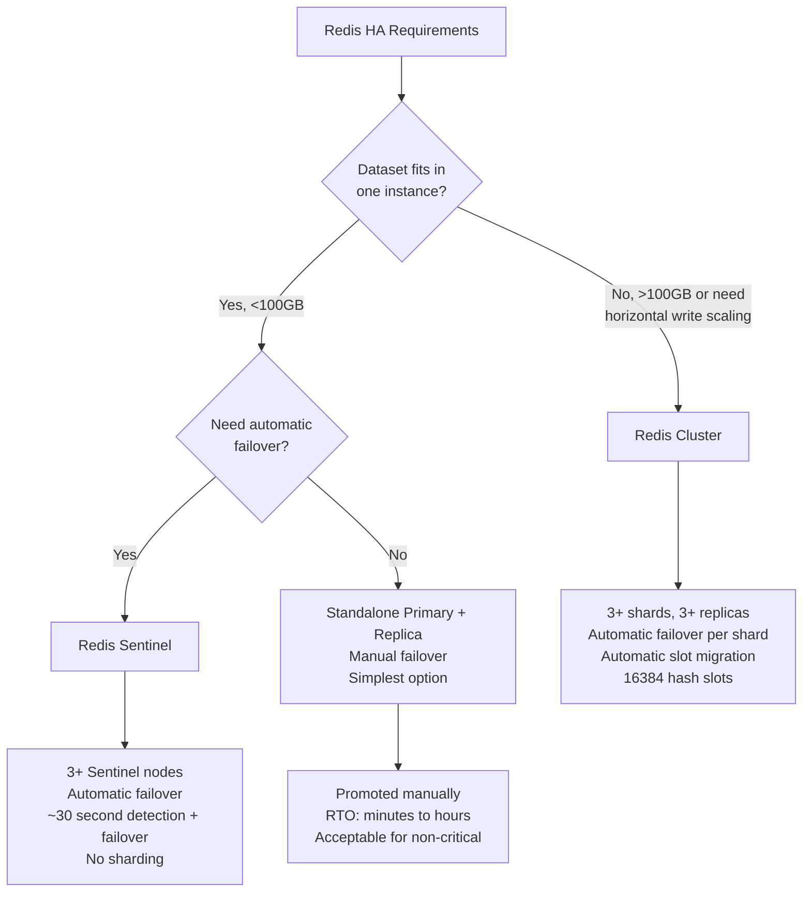
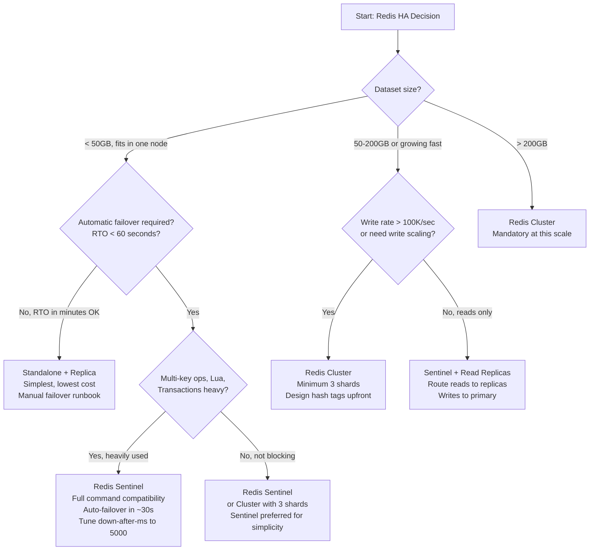

# Redis HA: Cluster vs Sentinel — Architecture Decisions at Production Scale

**Redis Sentinel and Redis Cluster are not interchangeable HA options — they solve orthogonal problems.** Sentinel is a failure detector and automatic failover orchestrator for a single primary-replica pair. Cluster is a horizontally sharded system where each shard is a Sentinel-equivalent. Picking Cluster when you need Sentinel adds 3x operational complexity for zero benefit. Picking Sentinel when you need Cluster means you'll be doing emergency resharding during your first Black Friday traffic spike.

---

## The Problem Class `[Mid]`

A platform serves 5M users. Redis stores sessions, caching, and rate limiting data. Current setup: one primary, one replica, manual failover. The engineering team asks: "How do we make this production-grade?"

They see two options in the Redis documentation: Sentinel and Cluster. Both provide "high availability." The decision tree is not obvious:



The decision is dominated by dataset size and write throughput requirements — not by HA requirements. Both Sentinel and Cluster provide automatic failover. The difference is sharding.

---

## Why the Obvious Solution Fails `[Senior]`

**"Use Cluster for everything — it's more capable"**: Redis Cluster adds significant operational complexity that costs engineering time continuously:
- Client must be Cluster-aware: not all Redis clients support Cluster natively; some OSS libraries have bugs in MOVED/ASK redirect handling
- Multi-key operations (`MGET`, `MSET`, `KEYS`) are restricted to keys on the same slot — cross-slot operations fail with `CROSSSLOT Keys in request don't hash to the same slot`
- Lua scripts are restricted to keys on the same slot
- Transactions (`MULTI/EXEC`) only work within a single slot
- Pipeline batching requires careful key routing to same slot

If your dataset fits in 60GB (single node limit with headroom), forcing it into Cluster means rewriting application code that uses multi-key operations, complex debugging of MOVED redirect latency, and gossip protocol overhead for no benefit.

**"Use Sentinel — it's simpler"**: Sentinel is simple until your dataset outgrows a single node. At that point, you cannot migrate from Sentinel to Cluster without application downtime and code changes. Teams that defer this decision until they hit the limit are doing emergency architecture migrations under pressure.

**The failover timeline misunderstanding**: Sentinel failover is often described as "automatic." The actual timeline is:
- `down-after-milliseconds`: Default 30,000ms (30 seconds) before Sentinel marks primary as `S_DOWN` (subjectively down)
- `min-replicas-to-write`: Write commands fail if fewer than N replicas are reachable (protection against split-brain)
- Election among Sentinels: typically 1–3 seconds
- Replica promotion and reconfiguration: 2–5 seconds
- Client reconnection: depends on client library's retry logic

Total failover time: **30–45 seconds** by default. Applications not designed for 30-second Redis unavailability will have cascading failures during failover.

---

## The Solution Landscape `[Senior]`

### Solution 1: Redis Sentinel

**What it is**: Three or more Sentinel processes that monitor the primary and replicas, detect failure, and orchestrate failover. Sentinels themselves form a distributed consensus system (using a modified Raft-like algorithm) to agree on whether the primary is truly down before promoting a replica.

**How it actually works at depth**:
1. Each Sentinel sends `PING` to primary and replicas every `sentinel-ping-interval` (default 1 second)
2. If primary doesn't respond within `down-after-milliseconds` (default 30s), the Sentinel marks it `S_DOWN` (subjectively down)
3. The Sentinel asks other Sentinels: "Do you also see the primary as down?" If quorum (default: majority of Sentinels) agree, primary is marked `O_DOWN` (objectively down)
4. Sentinel election: Sentinels vote for a leader Sentinel to perform failover
5. Leader Sentinel: selects best replica (lowest replication lag, highest priority), sends `SLAVEOF NO ONE` to promote it, reconfigures other replicas to replicate from new primary, notifies clients via `CLIENT KILL` and pub/sub channel `+switch-master`
6. Clients receive failover notification via Sentinel API or client library's built-in Sentinel support

**Configuration**:
```
# sentinel.conf
sentinel monitor mymaster 192.168.1.1 6379 2   # monitor primary, quorum=2
sentinel down-after-milliseconds mymaster 5000  # 5s detection (tune from default 30s)
sentinel failover-timeout mymaster 60000        # 60s total failover timeout
sentinel parallel-syncs mymaster 1             # replicas syncing in parallel during failover
```

**Sizing guidance** `[Staff+]`
- Minimum 3 Sentinels (quorum requires majority: 2 of 3)
- Sentinels are lightweight: ~15–30MB memory, negligible CPU (< 1% on any modern instance)
- Gossip overhead: each Sentinel pings all primaries, replicas, and other Sentinels every second. At 10 Redis instances (mix of primary + replicas) and 5 Sentinels: 5 × 10 = 50 pings/sec. Negligible.
- Network overhead: Sentinel pub/sub for cluster state changes: < 1 KB/sec normally

**Failure modes** `[Staff+]`
- **Split-brain**: If the primary is partitioned from most replicas and most Sentinels (but still reachable from some clients), it continues accepting writes. These writes are lost when failover promotes a replica. Mitigation: `min-replicas-to-write 1 min-replicas-max-lag 10` — primary stops accepting writes if fewer than 1 replica is within 10 seconds of replication lag.
- **Sentinel quorum failure**: If Sentinels are collocated in the same failure domain (same AZ, same rack), a single failure can take out multiple Sentinels below quorum. Solution: Sentinels must be in different failure domains (different AZs in cloud environments).
- **Stale client connections**: After failover, clients with connection pool to old primary will have stale connections. Clients must implement: connection retry on `READONLY` error (if old primary becomes replica), Sentinel-aware client libraries that auto-discover new primary via `SENTINEL get-master-addr-by-name`.
- **Promotion of stale replica**: If replica A has replication lag of 100,000 commands and replica B is not available, Sentinel promotes A. The 100K commands are lost. Mitigation: `min-replicas-max-lag 10` (seconds) prevents promotion of replicas > 10 seconds behind, but may cause failover timeout if all replicas are lagging.

**Observability** `[Staff+]`
- `SENTINEL masters` — primary status and replica count
- `SENTINEL replicas mymaster` — replica lag (replication offset delta)
- Alert: Replication lag > 5 seconds on any replica (pre-failover quality indicator)
- Alert: Sentinel count < 3 (alert before quorum loss, not after)
- `INFO replication` on primary: `master_repl_offset` vs replica's `slave_repl_offset`

---

### Solution 2: Redis Cluster

**What it is**: A sharded deployment where 16,384 hash slots are distributed across multiple primary nodes. Each primary can have replicas. Cluster handles failover per-shard automatically (built-in Sentinel-like mechanism).

**How it actually works at depth**:
- Keys are mapped to slots via `CRC16(key) % 16384`
- Hash tags `{tag}` allow key co-location: `{user:1001}:session` and `{user:1001}:cart` hash to the same slot (based on the `{user:1001}` tag)
- Cluster nodes use a gossip protocol to share cluster state: each node sends cluster state updates (node list, slot assignments, failure reports) to 1–2 random nodes per gossip cycle (every 100ms)
- Failure detection: node A sends `PING` to node B. If no `PONG` within `cluster-node-timeout` (default 15s), A marks B as `PFAIL` (probable failure). If majority of nodes report B as `PFAIL`, it becomes `FAIL`. The replica with the best replication offset is promoted.
- Client routing: if a client sends a command to the wrong node, the node returns `MOVED slot address:port`. Client must retry against the correct node.

**Slot distribution**:
```
# 3 shards, 16384 slots:
# Shard 1: slots 0-5460    (5461 slots)
# Shard 2: slots 5461-10922 (5462 slots)
# Shard 3: slots 10923-16383 (5461 slots)
```

**Resharding**: Moving slots from one node to another via `redis-cli --cluster reshard`. During resharding, keys in migrating slots can be on source or destination. Client gets `ASK redirect` (for migrating slots) vs `MOVED redirect` (permanent assignment). Resharding is online but has I/O overhead: each key is read from source, written to destination, deleted from source.

**Sizing guidance** `[Staff+]`
- Minimum: 3 primaries + 3 replicas (6 nodes total). 3 nodes is the absolute minimum for Cluster (with 0 replicas, losing any node loses data permanently).
- Gossip protocol overhead: N nodes → O(N²) in worst case, but typically O(N) due to fanout limiting. At 100 nodes: ~100 gossip messages/sec per node (100 × 100 bytes/msg = 10KB/sec). Negligible.
- Cluster metadata per node: ~1MB for 1000-node cluster. Not significant.
- Resharding throughput: `--cluster-pipeline 10 --cluster-throttle 10000` for controlled resharding. At full speed: ~100K keys/min moved. For 10M keys: 100 minutes of resharding.
- Memory overhead per shard: ~1MB for cluster state + standard Redis overhead

**Cluster configuration**:
```
cluster-enabled yes
cluster-config-file nodes.conf
cluster-node-timeout 15000              # 15s detection
cluster-require-full-coverage yes       # reject writes if any slot is down (safer for data integrity)
cluster-slave-validity-factor 10        # replica must be < 10x node-timeout behind to be promoted
cluster-migration-barrier 1            # minimum replicas a primary must keep during replica migration
```

**Failure modes** `[Staff+]`
- **Cluster split**: If the cluster splits into two partitions (e.g., 3 nodes on each side of a network partition), the partition with the majority of slot coverage continues accepting writes. The minority partition stops accepting writes (`cluster-require-full-coverage yes`). When partition heals, data divergence must be resolved (Redis takes the "last write wins" approach via replication). In practice, the minority partition's data since the split is lost.
- **CROSSSLOT errors**: Multi-key operations on keys in different slots fail. This is a common application-level failure after migrating from Sentinel to Cluster. Use hash tags to co-locate related keys, or use single-key equivalents (pipeline multiple single-key commands instead of MGET).
- **Resharding during peak traffic**: Moving 1M keys at peak traffic adds I/O and CPU overhead to the source node. The node may hit latency thresholds. Schedule resharding during off-peak and throttle with `--cluster-throttle`.
- **Gossip bandwidth under high churn**: If nodes are frequently joining/leaving (e.g., rolling restarts), gossip messages spike. In a 50-node cluster with rapid churn, gossip can consume 1–5 Mbps of network. Usually not a problem, but monitor during rolling deployments.

**Observability** `[Staff+]`
- `CLUSTER INFO` — `cluster_state: ok/fail`, `cluster_slots_assigned`, `cluster_known_nodes`
- `CLUSTER NODES` — full cluster topology, fail flags per node
- Alert: `cluster_state: fail` — P0 incident
- Alert: Any node showing `fail` flag — P1 incident
- Latency: Track MOVED redirect rate — `> 0.1%` of commands getting MOVED indicates client-side slot cache is stale (client should have cluster slot map cached)

---

### Solution 3: Standalone Primary + Read Replicas (No HA Orchestration)

**What it is**: A primary with one or more asynchronous read replicas. No automatic failover. Failover is manual (promote a replica via `REPLICAOF NO ONE`, update application config).

**When it wins**:
- Read-heavy workloads where replicas handle 80%+ of load
- Non-critical data stores where 5–30 minutes of manual failover RTO is acceptable
- Development and staging environments
- Analytics stores where the primary can be rebuilt from source data

**Sizing guidance** `[Staff+]`
- Replica adds ~same memory cost as primary (full dataset copy)
- Replication lag: async by default. At 100K writes/sec, replica lag is typically 10–100ms
- Replica sync on fresh join: full RDB transfer at ~100–200 MB/sec → 10GB dataset = 50–100 seconds of sync time. During sync, replica cannot serve reads.

**Failure modes** `[Staff+]`
- **Manual failover under pressure**: During a real outage, promoting a replica and updating all application connection strings takes 5–30 minutes. If you use a load balancer or service discovery for Redis (not DNS TTL), this can be done in < 2 minutes. Without it: you're updating config files across N services.

---

## Trade-off Matrix `[Senior]` → `[Staff+]`

| Dimension | Standalone + Replica | Sentinel | Cluster |
|---|---|---|---|
| Automatic failover | No | Yes (~30s) | Yes (~15s per shard) |
| Horizontal write scaling | No | No | Yes |
| Multi-key ops | Full support | Full support | Same-slot only |
| Lua script complexity | None | None | Same-slot keys only |
| Operational complexity | Low | Medium | High |
| Client complexity | Low | Medium (Sentinel discovery) | High (MOVED/ASK handling) |
| Minimum node count | 1 + 1 | 3 Sentinels + 2 Redis | 6 Redis nodes |
| Dataset limit | RAM of one instance | RAM of one instance | Theoretically unlimited |
| Resharding | N/A | N/A | Online, but operationally complex |
| Split-brain risk | Low (no election) | Medium (Sentinel quorum) | Low (majority wins) |

---

## Decision Framework — When to Pick Each `[Senior]` → `[Staff+]`



**Hard rules**:
- Dataset > 100GB: Cluster (non-negotiable)
- `MGET`/`MSET`/transactions are core to your application: Sentinel (or redesign for hash tags before adopting Cluster)
- Automatic failover RTO < 5 seconds: Neither Sentinel nor Cluster — you need application-level failover with pre-warmed standby
- Team has < 2 Redis-experienced engineers: Standalone or Sentinel; Cluster's operational complexity requires expertise

---

## Production Failure Story `[Staff+]`

**The Sentinel split-brain that caused 12 minutes of duplicate order creation.**

An e-commerce platform ran 3 Sentinel nodes monitoring a Redis primary used for order deduplication (idempotency key store). The setup was: primary in AZ-1, replica in AZ-2, all 3 Sentinels in AZ-1.

A network issue isolated AZ-1 (primary + all Sentinels) from AZ-2 (replica). From AZ-1's perspective: primary was reachable, replica was down (network partition). From AZ-2's perspective: nothing was reachable.

Because all 3 Sentinels were in AZ-1 with the primary, they still had quorum. Sentinels saw replica as `PFAIL` but primary as healthy. No failover occurred. The primary in AZ-1 continued accepting writes.

However, the application deployed in AZ-2 was configured to connect to the Sentinel discovery endpoint. The Sentinel discovery returned the AZ-1 primary address. AZ-2 applications could not reach the AZ-1 primary (network partition). They received connection timeouts.

The application's fallback: if Redis is unreachable for > 5 seconds, bypass the idempotency check and process the order directly. During the 12-minute network partition, every retry of every in-flight order that hit AZ-2 was processed without deduplication. Result: 847 duplicate orders.

**Root cause**: Sentinels collocated with the primary — they couldn't detect the primary as failing because they were on the same network segment. Correct deployment: Sentinels distributed across AZs (1 in AZ-1, 1 in AZ-2, 1 in AZ-3). Then, when AZ-1 is isolated, AZ-2 and AZ-3 Sentinels (2 of 3 = quorum) would promote the AZ-2 replica.

**Secondary cause**: The application fallback bypassed idempotency on Redis unavailability. Correct behavior: fail the request, not bypass the check.

---

## Observability Playbook `[Staff+]`

**Metric 1: Replication lag before it becomes failover risk**
- `INFO replication` → `master_repl_offset` minus each `slave_repl_offset`
- Convert offset delta to time: lag_seconds ≈ offset_delta / write_rate_bytes_per_sec
- Alert: Replica lag > 5 seconds — this replica should not be promoted without data loss investigation
- Dashboard: Plot `master_repl_offset` vs each replica's `slave_repl_offset` on the same graph; diverging lines = lag accumulating

**Metric 2: Sentinel quorum health**
- `SENTINEL ckquorum mymaster` from each Sentinel — returns OK if quorum can be reached
- Run this check every 60 seconds via external monitoring; alert if any Sentinel returns not-OK
- Alert: Fewer than 3 Sentinels responding to `PING` — below quorum risk

**Metric 3: Cluster slot coverage (Cluster only)**
- `CLUSTER INFO` → `cluster_slots_ok` must equal 16384
- `cluster_slots_pfail` + `cluster_slots_fail` > 0 = immediate alert
- MOVED redirect rate: instrument your Redis client to count MOVED responses; > 0.01% rate indicates stale slot map

**Dashboard layout**:
1. Top row: Primary connection count, replication lag per replica, Sentinel/Cluster health indicator
2. Middle row: Failover events timeline, replica promotion history, connection pool saturation per shard
3. Bottom row: Gossip message rate (Cluster), Sentinel election events, `cluster_state` changes

---

## Architectural Evolution `[Staff+]`

**12-month compounding**: The Sentinel → Cluster migration is one of the most disruptive Redis operations. Teams that choose Sentinel with "we'll migrate to Cluster when we need it" discover that migrating requires:
1. Identifying all multi-key operations (`MGET`, `MSET`, pipelines, Lua scripts) — typically a 2–4 week audit
2. Adding hash tags to co-locate related keys — requires application code changes + data migration
3. Deploying a parallel Cluster, dual-writing, validating, then cutting over

This migration takes 6–12 engineering weeks for a team without prior Cluster experience. Start with the right architecture or know exactly what the migration will cost.

**10x scale changes**:
- At 10x primary dataset (500GB+): Cluster is mandatory. Evaluate 10–20 shard configuration, plan slot distribution based on key access patterns (avoid hot slots).
- At 10x node count (60+ Cluster nodes): Gossip protocol messages become measurable. Each node sends to 1–2 peers per 100ms cycle → 60 nodes × 10 gossip/sec × 100 bytes = 60KB/sec cluster-internal traffic. Negligible, but monitor during rapid topology changes.
- Evaluate Redis Enterprise (Redislabs) or Upstash at 10x for managed Cluster with better multi-key operation support and active-active geo-replication.

**2026 tooling perspective**:
- **eBPF for failover detection**: Use `kprobe` on Redis's `replicationSetMaster()` to detect failover events at the kernel level, independent of application-layer monitoring. This catches failovers that the application logs miss.
- **Rust-based Cluster clients**: `fred` (Rust Redis client) has state-of-the-art Cluster support with connection pool per shard, automatic MOVED handling, and backpressure-aware pipelining. For high-throughput services, the Rust client can reduce per-connection overhead by 60% vs Go clients.
- **Platform engineering — Redis topology as code**: Declare Sentinel vs Cluster as a service configuration parameter. The platform provisions the correct topology, monitors it, and handles rolling upgrades. Teams should not be operating Redis topology directly — they should be consumers of a Redis-as-a-service internal platform.
- **Valkey (Redis fork)**: The open-source community fork of Redis is gaining traction in 2026. If your team runs self-managed Redis, evaluate Valkey for its identical API compatibility and continued open-source governance. Sentinel and Cluster semantics are identical.

---

## Decision Framework Checklist `[All Levels]`

- [ ] Calculate current dataset size and 12-month growth trajectory before choosing architecture
- [ ] Identify all multi-key operations in the application codebase before committing to Cluster
- [ ] Deploy Sentinels in separate failure domains (separate AZs or racks) — never collocate all Sentinels with the primary
- [ ] Set `down-after-milliseconds` based on application timeout budget, not the default 30 seconds
- [ ] Configure `min-replicas-to-write 1 min-replicas-max-lag 10` to prevent split-brain data loss
- [ ] For Cluster: define hash tag strategy before writing a single key — migration is expensive
- [ ] Test failover in staging: manually kill the primary, measure client-visible downtime, verify correct node is promoted
- [ ] Set `cluster-require-full-coverage yes` in Cluster to prevent partial writes during slot unavailability
- [ ] Instrument client libraries to expose MOVED redirect rate, connection retry rate, and failover detection time
- [ ] Document the manual failover runbook for all configurations — automatic failover occasionally fails; humans must be ready

---

*Written by Gaurav Porwal — 10+ Year Engineer | Tech Lead | Product Owner | Business-Minded Builder*
*Last updated: 2026-03-18*
