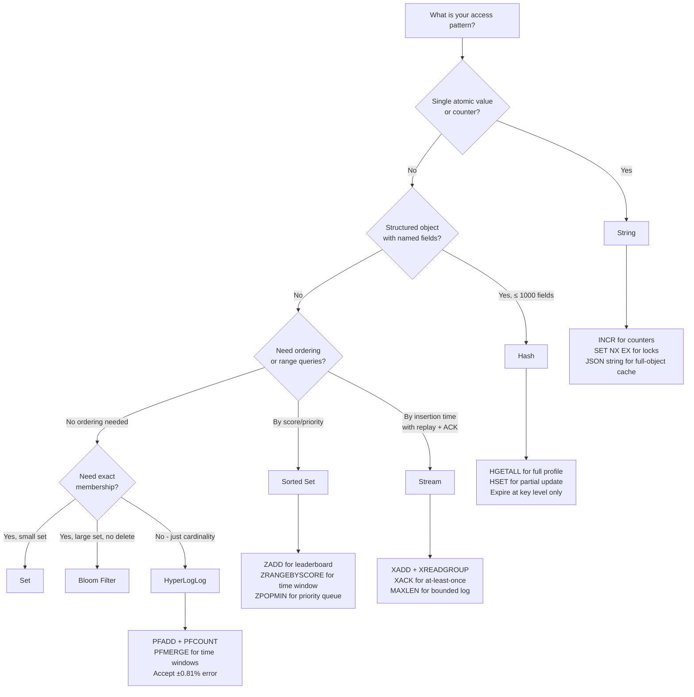

# Redis Data Structures: Choosing the Right Type for Your Access Pattern

**Every Redis performance problem I've diagnosed in production starts with the same mistake: the engineer used String for everything.** That's 10x the memory of a Hash for small objects, O(N) scan where O(1) Hash lookup exists, and zero cardinality estimation where HyperLogLog saves 99% of memory. The right data structure is the most leverage point in Redis engineering — and it's decided once, early, and lived with forever.

---

## The Problem Class `[Mid]`

You're storing user session data. Each session has 12 fields: user_id, email, role, permissions, last_seen, device, ip, csrf_token, preferences, plan, credits, region. The obvious implementation: one String key per field.

```
user:1001:email       → "alice@example.com"
user:1001:role        → "admin"
user:1001:credits     → "500"
... (10 more keys)
```

At 1M users × 12 fields = 12M keys. Each Redis key has ~50 bytes of overhead (pointer, LRU clock, encoding info, refcount). That's **600MB of pure overhead** before a single byte of user data.

The Hash alternative: `user:1001` → Hash with 12 fields. Redis encodes small Hashes as ziplist (now listpack in 7.x) — contiguous memory, no per-field pointer overhead. Same 1M users → **under 60MB total**, including data.

```mermaid
graph TD
    A[1M Users, 12 fields each] --> B{Data Structure Choice}
    B -->|String per field| C[12M Keys\n600MB overhead\nO(1) per field read\n12 network round trips per user]
    B -->|Hash per user| D[1M Keys\n60MB total\nO(1) per field read\n1 network round trip per user]
    B -->|JSON String| E[1M Keys\n~200MB\nO(N) to update one field\nDeserialize entire object]

    C --> F[Memory alarm at 5M users]
    D --> G[Memory alarm at 50M users]
    E --> H[CPU spike on every field update]
```

The same wrong-type pattern plays out across cardinality counting (String int vs HyperLogLog), leaderboards (String + ZADD vs Sorted Set), queues (List vs Stream), and real-time feeds (List vs Sorted Set by timestamp).

---

## Why the Obvious Solution Fails `[Senior]`

**String-for-everything** collapses under three specific pressures:

**Memory pressure**: Redis key overhead is not amortized. Every key — regardless of value size — costs ~50–72 bytes in the `dictEntry` + `robj` structures. Store 10M string keys with 20-byte values: 720MB overhead + 200MB data = 920MB. Store the same data as 1M Hashes with 10 fields each: ~120MB total. That's a 7.6x memory difference that triggers OOM eviction at completely different scale points.

**Round-trip pressure**: Fetching a user object stored as 12 String keys requires either 12 sequential GET calls (12 RTTs at ~0.5ms each = 6ms) or one MGET (1 RTT, but all fields or nothing). With Hash: `HGETALL user:1001` or `HMGET user:1001 field1 field2` — 1 RTT, selective fields.

**Atomicity pressure**: Updating two String keys is not atomic without MULTI/EXEC. Updating two fields in a Hash via HMSET is atomic at the command level.

**Sorted Set misuse**: Engineers reach for a List (`LPUSH`/`LRANGE`) for leaderboards. Lists are ordered by insertion — re-ranking requires removing and reinserting. Sorted Sets maintain score order automatically; `ZADD` is O(log N), `ZRANGE` with score is O(log N + M). For 1M members: List re-rank = O(N) scan + delete + insert vs Sorted Set `ZADD` = O(log N).

---

## The Solution Landscape `[Senior]`

### Solution 1: String — Counters, Simple Values, Serialized Objects

**What it is**: The fundamental Redis type. Binary-safe, max 512MB per value. Supports atomic integer operations: INCR, INCRBY, DECR, INCRBYFLOAT.

**How it actually works at depth**: When a String value is an integer ≤ 9,999,999,999,999,999 (10^16), Redis stores it as an integer encoding directly in the `robj` (no heap allocation for the value). For small strings ≤ 44 bytes, Redis uses embstr encoding (single allocation for robj + string data). For larger strings: raw encoding (separate heap allocation). The encoding choice affects both memory and copy-on-write behavior during RDB saves.

**When String wins**:
- Single atomic counter (page views, rate limit counter, inventory count)
- Cache of a serialized object where you always read/write the whole object
- Session token → user_id mapping (single-field lookup)
- Distributed lock (`SET key value NX EX seconds`)

**Sizing guidance** `[Staff+]`
- Integer encoding: ~16 bytes per key total (including key overhead)
- Embstr (≤44 bytes value): ~64 bytes per key total
- Raw string: ~72 bytes + value length per key
- At 10M integer counters: ~160MB (acceptable)
- At 10M serialized 200-byte objects: ~2.72GB (plan for this)

**Configuration decisions that matter** `[Staff+]`
- No specific encoding thresholds to tune — encoding is automatic
- For counters, prefer INCR over GET+SET: INCR is atomic, GET+SET requires WATCH for safety

**Failure modes** `[Staff+]`
- **Silent integer overflow**: Redis integers are 64-bit signed. Counter rolls over at 9,223,372,036,854,775,807. A page view counter will never hit this. A microsecond timestamp accumulator might. Check with `OBJECT ENCODING key` — if it shows `int`, you're safe up to 2^63-1.
- **Embedding limit break**: Value grows past 44 bytes, Redis reallocates from embstr to raw. During RDB fork, raw-encoded strings trigger copy-on-write at page granularity (4KB). If you have 100K raw strings on one 4KB page, a single write during RDB duplicates the entire page. This is the hidden RDB memory spike.

**Observability** `[Staff+]`
- `OBJECT ENCODING key` — check encoding type
- `redis-cli --hotkeys` — find String keys accessed > N times/sec
- Metric: `used_memory` spike during `bgsave` → raw encoding + COW amplification

---

### Solution 2: Hash — Structured Objects with Partial Updates

**What it is**: A map of field → value pairs. Ideal for structured objects where individual fields are read or updated independently.

**How it actually works at depth**: Small Hashes (field count ≤ `hash-max-listpack-entries`, default 128; total field/value size ≤ `hash-max-listpack-value`, default 64 bytes) are encoded as **listpack** (formerly ziplist in Redis < 7.0): a contiguous block of memory with no pointers. Field lookup is O(N) scan over the listpack, but N ≤ 128 makes this faster than pointer indirection in practice. Once thresholds are exceeded, Redis converts to hashtable encoding: O(1) lookup, but ~70 bytes overhead per field.

**When Hash wins**:
- User profile, session object, product catalog entry — any structured object with ≤ 1000 fields
- Objects where you update individual fields without touching the whole object
- Replacing 5–50 String keys with one Hash key

**Sizing guidance** `[Staff+]`
- Listpack encoding: ~15–25 bytes per field (key + value + listpack metadata)
- Hashtable encoding: ~70 bytes per field (dictEntry + pointers)
- **Break-even**: At ≤ 128 fields, listpack is 3–5x more memory-efficient than hashtable
- 1M user objects, 12 fields each, listpack: ~300MB
- Same with String per field: ~2.1GB (7x more)

**Configuration decisions that matter** `[Staff+]`
```
hash-max-listpack-entries 128   # default; increase to 256 for larger objects
hash-max-listpack-value 64      # max size of any single field value in bytes
```
Increasing `hash-max-listpack-entries` to 512 keeps larger objects in memory-efficient listpack longer, but linear-time field access on 512-entry listpack becomes measurable (~2μs vs ~100ns for hashtable at 512 entries). Profile before changing.

**Failure modes** `[Staff+]`
- **Threshold crossing spike**: When a Hash crosses `hash-max-listpack-entries`, Redis converts the entire structure from listpack to hashtable. Memory usage jumps ~3–5x instantly. If 10K Hashes all cross threshold simultaneously (e.g., during a data migration), you'll see a sharp `used_memory` spike. Monitor `hash_max_listpack_entries` crossings via `DEBUG OBJECT key` showing encoding change.
- **Unbounded field growth**: Hash with no field TTL — individual fields don't expire. A session Hash with 10K historical fields from bugs or schema changes will never self-clean.

**Observability** `[Staff+]`
- `HLEN key` — field count; alert if > 80% of `hash-max-listpack-entries`
- `OBJECT ENCODING key` — `listpack` vs `hashtable`
- Memory: `MEMORY USAGE key` before and after adding fields to catch encoding conversion

---

### Solution 3: Sorted Set — Leaderboards, Priority Queues, Range Queries

**What it is**: A set of unique members, each with a floating-point score. Members are always sorted by score. Supports range queries by score or rank in O(log N + M).

**How it actually works at depth**: Small Sorted Sets (≤ `zset-max-listpack-entries`, default 128 members; member size ≤ `zset-max-listpack-value`, default 64 bytes) use listpack encoding. Larger sets use a combination of a **skip list** (for O(log N) range queries) and a **hashtable** (for O(1) member lookup). The dual structure means Sorted Sets at scale use more memory than equivalently-sized Hash or Set, but enable range queries that neither supports.

**When Sorted Set wins**:
- Leaderboard: score = points, `ZREVRANGE 0 9` for top 10 in O(log N + 10)
- Priority queue: score = priority or timestamp, `ZPOPMIN` for highest priority item
- Rate limiting window: score = timestamp, `ZRANGEBYSCORE` to count events in time window
- Autocomplete: members = prefixes, score = frequency
- Geo queries: Redis GEO commands internally use Sorted Sets with geohash as score

**Sizing guidance** `[Staff+]`
- Listpack encoding: ~20–30 bytes per member
- Skip list + hashtable: ~120–200 bytes per member (each skip list node: ~64 bytes + level pointers)
- 1M leaderboard entries in listpack: ~25MB
- 1M leaderboard entries in skip list: ~150MB
- **Threshold**: Keep members ≤ 128 for listpack if memory is critical; larger sets require skip list

**Configuration decisions that matter** `[Staff+]`
```
zset-max-listpack-entries 128
zset-max-listpack-value 64
```

**Failure modes** `[Staff+]`
- **ZRANGEBYSCORE without LIMIT on large sets**: `ZRANGEBYSCORE key -inf +inf` on a 10M member set returns all 10M members, blocking the server for seconds. Always use `LIMIT offset count`.
- **Score precision**: Redis scores are IEEE 754 doubles (53-bit mantissa). Integers up to 2^53 (9,007,199,254,740,992) are represented exactly. Timestamps in milliseconds until year 2255 are safe. Timestamps in microseconds since 2001 exceed 2^53 by 2033 — use strings for member IDs, not microsecond timestamps as scores.

**Observability** `[Staff+]`
- `ZCARD key` — member count
- `OBJECT ENCODING key` — alert on `skiplist` encoding for memory-sensitive sets
- Slow log: `ZRANGEBYSCORE` without LIMIT on large sets shows as slow commands

---

### Solution 4: HyperLogLog — Cardinality Estimation at Massive Scale

**What it is**: A probabilistic data structure for counting unique elements. Uses ≤ 12KB of memory regardless of cardinality. Standard error: ±0.81%.

**How it actually works at depth**: HyperLogLog hashes each element to a 64-bit hash, then uses the position of the first 1-bit to estimate the cardinality of the set. Redis implements the HyperLogLog++ algorithm with two representations: sparse (< 1/6 of registers filled, uses variable-length encoding, typically < 1KB) and dense (always 12KB). Sparse representation auto-converts to dense at ~300 unique elements.

**When HyperLogLog wins**:
- Daily/monthly active users (DAU/MAU)
- Unique visitors per page per day
- Unique IP addresses seen (DDoS fingerprinting)
- Unique search queries
- Any "how many distinct X happened in period Y" — when ±1% error is acceptable

**Sizing guidance** `[Staff+]`
- Sparse: < 1KB per HLL key (for < ~300 unique elements)
- Dense: exactly 12,304 bytes (12KB) per HLL key — always, regardless of cardinality
- 1B unique user-page-day combinations tracked via String Sets: ~80GB
- Same via HyperLogLog (one per page per day): ~12KB × pages × days = orders of magnitude less
- For 1000 pages × 365 days: 1000 × 365 × 12KB = **4.38GB** vs 80GB+ for exact Set

**Failure modes** `[Staff+]`
- **Merge accuracy degradation**: `PFMERGE` of many HLLs accumulates error. Merging 100 HLLs of distinct sets has error that compounds. For business reporting, validate merged counts against exact counts periodically.
- **Sparse-to-dense conversion spike**: First 300 unique elements convert automatically. If you pre-warm HLL keys and then get burst traffic, 10K HLL keys converting simultaneously from sparse to dense = 10K × ~11KB = 110MB allocation spike.

**Observability** `[Staff+]`
- `OBJECT ENCODING key` — `raw` (sparse) vs `raw` with specific internal structure (dense) — not directly queryable; use `MEMORY USAGE key` to distinguish
- Compare `PFCOUNT` periodically against an exact count sample to validate error rate is within tolerance

---

### Solution 5: Stream — Durable Event Log with Consumer Groups

**What it is**: An append-only log of entries, each with a unique ID (timestamp-sequence). Supports consumer groups with acknowledgment — the closest Redis comes to Kafka semantics.

**How it actually works at depth**: Stream entries are stored in a radix tree of listpacks. Each listpack is a macro-node containing multiple entries (default: listpack limited to 4KB or 100 entries). The radix tree key is the first entry ID's millisecond timestamp. This structure gives O(log N) entry ID lookup and O(1) append. Consumer groups maintain: last delivered ID, pending entries list (PEL) for un-ACKed messages, consumer-to-PEL mapping.

**When Stream wins**:
- Activity feeds requiring replay (user actions, audit log)
- Fan-out to multiple independent consumer groups (unlike Pub/Sub which loses messages if subscriber disconnects)
- Message queue with at-least-once delivery and exactly-once processing via XACK
- Time-series data with range queries

**Sizing guidance** `[Staff+]`
- Each entry: ~50–100 bytes in listpack encoding (compressed field names across entries)
- PEL entry: ~130 bytes per un-ACKed message per consumer
- At 10K messages/sec, 1-hour retention: 36M entries × 75 bytes = ~2.7GB
- Consumer group with 1000 un-ACKed messages: 1000 × 130 bytes = 130KB (negligible)
- **MAXLEN trimming**: `XADD key MAXLEN ~ 1000000 * field value` — the `~` allows trimming to happen at listpack boundary, amortizing trimming cost

**Failure modes** `[Staff+]`
- **PEL growth without XACK**: If consumers crash without acknowledging, PEL grows unbounded. At 10K/sec with 50% crash rate, PEL grows 5K entries/sec. After 1 hour: 18M PEL entries × 130 bytes = 2.34GB. Monitor `XPENDING key group - + 10` — count should stay bounded.
- **XREADGROUP blocking on empty stream**: `XREADGROUP GROUP g c BLOCK 0 COUNT 1 STREAMS key >` blocks indefinitely. Redis handles this correctly, but if your consumer crashes while blocked, the connection leaks. Always use finite BLOCK timeout (e.g., 2000ms) and reconnect logic.

**Observability** `[Staff+]`
- `XLEN key` — total entries
- `XPENDING key group - + COUNT 10` — pending (un-ACKed) entry count; alert if > 10K
- `XINFO GROUPS key` — lag (entries behind last delivered ID) per consumer group

---

### Solution 6: Bloom Filter (RedisBloom) — Probabilistic Membership with Zero False Negatives

**What it is**: A probabilistic set membership structure. `BF.ADD` adds an element; `BF.EXISTS` returns false (definitely not in set) or true (probably in set, with configurable false positive rate). Requires RedisBloom module.

**When Bloom Filter wins**:
- "Has this email been seen before?" (deduplication pipeline)
- "Is this URL in the crawl blacklist?" (web crawler)
- "Has this user already received this notification?" (notification deduplication)
- Cache negative-result caching: "Does this username exist?" — check Bloom first, avoid DB hit for non-existent users

**Sizing guidance** `[Staff+]`
- Optimal bits per element: `m = -n * ln(p) / (ln(2))^2` where n = expected elements, p = false positive rate
- 1M elements, 0.1% false positive rate: ~14.4MB
- 1M elements, 1% false positive rate: ~9.6MB
- 100M elements, 0.1% false positive rate: ~1.44GB — Bloom Filter is still viable; a Set would require 100M × ~70 bytes = 7GB

**Failure modes** `[Staff+]`
- **Exceeding capacity degrades false positive rate**: Bloom Filters are sized for a fixed capacity. Exceeding `BF.RESERVE` capacity silently increases false positive rate. Monitor with `BF.INFO key` — check `Number of items inserted` vs `Capacity`.
- **No deletion support**: Standard Bloom Filters cannot remove elements. Use Cuckoo Filter (`CF.ADD`/`CF.DEL`) if deletion is required.

---

## Trade-off Matrix `[Senior]` → `[Staff+]`

| Dimension | String | Hash | Sorted Set | HyperLogLog | Stream | Bloom Filter |
|---|---|---|---|---|---|---|
| Memory efficiency (small N) | Medium | High (listpack) | High (listpack) | Very High | High (listpack) | Very High |
| Memory efficiency (large N) | Medium | Low (hashtable) | Low (skiplist) | Very High (fixed 12KB) | Medium | Very High |
| Write complexity | O(1) | O(1) listpack / O(1) HT | O(log N) | O(1) | O(1) | O(k) hash fns |
| Range query support | No | No | Yes (by score) | No | Yes (by ID) | No |
| Exact membership test | Yes | Yes (field exists) | Yes | No (probabilistic) | No | No (probabilistic) |
| Persistence safe | Yes | Yes | Yes | Yes | Yes | Yes (with module) |
| At-least-once delivery | No | No | No | No | Yes (consumer groups) | N/A |
| Cardinality counting | Via SCARD (exact) | Via HLEN (exact) | Via ZCARD (exact) | Yes (probabilistic) | Via XLEN (exact) | No |

---

## Decision Framework — When to Pick Each `[Senior]` → `[Staff+]`



**Concrete rules**:

- **String**: Default for single-value cache, all counters, distributed locks. Never for multi-field objects.
- **Hash**: Any object with 2+ fields that needs partial field reads/writes. User profiles, config objects, shopping carts.
- **Sorted Set**: Any ranked list, time-windowed event count, geospatial (via GEO commands), priority queue.
- **Stream**: Replace Pub/Sub when you need replay, acknowledgment, or multiple independent consumer groups.
- **HyperLogLog**: Cardinality at scale where ±1% error is acceptable. DAU, unique visitors, unique IPs.
- **Bloom Filter**: Deduplication where you can tolerate false positives but not false negatives. Requires RedisBloom module.

---

## Production Failure Story `[Staff+]`

**The leaderboard that brought down reads for 8 minutes.**

A gaming company ran a live tournament with a global leaderboard. Scores were stored as String keys (`leaderboard:user:{id}:score`). The ranking page called `KEYS leaderboard:user:*` to get all users, then did N GET calls to fetch scores, then sorted in application memory.

At 50K concurrent users submitting scores, `KEYS leaderboard:user:*` returned 2M keys. Redis's `KEYS` command is O(N) and blocks the server. The command took 4.2 seconds to complete. During those 4.2 seconds, all other Redis commands queued behind it. Read latency spiked to 4.5 seconds. The alert threshold was 500ms.

The runbook said "restart Redis if latency > 1 second." The on-call engineer restarted Redis. The RDB snapshot was 45 seconds old (everysec fsync, RDB every 60 seconds). They lost 45 seconds of score data for 50K users.

**Root cause**: Wrong data structure (String per user vs single Sorted Set) + `KEYS` in production code.

**Correct solution**: `ZADD leaderboard:tournament:2024 score user_id` → `ZREVRANGE leaderboard:tournament:2024 0 99 WITHSCORES` for top 100 in O(log N + 100). Zero `KEYS` calls. `ZADD` for score update in O(log N).

**What the runbook missed**: The runbook had no step to identify the blocking command before restarting. Adding `CLIENT LIST` and `SLOWLOG GET 10` to the runbook would have shown the `KEYS` command immediately.

---

## Observability Playbook `[Staff+]`

**Metric 1: Encoding distribution alerts**
- Command: `redis-cli --scan --pattern 'user:*' | xargs -I{} redis-cli OBJECT ENCODING {}` (sampled, not full scan)
- Alert: If > 5% of Hash keys show `hashtable` encoding when expected to be `listpack`, a schema change crossed the threshold
- Threshold: Check `INFO keyspace` for key count; sample 1000 keys per minute via RANDOMKEY + OBJECT ENCODING

**Metric 2: Memory per data structure type**
- Use `redis-memory-analyzer` (open-source) to break down `used_memory` by key pattern and encoding
- Alert: Any key pattern consuming > 20% of `maxmemory` without a clear owner
- Early warning: `used_memory` / `maxmemory` > 0.75 with `maxmemory-policy noeviction`

**Metric 3: Slow log entries by command type**
- `SLOWLOG GET 100` — parse for KEYS, SMEMBERS, LRANGE without LIMIT, ZRANGEBYSCORE without LIMIT
- Alert: Any `KEYS` command in slow log = immediate escalation
- Threshold: Slow log threshold `slowlog-log-slower-than 10000` (10ms); P99 latency > 5ms is early warning

**Dashboard layout**:
1. Top row: `used_memory`, `used_memory_peak`, `mem_fragmentation_ratio`
2. Middle row: command latency P50/P99 by command type, slow log rate/min
3. Bottom row: key count by pattern (sampled), encoding type distribution, evicted keys/sec

---

## Architectural Evolution `[Staff+]`

**12-month compounding**: The wrong data structure decision made at month 0 doesn't surface until month 6–9 when traffic doubles and memory alarms start firing. By then, migrating from String-per-field to Hash requires a dual-write migration period (old and new format simultaneously), key expiration coordination, and application-level feature flags. The migration takes 3–4 engineering weeks for a system at 10M keys.

**10x scale changes**:
- At 10x keys, `RANDOMKEY`-based sampling becomes less representative — switch to keyspace notification + streaming sample
- Sorted Sets at 10M+ members: skiplist memory becomes significant — evaluate moving to Redis Cluster with multiple shards each holding a partition of the leaderboard
- HyperLogLog at 10x time windows: 365 × 1000 pages × 12KB = 4.38GB — evaluate HLL sparse packing and time-bucketed rotation (daily → weekly rollup)

**2026 tooling perspective**:
- **eBPF-based encoding profiler**: Tools like `bpftrace` can hook into Redis's `dbAdd` and `objectEncoding` functions to capture encoding decisions in real-time without intrusive sampling. This enables continuous encoding regression detection in production.
- **Rust-based keyspace analyzers**: Projects like `redis-rs` clients paired with Rust-based offline analyzers can process RDB snapshots in seconds rather than minutes, enabling continuous memory optimization feedback loops via CI/CD.
- **Platform engineering**: Internal developer platforms should enforce data structure selection at schema registration time — teams declare their access pattern, the platform recommends the structure, and monitoring is pre-configured. This shifts the decision left from firefighting at scale to design review.
- **Redis 8.x listpack ubiquity**: Redis 7.0 unified ziplist → listpack; Redis 8.x is expanding listpack usage to more internal structures. Engineers should re-profile their encoding configurations against new Redis versions — threshold defaults may change.

---

## Decision Framework Checklist `[All Levels]`

- [ ] Identify your primary access pattern: single-value read, multi-field read, range query, membership test, cardinality count, or ordered retrieval
- [ ] Count expected keys and values: calculate memory at listpack encoding vs hashtable/skiplist encoding
- [ ] Check if your object has 2+ fields that are read independently — if yes, Hash over String
- [ ] Verify Sorted Set is the right choice for any "top N" or "events in time window" query
- [ ] Validate HyperLogLog error tolerance (±0.81%) is acceptable for your cardinality metric
- [ ] Confirm Stream is needed if you need replay, ACK, or multi-consumer-group fan-out vs Pub/Sub
- [ ] Set `hash-max-listpack-entries` and `zset-max-listpack-entries` explicitly — do not rely on defaults changing across Redis versions
- [ ] Ban `KEYS` in production code — use `SCAN` with cursor for key iteration
- [ ] Add encoding monitoring: sample `OBJECT ENCODING` on 1% of keys every 5 minutes, alert on unexpected hashtable/skiplist encoding
- [ ] Document data structure choice and threshold configuration in service's architecture decision record (ADR)

---

*Written by Gaurav Porwal — 10+ Year Engineer | Tech Lead | Product Owner | Business-Minded Builder*
*Last updated: 2026-03-18*
