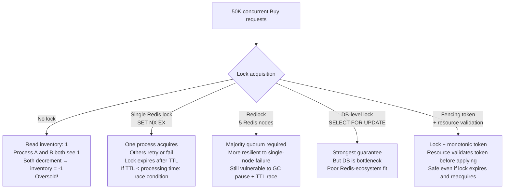
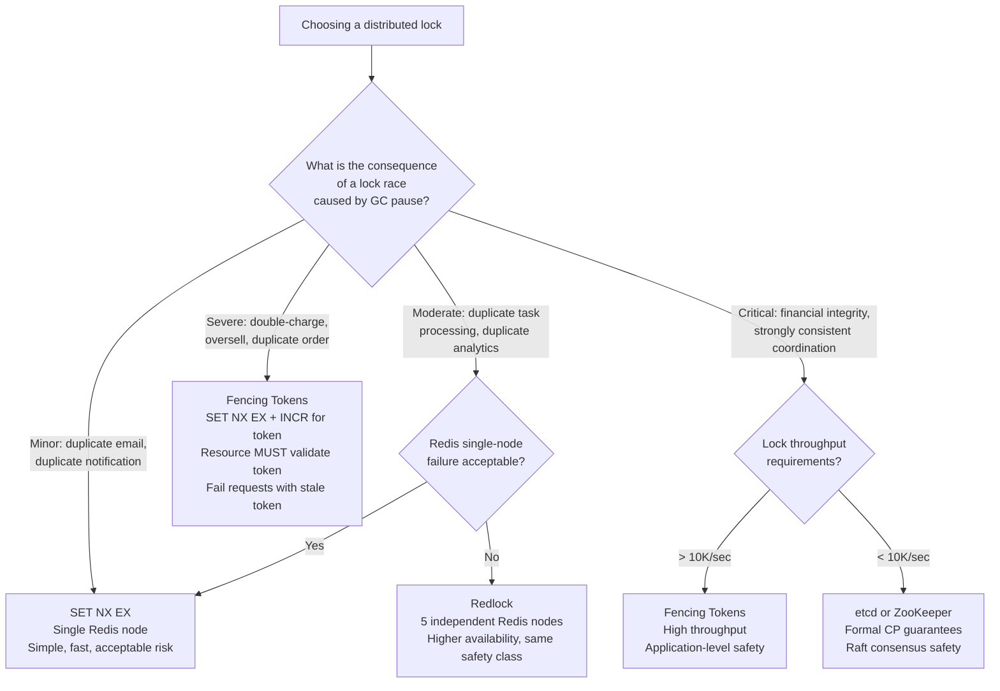

# Redis Distributed Locking: Redlock, Fencing Tokens, and When Not to Use Redis

**Every distributed lock tutorial shows the happy path. None of them show what happens when a JVM GC pause freezes your process for 500ms while holding a lock with a 300ms TTL.** That lock expires. Another process acquires it. Your first process resumes — unaware it no longer holds the lock — and now two processes are in the critical section simultaneously. Redis's single-node lock (`SET NX EX`) has a narrower version of this exact problem. Redlock has it too, just at a different failure boundary. Understanding these failure modes before you pick your locking primitive is the difference between "it works in testing" and "it's safe in production."

---

## The Problem Class `[Mid]`

Imagine 50,000 users hitting a flash sale at the same time. Your "buy" endpoint checks if inventory > 0, decrements it, and creates an order. Without a lock, two requests can read inventory = 1 simultaneously, both see inventory > 0, and both create orders — you've oversold by 1.

The lock must guarantee: only one process enters the critical section at a time, even when services restart, network partitions, or process freezes happen.



The diagram shows that locking is not a single solution — it's a spectrum from "fast but unsafe" to "safe but slower." The right choice depends on the consequence of a lock failure: occasional duplicate email vs. double-charged payment require very different lock implementations.

---

## Why the Obvious Solution Fails `[Senior]`

**Single-node Redis lock (`SET key value NX EX seconds`)**: The standard approach. Acquire by setting a key that doesn't exist; TTL auto-releases if the holder crashes.

The failure mode: **GC pause or process sleep exceeds TTL**. Here's the exact sequence:

1. Process A sets `lock:inventory NX EX 10` (10-second TTL)
2. Process A enters critical section, starts processing
3. JVM GC stop-the-world pause freezes Process A for 15 seconds
4. At second 10, the lock TTL expires. Redis deletes the key.
5. Process B sets `lock:inventory NX EX 10` — succeeds. Process B enters critical section.
6. Process A's GC pause ends. Process A continues — **it does not know its lock expired**. Now A and B are both in the critical section.

This is not a theoretical edge case. JVM GC pauses of 500ms–2 seconds are common in production. Stop-the-world GC pauses of 10+ seconds happen during GC log storms, high heap pressure, or misconfigured collectors. Linux kernel page faults, swap, and NTP clock adjustments can cause similar pauses in any language.

**Redlock (multi-node)**: Salvatore Sanfilippo (Redis author) designed Redlock for higher durability. Martin Kleppmann (of "Designing Data-Intensive Applications") wrote a detailed critique showing Redlock fails under the same GC/pause scenario. The fundamental issue is that both single-node and Redlock rely on time (TTL), and time can be disrupted by pauses, clock skew, or clock drift.

---

## The Solution Landscape `[Senior]`

### Solution 1: Single-Node `SET NX EX` — Fast Lock with Known Failure Window

**What it is**: `SET lock:resource UUID NX EX TTL_seconds`. The UUID (not a constant) is the lock value so that only the lock holder can release it. Release with a Lua script that atomically checks UUID and deletes.

**How it actually works at depth**:

```
# Acquire lock
SET lock:order:1001 "unique-uuid-abc" NX EX 30
# NX = only set if Not eXists
# EX 30 = expire in 30 seconds
# Returns OK on success, nil on failure (key already exists)

# Release lock — MUST be atomic check-and-delete
EVAL "
  if redis.call('get', KEYS[1]) == ARGV[1] then
    return redis.call('del', KEYS[1])
  else
    return 0
  end
" 1 lock:order:1001 "unique-uuid-abc"
```

> 💡 **What this means in practice:** Without the Lua script for release, you might delete another process's lock. Imagine: Process A's lock expires at second 10, Process B acquires it at second 10.001, Process A's cleanup code runs at second 10.002 and calls `DEL lock:order:1001` — it just deleted Process B's lock. The Lua script prevents this by only deleting if the value matches your UUID.

**Pseudocode for complete lock lifecycle**:
```
function acquireLock(resource, ttlMs):
    lockKey = "lock:" + resource
    lockValue = generateUUID()  # unique per acquisition attempt
    result = redis.SET(lockKey, lockValue, "NX", "PX", ttlMs)
    if result == "OK":
        return LockHandle(lockKey, lockValue, deadline=now() + ttlMs)
    return null

function releaseLock(handle):
    lua = """
    if redis.call('get', KEYS[1]) == ARGV[1] then
        return redis.call('del', KEYS[1])
    else
        return 0
    end
    """
    redis.EVAL(lua, 1, handle.lockKey, handle.lockValue)

# Usage pattern
lock = acquireLock("order:1001", ttlMs=30000)
if lock is null:
    return "already locked, retry"
try:
    processOrder()  # must complete in < 30 seconds
finally:
    releaseLock(lock)
```

**Sizing guidance** `[Staff+]`
- Lock key overhead: ~60 bytes per active lock
- Throughput: Redis handles 500K+ `SET NX` operations/sec
- At 10K concurrent locks: 600KB memory for lock keys — negligible
- Lock contention at 50K req/sec for 1 resource: only 1 succeeds per TTL window; 49,999 fail and must retry. Design retry with jitter to avoid thundering herd.

**Configuration decisions that matter** `[Staff+]`
- TTL must be > maximum expected processing time (include P99.9 + slack, not average)
- TTL must be < acceptable data inconsistency window
- Use `PX` (milliseconds) instead of `EX` (seconds) for fine-grained TTL control
- Never use constant values as lock value — only UUIDs or random bytes

**Failure modes** `[Staff+]`
- **GC/pause exceeds TTL**: As described above. Mitigation: add watchdog thread that extends TTL if process is still running (`EXPIRE lock:key new_ttl_seconds`). But: watchdog itself can be paused by GC.
- **Redis single-node failure**: If the Redis instance dies, no locks can be acquired or released. Applications block or fail until Redis restarts. In HA setups with replica promotion, there's a window where the new primary doesn't have the lock key (AOF may not have flushed it). Use Redlock if single-node Redis failure is not acceptable.

**Observability** `[Staff+]`
- Lock acquisition latency histogram (P50/P99 — spikes indicate Redis pressure)
- Lock contention rate: acquisition failures / (successes + failures)
- Lock TTL utilization: actual processing time / lock TTL; should stay < 70%

---

### Solution 2: Redlock — Multi-Node Quorum Lock

**What it is**: Acquire the lock on N independent Redis nodes (default: 5). Lock is considered held if acquisition succeeds on majority (⌊N/2⌋ + 1 = 3 of 5). TTL drift between nodes is accounted for by subtracting clock drift compensation from the effective TTL.

**How it actually works at depth**:

```
# Pseudocode: Redlock acquisition on 5 nodes
function acquireRedlock(resource, ttlMs):
    lockValue = generateUUID()
    startTime = now()
    successCount = 0

    for each redisNode in [node1, node2, node3, node4, node5]:
        result = redisNode.SET("lock:" + resource, lockValue, "NX", "PX", ttlMs)
        if result == "OK":
            successCount++

    elapsed = now() - startTime
    effectiveTTL = ttlMs - elapsed - CLOCK_DRIFT_COMPENSATION  # e.g., 10ms

    if successCount >= 3 AND effectiveTTL > 0:
        return LockHandle(lockValue, effectiveTTL)
    else:
        # Failed — release any partial acquisitions
        for each redisNode in nodes:
            releaseLockOnNode(redisNode, resource, lockValue)
        return null
```

> 💡 **What this means in practice:** Redlock requires 3 of 5 nodes to agree the lock is available. Even if one Redis node crashes or is partitioned, the lock still works — the majority (3) are enough. But "3 agree" only matters at the moment of acquisition. If a GC pause happens after acquisition, none of the 5 nodes can prevent the race — they just hold the key with a TTL countdown.

**Martin Kleppmann's critique (2016, still valid)**: The safety of Redlock relies on bounded clock drift between nodes. If clock drift + GC pause > effective TTL, two processes can both believe they hold the lock simultaneously. Redlock authors acknowledge this but argue it requires "pathological clock skew." In cloud environments with NTP sync issues or VM migrations, 100–500ms clock skew is observed regularly. Combined with a 300ms GC pause: effective TTL 400ms → 700ms elapsed → lock considered expired by Redis nodes while process thinks it still holds it.

**Sizing guidance** `[Staff+]`
- Requires 5 independent Redis nodes (not replicas of each other — that defeats the purpose)
- Acquisition latency: 5 parallel SET operations → determined by slowest of 5 + network RTT. Typically 2–5ms on same datacenter.
- Memory: 5x lock key storage vs single-node
- Cost: 5x Redis instances for locks — significant if your only use case is locking; consider etcd or ZooKeeper instead

**When Redlock wins**:
- Single-node Redis failure would cause unacceptable lock unavailability
- The application can tolerate GC/pause-induced lock races (the consequence is a detectable inconsistency, not data corruption)
- You don't need the absolute safety of a CP system

**Failure modes** `[Staff+]`
- **Network partition during acquisition**: If node 3 is unreachable during acquisition, you get 4 responses. If 3 succeed: quorum achieved, lock acquired. If 2 succeed: below quorum, release and fail. The brief window where the unreachable node "has" the lock key but quorum wasn't reached means that key persists until TTL expires, but it's safe because the lock wasn't considered acquired.
- **Failover race in Sentinel-backed Redlock**: If Redlock uses nodes backed by Sentinel (primary + replica), a failover can cause a replica to become primary without having the lock key (async replication). Now two processes can both acquire the "lock" — one on the old primary before failover, one on the new primary after. Mitigation: `wait N 0` to confirm replication to N replicas before considering acquisition.

---

### Solution 3: Fencing Tokens — Safe Even When Locks Expire

**What it is**: Every lock acquisition returns a **monotonically increasing token** (a counter, not just a UUID). The protected resource validates the token before applying changes: it only accepts operations with a token higher than the last seen token.

**How it actually works at depth**:

```
# Lock server (can be Redis with INCR, or ZooKeeper, or etcd)
function acquireLockWithToken(resource):
    # Atomic: acquire lock AND increment token counter
    lua = """
    if redis.call('set', KEYS[1], ARGV[1], 'NX', 'PX', ARGV[2]) == 'OK' then
        return redis.call('incr', KEYS[2])
    else
        return nil
    end
    """
    token = redis.EVAL(lua, 2,
        "lock:" + resource,   # KEYS[1] - lock key
        "fencing:" + resource, # KEYS[2] - token counter
        generateUUID(),        # ARGV[1] - lock value
        30000                  # ARGV[2] - TTL in ms
    )
    return token  # e.g., returns 42

# Resource (e.g., database or storage) validates token before applying
function applyInventoryChange(orderId, delta, fencingToken):
    last_seen_token = getFromDB("lock_token:inventory")
    if fencingToken <= last_seen_token:
        raise StaleTokenError("Token {} is stale, last seen {}".format(
            fencingToken, last_seen_token))
    # Apply change and update last_seen_token atomically
    DB.execute("""
        UPDATE inventory SET count = count + $1, lock_token = $2
        WHERE lock_token < $2
    """, delta, fencingToken)
```

> 💡 **What this means in practice:** Even if Process A's lock expires and Process B acquires the lock (getting token 43), when Process A tries to write with token 42, the database rejects it because it's already seen token 43. The resource itself is the safety net — the lock is just an optimization to prevent concurrent work, not the sole safety guarantee.

The key insight: Fencing tokens make the **resource** responsible for rejecting stale operations, not just the **lock**. This is safe even under GC pauses, clock skew, and Redlock's failure modes.

**Sizing guidance** `[Staff+]`
- Token counter: one Redis INCR per lock acquisition — O(1), negligible overhead
- Resource overhead: one integer column or field per locked resource (the last seen token)
- Storage: 8 bytes per protected resource for the last-seen token

**When fencing tokens win**:
- Financial operations, inventory management — any scenario where duplicate execution is a business incident
- Systems where the lock holder can pause (JVM, GC-heavy applications)
- Any system that claims "strong consistency" in its distributed locking

**Failure modes** `[Staff+]`
- **Resource doesn't validate tokens**: Fencing tokens only work if the protected resource validates them. If your storage layer doesn't implement token validation, this is just a regular lock with an unused token. Many teams implement fencing tokens and forget to add validation to the storage layer.
- **Token counter on same Redis as lock**: If the Redis holding the token counter fails, you lose the current token value. On restart, the counter resets to 0 — now old tokens look new. Use a persistent Redis instance (AOF always) or etcd for the token counter.

---

### Solution 4: etcd / ZooKeeper — When You Need CP Guarantees

**What it is**: Distributed key-value stores based on Raft (etcd) or Paxos (ZooKeeper). They provide linearizable reads and writes with formal CP guarantees under the CAP theorem.

**When it wins**:
- You need distributed lock as a true linearizable operation
- Clock-skew-resistant locking is required (Raft-based consensus is not affected by clock skew)
- Your system already runs Kubernetes (etcd is the default K8s backend — you have it already)

**etcd lock pseudocode**:
```
# Using etcd's lease-based locking
lease = etcd.grant_lease(ttl_seconds=30)
lock = etcd.Lock("/locks/order/1001", ttl=lease.id)
lock.acquire()  # blocks until lock is available; lease keeps it alive
try:
    process_order()
finally:
    lock.release()
    lease.revoke()
```

**Sizing guidance** `[Staff+]`
- etcd write throughput: ~10K ops/sec (vs Redis 500K ops/sec)
- Lock acquisition latency: 2–5ms (Raft consensus overhead)
- Not suitable for high-throughput locking (> 10K lock acquisitions/sec) — use Redis for high-throughput, etcd for critical correctness

---

## Trade-off Matrix `[Senior]` → `[Staff+]`

| Dimension | SET NX EX | Redlock | Fencing Tokens | etcd/ZooKeeper |
|---|---|---|---|---|
| Safety under GC pause | No | No | Yes (resource validates) | Yes (Raft consensus) |
| Safety under clock skew | No | Partial | Yes | Yes |
| Single Redis node failure | Data loss window | Resilient | Depends on token store | N/A |
| Throughput | 500K+/sec | ~100K/sec (5 nodes) | ~500K/sec | ~10K/sec |
| Acquisition latency | < 1ms | 2–5ms (5 RTTs) | < 1ms | 2–10ms |
| Operational complexity | Low | High (5 nodes) | Medium | High |
| Correct use case | Best-effort locks, low-stakes | Higher durability, not strongest | Financial, inventory | Strongest guarantee |

---

## Decision Framework — When to Pick Each `[Senior]` → `[Staff+]`



---

## Production Failure Story `[Staff+]`

**The 14-minute window of double inventory deductions.**

A retail platform used `SET NX EX 5` (5-second TTL) for inventory reservation locks. The lock was acquired before decrementing inventory, and released after the order was created. Processing time was typically 200ms — well within the 5-second TTL.

During a product launch, the order service received 30K requests in 90 seconds. The JVM heap filled, triggering a full GC pause on the main order processing threads. GC paused threads for 6.2 seconds.

Timeline:
- **T+0**: Process A acquires `lock:inventory:SKU-001`. Starts processing.
- **T+0.1**: Process A is in critical section, reading inventory (count = 3).
- **T+0.1**: GC kicks in. All threads paused.
- **T+5.0**: Lock TTL expires. Redis deletes the key.
- **T+5.001**: Process B acquires `lock:inventory:SKU-001`. Reads inventory = 3. Decrements to 2. Creates order. Releases lock.
- **T+6.3**: GC pause ends. Process A resumes. It still thinks it holds the lock (no re-check). It decrements inventory from 2 to 1. Creates order. Releases lock (Lua check fails — lock value different — but returns 0 silently, no exception thrown).
- Result: Two orders created for the same inventory slot.

This happened for 14 minutes across multiple SKUs. 847 oversells were discovered in post-incident analysis.

**What the runbook missed**: No step to check if GC pause duration exceeded lock TTL. The alert was "high order error rate" — but orders weren't erroring, they were succeeding incorrectly. The correct fix: fencing tokens + database-level validation (`UPDATE inventory SET count = count - 1, token = $token WHERE token < $token AND count > 0` returning affected row count = 0 if stale).

**Secondary fix**: Switched from JVM to Go for the inventory service — Go's GC pauses are bounded to < 1ms in most scenarios.

---

## Observability Playbook `[Staff+]`

**Metric 1: Lock TTL utilization**
- Track actual processing time (from lock acquisition to release) vs configured TTL
- Alert: P99 processing time > 60% of TTL — one GC pause away from TTL expiry during processing
- Log: record `actual_duration_ms`, `lock_ttl_ms`, `lock_key` for every lock release
- Histogram: plot P50/P95/P99/P99.9 lock hold durations; any outlier > 80% TTL needs investigation

**Metric 2: Lock acquisition contention**
- Count `SET NX` failures (lock already held) vs successes per resource
- Alert: contention ratio > 50% — resource is a bottleneck; evaluate finer-grained locking
- For Redlock: count acquisitions that required > 3 retries; indicates quorum failures

**Metric 3: Stale token rejections (fencing token implementations)**
- Count database `WHERE token < $fencingToken` rejections per minute
- Alert: > 0 stale token rejections in any 5-minute window — a process is operating after its lock expired
- Correlate with GC pause metrics and JVM heap utilization

**Dashboard layout**:
1. Top row: Lock acquisition success rate, contention ratio per resource, P99 lock hold duration
2. Middle row: Stale token rejections (if using fencing), GC pause duration vs TTL, failed lock releases
3. Bottom row: Redis key expiry rate for lock keys (from keyspace notifications), Redlock quorum success rate

---

## Architectural Evolution `[Staff+]`

**12-month compounding**: Teams that use `SET NX EX` for financial operations and don't hit GC-pause races in the first year often assume they're safe. Then they hit them during a Black Friday traffic surge when GC pressure is highest. By month 12, the cost of retrofitting fencing tokens to a production system (adding token columns to databases, adding validation to all write paths, coordinating the rollout) is 3–5 engineering weeks.

**10x scale changes**:
- At 10x lock throughput (5M acquisitions/sec): single Redis node becomes a bottleneck. Shard locks across N Redis instances by key hash (not Redlock — just consistent hashing of lock keys to different nodes).
- At 10x lock diversity (10M unique lock keys): key overhead is 10M × 60 bytes = 600MB. Acceptable. Monitor TTL expiry rate to verify locks are self-cleaning.
- Evaluate replacing Redis locks with optimistic locking in the database for strongly-consistent operations. At 10x writes, the locking overhead may be lower than Redis roundtrip overhead.

**2026 tooling perspective**:
- **eBPF for GC pause detection**: `usdt` probes on JVM GC events (OpenJDK exposes USDT probes) can detect GC pauses in real-time and emit a trace event with duration. Correlating GC pauses > (lock TTL - processing time) with subsequent stale operations identifies which services need fencing tokens. This is a zero-overhead production profiling technique.
- **Rust-based lock clients**: Go and Rust are largely GC-pause-free for sub-millisecond operations. For services that hold Redis locks, rewriting lock-critical paths in Rust eliminates the GC-pause TTL race entirely without requiring fencing tokens.
- **Platform engineering — lock tier selection**: Internal locking APIs should expose lock safety tiers: `BEST_EFFORT` (SET NX EX), `DURABLE` (Redlock), `SAFE` (fencing tokens + resource validation). Teams declare which tier they need; the platform handles the implementation. This prevents "we'll use best-effort for now and upgrade later" — the upgrade never happens.

---

## Decision Framework Checklist `[All Levels]`

- [ ] Define the exact consequence of a lock race — determines whether SET NX EX is sufficient or fencing tokens are required
- [ ] Calculate worst-case processing time including P99.9 GC pause + processing time; ensure this is < 50% of lock TTL
- [ ] Use UUID (not constant) as lock value; release only via Lua check-and-delete script
- [ ] Implement watchdog thread to extend TTL for long-running operations (but acknowledge its own GC vulnerability)
- [ ] For Redlock: use 5 truly independent Redis nodes (not replicas); add clock drift compensation (`CLOCK_DRIFT_MS = max(RTT * 1.5, 10)`)
- [ ] For fencing tokens: validate tokens at the resource layer — a fencing token not validated by the resource provides zero additional safety
- [ ] For financial operations (inventory, payments): always use fencing tokens or database-native row-level locking
- [ ] Test failure scenarios explicitly: kill Redis while lock is held, simulate GC pause (DEBUG SLEEP), simulate clock skew
- [ ] Monitor P99.9 lock hold duration vs TTL — not just average; rare long locks are the ones that fail
- [ ] Document which lock implementation is used and why in service ADR — "we use SET NX EX because we accept the GC race risk for this use case"

---

*Written by Gaurav Porwal — 10+ Year Engineer | Tech Lead | Product Owner | Business-Minded Builder*
*Last updated: 2026-03-18*
