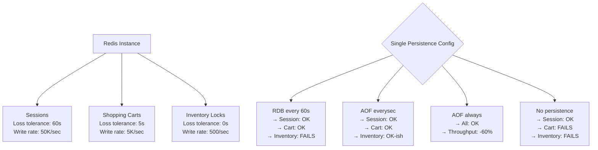
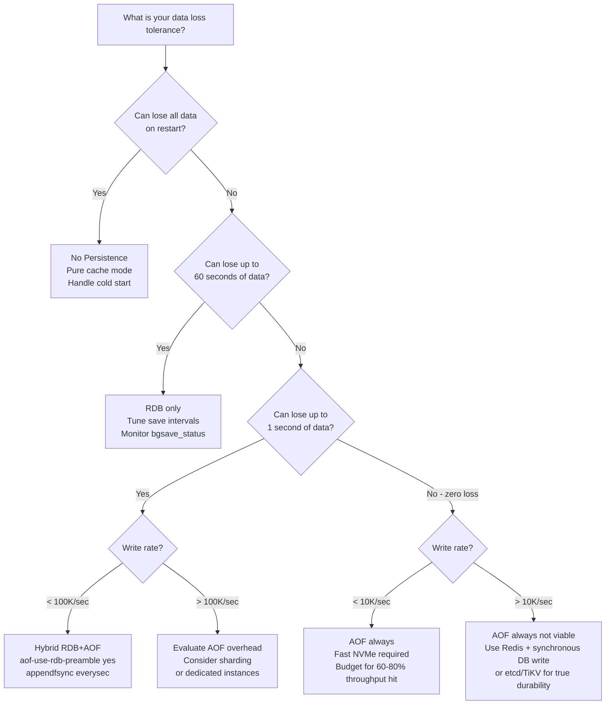

# Redis Persistence: RDB vs AOF vs No-Persistence Trade-off at Scale

**Redis persistence is not a binary choice — it's a three-dimensional trade-off between data loss window, write throughput, and operational complexity.** Most teams configure it once during initial setup, discover its implications during a 3am incident, and never revisit it. The wrong combination costs either $200K in lost transactions or 40% of your write throughput. Both outcomes are avoidable.

---

## The Problem Class `[Mid]`

An e-commerce platform uses Redis for three things: session storage, shopping cart persistence, and inventory reservation locks. Each has radically different durability requirements:

- **Sessions**: Losing 60 seconds of sessions on restart means users must re-login. Acceptable for most apps.
- **Shopping carts**: Losing 60 seconds of cart updates means customers lose items they added. Recoverable but damaging to conversion.
- **Inventory locks**: Losing a lock that reserved the last unit of an item means two users buy the same unit. This is a financial incident.

A single Redis instance with a single persistence configuration cannot serve all three durability requirements correctly. Yet this is the most common architecture pattern.



The correct answer is three separate Redis instances with different persistence configs, or — at minimum — a deliberate choice with documented data loss tolerance per use case.

---

## Why the Obvious Solution Fails `[Senior]`

**"Just enable AOF with everysec"** is the standard answer from most Redis tutorials. Here's what they don't tell you:

**Write amplification reality**: AOF with `appendfsync everysec` uses a background thread to call `fsync()` every second. At 100K writes/sec, each write appends ~30–100 bytes to the AOF file. That's 3–10 MB/sec of sequential writes. On a 1TB SSD with 500 MB/s write throughput, this is fine. On a cloud instance with a 125 MB/s EBS volume at peak throughput (AWS gp2), your Redis writes are now competing with AOF writes for IO bandwidth. Latency P99 jumps from 0.3ms to 4ms.

**AOF rewrite blocking**: `BGREWRITEAOF` uses `fork()`. At 20GB Redis dataset, `fork()` takes 1–3 seconds on Linux (even with copy-on-write) due to page table duplication. During this fork, Redis is blocked. Every 60 seconds (default `auto-aof-rewrite-percentage 100`), your Redis blocks for up to 3 seconds. This is the hidden AOF tax.

**RDB false safety**: Teams enable RDB with `save 900 1 300 10 60 10000` (the defaults) and believe they have persistence. What they have is: if the server crashes between snapshots, all writes since the last snapshot are lost. With 60-second snapshots, that's up to 60 seconds of data loss — which is only acceptable if explicitly understood.

**No persistence hidden cost**: Redis with `save ""` (no RDB) and `appendonly no` (no AOF) restarts empty. If your application doesn't handle cache-miss storms on cold start (every key is a miss), restart causes database overload. Teams discover this the first time they do a maintenance restart.

---

## The Solution Landscape `[Senior]`

### Solution 1: RDB (Redis Database Snapshot)

**What it is**: Point-in-time snapshots of the entire dataset, written as a compact binary file. Triggered by time + change count thresholds, manually via `BGSAVE`, or at shutdown.

**How it actually works at depth**: `BGSAVE` calls `fork()`. The child process writes the snapshot using copy-on-write semantics — the parent continues serving writes, and modified pages are duplicated at the OS level. The child sees the dataset at the fork point. When the child completes, the new RDB file atomically replaces the old one via `rename()`. Memory overhead during RDB: up to 2x dataset size in the worst case (every page modified during snapshot), typically 20–50% overhead for write-heavy workloads.

**Configuration**:
```
save 900 1       # snapshot if 1 change in 900 seconds
save 300 10      # snapshot if 10 changes in 300 seconds
save 60 10000    # snapshot if 10000 changes in 60 seconds
dbfilename dump.rdb
dir /var/lib/redis
rdbcompression yes   # LZ4 compression, ~30% size reduction, minimal CPU cost
rdbchecksum yes      # CRC64 checksum, adds ~10% overhead at save/load time
```

**Sizing guidance** `[Staff+]`
- Fork overhead: ~0.5ms per GB of dataset on modern Linux with transparent huge pages disabled
- RDB file size: typically 30–60% of in-memory dataset size (with compression)
- Memory overhead during BGSAVE: baseline + dirty pages. At 10K writes/sec to uniformly distributed keys: ~10–20% memory overhead
- IO overhead: RDB write = dataset size / (snapshot duration). 10GB dataset in 30 seconds = 333 MB/s IO burst
- Startup time from RDB: ~100–200 MB/sec load speed = 50 seconds for 10GB dataset

**When RDB wins**:
- Cache-only workloads (warm restart is acceptable; cold start hits through to DB)
- Large datasets where AOF rewrite overhead is prohibitive
- Disaster recovery backups (RDB files are compact, portable, and faster to restore)
- Analytics Redis instances where seconds of data loss are acceptable

**Failure modes** `[Staff+]`
- **Fork on huge pages**: Linux transparent huge pages (THP) can make page duplication during fork 10–100x more expensive. THP converts 4KB pages to 2MB pages; copying a 2MB page when only 4KB is modified wastes 1.996MB of memory and memory bandwidth. Disable THP: `echo never > /sys/kernel/mm/transparent_hugepage/enabled`. This is the #1 undiagnosed Redis latency spike cause.
- **Disk full during BGSAVE**: If disk fills during RDB write, the child fails. Redis logs the error but keeps serving. If it fails consistently, you silently have no persistence. Alert on `rdb_last_bgsave_status:err` from `INFO persistence`.
- **Data loss calculation**: Maximum data loss = time between last successful snapshot and crash. With `save 60 10000`, if traffic is always > 10K changes/minute, snapshots run every 60 seconds. Maximum loss: 60 seconds.

**Observability** `[Staff+]`
- `INFO persistence` → `rdb_last_bgsave_time_sec`, `rdb_last_bgsave_status`, `rdb_changes_since_last_save`
- Alert: `rdb_last_bgsave_status:err` — persistence silently broken
- Alert: `rdb_changes_since_last_save` > 100K and time since last save > 120 seconds

---

### Solution 2: AOF (Append-Only File)

**What it is**: Every write command is appended to the AOF log. On restart, Redis replays the log to reconstruct the dataset. AOF is the closer-to-durability option but with write overhead.

**How it actually works at depth**: Writes are first buffered in an in-memory AOF buffer. The `appendfsync` setting controls when `fsync()` is called to flush from OS buffer to disk:
- `always`: `fsync()` after every write command. Guarantees ≤ 1 command data loss. Throughput: ~10K writes/sec (limited by disk fsync latency, typically 1–10ms per fsync).
- `everysec`: `fsync()` every second in a background thread. Maximum 1 second of data loss. Throughput: ~100K–500K writes/sec.
- `no`: Never explicitly fsync (OS decides when to flush, typically every 30 seconds). Maximum 30 seconds of data loss. Throughput: limited only by disk sequential write speed.

**AOF rewrite**: Over time, AOF grows with redundant commands (`SET key 1`, then `SET key 2`, then `SET key 3` — only the last matters). `BGREWRITEAOF` (triggered automatically by `auto-aof-rewrite-percentage 100 auto-aof-rewrite-min-size 64mb`) rewrites the AOF to contain only the current state. During rewrite, new commands go to both the old AOF and a rewrite buffer. After rewrite completes, the rewrite buffer is appended and the new file replaces the old.

**Configuration**:
```
appendonly yes
appendfsync everysec          # recommended default
no-appendfsync-on-rewrite no  # yes = disable fsync during BGREWRITEAOF (risky)
auto-aof-rewrite-percentage 100
auto-aof-rewrite-min-size 64mb
aof-use-rdb-preamble yes      # hybrid mode: RDB base + AOF delta (recommended)
```

**Sizing guidance** `[Staff+]`
- AOF growth rate at 100K writes/sec with avg 50 bytes/cmd: 5 MB/sec → 300 MB/min → 18 GB/hour
- With `auto-aof-rewrite-percentage 100`, rewrite triggers when AOF doubles. At 18 GB/hour growth rate, rewrites fire every 3.5 minutes.
- Each rewrite forks: 20GB dataset → 1.5s fork time → 3 seconds of potential latency spike every 3.5 minutes
- AOF file size after rewrite: ~60–80% of RDB size (similar to RDB content, plus recent commands)
- Disk IO for `always` fsync: 1 fsync per command × 5ms fsync latency = max 200 writes/sec per disk

**When AOF wins**:
- Shopping carts, user preferences, any data where 1-second loss is unacceptable but 0-loss not required
- Applications that can tolerate the operational overhead of AOF management
- Services with moderate write rates (< 50K/sec) where fsync overhead is acceptable

**Failure modes** `[Staff+]`
- **AOF corruption on crash**: If the server crashes mid-write, the AOF file can have a truncated command at the end. Redis detects this on startup and by default refuses to start (`aof-load-truncated no`) or loads the good portion (`aof-load-truncated yes`). Always set `aof-load-truncated yes` in production — the alternative is complete startup failure.
- **Rewrite during heavy load**: `BGREWRITEAOF` during a write spike doubles disk IO (writing to both old AOF and rewrite). If disk IO is already at 80% during the spike, rewrite pushes it to 160% → disk queue depth spikes → latency spikes. Use `no-appendfsync-on-rewrite yes` only if you understand the data loss implication (during rewrite, data only in OS buffer, not fsynced).
- **AOF replay slower than expected**: Replaying 50GB AOF at restart: Redis processes ~500K commands/sec on replay → 100 seconds for 50M commands. During replay, Redis is unavailable. Use hybrid persistence (RDB preamble + AOF delta) to reduce replay time.

**Observability** `[Staff+]`
- `INFO persistence` → `aof_pending_rewrite`, `aof_buffer_length`, `aof_rewrite_in_progress`
- Alert: `aof_buffer_length` > 10MB — AOF buffer growing faster than it can be flushed
- Alert: `aof_rewrite_in_progress:1` for > 5 minutes — rewrite stuck
- Latency: `LATENCY HISTORY fork` — shows fork duration history

---

### Solution 3: Hybrid Persistence (RDB + AOF)

**What it is**: Enabled via `aof-use-rdb-preamble yes`. The AOF file starts with an RDB snapshot as its preamble, then appends only the delta (commands since the snapshot). On restart, Redis loads the fast RDB preamble, then replays only the small delta.

**How it actually works at depth**: During `BGREWRITEAOF`, the child process writes an RDB file as the new AOF's preamble, then appends commands from the rewrite buffer (changes since fork). The result: a file that loads in RDB speed (fast binary deserialization) plus a small command log. This is the recommended default for Redis ≥ 4.0.

**Sizing guidance** `[Staff+]`
- Restart time: RDB load (fast) + AOF delta replay (seconds, not minutes)
- Example: 20GB dataset, 10K writes/sec, rewrite every 30 minutes → AOF delta = 10K × 50 bytes × 1800 sec = 900MB → replay 900MB at startup ≈ additional 2–3 seconds vs pure RDB
- Compare to pure AOF: 20GB × 4x growth factor between rewrites = 80GB AOF → much longer replay

**When Hybrid wins**: Almost always, for production workloads that need both durability and fast restart. The only reason to not use hybrid is Redis < 4.0 (no longer relevant in 2026).

**Configuration**:
```
appendonly yes
aof-use-rdb-preamble yes
appendfsync everysec
save 3600 1     # Keep RDB as disaster recovery backup
```

---

### Solution 4: No Persistence (Pure Cache Mode)

**What it is**: `save ""` (disable RDB) + `appendonly no` (disable AOF). Redis is a pure in-memory cache.

**When No Persistence wins**:
- Read-through cache: all data exists in the source database; Redis is only for performance
- Session storage where logout-on-restart is acceptable
- Rate limiting counters where restarting counters on crash is acceptable (security concern: users get fresh quota after Redis restart — mitigate with circuit breaker on restart detection)
- Replicas: read replicas should not persist (they get data from primary via replication)

**Failure modes** `[Staff+]`
- **Cold-start cascade**: After Redis restart, every request is a cache miss. If your DB handles 10K queries/sec normally and 200K queries/sec during cold cache (all requests miss simultaneously), the DB can be overwhelmed before Redis warms up. Implement: startup warming (pre-fetch hot keys from DB), or cache-aside with per-key jitter on TTL to spread re-population.
- **Silent empty restart**: No-persistence Redis with data loss can go undetected. Add a sentinel key: `SET redis:started:{timestamp} 1 EX 3600` on startup and check for it in application health checks.

---

## Trade-off Matrix `[Senior]` → `[Staff+]`

| Dimension | No Persistence | RDB only | AOF everysec | AOF always | Hybrid (RDB+AOF) |
|---|---|---|---|---|---|
| Max data loss | 100% | 1–60 seconds | ~1 second | ≤ 1 command | ~1 second |
| Write throughput impact | 0% | 5–20% (fork) | 10–30% | 60–80% | 10–30% |
| Restart time (20GB) | Instant (empty) | 100 seconds | 5–10 min (replay) | 5–10 min | 105 seconds |
| Disk IO | 0 | Burst at snapshot | Continuous | Continuous + fsync/cmd | Continuous |
| Fork latency spike | None | Yes (at snapshot) | Yes (at rewrite) | Yes (at rewrite) | Yes (at rewrite) |
| Operational complexity | Low | Low | Medium | Medium | Medium |
| Suitable for | Pure cache | Analytics, large datasets | Most production | Financial/inventory | Recommended default |

---

## Decision Framework — When to Pick Each `[Senior]` → `[Staff+]`



**Decision shortcuts**:
- **E-commerce inventory, financial balances**: Hybrid + `appendfsync everysec` + application-level idempotency
- **Session storage**: RDB or No Persistence + accept 60-second loss
- **Rate limiting**: No Persistence (resetting on restart is acceptable, reduces DOS window)
- **Analytics dashboards**: RDB only (losing recent events is OK)
- **Primary datastore (no other DB)**: Do not use Redis as primary store without `appendfsync always` + NVMe + replication

---

## Production Failure Story `[Staff+]`

**The hybrid configuration that caused a 14-minute outage.**

A SaaS company ran Redis with `appendonly yes`, `aof-use-rdb-preamble yes`, `auto-aof-rewrite-percentage 100`, and `auto-aof-rewrite-min-size 64mb`. Dataset was 18GB. Write rate: 80K/sec.

At 14:30, the AOF file crossed 64MB for the first time (the system had recently migrated from a smaller instance). `BGREWRITEAOF` triggered automatically. The fork took 2.1 seconds on the shared-tenancy cloud instance. During the fork, latency spiked to 2.3 seconds — above the application's 2-second timeout.

The application's circuit breaker opened. It marked Redis as "unhealthy" and fell through to the database. The database, unprepared for 200K queries/sec (10x normal), started throttling. After 4 minutes, Redis latency recovered (fork completed), but the circuit breaker had a 10-minute recovery timeout. The service used degraded DB-only mode for 10 minutes with 8x normal DB load.

**What the runbook missed**: No entry for "Redis latency spike during normal operation." The alert fired as "Redis latency > 2s" — identical to a Redis crash or network partition. The on-call engineer tried restarting Redis (which would have caused another fork-induced spike on startup) before the circuit breaker recovery completed naturally.

**Fix**:
1. Set `auto-aof-rewrite-min-size 512mb` to reduce rewrite frequency
2. Schedule `BGREWRITEAOF` manually during low-traffic windows via cron
3. Add runbook step: "Redis latency spike — check `INFO persistence` for `aof_rewrite_in_progress` before any other action"
4. Tune circuit breaker recovery timeout from 10 minutes to 60 seconds for Redis

---

## Observability Playbook `[Staff+]`

**Metric 1: Fork-induced latency tracking**
- `LATENCY HISTORY fork` — Redis built-in latency tracking for fork events
- Alert threshold: Fork duration > 500ms on any instance
- Early warning: Dataset size growing > 20GB → next fork will exceed 1 second (estimate: 50ms per GB)
- Mitigation trigger: If fork takes > 1 second, schedule `BGREWRITEAOF` during off-peak hours

**Metric 2: Persistence health**
- `INFO persistence` every 30 seconds; parse into time-series metrics
- Key fields: `rdb_last_bgsave_status` (alert on `err`), `aof_last_rewrite_time_sec` (alert if > 300), `aof_buffer_length` (alert if > 5MB)
- `rdb_changes_since_last_save` × write-value-size = estimated data loss on crash right now

**Metric 3: Disk IO saturation**
- Monitor disk write throughput on Redis host: AOF write + RDB write must not exceed 80% of disk throughput
- Alert: `disk_write_bytes_sec` > 80% of provisioned IOPS throughput for > 30 seconds
- For AWS EBS gp3: max 1000 MB/s; alert at 800 MB/s sustained

**Dashboard layout**:
1. Top row: `used_memory`, `rdb_changes_since_last_save`, `aof_pending_rewrite`
2. Middle row: fork latency history, AOF rewrite frequency, disk write throughput
3. Bottom row: bgsave status timeline, rewrite duration trend, estimated data loss window (changes × avg interval)

---

## Architectural Evolution `[Staff+]`

**12-month compounding**: Teams that start with "we'll just use AOF everysec" hit the rewrite fork latency problem at month 4–6 when the dataset crosses 15–20GB. They scramble to tune `auto-aof-rewrite-percentage` and discover that reducing rewrite frequency means the AOF file grows larger, which means the next rewrite takes even longer. The correct fix (scheduled rewrites during off-peak + pre-warmed replica) requires infrastructure changes that take 2–3 sprints.

**10x scale changes**:
- At 10x dataset (180GB): fork takes 9+ seconds — completely unacceptable. You must move to Redis Cluster where each shard is ≤ 20GB, limiting per-shard fork overhead.
- At 10x write rate (800K/sec): AOF file grows at 40MB/sec. Rewrite triggers every 90 seconds. You cannot rewrite fast enough to prevent disk filling. Solution: AOF with `no-appendfsync-on-rewrite yes` + RAID-0 NVMe or network-attached fast storage.
- Diskless replication (`repl-diskless-sync yes`) becomes necessary at 10x: instead of writing RDB to disk and sending the file to replica, stream directly to replica socket. Saves one full disk write per replication sync.

**2026 tooling perspective**:
- **eBPF for persistence profiling**: `biolatency` (BCC toolkit) can measure actual fsync latency per disk operation without modifying Redis. Use it to prove that `appendfsync everysec` is hitting disk at the expected rate vs being OS-buffered.
- **Rust-based RDB analyzers**: `rdb` (Rust crate) parses RDB files 5–10x faster than Python-based tools. Critical for automated backup validation — parse the RDB file after every snapshot to verify integrity before it's the only backup.
- **Platform engineering — persistence as a contract**: Internal Redis provisioning should expose persistence tier selection (none/rdb/aof/hybrid) as a service-level parameter. The platform auto-configures the correct thresholds based on dataset size and write rate telemetry. This prevents the "set it and forget it" anti-pattern.
- **Redis 8.x improvements**: Redis 8.0 is working on asynchronous fork for RDB (experimental). If it ships, fork-induced latency spikes may become a solved problem — but expect 12–18 months before it's stable enough for production.

---

## Decision Framework Checklist `[All Levels]`

- [ ] Document the maximum acceptable data loss window for each data category stored in Redis (0ms, 1s, 60s, or "any")
- [ ] Calculate write rate (writes/sec) and choose `appendfsync` mode that keeps disk IO below 80% of provisioned throughput
- [ ] Disable transparent huge pages on Redis hosts: `echo never > /sys/kernel/mm/transparent_hugepage/enabled`
- [ ] Measure fork time: `LATENCY HISTORY fork` after first BGSAVE; scale estimate with dataset size
- [ ] Enable hybrid persistence (`aof-use-rdb-preamble yes`) for all production instances running Redis ≥ 4.0
- [ ] Set `auto-aof-rewrite-min-size` based on write rate, not the default 64MB — at 100K writes/sec, 64MB fills in 12 seconds
- [ ] Configure `aof-load-truncated yes` to prevent startup failure on AOF truncation after crash
- [ ] Alert on `rdb_last_bgsave_status:err` and `aof_buffer_length > 5MB` as P1 incidents
- [ ] Plan for cold-start cascade: implement startup warming or circuit breaker with short recovery for cache misses post-restart
- [ ] Validate persistence actually works: run `DEBUG SLEEP 0` then manually kill and restart, verify data survives

---

*Written by Gaurav Porwal — 10+ Year Engineer | Tech Lead | Product Owner | Business-Minded Builder*
*Last updated: 2026-03-18*
