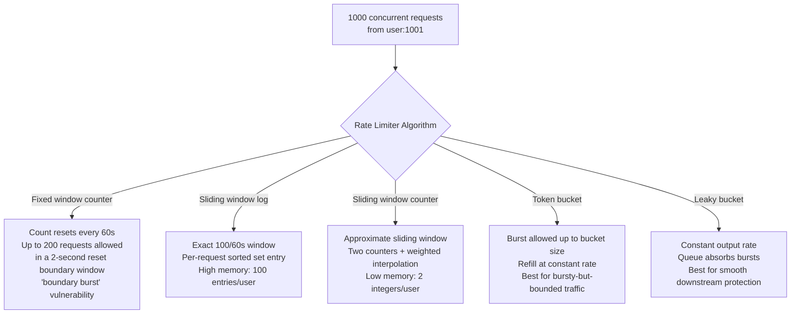
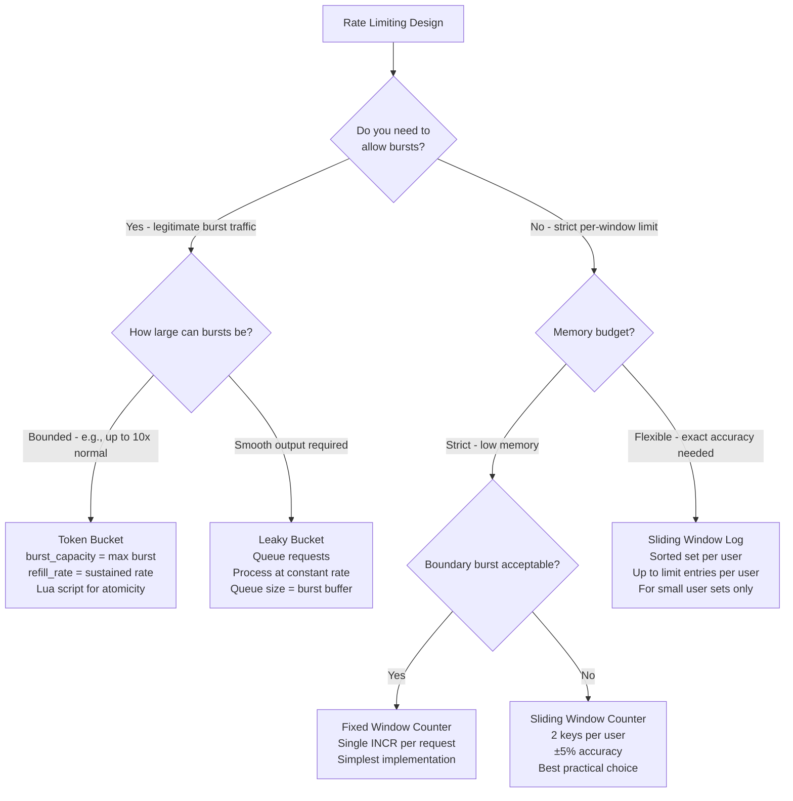

# Redis Rate Limiting: Token Bucket, Sliding Window, and Lua Atomicity

**Rate limiting with Redis fails in production when two facts collide: MULTI/EXEC provides ordering but not atomicity for composite operations, and most rate limiting algorithms require multiple operations that must be atomic.** Imagine 1000 concurrent requests hitting your rate limiter simultaneously. Without Lua atomicity, 80 requests can slip through a limit of 100/sec. Here's the exact algorithm, sizing math, and Lua implementation for each rate limiting pattern.

---

## The Problem Class `[Mid]`

Imagine an API that allows 100 requests per user per minute. Without a rate limiter, a single abusive user can send 10,000 requests, consuming resources and degrading service for everyone else.



The diagram shows 5 distinct algorithms — not interchangeable. A fixed window allows double the limit across a boundary. A token bucket allows controlled bursts. A leaky bucket smooths out peaks. The right choice depends on whether you want to protect the API (token bucket) or protect downstream services (leaky bucket).

---

## Why the Obvious Solution Fails `[Senior]`

**The MULTI/EXEC atomicity misconception**:

```
# Appears atomic but isn't:
MULTI
GET ratelimit:user:1001
INCR ratelimit:user:1001
EXPIRE ratelimit:user:1001 60
EXEC
```

The problem: `GET` inside `MULTI` doesn't return the value to the client during queuing — it returns a queued promise. You cannot use the result of `GET` to make a decision (allow/deny) within the same `MULTI/EXEC` block. By the time `EXEC` runs and you get the results, the decision was already made outside the transaction.

> 💡 **What this means in practice:** `MULTI/EXEC` queues commands and runs them in order, but you can't conditionally queue based on results. It prevents interleaving with other clients, but you still need two round trips: one to read the count, one to decide and increment. Between those two trips, another request can slip through.

The correct approach is Lua scripting via `EVAL`. A Lua script runs entirely within the Redis process — no other commands execute between lines of your Lua script. This is true atomicity for multi-step operations.

**The race condition at scale**: At 1000 req/sec with a 100 req/min limit:
- Without atomic check-and-increment: 100ms window where multiple requests read count=99, all decide "allowed," all increment → count ends at 109, 9 requests slip through
- With Lua atomic check-and-increment: impossible — only one request can be in the "check and increment" phase at a time per Redis instance (Redis is single-threaded for command execution)

---

## The Solution Landscape `[Senior]`

### Solution 1: Fixed Window Counter — Simple but with Boundary Burst

**What it is**: Count requests in fixed time windows (1-second windows, 1-minute windows). Reset the counter at the window boundary.

**How it actually works at depth**:

```
# Lua script for fixed window — atomic check and increment
fixedWindowScript = """
local key = KEYS[1]
local limit = tonumber(ARGV[1])
local window = tonumber(ARGV[2])  -- window size in seconds

local current = redis.call('GET', key)
if current == false then
    -- Key doesn't exist (new window)
    redis.call('SET', key, 1, 'EX', window)
    return {1, limit, 1}  -- {count, limit, allowed}
end

current = tonumber(current)
if current < limit then
    redis.call('INCR', key)
    return {current + 1, limit, 1}  -- allowed
else
    return {current, limit, 0}  -- denied
end
"""

function checkFixedWindow(userId, limit, windowSeconds):
    key = "ratelimit:fixed:" + userId + ":" + floor(now() / windowSeconds)
    result = redis.EVAL(fixedWindowScript, 1, key, limit, windowSeconds)
    return result[3] == 1  # allowed?
```

**The boundary burst problem**:
- Window 1: seconds 0–60. User sends 100 requests at second 58. All allowed.
- Window 2: seconds 60–120. User sends 100 requests at second 62. All allowed.
- Net result: 200 requests in 4 seconds — 2x the intended 100/minute limit.

**Sizing guidance** `[Staff+]`
- Memory: 1 key per user per window = 1 integer per user. At 1M users, 1-minute window: 1M × ~70 bytes = 70MB.
- Key count at scale: 1M users × 1 window key = 1M active keys. With 60-second TTL, keys self-clean.
- Throughput: single `EVAL` call per request — ~500K evaluations/sec

**When fixed window wins**: Simple API rate limiting where boundary bursts are acceptable. Internal service-to-service rate limiting. Coarse-grained daily limits (1000 API calls/day — boundary burst of 2000 calls in a few seconds is acceptable at this granularity).

**Failure modes** `[Staff+]`
- **Clock sync attacks**: If client clocks are used to calculate window boundaries, attackers with accurate clocks can time requests to maximize boundary bursts. Use server-side time only.
- **Memory spike at window rollover**: At each window boundary, all active users' new keys are created simultaneously. At 1M concurrent users, 1M SETEX operations fire in the same second. Redis handles this fine, but monitor `used_memory` for the brief spike.

---

### Solution 2: Sliding Window Log — Exact but Memory-Intensive

**What it is**: For each user, maintain a Sorted Set where each member is a request timestamp. To check the rate, count members in the last N seconds window.

**How it actually works at depth**:

```
# Sliding window log — exact rate limiting
slidingWindowLogScript = """
local key = KEYS[1]
local limit = tonumber(ARGV[1])
local windowMs = tonumber(ARGV[2])
local now = tonumber(ARGV[3])
local windowStart = now - windowMs

-- Remove entries outside the window
redis.call('ZREMRANGEBYSCORE', key, '-inf', windowStart)

-- Count requests in window
local count = redis.call('ZCARD', key)

if count < limit then
    -- Add current request timestamp as both score and member
    redis.call('ZADD', key, now, now)
    redis.call('PEXPIRE', key, windowMs)
    return {count + 1, limit, 1}  -- allowed
else
    return {count, limit, 0}  -- denied
end
"""

function checkSlidingWindowLog(userId, limit, windowMs):
    key = "ratelimit:swlog:" + userId
    now = currentTimeMs()
    result = redis.EVAL(slidingWindowLogScript, 1, key, limit, windowMs, now)
    return result[3] == 1
```

> 💡 **What this means in practice:** Each request is stored as a timestamped entry in a sorted set. Before checking the count, we remove all entries older than the window. This gives an exact count of requests in the rolling window — but stores up to `limit` entries per user. At limit=1000 requests/minute and 1M users actively hitting the limit, that's 1 billion entries.

**Sizing guidance** `[Staff+]`
- Memory: up to `limit` Sorted Set entries per user. Each entry: ~50 bytes (score + member + listpack overhead).
- At limit=100, 1M users all at limit: 100 × 1M × 50 bytes = **5GB**. This is the worst case.
- At limit=1000 for a premium tier: 1000 × 1M × 50 bytes = **50GB** — impractical.
- Practical limit: sliding window log is suitable when limit is ≤ 50 requests per window OR user count is small.

**When sliding window log wins**: Strict accuracy required for legal/compliance rate limits. Small user base (< 100K active). Moderate request limits (< 100 per window).

---

### Solution 3: Sliding Window Counter — Accurate and Memory-Efficient

**What it is**: Two counters: the current window and the previous window. Weight the previous window based on how far into the current window we are. This approximates the sliding window with O(1) memory per user.

**The math**:
```
# Current window started T seconds ago, window size = W seconds
# prev_window_count = requests in previous window
# curr_window_count = requests in current window
# Weight of previous window = (W - T) / W

approximate_current = (prev_window_count * (W - T) / W) + curr_window_count
```

**How it actually works at depth**:

```
slidingWindowCounterScript = """
local curr_key = KEYS[1]     -- current window key
local prev_key = KEYS[2]     -- previous window key
local limit = tonumber(ARGV[1])
local window = tonumber(ARGV[2])  -- window size in seconds
local now = tonumber(ARGV[3])     -- current unix timestamp in ms
local window_ms = window * 1000

-- Calculate how far into current window we are (0.0 to 1.0)
local window_start = math.floor(now / window_ms) * window_ms
local elapsed = now - window_start
local prev_weight = (window_ms - elapsed) / window_ms

-- Get counts
local curr_count = tonumber(redis.call('GET', curr_key) or 0)
local prev_count = tonumber(redis.call('GET', prev_key) or 0)

-- Approximate count using weighted previous window
local approx_count = math.floor(prev_count * prev_weight + curr_count)

if approx_count < limit then
    -- Increment current window
    local new_count = redis.call('INCR', curr_key)
    if new_count == 1 then
        redis.call('EXPIRE', curr_key, window * 2)  -- expire after 2 windows
    end
    return {approx_count + 1, limit, 1}  -- allowed
else
    return {approx_count, limit, 0}  -- denied
end
"""

function checkSlidingWindowCounter(userId, limit, windowSeconds):
    windowMs = windowSeconds * 1000
    now = currentTimeMs()
    windowBucket = floor(now / windowMs)
    currKey = "ratelimit:swcount:" + userId + ":" + windowBucket
    prevKey = "ratelimit:swcount:" + userId + ":" + (windowBucket - 1)
    result = redis.EVAL(slidingWindowCounterScript, 2, currKey, prevKey,
                        limit, windowSeconds, now)
    return result[3] == 1
```

**Sizing guidance** `[Staff+]`
- Memory: 2 integer keys per user = 2 × 70 bytes = 140 bytes per user
- At 1M active users: 140MB — 35x less than sliding window log at limit=100
- Accuracy: error ≤ 5% of the limit in worst case (when all previous window traffic was at the end of the window). For limit=100, maximum overshoot: 5 requests. Acceptable for most rate limiting.
- Throughput: 2 GET + 1 INCR in single Lua script → ~400K evaluations/sec

**When sliding window counter wins**: Any production API rate limiting with > 10K users. The combination of accuracy (< 5% error) and O(1) memory per user makes this the default choice.

---

### Solution 4: Token Bucket — Controlled Burst Allowance

**What it is**: A bucket holds tokens. Tokens refill at a constant rate (refill_rate tokens/second). Each request consumes 1 token. If the bucket is empty, the request is denied. Bucket has a maximum capacity (burst limit).

**How it actually works at depth**:

```
tokenBucketScript = """
local key = KEYS[1]
local burst_capacity = tonumber(ARGV[1])   -- max tokens (burst size)
local refill_rate = tonumber(ARGV[2])       -- tokens per second
local requested_tokens = tonumber(ARGV[3]) -- tokens this request needs (usually 1)
local now = tonumber(ARGV[4])              -- current time in seconds (float)

-- Get current state
local data = redis.call('HMGET', key, 'tokens', 'last_refill')
local tokens = tonumber(data[1])
local last_refill = tonumber(data[2])

-- Initialize if first request
if tokens == nil then
    tokens = burst_capacity
    last_refill = now
end

-- Refill tokens based on elapsed time
local elapsed = now - last_refill
local refill_amount = elapsed * refill_rate
tokens = math.min(burst_capacity, tokens + refill_amount)
last_refill = now

-- Check if request can be served
if tokens >= requested_tokens then
    tokens = tokens - requested_tokens
    redis.call('HMSET', key, 'tokens', tokens, 'last_refill', last_refill)
    redis.call('EXPIRE', key, math.ceil(burst_capacity / refill_rate) + 1)
    return {1, math.floor(tokens)}  -- {allowed, remaining_tokens}
else
    redis.call('HMSET', key, 'tokens', tokens, 'last_refill', last_refill)
    redis.call('EXPIRE', key, math.ceil(burst_capacity / refill_rate) + 1)
    return {0, 0}  -- {denied, 0 tokens remaining}
end
"""

function checkTokenBucket(userId, burstCapacity, refillRate):
    key = "ratelimit:tokenbucket:" + userId
    now = currentTimeUnixFloat()
    result = redis.EVAL(tokenBucketScript, 1, key,
                        burstCapacity, refillRate, 1, now)
    return {allowed: result[1] == 1, remaining: result[2]}
```

> 💡 **What this means in practice:** A user who hasn't made any API calls for 30 seconds has accumulated tokens. When they suddenly make 20 requests in a burst, the accumulated tokens allow all 20 through immediately. This is the right behavior for human users (natural burst-then-idle pattern). It's the wrong behavior if you want perfectly smooth traffic (use leaky bucket instead).

**Sizing guidance** `[Staff+]`
- Memory: 1 Hash per user with 2 fields (tokens, last_refill) = ~100 bytes per user
- At 1M users: 100MB — efficient
- Refill precision: Redis uses floating-point arithmetic in Lua. Timestamps stored as floats have nanosecond precision issues at large epoch values. Store millisecond epoch as integers to avoid float precision drift: `local now_ms = tonumber(ARGV[4])` and compute `refill_amount = (elapsed_ms / 1000.0) * refill_rate`.
- TTL calculation: key should expire when bucket would be full and idle. TTL = `ceil(burst_capacity / refill_rate)` + buffer.

**When token bucket wins**: APIs serving human users (bursty but bounded traffic). Endpoints where occasional high-throughput is legitimate (batch uploads, bulk operations). When you want to express rate as "N requests/second with burst of M."

**Failure modes** `[Staff+]`
- **Float precision drift**: Accumulated float errors in token count over thousands of requests can cause token count to drift by ±1. Negligible for most applications, but for strict financial rate limits, use integer-only accounting (tokens in units of 0.001 tokens).
- **Clock skew between application and Redis**: If `ARGV[4]` (current time) comes from the application server, clock drift between servers causes incorrect refill calculations. Use `redis.call('TIME')` within Lua to get server-side time: `local time_data = redis.call('TIME'); local now = tonumber(time_data[1]) + tonumber(time_data[2]) / 1e6`.

---

## Trade-off Matrix `[Senior]` → `[Staff+]`

| Algorithm | Memory per user | Accuracy | Burst handling | Key count | Atomicity mechanism |
|---|---|---|---|---|---|
| Fixed window | 70 bytes (1 key) | Boundary burst ±2x | None (cliff) | 1 | Single INCR (atomic) |
| Sliding window log | 50 bytes × limit | Exact | None (cliff) | 1 sorted set | Lua (ZREMRANGE + ZCARD + ZADD) |
| Sliding window counter | 140 bytes (2 keys) | ±5% | None (cliff) | 2 | Lua (2×GET + INCR) |
| Token bucket | 100 bytes (1 hash) | Exact | Yes (bucket size) | 1 | Lua (HMGET + HMSET) |
| Leaky bucket | 100 bytes + queue | Exact output rate | Absorbs bursts | 1 list + 1 key | Lua (LPUSH + LLEN) |

---

## Decision Framework — When to Pick Each `[Senior]` → `[Staff+]`



---

## Production Failure Story `[Staff+]`

**The rate limiter that allowed 10x the limit under concurrent load.**

A fintech API implemented a sliding window rate limit using non-Lua Redis commands:

```python
# WRONG — race condition
def check_rate_limit(user_id, limit, window_ms):
    key = f"ratelimit:{user_id}"
    pipe = redis.pipeline()
    pipe.zremrangebyscore(key, 0, time.time_ms() - window_ms)
    pipe.zcard(key)
    _, count = pipe.execute()

    if count < limit:
        pipe = redis.pipeline()
        pipe.zadd(key, {str(time.time_ms()): time.time_ms()})
        pipe.expire(key, window_ms // 1000)
        pipe.execute()
        return True
    return False
```

This uses a pipeline (not `MULTI/EXEC`), which doesn't provide any atomicity. Between `zcard` returning `count` and the `zadd` adding the request, 500 other requests can execute the same sequence. All 500 read `count < limit`, all 500 proceed to `zadd`.

During a high-traffic period with 1000 concurrent requests against a limit of 100 per minute, ~95 requests per second were slipping through — nearly 10x the limit.

**Root cause**: Non-atomic check-and-increment. Multiple requests read the count simultaneously, all below the limit, all proceeded.

**Fix**: Replaced with a single Lua `EVAL` containing the ZREMRANGEBYSCORE + ZCARD + conditional ZADD. Lua execution is atomic at the Redis level — no other command runs between Lua lines.

**Validation**: Load test post-fix showed ≤ 102 requests allowed per 60-second window (the 2% overage from the sliding window counter approximation was acceptable).

---

## Observability Playbook `[Staff+]`

**Metric 1: Rate limit hit rate and denial ratio**
- Instrument your rate limiter to emit: `ratelimit.allowed` (counter), `ratelimit.denied` (counter), `ratelimit.remaining` (gauge per user)
- Alert: denial rate > 5% of total requests — either rate limits are too strict or abuse is occurring
- Per-user monitoring: users consistently hitting limit = legitimate high usage (consider raising limit) or abuse (consider blocking)

**Metric 2: Redis Lua script latency**
- `SLOWLOG GET 100` — Lua scripts executing > 10ms indicate performance issues
- Alert: any Lua script > 5ms P99 — rate limiter adding > 5ms to every request
- Instrument: measure time from `EVAL` call to response in application code; alert on P99 > 2ms

**Metric 3: Key memory usage for rate limit namespace**
- Sample `MEMORY USAGE ratelimit:*` keys (using SCAN, never KEYS)
- Alert: rate limit namespace consuming > 10% of `maxmemory`
- Key growth rate: if `ratelimit:*` key count growing faster than user count, investigate TTL configuration

**Dashboard layout**:
1. Top row: requests/sec, allowed vs denied rate, P99 rate limiter latency
2. Middle row: top 10 users by request count, denial rate by endpoint, rate limit key count
3. Bottom row: Redis EVAL latency histogram, token bucket utilization distribution, Lua slow log entries

---

## Architectural Evolution `[Staff+]`

**12-month compounding**: Teams that implement fixed window rate limiting at launch discover the boundary burst problem during their first DDoS attempt. The attacker specifically times requests to straddle window boundaries. Migrating from fixed window to sliding window counter requires updating key schemas and handling the migration window (old keys vs new keys coexisting).

**10x scale changes**:
- At 10x users (10M active users): rate limit keys = 10M × 2 (sliding window counter) = 20M keys × 140 bytes = 2.8GB. Plan for this in `maxmemory` sizing.
- At 10x request throughput (5M req/sec): Redis single-threaded Lua execution becomes a bottleneck. Shard rate limit keys across N Redis instances by user ID hash. Each shard handles 500K req/sec — within Redis limits.
- Consider Redis Cluster for rate limiting at scale: slot distribution naturally shards rate limit keys. But MULTI-key operations across slots don't work — ensure rate limit keys for a single user always map to the same slot (they naturally do if keys are `ratelimit:userId`).

**2026 tooling perspective**:
- **eBPF for rate limit enforcement at kernel level**: Linux Traffic Control (tc) with eBPF programs can enforce rate limits at the network packet level — before the application processes the request. This is 100x lower overhead than Redis-based rate limiting for simple IP-based limits. Use for DDoS protection; use Redis-based rate limiting for user-level granularity.
- **Rust-based rate limit sidecars**: Envoy proxy and nginx-based rate limiting sidecars can handle 1M+ req/sec with Redis as the shared state backend. The sidecar handles the Redis communication in Rust (zero-copy networking), leaving your application completely decoupled from rate limiting logic.
- **Platform engineering — rate limit policy as code**: Rate limiting policies (limits, algorithms, per-tenant overrides) should be declared in YAML/configuration files, not hardcoded in application code. The platform applies these policies at the API gateway level. Applications receive a `X-Rate-Limit-Remaining` header and handle 429 responses — they don't implement rate limiting directly.
- **Redis 8.x rate limiting modules**: Redis Functions (introduced in 7.0) replace Lua `EVAL` for rate limiting — they're pre-loaded into the server, avoiding the overhead of script compilation on each EVAL call. Migrate Lua EVAL scripts to Redis Functions for 5–10% throughput improvement at high rates.

---

## Decision Framework Checklist `[All Levels]`

- [ ] Never use non-atomic check-then-act for rate limiting (PIPELINE is not atomic; MULTI/EXEC can't branch on results)
- [ ] Implement all multi-step rate limiting logic in a single Lua `EVAL` script
- [ ] Use server-side time (`redis.call('TIME')`) inside Lua scripts, not client-provided timestamps
- [ ] Set TTL on all rate limit keys to prevent memory accumulation from inactive users
- [ ] Choose algorithm based on traffic pattern: fixed window for simple limits, sliding window counter for production accuracy, token bucket for bursty workloads
- [ ] Test boundary conditions: what happens at exactly the rate limit? at 2x the limit? during concurrent load?
- [ ] Load test with realistic concurrency (not sequential) — race conditions only appear under concurrent load
- [ ] Implement `X-RateLimit-Limit`, `X-RateLimit-Remaining`, `X-RateLimit-Reset` headers so clients can self-throttle
- [ ] Alert on rate limit denial rate > 5% — this indicates either abuse or misconfigured limits
- [ ] Plan for Redis restart: rate limit counters reset on restart with no-persistence config — brief over-allowance window is usually acceptable; document this behavior

---

*Written by Gaurav Porwal — 10+ Year Engineer | Tech Lead | Product Owner | Business-Minded Builder*
*Last updated: 2026-03-18*
