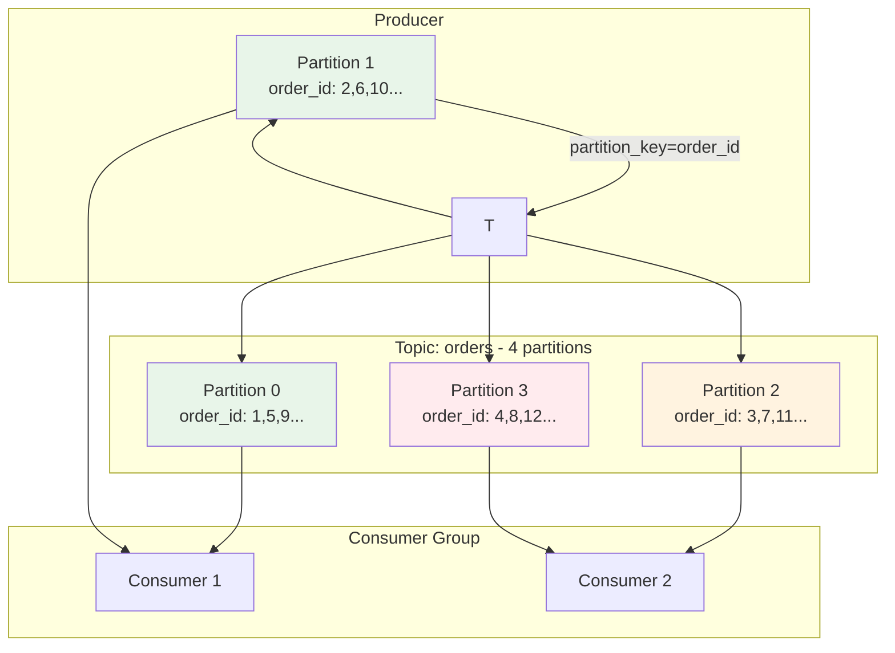
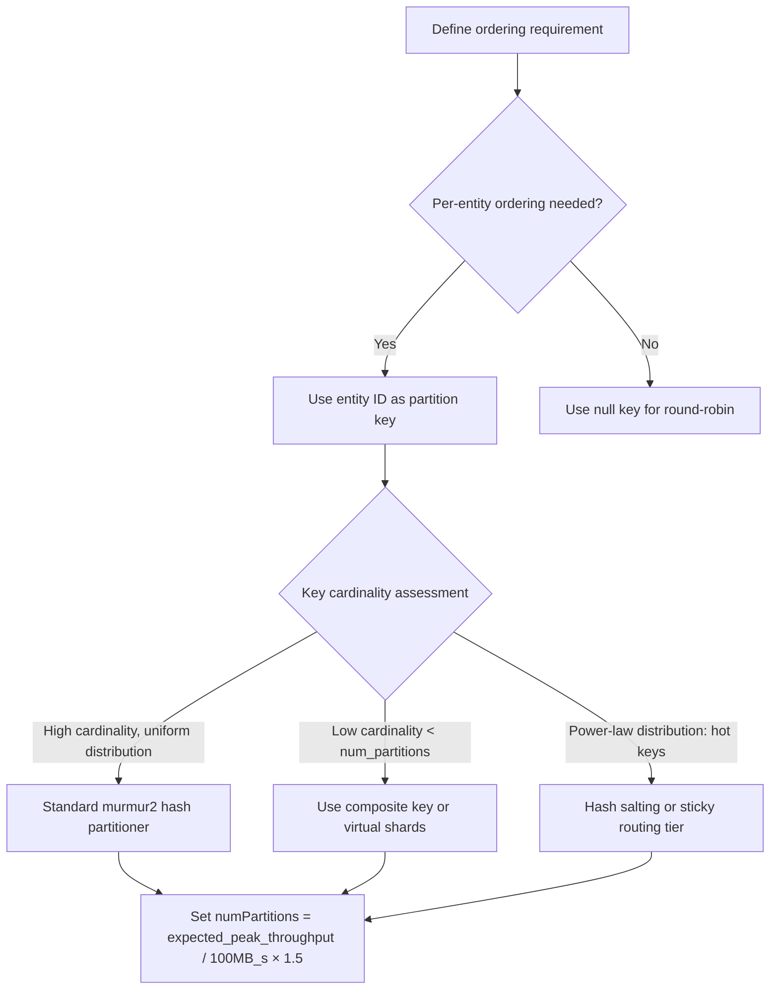
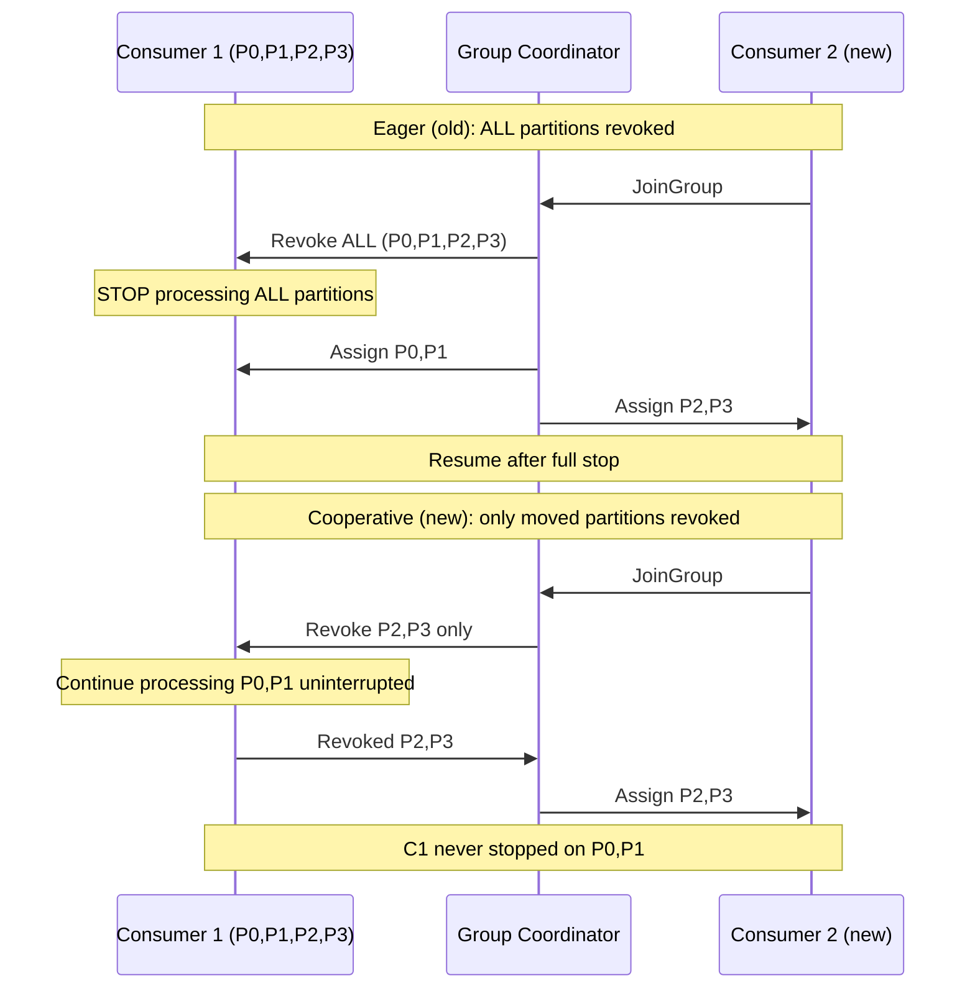
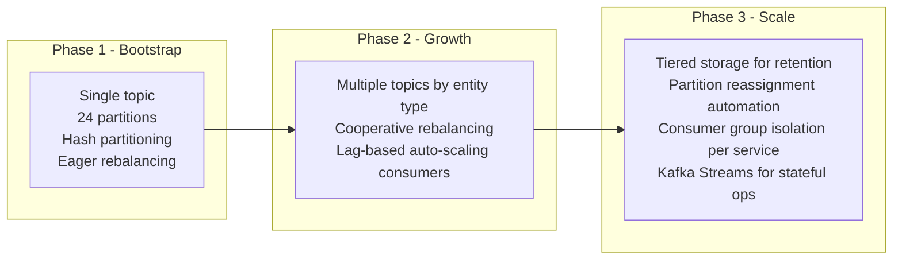

# Kafka Partitioning: Ordering Guarantees, Hot Partitions, and Rebalancing

**Partitioning is the most consequential architectural decision in a Kafka deployment.** Get it wrong and you face hot partitions that saturate brokers, stale ordering guarantees that corrupt downstream state, or eager rebalances that drop your p99 latency off a cliff every time a consumer restarts. This article covers the decisions that matter.

---

## The Problem Class `[Mid]`

You're running an order processing system. You have a `orders` topic and want to ensure that all events for a given `order_id` are processed in sequence — add item, apply discount, confirm payment. The naive solution is to create a topic with 1 partition: total ordering guaranteed. Throughput: ~50 MB/s per broker. You need 2 GB/s. The math doesn't work.

So you increase to 100 partitions. Now, ordering is only guaranteed **within a partition**. Whether two events for the same order land in the same partition depends entirely on your partition key. The wrong key choice, and you have two consumers racing to update the same order's state.



The constraint is rigid: **Kafka only guarantees ordering within a single partition.** Every design decision flows from this single fact.

**Real numbers that frame the problem:**
- A single Kafka partition handles ~100k messages/sec or ~100 MB/s (network-bound)
- A typical broker handles 6–8 partitions at full throughput before CPU becomes the bottleneck
- Partition count is immutable post-creation without data migration (before Kafka 4.0's partition reassignment improvements)
- A consumer group rebalance causes **stop-the-world** consumption for the duration (eager rebalancing)

---

## Why the Obvious Solution Fails `[Senior]`

### The null key trap

When no partition key is set, Kafka uses round-robin (or sticky partitioner in newer clients). This maximizes throughput and even distribution — but destroys per-entity ordering. If `order_id=42` events can land in any partition, Consumer A and Consumer B might both process events for order 42 concurrently.

**Result**: The "discount applied" event might be processed before "item added" even though it was produced after it.

### The high-cardinality key trap (hot partitions)

Using `user_id` as partition key when 20% of your users generate 80% of your traffic (power users, viral accounts, platform bots) creates **hot partitions**. Partition 7 might handle 40% of the total message volume while partitions 0–6 sit idle.

Hot partition symptoms:
- Broker disk write latency diverges across partitions
- `kafka.server:type=BrokerTopicMetrics,name=BytesInPerSec` spikes on specific broker
- Consumer lag accumulates on specific partitions despite consumers running at full speed

### The low-cardinality key trap

Using `tenant_id` as partition key when you have 8 tenants and 100 partitions means 92 partitions are always empty. You've provisioned resources for nothing, and all ordering semantics concentrate around 8 logical streams.

### The eager rebalance trap

When you add a new consumer to a consumer group (deploys, scaling events), the default **eager rebalancing** protocol revokes ALL partition assignments from ALL consumers, then redistributes. For the 5–30 seconds this takes, zero messages are consumed.

At 100k messages/sec, a 10-second rebalance = 1 million messages sitting unprocessed. Your consumer lag spikes, your downstream services see a gap, and your SLO alert fires.

---

## The Solution Landscape `[Senior]`

### Solution 1: Partition Key Design by Entity Cardinality

**What it is**

Choosing the right partition key is the primary lever. The key determines both ordering scope and partition distribution.

**How it actually works at depth**

Kafka's default partitioner applies `murmur2(key) % numPartitions`. This is a hash-based distribution — uniform for high-cardinality keys, pathological for low-cardinality.

Key selection hierarchy:
1. **Primary entity key** (`order_id`, `user_id`, `device_id`) — use when per-entity ordering is required
2. **Composite key** (`tenant_id + user_id`) — use to co-locate related events while preserving cardinality
3. **Range-based key** — use when consumers need range scans (requires custom partitioner)
4. **null** — use when ordering is irrelevant and throughput is paramount



**Sizing guidance** `[Staff+]`

```
Partition count formula:
  target_throughput_MB_s = peak_produce_rate + peak_consume_rate
  partitions = ceil(target_throughput_MB_s / 100) × replication_factor_overhead × 1.5 (headroom)

Consumer lag SLO:
  max_lag_messages = acceptable_lag_seconds × produce_rate_msg_s
  consumers_needed = ceil(produce_rate_msg_s / consumer_throughput_msg_s)
  # consumers_needed ≤ numPartitions (hard ceiling — extra consumers idle)

Example for 500 MB/s peak:
  partitions = ceil(500/100) × 1.3 = 7 → round up to 12 (power of 2 for future resharding)
```

**Configuration decisions that matter** `[Staff+]`

```properties
# Producer side
partitioner.class=org.apache.kafka.clients.producer.RoundRobinPartitioner  # for null-key topics
# OR use default (sticky partitioner post Kafka 2.4)

# Sticky partitioner batch tuning (reduces metadata fetch, improves batching)
batch.size=65536          # 64KB — larger batches, better compression, more latency
linger.ms=5               # wait 5ms to fill batch — critical for throughput
```

**Failure modes** `[Staff+]`

| Failure Mode | Trigger | Detection | Mitigation |
|---|---|---|---|
| Hot partition | Power-law key distribution | `BytesInPerSec` per-partition diverges >3× | Salted key (`key + "_" + random(0,N)`) — breaks ordering |
| Partition imbalance after expansion | Murmur2 hash remaps after `numPartitions` change | Consumer lag diverges after scaling | Use consistent hashing custom partitioner |
| Message ordering violation | Consumer processing in parallel threads per partition | Downstream state corruption | Single-threaded processing per partition OR use saga pattern |

**Observability** `[Staff+]`

```
Key metrics:
  kafka.server:type=BrokerTopicMetrics,name=BytesInPerSec,topic=X,partition=Y
  kafka.consumer:type=consumer-fetch-manager-metrics,attribute=records-lag-max
  kafka.consumer:type=consumer-coordinator-metrics,attribute=rebalance-latency-avg

Alert thresholds:
  - partition throughput deviation > 3× median → hot partition
  - rebalance-latency-avg > 10s → investigate cooperative rebalancing adoption
  - records-lag-max > lag_SLO_messages → consumer scaling needed
```

---

### Solution 2: Cooperative (Incremental) Rebalancing `[Senior]` → `[Staff+]`

**What it is**

Introduced in Kafka 2.4 (2019) and made the default in Kafka 3.1, **cooperative rebalancing** (also called incremental rebalancing) avoids the stop-the-world revocation of eager rebalancing. Instead of revoking all partitions simultaneously, it performs rebalancing in rounds, only revoking partitions that need to move.

**How it actually works at depth**

**Eager rebalancing (old default)**:
1. All consumers send `LeaveGroup` or `JoinGroup`
2. Group coordinator waits for all consumers to join
3. Leader performs partition assignment
4. All consumers receive assignment and re-start consumption
5. Gap: 100% of partitions unassigned for 5–30 seconds

**Cooperative/Incremental rebalancing**:
1. Consumers join the group — coordinator runs assignment algorithm
2. Only partitions that need to *move* are revoked from their current owners
3. Consumers that don't lose any partitions continue processing uninterrupted
4. Second round: newly freed partitions assigned to target consumers
5. Gap: only the moved partitions experience brief interruption (typically <1s)



**Configuration decisions that matter** `[Staff+]`

```properties
# Consumer configuration (Kafka 2.4+)
partition.assignment.strategy=org.apache.kafka.clients.consumer.CooperativeStickyAssignor

# Session timeout — shorter = faster failure detection, more false rebalances
session.timeout.ms=30000        # default 45s in Kafka 3.x — reduce to 30s for faster detection
heartbeat.interval.ms=10000     # must be < session.timeout.ms / 3

# Max poll interval — if processing takes longer, consumer is considered dead
max.poll.interval.ms=300000     # 5 minutes — extend for long batch processing jobs
max.poll.records=500            # batch size per poll — tune with processing latency
```

**Failure modes** `[Staff+]`

The most dangerous failure is **mixed protocol mode**: if one consumer in the group uses `EagerAssignor` and others use `CooperativeStickyAssignor`, Kafka falls back to eager protocol for the entire group. This happens silently after rolling deploys if you forget to update the configuration on all instances.

Detection: Monitor `rebalance-latency-avg` — cooperative rebalances complete in under 2 seconds per round; eager rebalances take 5–30 seconds.

**Sizing guidance** `[Staff+]`

```
Rebalance frequency estimation:
  rebalance_events_per_day = deploy_frequency + scaling_events + crash_restarts

  Eager impact = rebalance_events × rebalance_duration_s × produce_rate_msg_s
  Cooperative impact ≈ rebalance_events × 1s × (moved_partitions / total_partitions) × produce_rate_msg_s

  For 20 deploys/day, 10s eager rebalance, 100k msg/s:
    Eager backlog = 20 × 10 × 100,000 = 20,000,000 messages/day to catch up
    Cooperative backlog ≈ 20 × 1 × 0.25 × 100,000 = 500,000 messages/day
```

---

### Solution 3: Partition Count Expansion Strategy

**What it is**

Kafka's partition count is immutable after topic creation in most versions. The common workaround is over-provisioning. The emerging pattern (Kafka 3.6+ with KRaft) allows partition reassignment with less downtime.

**How it actually works at depth**

When you expand from 12 to 24 partitions, the murmur2 hash remaps keys differently. `user_id=42` might hash to partition 3 in a 12-partition topic and partition 7 in a 24-partition topic. Any in-flight messages in the old partitions must drain before the expansion takes effect for new producers — otherwise you have messages for the same key in two partitions simultaneously.

**The blue/green topic pattern** (used by LinkedIn, Netflix):
1. Create `orders-v2` topic with new partition count
2. Run dual-write period: write to both `orders` and `orders-v2`
3. Consumers migrate to `orders-v2`
4. Drain `orders` completely
5. Decommission `orders`

**Sizing guidance** `[Staff+]`

```
Conservative rule: provision for 2× expected peak throughput
Partition count = round_up_to_power_of_2(peak_MB_s / 100 × 2)

For 300 MB/s peak:
  raw = ceil(300/100 × 2) = 6 → round to 8

Replication overhead:
  Actual broker bandwidth = partition_count × replication_factor × produce_rate_per_partition
  Ensure broker NIC capacity > this value
```

---

## Trade-off Matrix `[Senior]` → `[Staff+]`

| Dimension | Eager Rebalancing | Cooperative Rebalancing |
|---|---|---|
| Rebalance duration | 5–30 seconds (full stop) | 1–3 seconds (partial stop) |
| Kafka version required | All versions | 2.4+ |
| Config complexity | Simple | Requires all consumers updated |
| Mixed protocol risk | N/A | Falls back to eager if mixed |
| Consumer lag impact | High (all partitions stall) | Low (only moved partitions stall) |

| Dimension | Hash Partitioning | Range Partitioning |
|---|---|---|
| Distribution uniformity | High (for uniform keys) | Depends on key range distribution |
| Hot partition risk | Low for uniform keys | High if ranges are uneven |
| Range scan support | No | Yes |
| Consumer affinity | No | Yes (specific consumer owns specific range) |
| Custom partitioner needed | No | Yes |

---

## Production Failure Story `[Staff+]`

**The rebalance cascade — a fintech platform's worst 20 minutes**

An order processing platform ran 48 consumers across 3 consumer groups on a 96-partition `transactions` topic. During a routine Kubernetes rolling deploy (replacing 16 pods), each pod termination and startup triggered a rebalance. With eager rebalancing:

- Pod 1 terminates → full group rebalance (8s)
- During rebalance, pod 2 terminates → rebalance resets, extends another 8s
- This cascades: each pod restart extends the rebalance window

Result: 20 consecutive minutes of near-zero throughput during a deploy that should have taken 3 minutes. 120 million messages accumulated in lag. The downstream payment confirmation service timed out on all in-flight requests.

**Root cause**: Eager rebalancing + rolling deploy without `session.timeout.ms` coordination.

**Fix applied**:
1. Migrate to `CooperativeStickyAssignor` — eliminated stop-the-world
2. Set `session.timeout.ms=15000` — reduced detection lag
3. Implement `maxUnavailable: 1` in Kubernetes deployment spec — serialize pod replacement
4. Add pre-stop hook: `sleep 15` to allow in-flight messages to complete before pod terminates

**Outcome**: Rebalances during deploys reduced from 8–20 minutes of lag accumulation to under 30 seconds.

---

## Observability Playbook `[Staff+]`

```
Dashboard: Kafka Partitioning Health

Panel 1: Partition throughput heatmap
  Metric: kafka.server:type=BrokerTopicMetrics,name=BytesInPerSec grouped by partition
  Alert: any partition > 3× median partition throughput

Panel 2: Consumer group rebalance frequency
  Metric: kafka.consumer:type=consumer-coordinator-metrics,attribute=join-total (rate)
  Alert: > 10 rebalances/hour per consumer group

Panel 3: Consumer lag per partition
  Metric: kafka_consumer_group_lag{topic, partition, consumer_group}
  Alert: max lag > SLO_messages for > 5 minutes

Panel 4: Partition leader distribution
  Metric: kafka.server:type=ReplicaManager,name=LeaderCount per broker
  Alert: any broker has > 1.5× average leader count (imbalance after broker restart)

Runbook triggers:
  hot_partition → check key distribution, consider key salting or topic repartitioning
  high_rebalance_rate → check consumer health, session timeout tuning, cooperative assignor
  lag_spike → correlate with rebalance events, check consumer processing latency
```

---

## Architectural Evolution `[Staff+]`



**When to move between phases:**
- Phase 1 → Phase 2: when hot partitions appear or consumer groups share a topic for different workloads
- Phase 2 → Phase 3: when partition count exceeds 500 per cluster, when consumer lag SLOs require sub-second alerting, when storage costs exceed $5k/month

---

## Decision Framework Checklist `[All Levels]`

- [ ] **Ordering requirement defined**: per-entity, per-category, or none?
- [ ] **Partition key cardinality estimated**: is the key distribution uniform or power-law?
- [ ] **Partition count calculated**: `ceil(peak_MB_s / 100) × 2` (with headroom)?
- [ ] **Topic expansion plan exists**: blue/green migration documented if partition changes are anticipated?
- [ ] **Consumer version ≥ 2.4**: can `CooperativeStickyAssignor` be used?
- [ ] **Session timeout tuned**: `session.timeout.ms` set based on processing latency, not defaults?
- [ ] **Rebalance observability in place**: `rebalance-latency-avg` dashboarded and alerted?
- [ ] **Hot partition detection**: per-partition `BytesInPerSec` monitored with deviation alerts?
- [ ] **Consumer ≤ partition count**: no idle consumers wasting resources?
- [ ] **Cooperative assignor rollout plan**: all consumer instances updated atomically or in coordinated rollout?

*Written by Gaurav Porwal — 10+ Year Engineer | Tech Lead | Product Owner | Business-Minded Builder*
*Last updated: 2026-03-18*
