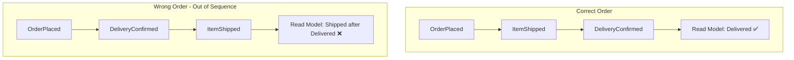
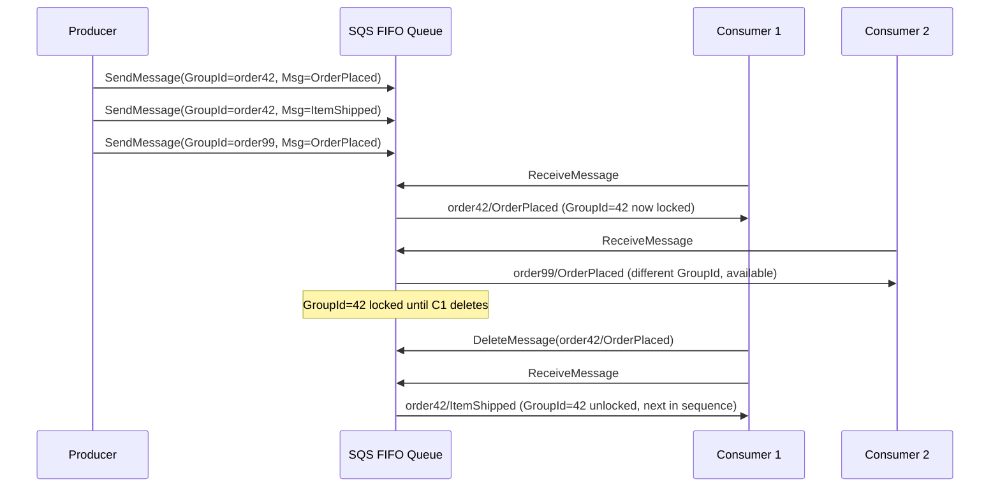
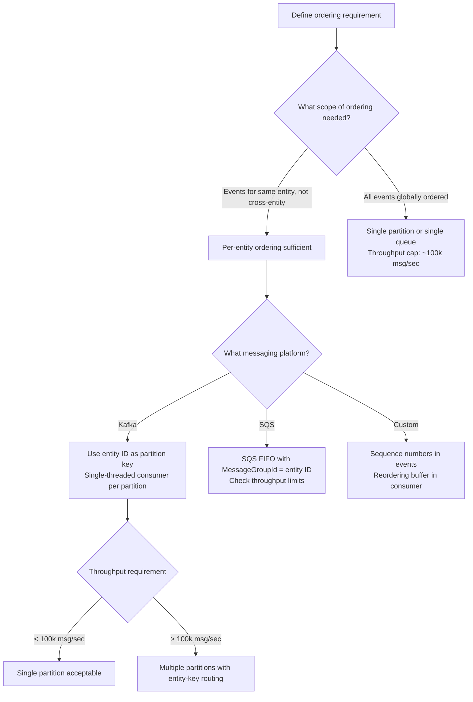

# Message Ordering: Per-Partition, Per-Key, and Global Ordering Trade-offs

**The more ordering you guarantee, the less throughput you get.** This is not a coincidence — it's a fundamental theorem of distributed systems. This article maps ordering requirements to the right primitive, so you don't accidentally sacrifice 10× throughput for an ordering guarantee you don't need.

---

## The Problem Class `[Mid]`

An e-commerce platform processes order lifecycle events: `OrderPlaced → ItemShipped → DeliveryConfirmed`. Each event updates the order's state in a downstream read model.

The order matters. If `DeliveryConfirmed` arrives before `ItemShipped`, the read model shows an order as delivered before it was shipped. That corrupts customer-facing status pages and breaks the returns window calculation.

But they're processing 100,000 orders/second. Can they guarantee ordering without killing throughput?



The diagram shows why ordering matters for stateful consumers. When `DeliveryConfirmed` arrives before `ItemShipped`, the state machine transitions to an invalid state — one that business logic was never designed to handle.

> 💡 **What this means in practice:** If your consumer updates a database row based on event order, wrong-order events produce wrong database state. You can't "undo" a state transition that already committed.

---

## Why the Obvious Solution Fails `[Senior]`

### Global ordering = single partition = throughput ceiling

The most common "fix": use a single partition (or a single queue). Global ordering guaranteed. Throughput capped at ~100 MB/sec per partition. For most systems above 1,000 events/sec with non-trivial payload sizes, this is a hard ceiling.

**The math:**
```
Single partition throughput limit:
  Kafka partition: ~100 MB/sec network-bound
  At 1 KB average message size: 100,000 messages/sec maximum
  At 10 KB average: 10,000 messages/sec maximum

If you need 1,000,000 messages/sec: single partition is 10× too slow
```

### Per-key ordering breaks when consumers process in parallel

You've correctly set `order_id` as the partition key. All events for `order_id=42` go to partition 7. Partition 7 is assigned to Consumer C. Correct so far.

Now Consumer C processes partition 7 using a thread pool for parallel processing. Thread 1 picks up `ItemShipped`, Thread 2 picks up `DeliveryConfirmed`. They run concurrently. Thread 2 finishes first. Ordering violated — **inside the consumer**.

**Single-threaded processing per partition is the only correct approach for ordered consumers.** If you need parallelism, parallelize across partitions, not within a partition.

### Sequence numbers in the payload don't help without coordination

Some teams embed a `sequence_number` in each event. Consumer detects out-of-order arrival and buffers until the missing sequence arrives. This works but:
- **Memory unbounded**: the missing message might be delayed indefinitely (slow broker, crash)
- **Consumer lag unbounded**: you're blocking on a message that might be in a retry loop
- **Complexity**: you've re-implemented a reordering buffer that Kafka partitions already provide

---

## The Solution Landscape `[Senior]`

### Solution 1: Kafka Per-Partition Ordering

**What it is**

Kafka guarantees message ordering within a single partition. Assign the same partition key to all events for the same entity. All events for that entity land in one partition, consumed by one consumer in order.

**How it actually works at depth**

Kafka's default partitioner: `partition = murmur2(key) % numPartitions`. For a given key and a stable partition count, the partition is deterministic and consistent.

```python
# Producer — always use entity ID as partition key
producer.produce(
    topic="order-events",
    key=order_id,               # CRITICAL: all events for same order → same partition
    value=serialize(event),
    on_delivery=delivery_callback
)

# Consumer — single-threaded per partition for ordering
consumer = KafkaConsumer(
    "order-events",
    group_id="order-state-machine",
    enable_auto_commit=False,
    max_poll_records=100
)

for message in consumer:
    # This loop processes messages from a single partition at a time
    # Kafka's poll() returns messages in offset order per partition
    process_ordered_event(message)
    consumer.commit()
```

After every `consumer.commit()`, the offset advances. If the process crashes, replay starts from the last committed offset — in order.

> 💡 **What this means in practice:** As long as you use the same `order_id` as the partition key AND your consumer is single-threaded per partition, Kafka handles ordering automatically. You don't need application-level sequence tracking.

**The single-threaded consumer rule:**

```python
# WRONG — breaks ordering
executor = ThreadPoolExecutor(max_workers=10)
for message in consumer:
    executor.submit(process_ordered_event, message)  # ❌ parallel execution = ordering violation

# CORRECT — preserves ordering
for message in consumer:
    process_ordered_event(message)  # ✅ sequential, in-order processing
    consumer.commit()

# CORRECT for high throughput — parallelize across partitions, not within
# Assign each partition to a dedicated thread
# Thread 1 processes partition 0 (its own ordered stream)
# Thread 2 processes partition 1 (its own ordered stream)
# No cross-partition ordering needed
```

**Sizing guidance** `[Staff+]`

```
Partition count for ordered processing:
  concurrent_entity_streams = desired_parallelism
  # Each partition is one ordered stream
  # Max parallelism = num_partitions (adding consumers beyond this = idle consumers)

  Target partition count = max(desired_parallelism, peak_throughput / 100MB_s)

  For 500k messages/sec, 1KB/msg = 500 MB/sec:
    throughput-driven: ceil(500/100) = 5 partitions
    parallelism-driven: 32 (desired consumer threads)
    → use max(5, 32) = 32 partitions

Key cardinality check:
  If num_unique_keys < num_partitions:
    → Some partitions always empty
    → Parallelism is bounded by key cardinality, not partition count
    → For 1000 unique order IDs and 32 partitions: at most 32 active, most actually assigned
    → For 100 unique tenant IDs and 1000 partitions: only 100 partitions used
```

**Failure modes** `[Staff+]`

| Failure Mode | Trigger | Impact | Mitigation |
|---|---|---|---|
| Consumer parallelism breaks order | Thread pool within single consumer | State corruption | Enforce single-threaded per partition; code review gate |
| Partition key change in producer | New version changes hashing | Same entity lands in different partitions | Blue/green topic migration before key change |
| Rebalance reorders in-flight messages | Eager rebalance mid-batch | Uncommitted messages re-assigned, replayed on new consumer | Use cooperative rebalancing; idempotent state transitions |
| Compacted topic removes ordering context | Topic compaction with `cleanup.policy=compact` | Old events for an entity removed; rebuild impossible | Keep ordering-critical topics with `cleanup.policy=delete` |

---

### Solution 2: SQS FIFO Queues

**What it is**

SQS FIFO queues guarantee ordering within a `MessageGroupId`. Messages with the same group ID are delivered in the order they were sent, to a single consumer at a time for that group.

**How it actually works at depth**

```python
# Producer — set MessageGroupId to entity ID for ordered delivery
sqs.send_message(
    QueueUrl=FIFO_QUEUE_URL,
    MessageBody=json.dumps(event),
    MessageGroupId=order_id,           # same group = same ordered stream
    MessageDeduplicationId=event_id    # prevents duplicates; required for FIFO
)

# Consumer — SQS guarantees one message at a time per MessageGroupId
# While a message with GroupId=42 is in-flight, no other consumer receives GroupId=42 messages
response = sqs.receive_message(
    QueueUrl=FIFO_QUEUE_URL,
    MaxNumberOfMessages=10             # max 10, but GroupId-constrained
)
for message in response['Messages']:
    process(message)
    sqs.delete_message(
        QueueUrl=FIFO_QUEUE_URL,
        ReceiptHandle=message['ReceiptHandle']
    )
```

The diagram below shows how SQS FIFO groups work:



When Consumer 1 holds `order42/OrderPlaced` in-flight, no other consumer can receive `order42/ItemShipped`. This serializes access to GroupId=42 — guaranteeing in-order delivery.

> 💡 **What this means in practice:** SQS FIFO is like a per-entity lock. While you're processing one event for an order, all subsequent events for that order wait. This is safe but limits parallelism to one consumer per active GroupId at a time.

**Sizing guidance** `[Staff+]`

```
SQS FIFO throughput limits:
  Standard FIFO: 300 messages/sec (send, receive, delete)
  High-throughput FIFO: 70,000 messages/sec (requires MessageDeduplicationId per 5-minute window)

  MessageGroupId concurrency:
    Effective parallelism = active MessageGroupIds being processed simultaneously
    For 1000 active order IDs, each takes 100ms to process:
      throughput = 1000 groups / 0.1s processing = 10,000 messages/sec (within FIFO limits)

  MessageDeduplicationId window:
    SQS deduplicates messages within a 5-minute window per MessageGroupId
    Use: hash(event_id) as deduplication ID — ensures idempotent sends
```

---

### Solution 3: Ordering via Sequence Numbers in Consumers

**What it is**

When you can't control the messaging layer (e.g., fan-out from multiple producers), embed sequence numbers in events and implement a reordering buffer in the consumer.

**How it actually works at depth**

```python
# Producer embeds sequence number
event = {
    "event_id": str(uuid4()),
    "entity_id": order_id,
    "sequence": current_sequence,   # monotonically increasing per entity
    "event_type": "ItemShipped",
    "payload": {...}
}

# Consumer maintains per-entity buffer
class OrderedConsumer:
    def __init__(self):
        self.buffers = {}          # entity_id → sorted list of buffered events
        self.next_expected = {}    # entity_id → next expected sequence number

    def on_message(self, event):
        entity_id = event['entity_id']
        seq = event['sequence']
        expected = self.next_expected.get(entity_id, 0)

        if seq == expected:
            self.process(event)
            self.next_expected[entity_id] = expected + 1
            # Drain buffer of consecutive sequences
            self.drain_buffer(entity_id)
        elif seq > expected:
            # Out-of-order: buffer for later
            heapq.heappush(self.buffers.setdefault(entity_id, []), (seq, event))
            # Check if gap persists too long → emit alert, advance sequence
        else:
            # Duplicate or old sequence → discard
            pass

    def drain_buffer(self, entity_id):
        while self.buffers.get(entity_id):
            next_seq = self.next_expected[entity_id]
            if self.buffers[entity_id][0][0] == next_seq:
                _, event = heapq.heappop(self.buffers[entity_id])
                self.process(event)
                self.next_expected[entity_id] = next_seq + 1
            else:
                break  # gap still present
```

> 💡 **What this means in practice:** This is like a jigsaw puzzle where you wait until you have piece #4 before placing pieces #5 and #6, even if they've already arrived. The risk: piece #4 might never arrive if that message was lost.

**When to use**: When you cannot control the partition assignment (multi-region fan-out, heterogeneous producers) but need ordering semantics.

**When NOT to use**: When a missing sequence could block the buffer indefinitely. You need a TTL-based escape hatch.

---

## Trade-off Matrix `[Senior]` → `[Staff+]`

| Dimension | Kafka per-partition | SQS FIFO MessageGroupId | Consumer sequence buffer |
|---|---|---|---|
| Throughput | High (100 MB/s per partition, unlimited partitions) | Limited (300–70k msg/s total) | Depends on buffer size |
| Ordering scope | Per-partition (per-entity with correct key) | Per-MessageGroupId | Per-entity |
| Parallelism | 1 consumer per partition | 1 consumer per active GroupId | Bounded by buffer memory |
| Global ordering | No | No | No |
| Infrastructure complexity | Medium (Kafka cluster) | Low (managed SQS) | High (stateful consumer logic) |
| Failure handling | Replay from committed offset | Visibility timeout retry | Buffer loss on crash |
| Rebalance impact | Brief gap (use cooperative) | None (SQS managed) | Buffer loss requires replay |

**The fundamental constraint:**

```
Ordering strength vs throughput:
  Global ordering:          1 thread, 1 queue/partition    → O(1) throughput
  Per-entity ordering:      N threads, N partitions/groups  → O(N) throughput
  No ordering guarantee:    Unlimited threads               → O(unlimited) throughput

  You cannot have both global ordering and horizontal throughput scaling.
  Every "ordering" system is actually per-entity ordering with entity-level parallelism.
```

---

## Production Failure Story `[Staff+]`

**The thread pool ordering violation — a logistics platform**

A freight logistics platform processed shipment tracking events: `PickedUp → InTransit → OutForDelivery → Delivered`. They used Kafka with `shipment_id` as the partition key — correct.

Their consumer used Spring Kafka's `@KafkaListener`. A senior engineer added `ConcurrentMessageListenerContainer` with `concurrency=10`, thinking it would add 10× throughput by processing 10 messages in parallel. The `concurrency` setting in Spring Kafka assigns 10 **sub-consumers**, each assigned different partitions — correct behavior.

But a junior developer on the same team saw the 10 consumer threads and added `ListenerContainerCustomizer` to further parallelize using a `ThreadPoolTaskExecutor` inside each listener. This created parallelism **within a single partition** — the forbidden pattern.

**Result**: For high-traffic shipments (many events per shipment per hour), events arrived at the database in random order. The tracking status table showed `Delivered` before `OutForDelivery` for ~3% of high-frequency shipments. This was caught by a downstream alert 6 hours later, requiring a 4-hour data correction job.

**Root cause**: `ListenerContainerCustomizer` with a thread pool executor inside the listener breaks Kafka's per-partition ordering guarantee silently. No error, no warning.

**Prevention**:
1. Code review gate: any `ExecutorService`, `ThreadPoolExecutor`, or `async` inside a Kafka listener must be justified with explicit ordering-safety analysis
2. Integration test: produce `N` events for the same key with `sequence_number` field; assert consumer processes them in sequence (use in-memory map of last_seen_sequence per key)
3. Consumer metric: expose `out_of_order_event_count` counter; alert on any non-zero value

---

## Observability Playbook `[Staff+]`

```
Dashboard: Message Ordering Health

Panel 1: Out-of-order event rate
  Custom metric: counter incremented when event.sequence < last_seen_sequence for entity
  Alert: > 0 events/min → ordering violation in consumer or producer

Panel 2: Consumer lag per partition (divergence indicator)
  Metric: max(partition_lag) / median(partition_lag) ratio
  Alert: > 5× → one partition's consumer is blocked (hot entity or slow consumer)

Panel 3: Buffer depth (if using sequence-number buffering)
  Metric: max buffer depth across all entity buffers
  Alert: > 1000 events → gap in sequence likely; investigate missing message

Panel 4: SQS FIFO MessageGroupId stuck duration
  Metric: age of oldest in-flight message per MessageGroupId
  Alert: > 2× VisibilityTimeout → consumer crashed while holding a group lock

Panel 5: Rebalance events correlated with out-of-order rate
  Correlation: rebalance_count vs out_of_order_count
  If correlated → improve rebalance handling (idempotent transitions, cooperative rebalancing)
```

---

## Decision Framework `[Senior]` → `[Staff+]`



---

## Decision Framework Checklist `[All Levels]`

- [ ] **Ordering scope defined**: per-entity, per-category, or global?
- [ ] **Global ordering avoided unless necessary**: single partition = hard throughput ceiling?
- [ ] **Partition key = entity ID**: all events for the same entity use the same key?
- [ ] **Consumer is single-threaded per partition**: no thread pools inside Kafka listeners?
- [ ] **Parallelism via partitions**: horizontal scaling via partition count, not consumer threads?
- [ ] **SQS FIFO throughput checked**: ≤70k msg/sec for high-throughput FIFO?
- [ ] **Cooperative rebalancing enabled**: prevents ordering gaps during rebalances?
- [ ] **Out-of-order event metric implemented**: detects violations before they corrupt state?
- [ ] **Idempotent state transitions**: tolerant of the rare rebalance-induced replay?
- [ ] **Ordering requirement documented**: so future engineers don't "optimize" away the single-threaded consumer?

*Written by Gaurav Porwal — 10+ Year Engineer | Tech Lead | Product Owner | Business-Minded Builder*
*Last updated: 2026-03-18*
