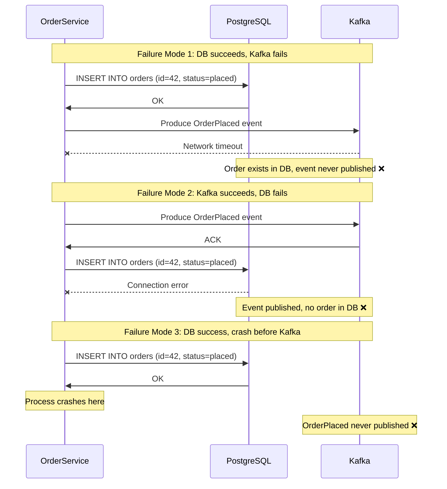
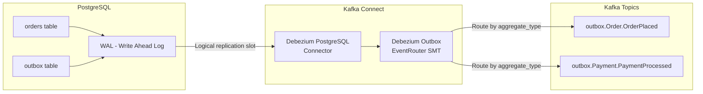
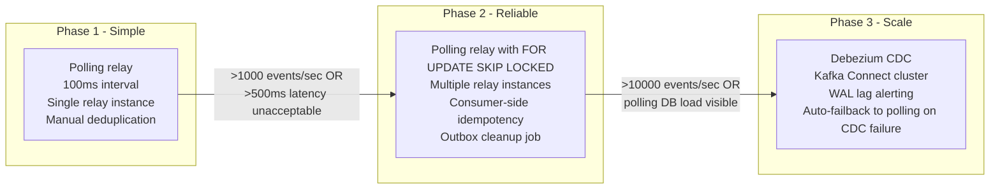

# The Outbox Pattern: Atomic Database + Message Delivery Without 2PC

**Every service that writes to a database AND publishes a message has a dual-write problem.** If the database write succeeds and the Kafka publish fails, your data is inconsistent with your event stream. The outbox pattern solves this without distributed transactions — and it's the foundational pattern for reliable event-driven systems.

---

## The Problem Class `[Mid]`

You're building an order service. When a user places an order:
1. Write order to PostgreSQL (`orders` table)
2. Publish `OrderPlaced` event to Kafka (for inventory, notifications, analytics)

In the naive implementation, these are two separate I/O operations. The failure modes:



**All three modes cause real incidents:**
- Inventory never decremented (missing event) → overselling
- Notification sent for non-existent order (phantom event) → customer confusion
- Analytics pipeline misses orders → incorrect revenue reports

The instinctive fix — wrapping both operations in a distributed transaction (2PC) — requires Kafka to participate in XA transactions. Kafka doesn't support XA and the coordinator becomes a scalability bottleneck that dies under load.

---

## Why the Obvious Solution Fails `[Senior]`

### Try-catch retry is not a solution

```python
try:
    db.insert_order(order)
    kafka.produce("orders", order_event)
except KafkaException:
    # retry the Kafka publish
    retry_kafka_produce(order_event)
```

This fails because:
1. If the process dies between `db.insert_order` and `kafka.produce`, the retry never runs
2. On restart, there's no record of which orders need their events published
3. State is split across two systems with no single coordinator

### Transactional producers don't cross system boundaries

Kafka's transactional API provides exactly-once within Kafka. It cannot participate in a PostgreSQL transaction. They are independent transactional systems with no shared coordinator.

### Polling the database for "unpublished" records

Some teams add an `is_published` flag to the orders table and run a background job:
```sql
SELECT * FROM orders WHERE is_published = false ORDER BY created_at;
```

This works at small scale but fails because:
1. **Race condition**: another instance may be processing the same row
2. **Lock contention**: the `UPDATE is_published = true` competes with order writes
3. **Full table scan**: without careful indexing, this query gets slower as orders accumulate
4. **Ordering guarantees**: polling doesn't guarantee event order unless you sort by sequence number

---

## The Solution Landscape `[Senior]`

### Solution 1: Transactional Outbox (Polling Relay)

**What it is**

Write the event to a dedicated `outbox` table in the **same database transaction** as the business entity write. A separate relay process polls the outbox table and publishes events to Kafka, then marks them as processed.

**How it actually works at depth**

```sql
-- Outbox table schema
CREATE TABLE outbox (
    id              UUID        DEFAULT gen_random_uuid() PRIMARY KEY,
    aggregate_type  VARCHAR(100) NOT NULL,  -- "Order"
    aggregate_id    VARCHAR(100) NOT NULL,  -- order_id
    event_type      VARCHAR(100) NOT NULL,  -- "OrderPlaced"
    payload         JSONB       NOT NULL,
    created_at      TIMESTAMPTZ DEFAULT NOW(),
    published_at    TIMESTAMPTZ,            -- NULL = not yet published
    sequence_number BIGSERIAL   NOT NULL    -- for ordering within aggregate
);

CREATE INDEX idx_outbox_unpublished ON outbox(created_at)
    WHERE published_at IS NULL;
```

The order service transaction:

```sql
BEGIN;
  -- Business entity write
  INSERT INTO orders (id, user_id, status, total)
  VALUES ('42', 'user-7', 'placed', 99.99);

  -- Event write (same transaction)
  INSERT INTO outbox (aggregate_type, aggregate_id, event_type, payload)
  VALUES ('Order', '42', 'OrderPlaced', '{"order_id":"42","total":99.99}');
COMMIT;
-- If COMMIT fails: both writes rolled back atomically
-- If COMMIT succeeds: both writes durable, event guaranteed to be published eventually
```

Relay process:

```python
def relay_loop():
    while True:
        with db.transaction():
            # Select unpublished events, lock rows for this relay instance
            events = db.query("""
                SELECT * FROM outbox
                WHERE published_at IS NULL
                ORDER BY sequence_number
                LIMIT 100
                FOR UPDATE SKIP LOCKED  -- CRITICAL: prevents multi-relay conflicts
            """)

            if not events:
                time.sleep(0.1)
                continue

            for event in events:
                kafka_producer.produce(
                    topic=event.aggregate_type.lower() + "s",
                    key=event.aggregate_id,
                    value=event.payload
                )

            kafka_producer.flush()  # ensure delivery before marking published

            event_ids = [e.id for e in events]
            db.execute("""
                UPDATE outbox SET published_at = NOW()
                WHERE id = ANY(:ids)
            """, {"ids": event_ids})
```

**The `FOR UPDATE SKIP LOCKED` is critical** — it allows multiple relay instances to process different batches of outbox rows in parallel without blocking each other.

**Sizing guidance** `[Staff+]`

```
Outbox table growth rate:
  rows_per_second = command_rate_per_second × avg_events_per_command
  retention_period = SLA for reprocessing (typically 7–30 days)

  For 5,000 commands/sec, 1.2 events/command, 7-day retention:
    active_rows = 5,000 × 1.2 × 86,400 × 7 = 3.6 billion rows ❌ too large

  Practical approach:
    Mark published and DELETE after published_at > 24 hours
    Active outbox rows ≈ (polling_lag_ms / 1000) × events_per_second
    For 100ms polling lag, 6,000 events/sec: active rows ≈ 600 (tiny!)

Polling interval vs relay lag:
  polling_lag_ms = polling_interval_ms + query_latency_ms + kafka_produce_latency_ms
  Target: polling_lag < 500ms for most use cases
  Set polling_interval = 50–100ms for near-real-time relay
```

**Configuration decisions that matter** `[Staff+]`

```properties
# Relay Kafka producer
enable.idempotence=true           # prevents duplicates from relay retries
acks=all                          # ensures durability before marking published
batch.size=65536                  # batch events from single poll iteration
linger.ms=5                       # allow brief batching for throughput

# Database connection pool for relay
pool_size = 2–5 connections       # relay is sequential per batch; doesn't need large pool
statement_timeout = 5000ms        # kill slow queries, don't block relay
lock_timeout = 1000ms             # fail fast on lock contention
```

**Failure modes** `[Staff+]`

| Failure Mode | Trigger | Impact | Mitigation |
|---|---|---|---|
| Relay crashes between Kafka flush and DB mark | Process kill mid-batch | Duplicate events published | Consumer idempotency (deduplicate on aggregate_id + sequence_number) |
| Outbox table bloat | DELETE not running | Polling query scans large table | Background DELETE job: `DELETE FROM outbox WHERE published_at < NOW() - INTERVAL '24h'` |
| `SKIP LOCKED` starvation | Some rows locked for extended period | Events in locked rows not published | Use advisory locks with timeout instead |
| Kafka backpressure | Kafka unavailable | Outbox rows accumulate, relay retries flood DB | Exponential backoff + circuit breaker in relay |

---

### Solution 2: CDC-Based Outbox (Debezium)

**What it is**

Instead of polling the outbox table, use Change Data Capture (CDC) to stream database WAL (Write-Ahead Log) changes directly to Kafka. Debezium captures every INSERT to the outbox table and produces a Kafka event — with sub-second latency and no polling overhead.

**How it actually works at depth**



Debezium's **Outbox Event Router** Single Message Transform (SMT) automatically routes events from the outbox table to the correct Kafka topic based on `aggregate_type`. No separate relay process needed.

Debezium connector configuration:

```json
{
  "name": "outbox-connector",
  "config": {
    "connector.class": "io.debezium.connector.postgresql.PostgresConnector",
    "database.hostname": "postgres",
    "database.dbname": "orders_db",
    "table.include.list": "public.outbox",
    "plugin.name": "pgoutput",
    "slot.name": "outbox_slot",

    "transforms": "outbox",
    "transforms.outbox.type": "io.debezium.transforms.outbox.EventRouter",
    "transforms.outbox.table.field.event.id": "id",
    "transforms.outbox.table.field.event.key": "aggregate_id",
    "transforms.outbox.table.field.event.payload": "payload",
    "transforms.outbox.table.field.event.type": "event_type",
    "transforms.outbox.route.by.field": "aggregate_type",
    "transforms.outbox.route.topic.replacement": "outbox.${routedByValue}.events",

    "tombstones.on.delete": "false"
  }
}
```

**CDC vs Polling comparison:**

```
CDC advantages:
  - Latency: ~10–50ms from DB commit to Kafka (WAL streaming, no polling delay)
  - No DB polling load: reads WAL stream, not data pages
  - Handles backpressure: Debezium manages replication slot position

CDC disadvantages:
  - WAL replication slot must be managed: stale slot causes WAL retention (disk fills up)
  - Schema changes require connector reconfiguration
  - Debezium connector failure: must manage connector restart and offset tracking
  - Replication slot lag: if Kafka is slow, slot lag grows → PostgreSQL WAL retention grows

Polling advantages:
  - Simpler to operate: just a background job
  - No CDC infrastructure required
  - Easier to add additional relay logic (filtering, transformation)

Polling disadvantages:
  - Additional DB load from polling queries
  - Higher latency (polling_interval + query time)
  - `FOR UPDATE SKIP LOCKED` complexity
```

**Sizing guidance** `[Staff+]`

```
CDC (Debezium) operational sizing:
  WAL retention during Debezium lag:
    WAL_retention_bytes = lag_seconds × write_rate_bytes_per_second
    For 60s Debezium lag, 50 MB/s write rate: 3 GB WAL retention

  Alert threshold:
    Monitor: pg_replication_slots WHERE slot_name = 'outbox_slot'
    Alert on: pg_wal_lsn_diff(pg_current_wal_lsn(), restart_lsn) > 5 GB
    Action: restart Debezium connector, or increase Kafka consumer throughput

  Connector heap sizing:
    Debezium JVM heap: 512 MB – 2 GB depending on row size and batch volume
    At 10,000 outbox inserts/sec × 1 KB/row: ~10 MB/sec through connector, 512 MB sufficient
```

---

### Solution 3: Direct Table CDC (No Outbox Table)

**What it is**

Skip the outbox table entirely. Use Debezium to capture changes from the `orders` table directly and produce events to Kafka. Simpler, but loses the event schema decoupling.

**When to use**: When your database schema IS your event schema and you don't need to decouple them. Typically used for data synchronization (DB → search index, DB → analytics) rather than domain event publishing.

**When NOT to use**: When your domain events need different structure than your database rows, or when you need to aggregate multiple row changes into a single event.

---

## Trade-off Matrix `[Senior]` → `[Staff+]`

| Dimension | Polling Relay | Debezium CDC | Direct CDC |
|---|---|---|---|
| Event latency | 50–500ms | 10–50ms | 10–50ms |
| DB query load | Low (indexed, limited rows) | Very low (WAL read only) | Very low |
| Operational complexity | Low | Medium (connector management) | Medium |
| Schema decoupling | High (outbox schema) | High (outbox schema) | Low (DB schema = event schema) |
| Infrastructure cost | None (just a process) | Kafka Connect cluster | Kafka Connect cluster |
| WAL retention risk | None | Yes (slot lag) | Yes (slot lag) |
| Duplicate delivery | Possible (relay crash) | Once per WAL offset | Once per WAL offset |
| Consumer idempotency required | Yes | Less likely but recommended | Less likely but recommended |

---

## Production Failure Story `[Staff+]`

**The WAL disk full incident — a subscription billing platform**

A billing platform used Debezium to stream outbox events from PostgreSQL to Kafka. The Kafka cluster went offline for routine maintenance on a Friday afternoon. The team expected 2 hours of downtime.

**What happened**: Debezium's replication slot (`outbox_slot`) paused at the WAL position before maintenance started. PostgreSQL, not knowing Debezium would be back, **retained all WAL files** from the slot's restart LSN. Over 2 hours, with the billing system generating 8 GB/hr of WAL, 16 GB of WAL accumulated.

The PostgreSQL data volume was on a 20 GB EBS volume. At 16 GB of WAL + 8 GB of data, the volume filled up. PostgreSQL stopped accepting writes at 3:47 PM. The billing system returned 500s for all requests.

**Cascading failure**: The billing system's circuit breaker opened. Scheduled billing jobs queued in memory. The application ran out of heap at 4:15 PM and restarted. On restart, in-memory job queue was lost. 3,000 subscription charges were never attempted for that billing cycle.

**Root causes**:
1. No monitoring on replication slot WAL lag (`pg_wal_lsn_diff`)
2. No alert on PostgreSQL disk usage > 80%
3. Kafka maintenance window not coordinated with WAL retention implications
4. No automatic slot drop procedure for extended Kafka downtime

**Prevention**:
```sql
-- Alert when WAL retained by slot exceeds 2 GB
SELECT slot_name, pg_wal_lsn_diff(pg_current_wal_lsn(), restart_lsn) AS lag_bytes
FROM pg_replication_slots
WHERE lag_bytes > 2e9;

-- Emergency: drop slot if Kafka offline > 4 hours (relay to polling fallback)
SELECT pg_drop_replication_slot('outbox_slot');
-- Switch to polling relay during slot rebuild
```

---

## Observability Playbook `[Staff+]`

```
Dashboard: Outbox Pattern Health

Panel 1: Outbox table unprocessed row count
  Query: SELECT COUNT(*) FROM outbox WHERE published_at IS NULL
  Alert: > 1,000 rows → relay falling behind, check Kafka connectivity

Panel 2: Outbox relay lag (age of oldest unprocessed event)
  Query: SELECT EXTRACT(EPOCH FROM NOW() - MIN(created_at)) FROM outbox WHERE published_at IS NULL
  Alert: > 30 seconds → relay stalled

Panel 3 (CDC only): Replication slot WAL retention
  Query: SELECT pg_wal_lsn_diff(pg_current_wal_lsn(), restart_lsn) FROM pg_replication_slots
  Alert: > 2 GB → risk of disk fill on next Kafka outage

Panel 4: Outbox table size (CDC only: ensure deletes running)
  Alert: > 10 GB → background DELETE job not running

Panel 5: Kafka topic consumer lag (outbox events)
  Metric: kafka_consumer_group_lag{topic=outbox.*}
  Alert: > 10,000 messages → downstream consumers falling behind
```

---

## Architectural Evolution `[Staff+]`



---

## Decision Framework Checklist `[All Levels]`

- [ ] **Dual-write risk assessed**: can the current implementation lose events on crash?
- [ ] **Outbox table in same database as entity**: not a separate database (that reintroduces the dual-write problem)
- [ ] **Transaction atomicity verified**: entity insert and outbox insert in same `BEGIN/COMMIT`?
- [ ] **`FOR UPDATE SKIP LOCKED` used**: prevents multi-relay instance conflicts?
- [ ] **Consumer idempotency implemented**: deduplicate on `aggregate_id + sequence_number`?
- [ ] **Outbox cleanup job running**: prevents table bloat and index degradation?
- [ ] **CDC (Debezium) replication slot lag monitored**: alert before disk fills?
- [ ] **Kafka unavailability procedure documented**: automatic slot drop or polling fallback after threshold?
- [ ] **Relay throughput benchmarked**: sufficient to drain outbox during peak event burst?
- [ ] **Event schema in outbox decoupled from entity schema**: events use domain vocabulary, not DB columns?

*Written by Gaurav Porwal — 10+ Year Engineer | Tech Lead | Product Owner | Business-Minded Builder*
*Last updated: 2026-03-18*
