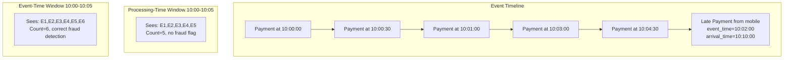
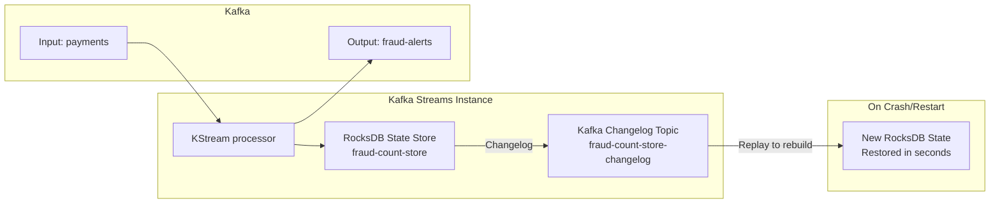
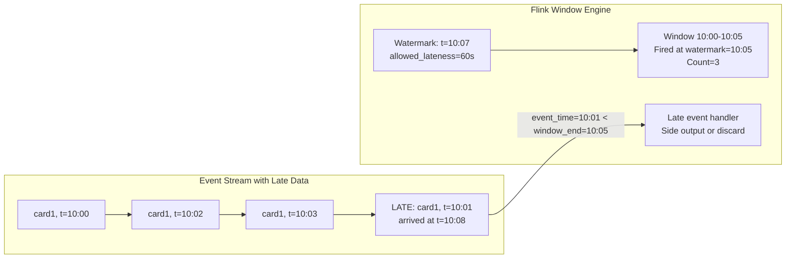
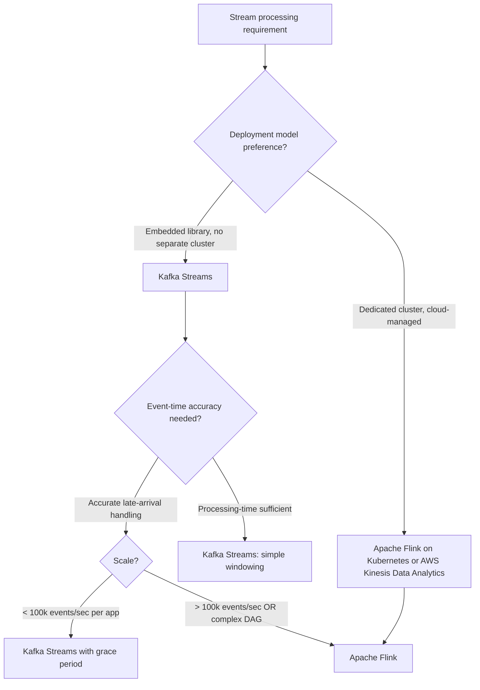

# Stream Processing: Kafka Streams, Flink, and Stateful Processing at Scale

**Stream processing is batch processing without the batch boundaries — and that changes everything about how you handle state, failures, and time.** Getting the distinction between event time and processing time wrong is how you build dashboards that show different numbers every time you reload them.

---

## The Problem Class `[Mid]`

You're building a real-time fraud detection system. For every payment event, you need to know: "Has this card made more than 10 transactions in the last 5 minutes?" If yes, flag for review.

The naive approach: for every payment, query a Redis counter for the card number. Increment the counter, set a 5-minute TTL. If the counter exceeds 10, flag.

The problem: What is "5 minutes"? Is it 5 minutes from the current server time (processing time) or 5 minutes from when the events were actually created (event time)?

- A mobile app sends a payment event but loses connectivity for 6 minutes. It reconnects and sends the event. In processing time, it arrived 6 minutes late. In event time, it was part of the original 5-minute window.
- A batch of payments is replayed from a DLQ. The events were created 2 hours ago. In processing time, they arrive now. In event time, they belong to 2 hours ago.

For fraud detection, you need event-time windowing — the system must reason about when events *actually happened*, not when they arrived.



The diagram shows that processing-time windows miss late-arriving events. Event-time windows wait for late arrivals using **watermarks** — estimates of how far behind the slowest event source is.

> 💡 **What this means in practice:** Processing-time windows are simple but wrong for out-of-order events. Event-time windows are correct but require you to define how long you'll wait for late data before closing the window.

---

## Why the Obvious Solution Fails `[Senior]`

### Stateless processing is insufficient for aggregations

For simple transformations (filter, map, enrich), stateless processing is fine. But for aggregations over time — counting events, computing averages, detecting sequences — you need state. Without a proper state store, you're forced to use external storage (Redis, DynamoDB) for every single event.

**The problem with external storage on the hot path:**
- Each event requires a round-trip to Redis: +1–2ms latency per event
- At 100,000 events/sec: 100,000 Redis calls/sec per consumer instance
- Redis becomes the bottleneck, not the stream processor
- Redis failure = stream processing failure (tight coupling)

### Batch-style windowing misses late arrivals

A common approach: use a scheduled job that runs every 5 minutes and counts events from the database. This is a micro-batch, not stream processing. It inherits batch characteristics: events are stale by up to 5 minutes, and the job competes with transactional workloads for database resources.

### Rebuilding state from scratch on failure

Without checkpointing, a stream processor that crashes must reprocess all messages from the beginning to rebuild its in-memory state. For a job that's been running for 7 days processing 100k events/sec:

```
Recovery time without checkpointing:
  total_events = 7 days × 86,400s/day × 100,000 events/s = 60.5 billion events
  replay_rate = 500,000 events/sec (fast replay without external calls)
  recovery_time = 60.5 billion / 500,000 = 121,000 seconds ≈ 33 hours

  Your "real-time" fraud detection is now 33 hours behind after a crash.
```

With checkpointing every 30 seconds: maximum replay = 30 seconds × 100,000 = 3 million events → recovery in 6 seconds.

---

## The Solution Landscape `[Senior]`

### Solution 1: Kafka Streams

**What it is**

Kafka Streams is a Java/Kotlin library (not a cluster) that runs inside your application process, reading from Kafka topics and writing back to Kafka topics. State is stored in embedded RocksDB per application instance, backed by Kafka changelog topics for durability.

**How it actually works at depth**

```java
// Fraud detection: count transactions per card in a 5-minute tumbling window
StreamsBuilder builder = new StreamsBuilder();

KStream<String, Payment> payments = builder.stream(
    "payments",
    Consumed.with(Serdes.String(), paymentSerde)
);

KTable<Windowed<String>, Long> fraudCounts = payments
    .groupByKey()                                    // group by card_id (already the message key)
    .windowedBy(
        TimeWindows.ofSizeWithNoGrace(Duration.ofMinutes(5))
        // Use ofSizeAndGrace() if you want to wait for late arrivals:
        // TimeWindows.ofSizeAndGrace(Duration.ofMinutes(5), Duration.ofMinutes(1))
    )
    .count(Materialized.as("fraud-count-store"));   // RocksDB state store named "fraud-count-store"

fraudCounts
    .toStream()
    .filter((windowedKey, count) -> count > 10)     // threshold: >10 in 5 minutes
    .map((windowedKey, count) -> KeyValue.pair(
        windowedKey.key(),                           // card_id
        new FraudAlert(windowedKey.key(), count, windowedKey.window())
    ))
    .to("fraud-alerts", Produced.with(Serdes.String(), fraudAlertSerde));
```

The state store (`fraud-count-store`) is:
1. **Local RocksDB**: fast in-process reads/writes, no network hop
2. **Changelog-backed**: every state change written to a Kafka changelog topic
3. **Restored on crash**: on restart, the application replays the changelog topic to rebuild RocksDB state

> 💡 **What this means in practice:** Kafka Streams state stores are like a local database that automatically backs itself up to Kafka. When your process crashes, it restores from the Kafka backup. No separate Redis or database needed.



**Sizing guidance** `[Staff+]`

```
Kafka Streams resource sizing:

State store memory (RocksDB):
  state_store_size = cardinality_of_key × state_per_key × window_count
  For card fraud detection:
    cardinality = 10M active cards
    state per card per window = 8 bytes (Long count)
    windows_in_memory = 2 (current + previous window)
    state_store_size = 10M × 8 × 2 = 160 MB (very small for RocksDB)

  RocksDB block cache (heap):
    Recommended: state_store_size × 0.3 for frequently accessed keys
    JVM heap for Kafka Streams: state_store_size × 0.5 + application_overhead (512MB)

Changelog topic sizing:
  changelog_rate = state_update_rate (one change per window update)
  At 100k events/sec with 10% state updates: 10k changelog writes/sec
  Changelog retention: must cover state store rebuild time × input rate
  changelog_retention_bytes = rebuild_time_s × changelog_rate × avg_changelog_msg_size

Partition count for Kafka Streams:
  Parallelism = number of input topic partitions
  Each partition → one Streams task → one thread
  Desired concurrency = num_partitions (match Streams threads to partition count)
  threads_per_instance = num_partitions / num_instances
```

**Configuration decisions that matter** `[Staff+]`

```properties
# Kafka Streams application config
num.stream.threads=4                    # threads = input partitions / num_instances
commit.interval.ms=100                  # how often to flush state to changelog + commit offsets
cache.max.bytes.buffering=10485760      # 10MB record cache per thread; reduces state store writes
processing.guarantee=exactly_once_v2   # for financial data; ~20% throughput cost

# RocksDB tuning (via StreamsConfig)
rocksdb.config.setter=com.example.CustomRocksDBConfig
# In CustomRocksDBConfig: set write buffer size, block cache, compression
write_buffer_size = 64MB
block_cache_size = 256MB
compression = LZ4                      # LZ4 vs Snappy: LZ4 faster, Snappy smaller

# State store changelog
replication.factor=3                   # durability of changelog topics
```

**Failure modes** `[Staff+]`

| Failure Mode | Trigger | Impact | Mitigation |
|---|---|---|---|
| State store restoration lag | Large changelog + slow replay | Minutes behind on startup | Pre-warm state stores before traffic; use standby replicas (`num.standby.replicas=1`) |
| Windowed state store bloat | Window retention too long, many keys | Disk full, GC pressure | Set window retention = window_size × 2; use `retentionPeriod` in `Materialized` |
| Changelog topic lag | Slow broker | State changes not durable; crash causes replay from further back | Monitor changelog topic lag; alert if lag > commit_interval × 10 |
| Repartition topic bottleneck | `groupBy()` on non-key field causes internal repartition | Network bottleneck, latency increase | Minimize `groupBy()` on non-key; pre-key topics at source |

---

### Solution 2: Apache Flink

**What it is**

Apache Flink is a distributed stream processing framework with true event-time support, exactly-once guarantees, and support for complex stateful operations. Unlike Kafka Streams (embedded library), Flink runs on a dedicated cluster (or Kubernetes).

**How it actually works at depth**

```java
StreamExecutionEnvironment env = StreamExecutionEnvironment.getExecutionEnvironment();

// Enable checkpointing every 30 seconds for fault tolerance
env.enableCheckpointing(30_000, CheckpointingMode.EXACTLY_ONCE);
env.getCheckpointConfig().setMinPauseBetweenCheckpoints(10_000);

DataStream<Payment> payments = env
    .addSource(new FlinkKafkaConsumer<>("payments", paymentSchema, kafkaProps))
    .assignTimestampsAndWatermarks(
        // WatermarkStrategy: emit watermark = max_event_time - 60s (allow 60s late arrivals)
        WatermarkStrategy
            .<Payment>forBoundedOutOfOrderness(Duration.ofSeconds(60))
            .withTimestampAssigner((payment, ts) -> payment.getEventTimestamp())
    );

// Tumbling event-time window: 5-minute windows based on event time
DataStream<FraudAlert> alerts = payments
    .keyBy(Payment::getCardId)
    .window(TumblingEventTimeWindows.of(Time.minutes(5)))
    .aggregate(new CountAggregator(), new FraudAlertWindowFunction())
    .filter(alert -> alert.getCount() > 10);

alerts.addSink(new FlinkKafkaProducer<>("fraud-alerts", alertSchema, kafkaProps));
```

**Watermarks — the key Flink concept:**

```
Watermark definition:
  watermark(t) = max_event_time_seen - allowed_lateness

  Example with 60-second watermark:
    Events arrive: 10:00:00, 10:00:30, 10:01:00
    Max event time: 10:01:00
    Current watermark: 10:01:00 - 60s = 10:00:00

  When watermark reaches 10:05:00:
    → Window [10:00:00, 10:05:00) is closed and emitted
    Events arriving after watermark(10:05:00) with event_time < 10:05:00 are "late"
    Late events either: trigger window update OR are discarded OR go to side output
```



> 💡 **What this means in practice:** Watermarks tell Flink "I'm confident that no more events older than this timestamp will arrive." Once the watermark passes a window's end time, Flink closes that window and produces its result. The 60-second watermark means you're willing to wait 60 seconds for late-arriving events.

**Sizing guidance** `[Staff+]`

```
Flink cluster sizing:

Task Managers (workers):
  parallelism = desired_throughput / single_operator_throughput
  For 1M events/sec, 500k events/sec/operator: parallelism = 2
  Add headroom: parallelism = 3
  Task Managers needed = ceil(parallelism / slots_per_TM)
  # Default 4 slots/TM: 1 TM can run 4 parallel operator instances

  Memory per Task Manager:
    framework_overhead = 256MB
    network_buffers = parallelism × 64KB × 8 = 2MB (for 3 parallelism)
    managed_memory = state_size / num_task_managers
    heap = framework_overhead + managed_memory + 2GB overhead
    Total: 4–8 GB per Task Manager for moderate state

Checkpoint configuration:
  checkpoint_interval = max_acceptable_recovery_latency / 2
  For 30s max recovery: checkpoint every 15s
  checkpoint_storage_size ≈ state_size × 1.5 (with delta encoding)
  At 10 GB state, 15s intervals: checkpoint writes 10 GB every 15s → 670 MB/s I/O
  Use incremental checkpointing (RocksDB native): only changed bytes written
  Incremental checkpoint size = state_change_rate × checkpoint_interval
  At 1% state change rate, 10 GB: 100 MB per checkpoint (15s intervals = 6.7 MB/s I/O)

Watermark lateness budget:
  max_allowed_lateness = P99 producer → broker latency + P99 broker → consumer latency
  Typical: 5–60 seconds depending on network reliability
  Mobile/IoT sources: up to 5 minutes (mobile apps batch offline events)
```

**Configuration decisions that matter** `[Staff+]`

```yaml
# Flink job configuration
execution.checkpointing.interval: 30s
execution.checkpointing.mode: EXACTLY_ONCE
execution.checkpointing.min-pause: 10s          # min time between checkpoint end and next start
execution.checkpointing.timeout: 120s           # abort checkpoint if takes > 2 minutes
state.backend: rocksdb                          # heap backend for small state, RocksDB for large
state.checkpoints.dir: s3://bucket/checkpoints
state.savepoints.dir: s3://bucket/savepoints

# RocksDB incremental checkpoints
state.backend.incremental: true                 # only checkpoint state changes since last

# Exactly-once with Kafka
# Use FlinkKafkaConsumer + FlinkKafkaProducer with Semantic.EXACTLY_ONCE
# Requires Kafka transactions (transactional.id managed by Flink)
```

**Failure modes** `[Staff+]`

| Failure Mode | Trigger | Impact | Mitigation |
|---|---|---|---|
| Checkpoint timeout | Slow state backend, large state | Checkpoint fails; recovery from older checkpoint | Increase parallelism; enable incremental checkpointing |
| Watermark stall | One partition has no events | All windows stall (watermark = min across all partitions) | Use `WatermarkStrategy.withIdleness(Duration.ofMinutes(1))` to advance watermark for idle partitions |
| State backend OOM | State grows unbounded | Task Manager crash | Set TTL on state: `StateTtlConfig.newBuilder(Time.hours(1)).build()` |
| Flink-Kafka exactly-once epoch fencing | Flink restarts, old Kafka producer still active | `ProducerFencedException` | Flink handles this automatically; ensure uniqueproducer `transactional.id` prefix per Flink job |

---

## Kafka Streams vs Flink — the decision



---

## Trade-off Matrix `[Senior]` → `[Staff+]`

| Dimension | Kafka Streams | Apache Flink |
|---|---|---|
| Deployment model | Library in your app | Separate cluster (Flink on K8s) |
| Event-time watermarks | Basic (grace period) | Full (per-source watermarks, idle detection) |
| Exactly-once | Yes (`exactly_once_v2`) | Yes (with Kafka source/sink) |
| State backend | RocksDB (local) | RocksDB (distributed, incremental checkpoints) |
| Checkpoint mechanism | Kafka changelog topics | External checkpoint storage (S3) |
| Operational overhead | Low (JVM in-process) | Medium (Flink cluster management) |
| Complex event processing | Limited | Full (CEP library, pattern matching) |
| SQL support | Basic (KSQL separate) | Full Flink SQL (Table API) |
| Throughput upper bound | ~1M events/sec (multiple instances) | ~10M+ events/sec (large cluster) |

---

## Production Failure Story `[Staff+]`

**The watermark stall that froze the dashboard — a SaaS analytics platform**

A SaaS metrics platform used Apache Flink for 5-minute tumbling window aggregations feeding a real-time dashboard. The pipeline read from 128 Kafka partitions.

During a routine deploy, one Kafka partition (partition 67) had no producers writing to it for 45 minutes — a microservice had been temporarily taken down. Flink's watermark is the **minimum** across all partitions. With partition 67 idle, its watermark never advanced.

**Result**: The global watermark stalled at the time partition 67 last received a message. No 5-minute windows could close. The dashboard appeared to freeze — showing the same data for 45 minutes. No alerts fired (the Flink job was healthy, just waiting).

**Root cause**: Idle partition without `withIdleness` configuration. Default Flink behavior: a partition that stops sending events freezes the watermark for the entire job.

**Fix:**
```java
WatermarkStrategy
    .<Payment>forBoundedOutOfOrderness(Duration.ofSeconds(60))
    .withTimestampAssigner(...)
    .withIdleness(Duration.ofMinutes(2))  // ← THE FIX
    // After 2 minutes of no events from a partition,
    // exclude it from watermark calculation
```

**Lesson**: Always configure `withIdleness` for any Flink job with multiple input partitions. Idle partitions in microservice architectures are common during deploys, scaling events, and low-traffic periods.

---

## Observability Playbook `[Staff+]`

```
Dashboard: Stream Processing Health

Panel 1: Processing latency (event time to output time)
  Metric: output_event_time - input_event_time (Flink: use custom metrics)
  Alert: > 2× window_size → job falling behind

Panel 2: Watermark lag (Flink)
  Metric: current_processing_time - current_watermark per operator
  Alert: > allowed_lateness + 60s → watermark stall, check for idle partitions

Panel 3: Checkpoint duration (Flink) / commit interval (Kafka Streams)
  Alert: checkpoint_duration > checkpoint_interval → checkpoints not completing

Panel 4: State store size growth rate
  Metric: state_size bytes over time
  Alert: state growing unbounded → missing TTL configuration

Panel 5: Late records dropped rate (Flink)
  Metric: numLateRecordsDropped counter per operator
  Alert: > 1% of total records → increase allowed lateness or fix producer clocks

Panel 6: Kafka Streams restore lag
  Metric: kafka.consumer.group.lag for changelog topics
  Alert: > 0 → active state restoration in progress; check standby replica count
```

---

## Decision Framework Checklist `[All Levels]`

- [ ] **Event-time vs processing-time defined**: which is correct for your use case?
- [ ] **Watermark lateness budget calculated**: based on P99 end-to-end event latency?
- [ ] **`withIdleness` configured** (Flink): prevents idle partitions from freezing watermarks?
- [ ] **State store TTL set**: prevents unbounded state growth over time?
- [ ] **Checkpoint interval sized**: `checkpoint_interval = max_recovery_latency / 2`?
- [ ] **Incremental checkpointing enabled** (Flink + RocksDB): reduces checkpoint I/O by 10–100×?
- [ ] **Exactly-once configured if required**: `exactly_once_v2` (Kafka Streams) or `EXACTLY_ONCE` checkpoint mode (Flink)?
- [ ] **Standby replicas configured** (Kafka Streams): `num.standby.replicas=1` for fast failover?
- [ ] **Late data handling strategy defined**: side output, discard, or window update?
- [ ] **Parallelism matches input partition count**: no over- or under-provisioning?

*Written by Gaurav Porwal — 10+ Year Engineer | Tech Lead | Product Owner | Business-Minded Builder*
*Last updated: 2026-03-18*
