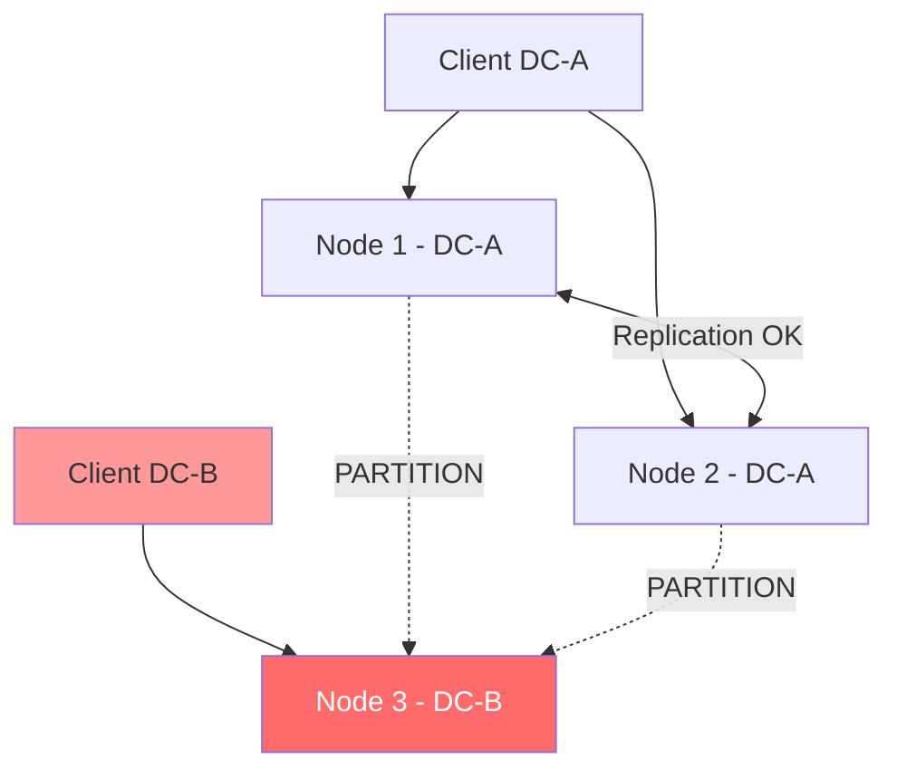
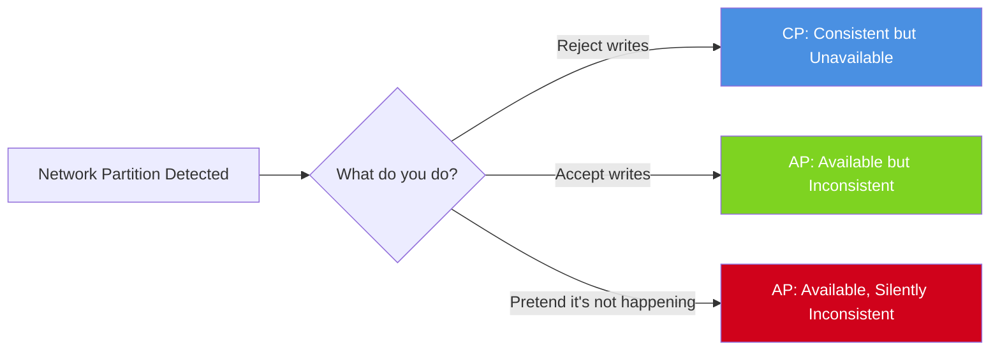
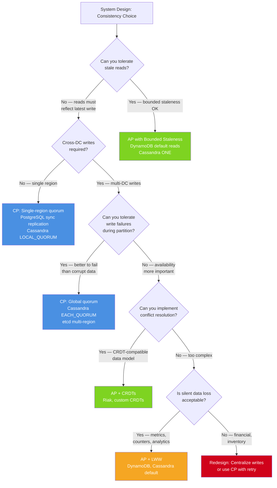

# CAP Theorem in Practice: Partition Tolerance, Trade-offs, and PACELC

**Every distributed system experiences network partitions. The CAP theorem doesn't give you a choice about whether to tolerate partitions — it forces you to decide what your system does when they occur.** The real question is: when your database cluster splits, do you keep serving potentially stale data (AP) or do you stop accepting writes to preserve correctness (CP)?

Most engineers treat CAP as a classification exercise. Staff+ engineers treat it as a failure-mode design exercise: "when the partition happens at 2 AM, exactly which guarantees break, by how much, and how will the on-call know?"

---

## The Problem Class `[Mid]`

A 3-node database cluster spans two data centers. A network switch fails, splitting the cluster: 2 nodes in DC-A, 1 node in DC-B. Writes are still arriving. What does the cluster do?



**Option A (CP behavior):** Node 3 in DC-B detects it cannot reach a quorum. It stops accepting writes and returns errors. Clients in DC-B experience 100% write failures until the partition heals.

**Option B (AP behavior):** All three nodes continue accepting writes independently. Node 3 accepts writes that may conflict with writes on Node 1/2. On partition heal, the system must resolve conflicts.

**The non-obvious insight:** You cannot opt out of this choice. A system that "handles partitions gracefully" has simply made an implicit choice — usually AP, because returning errors is more visible than silently diverging.



---

## Why the Obvious Solution Fails `[Senior]`

### "Just replicate synchronously"

Synchronous replication across data centers means every write must round-trip to all replicas before acknowledging. At 80ms cross-DC latency, writes take ≥80ms minimum. Under partition, writes block indefinitely waiting for the unreachable replica. You've traded latency for consistency — and under partition, you've also lost availability.

This is CP. It's a valid choice. But engineers often adopt it without realizing they've eliminated availability for their cross-DC users during any network event.

### "Just use eventual consistency"

Eventual consistency without conflict resolution means last-write-wins (LWW) by default. LWW silently discards data. An inventory system running LWW during a partition where DC-A decrements stock by 10 and DC-B decrements stock by 15 simultaneously will resolve to whichever write had the later timestamp — losing the other decrement entirely. The result: phantom inventory.

### "CAP only applies to databases"

CAP applies to any distributed stateful system: caches, message brokers, service registries, coordination services, distributed locks. Ignoring this means making implicit AP choices in systems where your business requires CP guarantees.

---

## The Solution Landscape `[Senior]`

### The PACELC Model: Beyond CAP

CAP only addresses behavior during partitions (P). Daniel Abadi's PACELC model extends this to normal operation: under no partition (E), there's a trade-off between latency (L) and consistency (C).

| System | During Partition | During Normal Operation |
|---|---|---|
| Cassandra (default) | AP | Elc (high availability, eventual consistency) |
| Cassandra (QUORUM) | CP | ELC (higher consistency, higher latency) |
| DynamoDB | AP | Elc |
| DynamoDB (strong read) | CP | ELC |
| PostgreSQL streaming replication | CP | ELC |
| MySQL Group Replication | CP | ELC |
| ZooKeeper | CP | ELC |
| etcd | CP | ELC |

The key insight from PACELC: **choosing consistency costs latency even when there's no partition**. A CP system must synchronously replicate writes, adding cross-DC latency (typically 5–80ms depending on geography) to every write, 24/7.

### Solution 1: CP Systems — Quorum-Based Writes

**What it is:** Writes require acknowledgment from a majority (quorum) of replicas before succeeding. Reads optionally require quorum too. Under partition, the minority partition refuses writes.

**How it actually works at depth:**

With N=3 replicas, write quorum W=2, read quorum R=2:
- Normal: write succeeds if 2/3 nodes acknowledge
- Under partition (2 vs 1): the 2-node partition has quorum, continues serving. The 1-node partition cannot achieve W=2, refuses writes.
- W + R > N ensures read-after-write consistency: at least one node that acknowledged the write must be in the read quorum

**Sizing guidance** `[Staff+]`

Quorum latency in milliseconds:
```
P99 write latency = max(replica_ack_latencies sorted, take index W-1)
```

For W=2 across 3 replicas where replica 3 is cross-DC at 80ms:
- If you need W=2: latency = max(local_ack_1, local_ack_2) ≈ 5ms (both in same DC)
- If W=3: latency = cross_DC_ack ≈ 85ms always

At 10,000 writes/sec, a 80ms write latency requires a write buffer of:
```
buffer_depth = throughput × latency = 10,000 × 0.085 = 850 in-flight writes
```

Each node needs enough connection pool slots and memory to handle this concurrency. Rule of thumb: connection pool size ≥ (QPS × P99_latency) / 1000.

**Configuration decisions that matter** `[Staff+]`

Cassandra consistency levels that change everything:
- `ONE`: AP behavior, one replica ack required
- `QUORUM`: CP-ish behavior, ceil(RF/2)+1 acks required
- `LOCAL_QUORUM`: CP within a DC, AP across DCs — the pragmatic middle ground
- `ALL`: maximum consistency, zero fault tolerance

`LOCAL_QUORUM` is the most common production choice for multi-DC Cassandra: CP within each DC (can survive one node failure), AP across DCs (partition between DCs degrades to independent operation).

**Failure modes** `[Staff+]`

*Split-quorum deadlock:* With N=4, W=3, a 2-2 partition means neither side has quorum. Both halves refuse writes. This is why odd-numbered cluster sizes are mandatory for quorum-based systems.

*Zombie leader:* A leader node gets network-partitioned from other nodes but can still reach clients. It continues serving stale reads and refusing writes. With leases (leader validity period), this window is bounded: `max_stale_read_time = lease_duration = typically 10–30 seconds`.

*Quorum with slow replicas:* A single slow replica (GC pause, I/O saturation) becomes the tail of every quorum write. P99 latency degrades to that replica's P99 even if 99% of requests would succeed with the two fast replicas. Solution: hedged requests or replica exclusion with health-check-based routing.

**Observability** `[Staff+]`

Critical metrics:
```
consistency_downtime_seconds_total{dc="dc-b", reason="quorum_unavailable"}
write_latency_p99{consistency="quorum"} — alert if >3x baseline
replica_lag_seconds — alert if >threshold (triggers pre-partition early warning)
quorum_timeout_rate — alert if >0.1% of writes
```

### Solution 2: AP Systems — Conflict Resolution Strategies

**What it is:** All replicas accept writes independently. On partition heal, the system must reconcile diverged state.

**How it actually works at depth:**

DynamoDB's configurable model:
- Eventually consistent reads (default): returns result from one replica (may be stale)
- Strongly consistent reads: requires quorum, doubles read cost (2x RCU), latency increases

Cassandra's LWW conflict resolution:
1. Each write is timestamped with the coordinator's wall clock
2. On conflicting writes, the one with the later timestamp wins
3. The loser is silently discarded — no error, no log entry at application level

**Sizing guidance** `[Staff+]`

Conflict rate estimation for an AP system during partition of duration `t`:
```
conflict_rate = (write_rate_DC_A + write_rate_DC_B) × partition_duration × key_overlap_fraction
```

For an e-commerce inventory system:
- Write rate: 500 writes/sec across 2 DCs = 250/sec per DC
- Partition duration: 30 seconds
- Key overlap: 15% (same SKUs written in both DCs)
- Expected conflicts: (250 + 250) × 30 × 0.15 = 2,250 conflicts to resolve

At 2,250 conflicts, LWW discards 2,250 updates. For inventory: these are quantity changes, potentially resulting in oversell or phantom stock.

**Failure modes** `[Staff+]`

*Clock skew conflicts:* Two writes at nearly the same time, LWW chooses based on which node had a clock 1ms faster. NTP can drift 100–500ms. In practice, any two writes within 500ms of each other have non-deterministic LWW outcomes.

*Zombie writes:* A write is accepted by the minority partition, then the partition heals and the majority's state overwrites it. The client received a success acknowledgment but the write was lost. This is the most dangerous failure mode — silent data loss with a successful API response.

*Tombstone accumulation:* In Cassandra's AP mode, deletes create tombstones (markers saying "this key was deleted"). During prolonged partition, deleted keys can be re-inserted by the isolated partition. On heal, depending on timestamp, the delete or the re-insert wins. Tombstones must be compacted away — at high delete rates, tombstone accumulation causes read latency degradation (Cassandra scans them on every read).

**Observability** `[Staff+]`

```
conflict_resolution_count_total{strategy="lww", outcome="data_loss"}
cross_dc_replication_lag_seconds — leading indicator of partition size
tombstone_count_per_read — alert if >1000 (Cassandra performance cliff)
write_acknowledged_but_not_replicated_count — near-impossible to measure directly; use read-your-writes tests
```

---

## Trade-off Matrix `[Senior]` → `[Staff+]`

| Dimension | CP (ZooKeeper, etcd, PostgreSQL) | AP (Cassandra default, DynamoDB default) | Configurable (Cassandra QUORUM, DynamoDB strong) |
|---|---|---|---|
| Write availability during partition | Minority partition unavailable | All nodes available | Depends on config |
| Read freshness | Always fresh (from leader) | May be stale (bounded by replica lag) | Configurable |
| Write latency (normal ops) | Higher (sync replication) | Lower (async replication) | Higher with strong settings |
| Conflict resolution needed | No (no divergence) | Yes (LWW or CRDTs) | Depends |
| Failure mode on partition | Visible errors | Silent data inconsistency | Depends |
| Use cases | Leader election, locks, config | User activity, telemetry, carts | Financial data with latency requirements |
| Partition heal complexity | Simple | Complex (conflict resolution) | Moderate |

---

## Decision Framework `[Senior]` → `[Staff+]`



**The PACELC decision layer** — add this after the CAP choice:

1. If you chose CP: measure your cross-DC write latency. If P99 > 50ms, you'll need write buffering and explicit retry budgets in clients.
2. If you chose AP: enumerate every data type that gets written during partition. For each: what's the LWW conflict result? Is that acceptable? If not, you need per-type conflict resolution.
3. Regardless: define your partition detection SLA. How long before you page on-call? At what replica lag do you auto-switch consistency levels?

---

## Production Failure Story `[Staff+]`

**The Inventory Phantom: AP without conflict resolution in an e-commerce system**

A major retailer ran Cassandra in AP mode (consistency level ONE) across 3 DCs for their inventory service. During Black Friday, a BGP routing issue caused a 40-second partition between DC-1 and DC-2/DC-3.

Timeline:
- T+0: Partition begins. DC-1 has 2 nodes, DC-2+DC-3 have 4 nodes.
- T+0 to T+40: Both sides accept writes. DC-1 decrements inventory for ~3,000 orders. DC-2/3 decrements inventory for ~8,000 orders. The same 500 high-demand SKUs were written on both sides.
- T+40: Partition heals. Cassandra's LWW kicks in. For the 500 conflicting SKUs, writes from whichever node had the later wall-clock timestamp win.
- T+41: Post-heal reads show inventory counts that reflect only one side's writes for the 500 conflicting SKUs. Approximately 1,200 inventory decrements were silently discarded.
- T+60 to T+300: Orders fulfillment system detects stock discrepancies. 1,200 orders confirmed but no inventory. Manual reconciliation required over 3 hours.

**Root causes:**
1. LWW conflict resolution was appropriate for user sessions but was applied to inventory without review.
2. No conflict detection metrics existed — the failure was discovered by downstream systems, not the database layer.
3. Partition detection alerting had a 5-minute threshold (too slow for 40-second partition impact).

**The fix:**
- Inventory moved to CP mode (QUORUM consistency) — DC-1 minority partition now refuses writes, returning errors that the order service handles with a queue.
- Conflict detection metric added: read-your-writes test running every 30 seconds, alerting on stale reads.
- Partition detection threshold reduced to 10 seconds.

---

## Observability Playbook `[Staff+]`

### Signals to instrument at system level

```
# Partition detection
replica_sync_lag_seconds{replica="dc2"} > 5  → WARN
replica_sync_lag_seconds{replica="dc2"} > 30 → PAGE (probable partition)

# Consistency violations (requires read-your-writes tests)
ryw_violation_rate  → alert if > 0 in CP systems, > SLA threshold in AP systems

# Quorum health
quorum_write_failure_rate  → alert if > 0.01%
quorum_read_failure_rate   → alert if > 0.01%

# For AP systems: conflict tracking
lww_conflict_count_total
lww_discarded_write_count_total  ← this is the "data loss" counter; must be 0 for financial data

# PACELC latency impact
write_latency_p50{consistency="quorum"}    → baseline
write_latency_p99{consistency="quorum"}    → alert if > 3x p50 (replica slowdown)
cross_dc_replication_latency_p99           → alert if > 200ms (approaching partition territory)
```

### Runbook: partition detected

1. Identify which partition has quorum (CP systems: minority partition will have elevated write error rate).
2. For AP systems: identify the conflict window (start of elevated replica lag to partition heal).
3. Pull conflict candidates: keys written in both partitions during the window.
4. Run reconciliation job against business rules (not LWW).
5. Page if financial or inventory data is in the conflict set.

---

## Architectural Evolution `[Staff+]`

### 2020–2022: Multi-region active-active as the default aspiration

Teams adopted Cassandra or DynamoDB Global Tables for multi-region active-active without fully internalizing the AP consequences. The pattern was: "use eventual consistency everywhere and add compensation logic later."

### 2023–2024: The CRDT resurgence

Riak's CRDT model gained attention. Teams with document collaboration (Notion, Figma competitors) adopted CRDTs. The insight: if your data model is CRDT-compatible (counters, sets, maps with merge semantics), you get conflict-free AP. The cost: CRDT data models are restrictive and require careful schema design.

### 2025–2026: Configurable consistency as the standard

DynamoDB's per-request consistency, Cassandra's per-query consistency levels, and CockroachDB's `FOLLOWER READS` have shifted the model: rather than choosing CP vs AP at design time, modern systems route queries to the appropriate consistency level based on business requirements at query time.

- Financial writes → strong consistency (QUORUM or linearizable)
- Analytics reads → eventual consistency (ONE, stale read)
- User preference reads → bounded staleness (read from replica with max 5s lag)

**2026 tooling perspective:**
- **TiDB** and **CockroachDB** implement Google Spanner's TrueTime-inspired model: globally consistent transactions using atomic clocks and GPS receivers in their hosted versions, eliminating the CAP/PACELC trade-off for latency-tolerant workloads.
- **Antidote** (from SyncFree) provides CRDT-native distributed databases. Still research-adjacent but gaining production adoption for collaboration tools.
- **AWS Aurora Global Database** provides read scaling with <1 second replication lag, with explicit "global write forwarding" for CP-ish behavior without partition failures.

The trajectory: the industry is moving toward per-operation consistency configuration rather than system-wide consistency policies, with observability tooling to verify consistency guarantees per request type.

---

## Decision Framework Checklist `[All Levels]`

- [ ] Enumerate every entity type in your system. Classify each: can LWW data loss occur? (financial, inventory → no; telemetry, user activity → probably yes)
- [ ] Define your partition tolerance requirement: when a DC is isolated, should it serve writes (AP) or refuse (CP)?
- [ ] Calculate quorum latency for CP choice: write_latency_p99 = round_trip_to_quorum_replicas. Is this acceptable?
- [ ] For AP choice: design conflict resolution per entity type. Do not rely on LWW for any entity where data loss is unacceptable.
- [ ] Instrument partition detection: replica lag alert threshold = max acceptable stale time / 2 (early warning)
- [ ] Implement read-your-writes tests: synthetic client writes then immediately reads, alerts on stale result
- [ ] Define partition recovery runbook: who owns conflict resolution? Is it automated or manual?
- [ ] Choose cluster size: always odd (3 or 5) for quorum-based systems. Even-numbered clusters risk 50/50 split with no quorum.
- [ ] Test partition behavior explicitly in staging: use chaos tools (Chaos Monkey, Gremlin) to inject partition and observe system behavior under load
- [ ] Document the implicit consistency level of every query in your codebase: "consistency=ONE" as code comments, not just in the DBA's head

---
*Written by Gaurav Porwal — 10+ Year Engineer | Tech Lead | Product Owner | Business-Minded Builder*
*Last updated: 2026-03-18*
