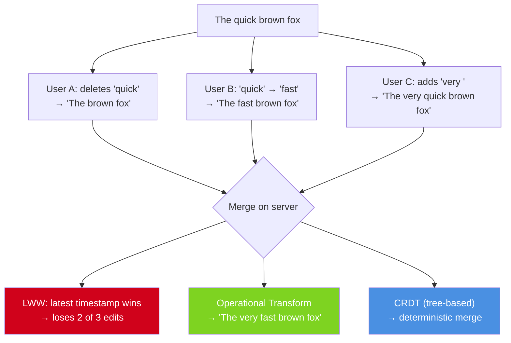
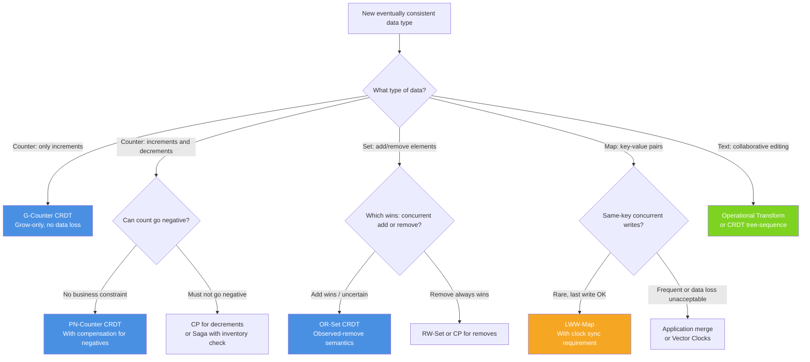

# Eventual Consistency Patterns: CRDTs, Conflict Resolution, and Convergence

**Last-write-wins is not a conflict resolution strategy. It's a conflict elimination strategy that discards data.** In an AP system under partition, concurrent writes create genuine conflicts that must be resolved — and the resolution strategy is a business decision, not a database default. CRDTs prove that some conflict resolutions can be mathematically guaranteed to converge without coordination.

The core insight: if you can model your data in a way where concurrent updates can always be merged deterministically, you can have full availability (accept every write) with strong eventual consistency (all replicas converge to the same state) — without any locks, coordination, or conflict resolution at application level.

---

## The Problem Class `[Mid]`

A collaborative document editor has 3 users editing the same document simultaneously. User A deletes word "quick", User B changes "quick" to "fast", User C adds " very" before "quick".



This is the fundamental problem of eventual consistency: concurrent writes to the same data. Three approaches with radically different properties:

1. **LWW (Last-Write-Wins):** Pick the latest timestamp. Simple. Loses 2 of 3 edits.
2. **Operational Transform (OT):** Transform each operation relative to concurrent operations. Complex. Correct for sequential character-by-character edits.
3. **CRDT:** Model the data such that merge is always defined and associative/commutative/idempotent. No coordination needed.

---

## Why the Obvious Solution Fails `[Senior]`

### "Last-Write-Wins is fine for most cases"

LWW is fine when:
- The data is truly independent (no concurrent writes to same key in practice)
- Losing a write is cosmetically acceptable (telemetry counters off by 1)

LWW silently loses data when:
- Two clients write the same key within the NTP drift window (~500ms)
- A client writes during a partition and the partition heals with the minority side losing
- A client's write is delayed by network and arrives after a "later" write that should logically precede it

The non-obvious danger: LWW failures are silent. The client received a 200 OK. The write was durably stored on its replica. There is no error, no alert, no visibility into the fact that another write was discarded. You discover it when a user says "I saved my changes and they disappeared."

### "Just implement merge at the application layer"

Application-layer merge is correct in principle but fails in practice:
1. Requires reading current state before every write (read-modify-write) — kills throughput
2. The read and write are not atomic — another write can slip in between (ABA problem)
3. Application merge logic tends to have bugs that are discovered only under concurrent load
4. Every new data type requires new merge logic to be designed and tested

CRDTs eliminate this by proving merge is correct at the mathematical level.

---

## The Solution Landscape `[Senior]`

### The Convergence Requirements (Strong Eventual Consistency)

A system provides Strong Eventual Consistency (SEC) if:
1. **Eventual delivery:** Every update delivered to one correct replica is eventually delivered to all correct replicas
2. **Convergence:** All correct replicas that have received the same updates have the same state

For SEC, the update function (merge) must be:
- **Commutative:** merge(A, B) = merge(B, A) — order doesn't matter
- **Associative:** merge(merge(A, B), C) = merge(A, merge(B, C)) — grouping doesn't matter
- **Idempotent:** merge(A, A) = A — applying same update twice has same result as once

Any data type whose merge satisfies these three properties is a CRDT.

### Solution 1: Grow-Only Counter (G-Counter)

**What it is:** A counter that can only be incremented. Each node tracks its own increment count. The global count is the sum of all node counts.

**How it actually works at depth:**

```python
class GCounter:
    def __init__(self, node_id: str, num_nodes: int):
        self.node_id = node_id
        self.counts = [0] * num_nodes  # index = node index
        self.node_index = int(node_id.split('_')[1])

    def increment(self):
        self.counts[self.node_index] += 1

    def value(self) -> int:
        return sum(self.counts)

    def merge(self, other: 'GCounter') -> 'GCounter':
        """Merge is element-wise maximum — the key CRDT property"""
        result = GCounter(self.node_id, len(self.counts))
        result.counts = [max(a, b) for a, b in zip(self.counts, other.counts)]
        return result

    def state(self) -> list:
        return self.counts.copy()

# Example: DC-A and DC-B both increment during partition
node_a = GCounter('node_0', 3)
node_b = GCounter('node_1', 3)
node_c = GCounter('node_2', 3)

# DC-A increments 10 times during partition
for _ in range(10):
    node_a.increment()  # node_a.counts = [10, 0, 0]

# DC-B increments 15 times during partition
for _ in range(15):
    node_b.increment()  # node_b.counts = [0, 15, 0]

# On partition heal: merge is element-wise max
merged_a_b = node_a.merge(node_b)
# merged.counts = [10, 15, 0]
# merged.value() = 25  ← CORRECT: 10 + 15 increments preserved
```

Merge is `element-wise maximum` — provably commutative, associative, idempotent. On partition heal, you always get the correct total without losing any increments.

**Sizing guidance** `[Staff+]`

G-Counter state size: O(N) where N = number of nodes. At 100 nodes, state per counter = 100 × 8 bytes = 800 bytes. For 1 million counters: 800 MB just for counter state. At 1,000 nodes: 8 GB.

This is the CRDT scalability constraint: state grows with replica count. Sharding the counter namespace across multiple CRDT instances mitigates this.

### Solution 2: PN-Counter (Positive-Negative Counter)

Supports both increments and decrements by maintaining two G-Counters:

```python
class PNCounter:
    def __init__(self, node_id: str, num_nodes: int):
        self.positive = GCounter(node_id, num_nodes)
        self.negative = GCounter(node_id, num_nodes)

    def increment(self): self.positive.increment()
    def decrement(self): self.negative.increment()

    def value(self) -> int:
        return self.positive.value() - self.negative.value()

    def merge(self, other: 'PNCounter') -> 'PNCounter':
        result = PNCounter(self.node_id, len(self.positive.counts))
        result.positive = self.positive.merge(other.positive)
        result.negative = self.negative.merge(other.negative)
        return result
```

**Critical limitation:** PN-Counter can go negative. You cannot enforce "never go below 0" with a standard PN-Counter in AP mode — that constraint requires coordination. For inventory (which must not go negative), you need a different approach: either CP for the decrement, or a saga pattern that compensates for over-decrement.

**Failure modes** `[Staff+]`

*Inventory below zero:* PN-Counter on inventory, two DCs each decrement by 5 during partition when only 6 items remain. After partition heal: value = 6 - 5 - 5 = -4. The counter correctly converges, but to an invalid business state. LWW would have also been wrong but in a different way (only one decrement applied).

Solution: accept the negative state, run compensation (cancel one fulfillment), alert on-call. This is the "AP choice" made visible.

### Solution 3: OR-Set (Observed-Remove Set)

**What it is:** A set that supports add and remove operations, where removes are only effective for specific observed adds — preventing the "remove wins" problem.

**The problem with naive sets:**
- Add-wins set: concurrent add(A) and remove(A) results in A present (add wins)
- Remove-wins set: concurrent add(A) and remove(A) results in A absent (remove wins)
- Neither is always correct — it depends on business semantics

**How OR-Set actually works:**

```python
import uuid

class ORSet:
    def __init__(self):
        # Each element is (value, unique_tag) — the tag makes each add unique
        self.added: set = set()    # Set of (value, tag) tuples
        self.removed: set = set()  # Set of (value, tag) tuples that were removed

    def add(self, value):
        tag = str(uuid.uuid4())
        self.added.add((value, tag))

    def remove(self, value):
        # Remove all currently observed instances of value
        to_remove = {(v, t) for (v, t) in self.added if v == value}
        self.removed.update(to_remove)

    def contains(self, value) -> bool:
        active = self.added - self.removed
        return any(v == value for (v, _) in active)

    def merge(self, other: 'ORSet') -> 'ORSet':
        result = ORSet()
        result.added = self.added | other.added  # Union of all adds
        result.removed = self.removed | other.removed  # Union of all removes
        return result

# Concurrent add and remove:
s1 = ORSet()  # Node 1 (during partition)
s2 = ORSet()  # Node 2 (during partition)

s1.add("item_A")  # Node 1 adds item_A, unique tag t1
s2.remove("item_A")  # Node 2 tries to remove item_A
                     # But s2's added set doesn't have (item_A, t1) yet
                     # So nothing is removed from s2

merged = s1.merge(s2)
# merged.added = {(item_A, t1)} (from s1)
# merged.removed = {} (s2's remove had nothing to remove)
# merged.contains("item_A") = True  ← Add wins, which is correct
```

This is correct: Node 2 tried to remove something it never observed being added (the add happened concurrently on Node 1). The semantics: "I can only remove what I've seen."

**Configuration decisions that matter** `[Staff+]`

OR-Set storage grows unboundedly without garbage collection: the removed set accumulates all historical (value, tag) pairs. Garbage collection requires coordination — knowing that all replicas have received a remove before cleaning it up. Riak implements this via dotted version vectors for bounded state.

At 100,000 add/remove operations/day on a 1,000-element set, the removed set reaches 36.5M entries/year. Implement tombstone compaction: after all replicas confirm a remove is consistent, compact the tombstone.

### Solution 4: LWW-Map (Last-Write-Wins Element Map)

**What it is:** A map where each key has an associated timestamp. Concurrent writes to the same key resolve by timestamp. Concurrent writes to different keys are always merged.

```python
from dataclasses import dataclass
from typing import Any

@dataclass
class TimestampedValue:
    value: Any
    timestamp: float
    node_id: str  # Tiebreaker when timestamps equal

class LWWMap:
    def __init__(self, node_id: str):
        self.node_id = node_id
        self.entries: dict = {}  # key → TimestampedValue

    def put(self, key: str, value: Any, timestamp: float = None):
        import time
        ts = timestamp or time.time()
        self.entries[key] = TimestampedValue(value, ts, self.node_id)

    def get(self, key: str) -> Any:
        entry = self.entries.get(key)
        return entry.value if entry else None

    def merge(self, other: 'LWWMap') -> 'LWWMap':
        result = LWWMap(self.node_id)
        all_keys = set(self.entries.keys()) | set(other.entries.keys())
        for key in all_keys:
            a = self.entries.get(key)
            b = other.entries.get(key)
            if a is None:
                result.entries[key] = b
            elif b is None:
                result.entries[key] = a
            elif a.timestamp > b.timestamp:
                result.entries[key] = a
            elif b.timestamp > a.timestamp:
                result.entries[key] = b
            else:
                # Tiebreak by node_id (arbitrary but deterministic)
                result.entries[key] = a if a.node_id > b.node_id else b
        return result
```

**The non-obvious data loss:** LWW-Map resolves same-key conflicts by timestamp. Within the NTP drift window (~500ms), the "later" timestamp may belong to an operation that was logically earlier. This is silent data loss with a deterministic outcome — deterministic doesn't mean correct.

**When LWW-Map is acceptable:**
- User profile fields where the "last update wins" semantics match user intent (updating display name)
- Settings/preferences where concurrent updates are extremely rare
- Shopping cart contents where last cart state wins (not ideal, but acceptable for user experience)

**When LWW-Map is not acceptable:**
- Financial account state — LWW can produce wrong balances
- Inventory counts — LWW discards decrements
- Collaborative documents — LWW discards edits

### Solution 5: Operational Transform (OT)

**What it is:** A framework for transforming concurrent operations to account for each other's effects, enabling real-time collaborative editing.

**How it works at depth:**

For a sequence "the quick fox":
- User A: delete(4, 5) — delete characters 4-8 ("quick"), resulting in "the  fox"
- User B: insert(4, "very ") — insert "very " at position 4, resulting in "the very quick fox"

These operations are concurrent. Applying them in either order gives different results. OT transforms:
- B's operation relative to A: insert position 4 is now position 4 (A's delete happened after position 4, so B's position is unchanged after applying A first)
- A's operation relative to B: delete positions 4-8, but B inserted 5 chars at position 4, so the positions shift → delete(9, 13)

The result: "the very fox" — both operations applied, mutually adjusted.

**Why OT is hard at scale:**
- Transformation functions must be correct for all combinations of operation types (insert+delete, delete+delete, insert+insert)
- With N concurrent operations, O(N²) transformations needed
- Requires a central server (Jupiter/Google Docs model) or complex distributed protocol to maintain operation ordering
- Bugs in OT implementations cause subtle "cursor jumps" and character duplication — notoriously hard to test

**Sizing guidance** `[Staff+]`

OT server throughput: operation log grows at ~200 bytes/operation. At 100 users per document, 60 ops/user/minute: 6,000 ops/min per document = 1.2 MB/min per document. A 1-hour session = 72 MB of operation log per active document. At 10,000 concurrent documents: 720 GB/hour. Snapshot + operation-since-snapshot is mandatory.

Snapshot frequency: take snapshot when operation log for a document exceeds 10,000 operations or 1 MB. Clients joining after snapshot only need operations since last snapshot.

**Failure modes** `[Staff+]`

*OT divergence:* Two clients with different operation histories apply transformations in different orders and arrive at different document states. This is a correctness bug in the OT implementation, not a data loss issue — both clients see a document, but different documents. Manifests as: users report seeing different versions of a document that "should" be synced.

Detection: checksum document state on every sync, compare across clients. Alert if checksum diverges.

---

## Trade-off Matrix `[Senior]` → `[Staff+]`

| Strategy | Data Safety | Throughput | Complexity | Use Case |
|---|---|---|---|---|
| LWW | Silent data loss possible | Highest | Lowest | Telemetry, cache, user prefs |
| G-Counter | No loss on increment | High | Low | Page views, event counts |
| PN-Counter | Can go negative | High | Low | Inventory (with compensation) |
| OR-Set | Correct add/remove semantics | Medium | Medium | Shopping carts, friend lists |
| LWW-Map | Field-level LWW | High | Low | Profile fields, settings |
| Vector Clocks + app merge | No loss, app decides | Medium | High | Domain-specific conflicts |
| OT | No loss, editor semantics | Medium | Very High | Collaborative text/code editing |

---

## Decision Framework `[Senior]` → `[Staff+]`



---

## Production Failure Story `[Staff+]`

**The Phantom Cart: LWW on e-commerce cart with concurrent tab sessions**

A large e-commerce platform used DynamoDB with LWW semantics for shopping cart storage. Cart was stored as a single DynamoDB item (one JSON blob, one `updated_at` timestamp).

Scenario: A user opens two browser tabs — desktop and mobile — and modifies their cart concurrently.

- T+0: User has cart: [{sku: "A", qty: 2}, {sku: "B", qty: 1}]
- T+0.1: Tab 1 (desktop) adds SKU C. Cart state: [{A,2}, {B,1}, {C,1}]. Writes with timestamp=T+0.1.
- T+0.15: Tab 2 (mobile, slightly slower clock) removes SKU B. Cart state: [{A,2}]. Writes with timestamp=T+0.15 (clock was 50ms ahead).
- T+0.15: LWW resolves: Tab 2's write wins (later timestamp). Cart = [{A,2}].
- Lost: SKU C was never added in final state. User's desktop add was silently discarded.

The user added an item, saw it in the cart, navigated to checkout — item was missing. Support ticket: "Items keep disappearing from my cart."

At 500,000 DAU and ~5% cart modification rate with 2+ sessions: approximately 1,250 users/day experiencing cart data loss. This impacted revenue directly.

**The fix:**
1. Cart stored as ORSet of SKU entries, each with unique add-ID
2. Removes reference specific add-IDs (observed-remove semantics)
3. Concurrent add on one tab, remove on another: add wins if not the same observed instance
4. Merge operation: union of active entries across all sessions
5. DynamoDB conditional writes enforce atomic updates with version vectors

Post-fix: zero cart data loss incidents over 6 months. Implementation complexity: 2 weeks for a senior engineer to implement and test the CRDT-backed cart service.

---

## Observability Playbook `[Staff+]`

### Convergence health

```
# State divergence detection
crdt_replica_state_hash{replica="r1"}   — compare across replicas after sync
crdt_convergence_time_seconds_p99        — time from write to all-replica consistency
crdt_merge_conflict_count_total          — number of conflicts requiring merge

# Data integrity signals
lww_concurrent_write_window_violations   — writes within NTP drift window (potential incorrect LWW)
cart_item_loss_rate                      — read-after-write for user actions (if item count decreases unexpectedly)
counter_negative_events_total            — PN-Counter below 0 events

# Tombstone health (OR-Set and similar)
tombstone_count_per_key                  — alert if > 10,000 (unbounded growth)
tombstone_compaction_lag_hours           — alert if > 24h

# CRDT state size
crdt_state_size_bytes_p99               — alert if > 100KB per entry (unbounded growth)
```

### Synthetic convergence tests

Run a continuous test: write to replica A, immediately read from replica B, measure time to convergence:

```python
async def convergence_test():
    key = f"test:{uuid.uuid4()}"
    write_time = time.time()

    await replica_a.set(key, "test_value")

    while True:
        val = await replica_b.get(key)
        if val == "test_value":
            convergence_time = time.time() - write_time
            metrics.record("crdt.convergence_seconds", convergence_time)
            break
        if time.time() - write_time > 30:
            alerts.page("crdt.convergence_timeout", key=key)
            break
        await asyncio.sleep(0.1)
```

Run this every 60 seconds. Alert if convergence P99 > SLA.

---

## Architectural Evolution `[Staff+]`

### 2020–2022: LWW as the default, CRDTs as exotic

Most teams used DynamoDB or Cassandra with LWW and didn't know they had a conflict resolution problem until users reported data loss. CRDTs were considered academic — Riak was the only mainstream CRDT database and was losing market share.

### 2023–2024: CRDTs in collaboration tools

Figma, Notion, and Linear adopted CRDT-based collaborative editing. The Yjs library brought practical CRDT implementation to JavaScript, making collaborative text editing accessible without implementing OT from scratch. The pattern: CRDT for document state, LWW for metadata.

### 2025–2026: CRDTs as a first-class primitive

**Automerge 2.0:** Rust-based CRDT library with WASM compilation, enabling CRDTs to run in browser and server with the same library. No coordination server needed — peers sync directly.

**Electric SQL:** Postgres-backed CRDT sync layer. Defines conflict resolution at the schema level with PostgreSQL constraints. Developers write SQL, Electric handles CRDT-based sync to local SQLite replicas.

**Replicache:** Local-first architecture where the client has a full CRDT replica. Server is the source of truth for ordering, but clients operate optimistically against their local CRDT. Zero-latency local writes, async server sync.

**The 2026 pattern:** Local-first applications where the client device is a full replica with CRDT semantics, the server is a coordinator for ordering and durability, and sync is automatic and conflict-free. The CRDT is invisible to the developer — the framework handles merge.

Practical implication: for new collaborative features in 2026, evaluate Automerge or Yjs before implementing custom conflict resolution. The implementation complexity is now library-level, not algorithmic.

---

## Decision Framework Checklist `[All Levels]`

- [ ] For each eventually-consistent data type, explicitly classify the conflict resolution semantics (LWW, add-wins, remove-wins, merge-defined)
- [ ] Identify all cases where LWW could discard semantically important data. For each: is this acceptable?
- [ ] For counters: use G-Counter (increments only) or PN-Counter (inc+dec). Never LWW for counters.
- [ ] For sets: choose OR-Set (add-wins) or RW-Set (remove-wins) based on business semantics. Never LWW for sets.
- [ ] For maps: if concurrent writes to same key are frequent or high-value, use vector clocks + application-defined merge, not LWW.
- [ ] For text: use Yjs or Automerge (CRDT-based) or OT with a battle-tested implementation. Never LWW for text.
- [ ] Bound CRDT state size: implement tombstone compaction with known schedule and bounded retention.
- [ ] Instrument convergence time: define SLA (e.g., P99 < 5s) and alert when violated.
- [ ] Test conflict scenarios explicitly: write to two replicas with simulated partition, verify merge result matches expected business semantics.
- [ ] Document the conflict semantics of each CRDT in your system — "add-wins OR-Set for shopping cart" — as code comments and in runbooks.

---
*Written by Gaurav Porwal — 10+ Year Engineer | Tech Lead | Product Owner | Business-Minded Builder*
*Last updated: 2026-03-18*
