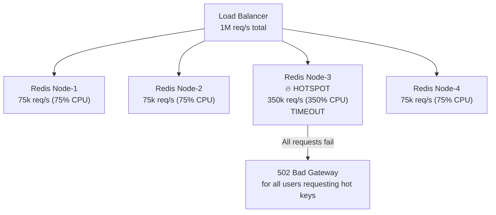
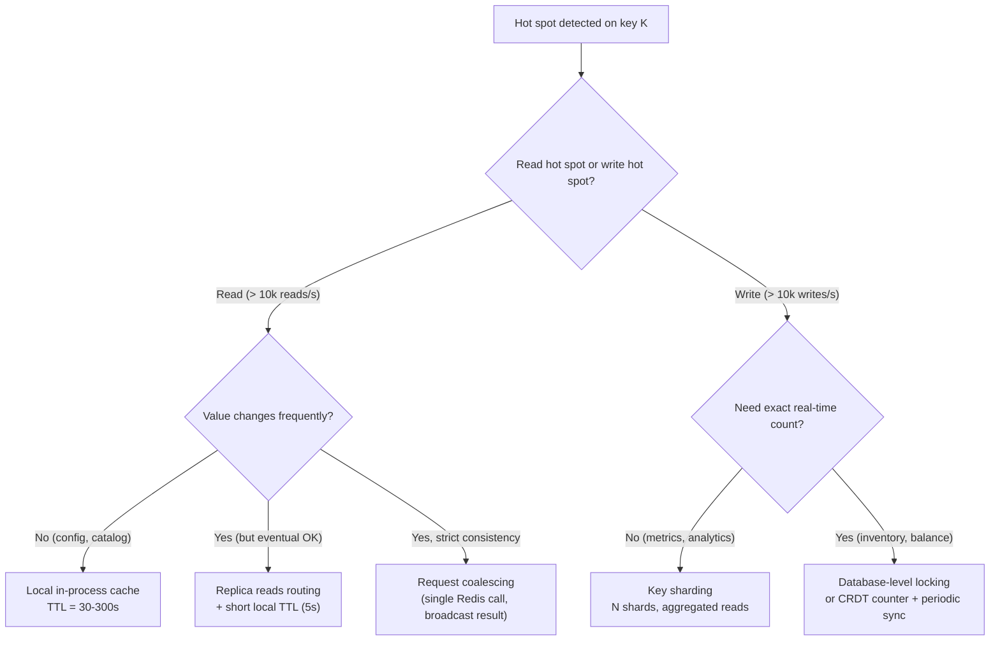

# Hot Spot Detection: Adaptive Load Balancing and Request Skew at Scale

**The math is brutal: in any large-scale system, the top 1% of keys receive ~50% of traffic. If you're not designed for it, that 1% will take down your entire cluster while the other 99% of your capacity sits idle.**

This is the Zipf distribution problem, and it affects every distributed cache, database, and message queue at scale.

---

## The Problem Class `[Mid]`

Zipf's law states that in real-world access patterns, the N-th most popular item receives 1/N of the traffic of the most popular item. Applied to your system:

```
10,000 keys total, 1M requests/second:

Key #1 (most popular):    ~140,000 req/s  (14% of all traffic)
Key #2:                    ~70,000 req/s
Key #3:                    ~47,000 req/s
Keys #1-100:              ~650,000 req/s  (65% of total traffic)
Keys #1-1000:             ~850,000 req/s  (85% of total traffic)
Keys #1001-10000:         ~150,000 req/s  (15% of total traffic)

The top 1% of keys receive 85% of the traffic.
```

A 10-node Redis cluster with uniform distribution handles 100k req/s per node. But if key #1 always goes to Node-3 (based on consistent hashing), Node-3 handles 140k req/s while all other nodes handle ~75k req/s. Node-3 becomes the hot spot — it saturates CPU, connection count, or memory while your cluster is at 35% average utilization.



The cluster shows 50% average CPU but Node-3 is on fire. Horizontal scaling doesn't help — adding more nodes just shifts the hot spot elsewhere unless you change the routing.

---

## Why the Obvious Solution Fails `[Senior]`

### More Replicas Don't Help Without Hot Key Routing

Adding Redis replicas for read distribution: `hash(key) % node_count` routes all reads of key #1 to the same primary. Replicas help only if reads are distributed across them — which requires the application layer to explicitly route hot keys to replicas.

### Consistent Hashing Doesn't Help Either

Consistent hashing solves the rehashing problem (keys don't move when you add nodes), but it still routes a given key to exactly one node. A hot key still goes to exactly one node.

### Auto-Scaling Is Blind to Key Skew

CPU-based auto-scaling adds capacity cluster-wide. Node-3 at 350% CPU triggers scale-out: cluster goes from 10 to 20 nodes. Key #1 still goes to the same node (or a new one if rehashing happens). The hot spot moves or temporarily disappears while the cache warms up, then reappears on whichever node now owns key #1. You've paid 2× the cost with no benefit.

---

## The Solution Landscape `[Senior]`

### Solution 1: Hot Key Detection

**Detection Method 1: Redis Keyspace Notifications**

```bash
# Enable keyspace notifications for key access events
redis-cli CONFIG SET notify-keyspace-events "KExg"

# Subscribe to access events
redis-cli PSUBSCRIBE "__keyevent@0__:*"
# Every GET, SET, DEL will publish to this channel
```

```python
# Hot key detector using Redis monitor or keyspace notifications
import redis
from collections import defaultdict
import time
import threading

class HotKeyDetector:
    def __init__(self, redis_host: str, threshold_rps: int = 10000,
                 window_seconds: int = 10):
        self.r = redis.Redis(host=redis_host)
        self.threshold = threshold_rps
        self.window = window_seconds
        self.key_counts = defaultdict(list)  # key -> list of timestamps
        self.hot_keys = set()

    def monitor(self):
        # Use MONITOR command — WARNING: 50% throughput reduction on monitored server
        # Use only on dedicated replica for monitoring
        with self.r.monitor() as monitor:
            for command in monitor.listen():
                if command['command'] in ('GET', 'SET', 'HGET', 'HSET'):
                    key = command['args'][0] if command['args'] else None
                    if key:
                        self._record_access(key)

    def _record_access(self, key: str):
        now = time.time()
        self.key_counts[key].append(now)
        # Prune old entries
        self.key_counts[key] = [t for t in self.key_counts[key]
                                  if now - t < self.window]
        rps = len(self.key_counts[key]) / self.window
        if rps > self.threshold and key not in self.hot_keys:
            self.hot_keys.add(key)
            self._on_hot_key_detected(key, rps)

    def _on_hot_key_detected(self, key: str, rps: float):
        print(f"HOT KEY DETECTED: {key} at {rps:.0f} req/s")
        # Trigger mitigation: publish to a coordination topic
        self.r.publish("hot-key-events", f"{key}:{rps}")
```

**Detection Method 2: Application-Layer Middleware**

```python
# Lightweight count-min sketch for hot key detection — no Redis MONITOR overhead
import mmh3  # MurmurHash3

class CountMinSketch:
    def __init__(self, width=1000, depth=5):
        self.width = width
        self.depth = depth
        self.table = [[0] * width for _ in range(depth)]

    def add(self, key: str):
        for i in range(self.depth):
            idx = mmh3.hash(key, seed=i) % self.width
            self.table[i][idx] += 1

    def estimate(self, key: str) -> int:
        return min(
            self.table[i][mmh3.hash(key, seed=i) % self.width]
            for i in range(self.depth)
        )

class HotKeyMiddleware:
    def __init__(self, detection_window=60, hot_threshold=5000):
        self.sketch = CountMinSketch()
        self.threshold = hot_threshold
        self.hot_keys = {}  # key -> expiry time

    def record_access(self, key: str) -> bool:
        self.sketch.add(key)
        estimated_count = self.sketch.estimate(key)
        # Convert count to RPS estimate
        rps_estimate = estimated_count / detection_window
        if rps_estimate > self.threshold:
            self._mark_hot(key)
            return True  # is hot
        return False

    def is_hot(self, key: str) -> bool:
        expiry = self.hot_keys.get(key, 0)
        return time.time() < expiry

    def _mark_hot(self, key: str):
        # Keep key marked hot for 60 seconds
        self.hot_keys[key] = time.time() + 60
```

**Sizing guidance** `[Staff+]`

```
Count-Min Sketch memory:
  width=1000, depth=5, int32: 1000 × 5 × 4 bytes = 20 KB
  width=10000, depth=5: 200 KB (handles 10M distinct keys with <1% error)

False positive rate for heavy hitters:
  At width=N, probability that a key appears "hot" when it's not:
  ε ≈ e/N  (Euler's e ≈ 2.718)
  width=1000: ε ≈ 0.27% (acceptable)
  width=10000: ε ≈ 0.027% (excellent)

Hot key detection latency: < 1ms (pure in-memory)
MONITOR overhead: ~50% Redis throughput reduction — use replica only
```

---

### Solution 2: Local In-Process Cache for Hot Keys

**What it is**: Once a key is detected as hot, cache it in the application's local memory. This eliminates all Redis calls for that key.

```python
from functools import lru_cache
import time

class HotKeyLocalCache:
    def __init__(self, redis_client, hot_key_detector: HotKeyMiddleware,
                 local_ttl: int = 30):
        self.redis = redis_client
        self.detector = hot_key_detector
        self.local_ttl = local_ttl
        self.local_cache = {}  # key -> (value, expiry)

    def get(self, key: str):
        self.detector.record_access(key)

        if self.detector.is_hot(key):
            # Try local cache first
            if key in self.local_cache:
                value, expiry = self.local_cache[key]
                if time.time() < expiry:
                    return value
                # Local cache expired — refresh from Redis
            value = self.redis.get(key)
            if value is not None:
                self.local_cache[key] = (value, time.time() + self.local_ttl)
            return value
        else:
            # Normal path — go to Redis
            return self.redis.get(key)

    def invalidate_hot(self, key: str):
        # Called when hot key value changes
        if key in self.local_cache:
            del self.local_cache[key]
```

**Sizing guidance** `[Staff+]`

```
Sizing the local hot-key cache:

1% of keys receiving 50% of traffic = your hot key candidates
Active hot keys at any time: typically 10-100 per application instance

Sizing formula:
  local_cache_size = hot_key_count × avg_value_size × safety_factor

  Example: 100 hot keys × 10KB avg value × 2 (safety) = 2MB per instance
  With 50 application instances: 100MB total memory for hot key caching

  Compare to: 50 instances × 140k req/s hitting single Redis node
              vs. 50 instances × 0 req/s (local cache hit, no Redis call)

The cost: local cache adds inconsistency window = local_ttl
  30s local TTL: a key update takes up to 30s to propagate to all instances

  For read-heavy, infrequently-updated data (product catalog, config): acceptable
  For frequently-updated data (inventory counts, balances): use 1-5s TTL or
  Redis Pub/Sub invalidation
```

**Cache invalidation for hot keys:**

```python
# Redis Pub/Sub invalidation — push updates to all local caches
class HotKeyCacheWithInvalidation:
    def __init__(self, redis_client):
        self.redis = redis_client
        self.local_cache = {}
        # Subscribe to invalidation channel in background thread
        self._start_invalidation_listener()

    def set(self, key: str, value: str, ttl: int):
        self.redis.setex(key, ttl, value)
        # Broadcast invalidation to all instances
        self.redis.publish("cache-invalidation", key)

    def _start_invalidation_listener(self):
        def listen():
            pubsub = self.redis.pubsub()
            pubsub.subscribe("cache-invalidation")
            for message in pubsub.listen():
                if message['type'] == 'message':
                    key = message['data'].decode()
                    if key in self.local_cache:
                        del self.local_cache[key]
        threading.Thread(target=listen, daemon=True).start()
```

---

### Solution 3: Key Sharding for Write Hot Spots

**What it is**: For keys with extremely high write rates, shard the key across multiple Redis nodes by appending a shard suffix. Reads must aggregate across all shards.

```python
class ShardedCounter:
    def __init__(self, redis_client, num_shards: int = 10):
        self.redis = redis_client
        self.num_shards = num_shards

    def increment(self, key: str, amount: int = 1):
        # Write to a random shard — distributes write load
        shard = random.randint(0, self.num_shards - 1)
        shard_key = f"{key}:shard:{shard}"
        self.redis.incrby(shard_key, amount)

    def get_total(self, key: str) -> int:
        # Read from all shards — aggregation cost
        pipe = self.redis.pipeline()
        for shard in range(self.num_shards):
            pipe.get(f"{key}:shard:{shard}")
        results = pipe.execute()
        return sum(int(r or 0) for r in results)
```

**Sizing guidance** `[Staff+]`

```
Write throughput scaling:
  1 Redis node: ~100k writes/s on a single key (with pipeline)
  10 shards across 10 nodes: ~1M writes/s on same logical key

  Shard count = target_writes_per_second / single_node_capacity
             = 500k / 100k = 5 shards minimum
  Add 2× safety factor → 10 shards

Read cost:
  get_total() issues num_shards Redis calls
  10 shards × 0.1ms per call = 1ms total (acceptable)
  With pipelining: all 10 calls in 1 RTT = 0.1ms (excellent)

Use for:
  - Counters (page views, likes, impressions)
  - Rate limiters (global request counters)
  - Inventory counts (stock levels)

Do NOT use for:
  - Keys where read-your-own-write consistency is required
  - Keys where exact real-time count is critical (use DB with FOR UPDATE instead)
```

---

### Solution 4: Replica Reads for Hot Keys `[Staff+]`

**What it is**: Detect hot read keys and route their reads to replicas instead of the primary. This spreads read load across N nodes without changing key distribution.

```python
class ReplicaAwareRedisClient:
    def __init__(self, primary: redis.Redis, replicas: list,
                 hot_key_detector: HotKeyMiddleware):
        self.primary = primary
        self.replicas = replicas
        self.detector = hot_key_detector

    def get(self, key: str):
        self.detector.record_access(key)
        if self.detector.is_hot(key) and self.replicas:
            # Route hot keys to replicas using round-robin
            replica = random.choice(self.replicas)
            return replica.get(key)
        return self.primary.get(key)

    def set(self, key: str, value: str, **kwargs):
        # Always write to primary
        result = self.primary.set(key, value, **kwargs)
        # Invalidate local caches across the fleet via pub/sub
        self.primary.publish("invalidations", key)
        return result
```

---

## Trade-off Matrix `[Senior]` → `[Staff+]`

| Mitigation | Write Hot Spot | Read Hot Spot | Consistency Impact | Complexity |
|---|---|---|---|---|
| Local in-process cache | No | Yes (reads) | TTL-based staleness | Low |
| Replica reads routing | No | Yes (reads) | Replication lag | Medium |
| Key sharding | Yes (writes) | Partial (aggregation) | Eventual (count approx) | Medium |
| Request coalescing | Yes | Yes | None (exact) | High |
| Application-level batching | Yes | Yes | None (exact) | Medium |

---

## Decision Framework `[Senior]` → `[Staff+]`



---

## Production Failure Story `[Staff+]`

**System**: Online gaming platform, item trading system
**Scale**: 8M active users, 50k trades/second at peak
**Hot key**: A rare in-game item ("Dragon Sword") that every player wants to buy

**The event**: A game update made Dragon Sword highly valuable. Within 10 minutes of the patch:
- 500k concurrent users attempting to buy the same item
- Item catalog key `item:dragon_sword` receiving 480k reads/second
- Redis Node-4 (owner of this key via consistent hashing): saturated at 100% CPU
- All reads for Dragon Sword: timing out at p99 > 5 seconds
- Players retrying → 480k RPS becomes 2M RPS (4× retry amplification)
- Redis Node-4 connection limit reached → errors for ALL keys on Node-4 (not just Dragon Sword)

**Cascade**:
- Item listing page for ALL items on Node-4 broken (not just Dragon Sword)
- 15% of users completely unable to access the trading system
- 45-minute degradation before mitigation

**What they did in the incident:**
1. Emergency: Promoted hot key to local in-process cache across all app servers (deploy pushed in 12 minutes)
2. Immediately: 480k/s Redis reads → 0 (all served from local cache)
3. Next day: Deployed count-min sketch based hot key detector with automatic local caching

**Architectural changes post-incident:**
1. Hot key detection runs in every request path
2. Top 100 keys by RPS automatically migrated to local cache with 5s TTL
3. Cache invalidation via Redis Pub/Sub within 50ms of writes
4. Redis cluster upgraded with more nodes AND replication reads for top-100 keys as backup
5. Auto-scaling now considers per-node key distribution, not just cluster-wide CPU

---

## Observability Playbook `[Staff+]`

```yaml
metrics:
  hot_key_detection:
    - hot_keys_detected_total          # counter — alert: > 20 new hot keys/hour
    - hot_key_rps_by_key               # gauge — top 20 keys by RPS
    - local_cache_hit_rate             # alert: < 0.9 for known hot keys
    - local_cache_size_bytes           # alert: > 500MB per instance

  redis_node_health:
    - redis_node_cpu_utilization       # alert: any node > 80%
    - redis_node_commands_per_second   # per-node breakdown
    - redis_node_max_minus_mean_ratio  # load imbalance: alert if > 2×

  request_routing:
    - replica_read_fraction            # what % of reads hit replicas
    - key_shard_aggregation_latency_ms # p99 for sharded reads

dashboards:
  - "Top 100 keys by RPS" — heatmap of key access frequency
  - "Redis per-node command distribution" — detect imbalance early
  - "Local cache hit/miss by key" — validate hot key detection accuracy

alerting:
  - "redis_node_commands_per_second on node X > 3× cluster mean" → immediate alert
  - "hot_key_rps > 50k for any single key" → warning
  - "local_cache_hit_rate < 0.85 on hot key" → investigation
```

---

## Architectural Evolution `[Staff+]`

```
Stage 1 (< 10k RPS):
  No hot key special handling needed
  Standard consistent hashing sufficient

Stage 2 (100k-1M RPS):
  Monitor Redis per-node CPU distribution
  Manual local caching for known hot keys (hardcoded list)
  Alert on node imbalance > 2×

Stage 3 (1M-100M RPS):
  Count-min sketch detection in every app instance
  Automatic local cache promotion for detected hot keys
  Redis Pub/Sub invalidation network
  Replica reads routing for read hot spots

Stage 4 (100M+ RPS, global scale):
  Hot key tier: separate Redis cluster dedicated to top-1000 keys
  All other keys on standard cluster
  Hot key cluster: over-replicated (10+ replicas), read distributed
  Request coalescing at edge (Varnish/Nginx): single origin request, broadcast to 1000 clients
  Netflix EVCache / Twitter Twemcache architecture
```

---

## Decision Framework Checklist `[All Levels]`

- [ ] Do I know which keys receive the most traffic? (Have I implemented hot key detection?)
- [ ] Is my Redis cluster monitored at the per-node level, not just aggregate?
- [ ] Does my auto-scaling react to per-node load, or only to cluster-wide averages?
- [ ] For read hot keys: do I have a local in-process cache with appropriate TTL?
- [ ] For write hot keys: do I have key sharding or database-level handling?
- [ ] Is my cache invalidation fast enough for my staleness tolerance? (< 5s for most products)
- [ ] Have I load-tested specifically with Zipf-distributed keys, not uniform random keys?
- [ ] Do I have a runbook for emergency local cache deployment during a hot key incident?
- [ ] Is retry logic backoff-aware? (Retries on a hot key will amplify the problem 4-10×)
- [ ] Have I measured the top-10 most-accessed keys in production and confirmed no single node owns more than 3× average load?

*Written by Gaurav Porwal — 10+ Year Engineer | Tech Lead | Product Owner | Business-Minded Builder*
*Last updated: 2026-03-18*
