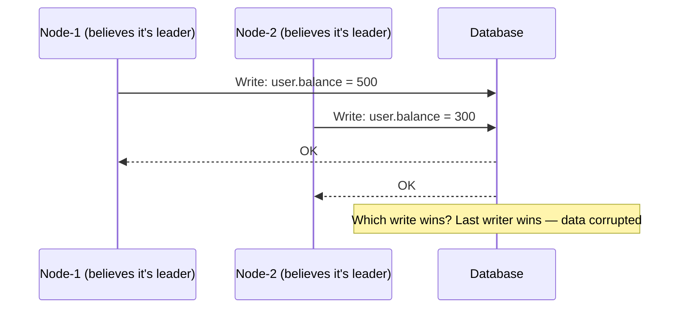
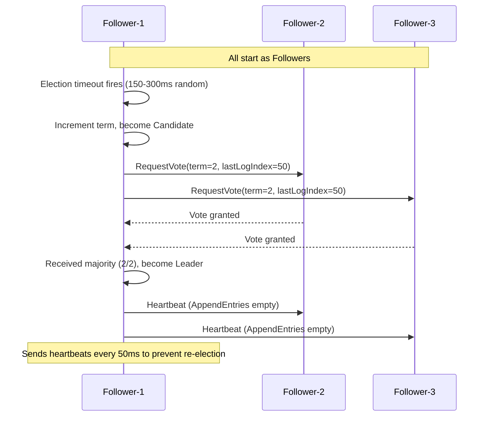
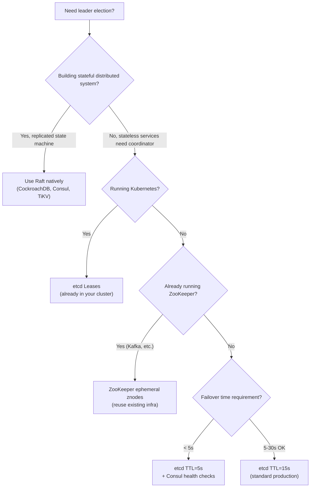

# Leader Election: ZooKeeper, etcd, and Raft-Based Coordination

**Leader election is the distributed systems problem that looks solved — until your "leader" and the new leader are both writing to the database simultaneously because one of them didn't know it was dethroned.**

Split-brain is not a theoretical concern. It has caused data corruption at Google, Cloudflare, and dozens of production systems in 2024 alone.

---

## The Problem Class `[Mid]`

Many distributed systems require a single coordinator: a cron job that must not run twice, a database primary that must have only one writer, a distributed lock manager, a Kafka consumer group coordinator.

Without coordination, two nodes can both believe they're the leader simultaneously:



This happens when:
- Network partition separates Node-1 from the coordination service
- Node-1 assumes its lease is still valid (it doesn't know it expired)
- Node-2 wins a new election in the isolated partition
- Network heals — both nodes were writing as "leader"

The purpose of leader election protocols is to ensure this never happens — or to detect it and fail safely when it does.

---

## Why the Obvious Solution Fails `[Senior]`

### Naive Heartbeat + Timeout

The obvious approach: nodes send heartbeats. First node to stop receiving others' heartbeats declares itself leader.

```python
# Broken naive implementation
class NaiveLeaderElection:
    def __init__(self, node_id, peers):
        self.is_leader = False
        self.last_leader_heartbeat = time.time()

    def check_leadership(self):
        if time.time() - self.last_leader_heartbeat > TIMEOUT:
            # "I haven't heard from the leader, I'll become leader"
            self.is_leader = True  # BROKEN: current leader may still be alive
            self.broadcast_leadership()
```

**Why this is broken:**

1. **GC pause**: Current leader pauses for 30s GC → all nodes promote themselves → split-brain
2. **Network partition**: Leader is alive, just can't reach this node → false promotion
3. **Clock drift**: Nodes with different system clocks disagree on whether timeout has occurred
4. **No fencing**: Even after a new leader is elected, the old leader may continue writing for seconds before realizing it was replaced

---

## The Solution Landscape `[Senior]`

### Solution 1: ZooKeeper Ephemeral Znodes

**What it is**

ZooKeeper stores nodes as "znodes" in a tree structure. Ephemeral znodes are automatically deleted when the client session ends (due to crash or network partition). A node acquires leadership by creating `/election/leader` as an ephemeral znode — only one can exist. Others watch the znode and race to create it when it's deleted.

**How it actually works at depth**

```python
from kazoo.client import KazooClient
from kazoo.exceptions import NodeExistsError

class ZooKeeperLeaderElection:
    def __init__(self, zk_hosts: str, service_name: str, node_id: str):
        self.zk = KazooClient(hosts=zk_hosts)
        self.leader_path = f"/services/{service_name}/leader"
        self.node_id = node_id
        self.is_leader = False
        self.zk.start()

    def try_become_leader(self):
        try:
            # Attempt to create ephemeral node
            self.zk.create(
                self.leader_path,
                value=self.node_id.encode(),
                ephemeral=True,  # deleted when session ends
                makepath=True
            )
            self.is_leader = True
            self._on_become_leader()

        except NodeExistsError:
            # Another node is leader — watch for changes
            self.is_leader = False
            self.zk.get(self.leader_path, watch=self._on_leader_change)

    def _on_leader_change(self, event):
        # Called when the leader znode is deleted (leader crashed)
        if event.type == 'DELETED':
            # Race to claim leadership
            self.try_become_leader()

    def _on_become_leader(self):
        # Start leader duties
        print(f"Node {self.node_id} is now leader")
        # Critical: leader must check that its session is still valid
        # before doing any leader-only writes

    def safe_leader_action(self, action):
        # Before every leader action, verify session is still valid
        if not self.is_leader:
            raise NotLeaderError()
        session_id, _ = self.zk.client_id
        # Additional check: verify we still own the znode
        data, _ = self.zk.get(self.leader_path)
        if data.decode() != self.node_id:
            self.is_leader = False
            raise NotLeaderError()
        return action()
```

**The election queue pattern (prevents thundering herd):**

```python
# Better: sequential znodes prevent all followers racing simultaneously
# Each node creates /election/candidate-{seq} as ephemeral sequential
# Leader = node with lowest sequence number
# Each non-leader watches the node just before it (not the leader directly)

class ZooKeeperSequentialElection:
    def register_candidate(self):
        # Creates /election/candidate-0000000001 (ephemeral + sequential)
        self.my_path = self.zk.create(
            "/election/candidate-",
            ephemeral=True,
            sequence=True,
            makepath=True
        )
        self._check_leadership()

    def _check_leadership(self):
        children = sorted(self.zk.get_children("/election"))
        if children[0] == self.my_path.split("/")[-1]:
            self._become_leader()
        else:
            # Watch predecessor — not the leader
            idx = children.index(self.my_path.split("/")[-1])
            predecessor = f"/election/{children[idx - 1]}"
            self.zk.get(predecessor, watch=self._on_predecessor_change)

    # Result: only 1 notification per election, not N notifications
```

**Sizing guidance** `[Staff+]`

```
ZooKeeper configuration for production leader election:
  tickTime: 2000ms           (heartbeat interval)
  sessionTimeout: 10000ms    (= 5 × tickTime minimum)

  Election timeout = sessionTimeout = 10s
  Leader failover time: sessionTimeout + candidate race time
                      = 10s + ~100ms = ~10s worst case

Ensemble sizing:
  3 nodes: tolerates 1 failure (majority = 2)
  5 nodes: tolerates 2 failures (majority = 3)
  7 nodes: tolerates 3 failures (rarely needed, adds write latency)

Write latency (znode creation):
  3-node ensemble, same region: ~1-2ms
  3-node ensemble, cross-AZ: ~5-10ms
  5-node ensemble, cross-region: ~50-150ms (not recommended for election)
```

**Configuration decisions that matter** `[Staff+]`

- Session timeout must be > max expected GC pause + network jitter. For JVM services with large heaps: sessionTimeout ≥ 30s
- **Never** use ZooKeeper cross-region for election: cross-region latency (100ms+) makes quorum writes slow and timeouts unreliable
- ZooKeeper 3.7+ includes SASL authentication for znode protection — enable it

**Failure modes** `[Staff+]`

- **Session expiry during GC pause**: JVM service pauses 20s → ZooKeeper deletes ephemeral znode → new leader elected → GC finishes, old leader still writes. Mitigate: use "fencing tokens" — a monotonically increasing number provided by ZooKeeper at each election. Downstream systems reject writes from older tokens.
- **Brain split on ZooKeeper partition**: ZooKeeper loses quorum → no new elections possible → existing leader continues until its session expires. This is intentional: ZooKeeper prefers consistency over availability.
- **Herd effect**: All followers watch the leader node directly. When leader fails, N−1 watches fire simultaneously. Use the sequential znode pattern to avoid this.

---

### Solution 2: etcd Leases

**What it is**

etcd provides distributed key-value storage with leadership via TTL-based leases. A node creates a lease and attaches a key to it. When the lease expires (or node fails to renew), the key is deleted and other nodes can race to create it.

```go
// Go etcd leader election
package main

import (
    clientv3 "go.etcd.io/etcd/client/v3"
    "go.etcd.io/etcd/client/v3/concurrency"
)

func runLeaderElection(client *clientv3.Client, serviceName string) {
    session, _ := concurrency.NewSession(client, concurrency.WithTTL(10))
    defer session.Close()

    election := concurrency.NewElection(session, "/services/"+serviceName+"/leader")

    ctx := context.Background()

    // Blocks until this node becomes leader
    if err := election.Campaign(ctx, nodeID); err != nil {
        log.Fatal(err)
    }

    log.Printf("Node %s is now leader", nodeID)

    // Leader work loop — must check context for resignation
    for {
        select {
        case <-session.Done():
            // Session expired — we are no longer leader
            log.Printf("Lost leadership (session expired)")
            return
        default:
            // Do leader work
            doLeaderWork()
        }
    }
}
```

**How leases actually work:**

```
1. Node creates lease with TTL=10s: leaseID=abc123
2. Node puts key "/leader" → "node-1" with lease abc123
3. Node starts KeepAlive loop: sends heartbeat every TTL/3 = ~3s
4. etcd refreshes lease on each KeepAlive
5. If KeepAlive stops (node crash/network):
   - After TTL=10s, lease expires
   - "/leader" key is deleted
   - Other nodes' watches fire
   - One node wins a new Campaign()
```

**Sizing guidance** `[Staff+]`

```
etcd cluster sizing:
  3 nodes: tolerates 1 failure (standard for production)
  5 nodes: tolerates 2 failures (high availability clusters like Kubernetes)

Lease TTL guidelines:
  Low-latency election (< 15s failover): TTL=10s
  Tolerant election (GC-heavy JVM services): TTL=30s
  KeepAlive interval: TTL/3

etcd write throughput: ~10,000 writes/s (3-node cluster, same region)
Leader election creates ~1 write per KeepAlive interval per node
  100 services, 1 election each: 100/3 = ~33 writes/s (negligible)
  10,000 services: 3,333 writes/s (approaching limits, batch or namespace)
```

**etcd vs ZooKeeper selection** `[Staff+]`

| Factor | ZooKeeper | etcd |
|---|---|---|
| Protocol | ZAB (Zookeeper Atomic Broadcast) | Raft |
| Watch model | One-time watches, re-register | Persistent watches |
| TTL on keys | Session-based only | Per-key TTL |
| Kubernetes native | No | Yes (etcd powers k8s) |
| gRPC API | No (custom) | Yes |
| Ops complexity | Higher | Lower |
| Adoption post-2022 | Declining | Growing |

**2026 recommendation**: Prefer etcd for new systems. ZooKeeper still appropriate when you already operate it (e.g., Kafka clusters) or need its transaction model.

---

### Solution 3: Raft Built-in Leader Election

**What it is**

Raft consensus protocol has leader election as a first-class primitive. Systems built on Raft (CockroachDB, TiKV, Consul, etcd itself) don't need external coordination — leadership is inherent to the protocol.

**How Raft leader election works:**



**Key Raft safety properties:**

1. **Election safety**: At most one leader per term. Two candidates cannot both win because a majority vote cannot be split when each node votes once.
2. **Leader completeness**: New leader must have all committed log entries. A candidate can only win if its log is at least as up-to-date as the majority's.
3. **Log matching**: If two logs have the same entry at the same index, all preceding entries are identical.

**When to build on Raft vs. use external coordination:**

```
Use Raft (CockroachDB, Consul, etcd) when:
  - Building a new stateful distributed system from scratch
  - You want the coordination protocol as part of your data layer
  - Replicated state machine is your primary data model

Use etcd/ZooKeeper when:
  - Existing services need external coordination
  - Services are stateless but need a single active coordinator
  - You don't want consensus logic in your application code
```

---

### Solution 4: Raft vs. Paxos Comparison `[Staff+]`

```
Paxos (1989):
  - Mathematically proven correct
  - Two phases: Prepare/Promise + Accept/Accepted
  - Notoriously difficult to implement correctly
  - Multi-Paxos required for practical use (not in original paper)
  - Used by: Google Chubby, Google Spanner

Raft (2014):
  - Designed for understandability (PhD thesis goal)
  - Leader-based: all writes go through leader
  - Three roles: Leader, Follower, Candidate
  - Log replication is central design
  - Used by: etcd, CockroachDB, TiKV, Consul, InfluxDB

Key differences:
  - Raft separates leader election from log replication (simpler)
  - Paxos more flexible (multi-leader variants possible)
  - Raft randomized election timeout prevents split votes naturally
  - Paxos requires external mechanism to prevent contention

2026 verdict: Raft is the right choice for new implementations.
Nobody should be implementing Paxos from scratch.
```

---

## Trade-off Matrix `[Senior]` → `[Staff+]`

| Dimension | ZooKeeper | etcd Leases | Raft (embedded) |
|---|---|---|---|
| **Failover time** | sessionTimeout (10-30s) | TTL (10-30s) | 150-500ms |
| **Split-brain prevention** | Strong (quorum required) | Strong (quorum required) | Strong (by design) |
| **Ops overhead** | High | Medium | Low (co-located with app) |
| **Fencing token support** | Yes (zxid) | Yes (revision) | Yes (term+index) |
| **Watch efficiency** | Lower (re-register) | Higher (persistent) | N/A (built-in) |
| **Cross-region** | Not recommended | Not recommended | Requires tuning |

---

## Decision Framework `[Senior]` → `[Staff+]`



---

## Production Failure Story `[Staff+]`

**System**: Financial reporting service, single-writer architecture (correctness critical)
**Coordination**: Custom heartbeat-based election (no ZooKeeper/etcd)
**Scale**: 3 nodes, one active leader writing to PostgreSQL at any time

**The incident sequence:**

1. Leader (Node-1) starts a large GC cycle — pauses for 22 seconds
2. Nodes 2 and 3 don't receive heartbeat for 15 seconds (timeout setting)
3. Node-2 declares itself leader and begins writing financial records
4. Node-1 GC completes — it believes it is still leader
5. Both Node-1 and Node-2 write to the same PostgreSQL tables for 7 seconds
6. Node-1 detects duplicate primary key error, panics, stops writing
7. Node-2 continues as sole leader

**Damage assessment:**
- 847 duplicate financial records written to staging tables
- 3 records with incorrect balances (both nodes read-modify-write same account)
- Audit report for regulators required reprocessing of 3 hours of data

**Root cause:**
- No fencing mechanism — old leader could write after being dethroned
- GC pause exceeded election timeout (22s pause vs. 15s timeout)
- No "epoch" or revision number on writes to detect stale leaders

**Remediation:**

1. Migrated to etcd with TTL=30s (> max expected GC pause)
2. Added fencing token: each leader election increments a revision counter; all DB writes include `WHERE epoch = current_epoch` condition — stale leader writes fail silently
3. Increased JVM heap to reduce GC frequency; added G1GC + ZGC tuning to reduce pause time to < 500ms
4. Added alerting: `leadership_transitions_total > 2 per hour` → investigation required

---

## Observability Playbook `[Staff+]`

```yaml
metrics:
  election_health:
    - leadership_changes_total           # counter — alert: > 3/hour
    - current_leader_term                # gauge — should monotonically increase
    - time_since_last_election_seconds   # alert: election too recent = instability
    - election_duration_ms               # histogram — alert: > 5000ms

  session_health:
    - session_renewal_latency_ms         # alert: p99 > TTL/3
    - session_expiry_total               # counter — alert: > 0 per hour

  fencing:
    - stale_leader_write_rejected_total  # counter — alert: > 0 (indicates split-brain was prevented)
    - fencing_token_value                # gauge — should increase, not repeat

dashboards:
  - "Leadership timeline" — which node is leader over time, election events
  - "Session health" — renewal latency vs. TTL threshold
  - "Stale write attempts" — fencing token rejections over time

runbook_triggers:
  frequent_elections: "Check network stability, GC pause duration, CPU saturation"
  stale_write_rejected: "CRITICAL — split-brain occurred, review leader node logs"
  session_expiry_storm: "Multiple nodes losing sessions simultaneously — ZK/etcd overloaded"
```

---

## Architectural Evolution `[Staff+]`

```
Stage 1 (2-3 node cluster, low criticality):
  Database-based election: row with "is_leader=true" + application heartbeat
  Simple, no external dependency, acceptable for non-critical coordinators

Stage 2 (5-20 node cluster, production criticality):
  etcd leases with TTL=15s
  Fencing tokens on all leader-gated writes
  Alerting on election frequency

Stage 3 (50+ nodes, multi-service, Kubernetes):
  Kubernetes leader election (uses etcd, k8s-native API)
  Each service uses client-go/controller-runtime election primitives
  Standardized fencing token pattern across all services

Stage 4 (multi-region, geo-distributed):
  Per-region leaders (avoid cross-region consensus latency)
  Global coordinator for cross-region decisions (accepts higher latency)
  Separate election clusters per region, region-aware routing
  Read: any region | Write: route to local region leader
```

---

## Decision Framework Checklist `[All Levels]`

- [ ] Do I actually need a single leader, or can I use optimistic concurrency / idempotency instead?
- [ ] What is my maximum acceptable failover time? Is my TTL/sessionTimeout set accordingly?
- [ ] Is my TTL/sessionTimeout greater than my maximum expected GC pause + network jitter?
- [ ] Do I have a fencing mechanism — every leader-gated write includes an epoch/revision that rejects stale leaders?
- [ ] Am I monitoring leadership transitions? Frequent transitions indicate infrastructure instability.
- [ ] What happens to in-flight operations when leadership transitions? Do I have a drain period?
- [ ] Is my coordination service (ZooKeeper/etcd) deployed with an odd-numbered quorum (3 or 5)?
- [ ] Are my coordination nodes in separate availability zones?
- [ ] Do I have a runbook for manual leadership failover (e.g., planned maintenance)?
- [ ] Have I tested split-brain recovery by simulating network partitions in staging?

*Written by Gaurav Porwal — 10+ Year Engineer | Tech Lead | Product Owner | Business-Minded Builder*
*Last updated: 2026-03-18*
