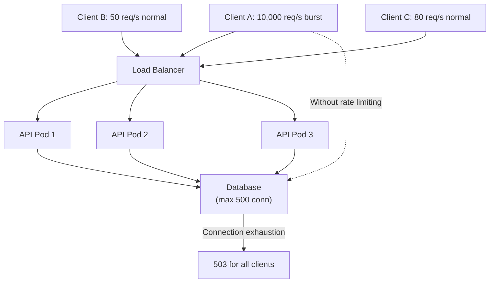
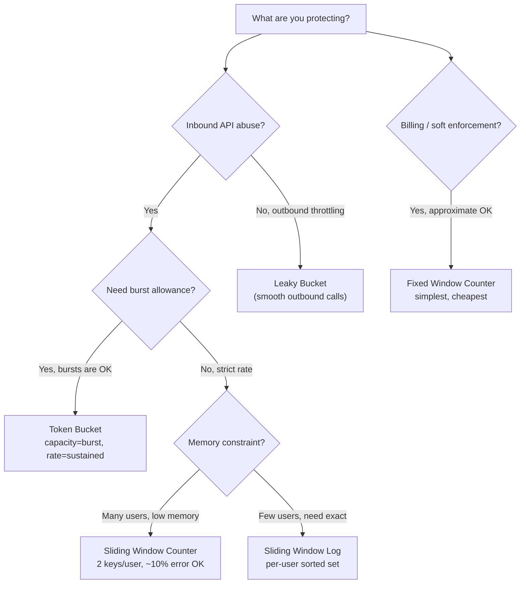

# Rate Limiting Algorithms: Token Bucket, Leaky Bucket, and Sliding Window

**Every rate limiter looks simple until you run it across 50 API pods and discover your "100 req/s per user" limit is actually 5000 req/s because none of the pods are coordinating.**

This article covers every major algorithm, how they behave under burst traffic, and the distributed coordination problem that makes naive implementations wrong at scale.

---

## The Problem Class `[Mid]`

Your public API serves 50,000 tenants. Your SLA guarantees fair access — no single tenant can starve others. Without rate limiting, a single misbehaving client can consume all your database connections, exhaust your thread pool, and degrade service for everyone.



**The naive solution**: add an in-memory counter per pod. Problem: with 50 pods and a 100 req/s limit, Client A can send 100 req/s to each pod = 5,000 req/s total — 50x the intended limit.

The correct solution requires understanding which algorithm matches your traffic contract, then implementing it with the right coordination strategy.

---

## Why the Obvious Solution Fails `[Senior]`

### The Fixed Window Counter Boundary Burst

The simplest implementation: count requests per time window, reset at window boundary.

```python
def allow_request(user_id: str, limit: int, window_seconds: int) -> bool:
    key = f"ratelimit:{user_id}:{int(time.time() / window_seconds)}"
    count = redis.incr(key)
    if count == 1:
        redis.expire(key, window_seconds)
    return count <= limit
```

**The boundary burst problem:**

```
Limit: 100 requests per 60-second window
Window 1: 59:00 → 60:00
Window 2: 60:00 → 61:00

Client sends:
  - 100 requests at 59:59 (end of Window 1) → all allowed ✓
  - 100 requests at 60:01 (start of Window 2) → all allowed ✓

Result: 200 requests in 2 seconds — double the intended rate
This is a 2x burst at every window boundary.
```

This is why fixed window is appropriate only for approximate rate limiting where boundary bursts are acceptable (e.g., billing rate limits, not API abuse prevention).

---

## The Solution Landscape `[Senior]`

### Algorithm 1: Fixed Window Counter

**What it is**: Count requests in discrete time buckets. Reset at bucket boundaries.

**Sizing guidance** `[Staff+]`

```
Memory per user: ~100 bytes (Redis key + counter + TTL)
10,000 users: 1 MB
1,000,000 users: 100 MB (manageable)

Redis ops per request: 2 (INCR + EXPIRE on first request, 1 on subsequent)
Latency added: ~0.5ms at p99 (Redis in same region)
```

**Configuration decisions that matter** `[Staff+]`

- Window size affects boundary burst severity: shorter windows = smaller max burst but more Redis pressure
- Use `INCR` + `EXPIRE` (not `SET NX` + `INCR`) to avoid race condition where key expires between check and write

**Failure modes** `[Staff+]`

- Redis failure: fail-open (allow all) or fail-closed (block all) — document your choice
- Clock skew across pods: window boundaries may differ by up to `max_clock_skew` — use Redis server time (`TIME` command) as the authoritative clock

---

### Algorithm 2: Sliding Window Log

**What it is**: Store a timestamp for every request. Count how many timestamps fall within the last window period.

```python
def allow_request_sliding_log(user_id: str, limit: int, window_seconds: int) -> bool:
    now = time.time()
    key = f"ratelimit:log:{user_id}"
    pipe = redis.pipeline()
    pipe.zremrangebyscore(key, 0, now - window_seconds)  # remove old
    pipe.zadd(key, {str(uuid.uuid4()): now})             # add current
    pipe.zcard(key)                                       # count
    pipe.expire(key, window_seconds)
    results = pipe.execute()
    return results[2] <= limit
```

**Sizing guidance** `[Staff+]`

```
Memory per user = limit × (timestamp_size + member_size)
                ≈ limit × 40 bytes

At limit=100 req/s window=60s: 100 × 40 = 4KB per user
1,000,000 active users: 4GB — problematic

At limit=1000 req/min: 1000 × 40 = 40KB per user
10,000 active users: 400MB — acceptable
100,000 active users: 4GB — edge of acceptable

Rule: Sliding window log is impractical when limit × active_users > 10M entries
```

**Failure modes** `[Staff+]`

- Memory explosion under DDoS: attacker sends requests up to the limit continuously, each user's log grows to `limit` entries. Mitigate with a global memory limit on the Redis sorted set.
- Clock manipulation: if client controls request metadata, don't use client-supplied timestamps

---

### Algorithm 3: Sliding Window Counter (Approximate)

**What it is**: Use two fixed-window counters (current and previous window) and linearly interpolate to approximate the sliding window count. Memory-efficient with accuracy within ~10% of the true sliding window.

```python
def allow_request_sliding_approx(user_id: str, limit: int, window_seconds: int) -> bool:
    now = time.time()
    current_window = int(now / window_seconds)
    prev_window = current_window - 1

    current_key = f"ratelimit:{user_id}:{current_window}"
    prev_key = f"ratelimit:{user_id}:{prev_window}"

    # Time elapsed in current window (0.0 to 1.0)
    elapsed_ratio = (now % window_seconds) / window_seconds

    pipe = redis.pipeline()
    pipe.get(prev_key)
    pipe.incr(current_key)
    pipe.expire(current_key, window_seconds * 2)
    results = pipe.execute()

    prev_count = int(results[0] or 0)
    current_count = results[1]

    # Weighted estimate: prev window's weight decreases as current window progresses
    estimated_count = prev_count * (1 - elapsed_ratio) + current_count
    return estimated_count <= limit
```

**Sizing guidance** `[Staff+]`

```
Memory per user: 2 keys × 100 bytes = 200 bytes
1,000,000 active users: 200 MB — excellent

Accuracy: worst-case error when requests uniformly distributed
  If prev window had exactly `limit` requests, at 50% through current window:
  Weighted prev = limit × 0.5 = limit/2
  Current budget remaining = limit - limit/2 = limit/2
  Actual rate at this moment could be limit × 1.5 (overcount) or limit × 0.5 (undercount)

  Real-world accuracy: within 10-15% of true sliding window for typical traffic patterns
```

This is what **Cloudflare, NGINX, and most production API gateways use** because it's cheap and accurate enough.

---

### Algorithm 4: Token Bucket

**What it is**: A bucket holds tokens (up to capacity). Tokens are added at a refill rate. Each request consumes one token. If no tokens available, request is denied or queued.

```python
class TokenBucket:
    def __init__(self, capacity: int, refill_rate: float):
        # refill_rate = tokens per second
        self.capacity = capacity
        self.refill_rate = refill_rate

    def allow_request(self, user_id: str) -> bool:
        key = f"token_bucket:{user_id}"
        now = time.time()

        # Lua script for atomic check-and-update
        lua_script = """
        local tokens_key = KEYS[1]
        local last_refill_key = KEYS[2]
        local capacity = tonumber(ARGV[1])
        local refill_rate = tonumber(ARGV[2])
        local now = tonumber(ARGV[3])

        local last_refill = tonumber(redis.call('get', last_refill_key)) or now
        local current_tokens = tonumber(redis.call('get', tokens_key)) or capacity

        -- Calculate tokens to add since last refill
        local elapsed = now - last_refill
        local new_tokens = math.min(capacity, current_tokens + elapsed * refill_rate)

        if new_tokens >= 1 then
            redis.call('set', tokens_key, new_tokens - 1)
            redis.call('set', last_refill_key, now)
            redis.call('expire', tokens_key, 3600)
            redis.call('expire', last_refill_key, 3600)
            return 1  -- allowed
        else
            return 0  -- denied
        end
        """
        result = redis.eval(lua_script, 2,
                           f"{key}:tokens", f"{key}:last_refill",
                           self.capacity, self.refill_rate, now)
        return result == 1
```

**Sizing guidance** `[Staff+]`

```
Parameters:
  capacity  = maximum burst size (tokens)
  refill_rate = sustained rate (tokens/second)

Examples:
  API: 100 req/s sustained, allow burst of 200:
    capacity=200, refill_rate=100

  Payment API: 10 req/s sustained, no burst:
    capacity=10, refill_rate=10
    (capacity = refill_rate × 1s = no burst benefit)

  Background job: 1000 req/s, burst up to 5000:
    capacity=5000, refill_rate=1000

  Rule: capacity / refill_rate = burst duration in seconds
  A capacity of 10× the refill_rate means 10 seconds of burst headroom
```

**Failure modes** `[Staff+]`

- **Burst amplification on recovery**: After an outage, if all users had their buckets refill to capacity, they all burst simultaneously when service recovers. Mitigate by capping token accumulation to a small window (e.g., max 5s of tokens, not 3600s worth)
- **Time drift**: If Redis returns slightly different timestamps, refill calculations diverge. Use `ARGV[3]` as the caller-provided timestamp (consistent within a request), not `TIME` called inside Lua.

---

### Algorithm 5: Leaky Bucket

**What it is**: Requests flow in at any rate but flow out (are processed) at a constant rate. The "bucket" is a queue. If the queue is full, new requests are dropped.

```
Incoming traffic (variable) → [QUEUE capacity=N] → Processing (constant rate R)

Result: perfectly smooth output regardless of input burst
```

**When to use it vs. token bucket:**

| Property | Token Bucket | Leaky Bucket |
|---|---|---|
| Output rate | Variable (up to burst) | Constant |
| Burst handling | Allows burst | Smooths burst |
| Use case | API rate limiting | Traffic shaping, QoS |
| Client behavior | Gets quick response (allow/deny) | Request queued, delayed response |

Leaky bucket is what you use for **outbound traffic shaping** (e.g., throttling your own calls to a third-party API), not for protecting your own API from inbound abuse.

---

## Distributed Rate Limiting `[Staff+]`

### The Multi-Pod Problem

With 50 API pods and per-pod counters, each user gets 50× their intended limit. Three coordination strategies:

**Strategy 1: Central Redis (Recommended for most cases)**

```
Pros: Accurate, simple, widely supported
Cons: Redis is now a dependency; adds ~0.5–2ms per request
Failure mode: Redis down → fail-open or fail-closed (choose)

Sizing:
  50,000 users × 100 req/s = 5M rate limit checks/s
  Redis throughput: ~1M commands/s single node
  Redis Cluster: ~10M commands/s across 10 nodes
  → Redis Cluster required at this scale
```

**Strategy 2: Sticky Sessions / IP Affinity**

Route each user to the same pod. Per-pod counters are accurate because each user only touches one pod.

```
Pros: No Redis overhead, simpler
Cons:
  - Uneven load distribution (power users → one pod overwhelmed)
  - Pod failure → user's session lost, counter lost
  - Auto-scaling doesn't distribute existing sessions

Use when:
  - Session-based rate limiting where you already have sticky sessions
  - Small pod counts (< 10) with uniform users
```

**Strategy 3: Gossip / Eventual Consistency**

Pods periodically synchronize counters via gossip protocol. Tolerate temporary overage.

```python
# Each pod maintains local counter + syncs to Redis every sync_interval
class DistributedRateLimiter:
    def __init__(self, limit_per_window, sync_interval=1.0, pod_count=50):
        self.local_limit = limit_per_window / pod_count  # conservative local limit
        self.global_limit = limit_per_window
        self.local_counters = {}
        self.sync_interval = sync_interval

    def allow_request(self, user_id: str) -> bool:
        # Fast path: check local counter (no network call)
        local_count = self.local_counters.get(user_id, 0)
        if local_count >= self.local_limit:
            # Slow path: check global counter in Redis
            return self._check_global(user_id)
        self.local_counters[user_id] = local_count + 1
        return True

    def _sync_to_redis(self):
        # Background task: sync local counters to Redis every sync_interval
        for user_id, count in self.local_counters.items():
            redis.incrby(f"global:{user_id}", count)
        self.local_counters.clear()
```

```
Pros: Low latency (local check), Redis not on critical path
Cons: Temporary overage up to (pod_count × sync_interval × request_rate)
      With 50 pods, 1s sync interval, 100 req/s: up to 5000 req/s overage possible

Use when:
  - You can tolerate ~10% overage
  - Redis latency is unacceptable (< 1ms SLO)
  - Background rate limit (billing, not abuse prevention)
```

---

## Trade-off Matrix `[Senior]` → `[Staff+]`

| Algorithm | Accuracy | Memory | Burst Handling | Redis Ops/Req | Implementation |
|---|---|---|---|---|---|
| Fixed Window | Low (boundary burst 2×) | O(1) | Allows 2× at boundary | 1-2 | Trivial |
| Sliding Log | High (exact) | O(limit) | Smooth | 3-4 | Low |
| Sliding Counter | Medium (~10% err) | O(1) | Smooth | 3-4 | Low |
| Token Bucket | High | O(1) | Configurable burst | 1 (Lua) | Medium |
| Leaky Bucket | High (output) | O(queue) | Smooths to constant | N/A | Medium |

---

## Decision Framework `[Senior]` → `[Staff+]`



---

## Production Failure Story `[Staff+]`

**Scenario**: SaaS API platform, rate limit 1000 req/min per tenant, 30 API pods

**What was implemented**: Fixed window counter in Redis, 60-second window

**The incident**: A large enterprise customer ran a bulk export job at 2 AM. The job was designed to respect rate limits — it checked the remaining count before each request. But the check-then-act was not atomic:

```
Thread 1: GET counter → 999 (under limit)
Thread 2: GET counter → 999 (under limit)
Thread 1: INCR counter → 1000 (at limit, proceeds)
Thread 2: INCR counter → 1001 (over limit, but already decided to proceed)
```

At 200 concurrent threads, the window counter reached 1,800+ before any thread saw a "deny" response. This caused a downstream database query storm: 1,800 heavy analytical queries in 60 seconds.

**Fixes applied:**

1. Replaced GET + INCR with Lua-scripted atomic compare-and-increment:
   ```lua
   local count = redis.call('incr', KEYS[1])
   if count == 1 then redis.call('expire', KEYS[1], ARGV[1]) end
   if count > tonumber(ARGV[2]) then return 0 end
   return 1
   ```

2. Switched to token bucket for this customer's tier — they had a legitimate burst need that was being handled with race conditions instead of designed burst allowance

3. Added rate limit headers (`X-RateLimit-Remaining`, `X-RateLimit-Reset`) so client could throttle itself gracefully

**Lesson**: Rate limiting decisions must be atomic. Any two-step read-then-write approach without Lua or Redis transactions is broken under concurrency.

---

## Observability Playbook `[Staff+]`

```yaml
metrics:
  per_algorithm:
    - rate_limit_allowed_total{user_id, tier}     # counter
    - rate_limit_denied_total{user_id, tier}       # counter — alert: spike
    - rate_limit_check_latency_p99{algorithm}      # alert: > 5ms
    - rate_limit_redis_errors_total                # alert: > 0

  business:
    - rate_limit_denial_rate_by_tier               # % of requests denied per tier
    - top_10_rate_limited_users                    # identify abusers vs. legit burst

  distributed:
    - rate_limit_local_vs_global_ratio             # how often local check suffices
    - rate_limit_sync_lag_seconds                  # gossip sync delay

dashboards:
  - "Rate limit denial rate" — per tier, per time window
  - "Top 10 most-denied users" — identify abuse vs. under-provisioned tiers
  - "Redis latency for rate limit checks" — p50/p95/p99

headers_to_return:
  X-RateLimit-Limit: 1000
  X-RateLimit-Remaining: 247
  X-RateLimit-Reset: 1711372800  # Unix timestamp of next window
  Retry-After: 45                # seconds until retry (on 429)
```

---

## Architectural Evolution `[Staff+]`

```
Stage 1 (< 100k req/s, single region):
  Sliding window counter, central Redis
  Simple, accurate enough, easy to operate

Stage 2 (1M+ req/s, multiple pods):
  Token bucket via Lua in Redis Cluster
  Per-tier configuration (free/pro/enterprise capacity ratios)
  Automatic client-side retry with exponential backoff

Stage 3 (100M+ req/s, multi-region):
  Local token bucket per pod (no Redis on critical path)
  Background sync to Redis for global accounting
  Tolerate ±10% overage in exchange for <0.1ms latency
  Per-region limits with global quota enforcement on sync

Stage 4 (platform-level, multi-tenant SaaS):
  Hierarchical rate limits: user → org → tier → global
  Rate limit policies in configuration (not hardcoded)
  Real-time quota dashboard for customers
  Webhook notifications when customers approach limits
```

---

## Decision Framework Checklist `[All Levels]`

- [ ] Is my rate limit check atomic? (No split GET + INCR)
- [ ] What happens when Redis is unavailable — fail-open or fail-closed? Is this documented?
- [ ] Have I sized the burst capacity separately from the sustained rate?
- [ ] With N pods, is my per-pod limit correctly accounting for the cluster size?
- [ ] Am I returning `Retry-After` and `X-RateLimit-*` headers so clients can self-throttle?
- [ ] Does my algorithm allow boundary bursts (fixed window)? Is that acceptable for my use case?
- [ ] Have I stress-tested the rate limiter at 10× expected peak to verify it holds?
- [ ] Do I have different rate limit tiers for different customer plans?
- [ ] Is there a way for legitimate burst users to request temporary limit increases?
- [ ] Am I monitoring denial rates per user — not just aggregate — to distinguish abuse from under-provisioned customers?

*Written by Gaurav Porwal — 10+ Year Engineer | Tech Lead | Product Owner | Business-Minded Builder*
*Last updated: 2026-03-18*
