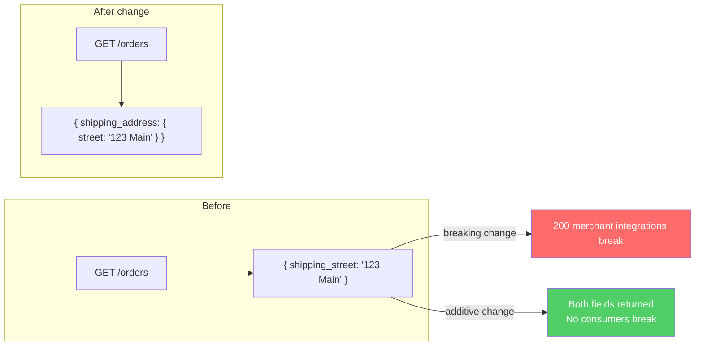
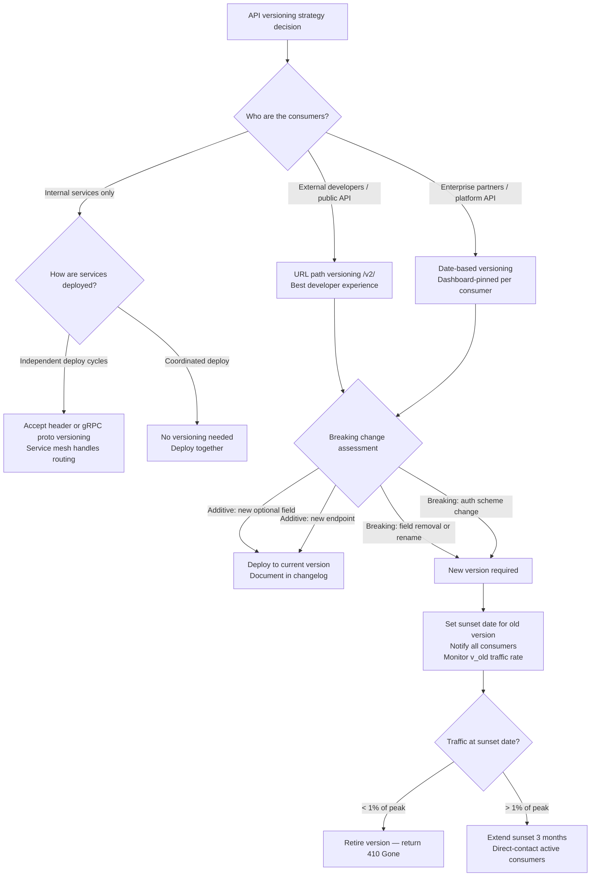

# API Versioning: URL, Header, and Content-Type Negotiation at Scale

**Every public API eventually breaks its consumers. The question is whether you break them on purpose, with warning, or by accident.** API versioning is not about avoiding breaking changes — it's about making them predictable, discoverable, and survivable. The strategy you choose determines whether your platform team spends its time building features or fielding angry partner calls.

---

## The Problem Class `[Mid]`

You have an API with external consumers: mobile apps, third-party integrations, partner systems. You need to change a response field from `string` to an object, rename an endpoint, or remove a deprecated feature. Without a versioning strategy, any change is a breaking change for any consumer.

**Scenario:** Payment API with 200 merchant integrations. Need to change `/orders` response to add nested `shipping_address` object (was a flat `shipping_street`, `shipping_city`, `shipping_zip`).



**The versioning tension:**

- Too aggressive versioning: Multiple live versions create maintenance overhead — you operate v1, v2, v3 simultaneously, tripling infrastructure and bug fix surface area.
- Too conservative versioning: You never add a version, accumulate breaking changes, then do a "big bang" v2 that consumers have no path to adopt.
- No versioning: Every change risks breaking consumers; you cannot evolve the API.

---

## Why the Obvious Solution Fails `[Senior]`

**"Just bump the URL to /v2/"** — the instinct is sound, but the execution fails in three ways:

**Failure 1: The definition of "breaking change" is contested.** Teams often ship breaking changes as minor releases because "it's just a field rename." Mobile SDK v3.1.2 deployed to 4 million devices breaks silently. The field name change that seemed additive was actually breaking because the consumer used the field in a switch statement.

**Failure 2: Multiple live versions create a maintenance trap.** When v2 is live and v3 is coming, every bug fix must be applied to v1, v2, and v3. Security patches require triple review. Teams under-resource version maintenance, causing v1 security vulnerabilities to go unfixed because "everyone should migrate to v2."

**Failure 3: Version negotiation via URL couples routing to business logic.** When you add URL versioning (`/v1/`, `/v2/`), route handlers diverge. The v1 handler handles v1 business logic, v2 handles v2 logic. In practice, teams copy-paste handlers and diverge them silently — now you have two code paths with different bugs.

**"Just use a custom X-API-Version header"** — fails in a different way: CDNs and proxies cache responses without awareness of request headers by default. A CDN may serve a v1 response to a v2 request or vice versa, causing subtle data corruption. Header-based versioning requires explicit `Vary: X-API-Version` cache headers, and many CDN configurations do not honor `Vary` on custom headers.

---

## The Solution Landscape `[Senior]`

### Solution 1: URL Path Versioning

**What it is**

The version is part of the URL path: `/v1/orders`, `/v2/orders`.

**How it actually works at depth**

```
# Request
GET /v2/orders?merchant_id=m123 HTTP/1.1
Host: api.payments.com

# Response
HTTP/1.1 200 OK
Content-Type: application/json

{
  "orders": [
    {
      "id": "ord_abc",
      "shipping_address": {
        "street": "123 Main St",
        "city": "Austin",
        "zip": "78701"
      }
    }
  ]
}
```

The version prefix is resolved at the API gateway or router layer. Gateway routes `/v1/*` to v1 handlers and `/v2/*` to v2 handlers — or to the same handler with a version context injected.

**Implementation patterns:**

Option A — Separate handlers (simple, diverges over time):
```javascript
// Separate route files per version — diverges rapidly
app.use('/v1', require('./routes/v1'));
app.use('/v2', require('./routes/v2'));
```

Option B — Version context injection (recommended):
```javascript
// Single handler with version-aware transformation layer
app.use('/v:version', (req, res, next) => {
  req.apiVersion = parseInt(req.params.version);
  next();
});

app.get('/v:version/orders', ordersHandler);

// Handler applies version-specific transformations
function ordersHandler(req, res) {
  const orders = fetchOrders(req.query);

  if (req.apiVersion <= 1) {
    // v1 response shape: flat shipping fields
    return res.json(orders.map(toV1Shape));
  }
  // v2+ response shape: nested shipping_address
  return res.json(orders.map(toV2Shape));
}
```

Option C — Presentation layer (cleanest for large APIs):
```javascript
// Shared business logic, version-specific serializers
class OrderSerializer {
  static forVersion(version) {
    return version <= 1 ? new OrderSerializerV1() : new OrderSerializerV2();
  }
}
```

**Sizing guidance** `[Staff+]`

```
URL versioning operational cost:
  Active versions: 2–3 (sweet spot), > 4 becomes unmanageable
  Maintenance overhead per additional version: ~15% of feature dev time
  Average consumer migration time: 3–18 months (set your sunset timeline accordingly)

Recommended sunset SLA:
  Internal APIs:     3 months notice
  External partners: 12 months notice (contractual)
  Public APIs:       18–24 months notice (regulatory risk if shorter)
  Mobile SDKs:       24 months (forced app updates impossible to mandate)
```

**Configuration decisions that matter** `[Staff+]`

- **Version in subdomain vs path:** `api.example.com/v2/` vs `v2.api.example.com`. Path versioning is simpler (single TLS certificate, single DNS entry). Subdomain versioning allows routing to entirely separate infrastructure — useful when v2 is a complete rewrite with different backend services. Default to path versioning; use subdomain only for full rewrites.
- **Default version behavior:** When a client hits `/orders` without a version prefix, what happens? Option 1: 400 Bad Request (safest, forces explicit version choice). Option 2: Redirect to latest version (dangerous — consumers silently upgrade). Option 3: Route to oldest supported version (conservative). Recommendation: Return 400 with `Link` header pointing to the versioned endpoint.
- **Gateway-level version routing:** In Kong/Envoy/AWS API Gateway, version routing should be a gateway concern, not an application concern. The application receives requests without the `/v2` prefix. This decouples deployment: you can route v1 traffic to old instances and v2 to new instances during blue/green deployment.

**Failure modes** `[Staff+]`

| Failure | Root cause | Mitigation |
|---|---|---|
| v1 security bug unfixed for 8 months | Team deprioritizes old version | Enforce sunset dates contractually; automate security patch propagation |
| Consumer hard-coded v1, won't migrate | No sunset enforcement | Sunset headers, traffic throttling, eventually 410 Gone response |
| Copy-paste divergence between v1 and v2 handlers | No shared business logic layer | Mandate presentation-layer pattern; business logic never versioned |
| CDN serves stale versioned response | Missing Vary header or CDN bypass | Verify CDN configuration includes path in cache key |

**Observability** `[Staff+]`

```
Metrics per version:
  api_requests_total{version="v1", endpoint="/orders", status=200}
  api_requests_total{version="v2", endpoint="/orders", status=200}

Deprecation funnel:
  v1_active_consumer_count — track weekly; alert if not declining post-sunset-announcement
  v1_request_rate — should approach zero by sunset date

Alert: v1_request_rate > 0 within 30 days of sunset date → escalate to consumer
```

---

### Solution 2: Accept Header Versioning (Content Negotiation)

**What it is**

Version is expressed in the `Accept` header using MIME type negotiation: `Accept: application/vnd.payments.v2+json`.

**How it actually works at depth**

```
GET /orders HTTP/1.1
Host: api.payments.com
Accept: application/vnd.payments.v2+json
Authorization: Bearer token123

HTTP/1.1 200 OK
Content-Type: application/vnd.payments.v2+json
Vary: Accept
```

This follows HTTP's content negotiation RFC 7231 correctly. The URL represents the resource; the `Accept` header negotiates the representation. Semantically, this is the most correct approach.

**Sizing guidance** `[Staff+]`

```
Operational reality check:
  Correct: URLs are stable, resource identity doesn't change with version
  Painful: Debugging requires inspecting request headers (not visible in browser URL bar)
  Painful: Client library support varies — some HTTP clients don't expose custom Accept headers easily
  Painful: API testing tools (Postman collections, curl one-liners) require extra configuration

Adoption rate in industry:
  GitHub uses both: /v3/ URL path AND Accept: application/vnd.github.v3+json
  Stripe: URL path versioning
  Twilio: URL path versioning
  Recommendation: URL path for consumer APIs (developer experience wins)
                  Accept header for machine-to-machine APIs between teams
```

**Failure modes** `[Staff+]`

| Failure | Root cause | Mitigation |
|---|---|---|
| CDN caches wrong version | `Vary: Accept` not set or CDN ignores it | Test CDN behavior explicitly; use surrogate keys |
| Browser fetch omits Accept header | Default `Accept: */*` matches wrong version | Handle `*/*` explicitly; document default version behavior |
| Log analysis harder | Version not in URL, must parse header | Middleware: copy version to `X-API-Version-Resolved` response header for logging |

---

### Solution 3: Query Parameter Versioning

**What it is**

Version as a query parameter: `/orders?api_version=2026-01-01` (date-based, Stripe style) or `/orders?v=2`.

**How it actually works at depth**

Stripe uses date-based versioning: `Stripe-Version: 2024-06-20`. Each date represents a set of API behaviors. When a merchant sets their API version in the dashboard, all requests are processed against that version's behavior — regardless of new features shipped after that date. New merchants get the latest date. Existing merchants stay pinned until they explicitly upgrade.

This is subtle and powerful: **Stripe's versioning is a behavior snapshot, not a code path**. Feature flags and transformation layers implement the snapshot behavior. The same codebase handles all versions; version-specific behavior is gated.

```javascript
// Stripe-style: version determines behavior flags
const versionBehaviors = {
  '2024-01-01': { useNewShippingFormat: false, requireIdempotencyKey: false },
  '2024-06-20': { useNewShippingFormat: true,  requireIdempotencyKey: false },
  '2025-01-01': { useNewShippingFormat: true,  requireIdempotencyKey: true  },
};

function getVersionBehavior(requestVersion) {
  // Find latest version <= requestVersion
  const versions = Object.keys(versionBehaviors).sort();
  const effectiveVersion = versions.filter(v => v <= requestVersion).pop();
  return versionBehaviors[effectiveVersion];
}
```

**Sizing guidance** `[Staff+]`

```
Date-based versioning operational model:
  Version records: one per breaking change (maybe 5–15 per year)
  Behavior flags: grow over time — prune when all consumers on newer version
  Consumer pinning: dashboard-controlled, auditable

  Migration forcing:
    New endpoint = new date version required
    Security fix = force bump even pinned consumers (announce in advance)
    Breaking security change = 0-day force bump (rare, inform immediately)
```

---

## Trade-off Matrix `[Senior]` → `[Staff+]`

| Dimension | URL Path `/v2/` | Accept Header | Query Param | Date-based (Stripe) |
|---|---|---|---|---|
| Developer experience | Excellent (visible in URL) | Poor (hidden in header) | Good | Excellent |
| CDN cacheability | Excellent | Requires `Vary: Accept` | Excellent | Excellent |
| Semantic correctness | Low (URL = version) | High (URL = resource) | Low | Medium |
| Debugging ease | Excellent | Poor | Good | Good |
| Consumer pinning | Manual (client updates URL) | Manual | Manual | Dashboard-controlled |
| Version proliferation risk | High | High | High | Low (date vs int) |
| Adoptability for consumer devs | Excellent | Poor | Good | Medium |
| Recommended for: | Public APIs | Internal service mesh | Simple tools/CLIs | Platform APIs with many consumers |

---

## Decision Framework `[Senior]` → `[Staff+]`



---

## Production Failure Story `[Staff+]`

**The "additive" change that broke 40 enterprise integrations:**

A payments API team added a new field `metadata` to the order object response. The field was optional and empty by default — clearly additive. They did not bump the API version. Within 48 hours, 40 enterprise integrations filed support tickets.

**Root cause:** Enterprise partners were using strictly-typed JSON deserialization (Java `ObjectMapper` with `FAIL_ON_UNKNOWN_PROPERTIES = true`, Go `json.Decoder` with `DisallowUnknownFields()`). The "additive" new field caused deserialization failures in strongly-typed clients configured for strict mode.

**The non-obvious lesson:** "Additive" is consumer-defined, not producer-defined. A field addition is additive only if all consumers use permissive deserialization. In practice, many enterprise integrations use strict mode for correctness. The safest categorization:

```
Safe additive changes (no version bump needed):
  + New optional request parameter with documented default
  + New HTTP 2xx status code for a new endpoint
  + New optional response field (with communication to partners about strict mode risk)

Breaking changes (version bump required):
  - Remove or rename any response field
  - Change field type (string → number, object → array)
  - Remove enum value from documented enum
  - Change authentication mechanism
  - Change error response shape
  - New required request parameter
  - Change in idempotency semantics
```

**Resolution:** Added `X-API-Strict-Mode: false` header option, allowing consumers to opt into strict deserialization validation server-side and receive 400 errors instead of silent data changes. Version bump for the next breaking change, with a formal breaking change policy published in developer docs.

---

## Observability Playbook `[Staff+]`

```
Version lifecycle metrics:

1. Traffic by version (weekly report to deprecation committee)
   api_version_traffic_percentage{version="v1"} < 5% → schedule retirement
   api_version_traffic_percentage{version="v1"} == 0% → safe to decommission

2. Consumer count by version
   api_version_unique_consumers{version="v1"} → decreasing trend required

3. Error rate by version
   api_errors_total{version="v1"} p99 → old versions accumulate unfixed bugs

4. Sunset header delivery
   api_sunset_header_delivered_total{version="v1"} → verify all requests receive Sunset header

Sunset header format (RFC 8594):
  Sunset: Sat, 01 Jan 2027 00:00:00 GMT
  Deprecation: Mon, 01 Jan 2026 00:00:00 GMT
  Link: <https://developer.payments.com/migration/v2>; rel="successor-version"
```

---

## Architectural Evolution `[Staff+]`

**2026 tooling perspective:**

- **OpenAPI / Swagger 3.1:** Version metadata embedded in the spec. Tools like `oasdiff` perform automated breaking change detection between spec versions. Integrate into CI: `oasdiff breaking api-v1.yaml api-v2.yaml` fails the PR if undocumented breaking changes are detected.
- **Buf (protobuf):** `buf breaking --against .git#branch=main` detects proto breaking changes in CI. Essential for gRPC API versioning — enforces proto evolution rules (never reuse field numbers, never change field types).
- **Zuplo / Apigee / Kong:** API gateway versioning with policy-based routing. Version routing as config, not code. Traffic splitting between versions for gradual consumer migration.
- **Stainless / Speakeasy:** SDK generation from OpenAPI. When you version the API, regenerate the SDK automatically. Consumer SDKs hide versioning complexity — consumers upgrade the SDK package, not the API URL.
- **Microcks:** Contract testing for API versioning. Generates mock servers from OpenAPI specs; consumer contract tests run against the mock. Breaking change = failing consumer test before deployment.

**The evolution trajectory:**
```
Phase 1 (MVP):         URL versioning, manual process
Phase 2 (Growth):      Automated breaking change detection in CI (oasdiff/buf)
Phase 3 (Scale):       Gateway-managed routing, SDK generation, consumer dashboards
Phase 4 (Platform):    Date-based versioning, per-consumer pinning, automated sunset enforcement
```

---

## Decision Framework Checklist `[All Levels]`

- [ ] Have I defined what constitutes a breaking change for my API (formal policy)?
- [ ] Is breaking change detection automated in CI (oasdiff, buf breaking, consumer contract tests)?
- [ ] Have I published a sunset SLA (minimum months notice before version retirement)?
- [ ] Are `Sunset` and `Deprecation` headers returned on all deprecated version responses?
- [ ] Is version traffic monitored with automated alerts when sunset deadline approaches?
- [ ] Is the maximum number of simultaneous active versions bounded (e.g., max 3)?
- [ ] Are all consumers notified by email/Slack/dashboard when a version enters deprecation?
- [ ] Does the gateway handle version routing (not application code)?
- [ ] Have I validated CDN behavior with versioned endpoints — correct cache key includes version?
- [ ] Is version visible in my observability stack (logs, traces, metrics) for every request?

*Written by Gaurav Porwal — 10+ Year Engineer | Tech Lead | Product Owner | Business-Minded Builder*
*Last updated: 2026-03-18*
