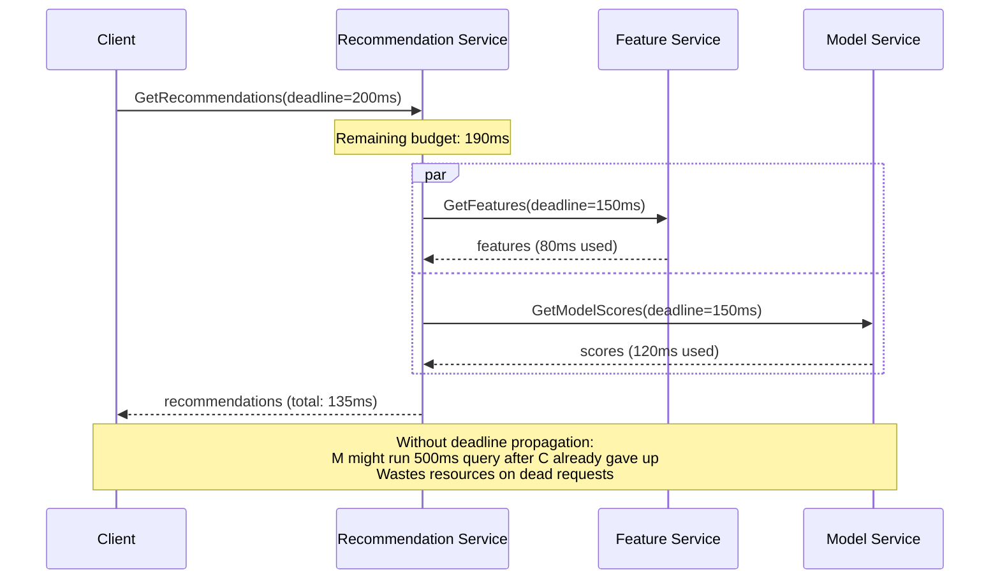
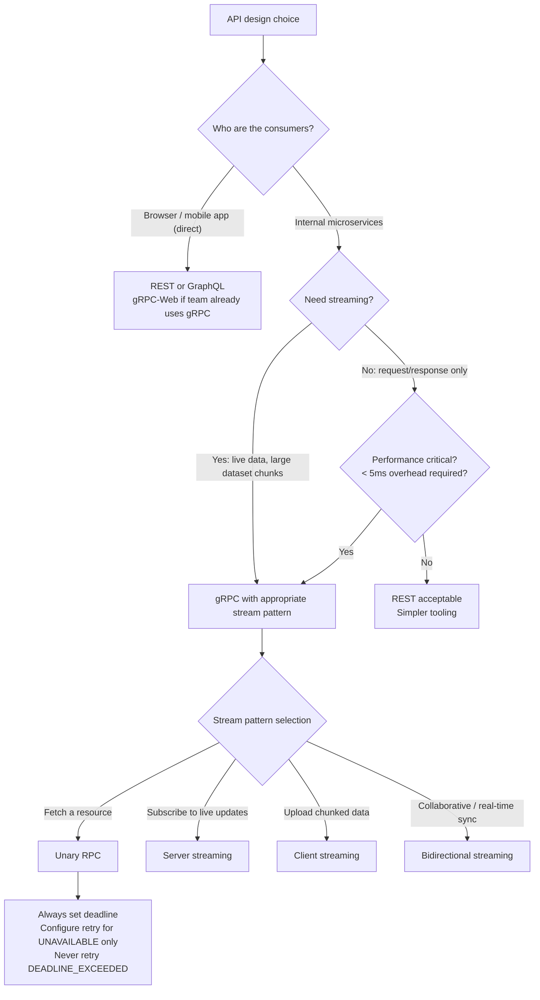

# gRPC Design: Streaming, Deadlines, Retry, and Schema Evolution

**REST APIs use timeouts. gRPC uses deadlines. This distinction is not semantic — it's architectural.** A REST timeout is local to a single connection. A gRPC deadline propagates through the entire call chain: client sets a 500ms deadline, service A receives it and passes the remaining time to service B, which passes what remains to service C. Every service in the chain knows how much time the original caller has left. This eliminates the silent timeout amplification that makes microservice latency debugging so difficult in REST systems.

---

## The Problem Class `[Mid]`

Your microservices communicate internally. You need strongly-typed contracts, efficient serialization, streaming support, and deadline-aware calls. REST/JSON works but is slow to serialize, has no built-in streaming, and cannot propagate context like remaining deadline automatically.

**Scenario:** Recommendation engine. Three services: client → recommendation-service → feature-service + model-service. Client has a 200ms budget. Without deadline propagation, downstream services don't know this budget and may run expensive queries for 500ms — wasting work on a call that's already timed out.



> 💡 **What this means in practice:** gRPC passes the deadline through every hop automatically using HTTP/2 headers. If the client's 200ms window expires, every in-progress downstream gRPC call in that chain receives a `DEADLINE_EXCEEDED` status and cancels immediately — freeing resources rather than completing work no one will receive.

---

## Why the Obvious Solution Fails `[Senior]`

**"Just add timeouts to each REST call"** fails because each service sets its own timeout independently. Service A waits 2 seconds for B. Service B waits 2 seconds for C. The client's 200ms budget is meaningless — the call chain can take 4+ seconds while each hop "correctly" times out. The client got a timeout at 200ms but backend services ran 4 seconds of compute.

**"gRPC is just for Google-scale problems"** misses that gRPC's value is correctness, not just performance. Protobuf schemas enforce API contracts at compile time — a field rename is a compile error, not a runtime data corruption. REST JSON lets you ship a breaking change to production and discover it from error logs.

**"Protobuf schemas are too rigid"** — the opposite is true when used correctly. Proto's field-numbering system allows additive evolution (add fields, don't remove) with backward and forward compatibility. The constraint is a feature: it forces you to evolve schemas deliberately.

---

## The Solution Landscape `[Senior]`

### Solution 1: The Four Communication Patterns

**What it is**

gRPC supports four interaction patterns in a single framework: unary RPC, server streaming, client streaming, and bidirectional streaming. Proto defines which pattern each method uses.

**How it actually works at depth**

```protobuf
// order.proto — all four patterns in one service definition

syntax = "proto3";
package order.v1;

service OrderService {
  // Pattern 1: Unary — one request, one response (REST equivalent)
  rpc GetOrder(GetOrderRequest) returns (GetOrderResponse);

  // Pattern 2: Server streaming — one request, stream of responses
  // Use case: stream order history events as they load, subscribe to live updates
  rpc WatchOrderUpdates(WatchOrderRequest) returns (stream OrderEvent);

  // Pattern 3: Client streaming — stream of requests, one response
  // Use case: batch upload order items, then get a single summary
  rpc BulkCreateOrderItems(stream CreateOrderItemRequest) returns (BulkCreateResponse);

  // Pattern 4: Bidirectional streaming — stream in both directions
  // Use case: live order tracking with client sending location updates
  rpc TrackDelivery(stream DeliveryUpdate) returns (stream OrderStatus);
}

message GetOrderRequest {
  string order_id = 1;
}

message GetOrderResponse {
  Order order = 1;
}

message Order {
  string id = 1;
  string customer_id = 2;
  OrderStatus status = 3;
  repeated OrderItem items = 4;
  google.protobuf.Timestamp created_at = 5;
  // Field 6 reserved for future use — never reuse field numbers
}

enum OrderStatus {
  ORDER_STATUS_UNSPECIFIED = 0;  // Always add unspecified at 0
  ORDER_STATUS_PENDING = 1;
  ORDER_STATUS_CONFIRMED = 2;
  ORDER_STATUS_SHIPPED = 3;
  ORDER_STATUS_DELIVERED = 4;
}
```

Server streaming implementation:

```javascript
// Node.js gRPC server: server streaming
orderService.WatchOrderUpdates = (call) => {
  const { orderId } = call.request;

  // Subscribe to order events
  const unsubscribe = eventBus.subscribe(`order:${orderId}`, (event) => {
    if (call.cancelled || call.writableEnded) {
      unsubscribe();
      return;
    }
    call.write({ eventType: event.type, payload: event.payload });
  });

  // Stream historical events first
  db.getOrderHistory(orderId).then(events => {
    events.forEach(event => call.write({ eventType: event.type, payload: event }));
  });

  call.on('cancelled', () => {
    unsubscribe();
  });

  call.on('error', () => {
    unsubscribe();
  });
};

// Client: consuming server stream
const call = orderClient.WatchOrderUpdates({ orderId: 'ord_123' });

call.on('data', (orderEvent) => {
  console.log('Order update:', orderEvent);
  updateOrderUI(orderEvent);
});

call.on('end', () => {
  console.log('Order stream ended');
});

call.on('error', (err) => {
  if (err.code === grpc.status.CANCELLED) {
    // Client cancelled the stream — normal
  } else {
    console.error('Stream error:', err);
  }
});

// Cancel the stream when user navigates away
function cleanup() { call.cancel(); }
```

**Sizing guidance** `[Staff+]`

```
gRPC vs REST performance comparison (same operation, same data):

  Payload size (order object, 5 fields):
    JSON: ~400 bytes
    Protobuf: ~120 bytes (3.3× smaller)

  Serialization speed (per million ops):
    JSON parse: ~120ms
    Protobuf decode: ~35ms (3.4× faster)

  Connection multiplexing (HTTP/2):
    REST/HTTP1.1: 1 request per TCP connection (or 6 connections per origin)
    gRPC/HTTP2: 1000+ streams per TCP connection
    Impact: gRPC uses 99% fewer TCP connections under high concurrency

  Memory per open stream (server):
    gRPC stream: ~4KB
    WebSocket connection: ~10KB
    At 10,000 concurrent streams: gRPC ~40MB vs WebSocket ~100MB
```

---

### Solution 2: Deadlines (Not Timeouts)

**What it is**

gRPC deadlines are absolute timestamps set by the caller. Every downstream call inherits the remaining time. Unlike timeouts which reset at each hop, deadlines propagate through the full call chain.

**How it actually works at depth**

```javascript
// Setting a deadline on the client
const deadline = new Date();
deadline.setMilliseconds(deadline.getMilliseconds() + 200); // 200ms from now

const call = orderClient.GetOrder(
  { orderId: 'ord_123' },
  { deadline: deadline },  // Absolute timestamp
  (err, response) => {
    if (err) {
      if (err.code === grpc.status.DEADLINE_EXCEEDED) {
        console.error('Call timed out — entire chain cancelled');
      }
    }
  }
);

// Propagating deadline in a service-to-service call
// The gRPC framework automatically propagates deadline from inbound call to outbound calls
// when using the same context — no manual work required in Go/Java
// In Node.js: extract deadline from server call and pass to downstream

async function getRecommendations(call) {
  // Extract remaining deadline from incoming call
  const deadline = call.getDeadline();

  // Pass the SAME deadline (not a new timeout) to downstream
  const features = await featureClient.GetFeatures(
    { userId: call.request.userId },
    { deadline: deadline }  // Propagates original deadline
  );

  return buildRecommendations(features);
}
```

> 💡 **What this means in practice:** If a client sets a 200ms deadline and the call reaches service C at T+150ms, service C knows it only has 50ms left. It can return a partial result or a `DEADLINE_EXCEEDED` error instead of running a 500ms database query that no one will receive.

**Configuration decisions that matter** `[Staff+]`

```
Deadline budgeting strategy:
  Client budget: 200ms
  Service A overhead: 10ms (parsing + routing)
  Passed to B: 190ms remaining
  Service B overhead: 10ms
  Passed to C: 180ms remaining

  Conservative approach: subtract fixed overhead per hop
  Aggressive approach: pass exact remaining deadline (default gRPC behavior)

  Recommended: pass exact deadline + instrument deadline utilization:
    deadline_utilization = time_used / original_deadline
    deadline_utilization > 0.9 → call is close to deadline — optimize or increase budget
    deadline_utilization consistently > 1.0 → deadline too tight, SLO violation
```

---

### Solution 3: Retry Policy with Backoff

**What it is**

gRPC retry policy is defined in the service config. The gRPC client library handles retries automatically without application code, using exponential backoff.

**How it actually works at depth**

```json
{
  "methodConfig": [{
    "name": [{ "service": "order.v1.OrderService" }],
    "retryPolicy": {
      "maxAttempts": 4,
      "initialBackoff": "0.1s",
      "maxBackoff": "1s",
      "backoffMultiplier": 2,
      "retryableStatusCodes": ["UNAVAILABLE", "INTERNAL"]
    },
    "timeout": "2s"
  }]
}
```

**Critical: which status codes to retry:**
- `UNAVAILABLE` (14): Service down, network error — always retry
- `DEADLINE_EXCEEDED` (4): **Do NOT retry** — deadline already exceeded; retrying on deadline exceeded violates the original caller's budget
- `INTERNAL` (13): Server error — retry with caution (only if idempotent)
- `RESOURCE_EXHAUSTED` (8): Rate limited — retry with backoff
- `NOT_FOUND` (5): Do not retry (data doesn't exist)
- `INVALID_ARGUMENT` (3): Do not retry (client bug)

```javascript
// Hedged requests: send duplicate requests after a delay
// If the first succeeds, cancel the second. If delayed, second may return first.
// Use for tail latency reduction (p99 improvement)
const hedgingPolicy = {
  "hedgingPolicy": {
    "maxAttempts": 3,
    "hedgingDelay": "50ms",  // Send 2nd request after 50ms if no response
    "nonFatalStatusCodes": ["UNAVAILABLE"]
  }
};
// Note: only use hedging for idempotent methods
```

**Sizing guidance** `[Staff+]`

```
Retry amplification math:
  maxAttempts = 4, retryable_rate = 5% of requests
  Amplification factor: 1 + (0.05 × 3 more attempts) = 1.15× traffic increase
  Acceptable — stays within 20% overhead budget

  Dangerous configuration:
  maxAttempts = 10, retryable_rate = 30% (degraded upstream)
  Amplification: 1 + (0.30 × 9) = 3.7× traffic increase
  This turns a 30% failure rate into a 370% load increase on an already-struggling service
  → Use circuit breaker alongside retry policy
```

---

### Solution 4: Proto Schema Evolution Rules

**What it is**

Protobuf field numbers are permanent. Rules for safe schema evolution enable backward and forward compatibility.

**How it actually works at depth**

```protobuf
// v1 of Order message
message Order {
  string id = 1;
  string customer_id = 2;
  OrderStatus status = 3;
}

// Safe evolution to v2 — additive changes only
message Order {
  string id = 1;
  string customer_id = 2;
  OrderStatus status = 3;
  // Added in v2 — safe (new field, new number)
  google.protobuf.Timestamp created_at = 4;
  // Added in v2 — safe
  repeated string tag_ids = 5;
}

// UNSAFE: never do these
message Order {
  string id = 1;
  // NEVER: rename customer_id to user_id — old decoders still call it customer_id
  string user_id = 2;  // ← breaks backward compat for decoders using field name

  // NEVER: change field type
  int32 status = 3;  // ← was OrderStatus enum; binary representation differs

  // NEVER: reuse field number 4 for different purpose
  // Even if you deleted created_at = 4, old proto files expect type Timestamp at 4
}

// Correct deletion pattern
message Order {
  string id = 1;
  string customer_id = 2;
  OrderStatus status = 3;
  reserved 4;  // Was created_at — reserved to prevent reuse
  reserved "created_at";  // Prevent reuse by name
  repeated string tag_ids = 5;
  google.protobuf.Timestamp created_at_v2 = 6;  // New field with new number
}
```

**Sizing guidance** `[Staff+]`

```
Proto binary wire format:
  Each field: tag (field_number << 3 | wire_type) + value
  String: tag + varint(length) + bytes
  Int32: tag + 4 bytes (fixed32) OR tag + varint (int32)
  Message: tag + varint(length) + nested message bytes

  Performance of unknown field handling:
    Old decoder + new message (has field 6): decoder skips field 6 (reads tag, skips bytes)
    Cost: ~1 byte read + seek per unknown field → negligible
    New decoder + old message (missing field 6): field 6 = default value (zero/empty)
    Cost: none — no bytes to read

  This is why proto is backward AND forward compatible:
    - New encoder, old decoder: unknown fields skipped
    - Old encoder, new decoder: missing fields use defaults
```

---

## Trade-off Matrix `[Senior]` → `[Staff+]`

| Dimension | gRPC + Protobuf | REST + JSON | GraphQL | Thrift |
|---|---|---|---|---|
| Serialization size | Small (binary) | Large (text) | Large (text) | Small (binary) |
| Schema enforcement | Compile-time | Runtime (validators) | Runtime | Compile-time |
| Deadline propagation | Native | Manual | Manual | Manual |
| Streaming | 4 patterns native | SSE + WebSocket | Subscriptions | Limited |
| Browser support | Via gRPC-Web or Connect | Native | Native | No |
| Debugging / inspection | Harder (binary) | Easy (human-readable) | Easy | Harder |
| Ecosystem | Strong (Google-backed) | Universal | Growing | Smaller |
| Schema evolution safety | Enforced (field numbers) | Convention only | Convention only | Enforced |
| Best for | Internal microservices | Public APIs, browser clients | Flexible client queries | Legacy (Thrift predates gRPC) |

---

## Decision Framework `[Senior]` → `[Staff+]`



---

## Production Failure Story `[Staff+]`

**The field number reuse that corrupted six months of order data:**

A team maintained an Order proto. They deprecated `delivery_address_v1` field 7 (a string) and deleted it from the proto file — but forgot to add `reserved 7`. Six months later, a new engineer added `promo_code` as field 7 (also a string, happened to share the same wire type).

Old clients (mobile apps, 3.2 million installs, slow rollout) still sent `delivery_address_v1` in field 7. The new server decoded field 7 as `promo_code`. Orders from old clients appeared to have promo codes set to their delivery address. Discount engine applied discounts to orders matching promo codes like "123 Main Street Austin TX 78701".

**What made this dangerous:** Both fields were `string` type with the same wire type (length-delimited). Protobuf does not detect the mismatch — it just assigns the bytes to whatever field 7 means in the current schema.

**Financial impact:** Several hundred orders received incorrect discounts. Partial refunds required. Manual audit of all orders containing "street" or "avenue" as promo codes.

**Resolution:**
1. Added `reserved 7; reserved "delivery_address_v1";` immediately
2. Renamed `promo_code` to field 8 in a new proto release
3. Added `buf breaking` CI check: fails PR if any field number is reused, field type changed, or message/field deleted without reservation
4. Enforced: `buf lint` with `FIELD_NAMES_LOWER_SNAKE_CASE` + `RESERVED_ENUM_NO_DELETE`

---

## Observability Playbook `[Staff+]`

```
gRPC observability (grpc-go and grpc-js expose these natively):

1. RPC status code distribution
   grpc_server_handled_total{grpc_method, grpc_code}
   DEADLINE_EXCEEDED rate > 1% → deadline too tight or service too slow
   UNAVAILABLE rate > 0.1% → network or service instability

2. Deadline utilization per method
   grpc_deadline_utilization_ratio = (deadline - remaining) / deadline
   histogram: p50 < 0.5, p99 < 0.9 is healthy
   p99 > 0.9 → calls are cutting it close — risk of cascade DEADLINE_EXCEEDED

3. Stream metrics
   grpc_stream_messages_sent_total{method}
   grpc_stream_messages_received_total{method}
   Large disparity → one side not reading/writing fast enough (flow control pressure)

4. Connection pool health
   grpc_client_connections_active per target — should be low (HTTP/2 multiplexes)
   grpc_client_connections_failed → DNS resolution or TLS issues

Recommended: grpc-prometheus interceptors (Go), grpc-js-interceptors (Node)
These expose all standard gRPC metrics in Prometheus format automatically.
```

---

## Architectural Evolution `[Staff+]`

**2026 tooling perspective:**

- **Connect protocol (Buf):** HTTP/1.1 + HTTP/2 compatible RPC protocol that works natively in browsers without gRPC-Web proxy. Compatible with existing gRPC servers. Recommended for teams that need gRPC for internal services AND browser clients without separate gRPC-Web infrastructure.
- **Buf Schema Registry (BSR):** Centralized proto schema registry. Versioned schemas, breaking change detection in CI, generated SDKs. Eliminates the "copy proto files into each repo" anti-pattern.
- **gRPC over HTTP/3 (QUIC):** Eliminates HTTP/2 head-of-line blocking under packet loss. Streams in a gRPC HTTP/2 connection can block each other under packet loss; HTTP/3 streams are independent. Available in grpc-go experimental, expected stable in 2026.
- **Protobuf editions (proto3 → editions):** Protobuf Editions (2023+) replace proto2/proto3 split with fine-grained feature flags per field. Allows opting into new behaviors incrementally. Migrate when stabilized — not urgent for new projects.
- **gRPC + OpenTelemetry:** Native OTel propagation in gRPC 1.54+. Automatic span creation, W3C TraceContext propagation through deadlines. Eliminates manual instrumentation for distributed tracing.

**The evolution trajectory:**
```
Phase 1 (MVP):         REST for everything
Phase 2 (Internal):    gRPC for service-to-service (unary only)
Phase 3 (Streaming):   gRPC server streaming for live data feeds
Phase 4 (Platform):    Buf BSR for schema registry, Connect for browser compatibility,
                       gRPC bidirectional for collaborative features
```

---

## Decision Framework Checklist `[All Levels]`

- [ ] Have I chosen the correct stream pattern for each RPC method (unary vs server/client/bidi stream)?
- [ ] Are all RPCs setting deadlines (not just timeouts) and propagating them downstream?
- [ ] Is the retry policy configured to exclude `DEADLINE_EXCEEDED` from retryable codes?
- [ ] Does the proto schema have `reserved` declarations for all deleted field numbers?
- [ ] Is `buf breaking` integrated into CI to prevent schema breaking changes?
- [ ] Are field numbers never reused (even after deletion)?
- [ ] Does every enum have an `UNSPECIFIED = 0` value?
- [ ] Are all proto messages in a versioned package (`package order.v1`)?
- [ ] Is deadline utilization tracked per method in observability?
- [ ] Are streaming RPCs properly cancelling server-side work on client `cancel`?
- [ ] Are hedged requests only used on idempotent methods?
- [ ] Is the gRPC reflection service disabled in production (exposes full schema)?

*Written by Gaurav Porwal — 10+ Year Engineer | Tech Lead | Product Owner | Business-Minded Builder*
*Last updated: 2026-03-18*
