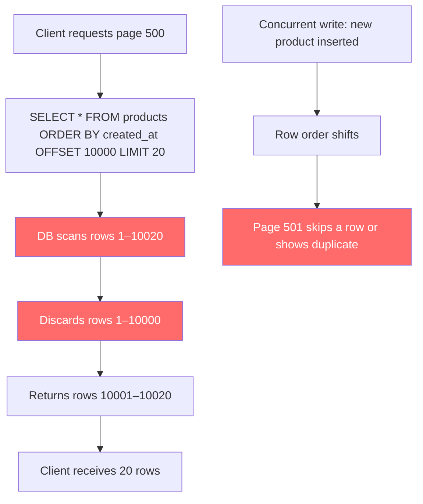
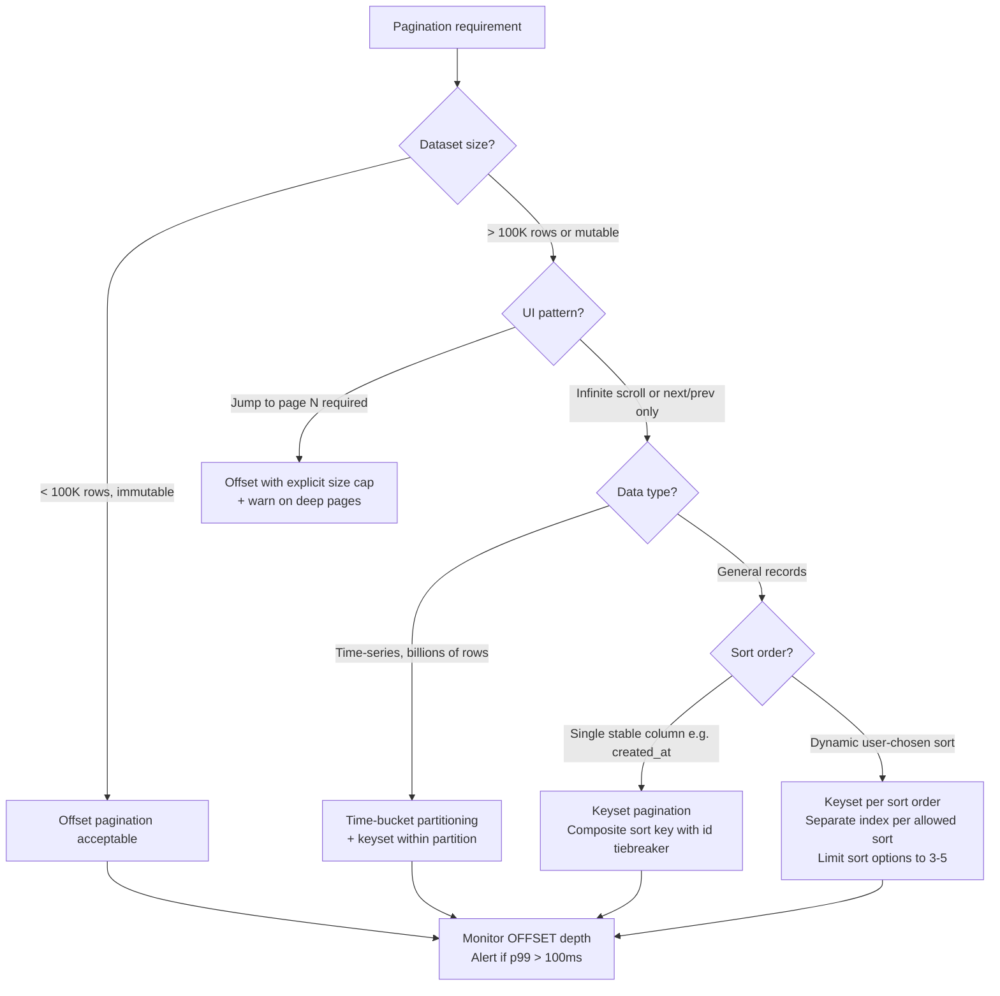

# API Pagination: Cursor, Keyset, and Offset Trade-offs at Scale

**Offset pagination looks simple. It works fine in staging. It silently kills your database at page 1000 in production.** The query that returns page 1 in 2ms returns page 500 in 4 seconds — not because you have more data, but because `OFFSET 10000` forces the database to scan and discard 10,000 rows every single time. This article shows you the correct pagination strategy for your data access pattern.

---

## The Problem Class `[Mid]`

Your API lists resources. Users and clients need to page through them. The naive approach — `OFFSET` + `LIMIT` — introduces two catastrophic production failure modes that only appear under real load.

**Scenario:** E-commerce platform. 50 million product records. Mobile app fetches products in pages of 20. Business reports fetch 100,000 products via API for analytics.



**Failure mode 1 — O(N) scan cost:** `OFFSET N` forces the database to read and discard N rows even with an index. Page 1 = 20 rows read. Page 500 = 10,020 rows read. Page 5000 = 100,020 rows read. The cost scales linearly with depth.

**Failure mode 2 — Concurrent write drift:** If a row is inserted or deleted between page 1 and page 2 requests, the cursor shifts. Users see duplicate items or skip items entirely. This is invisible in testing — it only appears under live traffic with concurrent writes.

**Sizing the problem:**

```
Table size: 50M rows
Page size: 20 rows
Average concurrent page requests: 500 req/s

Cost at page N:
  Page 1:    20 rows scanned   → ~2ms
  Page 100:  2,020 rows scanned → ~40ms
  Page 1000: 20,020 rows scanned → ~400ms
  Page 5000: 100,020 rows scanned → ~4,000ms (timeout zone)

At 500 req/s average page depth 200:
  Total rows scanned per second: 500 × (200 × 20) = 2,000,000 rows/sec
  This saturates a single PostgreSQL instance at ~4M rows/sec read throughput
```

---

## Why the Obvious Solution Fails `[Senior]`

The reason engineers reach for `OFFSET` is that it maps perfectly to UX: "Show me page N." It is intuitive in code, trivially testable, and supported by every ORM. The failures are deferred to production scale.

**Problem 1: The OFFSET scan is unavoidable.** Even with a perfect index on `ORDER BY created_at`, PostgreSQL must walk the index from the beginning to find the Nth entry. The query planner cannot skip to position N without reading all preceding entries because the index is ordered, not addressed by position. Only a clustered index (IOT in Oracle) partially mitigates this — and even then, multi-table joins break the optimization.

**Problem 2: Page N is not a stable concept.** Offset is computed at query time against the live dataset. A deletion on page 1 shifts everything by one row. A bulk insert shifts everything forward. Any client holding a "page pointer" (page number) has a stale reference the moment the data changes. This produces the ghost-row problem: an item appears on page 3 that the user already saw on page 2, or disappears between pages.

**Problem 3: No meaningful parallelism.** Because each page depends on a stable total row count, you cannot safely parallelize offset-based pagination. Workers race against the same shifting dataset.

**The GraphQL Connection Spec compounds the problem:** GraphQL's Relay cursor spec uses opaque cursors, but many implementations encode `OFFSET` inside the cursor as base64. This gives the illusion of cursor pagination while retaining all offset pathologies.

---

## The Solution Landscape `[Senior]`

### Solution 1: Keyset Pagination (Seek Method)

**What it is**

Instead of telling the database "skip N rows", you tell it "give me rows after this specific value." The WHERE clause replaces the OFFSET clause.

**How it actually works at depth**

```sql
-- First page (no cursor)
SELECT id, created_at, title
FROM products
WHERE deleted_at IS NULL
ORDER BY created_at DESC, id DESC
LIMIT 20;

-- Returns last row: created_at = '2026-01-15 10:30:00', id = 88421

-- Next page (cursor = last row's sort key values)
SELECT id, created_at, title
FROM products
WHERE deleted_at IS NULL
  AND (created_at, id) < ('2026-01-15 10:30:00', 88421)
ORDER BY created_at DESC, id DESC
LIMIT 20;
```

The composite `(created_at DESC, id DESC)` comparison is called a **row value constructor** and is supported in PostgreSQL, MySQL 8+, and SQLite. The database uses the index to seek directly to the position — O(log N) index lookup instead of O(N) scan.

**Why the secondary sort key (id) is mandatory:** `created_at` alone is not unique. If five products share the same timestamp, the seek `(created_at) < ('2026-01-15 10:30:00')` skips all five. Adding `id` as a tiebreaker makes the comparison deterministic and lossless.

**Cursor encoding for API clients:**

```javascript
// Server: encode cursor as opaque base64 token
function encodeCursor(row) {
  const payload = JSON.stringify({
    created_at: row.created_at.toISOString(),
    id: row.id
  });
  return Buffer.from(payload).toString('base64url');
}

function decodeCursor(token) {
  const payload = Buffer.from(token, 'base64url').toString('utf8');
  return JSON.parse(payload);
}

// API response shape
{
  "data": [...20 items...],
  "pagination": {
    "next_cursor": "eyJjcmVhdGVkX2F0IjoiMjAyNi0wMS0xNVQxMDozMDowMFoiLCJpZCI6ODg0MjF9",
    "has_more": true
  }
}

// Client sends: GET /products?cursor=eyJjcmVhdGVkX2F0Ij...&limit=20
```

**Sizing guidance** `[Staff+]`

```
Index required: (deleted_at, created_at DESC, id DESC) — partial index on active rows

Index size estimate:
  50M rows × (8 bytes timestamp + 8 bytes bigint + 6 bytes overhead) = ~1.1 GB
  Fits in shared_buffers on a 16GB server → hot index, sub-millisecond seeks

Query cost at any depth:
  Index seek: O(log 50M) ≈ 26 comparisons
  Sequential read: 20 rows × ~8KB pages = ~160KB
  Estimated time: 0.5ms–2ms regardless of page depth

Contrast with OFFSET at page 5000:
  50M rows, offset 100,000: scans 100,020 rows × 8KB = ~800MB read
  Estimated time: 3,000ms–8,000ms
```

**Configuration decisions that matter** `[Staff+]`

- **Page size upper bound:** Enforce server-side. Clients requesting `limit=10000` can crash your DB with a single request even on keyset. Max limit should match your slowest expected query time budget — typically 100–500 for interactive APIs, 1000–5000 for analytics.
- **Cursor expiry:** Cursors encode real sort key values, not a session state. They do not expire and are safe across server restarts. Do not build cursor invalidation unless you need to support soft deletes where deleted rows must retroactively vanish from existing pages (complex edge case).
- **Backward pagination:** Keyset pagination is naturally forward-only. To paginate backward, either store the previous cursor stack client-side, or add a `direction` parameter and reverse the comparison operator (`>` instead of `<`). Maintaining bidirectional seek requires two separate queries per page flip.

**Failure modes** `[Staff+]`

| Failure | Root cause | Mitigation |
|---|---|---|
| Duplicate rows across pages | Sort key is non-unique (missing tiebreaker) | Always add unique `id` as secondary sort |
| Empty page despite `has_more: true` | Rows deleted between cursor creation and next request | Return `has_more` based on actual next query, not assumption |
| Cursor injection attack | Cursor decoded without validation | HMAC-sign cursors, validate on decode |
| Index not used | Row value constructor not optimized by query planner | Verify with EXPLAIN ANALYZE; rewrite as explicit AND conditions if needed |

**Observability** `[Staff+]`

```
Metrics to instrument:
  pagination_query_duration_ms{method="keyset", limit=N}
  pagination_cursor_decode_errors_total
  pagination_page_empty_with_more{cursor_age_seconds=N}  ← data deleted mid-page

Alert thresholds:
  p99 query duration > 50ms → index health check
  cursor_decode_errors > 0 → possible cursor tampering
```

---

### Solution 2: Offset Pagination (Acceptable Use Cases)

**What it is**

`SELECT ... OFFSET (page-1)*limit LIMIT limit`. Maps to "jump to page N" semantics.

**How it actually works at depth**

Offset pagination is acceptable when:
1. The dataset is small and bounded (< 100K rows that match the filter)
2. The data is effectively immutable during the page session (reports on historical data)
3. The user genuinely needs "jump to page N" UI (not infinite scroll)

**Sizing guidance** `[Staff+]`

```
Safe operating envelope for offset pagination:
  Dataset size: < 500K matching rows
  Max page depth: < 500 pages at page_size=20 (OFFSET < 10,000)
  Write frequency: < 1 write/sec to the result set during pagination session

Beyond these thresholds: keyset or seek method required.
```

---

### Solution 3: Cursor Pagination with Time-Bucket Partitioning

**What it is**

For time-series data at extreme scale (billions of rows), partition by time bucket and paginate within each partition. Used by Twitter's timeline, Slack's message history.

**How it actually works at depth**

```sql
-- Table partitioned by month
CREATE TABLE events (
  id BIGINT,
  occurred_at TIMESTAMPTZ,
  payload JSONB
) PARTITION BY RANGE (occurred_at);

-- Query within a known time window using keyset
SELECT id, occurred_at, payload
FROM events
WHERE occurred_at >= '2026-01-01' AND occurred_at < '2026-02-01'
  AND (occurred_at, id) < ('2026-01-15 10:30:00', 88421)
ORDER BY occurred_at DESC, id DESC
LIMIT 20;
```

The partition pruning eliminates all partitions outside the time window before the seek begins — reducing effective dataset size from billions to millions per partition.

---

### Solution 4: GraphQL Connections Spec

**What it is**

The Relay connection spec defines a standard cursor-based pagination interface for GraphQL APIs.

```graphql
query {
  products(first: 20, after: "cursor-token") {
    edges {
      cursor
      node {
        id
        title
        price
      }
    }
    pageInfo {
      hasNextPage
      hasPreviousPage
      startCursor
      endCursor
    }
  }
}
```

**How it actually works at depth**

The spec mandates opaque cursors and `first`/`after` (forward) and `last`/`before` (backward) arguments. The implementation underneath can be keyset or offset — the spec does not dictate. Libraries like `prisma-relay-cursor-connection` implement keyset underneath. Verify your GraphQL library's cursor implementation; many encode offset as base64.

---

## Trade-off Matrix `[Senior]` → `[Staff+]`

| Dimension | Offset Pagination | Keyset Pagination | Time-Bucket + Keyset |
|---|---|---|---|
| Implementation complexity | Low | Medium | High |
| Query performance at depth | O(N) — degrades linearly | O(log N) — constant | O(log N/partition_size) |
| Stable under concurrent writes | No — rows skip/duplicate | Yes — seek is row-value based | Yes |
| Supports "jump to page N" | Yes | No | No |
| Backward pagination | Yes | Complex (reverse seek) | Complex |
| Supports multiple sort orders | Yes | Yes (one index per sort order) | Limited to time ordering |
| Total count query | Yes (`COUNT(*)`) | Expensive — avoid | Partition-level counts |
| Client state required | Page number | Last cursor token | Last cursor + time range |
| Safe max dataset size | < 500K rows | Unlimited | Billions |

---

## Decision Framework `[Senior]` → `[Staff+]`



---

## Production Failure Story `[Staff+]`

**The analytics export that killed production (composite pattern, common at mid-stage startups):**

A data team added an analytics export endpoint: `GET /api/v1/orders?page=1&limit=100`. The endpoint worked fine in staging with 10,000 orders. Six months later in production with 8 million orders, the analytics pipeline started requesting pages sequentially: page 1, 2, 3, ... up to page 80,000.

At page 80,000, each request executed: `SELECT * FROM orders ORDER BY created_at OFFSET 8000000 LIMIT 100`. The database was scanning 8 million rows per request. With the pipeline running 4 parallel workers, the database was performing 32 million row scans per second — saturating I/O and starving production OLTP traffic.

**Detection:** `pg_stat_activity` showed 4 long-running queries with `rows_examined` in the millions. Application p99 latency spiked from 40ms to 4 seconds. The analytics export was not isolated from the production database.

**Resolution (3 steps):**

1. **Immediate:** Kill the analytics queries, route analytics to a read replica.
2. **Short-term:** Replace offset with keyset on the export endpoint. Export time dropped from 18 hours to 22 minutes.
3. **Structural:** Add dedicated analytics database (Redshift/BigQuery). Prohibit deep-offset queries on OLTP databases via query analysis in the ORM layer.

**The non-obvious lesson:** The analytics team was not malicious or careless. Offset pagination felt natural. The failure was architectural — production OLTP and analytics sharing a database with no guardrails on query depth.

---

## Observability Playbook `[Staff+]`

```
Pagination health metrics:

1. Query depth distribution
   histogram_quantile(0.99, pagination_offset_value) > 10000 → alert
   Action: Force migration to keyset for that endpoint

2. Page query duration by method
   pagination_query_duration_ms{method="offset"} p99 > 200ms → alert
   pagination_query_duration_ms{method="keyset"} p99 > 50ms → alert (index problem)

3. Cursor decode failures
   pagination_cursor_decode_errors_total > 0 → alert (client bug or tampering)

4. Empty pages with has_more=true
   pagination_empty_page_with_more_total → track (indicates deleted rows mid-session)

Logging per pagination request:
   {
     "method": "keyset|offset",
     "limit": 20,
     "offset_depth": 0,          // only for offset
     "cursor_age_seconds": 45,   // only for keyset
     "rows_returned": 20,
     "query_duration_ms": 3.2,
     "index_used": "idx_products_created_at_id"
   }
```

---

## Architectural Evolution `[Staff+]`

**2026 tooling perspective:**

- **Prisma 5+:** Native keyset pagination via `cursor` argument with automatic tiebreaker injection. Eliminates hand-rolled SQL for most use cases.
- **Drizzle ORM:** `db.select().from(table).where(lt(table.createdAt, cursor)).orderBy(desc(table.createdAt)).limit(20)` — explicit but type-safe keyset.
- **PlanetScale/Vitess:** Keyset pagination maps well to sharded MySQL because the sort key can be chosen to align with the shard key, keeping seeks local to a single shard.
- **CockroachDB/YugabyteDB:** Distributed SQL with keyset pagination is safe; offset pagination triggers distributed scans across all nodes — even more expensive than single-node PostgreSQL.
- **ElasticSearch/OpenSearch:** Uses `search_after` parameter — direct implementation of keyset pagination. `from` + `size` (offset) is capped at 10,000 by default (`index.max_result_window`). Do not fight this limit; use `search_after`.
- **GraphQL Federation (Apollo Router 2.x):** Per-subgraph cursor composition. Each subgraph returns its own keyset cursor; the router stitches. Implementing cross-subgraph pagination consistently is the hardest unsolved problem in GraphQL federation.

**The evolution trajectory:**
```
Phase 1 (MVP):         Offset pagination — fast to ship, safe at < 100K rows
Phase 2 (Growth):      Keyset on hot endpoints — when p99 > 100ms appears
Phase 3 (Scale):       Keyset everywhere + analytics read replica
Phase 4 (Hyperscale):  Time-bucket partitioning + keyset, ElasticSearch for search,
                       BigQuery/Redshift for analytics export
```

---

## Decision Framework Checklist `[All Levels]`

- [ ] Is my dataset > 100K rows that match the common filter? If yes, keyset required.
- [ ] Does my UI require "jump to page N"? If yes, document the offset depth limit and set a server-side cap.
- [ ] Have I added a composite index with a unique tiebreaker for keyset sort columns?
- [ ] Are cursors HMAC-signed or otherwise tamper-evident?
- [ ] Is my analytics/export workload isolated from my OLTP database?
- [ ] Have I verified with `EXPLAIN ANALYZE` that the seek uses an index seek (not a sequential scan)?
- [ ] Is the maximum `limit` value enforced server-side (not client-controlled)?
- [ ] Are pagination query durations included in my p99 SLO dashboards?
- [ ] Does my API documentation clearly state cursor expiry policy (or no expiry)?
- [ ] Have I tested pagination correctness under concurrent inserts to the paginated table?

*Written by Gaurav Porwal — 10+ Year Engineer | Tech Lead | Product Owner | Business-Minded Builder*
*Last updated: 2026-03-18*
