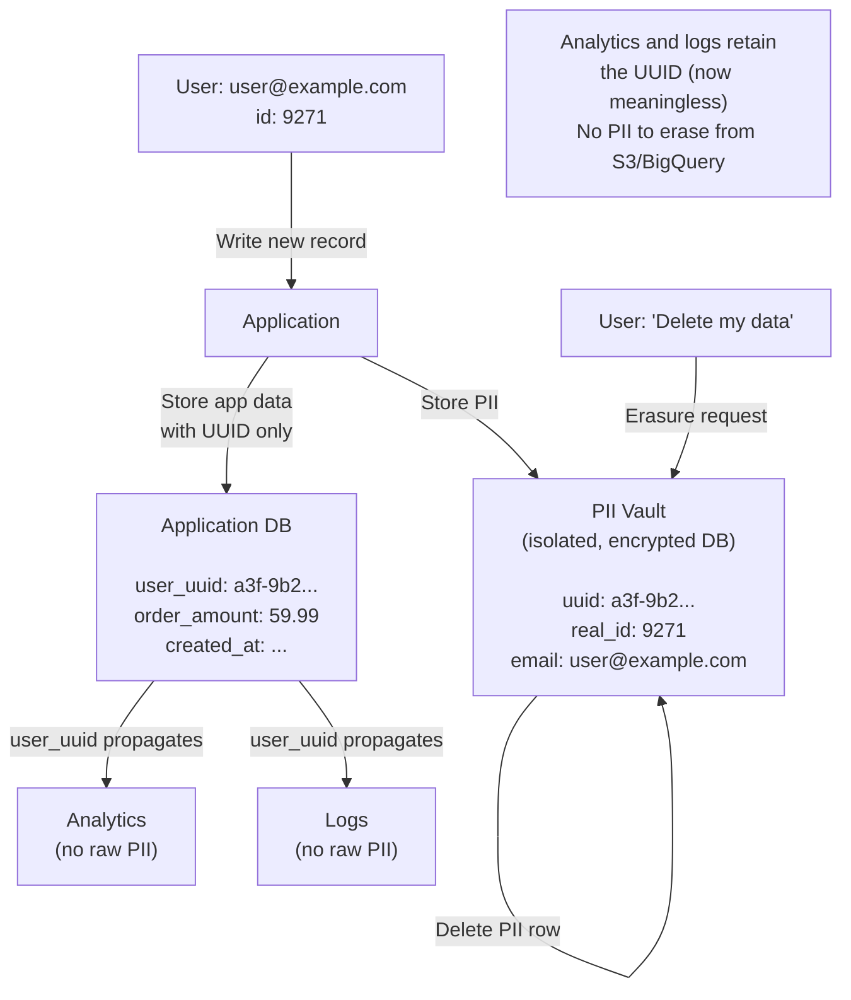
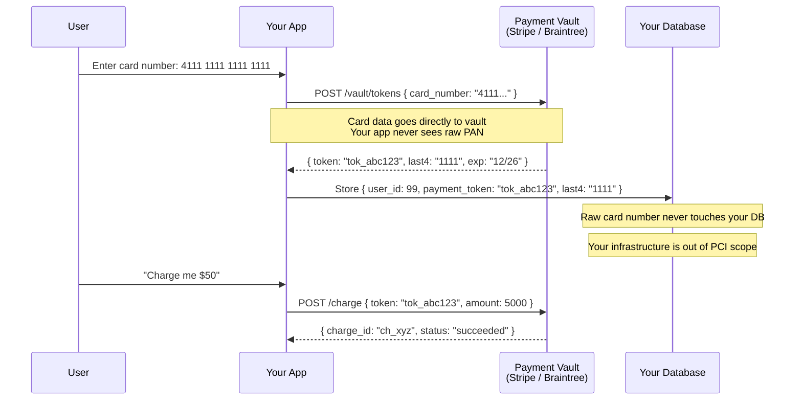

**Compliance is not a checkbox audit — it's an architectural constraint that shapes every data model, API, and logging decision you make.**

## The Problem

A startup launches a SaaS product. Engineers design the system the natural way: log everything for debugging, store user data wherever it's convenient, use production database dumps to test new features. The product ships, customers love it, growth is rapid.

Then the company starts selling to enterprise customers in Europe. Suddenly there are legal requirements attached to every contract: GDPR data processing agreements, SOC2 Type II reports, PCI-DSS scope assessments. The engineers look at the codebase and realize:

```
Compliance gaps found in a typical fast-moving startup:

Logging layer:
  - Full user objects logged on every API request (PII in logs)
  - Logs stored in the same region as other data (no isolation)
  - Logs retained forever (no deletion policy)

Database:
  - User email, phone, address stored in cleartext
  - Card-related data in same schema as application data
  - No field-level encryption for sensitive fields

Dev/test environments:
  - Production database dumps used as test data
  - Engineers have full read access to prod PII
  - No data masking pipeline

Access control:
  - All engineers can query prod directly
  - No audit trail of who accessed what data
  - SSH keys shared between team members
```

Retrofitting compliance onto an existing system is 10x more expensive and disruptive than building it in from the start. The goal of this article is to show you what "building it in" actually looks like architecturally.

---

## How It Works

### The Three Frameworks You Will Encounter

**GDPR** governs any company that handles data from EU citizens — regardless of where the company is based. **PCI-DSS** governs anyone who touches card payment data. **SOC2** is a voluntary standard that enterprise B2B buyers require as proof that you take security seriously.

They overlap significantly but each has a distinct focus:

```
GDPR  → User rights and data sovereignty
          "Users can ask you to delete their data. You must comply."

PCI-DSS → Payment card data security
           "Card numbers are nuclear material. Handle them accordingly."

SOC2  → General security posture for B2B SaaS
         "Here is evidence that your controls work, audited by a third party."
```

### GDPR Architecture

GDPR gives EU users six key rights that have direct architectural implications: right to erasure ("right to be forgotten"), right to access (data export), right to portability, right to rectification, consent management, and data minimization.

#### Data Inventory — Know Where Your PII Lives

Before you can comply with a right-to-erasure request, you have to know where the user's data actually is. Most systems have PII in more places than engineers realize:

```
Common PII locations in a web application:

Primary database:
  users table — email, name, phone, address
  orders table — shipping address, billing address
  payments table — last 4 digits, billing address

Derived/secondary stores:
  Elasticsearch index — search by customer name/email
  Redis cache — user session data, recent orders
  Analytics warehouse (BigQuery/Snowflake) — event data with user_id
  Data lake (S3) — raw event logs with PII fields
  ML feature store — computed features from user behavior

Log pipelines:
  Application logs — may contain user_id, email, IP addresses
  API access logs — user_id in request path, headers
  Error tracking (Sentry/Datadog) — full request context

Backups:
  Database snapshots — contain historical PII
  Data warehouse snapshots — historical analytics
  Log archives — compressed raw logs
```

If you cannot answer "where does user@example.com's data live?" you are not GDPR compliant, and you will fail a deletion request.

**Build a data inventory as a first-class system artifact.** Every engineer who adds a new place where PII is stored should update it.

#### Right to Erasure: Pseudonymization Pattern

Hard-deleting a user from every location (primary DB, Elasticsearch, S3, BigQuery, Redis, backups, logs) is complex and often impossible for backups and historical data. The scalable solution is pseudonymization:



```python
# Pseudocode: pseudonymization at write time
class PIIVault:
    """
    The PII Vault is a separate database with strict access controls.
    The application never stores real PII in the main database.
    All downstream systems (analytics, logs, search) use only the UUID.
    """

    def pseudonymize(self, user_data):
        # Generate a stable UUID for this user
        pii_uuid = generate_uuid()

        # Store PII in the vault
        vault_db.insert({
            "uuid": pii_uuid,
            "real_id": user_data["id"],
            "email": user_data["email"],
            "name": user_data["name"],
            "phone": user_data["phone"],
            "address": user_data["address"],
            "created_at": now()
        })

        # Return UUID — application stores this, not the PII
        return pii_uuid

    def lookup(self, pii_uuid):
        # Only called when you actually need to show PII to the user
        return vault_db.find(uuid=pii_uuid)

    def erase(self, pii_uuid):
        # GDPR right to erasure: delete from vault
        # The UUID remains in application DB, analytics, logs — but it's now meaningless
        vault_db.delete(uuid=pii_uuid)
        # Log the erasure for compliance records
        audit_log.append({
            "event": "pii_erased",
            "uuid": pii_uuid,
            "timestamp": now(),
            "requested_by": "user"
        })
```

#### Consent Management

GDPR requires that you can prove a user consented to specific data uses, and that you honor withdrawals.

```python
# Pseudocode: append-only consent log
class ConsentLog:
    """
    Consent is append-only. Never update existing consent records.
    Each record represents a point-in-time decision by the user.
    """

    def grant_consent(self, user_id, purpose, version):
        # e.g., purpose="marketing_emails", version="2024-01-15"
        consent_db.insert({
            "user_id": user_id,
            "purpose": purpose,
            "policy_version": version,
            "action": "granted",
            "timestamp": now(),
            "ip_address": request.ip,
            "user_agent": request.user_agent
        })

    def withdraw_consent(self, user_id, purpose):
        consent_db.insert({
            "user_id": user_id,
            "purpose": purpose,
            "action": "withdrawn",
            "timestamp": now()
        })

    def has_valid_consent(self, user_id, purpose):
        # Get the most recent consent record for this purpose
        latest = consent_db.query(
            user_id=user_id,
            purpose=purpose,
            order_by="timestamp DESC",
            limit=1
        )
        return latest and latest.action == "granted"

# Before sending marketing email:
if not consent_log.has_valid_consent(user_id, "marketing_emails"):
    skip_sending()
```

#### Data Residency

GDPR requires that EU user data stays in the EU. This impacts your routing layer:

```python
# Pseudocode: tenant routing based on user region
class TenantRouter:
    def route_request(self, user_id, request):
        user_region = user_registry.get_region(user_id)

        if user_region == "EU":
            return forward_to(
                endpoint="api.eu-west-1.myapp.com",
                db_cluster="postgres-eu-west-1",
                cache_cluster="redis-eu-west-1"
            )
        else:
            return forward_to(
                endpoint="api.us-east-1.myapp.com",
                db_cluster="postgres-us-east-1",
                cache_cluster="redis-us-east-1"
            )
```

---

### PCI-DSS Architecture

Anyone who processes, stores, or transmits cardholder data is in scope for PCI-DSS. The single most important rule: **never store raw card numbers (Primary Account Numbers / PANs) in your own systems.** The moment you do, your entire infrastructure becomes a Cardholder Data Environment (CDE), which means quarterly external vulnerability scans, annual penetration tests, and strict access controls on every system that touches your database.

The way to avoid all of this is tokenization.

#### Tokenization: Get Card Data Out of Scope



```python
# Pseudocode: PCI-compliant payment flow using Stripe
class PaymentService:
    def __init__(self):
        self.stripe = Stripe(api_key=os.env("STRIPE_SECRET_KEY"))

    def save_payment_method(self, user_id, stripe_payment_method_id):
        """
        The card was tokenized client-side using Stripe.js.
        We receive a PaymentMethod ID (pm_xxx), never the raw card.
        """
        # Retrieve metadata to store (last4, brand, expiry)
        pm = self.stripe.payment_methods.retrieve(stripe_payment_method_id)

        # Store only the token + non-sensitive metadata in our DB
        db.payment_methods.insert({
            "user_id": user_id,
            "stripe_pm_id": stripe_payment_method_id,  # Token, not card number
            "last4": pm.card.last4,
            "brand": pm.card.brand,
            "exp_month": pm.card.exp_month,
            "exp_year": pm.card.exp_year,
            "created_at": now()
        })

    def charge(self, user_id, amount_cents, currency="usd"):
        pm = db.payment_methods.find_default(user_id=user_id)

        charge = self.stripe.payment_intents.create({
            "amount": amount_cents,
            "currency": currency,
            "payment_method": pm.stripe_pm_id,  # Stripe looks up the real card
            "confirm": True
        })

        return charge.id
```

By using Stripe (or any payment vault), your database never contains raw card numbers. Your infrastructure is **out of PCI scope** for the purposes of cardholder data storage. You still need PCI compliance for the transmission path, but the scope is dramatically reduced.

#### The Cardholder Data Environment (CDE)

If for some reason you must handle raw card data (rare — almost always avoidable), the CDE must be an isolated network zone with:

```
CDE Requirements (simplified):
├── Network segmentation (VLAN/firewall from non-CDE systems)
├── All access logged and monitored
├── Two-factor authentication for all CDE access
├── Encryption at rest and in transit (TLS 1.2+)
├── File integrity monitoring on all CDE servers
├── Quarterly internal vulnerability scans
├── Annual external penetration test
└── Access limited to those with a business need
```

---

### SOC2 Architecture

SOC2 is a voluntary audit framework used as a trust signal in B2B sales. The auditor examines five Trust Service Criteria and certifies that your controls work. **SOC2 Type I** is a point-in-time snapshot. **SOC2 Type II** covers a period (typically 6-12 months) and is what enterprise buyers actually require.

The five criteria:

| Criteria | What it means | Key controls |
|---------|--------------|-------------|
| Security | System protected from unauthorized access | MFA, access controls, vulnerability management |
| Availability | System available as committed | SLA monitoring, incident response, DR plan |
| Processing Integrity | Processing is complete, valid, and authorized | Input validation, error handling, change management |
| Confidentiality | Confidential data is protected | Encryption, access controls, NDA enforcement |
| Privacy | PII collected and used appropriately | GDPR-style controls, consent, data minimization |

**SOC2 is primarily an audit trail problem.** The auditor will ask for evidence that your controls work. That evidence is almost entirely in your audit logs.

---

## Implementation

### Audit Logging at Scale

All three frameworks require tamper-evident audit logs. GDPR requires logging data access and erasure. PCI-DSS requires logging all access to cardholder data. SOC2 requires logging privileged access and configuration changes.

**Design principles:**
- Append-only (no updates or deletes by application services)
- Signed entries (detect tampering)
- Separate from application database (harder to accidentally purge)
- Retained per compliance schedule (typically 1-7 years)
- Immutable storage for archival (S3 Object Lock, Azure Immutable Blob Storage)

```python
# Pseudocode: tamper-evident audit logger
import hashlib
import hmac

class AuditLogger:
    def __init__(self):
        self.signing_key = secrets.get("AUDIT_LOG_SIGNING_KEY")
        self.previous_hash = self.get_last_entry_hash()

    def log(self, event):
        entry = {
            "id": generate_uuid(),
            "timestamp": now_utc_iso(),
            "actor_id": event.actor_id,         # Who performed the action
            "actor_type": event.actor_type,     # "user", "service", "admin"
            "action": event.action,             # "read", "update", "delete", "export"
            "resource_type": event.resource_type,  # "user_profile", "payment_method"
            "resource_id": event.resource_id,
            "ip_address": event.ip_address,
            "user_agent": event.user_agent,
            "result": event.result,             # "success", "denied"
            "metadata": event.metadata,         # Action-specific details
            "previous_hash": self.previous_hash  # Chain integrity
        }

        # Sign the entry
        entry["signature"] = self.sign(entry)

        # Write to append-only audit DB (NOT the application DB)
        audit_db.append(entry)

        # Update chain
        self.previous_hash = sha256(entry)

        return entry["id"]

    def sign(self, entry):
        payload = canonical_serialize(entry)
        return hmac.new(self.signing_key, payload, hashlib.sha256).hexdigest()

    def verify_chain_integrity(self, start_id, end_id):
        """Run this periodically to detect tampering."""
        entries = audit_db.range(start_id, end_id)
        for i, entry in enumerate(entries):
            if i > 0:
                expected_prev = sha256(entries[i-1])
                if entry["previous_hash"] != expected_prev:
                    alert("AUDIT LOG CHAIN BROKEN at entry " + entry["id"])
                    return False
            expected_sig = self.sign(without_signature(entry))
            if entry["signature"] != expected_sig:
                alert("AUDIT LOG SIGNATURE INVALID at entry " + entry["id"])
                return False
        return True

# Usage examples:
audit.log(AuditEvent(
    actor_id=current_user.id,
    actor_type="user",
    action="read",
    resource_type="payment_method",
    resource_id=payment_method_id,
    result="success"
))

audit.log(AuditEvent(
    actor_id="admin-tool",
    actor_type="service",
    action="pii_export",
    resource_type="user_profile",
    resource_id=user_id,
    metadata={"requested_by": "gdpr_data_access_request", "ticket": "GDPR-4421"}
))
```

### Encryption Architecture

```
Encryption layers for a compliant system:

In Transit:
  - TLS 1.2+ minimum (1.3 preferred) for all external APIs
  - mTLS between internal microservices
  - No plaintext HTTP anywhere, including internal networks

At Rest:
  - Database: encryption at rest enabled (AES-256)
  - S3/GCS: server-side encryption enabled
  - Field-level encryption for highest-sensitivity fields (card tokens, SSN)

Key Management (Envelope Encryption Pattern):
  - Data Encryption Key (DEK): encrypts the actual data
  - Key Encryption Key (KEK): encrypts the DEK
  - KEK stored in HSM or KMS (AWS KMS, HashiCorp Vault)
  - Your application never has access to the KEK directly
```

```python
# Pseudocode: envelope encryption for field-level PII protection
class FieldEncryption:
    def __init__(self):
        self.kms = AWSKMSClient(key_id="arn:aws:kms:...")

    def encrypt_field(self, plaintext):
        # Step 1: Ask KMS to generate a DEK
        # KMS returns both the plaintext DEK (use now) and
        # the encrypted DEK (store with the ciphertext)
        result = self.kms.generate_data_key(key_spec="AES_256")
        plaintext_dek = result.plaintext
        encrypted_dek = result.ciphertext_blob

        # Step 2: Encrypt the data with the DEK
        ciphertext = aes_256_encrypt(plaintext, key=plaintext_dek)

        # Step 3: Discard plaintext DEK from memory
        secure_zero(plaintext_dek)

        # Store both: the ciphertext and the encrypted DEK
        return {
            "ciphertext": base64(ciphertext),
            "encrypted_dek": base64(encrypted_dek)
        }

    def decrypt_field(self, encrypted_record):
        # Step 1: Ask KMS to decrypt the DEK
        # KMS only decrypts if our IAM policy allows it (audit trail in CloudTrail)
        plaintext_dek = self.kms.decrypt(
            ciphertext_blob=from_base64(encrypted_record["encrypted_dek"])
        )

        # Step 2: Decrypt the data
        plaintext = aes_256_decrypt(
            from_base64(encrypted_record["ciphertext"]),
            key=plaintext_dek
        )

        secure_zero(plaintext_dek)
        return plaintext
```

### Access Control for Compliance

Engineers should not have direct access to production PII in cleartext. This is required for PCI-DSS CDE access, strongly implied by GDPR (principle of data minimization), and expected for SOC2.

```python
# Pseudocode: just-in-time access request system
class JITAccessSystem:
    """
    Instead of permanent DB access, engineers request time-limited credentials.
    Every request is logged. The access expires automatically.
    """

    def request_access(self, engineer_id, reason, duration_hours=1):
        request = {
            "id": generate_uuid(),
            "engineer_id": engineer_id,
            "reason": reason,
            "requested_at": now(),
            "duration_hours": duration_hours,
            "status": "pending"
        }
        access_requests_db.insert(request)

        # Notify approver (required for PCI-DSS CDE access)
        notify_security_team(request)
        return request["id"]

    def approve_access(self, request_id, approver_id):
        request = access_requests_db.get(request_id)

        # Generate time-limited credentials
        credentials = iam.create_temporary_credentials(
            user=request["engineer_id"],
            permissions=["db:read"],  # Read-only, masked PII
            expires_at=now() + hours(request["duration_hours"])
        )

        access_requests_db.update(request_id, {
            "status": "approved",
            "approved_by": approver_id,
            "credentials_id": credentials.id,
            "expires_at": credentials.expires_at
        })

        audit.log(AuditEvent(
            actor_id=approver_id,
            action="jit_access_approved",
            resource_type="prod_database",
            metadata={"engineer": request["engineer_id"], "reason": request["reason"]}
        ))

        return credentials
```

**Data masking in non-production environments:**

```python
# Pseudocode: data masking pipeline for dev/test environments
class DataMaskingPipeline:
    def mask_users_table(self, prod_snapshot, target_env):
        """
        Replace real PII with realistic fake data.
        Run this when copying prod data to staging/dev.
        """
        for user in prod_snapshot.users:
            user.email = f"user_{user.id}@example-test.com"
            user.name = fake.name()
            user.phone = fake.phone_number()
            user.address = fake.address()
            user.ip_address = fake.ipv4()
            # Preserve non-PII fields (created_at, subscription_tier, etc.)

        target_env.users.bulk_insert(prod_snapshot.users)
        logger.info(f"Masked {len(prod_snapshot.users)} users for {target_env}")
```

---

## Real-World Usage

**Stripe (PCI-DSS)**: Stripe's entire product is built around reducing PCI scope for their customers. By handling all card data collection client-side (Stripe.js / Stripe Elements), card numbers never touch the merchant's servers. Stripe maintains their own PCI Level 1 certification. This is the model for tokenization at scale.

**Atlassian (SOC2 Type II)**: Atlassian publishes their SOC2 Type II reports publicly. Their Trust Center documents their controls across all five criteria. One architectural decision they made explicitly for compliance: their audit logging system is a separate service with its own isolated database, write-only API available to application services, and read access restricted to security and compliance teams.

**Revolut (GDPR pseudonymization)**: Revolut, as a financial services company handling EU user data, uses pseudonymization heavily. Downstream analytics systems receive pseudonymized user IDs. The mapping table (UUID → real user identity) lives in an isolated service with strict access controls and its own audit trail.

**AWS (GDPR Data Processing Agreement)**: AWS offers a DPA (Data Processing Agreement) that allows customers to use AWS services for GDPR-regulated workloads. Architecturally, this means using region-specific AWS regions (e.g., eu-west-1 exclusively for EU user data) and enabling AWS CloudTrail for API-level audit logging of all actions on EU data.

---

## Trade-offs

| Approach | Scope Reduction | Implementation Complexity | Performance Impact | Reversibility |
|---------|----------------|--------------------------|-------------------|---------------|
| **Full isolation (CDE/separate region)** | Maximum | Very High | Low | Hard |
| **Pseudonymization (PII Vault)** | High | Medium | Medium (vault lookup) | Medium |
| **Tokenization (payment data)** | High (for PCI) | Low (use Stripe) | Low | Easy |
| **Field-level encryption** | Medium | High | Medium (encrypt/decrypt per field) | Medium |
| **Data masking (non-prod)** | Medium | Low | None (offline transform) | N/A |

---

## Common Pitfalls

1. **PII leaking into logs**: This is the #1 compliance violation found in audits. Engineers log full request/response objects for debugging, and user email, address, and card details end up in your log pipeline — including Datadog, Elasticsearch, and S3. Fix: establish a PII scrubber middleware that strips known sensitive fields before logging, and make PII fields structurally opaque (e.g., store as encrypted blobs so they can't accidentally be serialized as plaintext).

2. **Backup files not encrypted**: Database snapshots sitting in S3 are often overlooked. The application DB has encryption at rest, but the backup bucket has a public ACL and no encryption because the original S3 bucket setup was done quickly in 2019. Review your backup storage configurations. Enable S3 default encryption and block public access at the account level.

3. **Using production data in dev environments**: This is both a GDPR violation and a practical security risk. Every developer's laptop becomes a data breach vector. Build a data masking pipeline and enforce it as a CI gate: dev/staging DB restores must pass through the masking pipeline before use.

4. **Right-to-erasure not propagated everywhere**: A user submits a deletion request. You delete them from the users table. But you forgot: Elasticsearch has a user profile index, BigQuery has an analytics events table, Redis has a session cache, and last month's database snapshot still has their full PII. Test your deletion flow end-to-end, including search indexes, analytics stores, caches, and — hardest of all — backups (pseudonymization solves this: deleting from the PII vault makes backup data meaningless without breaking the backups themselves).

5. **Treating compliance as a one-time audit project**: SOC2 Type II is a continuous 12-month assessment. If you fix all your controls in November and your audit period is January–December, you have one month of evidence. Compliance controls must be operational year-round. Build them into your development process, not your audit process.

6. **No separation between audit logs and application logs**: If your application can delete its own audit logs (e.g., because the audit log is a table in the same database), then the audit log is not tamper-evident. Store audit logs in a write-only, separately governed system that application services cannot modify or delete.

---

## Key Takeaways

- Compliance is an architectural constraint, not an audit checklist. GDPR, PCI-DSS, and SOC2 all impose specific technical requirements that must be designed in from the start.
- For GDPR: pseudonymize PII into a dedicated vault. All downstream systems (analytics, logs, search) operate on UUIDs. Deletion from the vault renders downstream data meaningless without cascading deletes.
- For PCI-DSS: use a payment vault (Stripe, Braintree) and never let raw card numbers touch your infrastructure. Tokenization eliminates most of your PCI scope.
- For SOC2: audit logging is your evidence base. Design your audit log as append-only, signed, and isolated from application services that could tamper with it.
- PII in logs is the most common compliance violation found in real audits. Scrub sensitive fields before they reach your log pipeline.
- JIT (just-in-time) access for production databases reduces your blast radius when credentials are compromised and satisfies PCI and SOC2 access control requirements.
- Test your right-to-erasure flow end-to-end, including Elasticsearch, BigQuery, Redis, and backups. If any system retains PII after deletion, you are non-compliant.
