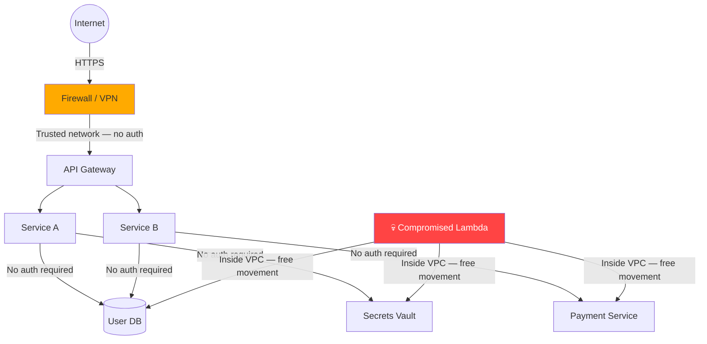
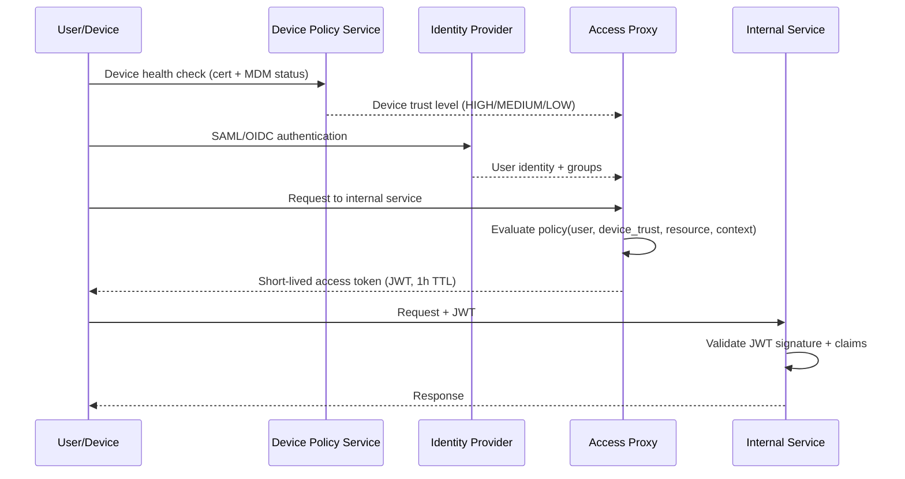
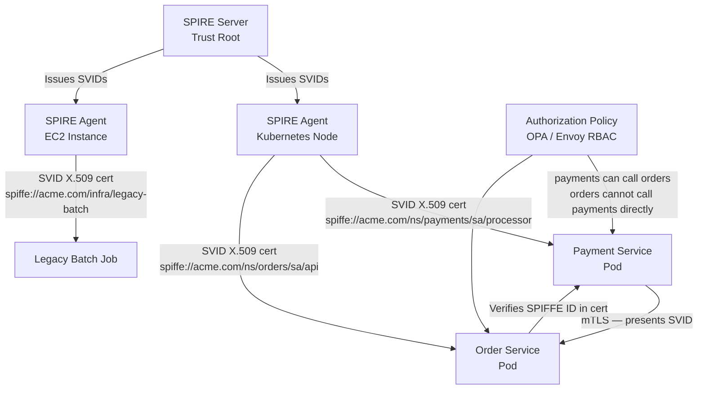
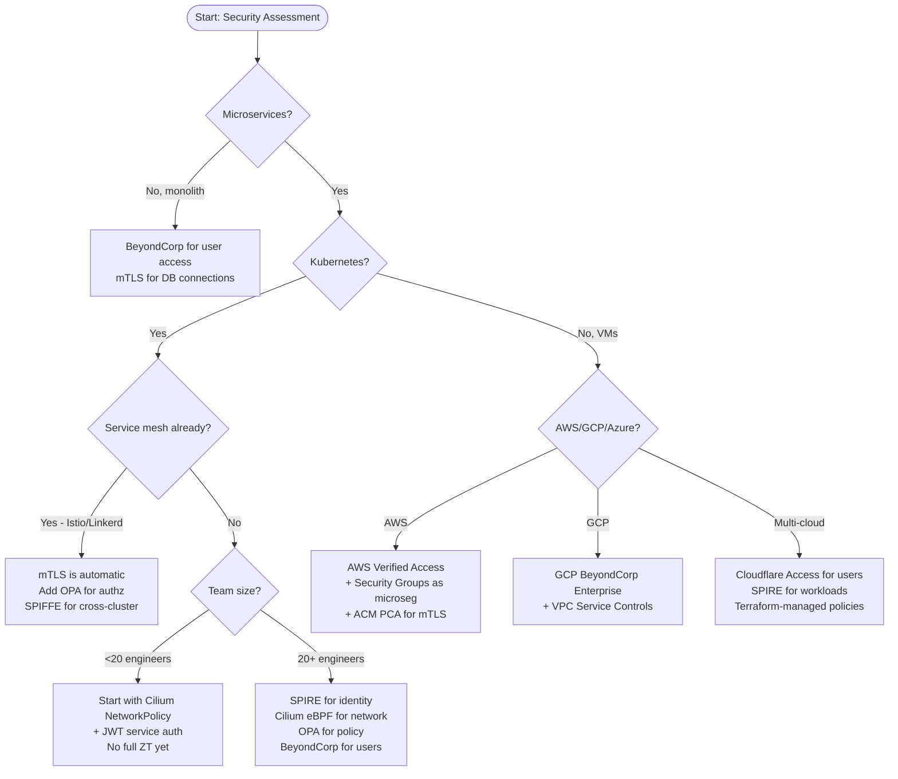

# Zero Trust Architecture: Never Trust, Always Verify at Service Scale

**Your VPN just became your biggest attack surface.** Once an attacker is inside the perimeter, they move laterally unimpeded — your database, your internal APIs, your secrets manager are all one hop away. Zero Trust eliminates the concept of a trusted network. Every request is verified, every connection is authenticated, every privilege is minimized.

---

## The Problem Class `[Mid]`

A fintech company running 200 microservices has a classic castle-and-moat setup: hard perimeter (firewall + VPN), soft interior (services trust each other without authentication). A compromised Lambda function — injected via a dependency supply chain attack — can query the user database, read from Vault, and exfiltrate payment card data without a single auth check failing because it's "inside the network."



The perimeter model has three catastrophic failure modes:

1. **Lateral movement**: One compromised service = access to everything on the same network segment.
2. **Insider threats**: Employees on VPN have overly broad access to internal services.
3. **Cloud-native invalidation**: Ephemeral containers, serverless functions, and multi-cloud deployments have no meaningful "inside" — the perimeter dissolved.

The 2020 SolarWinds attack demonstrated this perfectly: once inside a customer's perimeter, attackers moved freely for months. The 2021 Colonial Pipeline attack followed the same pattern. The perimeter model is not just weak — it's a liability at scale.

---

## Why the Obvious Solution Fails `[Senior]`

**"Just add service-to-service API keys"** is the most common first attempt. It fails because:

- Static API keys proliferate across config files, environment variables, and CI systems — they become secrets sprawl.
- No automatic rotation means a leaked key is valid indefinitely.
- No strong identity binding — the key proves possession, not service identity.
- No per-request policy evaluation — a key grants access forever, not "for this specific request given current context."

**"Just use mutual TLS (mTLS)"** alone also fails without a broader policy framework:
- mTLS proves identity but doesn't enforce authorization — Service A can call any endpoint on Service B.
- Certificate management without automation causes expiry-triggered outages.
- No dynamic policy updates without redeployment.

Zero Trust requires identity + policy + continuous verification working together — not just adding TLS to existing architecture.

---

## The Solution Landscape `[Senior]`

### Solution 1: BeyondCorp / Google's Model

**What it is**

BeyondCorp (Google's Zero Trust model, published 2014, now a Google Cloud product) moves access control from the network perimeter to individual devices and users. Access is determined by who you are and the health of your device — not which network you're on.

**How it actually works at depth**

Every access request flows through an Access Proxy that evaluates:
1. **Device inventory check**: Is this device managed? Is it enrolled in MDM? Does it have current patch level?
2. **User identity**: Authenticated via IdP (SAML/OIDC)?
3. **Context**: Time of day, geolocation, risk score?
4. **Resource policy**: Is this user/device combination permitted to access this resource at this access level?

The Access Proxy issues a short-lived token (typically 1-hour JWT) encoding device trust level and user identity. Downstream services validate this token — no VPN required.



**Sizing guidance** `[Staff+]`

- Access Proxy adds ~2-5ms latency per request (JWT validation is local after initial issuance).
- Device policy service: ~100 RPS per 1,000 active users (devices check in every 15 minutes).
- Token cache hit rate should be >95% — cold token fetch is 20-50ms; cache lookup is <1ms.
- Scale Access Proxy horizontally; stateless JWT validation means no session affinity needed.

**Configuration decisions that matter** `[Staff+]`

- **Token TTL**: 1 hour balances security and UX. Shorter = more auth overhead; longer = stale trust signals.
- **Device trust tiers**: Define HIGH (managed, patched, encrypted), MEDIUM (managed but behind on patches), LOW (unmanaged). Map resource sensitivity to minimum trust tier.
- **Continuous validation**: Re-evaluate policy at token refresh, not just issuance. A device that becomes compromised mid-session should lose access at next renewal.

**Failure modes** `[Staff+]`

- **Access Proxy becomes SPF**: Mitigate with multi-region deployment, active-active, and circuit breakers. If the proxy is unreachable, fail closed (deny) not open.
- **Device inventory staleness**: If MDM sync lags, devices may be incorrectly trusted. Set maximum inventory age threshold (e.g., 4 hours) beyond which devices drop to LOW trust.
- **Token replay after device compromise**: Short TTLs limit blast radius. Pair with token revocation list (check on critical operations, not every request).

**Observability** `[Staff+]`

```
# Key metrics to track
access_proxy_requests_total{result="allowed|denied|error"}
access_proxy_latency_p99  # Should be <10ms
device_trust_level_distribution{level="HIGH|MEDIUM|LOW"}
policy_evaluation_duration_ms
token_cache_hit_rate  # Target: >95%
```

---

### Solution 2: mTLS with SPIFFE/SPIRE for Service Identity

**What it is**

SPIFFE (Secure Production Identity Framework For Everyone) provides a standard for workload identity. SPIRE (the reference implementation) issues X.509-SVID (SVID = SPIFFE Verifiable Identity Document) certificates to workloads based on their platform identity (Kubernetes service account, AWS instance profile, etc.).

**How it actually works at depth**

Every service gets a cryptographically verifiable identity bound to what it is (Kubernetes pod in namespace `payments`, running service account `payment-processor`), not where it is (IP address, which changes constantly in cloud-native environments).



**Sizing guidance** `[Staff+]`

- SVID TTL: 1 hour default. Rotation starts at 50% of TTL (30 min). Certificate rotation overhead: ~0.1% CPU spike on SPIRE agent during batch renewal.
- SPIRE server: handles 10,000+ SVID renewals/hour on a single instance. At 1-hour TTL with 1,000 services, that's ~17 renewals/minute — easily handled.
- mTLS handshake overhead: ~0.5-1ms for TLS 1.3 with session resumption. Without session resumption: ~5-10ms. Enable session tickets.
- Memory: Each SVID is ~2KB. 1,000 services × 10 SVIDs each = ~20MB — negligible.

**Configuration decisions that matter** `[Staff+]`

- **SVID TTL vs security**: Short TTL (15min) limits blast radius of a stolen certificate but increases SPIRE server load and risk of renewal failures. 1-hour is the production sweet spot.
- **Upstream authority**: SPIRE can use AWS ACM PCA, Vault PKI, or its own CA as the upstream authority. Use Vault PKI for unified certificate management.
- **Node attestation**: Kubernetes attestor uses projected service account tokens (bound to pod). EC2 attestor uses instance identity documents. Never use join tokens in production — they're a bootstrap credential that must be protected.

**Failure modes** `[Staff+]`

- **SPIRE server unavailability**: Services cache their current SVID. If SPIRE is down, services continue operating until their SVID expires. At 1-hour TTL, you have up to 30 minutes before renewals start failing. SPIRE server HA via embedded etcd or external Postgres.
- **Clock skew**: Certificate validity windows are time-bound. >5 minutes of clock skew causes mTLS failures. Enforce NTP synchronization — monitor `chronyd` offset metrics.
- **CRL/OCSP at scale**: Don't use CRL for high-frequency revocation checks. Use short TTLs as the revocation mechanism. Reserve explicit revocation (CRL) for compromise events, not routine rotation.

---

### Solution 3: Microsegmentation with eBPF

**What it is**

Microsegmentation enforces network policy at the workload level — each pod/container/VM has an identity-aware firewall that allows only explicitly permitted traffic. In 2026, eBPF-based implementations (Cilium, Calico eBPF mode) enforce this at the kernel level without iptables overhead.

**How it actually works at depth**

eBPF programs are loaded into the Linux kernel at the network layer. They inspect packets with full context (source identity, destination, L7 protocol) and make allow/deny decisions in microseconds without copying packets to userspace. Cilium's implementation attaches eBPF programs to network interfaces and enforces Kubernetes NetworkPolicy plus its own CiliumNetworkPolicy (which supports L7 HTTP/gRPC policies).

**Sizing guidance** `[Staff+]`

- eBPF enforcement overhead: ~2-5μs per packet (vs ~20-50μs for iptables at scale). At 100Gbps line rate, this matters.
- Policy rule count: eBPF hash maps scale to millions of entries with O(1) lookup. iptables degrades to O(n) — avoid iptables-based CNIs for >1,000 policy rules.
- Memory: ~1MB per 10,000 policy rules in eBPF maps.

**Failure modes** `[Staff+]`

- **Policy misconfiguration causing traffic blackout**: Use staged rollout — test in `audit` mode (log but don't block) before enforcing. Cilium supports this natively.
- **eBPF program load failure on kernel upgrade**: Pin eBPF programs to specific kernel versions in CI. Test on kernel upgrades before rolling out to production nodes.
- **East-west traffic explosion from over-logging**: Log only denied traffic by default. Sampling for allowed traffic (1% sample rate) provides visibility without storage cost.

---

## Trade-off Matrix `[Senior]` → `[Staff+]`

| Dimension | Perimeter (Castle-Moat) | BeyondCorp User ZT | mTLS + SPIFFE | eBPF Microsegmentation |
|---|---|---|---|---|
| Lateral movement protection | None | Partial (user-facing) | Strong (service-to-service) | Strong (network-level) |
| Implementation complexity | Low | High | Very High | High |
| Latency overhead | 0ms | 2-5ms (proxy) | 0.5-1ms (TLS) | ~3μs (eBPF) |
| Cloud-native fit | Poor | Good | Excellent | Excellent |
| Ops burden | Low | High (MDM + IdP) | High (cert mgmt) | Medium (CNI) |
| Blast radius on breach | Very High | Medium | Low | Low |
| Time to implement | Days | Months | Months | Weeks |
| 2026 tooling | Legacy | Google BeyondCorp, Cloudflare Access | SPIRE 1.x, cert-manager | Cilium 1.x, Calico |

---

## Decision Framework `[Senior]` → `[Staff+]`



---

## Production Failure Story `[Staff+]`

**The Certificate Expiry Cascade (Real Pattern, Anonymized)**

A payments company implemented mTLS across 150 microservices. Their cert-manager setup used a 90-day certificate rotation with automatic renewal at 80% of lifetime (72 days). Everything worked fine for months.

On a Tuesday morning, cert-manager's controller pod was evicted due to a node OOM event. The controller restarted — but it had lost its internal state about pending certificate renewals. Three certificates that were due for renewal at that exact moment were missed.

72 hours later, those three certificates expired. The services holding them could no longer complete mTLS handshakes. The services were: the order-to-payment bridge, the payment-to-fraud-check bridge, and the fraud-check-to-notification bridge. All three failed simultaneously. The payment pipeline went down completely.

**Root cause**: cert-manager missed renewals during a brief controller outage. No alerting on `certificate_expiry_seconds` metric.

**Fix applied**:
1. Alert when any certificate TTL drops below 7 days: `certificate_expiry_seconds < 604800`.
2. cert-manager leader election with 3 replicas (previously single pod).
3. Added a separate `kubeconfig`-based external cert-expiry monitor that checks from outside the cluster.
4. Reduced certificate TTL to 30 days — shorter rotation window means a missed renewal is caught faster.

---

## Observability Playbook `[Staff+]`

**Zero Trust generates more signals than perimeter security — use them.**

```
# Identity and Access
zt_access_decisions_total{result="allow|deny|error", service, resource}
zt_policy_evaluation_latency_p99{policy_engine="opa|envoy"}
zt_token_validation_failures_total{reason="expired|invalid_sig|revoked"}

# Certificate Health
certificate_expiry_seconds{service, namespace}  # Alert: <604800 (7 days)
certificate_rotation_duration_seconds
spiffe_svid_renewal_errors_total{agent, workload}

# Network Segmentation
cilium_drop_count_total{reason, direction}  # Denied connections
cilium_policy_verdict_total{verdict="allow|deny|audit"}
ebpf_map_pressure{map_name}  # Watch for near-full eBPF maps

# Anomaly Detection (2026: AI-assisted)
zt_unusual_access_pattern_score{service}  # ML model on access logs
zt_lateral_movement_attempt_detected  # Service calling unexpected peers
```

**Alerting tiers**:
- P1 (page immediately): Certificate expiry <24h, Access Proxy error rate >5%, SPIRE server unreachable.
- P2 (notify within 1h): Certificate expiry <7 days, policy evaluation latency P99 >50ms, mTLS handshake failure rate >1%.
- P3 (ticket): Unusual access pattern score >0.8 for 15+ minutes, new service-to-service communication pattern.

---

## Architectural Evolution `[Staff+]`

**Stage 1 — Baseline (Month 1-2)**: Audit mode microsegmentation with Cilium. Log all east-west traffic. Build your service communication map. Identify unexpected connections. Cost: minimal — no enforcement yet.

**Stage 2 — Identity (Month 3-4)**: Deploy SPIRE. Issue SVIDs to all workloads. Enable mTLS in permissive mode (log but don't require). Fix services that don't support mTLS.

**Stage 3 — Enforce (Month 5-6)**: Switch Cilium to enforce mode. Require mTLS for all service-to-service calls. Block unexpected communication paths. Expect 2-4 weeks of "what is this service talking to?" debugging.

**Stage 4 — Policy (Month 7-9)**: Add OPA for fine-grained authorization. Integrate with your identity provider. Implement BeyondCorp for developer access to internal tools.

**Stage 5 — Continuous (Month 10+)**: AI-assisted anomaly detection on access logs. Automated policy suggestions based on observed traffic. Security posture dashboard. Red team exercises against the ZT architecture.

**Migration anti-pattern**: Don't try to do all five stages simultaneously. The operational complexity will overwhelm your team. Each stage provides independent security value.

---

## Decision Framework Checklist `[All Levels]`

- [ ] Do we have a service communication map? (If not, start with audit-mode Cilium before doing anything else)
- [ ] Are all service-to-service connections authenticated? (mTLS or JWT with short TTLs)
- [ ] Is every service running with least-privilege IAM roles? (No wildcard policies)
- [ ] Are secrets accessed via dynamic credentials? (Vault dynamic secrets or IAM roles — not static API keys)
- [ ] Do we alert on certificate expiry >7 days in advance?
- [ ] Is our SPIRE/cert-manager highly available? (3 replicas, leader election)
- [ ] Do we have policy-as-code? (OPA policies in git, PR review for changes)
- [ ] Do we review access logs for anomalous patterns? (Even manual weekly review is better than nothing)
- [ ] Is developer access to production systems through an Access Proxy? (Not direct VPN to production)
- [ ] Do we run chaos experiments on our ZT infrastructure? (Kill SPIRE agent, what happens?)

*Written by Gaurav Porwal — 10+ Year Engineer | Tech Lead | Product Owner | Business-Minded Builder*
*Last updated: 2026-03-18*
