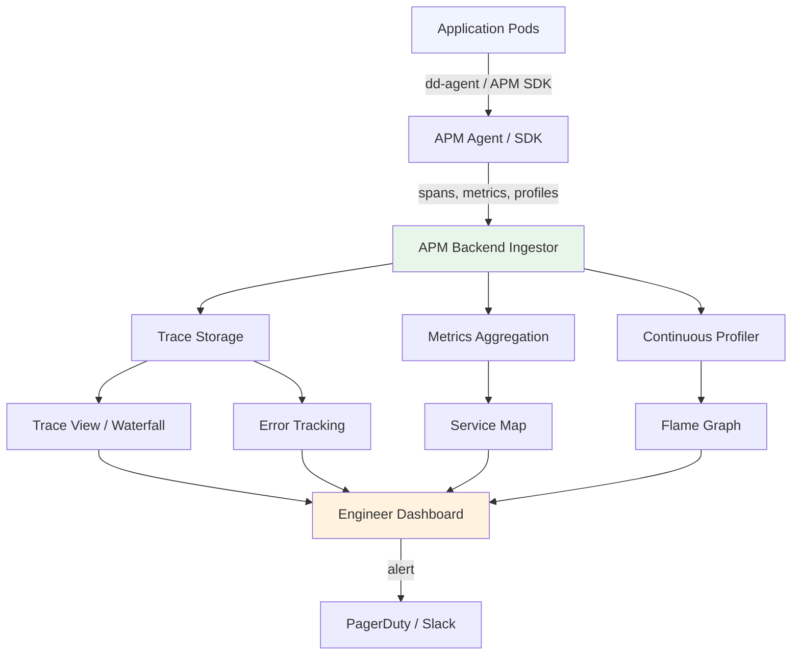

# APM Platforms: Datadog vs New Relic vs Dynatrace

**Your app has a memory leak. It shows up as slow P99 latency every 6 hours, then a pod restart, then fine again. Without APM, you spend 2 days reading code. With Datadog APM, you see it in 5 minutes: the continuous profiler's flame graph shows `UserCache` growing 200MB/hour. One object type. One fix. That is the difference between APM and no APM — not dashboards, not alerts, but the ability to go from "something is wrong" to "here is exactly where and why" before your on-call rotation burns out.**

---

## The Problem Class `[Senior]`

Server metrics (CPU, memory, request count) tell you *that* something is wrong. APM tells you *what* and *where*. The gap between these two is measured in hours of debugging time.

Classic scenario: your order service is slow. CPU is at 40%. Memory is steady. Request count is normal. P99 latency has crept from 120ms to 1.8 seconds over the past week. You grep logs: all requests succeed. You read the code for 4 hours: nothing obvious.

With APM, you pull up the distributed trace for a slow request and see: `ProductRecommendationService.getRecommendations()` is the culprit — it's making 47 database queries per request (N+1 problem introduced by a new feature 6 days ago). Total fix time: 20 minutes.



### What APM Actually Does

APM instruments your application code — either automatically via monkey-patching or manually via SDK — and captures:

1. **Distributed traces**: the full request journey across services with timing per span
2. **Continuous profiling**: CPU/memory flame graphs sampled at runtime, no code changes needed
3. **Error tracking**: grouped, deduplicated, with full stack traces and context
4. **Service maps**: automatically-generated topology of which services call which
5. **Database query analysis**: slow queries, N+1 detection, query plans
6. **Log correlation**: inject trace_id into logs so you can jump from trace → logs instantly

---

## Platform Comparison

Honest comparison, not marketing:

| Feature | Datadog | New Relic | Dynatrace | OTel + Jaeger + Prometheus |
|---------|---------|-----------|-----------|--------------------------|
| Distributed tracing | Yes | Yes | Yes | Yes |
| Continuous profiler | Yes | Yes | Yes | No (need Pyroscope) |
| Service map (auto) | Yes | Yes | Yes (best) | Partial (manual labels) |
| Log correlation | Yes (trace_id auto-inject) | Yes | Yes | Manual setup |
| Real User Monitoring | Yes | Yes | Yes | No |
| Database query analysis | Yes | Yes | Yes | No |
| Infrastructure monitoring | Yes | Yes | Yes | Prometheus |
| Cost at 10 services | $$$  (~$200-400/mo) | $$ (~$100-200/mo) | $$$$ (~$500-1000/mo) | $ (infra only) |
| Setup complexity | Medium | Easy | Hard (agent heavy) | High (glue everything) |
| Auto-instrumentation | Yes (dd-trace) | Yes (newrelic npm) | Yes (OneAgent) | Partial (OTel auto) |
| AI/anomaly detection | Yes (Watchdog) | Yes (Applied Intelligence) | Yes (Davis AI) | No |
| On-premise option | No | No | Yes | Yes (self-hosted) |
| Vendor lock-in | High | High | Very High | None |

### When to Choose What

**Choose Datadog if:**
- You are a startup or mid-size company that wants everything working out of the box
- You already use AWS/GCP/Azure and want one vendor for infra + APM + logs
- Your team is small and you cannot afford to babysit infrastructure
- You need fast time-to-value (tracing works in 10 minutes with dd-trace)

**Choose New Relic if:**
- Cost is a primary concern at scale (cheaper per host, especially for large fleets)
- You have developers who want to write NRQL queries (SQL-like, very powerful)
- You need a strong browser/mobile RUM story
- Your team prefers configuration over magic

**Choose Dynatrace if:**
- Enterprise contract with complex compliance requirements (SOC2, HIPAA, PCI)
- Full AWS/Azure autodiscovery with zero configuration (OneAgent literally figures out your topology)
- You want AI-driven root cause analysis that actually works (Davis is genuinely impressive)
- Budget is not a constraint

**Choose OpenTelemetry + Jaeger/Tempo + Prometheus if:**
- You own your data pipeline end to end (financial services, healthcare)
- Cost at scale is prohibitive (sampling 100B spans/day to a vendor = $50K+/month)
- You already have a mature platform team that can run the infrastructure
- You want zero vendor lock-in and standard APIs across all services

---

## Datadog Deep Dive

### Auto-Instrumentation with dd-trace

Datadog's `dd-trace` library auto-patches common Node.js libraries (Express, HTTP, pg, redis, mongoose, etc.) with zero code changes:

```javascript
// app.js — must be the FIRST require in your entire application
require('dd-trace').init({
  service: 'order-service',
  env: process.env.NODE_ENV,           // 'production', 'staging', 'dev'
  version: process.env.APP_VERSION,    // '1.4.2' — enables deployment tracking

  // Sampling: trace 100% of errors, 10% of normal traffic
  sampleRate: 0.1,
  runtimeMetrics: true,                // JVM-style runtime metrics (GC, heap, etc.)

  // Profiling: continuous CPU + memory profiles, no restart needed
  profiling: true,

  // Log injection: inject trace_id into every log line automatically
  logInjection: true,

  // APM → infrastructure correlation
  analytics: true,
});

// Everything after this is auto-instrumented
const express = require('express');
const { Pool } = require('pg');
// dd-trace patches these at require time — no other changes needed
```

After this single line, every HTTP request, database query, Redis call, and outbound HTTP gets a span automatically. No other code changes required.

### Custom Spans for Business Logic

Auto-instrumentation captures infrastructure calls, but your business logic is invisible to it. Add custom spans for operations that matter:

```javascript
const tracer = require('dd-trace');

async function processOrder(orderId, userId) {
  // Create a child span under the active trace
  const span = tracer.startSpan('order.process', {
    childOf: tracer.scope().active(),
  });

  span.setTag('order.id', orderId);
  span.setTag('user.id', userId);
  span.setTag('order.type', 'standard');

  try {
    // Inner operations get their own spans (auto if using pg/redis)
    const inventory = await checkInventory(orderId);
    span.setTag('inventory.items_checked', inventory.length);

    const payment = await chargePayment(orderId, userId);
    span.setTag('payment.amount_cents', payment.amountCents);
    span.setTag('payment.method', payment.method);

    span.finish();
    return { inventory, payment };
  } catch (err) {
    // Mark span as error — shows in APM error tracking
    span.setTag('error', true);
    span.setTag('error.message', err.message);
    span.setTag('error.stack', err.stack);
    span.finish();
    throw err;
  }
}
```

### Custom Metrics with DogStatsD

For business metrics that need to be APM-correlated:

```javascript
const StatsD = require('hot-shots');

const dogstatsd = new StatsD({
  host: process.env.DD_AGENT_HOST || 'localhost',
  port: 8125,
  prefix: 'orderservice.',
  globalTags: {
    env: process.env.NODE_ENV,
    service: 'order-service',
    version: process.env.APP_VERSION,
  },
});

// Counter: how many orders processed
dogstatsd.increment('orders.processed', 1, { payment_method: 'card' });

// Histogram: distribution of order values
dogstatsd.histogram('order.value_cents', orderAmountCents, { tier: userTier });

// Gauge: current queue depth
dogstatsd.gauge('order.queue.depth', queueDepth);

// Timing: measure a specific operation
const start = Date.now();
await fulfillOrder(orderId);
dogstatsd.timing('order.fulfillment_ms', Date.now() - start);
```

### APM → Logs Correlation

This is the killer feature. When investigating a trace, you want to jump directly to the logs from that specific request — not grep for it manually:

```javascript
const tracer = require('dd-trace');
const pino = require('pino');

// With logInjection: true in dd-trace.init(), trace_id is auto-injected
// But you can also do it manually for full control:
const logger = pino({
  mixin() {
    // dd-trace injects dd.trace_id, dd.span_id, dd.service, dd.env, dd.version
    const span = tracer.scope().active();
    if (span) {
      return {
        'dd.trace_id': span.context().toTraceId(),
        'dd.span_id': span.context().toSpanId(),
        'dd.service': 'order-service',
        'dd.env': process.env.NODE_ENV,
        'dd.version': process.env.APP_VERSION,
      };
    }
    return {};
  },
});

// Every log line now has dd.trace_id
logger.info({ order_id: orderId, user_id: userId }, 'Order created');
// Output: {"level":30,"msg":"Order created","order_id":"ord_123","user_id":"usr_456",
//          "dd.trace_id":"3626764117854341595","dd.span_id":"573445723742234371",...}
```

In Datadog: open any trace → click "View Logs" → instantly see all log lines from that exact request, across all services.

### Reading the Service Map

The service map auto-generates from trace data. How to read it:
- **Node size**: proportional to request volume
- **Edge thickness**: proportional to call frequency between services
- **Edge color**: green (healthy) → yellow (degraded) → red (error rate > threshold)
- **Node ring color**: same health signal
- **Click a node**: see that service's error rate, P99 latency, throughput for the selected time window
- **Click an edge**: see the trace waterfall for calls between those two services

Workflow during incident: service map → red node → click → P99 latency chart → drill into slowest traces → find root cause.

### Continuous Profiler

The profiler samples your running application (CPU, heap allocations, memory leaks) at low overhead (~2-5% CPU) without any code changes. Unlike CPU profiles you take manually, it runs 24/7 in production:

- **CPU flame graph**: shows which functions consume the most CPU time. If `bcrypt.hash` is 60% of your CPU, you see it immediately
- **Memory allocation graph**: shows which code paths allocate the most memory — the killer for finding memory leaks
- **Lock contention**: Node.js async contention patterns

To find the memory leak from the hook: go to Profiler → Memory Allocations → Timeline. `UserCache.set()` accounts for 180MB of allocations over 6 hours. The cache has no eviction policy. Fix: add `maxSize: 1000` to the LRU cache constructor.

---

## New Relic Deep Dive

### Setup

```javascript
// newrelic.js — same pattern, must be first require
'use strict';

exports.config = {
  app_name: ['order-service'],
  license_key: process.env.NEW_RELIC_LICENSE_KEY,

  distributed_tracing: {
    enabled: true,
  },

  // Code-level metrics: link traces back to source code lines
  code_level_metrics: {
    enabled: true,
  },

  // Log forwarding: ship logs directly from the agent
  application_logging: {
    enabled: true,
    forwarding: {
      enabled: true,
      max_samples_stored: 10000,
    },
    local_decorating: {
      enabled: true,  // inject trace_id into local log lines too
    },
  },

  logging: {
    level: 'info',
  },
};
```

Then in app.js:
```javascript
require('newrelic');  // Must be FIRST
const express = require('express');
// Everything auto-instrumented from here
```

### Custom Instrumentation

```javascript
const newrelic = require('newrelic');

async function processOrder(orderId, userId) {
  // Wrap function in a custom segment (like a Datadog span)
  return newrelic.startSegment('order.process', true, async () => {
    // Add custom attributes to the current transaction
    newrelic.addCustomAttributes({
      'order.id': orderId,
      'user.id': userId,
      'order.type': 'standard',
    });

    try {
      const result = await fulfillOrder(orderId);
      newrelic.addCustomAttribute('fulfillment.success', true);
      return result;
    } catch (err) {
      // New Relic auto-captures errors, but you can add context
      newrelic.noticeError(err, {
        'order.id': orderId,
        'user.id': userId,
        'context': 'order-fulfillment',
      });
      throw err;
    }
  });
}

// Record custom events for NRQL querying
newrelic.recordCustomEvent('OrderProcessed', {
  orderId,
  userId,
  amountCents,
  paymentMethod,
  processingTimeMs,
});
```

### NRQL Queries

NRQL is New Relic's query language. It is genuinely powerful — SQL-like, easy to learn:

```sql
-- P99 latency for order-service endpoints, last hour
SELECT percentile(duration, 99) AS 'P99 Latency (ms)'
FROM Transaction
WHERE appName = 'order-service'
FACET request.uri
SINCE 1 hour ago
TIMESERIES 5 minutes

-- Error rate by service, last 24h
SELECT percentage(count(*), WHERE error IS TRUE) AS 'Error Rate %'
FROM Transaction
WHERE appName LIKE 'order%' OR appName LIKE 'payment%'
FACET appName
SINCE 24 hours ago

-- Find all slow DB queries (>500ms) in the last hour
SELECT average(duration), count(*), max(duration)
FROM DatastoreSegment
WHERE duration > 0.5  -- seconds
FACET statement
SINCE 1 hour ago
ORDER BY average(duration) DESC
LIMIT 20

-- Business metric: orders by payment method, hourly
SELECT count(*) AS 'Orders'
FROM OrderProcessed
FACET paymentMethod
SINCE 7 days ago
TIMESERIES 1 hour

-- Apdex score by deployment version (track regressions)
SELECT apdex(duration, 0.5) AS 'Apdex Score'
FROM Transaction
WHERE appName = 'order-service'
FACET appVersion
SINCE 2 weeks ago
TIMESERIES 1 day
```

---

## Production Patterns

### Pattern 1: Deployment Tracking

Both Datadog and New Relic support deployment markers — vertical lines on every time-series graph showing when you deployed. This is mandatory for correlating "when did latency get worse" with "what did we ship":

```javascript
// In your CI/CD pipeline after deploy (Datadog)
const https = require('https');

function recordDeployment({ service, version, env, user }) {
  const data = JSON.stringify({
    series: [{
      metric: 'deployment',
      points: [[Math.floor(Date.now() / 1000), 1]],
      tags: [`service:${service}`, `version:${version}`, `env:${env}`, `deployer:${user}`],
      type: 'count',
    }],
  });

  // Also create a Datadog Event (shows in dashboards as annotation)
  const eventData = JSON.stringify({
    title: `Deploy ${service} ${version}`,
    text: `${service} deployed to ${env} by ${user}`,
    tags: [`service:${service}`, `version:${version}`, `env:${env}`],
    alert_type: 'info',
  });

  // POST to Datadog Events API
  // https://api.datadoghq.com/api/v1/events
}
```

### Pattern 2: Error Grouping and Noise Reduction

Raw error tracking without grouping is noise. Configure intelligent grouping:

```javascript
const tracer = require('dd-trace');

// Custom error fingerprinting: group errors by code, not by stack frame
app.use((err, req, res, next) => {
  const span = tracer.scope().active();
  if (span) {
    span.setTag('error', true);
    span.setTag('error.type', err.constructor.name);
    span.setTag('error.code', err.code || 'UNKNOWN');  // Group by error code
    span.setTag('error.message', err.message);

    // Fingerprint: group same error code across different stack traces
    span.setTag('error.fingerprint', `${err.constructor.name}:${err.code}`);
  }

  logger.error({
    error_code: err.code,
    error_type: err.constructor.name,
    request_id: req.id,
    user_id: req.user?.id,
    path: req.path,
  }, err.message);

  res.status(err.statusCode || 500).json({ error: err.message });
});
```

### Pattern 3: SLO-Driven APM Dashboards

Set up APM around your SLOs, not around infrastructure:

```
SLO: 99.9% of /checkout requests complete in <500ms

Monitor in APM:
- Error rate monitor: alert if error rate > 0.1% over 5min rolling window
- Latency monitor: alert if P99 > 500ms for 3 consecutive minutes
- Anomaly monitor: alert if request rate drops >30% (sudden traffic loss)
- Forecast: alert if memory allocation trend will exhaust heap in <2h
```

---

## Common Mistakes

**Mistake 1: Trusting auto-instrumentation alone**
Auto-instrumentation captures HTTP and DB. Your business logic — `calculateShipping()`, `applyDiscount()`, `validateInventory()` — is invisible. Add custom spans for operations that matter to your SLOs.

**Mistake 2: Sampling too aggressively**
Setting `sampleRate: 0.01` (1%) means the one request with a bug you need to debug will likely not be sampled. Use head-based sampling with higher rates for error traces: sample 100% of errors, 1-10% of successes.

**Mistake 3: Not pinning your APM library version**
APM libraries monkey-patch your runtime. `dd-trace@4` vs `dd-trace@5` can behave differently. Pin exact versions in `package.json` and test upgrades in staging first.

**Mistake 4: Ignoring the continuous profiler**
Most teams enable traces but forget profiling. The continuous profiler is what finds memory leaks, CPU hogs, and garbage collection pressure — problems that are nearly invisible in trace data alone.

**Mistake 5: No log correlation**
APM and logs in separate systems with no way to link them. You see a slow trace, you want to know what it logged. Without trace_id in logs, this requires manual timestamp correlation — painful and error-prone.

**Mistake 6: Using APM as a debugging tool only**
APM is a *prevention* tool. Configure anomaly monitors, forecast monitors, and deployment tracking. The goal is to know about problems before users do, not to debug after the incident.

---

## Real-World Context

**Stripe** uses Datadog APM across their payments infrastructure. Their engineering blog describes using APM service maps to identify which internal services were adding latency to the critical payment path during load. They set SLO monitors on P99 latency per endpoint and use deployment tracking to catch regressions within minutes of shipping.

**LinkedIn** runs New Relic on parts of their stack. They wrote about using NRQL-based custom dashboards to track member engagement metrics alongside infrastructure performance — correlating deployment events with drops in profile view completion rates.

**The tradeoff neither vendor tells you**: at 1000 services with 100K hosts, Datadog pricing can reach $1-2M/year. At that scale, many companies build hybrid setups: Datadog for critical paths (payment, auth), OpenTelemetry + Grafana Tempo for high-volume less-critical services. The economics only make sense when you own your stack.

---

## Key Takeaways

- **APM = traces + profiling + error tracking + service map**. All four together. Missing any one limits what you can diagnose.
- **Auto-instrumentation handles infrastructure. You own business logic.** Add custom spans for anything that maps to an SLO.
- **The continuous profiler finds what traces cannot**: memory leaks, CPU hotspots, GC pressure.
- **Log correlation is non-negotiable in production.** Inject trace_id into every log line from day one.
- **Datadog for speed, New Relic for cost, Dynatrace for enterprise auto-discovery, OTel for data ownership.** Choose based on your constraints, not benchmarks.
- **APM is a prevention tool, not just a debugging tool.** Configure monitors. Track deployments. Get paged before users notice.
