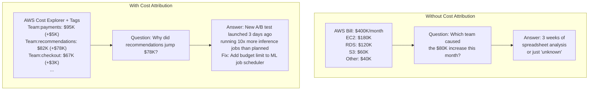
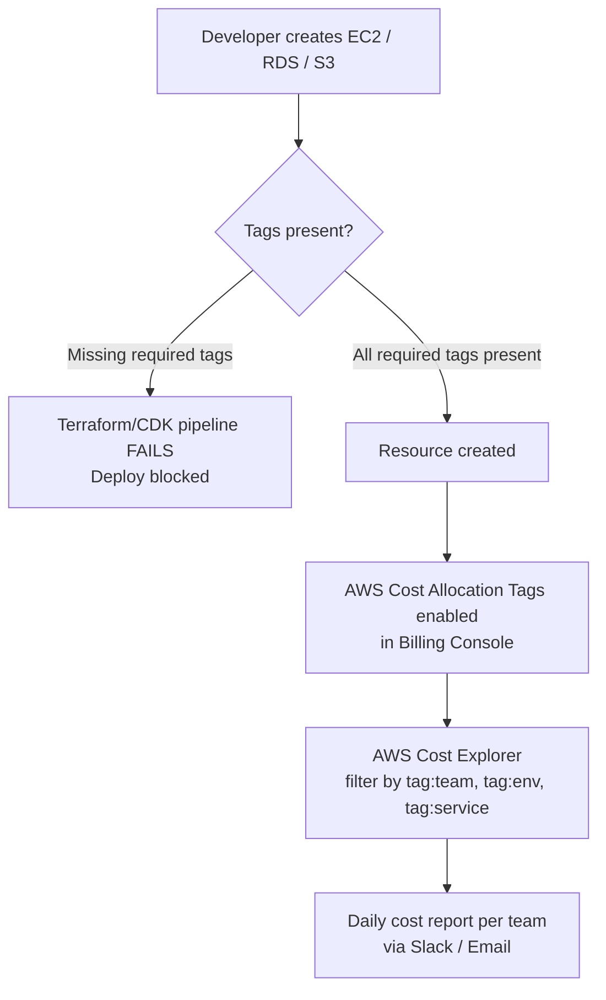
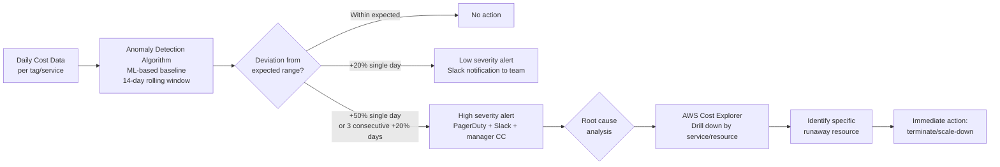
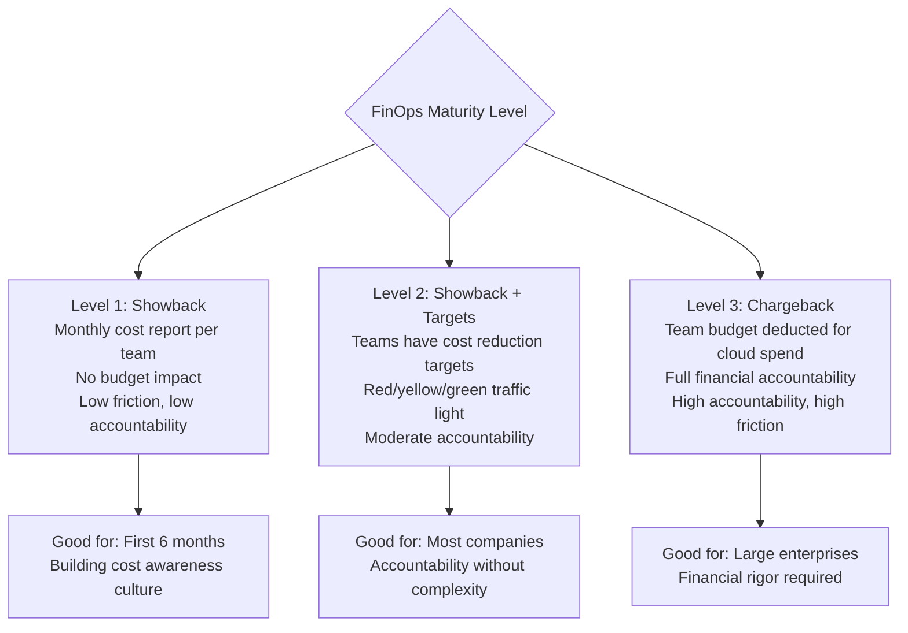
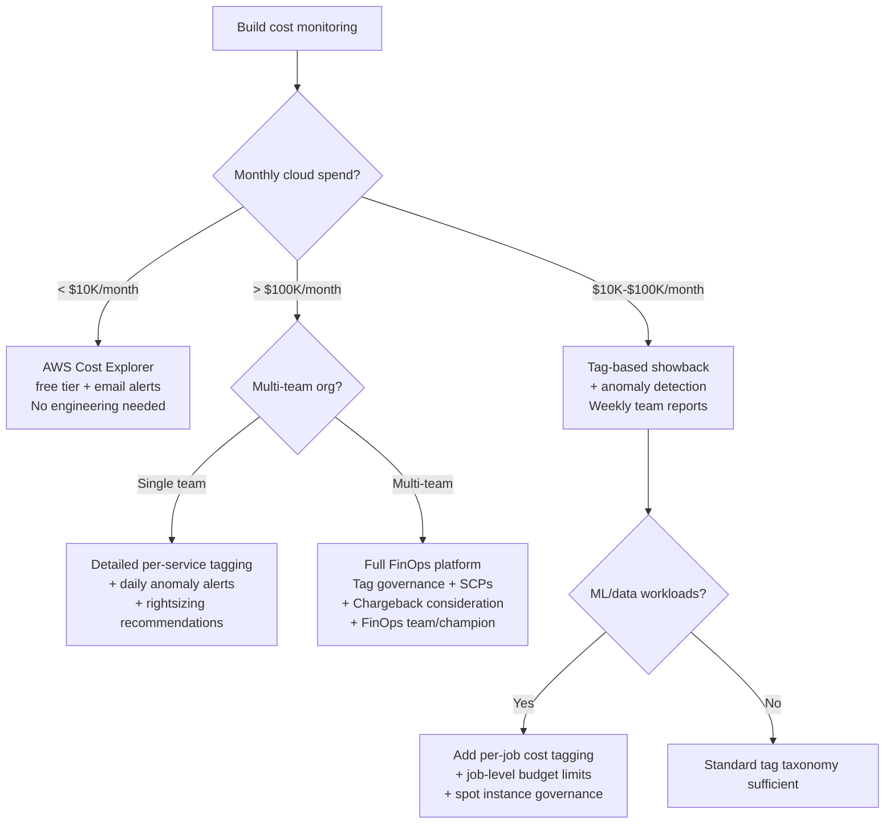

# Cloud Cost Monitoring: Attribution, Anomaly Detection, and FinOps Culture

**Your AWS bill increased $180,000 in one month. Finance wants to know why. Engineering says "probably something scaled up." Neither can point to the specific service, team, or feature that caused it.** This is the FinOps gap: teams build and deploy freely, but cost accountability is murky, retrospective, and therefore unactionable. By the time you see the bill, the expensive workload has been running for 30 days.

The solution is not budget alerts (reactive). It is cost attribution architecture that makes every team's spend visible in real time, with anomaly detection that catches runaway workloads within hours — not months.

---

## The Problem Class `[Mid]`

Your company runs 200 services across 15 teams on AWS. Monthly spend: $400,000. The billing dashboard shows a bar chart by service (EC2, RDS, S3) — not by team, product feature, or customer segment. When spend increases 20% month-over-month, nobody knows whether it's Team A's new ML workload, Team B's database not being cleaned up, or organic traffic growth.



> 💡 **What this means in practice:** Without tags on AWS resources, cost data is grouped by service type (EC2, RDS) not by who owns what. You can't answer "did Team X's new feature cost us $50K this month?" — which means teams have no financial accountability for their architectural choices.

**The cost attribution gap is a structural problem**: AWS charges by resource (EC2 instance, RDS cluster, S3 bucket), but engineering teams own by feature and product. Bridging this requires a tagging strategy enforced at resource creation time.

---

## Why the Obvious Solution Fails `[Senior]`

### Naive Approach: Monthly Budget Alerts

"Set a monthly budget alert at $500K, get an email if we exceed it." Problems:
- Alert fires at end of month — 30 days of overspend already happened
- Alert fires at account level — no attribution to which team/service
- No actionable information: "you spent $520K" — what do you do?
- Overspend on Day 5 that normalizes by Day 25 → no alert, no visibility

### Naive Approach: Tag Everything Manually

"Ask teams to tag their resources." Compliance rate: typically 40-60% in practice. The expensive workloads (new experiments, ML training) are disproportionately untagged because they're created quickly. The 40% untagged resources often contain 60% of the anomalous spend.

### The Real Problem: Cost Attribution Must Be Enforced at Provisioning Time

Manual tagging fails because:
1. Developers forget, especially under pressure
2. No consequence for missing tags
3. Resources created by automation (autoscaling, spot instances) often skip tag propagation
4. Compliance is invisible until audit time

**Fix**: Enforce tags via Infrastructure as Code (Terraform, CDK) — if no team tag, the IaC pipeline fails. Use AWS Service Control Policies (SCP) to deny resource creation without required tags.

---

## The Solution Landscape `[Senior]`

### Solution 1: Tagging Strategy Architecture

**What it is**

A taxonomy of mandatory tags applied to every AWS resource, enforced at provisioning time, that maps resource spend to business dimensions.

**How it actually works at depth**



After the diagram: A new resource without tags fails the deployment pipeline before it's created. This prevents the "40% untagged" problem that makes cost attribution useless.

**Required tag taxonomy**:

```
MANDATORY TAGS (deploy blocked if missing):
┌─────────────┬──────────────────────────────────┬───────────────────┐
│ Tag Key     │ Example Values                   │ Purpose           │
├─────────────┼──────────────────────────────────┼───────────────────┤
│ team        │ payments, recommendations, search │ Team attribution  │
│ environment │ production, staging, dev          │ Env cost split    │
│ service     │ checkout-api, fraud-ml, user-db   │ Service breakdown │
│ product     │ core-platform, growth, enterprise │ Product P&L       │
└─────────────┴──────────────────────────────────┴───────────────────┘

OPTIONAL TAGS (encouraged but not enforced):
┌───────────────┬──────────────────────────────────┬─────────────────────┐
│ Tag Key       │ Example Values                   │ Purpose             │
├───────────────┼──────────────────────────────────┼─────────────────────┤
│ experiment    │ true/false                       │ A/B test cost split │
│ customer      │ tenant_id (large enterprise only)│ Per-tenant cost     │
│ data-class    │ pii, public, internal            │ Compliance          │
│ cost-center   │ CC-1234                          │ Finance system link │
└───────────────┴──────────────────────────────────┴─────────────────────┘
```

**Enforcement via Terraform module**:

```python
# Pseudocode: Terraform module pattern that enforces tagging

# base_module/main.tf (every team uses this module)
variable "required_tags" {
  description = "Tags required for cost attribution"
  type = object({
    team        = string  # Must be in approved team list
    environment = string  # Must be: production | staging | dev
    service     = string  # Your service name
    product     = string  # Your product area
  })

  validation {
    condition     = contains(["payments", "checkout", "recommendations", "search"], var.required_tags.team)
    error_message = "team tag must be one of the approved values"
  }
}

# Apply to all resources automatically
locals {
  common_tags = merge(var.required_tags, {
    managed-by = "terraform"
    last-updated = timestamp()
  })
}

resource "aws_instance" "app" {
  tags = local.common_tags  # Always inherited
}

# SCP (Service Control Policy) as last line of defense:
# Deny any EC2/RDS/S3 creation request without required tags
# This catches resources created outside Terraform (manual console clicks)
```

**Sizing guidance** `[Staff+]`

```
Tag coverage rate = tagged resources / total resources × 100%
Target: > 95% by cost (not by count — an untagged ML instance may be 40% of cost)

Measurement:
AWS Config Rule: "required-tags" built-in rule
Fires if any EC2, RDS, S3 resource missing mandatory tags

AWS Cost Explorer: filter by "No Tag: team" to see unattributed spend
Target: < 5% of monthly spend in "no tag" bucket

Remediation SLA:
> 5% untagged spend: team receives Slack alert, 48h to tag or decommission
> 15% untagged spend: FinOps team escalates to engineering manager
```

**Failure modes** `[Staff+]`

- **Tag propagation gaps**: EC2 Auto Scaling launches instances from launch templates. If the launch template doesn't include tags, new instances are untagged even if the Auto Scaling Group is tagged. Fix: Propagate tags at ASG level AND in launch template.
- **Spot interruption cleanup**: Spot instances interrupted by AWS are terminated without running Terraform destroy. The EBS volumes attached to them may remain, untagged. Fix: Enable EBS volume tag propagation from EC2 instance on creation.
- **Lambda function missing tags**: Lambda functions created via the AWS console (quick experiments) bypass Terraform and are created without tags. These experiments often turn into permanent workloads. Fix: Use AWS Organizations SCP to deny Lambda creation without required tags.

---

### Solution 2: Cost Anomaly Detection

**What it is**

AWS Cost Anomaly Detection (or custom alerting via Cost Explorer API) monitors spending patterns and alerts when costs deviate from expected range faster than monthly budgets catch it.

**How it actually works at depth**



After the diagram: The alert fires while the issue is still active — not at month end. The "drill down to specific resource" step is critical: you need to go from "Team:recommendations cost spiked" to "ML training job ml-job-20260315-experiment3 running 1,000 instances instead of 10."

**Custom anomaly detection (when AWS built-in is too coarse)**:

```python
# Pseudocode: daily cost anomaly detection
import boto3
from datetime import datetime, timedelta
import statistics

def detect_cost_anomalies(team: str, sensitivity_percent: float = 0.20):
    """
    Alert if today's cost is more than sensitivity_percent above
    the rolling 14-day average for this team.
    """
    cost_explorer = boto3.client('ce')

    # Fetch last 15 days of daily cost for this team
    response = cost_explorer.get_cost_and_usage(
        TimePeriod={
            'Start': (datetime.now() - timedelta(days=15)).strftime('%Y-%m-%d'),
            'End': datetime.now().strftime('%Y-%m-%d')
        },
        Granularity='DAILY',
        Filter={
            'Tags': {'Key': 'team', 'Values': [team]}
        },
        Metrics=['UnblendedCost']
    )

    daily_costs = [float(day['Total']['UnblendedCost']['Amount'])
                   for day in response['ResultsByTime']]

    today_cost = daily_costs[-1]
    baseline_14d = statistics.mean(daily_costs[:-1])  # Exclude today
    baseline_stddev = statistics.stdev(daily_costs[:-1])

    # Anomaly: today > baseline + 2 standard deviations OR > 20% increase
    threshold_statistical = baseline_14d + (2 * baseline_stddev)
    threshold_percent = baseline_14d * (1 + sensitivity_percent)
    threshold = min(threshold_statistical, threshold_percent)

    if today_cost > threshold:
        overspend = today_cost - baseline_14d
        alert_message = f"""
        COST ANOMALY DETECTED - Team: {team}
        Today: ${today_cost:.2f}
        14-day average: ${baseline_14d:.2f}
        Overspend: ${overspend:.2f} ({(overspend/baseline_14d)*100:.1f}% above baseline)

        Investigate: https://console.aws.amazon.com/cost-explorer/
        Filter by: tag:team = {team}, date: today
        """
        send_slack_alert(channel=f"#finops-{team}", message=alert_message)

        if overspend > 1000:  # $1K+ daily overspend → page
            send_pagerduty_alert(team_lead=get_team_lead(team), message=alert_message)

# Run this as a daily Lambda function triggered at 8am UTC
# Cost: ~$0 (Lambda free tier covers 1 invocation/day per team)
```

**Sizing guidance** `[Staff+]`

```
Sensitivity tuning:
- 10% threshold: Very sensitive, many false positives (normal traffic spikes, deploys)
- 20% threshold: Balanced, catches runaway workloads within 1 day
- 50% threshold: Only major anomalies, risk of missing gradual creep

Recommendation by team size:
  Small team (<5 engineers): 30% threshold (fewer workloads, stable spend)
  Medium team (5-20 engineers): 20% threshold
  Large team (20+ engineers, ML/data workloads): 15% threshold + dollar floor
    (alert only if overspend > $500/day AND > 15% above baseline)
    (prevents alerts on $10 spikes for low-spend teams)

Dollar-based thresholds (replace percent for high-variance workloads):
  ML training teams: alert if single job cost > $500 (regardless of baseline)
  Data pipeline teams: alert if daily Glue/EMR > $1,000
  Teams with autoscaling: use 7-day avg instead of 14-day (avoids seasonal bias)
```

**Failure modes** `[Staff+]`

- **Holiday baseline contamination**: Your 14-day baseline includes Christmas week (low spend) and New Year (high spend). Sensitivity calculation is skewed. Fix: Use median instead of mean, or explicitly exclude known holiday windows from baseline.
- **Legitimate traffic spike masks as anomaly**: Black Friday intentionally spikes 5x. Alert fires correctly but is noise. Fix: Add scheduled suppression for planned traffic events, or create separate "event mode" baselines.
- **Anomaly detection latency**: AWS Cost Explorer data has a 24-48 hour lag. A runaway job started Monday is not visible until Wednesday. Fix: Use AWS CloudWatch metrics for near-real-time signal (EC2 instance count, Lambda invocations) as leading indicators before cost data arrives.

---

### Solution 3: Showback vs Chargeback

**What it is**

Showback: teams see their costs (visibility, no consequences). Chargeback: teams pay for their costs from their budget (accountability, financial consequences).



> 💡 **What this means in practice:** Most startups and scale-ups should start with showback. Chargeback requires complex internal billing systems and can create perverse incentives (teams minimize cloud spend at the cost of reliability). Showback with targets achieves 80% of the accountability with 20% of the overhead.

---

## Trade-off Matrix `[Senior]` → `[Staff+]`

| Dimension | No Attribution | Tag-Based Showback | Chargeback | Per-Tenant Attribution |
|---|---|---|---|---|
| Visibility | None | Team/service level | Team/service level | Customer-level |
| Accountability | None | Soft (reports only) | Hard (budget impact) | Very high |
| Implementation effort | 0 | Medium (tag governance) | High (billing system) | Very High |
| Operational overhead | None | Low (automated reports) | High (disputes) | High |
| False positive alerts | N/A | Medium (20%) | Low (5%) | Low |
| Best for | Pre-PMF startups | Growth stage | Public companies | SaaS per-tenant pricing |

---

## Decision Framework `[Senior]` → `[Staff+]`



---

## Production Failure Story `[Staff+]`

**The $180K Debugging Session — SaaS Platform, Series C**

A B2B SaaS company ran a machine learning recommendation system. A senior engineer was debugging a performance issue and launched a large-scale data processing job to profile the model. The job used AWS Batch with 500 x c5.4xlarge instances ($0.68/instance/hour). The engineer forgot to set a job timeout and went on vacation.

The job ran for 12 days.

Cost: 500 × $0.68 × 24 × 12 = $97,920. In the same period, a staging environment used for a cancelled project continued running 20 RDS instances at $0.40/hour each: 20 × $0.40 × 24 × 14 = $2,688. Total unnecessary spend in the billing period: ~$100K.

Neither was caught until the AWS bill arrived 30 days later.

**What went wrong**:
1. No per-job cost tagging (the Batch job had no `team` or `experiment` tag)
2. No daily anomaly detection (would have fired Day 2 when spend jumped 60%)
3. No job timeout enforcement (Batch jobs defaulted to no timeout)
4. No automated cleanup for idle staging environments

**Changes after**:
```python
# Pseudocode: AWS Batch job submission with mandatory guardrails
def submit_batch_job(job_name: str, team: str, max_runtime_hours: int = 24):
    """
    Wrapper that enforces cost governance on Batch job submission.
    """
    if max_runtime_hours > 48:
        raise ValueError(f"Job runtime > 48h requires manager approval. Open a ticket.")

    estimated_cost = estimate_batch_cost(
        instance_type=get_optimal_instance(job_name),
        instance_count=get_instance_count(job_name),
        runtime_hours=max_runtime_hours
    )

    if estimated_cost > 1000:  # $1,000 threshold
        require_approval(
            approver=get_team_lead(team),
            message=f"Job {job_name} estimated cost: ${estimated_cost:.2f}"
        )

    return batch_client.submit_job(
        jobName=job_name,
        tags={
            'team': team,
            'experiment': 'true',
            'max-cost-estimate': str(estimated_cost)
        },
        timeout={'attemptDurationSeconds': max_runtime_hours * 3600},  # Hard timeout
    )

# Automation: terminate idle staging environments
def cleanup_idle_environments():
    """Run daily. Terminate RDS/EC2 in staging not accessed in 7 days."""
    for env in get_all_staging_environments():
        if env.last_access_days > 7:
            send_slack(f"Staging env {env.name} idle for {env.last_access_days} days. Terminating in 24h.")
            schedule_termination(env, hours=24)
```

---

## Observability Playbook `[Staff+]`

### FinOps Dashboard Requirements

```promql
# These are AWS Cost Explorer API queries, not Prometheus, but the logic:

# 1. Daily spend by team (rolling 7 days)
GET /getCostAndUsage?
  granularity=DAILY&
  filter=tag:environment=production&
  groupBy=tag:team&
  metrics=UnblendedCost

# 2. Month-to-date spend vs monthly forecast
# Forecast = MTD spend / days_elapsed × total_days_in_month
# Alert if forecast > budget × 1.1

# 3. Top 10 most expensive resources this month
GET /getCostAndUsage?
  groupBy=RESOURCE&
  sortBy=UnblendedCost&
  limit=10

# 4. Rightsizing opportunity metric
# AWS Compute Optimizer recommendation count
aws compute-optimizer get-ec2-instance-recommendations --filter code=Overprovisioned
# Alert if potential monthly savings > $1,000

# 5. Untagged resource spend (should be < 5%)
GET /getCostAndUsage?
  filter=tag:team=ABSENT&
  metrics=UnblendedCost
```

---

## Architectural Evolution `[Staff+]`

```
Phase 1 (< $10K/month): AWS native
- Enable AWS Cost Explorer free tier
- Set monthly budget alert via AWS Budgets ($0.02/budget/month)
- Enable Cost Allocation Tags in billing console
- No engineering investment needed

Phase 2 ($10K-$100K/month): Tag governance + daily alerts
- Enforce tags in Terraform modules
- AWS SCP to deny untagged resource creation
- Daily Lambda function for anomaly detection
- Weekly Slack cost digest per team
- Engineering investment: ~40 hours setup

Phase 3 ($100K+/month): FinOps platform
- Cloud Custodian for automated governance (tag, terminate idle)
- Internal cost dashboard (Grafana + Cost Explorer API)
- Chargeback system if multi-team accountability needed
- FinOps champion role in each team
- Commitment-based savings (RIs, Savings Plans) when patterns stabilize
- Engineering investment: ~200 hours + ongoing FinOps role

Phase 4 (2026): Per-feature cost attribution
- Trace IDs linked to cloud resources (which trace triggered which Lambda/Batch job)
- Feature flag → cost correlation (this A/B test costs $X/day more than baseline)
- AI-powered rightsizing recommendations with one-click apply
- eBPF-based resource utilization for granular cost efficiency metrics
```

---

## Decision Framework Checklist `[All Levels]`

- [ ] Do all AWS resources have mandatory team, environment, service, and product tags?
- [ ] Is tag compliance enforced at provisioning time (Terraform pipeline fails without tags)?
- [ ] Is there an AWS SCP blocking resource creation without required tags?
- [ ] Do teams receive daily cost reports filtered to their tag?
- [ ] Is daily anomaly detection configured with appropriate sensitivity thresholds?
- [ ] Are ML/data workloads protected with job timeouts and per-job cost caps?
- [ ] Is staging environment cleanup automated (terminate idle environments after 7 days)?
- [ ] Is untagged spend monitored? (Target: < 5% of monthly spend)
- [ ] Have you run AWS Compute Optimizer and addressed top rightsizing recommendations?
- [ ] Do you have a FinOps review ritual (weekly for engineering, monthly for leadership)?

*Written by Gaurav Porwal — 10+ Year Engineer | Tech Lead | Product Owner | Business-Minded Builder*
*Last updated: 2026-03-18*
