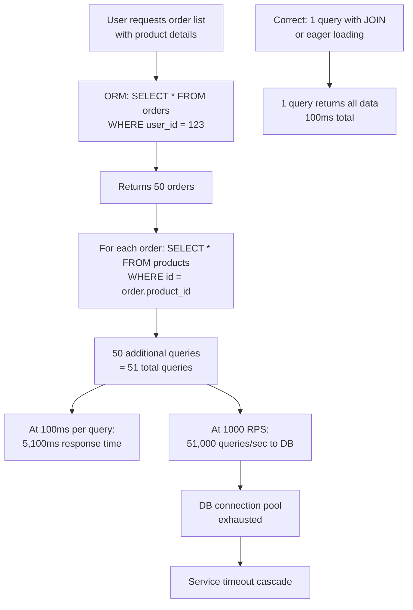
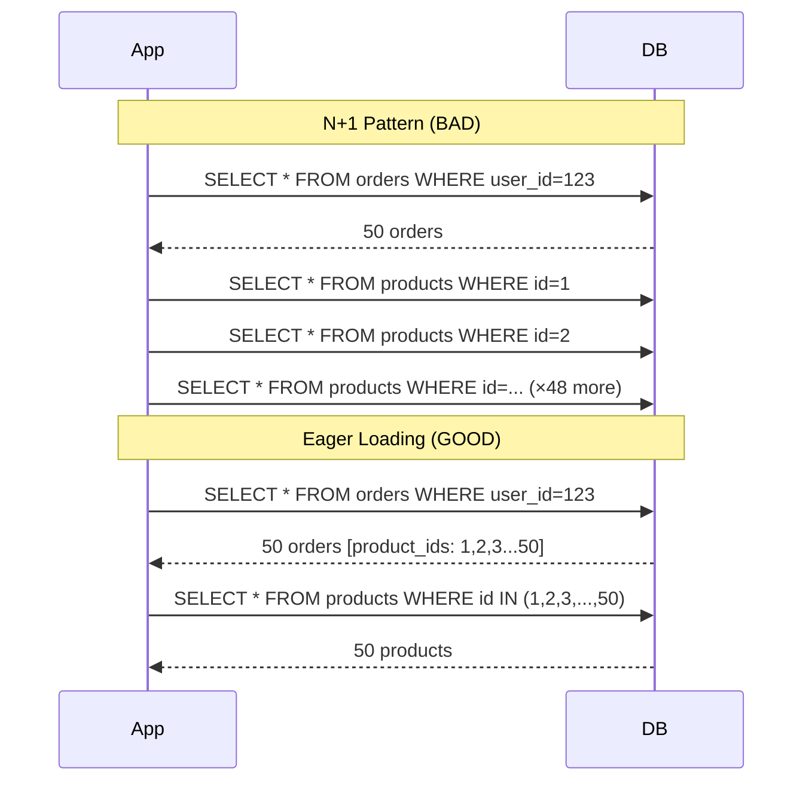
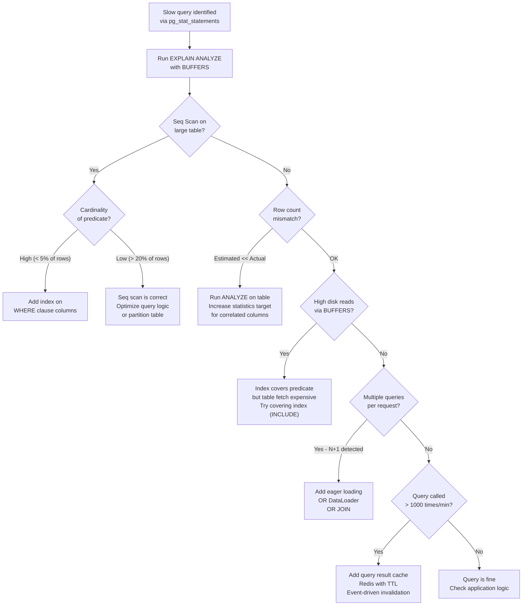

# Database Query Performance: Slow Query Analysis, Index Hints, and N+1 Prevention

**A single unmissed N+1 query pattern under production load can take a service from 50ms to 8,000ms response time at scale — and it will show up as "application slow" in your metrics, not "database slow."** Database query performance failures are the most common source of production latency regressions that look like everything except what they are.

---

## The Problem Class `[Mid]`

Three failure modes account for 80% of database-caused latency regressions:

1. **Missing or unused index**: Full table scan on a 10M-row table instead of an index seek
2. **N+1 query pattern**: Loading N related records with N separate queries instead of 1 JOIN
3. **Lock contention**: Write transaction holding row locks while slow queries run



**The N+1 cost formula**:

```
N+1 cost = latency_per_query × (1 + N)
1+1 cost = latency_per_query × 2

Cost ratio = (1 + N) / 2

For N=50 orders: cost ratio = 51/2 = 25.5×
At 100ms per query:
  N+1: 5,100ms
  Optimized: 200ms
```

---

## Why the Obvious Solution Fails `[Senior]`

**Adding indexes to every column** is the instinct after finding a slow query. It fails because:

1. **Write amplification**: Every INSERT/UPDATE/DELETE must update all indexes on the table. A table with 10 indexes has 10× write overhead. At high write rates, this causes lock contention and replication lag.

2. **Index bloat**: Indexes consume disk space and memory. PostgreSQL's `shared_buffers` has finite capacity. Unused indexes compete for buffer cache space with the data pages they're supposed to speed up.

3. **Planner confusion**: PostgreSQL's query planner uses statistics to choose execution plans. Partial correlation between indexes (two separate indexes that each cover half a WHERE clause but neither covers both) can cause the planner to make suboptimal choices.

**Using EXPLAIN without ANALYZE** shows the planned cost, not the actual execution. The planner's cost estimates can be off by orders of magnitude for correlated predicates, custom data types, or stale statistics.

---

## The Solution Landscape `[Senior]`

### Solution 1: pg_stat_statements — Finding What's Actually Slow

**What it is**

`pg_stat_statements` is a PostgreSQL extension (enabled by default in managed services like RDS, Aurora, Cloud SQL) that records execution statistics for every unique query pattern. It is the mandatory starting point for query performance analysis.

**How it actually works at depth**

`pg_stat_statements` normalizes queries (replacing literal values with `$1`, `$2`) and tracks cumulative calls, total time, mean time, standard deviation, rows, block reads/writes, and WAL activity per unique normalized query.

```sql
-- Enable (if not already enabled)
CREATE EXTENSION IF NOT EXISTS pg_stat_statements;

-- Top 10 queries by total time (the real cost to your system)
SELECT
    round(total_exec_time::numeric, 2) AS total_ms,
    calls,
    round(mean_exec_time::numeric, 2) AS mean_ms,
    round(stddev_exec_time::numeric, 2) AS stddev_ms,
    round((total_exec_time / sum(total_exec_time) OVER ()) * 100, 2) AS pct_total,
    left(query, 120) AS query
FROM pg_stat_statements
ORDER BY total_exec_time DESC
LIMIT 10;

-- Top queries by calls (high-frequency queries — N+1 candidates)
SELECT
    calls,
    round(mean_exec_time::numeric, 2) AS mean_ms,
    round(total_exec_time::numeric, 2) AS total_ms,
    left(query, 120) AS query
FROM pg_stat_statements
ORDER BY calls DESC
LIMIT 10;

-- Queries with high stddev (inconsistent latency — locking or bloat)
SELECT
    round(mean_exec_time::numeric, 2) AS mean_ms,
    round(stddev_exec_time::numeric, 2) AS stddev_ms,
    round(stddev_exec_time / NULLIF(mean_exec_time, 0), 2) AS cv,  -- coefficient of variation
    calls,
    left(query, 120) AS query
FROM pg_stat_statements
WHERE calls > 100
ORDER BY (stddev_exec_time / NULLIF(mean_exec_time, 0)) DESC
LIMIT 10;
```

**Sizing guidance** `[Staff+]`

`pg_stat_statements.max` (default 5,000) sets how many normalized query patterns are tracked. At the application level, the number of unique query patterns typically ranges from 50 to 500 for well-structured ORMs, but can reach thousands for applications with dynamically constructed queries. Set `pg_stat_statements.max = 2000` for most applications; increase to 10,000 for large schema applications.

Memory cost: each query slot uses ~5KB. At 10,000 slots: 50MB of shared memory overhead.

**Configuration decisions that matter** `[Staff+]`

```
# postgresql.conf
pg_stat_statements.max = 2000
pg_stat_statements.track = all          # top (only top-level) vs all (includes nested)
pg_stat_statements.track_utility = off  # Don't track COPY, VACUUM, etc.
pg_stat_statements.save = on            # Persist across restarts

# Slow query logging (complement to pg_stat_statements)
log_min_duration_statement = 100        # Log all queries > 100ms
log_duration = off                      # Don't log ALL query durations (too noisy)
auto_explain.log_min_duration = 200     # Auto-EXPLAIN queries > 200ms
auto_explain.log_analyze = true         # Include actual row counts and timing
auto_explain.log_buffers = true         # Include buffer hit/miss info
```

**Failure modes** `[Staff+]`

- **Statistics drift**: `pg_stat_statements` accumulates since last reset. A query that was slow last week but is now optimized still appears in "top slow queries" until `pg_stat_statements_reset()` is called. Run `pg_stat_statements_reset()` after schema changes, then re-baseline after 24 hours of production traffic.
- **Shared memory overflow**: When `pg_stat_statements.max` is exceeded, the LRU query is evicted. Fast-cycling ad-hoc queries from ORMs can evict important slow queries. Increase max or fix the query parameterization.
- **Normalized query collisions**: Two different queries that normalize to the same pattern (different parameter count) are tracked as one entry. Use `queryid` (a hash) to disambiguate.

---

### Solution 2: EXPLAIN ANALYZE — Understanding Execution Plans

**What it is**

`EXPLAIN ANALYZE` runs the query and returns the actual execution plan with real row counts, actual timing, and buffer I/O statistics. It is the definitive tool for understanding why a specific query is slow.

**How it actually works at depth**

The key columns to read:

```sql
EXPLAIN (ANALYZE, BUFFERS, FORMAT TEXT)
SELECT o.id, o.total, p.name
FROM orders o
JOIN products p ON p.id = o.product_id
WHERE o.user_id = 12345 AND o.status = 'pending';

-- Output interpretation:
-- Hash Join (cost=45.12..892.34 rows=23 width=48) (actual time=12.3..18.7 rows=47 loops=1)
--   ^^^^^^ Node type
--                ^^^^ Planner's estimated startup cost
--                          ^^^^ Planner's estimated total cost
--                                    ^^^^ Planner's estimated row count
--                                                  ^^^^ Actual row count (CRITICAL)
--                                                              ^^^^ Actual time (ms)
-- Rows Removed by Filter: 9823  <- Full scan with filter vs index seek

-- Buffers: shared hit=234 read=1872
--          ^^^^^ From cache  ^^^^ From disk
-- Cache hit ratio = 234/(234+1872) = 11% <- Problem!
```

**The key signals of a bad plan**:

1. `rows=23` in estimated vs `rows=47231` in actual → massive row count underestimate → planner chose wrong join strategy
2. `Seq Scan` on a large table when you expected an `Index Scan` → missing index or planner choosing full scan
3. `Buffers: read=50000` → 50,000 8KB pages read from disk = 400MB I/O for one query
4. `Rows Removed by Filter: 99999` → index used for access but filter discards 99% → wrong index or missing composite index

**Diagnosing missing index vs wrong index**:

```sql
-- Check index usage on a table
SELECT
    schemaname, tablename, indexname,
    idx_scan,           -- Times this index was used
    idx_tup_read,       -- Tuples read via this index
    idx_tup_fetch,      -- Tuples fetched (lower = better filtering)
    pg_size_pretty(pg_relation_size(indexrelid)) AS index_size
FROM pg_stat_user_indexes
WHERE tablename = 'orders'
ORDER BY idx_scan DESC;

-- Indexes never used (candidates for removal)
SELECT schemaname, tablename, indexname
FROM pg_stat_user_indexes
WHERE idx_scan = 0
  AND schemaname NOT IN ('pg_catalog', 'pg_toast')
  AND indexname NOT LIKE 'pg_%'  -- Exclude primary keys
  AND pg_relation_size(indexrelid) > 1024*1024;  -- Larger than 1MB

-- Table bloat analysis
SELECT
    tablename,
    pg_size_pretty(pg_total_relation_size(tablename::regclass)) AS total_size,
    round(n_dead_tup::numeric / NULLIF(n_live_tup, 0) * 100, 1) AS dead_tup_pct,
    last_vacuum, last_autovacuum
FROM pg_stat_user_tables
ORDER BY n_dead_tup DESC
LIMIT 10;
```

**Sizing guidance** `[Staff+]`

Index sizing formula for capacity planning:
```
B-tree index size ≈ table_rows × avg_key_size × 1.3 (overhead factor)

For orders table with 10M rows, composite index on (user_id, status, created_at):
  user_id (int8 = 8 bytes) + status (varchar(20) ≈ 10 bytes avg) + created_at (timestamptz = 8 bytes)
  = 26 bytes per key entry
  Index size ≈ 10M × 26 × 1.3 = 338MB

Ensure index size < 10% of available RAM for optimal cache residency
```

**Configuration decisions that matter** `[Staff+]`

```sql
-- Force/disable specific indexes for testing (session-level)
SET enable_seqscan = off;   -- Force index use (testing only)
SET enable_hashjoin = off;  -- Force nested loop join
SET enable_nestloop = off;  -- Force hash join

-- Update statistics for accurate planner estimates (run after bulk loads)
ANALYZE orders;
ANALYZE VERBOSE orders;  -- Shows rows, pages, statistics updated

-- Tune statistics target for high-cardinality columns
ALTER TABLE orders ALTER COLUMN user_id SET STATISTICS 500;
-- Default = 100; increase for correlated queries on this column
ANALYZE orders;

-- Partial index for common query patterns
CREATE INDEX idx_orders_pending ON orders (user_id, created_at)
WHERE status = 'pending';  -- Only indexes 'pending' rows — much smaller
```

---

### Solution 3: N+1 Detection and Elimination

**What it is**

N+1 is a pattern where loading a collection of N records generates N additional queries for associated data. It is the most common ORM-related performance issue and is often invisible in development (low N) but catastrophic in production (high N).

**How it actually works at depth**

**Detection — three methods**:

*Method 1: Query count per request*

```python
# Django: query count logging
from django.db import connection
from django.test import TestCase

class OrderListTest(TestCase):
    def test_order_list_query_count(self):
        with self.assertNumQueries(2):  # Fail if N+1 present
            response = self.client.get('/api/orders/')
```

*Method 2: Database log analysis*

```sql
-- Set log_min_duration_statement = 0 in a staging environment
-- Then grep for repeated patterns with different parameter values:

-- Pattern: many identical queries with different $1 values
-- 2026-03-18 14:23:01 SELECT * FROM products WHERE id = 1234
-- 2026-03-18 14:23:01 SELECT * FROM products WHERE id = 1235
-- 2026-03-18 14:23:01 SELECT * FROM products WHERE id = 1236
-- ^^ This is an N+1
```

*Method 3: APM span analysis*

In 2026, tools like Datadog APM, Honeycomb, and Jaeger show database spans grouped by trace. An N+1 appears as N spans for the same query pattern within a single trace.



**Elimination strategies**:

*Strategy 1: JOIN (most efficient for small result sets)*

```sql
-- Before (N+1):
SELECT * FROM orders WHERE user_id = 123;
-- Then for each: SELECT * FROM products WHERE id = ?

-- After (JOIN):
SELECT o.*, p.name, p.price
FROM orders o
JOIN products p ON p.id = o.product_id
WHERE o.user_id = 123;
-- 1 query, same result
```

*Strategy 2: Batch loading (most efficient for deeply nested relationships)*

```python
# Before: N+1 via ORM lazy loading
orders = Order.objects.filter(user_id=123)
for order in orders:
    print(order.product.name)  # Each triggers a SELECT

# After: eager loading (SELECT_RELATED / INCLUDE / PRELOAD)
orders = Order.objects.filter(user_id=123).select_related('product')
# 1 JOIN query, no additional SELECTs

# For many-to-many or has-many:
orders = Order.objects.filter(user_id=123).prefetch_related('order_items__product')
# 2 queries: 1 for orders, 1 for all items+products via IN clause
```

*Strategy 3: DataLoader pattern (for GraphQL APIs)*

```javascript
// Facebook's DataLoader: batch and cache DB calls within a single request
const productLoader = new DataLoader(async (productIds) => {
    // Called once per request with ALL requested IDs
    const products = await db.query(
        'SELECT * FROM products WHERE id = ANY($1)',
        [productIds]
    );
    // Map back to requested IDs order
    return productIds.map(id => products.find(p => p.id === id));
});

// In resolvers: looks like N+1 but DataLoader batches automatically
const product = await productLoader.load(order.productId);
```

**Sizing guidance** `[Staff+]`

N+1 impact scales non-linearly with result set size and request rate:

```
N+1 query count = 1 + result_set_size
DB queries per second = request_rate × (1 + avg_result_set_size)

For:
  - 500 RPS
  - Average result set: 20 items
  - DB queries/sec: 500 × 21 = 10,500 queries/sec

After fix (batch load):
  - DB queries/sec: 500 × 2 = 1,000 queries/sec (90% reduction)

Connection pool requirement reduction:
  - Before: needs 10,500 × 0.010s (10ms avg) = 105 connections
  - After: needs 1,000 × 0.010s = 10 connections (10.5× reduction)
```

**Configuration decisions that matter** `[Staff+]`

- **DataLoader batch size limit**: Set a max batch size (e.g., 1,000 IDs) to prevent `IN ($1, $2, ..., $10000)` queries that PostgreSQL plans poorly
- **Cache within request**: DataLoader caches per-request by default — same ID fetched twice returns from cache without a second query
- **Lazy loading in ORMs**: Disable by default in production. Hibernate's `EAGER` fetching on all relationships causes over-fetching; `LAZY` causes N+1. The solution is explicit fetch plans per query.

**Failure modes** `[Staff+]`

- **Query result caching masking N+1**: Application-level cache hides N+1 in low-traffic scenarios. Under cache miss storm (cold start, cache invalidation), N+1 causes DB overload. Always test with empty cache.
- **`IN` clause scaling**: `WHERE id IN (...)` with thousands of values becomes slow. PostgreSQL processes the IN list linearly for large sets. Above 10,000 values, use a temporary table or `UNNEST` with a JOIN:
  ```sql
  SELECT p.* FROM products p
  JOIN UNNEST(ARRAY[1,2,3,...]) AS ids(id) ON p.id = ids.id;
  ```

---

### Solution 4: Query Result Caching

**What it is**

Cache the results of expensive, read-heavy queries at the application layer (Redis/Memcached) to eliminate repeated database load for identical or equivalent requests.

**How it actually works at depth**

```python
# Cache-aside pattern for database queries
async def get_user_orders(user_id: int, status: str) -> List[Order]:
    cache_key = f"orders:{user_id}:{status}"

    # Check cache first
    cached = await redis.get(cache_key)
    if cached:
        return json.loads(cached)

    # Cache miss: query DB
    orders = await db.query(
        "SELECT * FROM orders WHERE user_id=$1 AND status=$2",
        user_id, status
    )

    # Cache for 60 seconds (short TTL for mutable data)
    await redis.setex(cache_key, 60, json.dumps(orders))
    return orders
```

**Sizing guidance** `[Staff+]`

Cache hit rate goal: ≥ 90% for read-heavy endpoints.

```
Cache size calculation:
  Unique cache keys = unique (user_id, status) combinations
  For 1M users × 3 statuses = 3M unique keys
  Avg order list size = 20 orders × 200 bytes = 4KB per key
  Total cache size = 3M × 4KB = 12GB (impractical for Redis)

  Better: cache only active users (accessed in last 24h)
  Active users = 10% of 1M = 100K
  Cache size = 100K × 4KB = 400MB (practical)
```

**Failure modes** `[Staff+]`

- **Cache stampede on expiry**: Thousands of requests hit the same expired key simultaneously, all miss and all query the DB. Use probabilistic early expiration (`redis-py`'s `PExact` approach) or distributed locks (Redlock) to refresh the cache with a single DB query.
- **Stale reads on write**: User adds an order, cache for their orders still shows old data. Use event-driven invalidation (delete cache key on write) rather than TTL-only expiration for correctness-sensitive data.

---

## Trade-off Matrix `[Senior]` → `[Staff+]`

| Approach | Query Latency | Write Overhead | Complexity | Cache Consistency |
|---|---|---|---|---|
| Add index | 10-100× improvement | 2-10× write slowdown | Low | N/A |
| Composite index | Additional 2-5× | Larger write amplification | Medium | N/A |
| Fix N+1 (JOIN) | 10-50× improvement | None | Low | N/A |
| Fix N+1 (batch load) | 5-20× improvement | None | Medium | N/A |
| Query result cache | 100-1000× improvement | Cache invalidation cost | High | Risk of staleness |
| Materialized view | 10-50× improvement | Refresh lag | Medium | Refresh latency |

---

## Decision Framework `[Senior]` → `[Staff+]`



---

## Production Failure Story `[Staff+]`

**The Invisible N+1 That Took Down Black Friday — 2023, SaaS Platform**

A B2B SaaS platform ran fine during pre-launch load tests at 200 RPS with < 50ms response time. On launch day at 800 RPS, database CPU went to 98%, response times climbed to 45 seconds, and the service went down.

Root cause: A dashboard endpoint loaded a list of accounts (50–200 per company), then for each account loaded its subscription status, plan details, and usage metrics — separately. At 50 accounts per customer and 800 customers × RPS/customer:

```
Queries per request = 1 (account list) + 50 (subscription) + 50 (plan) + 50 (usage) = 151
At 800 RPS: 120,800 queries/second
DB max capacity: ~15,000 queries/second (well-configured PostgreSQL on RDS r5.2xlarge)
Overload factor: 8×
```

The N+1 was invisible in staging because staging had 5-10 accounts per company. With 50-200, the multiplication exposed the flaw.

Fix: 3 queries total (1 per JOIN group). Response time: 35ms. DB query rate: 2,400/sec at 800 RPS. System ran at 15% DB CPU.

---

## Observability Playbook `[Staff+]`

```sql
-- Daily slow query report (run as cron or via pganalyze)
SELECT
    queryid,
    calls,
    round(mean_exec_time::numeric, 2) AS mean_ms,
    round(max_exec_time::numeric, 2) AS max_ms,
    round(total_exec_time::numeric / 1000, 2) AS total_sec,
    rows / NULLIF(calls, 0) AS avg_rows,
    left(query, 200) AS query_sample
FROM pg_stat_statements
WHERE calls > 50
ORDER BY total_exec_time DESC
LIMIT 20;
```

```promql
# Application-level: query count per request (Micrometer/custom)
rate(db_queries_total[1m]) / rate(http_requests_total[1m])
# Alert: ratio > 10 (potential N+1)

# DB connection pool wait time (HikariCP)
hikaricp_connections_acquire_seconds_bucket{le="0.1"}
# Alert: < 95% of connection acquires complete within 100ms
```

---

## Architectural Evolution `[Staff+]`

**Stage 1: Basic Analysis**
- Enable `pg_stat_statements`
- Set `log_min_duration_statement = 500` (log queries > 500ms)
- Baseline top 10 slow queries

**Stage 2: Index Optimization**
- EXPLAIN ANALYZE all queries from Stage 1
- Add missing indexes; remove unused indexes
- Enable `auto_explain` in staging for every deploy

**Stage 3: N+1 Elimination**
- Add query count assertions to integration tests
- Adopt DataLoader pattern in GraphQL APIs
- Use APM tracing to detect N+1 in production

**Stage 4: Caching and Materialization**
- Query result cache for read-heavy, high-frequency endpoints
- Materialized views for expensive aggregate queries
- Read replicas for analytics/reporting queries (separate connection pool)

---

## Decision Framework Checklist `[All Levels]`

- [ ] `pg_stat_statements` enabled in production
- [ ] Slow query log configured: `log_min_duration_statement = 100`
- [ ] Weekly review of top 10 queries by total_exec_time
- [ ] EXPLAIN ANALYZE run with `BUFFERS` for all queries > 50ms mean
- [ ] Unused indexes identified quarterly and removed (reduces write overhead)
- [ ] Statistics target increased for high-cardinality correlated columns
- [ ] ORM lazy loading disabled in production; explicit fetch plans required
- [ ] N+1 detection tests in CI: `assertNumQueries` or equivalent
- [ ] DataLoader or batch-loading used for all list endpoints fetching related data
- [ ] `IN` clause limited to < 1,000 values; use UNNEST for larger sets
- [ ] Query result cache implemented for top 5 highest-traffic read endpoints
- [ ] Cache invalidation strategy documented (TTL + event-driven)
- [ ] Connection pool sized to match N+1-fixed query rate (not pre-fix rate)
- [ ] `auto_explain` enabled in staging for all new query patterns

*Written by Gaurav Porwal — 10+ Year Engineer | Tech Lead | Product Owner | Business-Minded Builder*
*Last updated: 2026-03-18*
