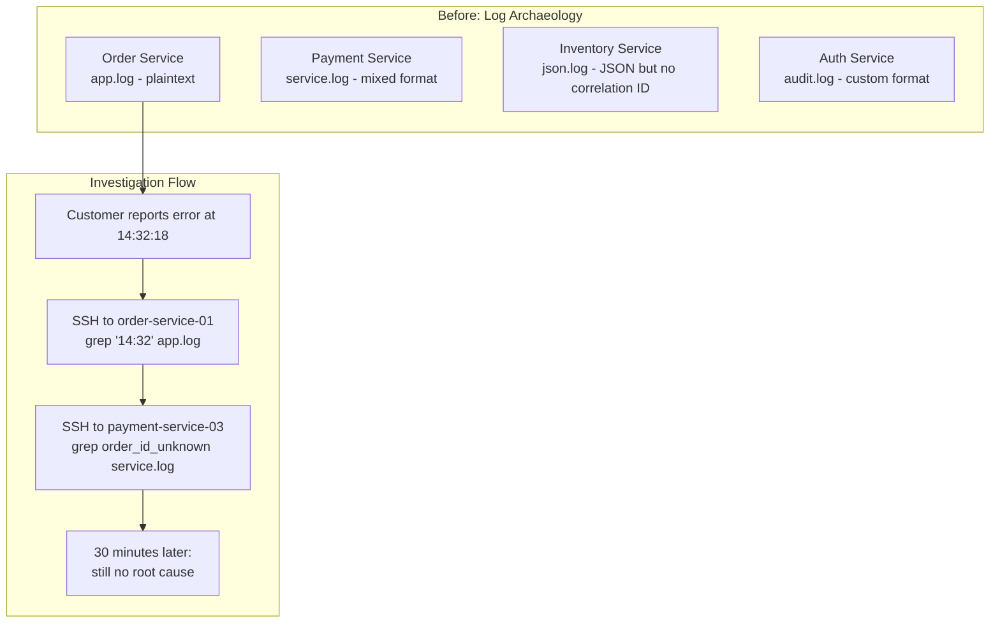
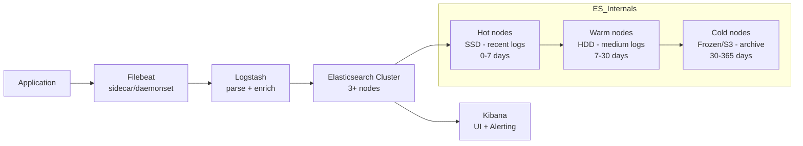
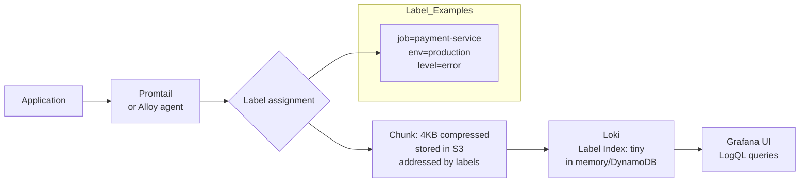
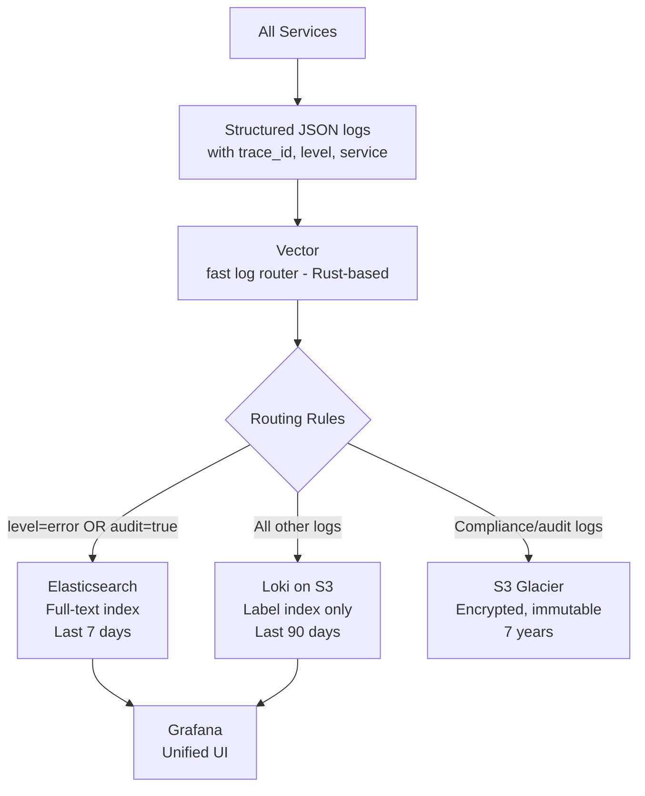
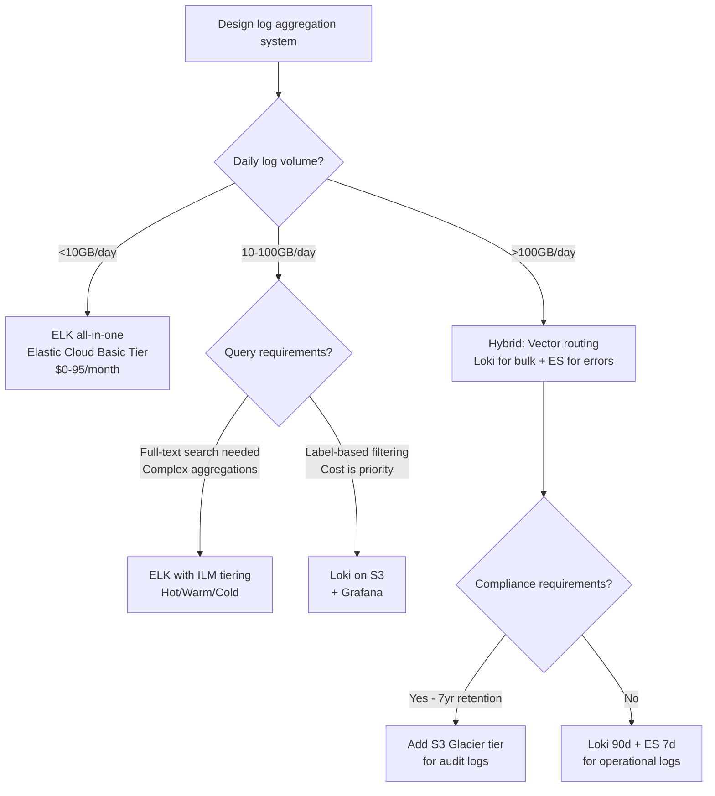

# Log Aggregation: ELK vs Loki, Structured Logging, and Retention Strategy

**Every production incident starts the same way: someone opens a terminal and types `grep ERROR`.** That works for one service. At 100 services with 500GB of logs per day, you need a system that can answer "show me all errors from the payment service in the last 15 minutes, correlated with the deploy that happened at 14:32" — in under 3 seconds.

The tooling choice (ELK vs Loki) is secondary to getting structured logging right. A perfectly configured Elasticsearch cluster ingesting unstructured logs is still a system where you run `grep` on expensive hardware.

---

## The Problem Class `[Mid]`

You have 50 microservices, each logging 1,000 events/second at peak. Some services log plaintext, some log JSON, some log a mix. Your current setup: SSH into each host and `tail -f app.log`.



**The scale math that breaks grep-based debugging**:

```
50 services × 1,000 events/second × 200 bytes/event = 10MB/second
= 600MB/minute = 36GB/hour = 864GB/day

Stored on 20 hosts (3 days retention):
864GB × 3 = 2.6TB spread across 20 hosts

Finding a specific log line: O(hosts × file_size) = O(20 × 130GB) grep operations
Expected time: 45 minutes to 2 hours per investigation
```

With centralized log aggregation and indexed search: sub-5-second query time.

---

## Why the Obvious Solution Fails `[Senior]`

### Naive Approach: Syslog to a Single Host

Central syslog server collecting from all services. Breaks because:
1. **Single point of failure**: Syslog server goes down, logs are lost (UDP) or services back-pressure (TCP)
2. **No query capability**: You still grep a 2TB file, just on one server
3. **No structured parsing**: Syslog is a stream of strings

### Naive Approach: Dump logs to S3

Cheap storage, but:
1. **Athena/S3 Select query latency**: 30-60 seconds minimum per query (not acceptable during incidents)
2. **No real-time ingest**: S3 writes are batched; you can't query logs from 10 seconds ago
3. **No index**: Every query scans the entire dataset

### The Real Problem: Unstructured Logs Are a Query-Time Tax

```
Unstructured log line:
"2026-03-18 14:32:18 ERROR payment-service: Failed to charge card abc123 for order 9876543 - timeout after 5000ms"

To extract order_id and duration, you write regex at query time:
/Failed to charge card \w+ for order (\d+) - timeout after (\d+)ms/

Regex runs on every matching line, on every query. At 500GB logs/day with 50 concurrent analysts:
50 × O(500GB) regex scans per query = catastrophic

Structured log line:
{"ts":"2026-03-18T14:32:18Z","level":"ERROR","service":"payment-service","event":"charge_failed","card_id":"abc123","order_id":9876543,"timeout_ms":5000}

order_id is indexed. Query: {service="payment-service"} | json | order_id=9876543
Execution: index lookup → fetch 3 matching lines → done in <100ms
```

---

## The Solution Landscape `[Senior]`

### Solution 1: ELK Stack (Elasticsearch + Logstash + Kibana)

**What it is**

Elasticsearch provides a full-text inverted index over all log fields. Every field in a JSON log is indexed by default. Kibana provides dashboards and Discover UI. Logstash (or Filebeat) ships logs from services to ES.

**How it actually works at depth**



**Sizing guidance** `[Staff+]`

```
Elasticsearch sizing formula:
Shard size = daily_log_volume_GB × 1.45 (indexing overhead)

Example: 100GB/day × 1.45 = 145GB of ES storage per day
With 7-day hot retention: 145GB × 7 = 1TB per primary shard

Recommended shard size: 20-50GB for optimal performance
→ Create 25 shards for the 7-day hot tier
→ Set number_of_shards: 25, number_of_replicas: 1

Heap sizing: 50% of RAM, max 30GB (JVM compressed OOPs limit)
→ Hot node: 64GB RAM → 30GB heap → can handle ~300GB shard data

Cluster for 100GB/day, 30-day retention:
- Hot tier: 3 × 64GB RAM, 2TB SSD = 6TB → 7 days
- Warm tier: 3 × 32GB RAM, 8TB HDD = 24TB → 23 days
- Total cost (AWS i3): ~$8,000/month
```

**Configuration decisions that matter** `[Staff+]`

```yaml
# Index template for optimal log storage
PUT _index_template/logs-template
{
  "index_patterns": ["logs-*"],
  "template": {
    "settings": {
      "number_of_shards": 1,
      "number_of_replicas": 1,
      "index.lifecycle.name": "logs-ilm-policy",
      # CRITICAL: Disable dynamic mapping for high-cardinality fields
      "index.mapping.total_fields.limit": 1000
    },
    "mappings": {
      "dynamic": "strict",  # Reject unknown fields — prevents mapping explosion
      "properties": {
        "@timestamp": {"type": "date"},
        "level": {"type": "keyword"},
        "service": {"type": "keyword"},
        "trace_id": {"type": "keyword"},
        "message": {"type": "text"},  # Full-text indexed
        "duration_ms": {"type": "long"},
        # user_id as keyword (exact match) NOT text (don't full-text index UUIDs)
        "user_id": {"type": "keyword"}
      }
    }
  }
}
```

**Failure modes** `[Staff+]`

- **Mapping explosion**: A developer adds a new service that logs arbitrary JSON with 500 different field names. With `dynamic: true`, ES creates 500 new field mappings. Multiply by 100 services and shard count explodes. ES cluster goes OOM. Fix: `dynamic: strict` in index template — reject logs with undeclared fields.
- **JVM GC pauses during high-ingest**: Hot nodes hit 85% heap during log burst (deploy spike). GC pauses of 10-30 seconds cause index timeout errors. Filebeat retries, creating ingest amplification. Fix: Pre-warm nodes before deployments, set circuit breaker alerting at 70% heap.
- **ILM rollover starvation**: Index Lifecycle Management tries to roll over to warm tier, but warm nodes are full. Rollover hangs. Hot nodes fill up. ES cluster goes read-only. Fix: Monitor ILM lag, set `indices.breaker.total.limit: 70%`, alert on disk >80%.

**Observability** `[Staff+]`

```promql
# ES cluster health
elasticsearch_cluster_health_status{color="red"} > 0  # Critical: data loss risk

# Ingest lag (how far behind are logs)
elasticsearch_indices_indexing_index_time_in_millis_total
/ elasticsearch_indices_indexing_index_total
# Alert if avg indexing time > 500ms (means cluster is saturated)

# JVM heap pressure
elasticsearch_jvm_mem_heap_used_percent > 85  # Alert threshold
```

---

### Solution 2: Grafana Loki (Labels vs Full-Text Index)

**What it is**

Loki stores logs compressed in object storage (S3/GCS). It indexes only *labels* (metadata fields), not the log content. Log content is only parsed at query time via LogQL. This makes it dramatically cheaper than ES but slower for unstructured queries.

**How it actually works at depth**



The key insight: Loki's label index is orders of magnitude smaller than ES's inverted index. At 100GB/day of logs:
- ES index overhead: ~45GB (45% of raw data)
- Loki label index: ~50MB (0.05% of raw data) — the rest is compressed raw log chunks in S3

**Sizing guidance** `[Staff+]`

```
Loki storage formula:
Raw logs: 100GB/day
Compressed (snappy): 100GB × 0.2 = 20GB/day  (logs compress 5:1 typically)
S3 cost: 20GB × $0.023/GB = $0.46/day = $168/year for 365 days

vs Elasticsearch:
ES storage: 145GB/day (with indexing overhead)
EBS SSD (gp3): 145GB × 30 days = 4.35TB × $0.08/GB/month = $348/month = $4,176/year

Cost ratio: ES is 25x more expensive than Loki at this volume

Loki query performance:
With good label design, queries scan only matching chunks
Bad labels → full scan → slow queries (10s+)

Rule: Aim for label cardinality < 10,000 per label key
Bad: {user_id="abc123"} — millions of unique values → one chunk per user → unusable
Good: {service="payment", level="error"} — low cardinality → few chunks → fast
```

**Configuration decisions that matter** `[Staff+]`

```yaml
# Promtail config - label assignment is the key design decision
scrape_configs:
  - job_name: kubernetes-pods
    kubernetes_sd_configs:
      - role: pod
    relabel_configs:
      # GOOD labels: low cardinality, high value
      - source_labels: [__meta_kubernetes_namespace]
        target_label: namespace
      - source_labels: [__meta_kubernetes_pod_label_app]
        target_label: service
      - source_labels: [__meta_kubernetes_pod_label_version]
        target_label: version

      # BAD: never use pod_name as label (unique per pod = high cardinality)
      # - source_labels: [__meta_kubernetes_pod_name]
      #   target_label: pod  # ← creates millions of unique chunk streams

# LogQL structured parsing at query time (not ingest)
# Query: find all errors with order_id
{service="order-service", level="error"} | json | order_id != ""
```

**Failure modes** `[Staff+]`

- **Label cardinality explosion (same as Prometheus)**: A developer adds `{request_id="..."}` as a Loki label. Each unique request ID creates a new log stream. At 10,000 RPS = 10,000 streams/second being opened. Loki's ingester OOMs storing stream metadata. Fix: Strict label allow-list in Promtail config, alert on `loki_ingester_streams_created_total` rate.
- **Out-of-order log delivery**: Loki requires logs within a stream to arrive in timestamp order. A slow pod sends a log from T-60s. Loki rejects it with "entry out of order." The log is lost. Fix: Set `max_chunk_age: 2h` and `chunk_idle_period: 30m` to widen the acceptance window.
- **Query timeout on unstructured log search**: `{service="payment"} |= "timeout"` on 30 days of logs scans all 600 chunks. With 50 concurrent analysts: 50 × 600 chunks = 30,000 chunk reads hitting S3. S3 rate limits kick in. Fix: Add time range requirement to Loki queries; enforce in Grafana datasource settings.

---

### Solution 3: Hybrid Architecture (2026 Best Practice)



**Why Vector over Filebeat/Fluentd in 2026**:
- Rust-based: 10x lower CPU at equivalent throughput
- Built-in processing (parsing, filtering, routing) without Logstash
- Backpressure-aware: slows producers rather than dropping on overload
- Native OTLP output: bridges logs into OpenTelemetry pipeline

---

## Trade-off Matrix `[Senior]` → `[Staff+]`

| Dimension | Elasticsearch | Loki | Hybrid (ES+Loki) |
|---|---|---|---|
| Query power | Full-text + aggregations | LogQL + labels only | Both, routed by use case |
| Storage cost (100GB/day, 30d) | ~$4,200/year | ~$168/year | ~$400/year |
| Query latency | <1s (indexed) | 1-30s (scan-based) | <1s errors, 5s bulk |
| Operational complexity | High (ES tuning) | Low (S3-backed) | Medium |
| Ingest throughput | 500MB/s (3-node) | Unlimited (S3) | Both |
| Full-text search | Native | Regex on chunks | ES for structured errors |
| Cardinality risk | Mapping explosion | Label explosion | Both risks apply |
| 2026 recommendation | Error/audit logs | Bulk app logs | **Preferred at scale** |

---

## Decision Framework `[Senior]` → `[Staff+]`



---

## Production Failure Story `[Staff+]`

**The Mapping Bomb — FinTech Platform, Series B**

A fintech startup ran a 10-node Elasticsearch cluster handling 80GB/day of logs from 30 services. On a Tuesday morning, their new ML fraud detection service deployed. The service logged prediction feature vectors as JSON: each prediction generated a log line with 847 dynamically-named float fields (`feature_0` through `feature_846`).

Within 2 hours, Elasticsearch had created 847 × 10 shards = 8,470 new field mappings per index. The shard count on their 10 primary shards jumped from 50,000 fields to 58,470 fields — exceeding the `total_fields.limit` of 50,000. ES refused to index new documents. The entire cluster went read-only.

Timeline:
- 09:15: Fraud detection service deployed
- 11:23: First "rejected document" errors in Filebeat
- 11:31: Kibana Discover shows no logs from the last 8 minutes
- 12:45: Root cause identified (1 hour 14 minutes of blind operation during business hours)

**Fix implemented**:
```yaml
# Index template change
"mappings": {
  "dynamic": "strict",  # Changed from "true"
  "properties": {
    # All valid fields explicitly declared
    "ml_features": {"type": "object", "enabled": false}  # Store but don't index
  }
}
```

Lesson: Never use `dynamic: true` in a production ES cluster. Treat ES schema like a database schema — declare fields explicitly, reject unknowns at the template level.

---

## Observability Playbook `[Staff+]`

### Structured Logging Schema (enforce across all services)

```json
{
  "@timestamp": "2026-03-18T14:32:18.123Z",
  "level": "ERROR",
  "service": "payment-service",
  "version": "1.4.2",
  "environment": "production",
  "trace_id": "4bf92f3577b34da6a3ce929d0e0e4736",
  "span_id": "00f067aa0ba902b7",
  "event": "charge_failed",
  "order_id": 9876543,
  "duration_ms": 5034,
  "error": {
    "type": "TimeoutError",
    "message": "Payment gateway did not respond within 5000ms",
    "stack": "..."
  },
  "caller": "payment/charge.go:142"
}
```

### Log Pipeline Health Metrics

```promql
# Ingest lag: time from log generation to searchability
histogram_quantile(0.99, rate(log_pipeline_latency_seconds_bucket[5m]))
# Alert if p99 > 30s (incident logs unavailable for 30s after they occur)

# Log loss rate
rate(filebeat_harvester_missed_events_total[5m])
# Alert if > 0 (means disk buffer exhausted, logs dropped at source)

# Elasticsearch indexing errors
rate(elasticsearch_indices_indexing_index_failed_total[5m]) > 0
# Alert immediately — rejected documents = log gaps

# Loki ingester stream count
loki_ingester_streams_created_total
# Alert if rate > 10,000/minute (label cardinality explosion starting)
```

---

## Architectural Evolution `[Staff+]`

```
Phase 1 (Startup - <10GB/day):
- Application: JSON structured logs to stdout
- Collection: Kubernetes log driver → CloudWatch Logs / Datadog Logs
- Managed service: No operational burden
- Query: CloudWatch Logs Insights
- Cost: $50-200/month all-in

Phase 2 (Growth - 10-100GB/day):
- Loki on EKS with S3 backend
- Promtail DaemonSet for collection
- Grafana for visualization
- Retention: 30 days hot (Loki), 1 year archive (S3)
- Cost: $200-800/month

Phase 3 (Scale - >100GB/day):
- Vector for routing (Rust performance)
- Loki for bulk app logs (S3-backed)
- Elasticsearch for error/audit logs (ILM tiering)
- S3 Glacier for compliance retention (7 years)
- Cost: $2,000-5,000/month at 1TB/day
- Query: Grafana unified datasource (Loki + ES in same UI)
```

---

## Decision Framework Checklist `[All Levels]`

- [ ] Are all services emitting structured JSON logs with mandatory fields (timestamp, level, service, trace_id)?
- [ ] Have you defined your label taxonomy for Loki (max 10 labels per log stream, cardinality < 10,000)?
- [ ] Do you have an ES index template with `dynamic: strict` to prevent mapping explosion?
- [ ] Is your log retention policy defined per tier (hot/warm/cold/archive) with cost implications?
- [ ] Does your log pipeline have backpressure handling to avoid silently dropping logs?
- [ ] Do you have alerting on log pipeline lag (>30s from generation to searchability)?
- [ ] Have you excluded high-cardinality fields (user_id, request_id) from ES mappings or Loki labels?
- [ ] Is there a log sampling strategy for extremely high-volume, low-value logs (health checks at 1000 RPS)?
- [ ] Do you have a compliance-aware retention policy for audit logs (immutable S3 object lock)?
- [ ] Can you query logs, metrics, and traces from a single UI with correlation (Grafana unified stack)?

*Written by Gaurav Porwal — 10+ Year Engineer | Tech Lead | Product Owner | Business-Minded Builder*
*Last updated: 2026-03-18*
