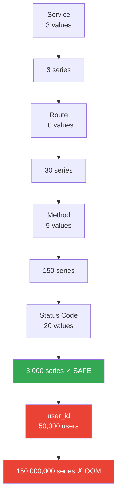

# Metric Cardinality Management: The Silent Prometheus Killer

**You add `user_id` as a label to your HTTP request metric.** Your Prometheus has 50,000 users. You now have 50,000 × routes × methods × status_codes time series. At 3 AM, Prometheus OOMs. Your monitoring is down. You can't see if your service is healthy. Your dashboards are blank. Your alerts are silent. You open an incident to fix your monitoring, while the actual production incident you would have caught is running undetected. Your monitoring killed your monitoring.

This is not a theoretical problem. It happens in production, regularly, to teams that understand metrics conceptually but don't understand how Prometheus actually stores and queries them.

---

## The Problem Class `[Senior]`

Prometheus stores one time series for every unique combination of label values. This is not a design flaw — it's how high-cardinality aggregation and filtering work. But it means labels multiply:



Each time series in Prometheus:
- **Head block (in memory)**: ~64 bytes per series for the head chunk
- **Chunk files (disk)**: 1-2KB per series for compressed data
- **Index overhead**: Additional memory for the inverted label index

At 1 million time series: ~64MB for head chunks + ~1GB for index = ~1.5GB RAM minimum. At 10 million series: ~15GB. At 150 million (from the user_id example): OOM on any reasonable server.

```
A real production metric explosion:

Before: http_requests_total{service, method, route, status_code}
Series = 3 × 5 × 50 × 20 = 15,000 series
RAM = 15,000 × 64 bytes = ~1MB — Fine

After: http_requests_total{service, method, route, status_code, user_id, session_id}
Series = 3 × 5 × 50 × 20 × 100,000 × 1,000,000 = 15 TRILLION series
RAM = 15 × 10^12 × 64 bytes = ~1 PETABYTE — Your Prometheus OOMs in 3 hours

This is not an exaggeration. This happens.
```

---

## What High Cardinality Looks Like `[Senior]`

### The Offenders — Labels That Kill Prometheus

| Label | Cardinality | Problem |
|-------|------------|---------|
| `user_id` | 10K–100M | Every user is a separate series |
| `session_id` | Millions | New series every session |
| `request_id` / `trace_id` | Unlimited | New series every request |
| `ip_address` | Millions | New series per client IP |
| `/path?query=value` (full URL) | Unlimited | Query params create infinite variants |
| `timestamp` or `date` | Growing forever | New series every time bucket |
| `product_sku` | 1M+ | Series per SKU per metric |
| `error_message` (raw) | Unlimited | Unique error messages = unique series |

### Good vs Bad Label Design

```
❌ BAD: High cardinality labels

http_requests_total{
  method="POST",
  url="/api/orders?user=john&session=abc123",  # full URL with query params
  user_id="user-12345",                         # individual user
  request_id="req-zzz999",                      # unique per request
  ip="203.0.113.42",                            # individual IP
  status_code="200"
}

✓ GOOD: Low cardinality labels

http_requests_total{
  method="POST",
  route="/api/orders",          # parameterized route, no query params
  user_tier="pro",              # aggregate: free / pro / enterprise
  region="us-east",             # aggregate: not individual IP
  status_code="200"             # bounded: ~20 possible values
}
```

The rule: a label's cardinality should be bounded and small. If you can't enumerate all possible values on a napkin, it's probably too high cardinality.

---

## Detecting Cardinality Problems `[Senior]`

### PromQL Queries for Cardinality Forensics

```promql
# How many active time series does your Prometheus have?
# Alert if this exceeds 1M (or your server's comfortable limit)
prometheus_tsdb_head_series

# Historical series growth — look for sudden spikes
rate(prometheus_tsdb_head_series[1h])

# Top 10 metrics by cardinality — find the offenders
topk(10, count by (__name__)({__name__=~".+"}))

# How many series does a specific metric have?
count(http_requests_total)

# Which label values are driving cardinality?
# If this returns thousands, that label is the problem
count by (user_id) (http_requests_total)

# Memory usage breakdown (requires Prometheus 2.x)
prometheus_tsdb_head_chunks_storage_size_bytes
prometheus_tsdb_head_chunks

# How many chunks are being created per second? (high = cardinality growing)
rate(prometheus_tsdb_head_chunks_created_total[5m])
```

### Alerting on Cardinality

```yaml
# cardinality-alerts.yml
groups:
  - name: cardinality_health
    rules:
      # Alert before OOM — give yourself time to fix it
      - alert: PrometheusHighCardinality
        expr: prometheus_tsdb_head_series > 1000000
        for: 10m
        labels:
          severity: warning
        annotations:
          summary: "Prometheus has {{ $value | humanize }} active time series"
          description: "High cardinality detected. Query topk(10, count by (__name__)({__name__=~\".+\"})) to find offenders."

      - alert: PrometheusCardinalityExplosion
        expr: prometheus_tsdb_head_series > 5000000
        for: 5m
        labels:
          severity: page
        annotations:
          summary: "Prometheus cardinality explosion — OOM risk"
          description: "{{ $value | humanize }} active time series. Prometheus will OOM soon."

      # Detect rapid series growth (new high-cardinality metric being emitted)
      - alert: PrometheusSeriesGrowthSpike
        expr: rate(prometheus_tsdb_head_series[10m]) > 1000
        for: 5m
        labels:
          severity: warning
        annotations:
          summary: "Time series growing at {{ $value | humanize }}/min"
```

---

## Solution 1: Redesign Labels `[Senior]`

The most impactful fix. Replace high-cardinality labels with low-cardinality equivalents.

```javascript
// BEFORE: User-level granularity → OOM
const httpRequests = new client.Counter({
  name: 'http_requests_total',
  labelNames: ['method', 'route', 'status_code', 'user_id', 'tenant_id'],
});

// After middleware runs:
httpRequests.inc({
  method: 'POST',
  route: '/api/orders',
  status_code: '200',
  user_id: 'user-12345',    // 100K unique values → 100K × other labels series
  tenant_id: 'tenant-99',   // 10K unique values → 10K × other labels series
});

// AFTER: Aggregate to bounded categories → Safe
const httpRequests = new client.Counter({
  name: 'http_requests_total',
  labelNames: ['method', 'route', 'status_code', 'user_tier', 'tenant_region'],
});

httpRequests.inc({
  method: 'POST',
  route: '/api/orders',
  status_code: '200',
  user_tier: 'pro',          // 3 values: free, pro, enterprise
  tenant_region: 'us-east',  // 6 values: us-east, us-west, eu, apac, ...
});
```

**What you lose**: You can't query "how many requests did user-12345 make?" from this metric.
**What you gain**: A metric that doesn't kill your monitoring system.
**How to get the per-user data**: Application logs, or a separate database query.

---

## Solution 2: Exemplars — Have Your Cake and Eat It Too `[Senior]`

Exemplars are the best of both worlds. Instead of adding `user_id` as a label (creating millions of series), you attach it to individual data points as metadata. The histogram still has low cardinality. But specific data points (usually sampled at 1%) carry a reference to a trace ID and arbitrary metadata.

```javascript
// With exemplars: attach user_id and trace_id to the measurement itself
// Not to the label set — no cardinality explosion

const { trace } = require('@opentelemetry/api');

function recordRequestWithExemplar(duration, labels) {
  const activeSpan = trace.getActiveSpan();

  if (activeSpan) {
    const spanContext = activeSpan.spanContext();

    // observe() with exemplar: attaches trace_id and custom labels to THIS data point
    // Prometheus stores ~100 exemplars per histogram bucket (configurable)
    // Query: http_request_duration_seconds{...} — still just a few labels
    // But you can click individual histogram samples and jump to the trace
    httpRequestDuration.observe(labels, duration, {
      traceId: spanContext.traceId,    // link to Jaeger trace
      userId: requestContext.userId,    // not a label — metadata on one sample
      orderId: requestContext.orderId,  // searchable in Grafana exemplar viewer
    });
  } else {
    httpRequestDuration.observe(labels, duration);
  }
}
```

In Grafana, when you hover over a histogram point, you see the exemplar badge. Click it to jump to the specific trace in Jaeger that represents that data point. You get user-level debuggability without the cardinality cost.

**Requirements**: Prometheus 2.25+ with `--enable-feature=exemplar-storage`. Grafana 7.4+ to visualize. OTel SDK for trace ID injection.

---

## Solution 3: Histograms for Distribution, Not Per-Value Recording `[Senior]`

A common anti-pattern: recording individual request durations with the user ID:

```javascript
// WRONG: one metric per user (implicitly, through labels)
userRequestTiming.observe({ user_id: userId }, durationMs);

// RIGHT: histogram distributes values; no per-user breakdown
// But you know the distribution of all requests
requestDuration.observe({ route, method }, durationMs);
```

If you need to understand specific users' experiences: use exemplars (above) or query logs. The histogram tells you the statistical distribution; exemplars tell you about specific instances.

---

## Solution 4: Recording Rules for Pre-Aggregation `[Senior]`

If you need per-tenant or per-region breakdowns, pre-aggregate before storage rather than storing raw cardinality:

```yaml
# recording-rules.yml
groups:
  - name: aggregated_metrics
    interval: 60s
    rules:
      # Pre-aggregate: orders per tenant per hour
      # source: orders_created_total{tenant_id="abc123"} — high cardinality
      # result: orders_per_tenant:rate1h — low cardinality, pre-computed
      - record: tenant:orders_created_total:rate1h
        expr: |
          sum by (tenant_region, user_tier) (
            rate(orders_created_total[1h])
          )

      # Pre-aggregate error rate by service (not by route — too high)
      - record: service:http_error_rate:rate5m
        expr: |
          sum by (service) (rate(http_requests_total{status_code=~"5.."}[5m]))
          /
          sum by (service) (rate(http_requests_total[5m]))
```

The rule: store raw metrics with bounded labels. Use recording rules to aggregate down further for dashboards and alerts.

---

## Solution 5: Metrics at the Right Level `[Senior]`

Not everything needs to be a metric. Business KPIs should be gauges set by a periodic query, not accumulated from per-request counters.

```javascript
// WRONG: per-order, per-user metric (high cardinality)
// Emitted on every order create — scales with order volume
orderValue.observe({ user_id: userId, product_id: productId }, orderValueCents);

// RIGHT: aggregate KPI updated periodically
// One gauge per tier, not per user
const dailyRevenueByTier = new client.Gauge({
  name: 'daily_revenue_cents',
  help: 'Daily revenue by user tier (updated every 5 minutes)',
  labelNames: ['tier'],
});

// A background job runs every 5 minutes and sets the gauge from the database
async function updateRevenueMetrics() {
  const results = await db.query(`
    SELECT user_tier, SUM(amount_cents) as total
    FROM orders
    WHERE created_at > NOW() - INTERVAL '1 day'
    GROUP BY user_tier
  `);

  for (const row of results) {
    dailyRevenueByTier.set({ tier: row.user_tier }, row.total);
  }
}

setInterval(updateRevenueMetrics, 5 * 60 * 1000);
```

This gives you accurate business metrics without Prometheus accumulating millions of order-level events.

---

## Production Patterns `[Staff]`

### Pattern 1: Label Validation in CI

Catch cardinality problems before production using a test that validates label cardinality:

```javascript
// metrics.test.js
const { httpRequestsTotal } = require('./metrics');

describe('Metric label cardinality', () => {
  test('http_requests_total has only approved label names', () => {
    const allowedLabels = ['method', 'route', 'status_code', 'service'];
    const metricLabels = httpRequestsTotal.labelNames;

    const disallowedLabels = metricLabels.filter(l => !allowedLabels.includes(l));
    expect(disallowedLabels).toEqual([]);
  });

  test('route label must use parameterized path', () => {
    // Verify middleware uses req.route.path not req.path
    const mockReq = { method: 'GET', path: '/api/orders/12345', route: { path: '/api/orders/:id' } };
    const route = mockReq.route?.path || mockReq.path;
    expect(route).toBe('/api/orders/:id');
    expect(route).not.toMatch(/\d{5}/); // No raw IDs
  });
});
```

### Pattern 2: Prometheus Federation for Multi-Region

In multi-region deployments, each region has its own Prometheus. Cardinality per region is manageable. The Thanos global view queries all regions via a single endpoint without aggregating all series into one Prometheus:

```yaml
# Thanos Query handles fan-out — each regional Prometheus stays small
# No "super Prometheus" holding all 5 regions' metrics
thanos_query:
  stores:
    - us-east-prometheus:10901
    - eu-west-prometheus:10901
    - ap-south-prometheus:10901
```

### Pattern 3: Drop High-Cardinality Metrics at the Collector

If a service is emitting high-cardinality metrics that you can't change immediately (legacy code, third-party library), drop or aggregate them at the OTel Collector or at the Prometheus scrape stage:

```yaml
# prometheus.yml — drop high-cardinality metrics during scrape
scrape_configs:
  - job_name: 'legacy-service'
    static_configs:
      - targets: ['legacy:8080']
    metric_relabel_configs:
      # Drop the user_id label before storage (aggregation happens automatically)
      - source_labels: [__name__]
        regex: http_requests_total
        target_label: user_id
        replacement: ''  # remove user_id label value

      # Drop metrics matching a high-cardinality pattern entirely
      - source_labels: [__name__]
        regex: 'debug_.*'
        action: drop
```

---

## The Memory Math `[Senior]`

When evaluating whether a metric is safe, do the math before deploying:

```
Cardinality calculator:

Labels:
  service: 5 services
  method: 5 methods
  route: 100 routes
  status_code: 20 codes
  user_tier: 3 tiers (free/pro/enterprise)

Total series = 5 × 5 × 100 × 20 × 3 = 150,000 series

Memory per series:
  Head block (in-memory): ~64 bytes
  Index entry: ~200 bytes (label name/value lookup)
  Total: ~264 bytes per series

Total memory for this metric = 150,000 × 264 = 39.6 MB ← Fine

Now with user_id (100,000 users):
  Total series = 5 × 5 × 100 × 20 × 3 × 100,000 = 15,000,000,000
  Total memory = 15B × 264 = 3.96 TB ← OOM in minutes
```

The math takes 30 seconds. Do it before adding any label with more than ~100 possible values.

---

## Common Mistakes `[Senior]`

**Mistake 1: Adding labels "just in case"**
Labels cannot be removed from existing metrics without breaking dashboard queries. Think carefully before adding a label. "We might want to filter by this someday" is not enough justification.

**Mistake 2: Using the full request path as label**
`/api/orders/12345/items/67890` is not a route label. It's a cardinality explosion. Use `req.route?.path` in Express, `@RequestMapping` parameter patterns in Spring, Django URL patterns in Python.

**Mistake 3: Logging at DEBUG level and using a counter for it**
`debug_log_messages_total{message="processing order 12345"}` — the message field has unlimited cardinality. If you want to count debug events, count categories, not messages.

**Mistake 4: Not monitoring Prometheus itself**
`prometheus_tsdb_head_series` should be on your "infrastructure health" dashboard and have an alert. By the time Prometheus OOMs, it's too late to diagnose.

**Mistake 5: Incrementally adding labels over time**
A metric starts with 3 labels (fine). Over 2 years, 4 more labels are added incrementally. Nobody does the cardinality math at each step. At year 2, a single `user_id` label turns a 1,000-series metric into a 10 million-series metric.

**Mistake 6: Assuming prom-client validates cardinality**
It does not. `prom-client` will happily accept 10 million unique label combinations. Prometheus will happily store them until it runs out of memory. There is no built-in guard.

---

## Key Takeaways

1. **Cardinality = product of all unique label values**: 3 labels with 10 values each = 1,000 series; add one label with 10K values = 10M series
2. **The memory math is simple**: Do it before adding any label with > 100 possible values. `total_series × 264_bytes` = memory needed
3. **High cardinality labels to avoid**: user_id, session_id, request_id, IP address, full URL, raw error messages, product SKUs
4. **Exemplars bridge the gap**: Low-cardinality histogram + exemplars with trace_id gives you statistical metrics + individual request debuggability
5. **Detection is easy**: `prometheus_tsdb_head_series` and `topk(10, count by (__name__)({__name__=~".+"}))` — add to your monitoring dashboard
6. **Recording rules for aggregation**: Pre-aggregate per-tenant or per-region metrics before storage, not at query time
7. **Prevent it in CI**: Validate label names against an allowlist before production deployment
8. **Fix in layers**: Relabeling at scrape time can remove labels from legacy metrics without code changes
