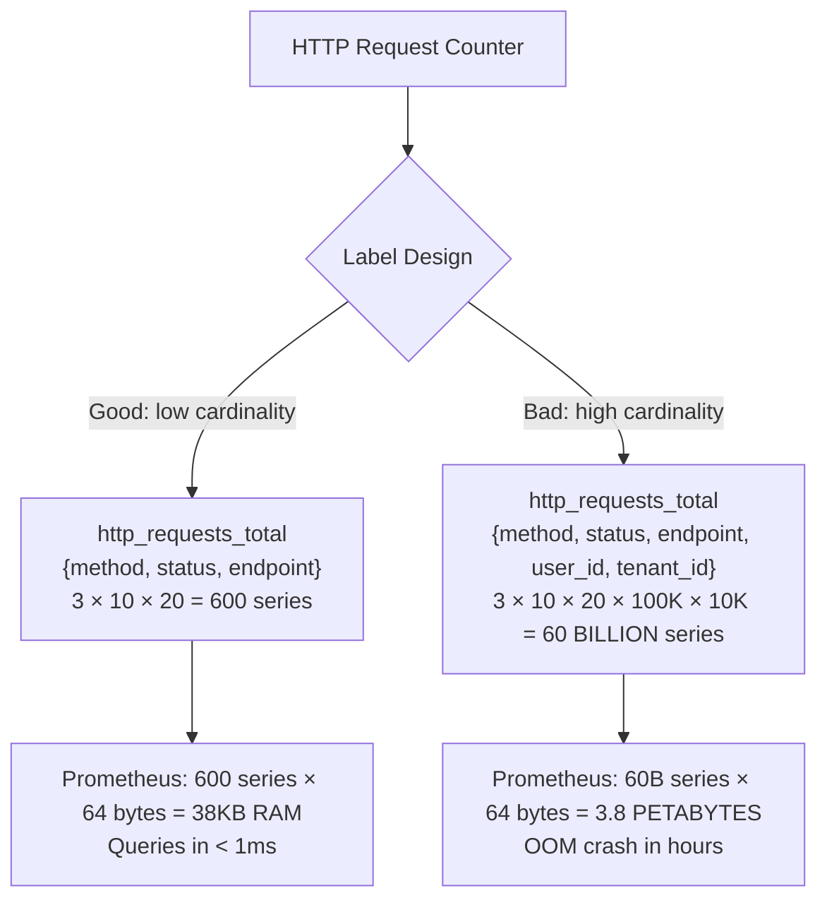
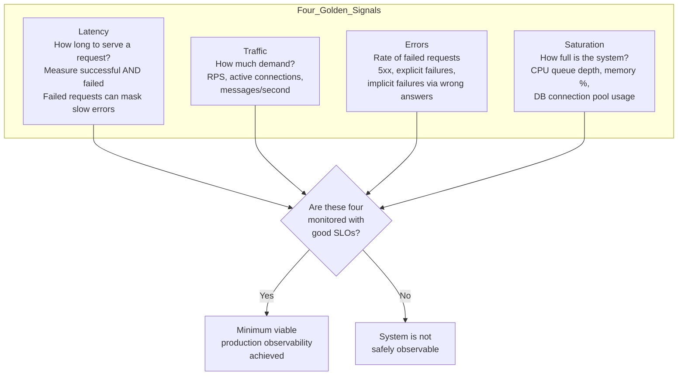
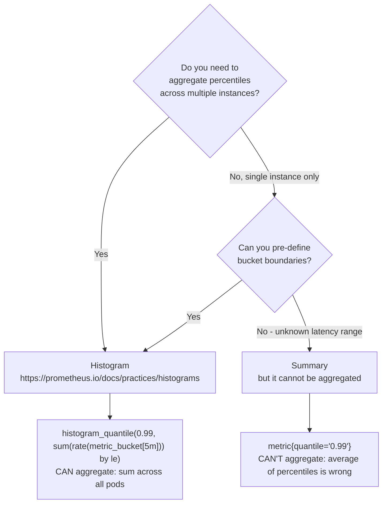
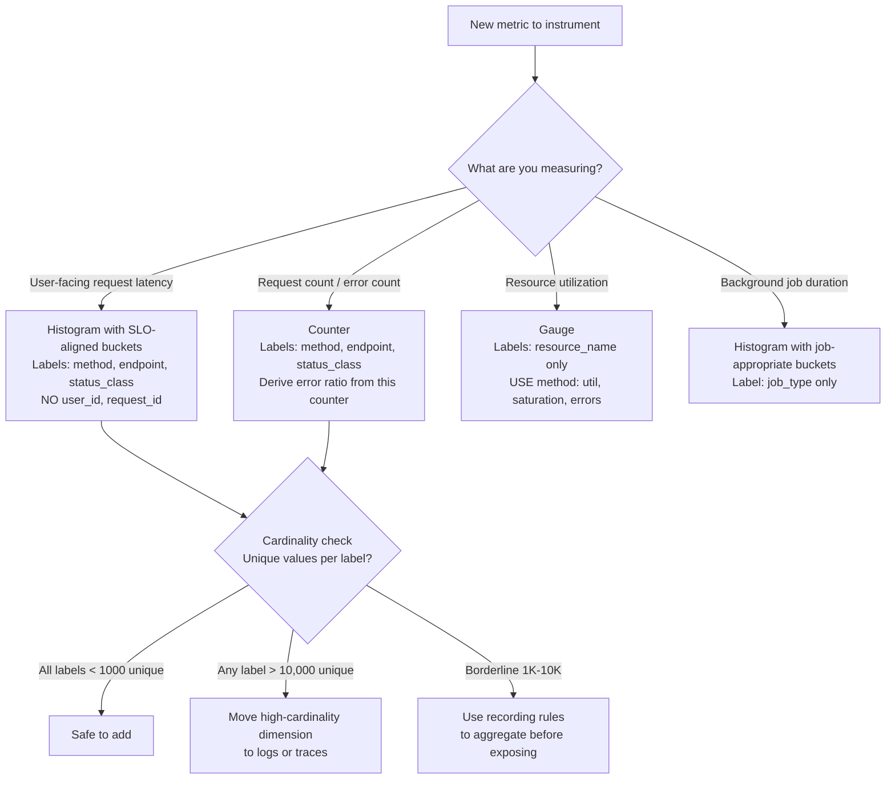

# Metrics Design: RED, USE, Four Golden Signals, and Cardinality Management

**Your monitoring system goes down precisely when you need it most.** A Prometheus instance with 10 million active time series consumes 40GB of RAM and crashes under query load. This happens because someone added `{user_id="..."}` as a label to a request counter — innocent-looking, catastrophically wrong. Understanding *why* cardinality kills Prometheus, and how to design metrics that avoid it, separates engineers who build observable systems from engineers who build systems that are observable until you scale.

---

## The Problem Class `[Mid]`

Your team just launched a multi-tenant SaaS platform. Product wants to know "how is each tenant performing?" An engineer adds tenant_id and user_id labels to every HTTP counter. The Prometheus instance starts consuming 2GB more RAM per day. In 3 weeks it OOMs. You lose all historical metrics.



The non-obvious part: labels are not just "tags on a metric." Every unique combination of label values creates a separate *time series*. The cardinality of a metric = product of all unique values across all labels. This grows multiplicatively, not additively.

**Scale Reality**

```
A payment platform with:
- 100,000 active users
- 10,000 unique tenants
- 50 API endpoints
- 5 HTTP methods
- 20 status codes

If user_id and tenant_id are labels:
Total series = 50 × 5 × 20 × 100,000 × 10,000 = 5 × 10^11 series

Prometheus RAM per series: ~64 bytes (head block)
Required RAM: 5 × 10^11 × 64 bytes = 32 PETABYTES

Your actual Prometheus server: 32GB RAM
Time to OOM: approximately 3 hours after first metric emission
```

---

## Why the Obvious Solution Fails `[Senior]`

### Naive Approach: Measure Everything

"Just add all the labels you might ever need." Results in:
- Series count exceeds Prometheus memory limit
- Query engine times out on high-cardinality label matchers
- TSDB compaction can't keep up with ingestion → disk bloat → eventual crash
- Alert evaluation latency spikes (each alert rule is evaluated against all matching series)

### Naive Approach: Use Histograms for Everything

Histograms are expensive. Each histogram with 10 buckets, observed for 100 endpoints × 3 methods = 100 × 3 × 10 buckets + 2 (sum/count) = 3,600 series. Fine at this scale. But with service_version as an additional label and 50 versions deployed via canary: 3,600 × 50 = 180,000 series from one histogram family. A complex microservices system can easily reach 50 histogram families — that is 9 million series from histograms alone.

### The Real Problem: Engineers Instrument For Debugging, Not Alerting

Metrics instruments should answer one question: **"Is the system healthy from the user's perspective?"** Debugging questions (which user_id had the slowest request?) are answered by traces and logs, not metrics. When this boundary is violated, metrics become a high-cardinality database, not a monitoring system.

---

## The Solution Landscape `[Senior]`

### Framework 1: The Four Golden Signals (Google SRE)

**What it is**: The minimum viable observability set for any user-facing service. If you have these four signals and good SLOs, you can operate a service in production.



**Prometheus implementation**:

```yaml
# Latency: histogram with meaningful buckets
http_request_duration_seconds:
  type: histogram
  labels: [method, endpoint, status_class]  # NOT status code (use class: 2xx, 4xx, 5xx)
  buckets: [0.005, 0.01, 0.025, 0.05, 0.1, 0.25, 0.5, 1, 2.5, 5, 10]
  # Bucket design: align with your SLO latency target
  # If SLO is p99 < 200ms, you MUST have a bucket at 0.2

# Traffic: simple counter
http_requests_total:
  type: counter
  labels: [method, endpoint, status_class]

# Errors: derived from http_requests_total{status_class="5xx"} / http_requests_total
# Do NOT create a separate error counter — derive from request counter

# Saturation: gauge
process_cpu_usage_ratio:
  type: gauge
  # Note: No labels. CPU usage has no meaningful label dimensions.
db_connection_pool_used_ratio:
  type: gauge
  labels: [pool_name]  # One pool per service, low cardinality
```

---

### Framework 2: RED Method (Tom Wilkie)

**What it is**: Request-oriented metrics for microservices. Focuses specifically on *request-handling* health rather than resource saturation.

- **R**ate: Requests per second
- **E**rrors: Errors per second (or error ratio)
- **D**uration: Distribution of request latencies

**Why RED over Four Golden Signals for microservices**: Saturation (the 4th golden signal) is harder to measure meaningfully in containerized environments. CPU throttling in Kubernetes is not the same as CPU saturation on a bare VM. RED works well because it is purely request-centric — metrics that directly reflect user experience.

```promql
# RED dashboard queries

# Rate: requests per second
rate(http_requests_total{service="order-service"}[5m])

# Error ratio (not rate — ratio is more actionable)
sum(rate(http_requests_total{service="order-service", status_class="5xx"}[5m]))
/
sum(rate(http_requests_total{service="order-service"}[5m]))

# Duration: p50, p95, p99
histogram_quantile(0.99,
  sum(rate(http_request_duration_seconds_bucket{service="order-service"}[5m]))
  by (le)
)
```

---

### Framework 3: USE Method (Brendan Gregg)

**What it is**: Resource-oriented metrics for infrastructure. For every resource (CPU, memory, disk, network), measure:
- **U**tilization: % of time the resource is busy
- **S**aturation: degree of extra work queued (wait queue depth)
- **E**rrors: count of error events

**USE is for infrastructure, RED is for services.** Most production systems need both.

```
USE checklist per resource:

CPU:
  Utilization: rate(node_cpu_seconds_total{mode!="idle"}[5m]) / count(node_cpu_seconds_total{mode="idle"})
  Saturation: node_load1 / count(node_cpu_seconds_total{mode="idle"}) > 1.0 (load per CPU)
  Errors: node_context_switches_total (excessive = scheduling pressure)

Memory:
  Utilization: (node_memory_MemTotal - node_memory_MemAvailable) / node_memory_MemTotal
  Saturation: rate(node_vmstat_pgmajfault[5m]) > 0 (major page faults = OOM pressure)
  Errors: node_memory_oom_kill_total

Disk:
  Utilization: rate(node_disk_io_time_seconds_total[5m]) (% of time doing I/O)
  Saturation: rate(node_disk_io_time_weighted_seconds_total[5m]) - rate(node_disk_io_time_seconds_total[5m])
  Errors: rate(node_disk_read_errors_total[5m]) + rate(node_disk_write_errors_total[5m])

Network:
  Utilization: rate(node_network_transmit_bytes_total[5m]) / node_network_speed_bytes (% of capacity)
  Saturation: node_network_transmit_drop_total rate > 0
  Errors: rate(node_network_transmit_errs_total[5m])
```

---

### Histogram vs Summary: The Critical Choice `[Staff+]`

**The non-obvious rule**: Use histograms almost always. Use summaries only when you cannot aggregate across instances.



**The math that matters**:

```
Summary problem:
- Pod 1: p99 = 200ms (handles 900 RPS)
- Pod 2: p99 = 5000ms (handles 100 RPS)
- Average of p99s: (200 + 5000) / 2 = 2600ms ← WRONG, meaningless

Histogram correct aggregation:
- Pod 1 bucket[le=200ms]: 891/900 = 99% of requests
- Pod 2 bucket[le=200ms]: 1/100 = 1% of requests
- Combined: (891+1)/(900+100) = 892/1000 = 89.2% under 200ms
- histogram_quantile gives: p99 = correct value based on actual distribution

Rule: Never use summary when running multiple replicas
```

**Bucket design for histograms** `[Staff+]`

```python
# Rule: Your SLO target MUST have a bucket boundary
# Bad: buckets=[0.01, 0.05, 0.1, 0.5, 1.0, 5.0] with SLO: p99 < 200ms
# Prometheus can only report "between 100ms and 500ms" — cannot tell if SLO is met

# Good: include 0.2 (200ms) as a bucket
# Standard bucket sets by use case:

# Web API (SLO: p99 < 500ms)
buckets = [0.01, 0.025, 0.05, 0.1, 0.2, 0.5, 1.0, 2.5, 5.0, 10.0]

# Database queries (SLO: p99 < 50ms)
buckets = [0.001, 0.005, 0.01, 0.025, 0.05, 0.1, 0.25, 0.5, 1.0]

# Background jobs (SLO: p99 < 30s)
buckets = [0.1, 0.5, 1.0, 5.0, 10.0, 30.0, 60.0, 300.0]

# Native Histograms (Prometheus 2.40+): automatic buckets, no pre-configuration needed
# Best practice for 2026: use native histograms where available
```

---

## Cardinality Management Deep Dive `[Staff+]`

### Identifying Cardinality Explosions

```promql
# Find the highest-cardinality metrics in your Prometheus instance
topk(10,
  count by (__name__) ({__name__!=""})
)

# Find label keys with high unique value counts
count by (label_key) (
  group by (label_key, label_value) (
    {__name__="http_requests_total"}
  )
)

# Monitor total active series (alert threshold: > 2M for standard Prometheus)
prometheus_tsdb_head_series
```

### Safe vs Unsafe Labels

```
SAFE LABELS (cardinality < 1000 unique values):
✓ method: GET, POST, PUT, DELETE, PATCH (5 values)
✓ status_class: 1xx, 2xx, 3xx, 4xx, 5xx (5 values)
✓ endpoint: /users, /orders, /payments (50-200 values with good API design)
✓ service: payment, order, inventory (20-100 values)
✓ environment: production, staging, dev (3 values)
✓ region: us-east-1, eu-west-1 (5-10 values)

UNSAFE LABELS (cardinality > 10,000 unique values):
✗ user_id: millions of users
✗ request_id: unique per request
✗ trace_id: unique per trace
✗ session_id: unique per session
✗ tenant_id: potentially thousands of tenants → use recording rules to aggregate
✗ pod_name: dozens to hundreds at scale (better to use service label)
✗ IP address: unbounded

BORDERLINE (1,000-10,000 unique values — evaluate case by case):
~ tenant_id (if < 500 tenants): probably safe
~ country_code: ~250 values: safe
~ error_code: depends on your error taxonomy
~ version: if canary deploys create many short-lived versions → dangerous
```

### Recording Rules for Aggregation `[Staff+]`

```yaml
# Instead of querying high-cardinality metrics directly,
# pre-aggregate with recording rules

groups:
  - name: aggregation-rules
    interval: 30s
    rules:
      # Pre-aggregate by tenant (so dashboards don't query raw metric)
      - record: tenant:http_requests:rate5m
        expr: |
          sum by (tenant_id, status_class) (
            rate(http_requests_total[5m])
          )
        # Now tenant_id is only in a derived metric, controlled cardinality
        # The raw metric has NO tenant_id label

      # Error rate for SLO alerting (no high-cardinality labels)
      - record: service:error_ratio:rate5m
        expr: |
          sum by (service, endpoint) (rate(http_requests_total{status_class="5xx"}[5m]))
          /
          sum by (service, endpoint) (rate(http_requests_total[5m]))
```

---

## Trade-off Matrix `[Senior]` → `[Staff+]`

| Dimension | Four Golden Signals | RED | USE |
|---|---|---|---|
| Focus | User-facing services | Request-handling | Infrastructure resources |
| Best for | SLO definition | Microservice health | Capacity planning |
| Metrics count | 4 per service | 3 per service | 3 per resource |
| Cardinality risk | Low (if labels are correct) | Low | Very low |
| Debugging power | Symptom detection | Service-level triage | Resource bottleneck |
| Combined value | Always use Golden Signals | Add RED for service breakdown | Add USE for infra |

---

## Decision Framework `[Senior]` → `[Staff+]`



---

## Production Failure Story `[Staff+]`

**Prometheus OOM on Black Friday — E-Commerce Platform 2024**

A 12-node e-commerce platform ran Prometheus with 4 million active time series, well within the 32GB RAM available on their monitoring node. At 00:01 on Black Friday, traffic spiked 8x. A developer had added `{user_id}` to the purchase funnel metrics 3 months earlier — it was only visible in one metric (`purchase_funnel_step_total`) and had passed code review. At baseline traffic, 200,000 unique daily active users created 200,000 time series for that metric. Under 8x traffic surge with many new/returning users, the unique user count hit 1.6 million active users in the first hour.

Timeline:
- 00:01: Black Friday traffic begins
- 00:47: Prometheus RAM consumption crosses 28GB
- 01:03: Prometheus hits OOM (32GB limit), process killed
- 01:03 → 02:45: **Zero monitoring, zero alerting, for 102 minutes on Black Friday**
- 01:15: Checkout service starts returning 503s (connection pool exhausted)
- 01:15 → 02:45: No alerts fire because Prometheus is down
- 02:45: On-call engineer notices revenue dashboard is frozen
- Estimated revenue loss from undetected outage: $2.1M

**Root cause**: `purchase_funnel_step_total{user_id="...", step="checkout"}` — 1 metric, 1 bad label.

**Fix**: Remove `user_id` from metric labels. For user-level analytics, emit events to Kafka → data warehouse (BigQuery). Prometheus for operational metrics only, data warehouse for business analytics.

---

## Observability Playbook `[Staff+]`

### Prometheus Health Metrics

```promql
# Alert 1: Series count approaching memory limit
prometheus_tsdb_head_series > 5000000
# Alert before OOM, not after

# Alert 2: Ingestion rate exceeding scrape capability
rate(prometheus_tsdb_head_samples_appended_total[5m])
# Alert if > 1,000,000 samples/second (typical Prometheus limit)

# Alert 3: Query slow (dashboard/alert evaluation lag)
histogram_quantile(0.99, rate(prometheus_engine_query_duration_seconds_bucket[5m])) > 5
# Alert if p99 query time > 5s

# Alert 4: Cardinality growth rate
rate(prometheus_tsdb_head_series[1h]) > 10000
# Alert if series count growing > 10K/hour (runaway cardinality)

# Alert 5: Rule evaluation taking too long
rate(prometheus_rule_group_last_duration_seconds[5m]) > 5
# Alert if rule evaluation > 5s (your 15s alerting interval is now 33% consumed by eval time)
```

### Cardinality Triage Runbook

```
SYMPTOM: Prometheus OOM or high memory
STEP 1: Query top cardinality metrics (see query above)
STEP 2: Identify label with high unique value count
STEP 3: Immediate mitigation: drop the metric via recording rule
  metric_relabel_configs:
    - source_labels: [__name__]
      regex: "offending_metric_name"
      action: drop  # Immediate stop, data loss but stops OOM
STEP 4: Fix metric definition in service, remove bad label
STEP 5: Deploy fix, remove drop rule
STEP 6: Re-examine metric design with cardinality checklist
```

---

## Architectural Evolution `[Staff+]`

```
Phase 1 (< 1M series): Single Prometheus
- Standard Prometheus + Grafana
- Alert: prometheus_tsdb_head_series > 500K

Phase 2 (1M-10M series): Prometheus with recording rules
- Aggressive use of recording rules to reduce query-time cardinality
- Prometheus remote write to Thanos or Mimir for long-term storage
- Federated scraping for multi-cluster

Phase 3 (>10M series): Thanos / Grafana Mimir
- Sharded Prometheus (each shard scrapes subset of targets)
- Thanos Query aggregates across shards
- Object storage backend (S3) for unlimited retention
- Mimir (2026): better multi-tenancy and higher ingestion rates

Phase 4 (2026 - eBPF metrics):
- Cilium Hubble: network-level metrics with zero instrumentation
- Pixie: application-level metrics via eBPF (JVM, Go, Python)
- Automatic RED metrics for every service without code changes
- Risk: eBPF metrics can also generate high-cardinality data
  (per-pod, per-IP) — apply same cardinality rules
```

---

## Decision Framework Checklist `[All Levels]`

- [ ] Have you applied the Four Golden Signals (latency, traffic, errors, saturation) to every user-facing service?
- [ ] Does every latency histogram have a bucket at your SLO latency target?
- [ ] Have you audited all metric labels for cardinality? (No label should have > 10,000 unique values)
- [ ] Are user_id, request_id, trace_id, session_id absent from all Prometheus metric labels?
- [ ] Do you have recording rules pre-aggregating metrics used in dashboards and alerts?
- [ ] Is your total series count monitored with an alert before it causes OOM?
- [ ] Are you using histograms (not summaries) for any metric that needs cross-instance aggregation?
- [ ] Are histogram buckets designed around your SLO targets, not arbitrary round numbers?
- [ ] Do you have a USE method implementation covering CPU, memory, disk, and network?
- [ ] Can your metrics answer: "Is the service healthy from the user's perspective?" in <5 seconds?

*Written by Gaurav Porwal — 10+ Year Engineer | Tech Lead | Product Owner | Business-Minded Builder*
*Last updated: 2026-03-18*
