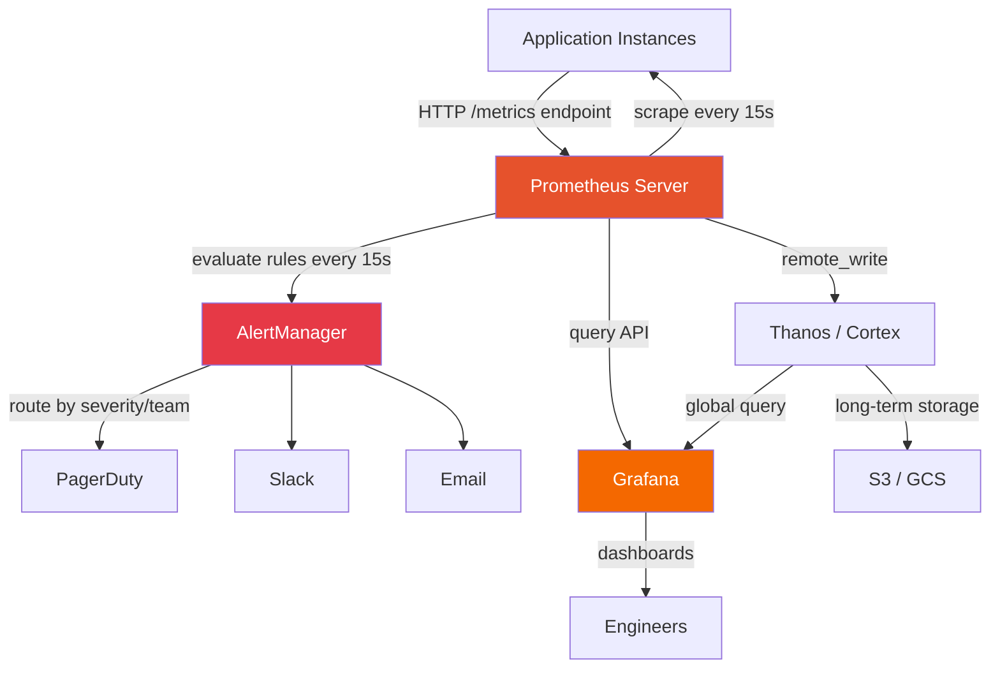

# Prometheus & Grafana: The Production Monitoring Stack

**Your service goes down at 3 AM. You get a Slack alert 8 minutes later — from a user.** You have no metrics, no dashboards, no alerting. You spend 2 hours SSH-ing into servers reading logs, guessing. You `tail -f` application logs on 6 instances. You grep for "ERROR". You find 47,000 errors. All of them are the same DNS timeout. Which started 8 minutes before the user message. Which you could have caught in 30 seconds with a single Prometheus alert.

This is not a tutorial on what Prometheus is. This is how to actually instrument your production system — the labels that matter, the PromQL queries every engineer must know, the alerting rules that fire before your users do.

---

## The Problem Class `[Senior]`

Most engineers set up Prometheus by following a getting-started guide, scraping the default Node.js metrics, and calling it "observability." Then:

- A slow database query makes P99 latency spike from 120ms to 4200ms. Average stays at 140ms. No alert fires.
- A memory leak slowly consumes RAM over 6 hours. No trend alert exists.
- An upstream service starts returning 503s. Error rate climbs to 2%. Alert threshold is 5%. No page.
- A deployment goes bad. Error rate hits 15% for 3 minutes, then recovers. Alert requires 5-minute sustained breach. No page.

The problem is not that Prometheus didn't have the data. It did. The problem is misconfigured instrumentation, wrong metric types, broken PromQL, and alerting thresholds disconnected from business impact.



**The data flow**: Your app exposes `/metrics` in Prometheus text format. Prometheus scrapes every 15 seconds. It stores time-series data locally. AlertManager handles deduplication, grouping, and routing. Grafana queries Prometheus for visualization. Thanos/Cortex provides long-term storage and global federation.

---

## The 4 Metric Types — When to Use Each `[Senior]`

Getting the metric type wrong is one of the most common mistakes. Using a gauge where you need a counter, or a counter where you need a histogram, gives you data that looks right but answers the wrong questions.

### Counter — Always Increasing

Use when: counting events that only go up. Resets to 0 on restart.

```
http_requests_total{method="GET", route="/api/orders", status_code="200"} 48291
errors_total{type="database_timeout"} 127
orders_created_total{tenant="acme"} 891
```

**Always query counters with `rate()`** — the raw value is meaningless without time context:
```promql
rate(http_requests_total[5m])   # requests per second over last 5 minutes
```

**Never alert on raw counter values.** A counter of 50,000 errors means nothing — is that per second, per day, per month?

### Gauge — Current Value

Use when: measuring something that goes up and down. Memory, queue depth, active connections.

```
queue_depth{queue="order_processing"} 4291
memory_usage_bytes{instance="app-01"} 2147483648
active_connections{pool="postgres"} 47
jvm_heap_used_bytes 536870912
```

**Query gauges directly or with `avg_over_time()`:**
```promql
queue_depth{queue="order_processing"}                   # current value
avg_over_time(queue_depth{queue="order_processing"}[5m]) # average over 5m
```

### Histogram — Distribution of Values

Use when: you need percentiles. Request durations, response sizes. This is the most important metric type for latency.

```
http_request_duration_seconds_bucket{le="0.1"} 24000
http_request_duration_seconds_bucket{le="0.5"} 47800
http_request_duration_seconds_bucket{le="1.0"} 48100
http_request_duration_seconds_bucket{le="+Inf"} 48291
http_request_duration_seconds_sum 5821.4
http_request_duration_seconds_count 48291
```

Prometheus stores a bucket for each configured threshold. **Always use `histogram_quantile()` for percentiles:**
```promql
histogram_quantile(0.99, rate(http_request_duration_seconds_bucket[5m]))
```

**Choose bucket boundaries carefully** — they should match your SLO thresholds. If your SLO is < 200ms, buckets at 0.05, 0.1, 0.2, 0.5, 1.0, 2.0 are more useful than the default.

### Summary — Avoid in Most Cases

Pre-computes percentiles on the client side. Problems:
- Cannot aggregate across instances (each instance has its own percentiles)
- Cannot change percentile thresholds without redeploying
- Higher CPU cost on the application

**Use histograms instead.** The only legitimate use for summary is when you absolutely need accurate quantiles for a single-instance application.

---

## Node.js Instrumentation That Actually Works `[Senior]`

### Setup: The metrics module

```javascript
// metrics.js — your single source of metric truth
const client = require('prom-client');

// Enable default metrics: CPU, memory, GC, event loop lag
const register = new client.Registry();
client.collectDefaultMetrics({ register });

// --- HTTP Request Duration (Histogram) ---
// This is your most important metric. Fine-grained buckets around your SLO boundary.
const httpRequestDuration = new client.Histogram({
  name: 'http_request_duration_seconds',
  help: 'Duration of HTTP requests in seconds',
  labelNames: ['method', 'route', 'status_code'],
  buckets: [0.005, 0.01, 0.025, 0.05, 0.1, 0.25, 0.5, 1, 2.5, 5, 10],
  registers: [register],
});

// --- Active Connections (Gauge) ---
const activeConnections = new client.Gauge({
  name: 'http_active_connections',
  help: 'Number of currently active HTTP connections',
  registers: [register],
});

// --- HTTP Requests Total (Counter) ---
const httpRequestsTotal = new client.Counter({
  name: 'http_requests_total',
  help: 'Total number of HTTP requests',
  labelNames: ['method', 'route', 'status_code'],
  registers: [register],
});

// --- Business Metric: Orders (Counter) ---
const ordersCreatedTotal = new client.Counter({
  name: 'orders_created_total',
  help: 'Total number of orders created',
  labelNames: ['tenant', 'payment_method', 'region'],
  registers: [register],
});

// --- Queue Depth (Gauge) ---
const queueDepth = new client.Gauge({
  name: 'order_queue_depth',
  help: 'Current depth of the order processing queue',
  labelNames: ['queue_name', 'priority'],
  registers: [register],
});

// --- Database Query Duration (Histogram) ---
const dbQueryDuration = new client.Histogram({
  name: 'db_query_duration_seconds',
  help: 'Duration of database queries in seconds',
  labelNames: ['operation', 'table'],
  buckets: [0.001, 0.005, 0.01, 0.05, 0.1, 0.5, 1, 5],
  registers: [register],
});

module.exports = {
  register,
  httpRequestDuration,
  activeConnections,
  httpRequestsTotal,
  ordersCreatedTotal,
  queueDepth,
  dbQueryDuration,
};
```

### Express Middleware: Auto-instrument Every Request

```javascript
// middleware/metrics.js
const {
  httpRequestDuration,
  activeConnections,
  httpRequestsTotal,
} = require('../metrics');

function metricsMiddleware(req, res, next) {
  // Track active connections
  activeConnections.inc();

  const start = process.hrtime.bigint();

  // Capture route AFTER Express processes it (so we get /api/orders/:id not /api/orders/12345)
  res.on('finish', () => {
    const durationMs = Number(process.hrtime.bigint() - start) / 1e9;

    // Use req.route?.path to get the parameterized route, not the actual URL
    // This prevents cardinality explosion from /api/orders/12345, /api/orders/12346...
    const route = req.route?.path || req.path || 'unknown';

    const labels = {
      method: req.method,
      route: route,
      status_code: res.statusCode.toString(),
    };

    httpRequestDuration.observe(labels, durationMs);
    httpRequestsTotal.inc(labels);
    activeConnections.dec();
  });

  next();
}

module.exports = metricsMiddleware;
```

**The critical detail**: use `req.route?.path` not `req.path`. If you use `req.path`, every `/api/orders/12345` and `/api/orders/67890` becomes a separate label value. With 1M orders, you have 1M time series just from route labels. `req.route?.path` gives you `/api/orders/:id` — a single time series.

### Business Logic Instrumentation

```javascript
// services/orderService.js
const { ordersCreatedTotal, dbQueryDuration } = require('../metrics');

async function createOrder(orderData) {
  const { tenantId, paymentMethod, region } = orderData;

  // Instrument DB query duration
  const dbTimer = dbQueryDuration.startTimer({ operation: 'insert', table: 'orders' });
  try {
    const order = await db.orders.create(orderData);
    dbTimer({ success: 'true' }); // end timer, add label

    // Business metric — what matters to the business
    ordersCreatedTotal.inc({
      tenant: tenantId,
      payment_method: paymentMethod,
      region: region,
    });

    return order;
  } catch (err) {
    dbTimer({ success: 'false' });
    throw err;
  }
}
```

### The /metrics Endpoint

```javascript
// app.js
const express = require('express');
const { register } = require('./metrics');
const metricsMiddleware = require('./middleware/metrics');

const app = express();

// Apply metrics middleware to all routes
app.use(metricsMiddleware);

// Prometheus scrape endpoint — keep this unauthenticated (or internal-only)
app.get('/metrics', async (req, res) => {
  res.set('Content-Type', register.contentType);
  res.end(await register.metrics());
});
```

---

## PromQL: Queries Every Engineer Must Know `[Senior]`

PromQL has a learning curve. Here are the 10 queries you will write every time you set up monitoring for a service.

### Requests Per Second (Throughput)

```promql
# Total RPS across all instances
rate(http_requests_total[5m])

# RPS per route — see where traffic is going
sum by (route) (rate(http_requests_total[5m]))

# RPS breakdown by status code family — quick health check
sum by (status_code) (rate(http_requests_total[5m]))
```

### P99 Latency — The Number That Matters

```promql
# P99 across all requests
histogram_quantile(0.99, rate(http_request_duration_seconds_bucket[5m]))

# P99 per route — find which endpoints are slow
histogram_quantile(0.99,
  sum by (route, le) (
    rate(http_request_duration_seconds_bucket[5m])
  )
)

# P50, P95, P99 together — full latency picture
histogram_quantile(0.50, rate(http_request_duration_seconds_bucket[5m]))
histogram_quantile(0.95, rate(http_request_duration_seconds_bucket[5m]))
histogram_quantile(0.99, rate(http_request_duration_seconds_bucket[5m]))
```

### Error Rate — What's Breaking

```promql
# Error rate (4xx and 5xx)
rate(http_requests_total{status_code=~"[45].."}[5m])
  /
rate(http_requests_total[5m])

# 5xx error rate only (server errors, not client errors)
rate(http_requests_total{status_code=~"5.."}[5m])
  /
rate(http_requests_total[5m])

# Error rate per route — which endpoint is failing
sum by (route) (rate(http_requests_total{status_code=~"5.."}[5m]))
  /
sum by (route) (rate(http_requests_total[5m]))
```

### Average Latency Per Service

```promql
# Average latency per service — useful for initial triage
avg by (service) (
  rate(http_request_duration_seconds_sum[5m])
  /
  rate(http_request_duration_seconds_count[5m])
)
```

Note: average latency hides outliers. Always supplement with P99. The average can be 50ms while P99 is 5000ms — 1% of your users are having a terrible experience.

### Saturation — Are You At Capacity?

```promql
# Database connection pool saturation
avg(db_active_connections) / avg(db_max_connections)

# Queue saturation — are jobs piling up?
order_queue_depth{queue_name="order_processing"}

# CPU saturation across cluster
avg(rate(process_cpu_seconds_total[5m])) by (instance)
```

### The RED Dashboard — 3 Panels, Full Picture

```
Panel 1 — Rate: sum(rate(http_requests_total[5m]))
Panel 2 — Errors: rate(http_requests_total{status_code=~"5.."}[5m]) / rate(http_requests_total[5m])
Panel 3 — Duration: histogram_quantile(0.99, rate(http_request_duration_seconds_bucket[5m]))
```

---

## The Cardinality Trap `[Senior]`

This deserves special attention because it kills production Prometheus instances regularly.

**The rule**: Every unique combination of label values = one time series.

```
Method (4) × Route (50) × Status (20) = 4,000 series    ✓ Fine
Method (4) × Route (50) × Status (20) × user_id (100K) = 400,000,000 series  ✗ OOM
```

**Labels that will kill you**:
- `user_id` — use user tier instead (`free`, `pro`, `enterprise`)
- `request_id` — never a label, never
- `session_id` — same
- `ip_address` — aggregate to region/datacenter
- `url` (with query params) — use parameterized route
- `timestamp` — this is the time axis, not a label
- Enum values with high cardinality — product SKU IDs with 1M products

**How to detect cardinality problems before they OOM you**:

```promql
# Total number of active time series — monitor this, alert if > 1M
prometheus_tsdb_head_series

# Find the top 10 metrics by cardinality — your offenders
topk(10, count by (__name__)({__name__=~".+"}))

# Find specific metrics that exploded
count by (route) (http_requests_total)  -- should be O(10s), not O(thousands)
```

---

## Recording Rules: Pre-compute for Performance `[Senior]`

Expensive PromQL queries on dashboards can cause Prometheus query overload. Recording rules evaluate queries on a schedule and store the result as a new time series — dashboards then query the pre-computed result.

```yaml
# prometheus-rules.yml
groups:
  - name: request_metrics
    interval: 30s
    rules:
      # Pre-compute P99 per route — expensive without recording rule
      - record: job:http_request_duration_p99:rate5m
        expr: |
          histogram_quantile(0.99,
            sum by (route, le) (
              rate(http_request_duration_seconds_bucket[5m])
            )
          )

      # Pre-compute error rate per service
      - record: job:http_error_rate:rate5m
        expr: |
          sum by (service) (rate(http_requests_total{status_code=~"5.."}[5m]))
          /
          sum by (service) (rate(http_requests_total[5m]))

      # Pre-compute RPS per service
      - record: job:http_requests_per_second:rate5m
        expr: |
          sum by (service) (rate(http_requests_total[5m]))
```

Dashboards then use:
```promql
job:http_request_duration_p99:rate5m{route="/api/orders"}
job:http_error_rate:rate5m{service="order-service"}
```

---

## Alerting Rules: What Should Wake You Up `[Senior]`

Most alerting configs fail in the same ways: too noisy (alert on symptoms that are normal), too quiet (threshold too high), or wrong window (15-second spike triggers 5-minute alert). Here are production-grade alerting rules.

```yaml
# alerting-rules.yml
groups:
  - name: slo_alerts
    rules:
      # High error rate — page immediately
      - alert: HighErrorRate
        expr: |
          sum(rate(http_requests_total{status_code=~"5.."}[5m]))
          /
          sum(rate(http_requests_total[5m]))
          > 0.01
        for: 2m
        labels:
          severity: page
          team: platform
        annotations:
          summary: "Error rate {{ $value | humanizePercentage }} on {{ $labels.service }}"
          description: "Service {{ $labels.service }} error rate has exceeded 1% for 2 minutes. Current value: {{ $value | humanizePercentage }}"
          runbook: "https://runbook.internal/high-error-rate"
          dashboard: "https://grafana.internal/d/service-red?var-service={{ $labels.service }}"

      # P99 latency spike — page if sustained
      - alert: HighP99Latency
        expr: |
          histogram_quantile(0.99, rate(http_request_duration_seconds_bucket[5m]))
          > 2.0
        for: 3m
        labels:
          severity: page
          team: platform
        annotations:
          summary: "P99 latency {{ $value }}s exceeds 2s SLO"
          description: "P99 latency for {{ $labels.route }} is {{ $value }}s. SLO threshold is 2s."
          runbook: "https://runbook.internal/high-latency"

      # SLO breach imminent — fast burn rate
      - alert: ErrorBudgetBurnRateFast
        expr: |
          (
            rate(http_requests_total{status_code=~"5.."}[1h])
            /
            rate(http_requests_total[1h])
          ) / (1 - 0.999) > 14.4
        for: 5m
        labels:
          severity: page
          team: platform
        annotations:
          summary: "Error budget burning at {{ $value }}x — SLO breach in < 2 hours"

      # Queue growing — upstream pressure
      - alert: QueueDepthHigh
        expr: order_queue_depth > 10000
        for: 5m
        labels:
          severity: warning
          team: orders
        annotations:
          summary: "Order queue depth {{ $value }} exceeds threshold"

      # No traffic at all — could be deployment issue or traffic drop
      - alert: NoTrafficAlert
        expr: |
          sum(rate(http_requests_total[5m])) < 0.1
        for: 5m
        labels:
          severity: page
        annotations:
          summary: "No HTTP traffic detected for 5 minutes"
```

### AlertManager Configuration

```yaml
# alertmanager.yml
global:
  resolve_timeout: 5m
  slack_api_url: 'https://hooks.slack.com/services/YOUR/WEBHOOK/URL'

route:
  group_by: ['alertname', 'service', 'team']
  group_wait: 30s       # wait 30s to group related alerts before first notification
  group_interval: 5m    # wait 5m before sending new alerts for same group
  repeat_interval: 4h   # resend if not resolved after 4h
  receiver: 'slack-default'
  routes:
    - match:
        severity: page
      receiver: 'pagerduty-oncall'
      continue: true   # also send to Slack
    - match:
        severity: page
      receiver: 'slack-critical'

receivers:
  - name: 'pagerduty-oncall'
    pagerduty_configs:
      - service_key: 'YOUR_PAGERDUTY_KEY'
        description: '{{ .GroupLabels.alertname }}: {{ .Annotations.summary }}'
        details:
          runbook: '{{ .Annotations.runbook }}'
          dashboard: '{{ .Annotations.dashboard }}'

  - name: 'slack-critical'
    slack_configs:
      - channel: '#alerts-critical'
        title: '{{ .GroupLabels.alertname }}'
        text: '{{ range .Alerts }}{{ .Annotations.description }}{{ end }}'
        color: 'danger'

  - name: 'slack-default'
    slack_configs:
      - channel: '#alerts'
        title: '{{ .GroupLabels.alertname }}'
        text: '{{ range .Alerts }}{{ .Annotations.summary }}{{ end }}'
```

---

## Prometheus Storage and Retention `[Senior]`

By default Prometheus stores 15 days of data locally. This is usually not enough for trend analysis, capacity planning, or quarterly business reviews.

```yaml
# prometheus.yml global config
global:
  scrape_interval: 15s       # How often to scrape targets
  evaluation_interval: 15s   # How often to evaluate alerting rules

storage:
  tsdb:
    retention.time: 30d      # Keep 30 days locally
    retention.size: 50GB     # Or size limit, whichever comes first

# Remote write to Thanos/Cortex for long-term storage
remote_write:
  - url: "https://thanos-receive.internal:19291/api/v1/receive"
    queue_config:
      max_samples_per_send: 1000
      max_shards: 200
      capacity: 2500
    write_relabel_configs:
      # Only remote-write metrics that match these names (reduce cost)
      - source_labels: [__name__]
        regex: "http_request.*|orders.*|db_query.*|node_.*"
        action: keep
```

**Thanos vs Cortex**:
- **Thanos**: Sidecar model, stores blocks to object storage (S3/GCS), good for long-term read
- **Cortex/Mimir**: Fully managed HA Prometheus, better for multi-tenant, write path optimized
- **Victoria Metrics**: Drop-in Prometheus replacement with better compression and query performance

---

## Production Patterns `[Staff]`

### Pattern 1: Scrape Config with Service Discovery

```yaml
# prometheus.yml scrape config
scrape_configs:
  - job_name: 'kubernetes-pods'
    kubernetes_sd_configs:
      - role: pod
    relabel_configs:
      # Only scrape pods with annotation prometheus.io/scrape: "true"
      - source_labels: [__meta_kubernetes_pod_annotation_prometheus_io_scrape]
        action: keep
        regex: true
      # Use the port from annotation prometheus.io/port
      - source_labels: [__meta_kubernetes_pod_annotation_prometheus_io_port]
        action: replace
        target_label: __address__
        regex: (.+)
        replacement: ${1}
      # Add pod name and namespace as labels
      - source_labels: [__meta_kubernetes_pod_name]
        action: replace
        target_label: pod
      - source_labels: [__meta_kubernetes_namespace]
        action: replace
        target_label: namespace
```

### Pattern 2: Multi-Instance Aggregation

When you have 10 instances of a service, you need to aggregate correctly:

```promql
# WRONG: averages the P99 of each instance (not meaningful)
avg(histogram_quantile(0.99, rate(http_request_duration_seconds_bucket[5m])))

# RIGHT: compute P99 across all instances combined
histogram_quantile(0.99,
  sum by (le) (rate(http_request_duration_seconds_bucket[5m]))
)
```

### Pattern 3: Alert on Derivative (Rate of Change)

```promql
# Alert when memory is growing faster than 100MB/5min (memory leak detector)
predict_linear(process_resident_memory_bytes[1h], 4 * 3600) > (4 * 1024 * 1024 * 1024)

# Detect sudden drops in traffic (deployment went bad, traffic stopped)
abs(
  rate(http_requests_total[5m])
  -
  rate(http_requests_total[5m] offset 1h)
) > 100
```

---

## Common Mistakes `[Senior]`

**Mistake 1: Using average latency instead of P99**
Average hides the tail. 95% of requests at 50ms, 5% at 10000ms → average of 547ms. Your SLO is "< 500ms average" — technically met. 5% of users hate you.

**Mistake 2: Alerting on raw values instead of rates**
`http_errors_total > 100` fires constantly (counter keeps going up). `rate(http_errors_total[5m]) > 2` means 2 errors/second — actually actionable.

**Mistake 3: Alert `for: 0s` (instant alerts)**
A 30-second spike fires an alert, wakes someone up at 3 AM. Add `for: 2m` to require sustained breach. For truly critical paths, `for: 1m` is fine, but never `0s`.

**Mistake 4: No grouping in AlertManager**
10 instances each fire an error rate alert = 10 pages in 30 seconds. Add `group_by: [alertname, service]` to get one page per incident.

**Mistake 5: Not testing alerting rules**
Use `promtool test rules` with a test fixtures file. Alerting rules that are never tested get silently broken after PromQL changes.

**Mistake 6: Scraping too frequently**
15s interval is standard. Some engineers set 5s "for more resolution." This triples Prometheus storage and CPU with no real benefit — most issues are not visible at 5s vs 15s resolution.

---

## Real-World Context

**SoundCloud invented Prometheus** in 2012 because they had 400 microservices and Graphite/Nagios couldn't handle the cardinality of per-service, per-endpoint metrics. The pull model (scraping) was a deliberate choice — it means Prometheus can discover new targets without configuration changes, and a dead service simply disappears from scrape results (triggering an absence alert).

**Netflix** runs Prometheus at scale with Atlas as the metrics backend, doing ~1M metrics writes/second. They use aggressive recording rules and tiered retention: 15 seconds for 2 days, 1 minute for 14 days, 5 minutes for 90 days.

**Kubernetes itself** exposes metrics in Prometheus format — the kube-state-metrics and metrics-server integrations mean you get cluster health "for free" once Prometheus is deployed.

---

## Key Takeaways

1. **Use the right metric type**: Counter (events) + rate(), Gauge (current state), Histogram (distributions/percentiles)
2. **Route labels must be parameterized**: `/api/orders/:id` not `/api/orders/12345` — or Prometheus OOMs
3. **P99 > average**: Average latency is almost always the wrong metric for SLO monitoring
4. **Rate then alert**: All counter-based alerts use `rate()` — never alert on raw counter values
5. **Recording rules for expensive queries**: Pre-compute P99 per route on a schedule; dashboards query results
6. **Multi-window alerting**: Fast-burn (short window, high rate) for immediate pages; slow-burn (long window, low rate) for tickets
7. **Test your alerts**: `promtool test rules` before going to production — broken alerts are invisible until you need them
8. **Remote write for durability**: Local Prometheus is ephemeral; Thanos/Cortex/Mimir for anything > 30 days
