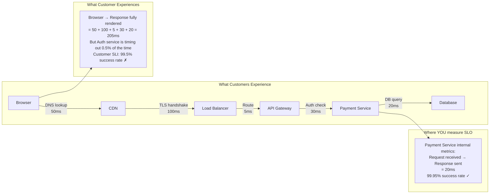
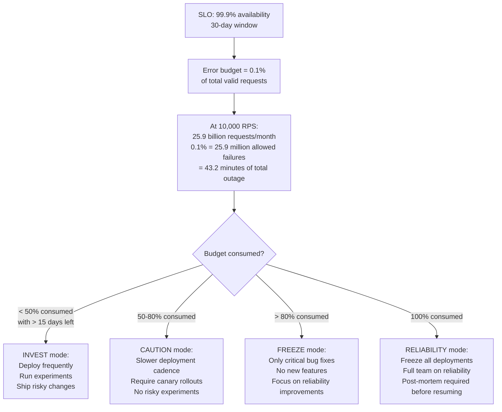
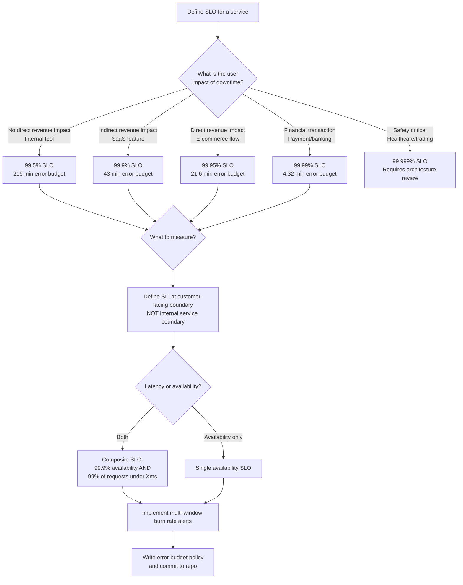

# SLO and Error Budgets: Definition, Measurement, and Budget Policy

**Every team thinks they have SLOs. Most teams have uptime percentages calculated from the wrong boundary, measuring the wrong thing, with policies nobody enforces.** A 99.9% SLO measured at your load balancer means nothing if DNS resolution, CDN, and client-side JavaScript add another 800ms of latency that your SLO ignores. Getting the measurement boundary right is the hardest, most important part of SLO design.

---

## The Problem Class `[Mid]`

Your payment service has a 99.9% availability SLO. It "achieves" 99.95% by your internal metrics. Customers are submitting support tickets saying checkout is broken. What is happening?



The measurement boundary problem: your SLO is measured at the payment service boundary. Auth service timeouts happen *before* the payment service receives the request — they never appear in your metrics. Your SLO says 99.95% but customers experience 99.5%. The 0.45% gap is not in your monitoring blind spot, it is in your measurement blind spot.

### The Three Layers of SLO Boundary Mistakes

```
Layer 1 - Wrong service boundary:
  Measuring at payment service → misses auth failures, API gateway errors
  Fix: Measure at the customer-facing entry point (API gateway or CDN)

Layer 2 - Wrong success criteria:
  "Request returns 200" → misses successful HTTP 200 with empty response body
  "Checkout API returned 200" but order_id is null → customer cannot track order
  Fix: Application-level success check, not just HTTP status

Layer 3 - Wrong population:
  "% of requests < 200ms" using all requests including retries
  Client retries 3x before succeeding: 3 requests in metrics, only 1 user experience
  Fix: Measure only first-attempt requests, or measure from client side
```

---

## Why the Obvious Solution Fails `[Senior]`

### Naive Approach: Uptime Percentage

"We have 99.9% uptime." What does this mean? Usually:
- Service is reachable via health check
- Health check is `/health` returning HTTP 200
- Health check does NOT test: database connectivity, downstream dependencies, correct response body
- A service returning HTTP 200 `{"error": "database connection failed"}` scores as "up"

Uptime percentage is a metric about whether your process is running, not whether your service is working.

### Naive Approach: Average Response Time

"Average response time is 95ms, within SLO." Average is the worst metric for latency SLOs:
- If 99% of requests complete in 50ms and 1% take 5,000ms: average = 100ms
- Users experiencing 5,000ms: 1 in 100. At 10,000 RPS = 100 users/second suffering
- Your average looks fine; your users are furious

**Always use percentiles. The SLO should specify p50, p95, or p99 — never average.**

### Naive Approach: Setting SLO = Current Performance

"We're currently achieving 99.8%, so let's set the SLO at 99.8%." Three problems:
1. If you're achieving 99.8% naturally, you have 0 error budget — any incident immediately breaches SLO
2. No room for planned maintenance, deployments, experiments
3. SLO becomes a liability audit rather than a risk management tool

**Correct approach**: Set SLO below current performance by your error budget, not at it.

---

## The Solution Landscape `[Senior]`

### SLI Definition: What to Measure and How

**What it is**

An SLI (Service Level Indicator) is a carefully defined, quantified measure of a property of your service. The key constraint: it must be measured from the customer's perspective, not the service's.

**The SLI Equation**

```
SLI = (count of good events) / (count of valid events) × 100%

"good event" = the event satisfies the user's expectation
"valid event" = an event that SHOULD be good (exclude health checks, admin calls)

Example: Checkout SLI
- Valid events: all checkout POST requests from authenticated users
- Good events: requests that return 200 with non-null order_id in < 3 seconds
- Exclude: health check calls, internal admin calls, pre-flight OPTIONS requests

SLI = (checkouts completing successfully in < 3s) / (all checkout attempts) × 100%
```

**SLI types and when to use each**:

```
Availability SLI:
  Formula: successful_requests / total_requests
  Use when: Service availability is the primary concern
  Example: checkout_success / checkout_attempts

Latency SLI:
  Formula: requests_under_threshold / total_requests
  Use when: Speed is the primary user concern
  Example: checkouts_under_3s / checkout_attempts
  CAUTION: Must specify a threshold, not average

Quality SLI:
  Formula: requests_with_correct_data / total_requests
  Use when: Accuracy matters more than availability
  Example: search_results_with_matching_products / total_searches
  Hard to measure — requires application logic in SLI definition

Coverage SLI:
  Formula: processed_items / total_items_to_process
  Use when: Batch processing, pipelines
  Example: events_processed_within_60s / events_received
```

---

### SLO Target Setting `[Staff+]`

**What it is**

The right SLO target is the minimum reliability level that users tolerate, with enough error budget to ship changes.

**The 99.9% vs 99.99% cost analysis**:

```
Service: checkout API
Traffic: 10,000 RPS
Duration: 1 month (30 days)
Total requests: 10,000 × 86,400 × 30 = 25.9 billion

99.9% SLO:
  Error budget: 0.1% × 25.9B = 25.9 million allowed failures
  Or: 43.2 minutes of complete outage per month
  Required infrastructure cost: $X baseline

99.99% SLO:
  Error budget: 0.01% × 25.9B = 2.59 million allowed failures
  Or: 4.32 minutes of complete outage per month
  Required infrastructure change:
  - Eliminate single points of failure: +$15K/month (multi-AZ everything)
  - Reduce deployment downtime: blue-green deployments: +$8K/month engineering
  - Improve database HA: +$5K/month for synchronous replication
  - 24/7 on-call rotation: +$30K/month staffing cost
  Total additional cost: ~$58K/month

99.999% SLO ("five nines"):
  Or: 26 seconds of complete outage per month
  Requires: Multi-region active-active, chaos engineering, zero-downtime deploys
  Additional cost vs 99.9%: ~$150K/month
  Only justified if customer contract requires it (typically: financial, healthcare)
```

**SLO target decision matrix**:

```
User tolerance analysis:
- Consumer app (social media): 99.5% - users retry naturally
- B2B SaaS (internal tools): 99.9% - occasional downtime accepted
- E-commerce checkout: 99.95% - lost sale = lost revenue
- Payment processing: 99.99% - direct financial impact
- Healthcare systems: 99.99%+ - regulatory/safety requirement
- Financial trading: 99.999% - every second costs $X

Rule: SLO cost increases exponentially as you add 9s.
99% → 99.9%: 10x less downtime, 2-3x infrastructure cost increase
99.9% → 99.99%: 10x less downtime, 10x infrastructure cost increase
99.99% → 99.999%: 10x less downtime, 50x+ infrastructure cost increase
```

---

### Error Budget Calculation and Policy `[Staff+]`

**How it actually works at depth**



**Error Budget Policy (the policy nobody writes but everyone needs)**

```yaml
# error-budget-policy.yaml — commit this to your service repository

service: checkout-api
slo_target: 99.9%
window: 30d
error_budget_minutes: 43.2

policy:
  invest:  # < 50% budget consumed
    description: "Normal operations, invest in velocity"
    deployment_frequency: multiple_per_day
    canary_required: false
    feature_flags_required: false
    experiment_allowed: true

  caution:  # 50-80% budget consumed
    description: "Elevated caution, slow down but don't stop"
    deployment_frequency: once_per_day_max
    canary_required: true  # All deploys via canary
    canary_duration_minutes: 30
    feature_flags_required: true  # All new features behind flags
    experiment_allowed: false  # No risky experiments

  freeze:  # 80-99% budget consumed
    description: "Budget nearly exhausted, reliability work only"
    deployment_frequency: emergency_only
    canary_required: true
    canary_duration_minutes: 60
    feature_flags_required: true
    experiment_allowed: false
    reliability_sprint_required: true  # Team dedicates 50% to reliability

  exhausted:  # > 100% budget consumed
    description: "SLO breached, all hands on reliability"
    deployment_frequency: none  # No deploys
    feature_work_allowed: false
    post_mortem_required: true  # Before any deployment resumes
    stakeholder_notification: true  # Inform product/leadership

reporting:
  daily_slack_update: true
  monthly_review_meeting: true
  stakeholder_report: quarterly
```

---

### Multi-Window Error Budget Burn Rate `[Staff+]`

**Why single-window burn rate is insufficient**:

```
Problem: Single-window can be gamed by timing
- 1-hour window burn rate: 14x
- Alert fires
- Engineer does nothing for 1 hour
- Burn rate metric drops (the bad hour is now outside the window)
- Alert resolves
- Budget still consumed, issue not fixed

Solution: Multi-window burn rate (requires BOTH windows to be elevated)
```

**The Google SRE Workbook's recommended thresholds for 30-day SLO**:

```
For 99.9% SLO (0.1% error budget):

Page immediately (severity: critical):
  Condition: 1h_burn > 14 AND 5m_burn > 14
  Interpretation: Budget will be exhausted in 2 days
  Budget consumed before detection: ~2%

Page soon (severity: warning):
  Condition: 6h_burn > 6 AND 30m_burn > 6
  Interpretation: Budget will be exhausted in 5 days
  Budget consumed before detection: ~5%

Ticket (severity: info):
  Condition: 3d_burn > 3
  Interpretation: Budget will be exhausted in 10 days
  Budget consumed before detection: ~10%

Math check for "page immediately":
14x burn × 0.001 (SLO) = 0.014 error rate (1.4%)
1 hour of 1.4% error rate at 10,000 RPS:
  = 10,000 × 3600 × 0.014 = 504,000 errors
  = 504,000 / 25,900,000 = 1.95% of monthly budget consumed before first page

Trade-off: Fast detection vs false positive risk
  Fast burn 14x: very sensitive, detects major incidents quickly
  Slow burn 3x: catches insidious degradation over days
  Both needed: fast incidents + slow degradation coverage
```

**Prometheus rules for multi-window burn rate**:

```yaml
groups:
  - name: error-budget-burn-rate
    rules:
      # Pre-computed error rates at multiple windows
      - record: service:checkout:error_rate5m
        expr: |
          sum(rate(http_requests_total{service="checkout",status_class="5xx"}[5m]))
          / sum(rate(http_requests_total{service="checkout"}[5m]))

      - record: service:checkout:error_rate1h
        expr: |
          sum(rate(http_requests_total{service="checkout",status_class="5xx"}[1h]))
          / sum(rate(http_requests_total{service="checkout"}[1h]))

      - record: service:checkout:error_rate6h
        expr: |
          sum(rate(http_requests_total{service="checkout",status_class="5xx"}[6h]))
          / sum(rate(http_requests_total{service="checkout"}[6h]))

      - record: service:checkout:error_rate3d
        expr: |
          sum(rate(http_requests_total{service="checkout",status_class="5xx"}[3d]))
          / sum(rate(http_requests_total{service="checkout"}[3d]))

      # Error budget remaining (30-day window)
      - record: service:checkout:error_budget_remaining
        expr: |
          1 - (
            sum(increase(http_requests_total{service="checkout",status_class="5xx"}[30d]))
            / sum(increase(http_requests_total{service="checkout"}[30d]))
          ) / 0.001  # Divide by (1 - SLO target)

      # Critical: fast burn
      - alert: CheckoutFastBurn
        expr: |
          (service:checkout:error_rate5m > 14 * 0.001)
          AND
          (service:checkout:error_rate1h > 14 * 0.001)
        for: 2m
        labels:
          severity: critical

      # Warning: slow burn
      - alert: CheckoutSlowBurn
        expr: |
          (service:checkout:error_rate30m > 6 * 0.001)
          AND
          (service:checkout:error_rate6h > 6 * 0.001)
        for: 15m
        labels:
          severity: warning
```

---

## Trade-off Matrix `[Senior]` → `[Staff+]`

| Dimension | 99.5% SLO | 99.9% SLO | 99.99% SLO | 99.999% SLO |
|---|---|---|---|---|
| Monthly downtime budget | 216 min | 43.2 min | 4.32 min | 26 sec |
| Infrastructure cost multiplier | 1x | 2-3x | 10-15x | 50x+ |
| Engineering complexity | Low | Medium | High | Very High |
| Multi-AZ required | No | Recommended | Required | Required |
| Multi-region required | No | No | No | Required |
| Zero-downtime deploys | Optional | Recommended | Required | Required |
| Chaos engineering | No | Optional | Recommended | Required |
| Best for | Internal tools | B2B SaaS | E-commerce | Payments/health |

---

## Decision Framework `[Senior]` → `[Staff+]`



---

## Production Failure Story `[Staff+]`

**The Wrong Measurement Boundary — Mobile App, 50M Users**

A consumer app had a 99.9% availability SLO on their API service, measured at the API gateway. They were achieving 99.97% — well within budget. Customer satisfaction surveys showed 23% of users experienced "checkout not working" issues.

Investigation revealed three separate issues, none visible in their SLO:

1. **Client-side JavaScript timeout**: The checkout JS bundle had a 5-second timeout before fallback. API calls took 4.8 seconds occasionally (within their 5-second SLO). But the JS timeout fired first, showing users an error screen. The API call succeeded, but the user saw failure. Measurement boundary issue: they measured at the API, not at the JavaScript layer.

2. **Third-party payment widget failure**: PayPal's embedded checkout widget failed to load for users on corporate networks (URL blocked). No impact to their API metrics — the request never reached them. 8% of corporate users couldn't checkout. Measurement boundary issue: they didn't measure the full payment flow.

3. **iOS-specific TLS version incompatibility**: iOS 13 devices (still 12% of their base) had a TLS handshake issue with their CDN after a CDN configuration change. The CDN successfully negotiated TLS fallback, but it took 3 additional seconds. Users experienced 6-second checkout load times. Not visible in API metrics (request arrived normally, just 3 seconds late).

**All three were invisible because they measured at the wrong boundary.**

Fix:
1. Moved SLI measurement to client-side: JavaScript SDK emits "checkout attempted" and "checkout completed" events with latency
2. Added synthetic monitoring from external probes (see synthetic-monitoring.md article)
3. Real User Monitoring (RUM) to capture actual browser-side checkout completion rates
4. New SLI: "(checkout_completed_by_client / checkout_attempted_by_client) within 10s" — measured from the user's browser

New SLI accuracy: matched customer satisfaction survey data within 2%.

---

## Observability Playbook `[Staff+]`

### SLO Dashboard Requirements

```
Dashboard MUST contain (in this order):
1. Current SLO compliance: Are we meeting the SLO right now?
   Metric: current_period_SLI vs SLO_target

2. Error budget remaining: How much budget do we have left?
   Metric: error_budget_remaining_percent (gauge, 0-100%)
   Color: green > 50%, yellow 25-50%, red < 25%

3. Burn rate: How fast are we consuming the budget?
   Metric: current burn rate vs 1x sustainable burn
   Alert if > 14x (fast burn) or > 3x (slow burn)

4. SLI trend (30-day chart): Is reliability improving or degrading over time?
   Chart: daily SLI value, SLO target line

5. Error budget consumption (30-day chart): How is the budget being spent?
   Chart: cumulative budget consumed, expected linear consumption line
   If actual > expected: consuming faster than expected (investigate)
   If actual < expected: being too conservative (can accelerate deployment)
```

### Quarterly SLO Review Template

```
SERVICE: [Service name]
PERIOD: [Q1 2026]
OWNER: [Team name]

1. SLO PERFORMANCE
   Target: 99.9%
   Achieved: 99.87% ← Below SLO
   Error budget: 43.2 min / Used: 52 min (120% consumed)

2. INCIDENTS CONSUMING BUDGET
   Incident 1: DB migration caused 12 min downtime (2026-01-15)
   Incident 2: Memory leak caused 25 min degradation (2026-02-03)
   Incident 3: Dependency failure caused 15 min errors (2026-02-28)

3. ROOT CAUSE ANALYSIS
   All three incidents were preventable with better change management

4. SLO ADJUSTMENT
   Option A: Keep 99.9% target — requires reliability investment
   Option B: Lower to 99.5% — matches actual delivery capability
   Decision: Keep 99.9% — critical business path, invest in reliability

5. NEXT QUARTER COMMITMENTS
   - Add change freeze 48h before month-end to protect budget
   - Require canary deployments for database schema changes
   - Add DB connection pool alerting before incident threshold
```

---

## Architectural Evolution `[Staff+]`

```
Phase 1 (Initial SLO adoption):
- Define 1 availability SLO per critical user journey
- Measure at API gateway level (imperfect but tractable)
- Accept boundary limitations, document them
- Tool: Prometheus + Grafana SLO dashboard

Phase 2 (Refined measurement):
- Add client-side SLI measurement (RUM)
- Add synthetic monitoring for external perspective
- Define composite SLOs (availability + latency)
- Add error budget policy to deployment runbooks
- Tool: OpenTelemetry + Grafana + synthetic probes

Phase 3 (SLO as culture):
- Error budget policy enforced by deployment tooling
- Automated deployment freeze when budget exhausted
- SLO review embedded in sprint retrospectives
- Multi-window burn rate alerts replace threshold alerts
- Tool: Sloth (SLO-as-code) + automated budget enforcement

Phase 4 (2026 - Continuous SLO):
- SLI measured at eBPF layer (kernel-level, zero overhead)
- AI-assisted SLO target recommendations based on traffic patterns
- Automatic SLI boundary detection from distributed traces
- Error budget correlated with business metrics (revenue impact per % budget consumed)
```

---

## Decision Framework Checklist `[All Levels]`

- [ ] Is your SLI measured at the customer-facing boundary (not internal service boundary)?
- [ ] Does your SLI exclude health check calls, internal admin calls, and retries?
- [ ] Are you using percentiles (p99, p95) not averages for latency SLIs?
- [ ] Is your SLO target below current performance (to allow error budget)?
- [ ] Have you calculated the infrastructure cost implication of each 9 you add?
- [ ] Do you have a written error budget policy (invest/caution/freeze/exhausted)?
- [ ] Is the error budget policy enforced (not just documented)?
- [ ] Have you implemented multi-window burn rate alerts (not single-threshold alerts)?
- [ ] Do you track error budget consumption trend (are you improving quarter-over-quarter)?
- [ ] Have you validated your SLI against customer satisfaction data (do they correlate)?

*Written by Gaurav Porwal — 10+ Year Engineer | Tech Lead | Product Owner | Business-Minded Builder*
*Last updated: 2026-03-18*
