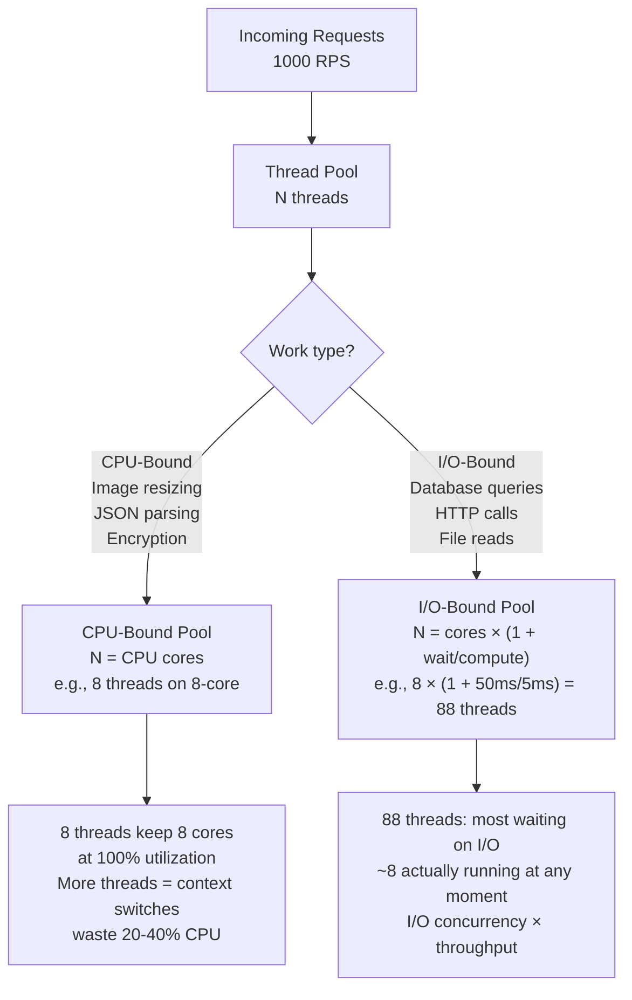
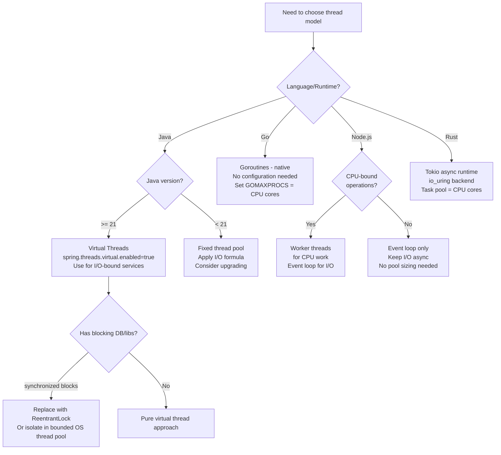

# Thread Pool Sizing: CPU-Bound vs I/O-Bound and Little's Law Formula

**You set your thread pool size to 500 because "more threads = more concurrency." Response times went up, not down. CPU is at 100% but throughput decreased by 30%.** You just discovered that oversizing a thread pool can be worse than undersizing it — context-switch overhead consumed the CPU cycles you needed for actual work.

---

## The Problem Class `[Mid]`

Thread pools exist because thread creation is expensive (~1ms, ~1MB stack) and unbounded thread creation causes resource exhaustion. A thread pool reuses threads across requests. The core question: **how many threads should the pool contain?**

The answer depends entirely on whether the work is CPU-bound or I/O-bound — and most systems do both.



**Little's Law** (John Little, 1961 — still the foundation of queue theory in 2026):

```
L = λ × W

Where:
  L = average number of requests in the system (queue + service)
  λ = average arrival rate (requests/second)
  W = average time a request spends in the system (seconds)

For thread pool sizing:
  Required threads = Throughput (RPS) × Latency (seconds)

Example:
  Target: 500 RPS, average response time 200ms
  Required threads = 500 × 0.200 = 100 threads (minimum)
  With safety margin: 100 × 1.3 = 130 threads
```

---

## Why the Obvious Solution Fails `[Senior]`

**Setting pool size = max expected concurrent users** is intuitive but wrong. It treats threads as "one per user" but ignores that threads spend most of their time waiting, not computing.

**Oversizing fails because**:

1. **Context switching overhead**: Linux kernel context switches take ~2-10 microseconds. At 1,000 threads switching at OS scheduler frequency (1ms), that's ~10ms of pure overhead per second per core — consuming 1% of CPU doing nothing useful. At 10,000 threads, this becomes 10% of CPU wasted on switching.

2. **CPU cache thrashing**: Each context switch may evict L1/L2 cache contents. A thread waking up after a switch likely has cold cache, increasing memory access latency by 10-100x for the first few operations.

3. **Memory overhead**: Each OS thread needs a stack. Default stack size on Linux: 8MB (ulimit -s). 1,000 threads × 8MB = 8GB of virtual address space committed to stacks alone. Java reduces this to 512KB-1MB with `-Xss512k`, but it's still significant.

4. **Thundering herd on I/O completion**: When a large batch of I/O operations completes simultaneously, all waiting threads wake up and compete for CPU. This creates a burst of context switches at the worst time.

**Undersizing fails because**:
- Requests queue behind the pool
- Queue depth grows → latency increases (Little's Law: W = L/λ; if L is bounded by pool size, W grows with λ)
- Queue overflow → rejection or timeout

---

## The Solution Landscape `[Senior]`

### Solution 1: CPU-Bound Thread Pool Sizing

**What it is**

For CPU-bound work (computation, parsing, cryptography, compression), threads should equal the number of available CPU cores. Adding more threads means context switching adds overhead without adding parallelism.

**How it actually works at depth**

On a system with N cores, the maximum CPU utilization with T threads is:

```
Effective parallelism = min(T, N)
Context-switch overhead = max(0, T - N) × switching_cost / total_time
Net throughput = (T / N) × base_throughput × (1 - overhead_fraction)
```

For N=8 cores:
- T=8: overhead=0, throughput=100%
- T=16: overhead≈5%, throughput≈95%
- T=32: overhead≈15%, throughput≈85%
- T=64: overhead≈35%, throughput≈65% (measured on Intel Xeon, Linux scheduler)

**Sizing guidance** `[Staff+]`

```java
// Java: CPU-bound pool
int cpuCores = Runtime.getRuntime().availableProcessors();
ExecutorService cpuBoundPool = Executors.newFixedThreadPool(cpuCores);

// For containerized environments (Docker/Kubernetes):
// Runtime.availableProcessors() returns HOST CPU count without CPU quotas
// Use: Math.max(1, (int)(cpuQuota / cpuPeriod)) from /sys/fs/cgroup

// Better: use thread count = cpuCores + 1 to account for one thread
// occasionally blocked on memory allocation or minor I/O
int cpuBoundPoolSize = cpuCores + 1; // The "+1" is standard practice (Brian Goetz)
```

**Configuration decisions that matter** `[Staff+]`

- **ForkJoinPool for recursive algorithms**: Java's `ForkJoinPool.commonPool()` uses `availableProcessors() - 1` threads by default. Appropriate for parallel streams and CompletableFuture's default executor.
- **Affinity-based threading**: For ultra-low-latency (trading, game servers), pin threads to specific CPU cores using Linux `taskset` or Java's `thread-affinity` library. Eliminates cache migration between cores.
- **NUMA awareness**: On multi-socket servers, memory access to remote NUMA node takes 2-3× longer. Pin CPU-bound thread pools to a single NUMA node for consistent memory access latency.

**Failure modes** `[Staff+]`

- **Hyperthread miscounting**: `availableProcessors()` returns logical cores (including hyperthreads). For CPU-bound work, physical cores = logical / 2 often gives better throughput due to shared L2 cache.
- **Container CPU throttling**: If CPU request < CPU limit in Kubernetes, the pod is throttled. Threads don't die; they simply don't get scheduled. Pool appears correct but throughput is unexpectedly low. Monitor `container_cpu_throttled_seconds_total`.

---

### Solution 2: I/O-Bound Thread Pool Sizing

**What it is**

For I/O-bound work, threads spend most time waiting for network, disk, or database responses. The optimal pool size is larger than CPU count because while one thread waits on I/O, others can use the CPU.

**How it actually works at depth**

The classic formula:

```
Optimal thread count = N_cores × (1 + Wait_time / Compute_time)

Where:
  Wait_time = average time spent waiting for I/O
  Compute_time = average time spent on CPU computation

Example — HTTP service calling a database:
  N_cores = 8
  Wait_time = 45ms (database query round trip)
  Compute_time = 5ms (JSON serialization + business logic)
  Optimal threads = 8 × (1 + 45/5) = 8 × 10 = 80 threads
```

**But this formula has important limits** `[Staff+]`:

The formula assumes all threads can make progress independently. In practice:
- Connection pool limits act as a hard ceiling: if database connection pool = 20, having 80 threads means 60 are always waiting for a connection, not for the database
- Upstream service rate limits similarly cap effective concurrency
- Thread pool size should be `min(formula_result, bottleneck_resource_limit × 1.1)`

```
Revised formula:
  Pool_size = min(
    N_cores × (1 + avg_wait / avg_compute),  # Little's Law result
    min_upstream_pool_size × 1.1,             # Don't exceed bottleneck
    target_throughput × avg_latency × 1.3     # Little's Law from SLO
  )
```

**Sizing guidance** `[Staff+]`

For a Spring Boot service:
```yaml
# application.yml — Tomcat thread pool
server:
  tomcat:
    threads:
      max: 80          # From formula above
      min-spare: 20    # Warm threads, avoids cold start latency
    accept-count: 200  # Queue depth before rejecting connections
    connection-timeout: 20000  # 20s timeout prevents pool starvation

# HikariCP — Database connection pool (must coordinate with thread pool)
spring:
  datasource:
    hikari:
      maximum-pool-size: 20     # DB connection limit
      minimum-idle: 5
      connection-timeout: 5000  # Fail fast rather than queue indefinitely
```

**Calculating the queue safety margin**:

With 80 threads and 200ms average latency, steady-state in-flight requests = 80 × (1/0.200) = 400 RPS capacity. At 500 RPS, requests queue: queue growth = (500 - 400) × 0.200 = 20 requests per second. At `accept-count=200`, queue fills in 10 seconds. This tells you when to scale out.

**Configuration decisions that matter** `[Staff+]`

- **Separate pools for different I/O types**: Never share a pool between database calls and external HTTP calls. If the HTTP endpoint goes slow (100ms → 5,000ms), the shared pool fills with blocked threads and database calls queue.
- **Timeout all I/O**: Thread pool threads blocked without a timeout are permanently unavailable to new requests. Set `connection-timeout`, `read-timeout`, and `write-timeout` on every I/O operation.
- **Bulkhead pattern**: Use separate pools (Resilience4j Bulkhead) for each downstream service. One slow dependency uses only its allocated threads.

**Failure modes** `[Staff+]`

- **Pool starvation cascade**: Thread pool fills, requests queue, queue fills, upstream load balancer health check fails (no threads to handle health check), pod marked unhealthy, removed from rotation, remaining pods get more traffic, cascade.
- **Lock convoy**: Many threads wake up simultaneously to acquire a shared lock (connection pool). Most sleep again immediately. High overhead at peak load. Use `connection-timeout` to fail fast rather than queue.

---

### Solution 3: Virtual Threads — Java 21 Project Loom

**What it is**

Java 21 LTS introduced virtual threads (Project Loom) as a production-ready feature. Virtual threads are lightweight threads managed by the JVM, not the OS. The JVM multiplexes thousands of virtual threads onto a small number of OS "carrier" threads.

**How it actually works at depth**

When a virtual thread blocks on I/O (socket read, database query), the JVM unmounts it from its carrier OS thread and parks it. The OS thread is immediately available for another virtual thread. When the I/O completes, the virtual thread is rescheduled on any available carrier thread.

```
Traditional OS threads:
  10,000 requests → 10,000 OS threads → OS scheduler manages 10,000 threads
  Memory: 10,000 × 1MB = 10GB stack space
  Context switches: O(10,000)

Virtual threads:
  10,000 requests → 10,000 virtual threads → 8 carrier OS threads (= CPU cores)
  Memory: 10,000 × ~1KB initial stack = 10MB
  Context switches at OS level: O(8), JVM-level switches: O(10,000) but cheap
```

**Sizing guidance** `[Staff+]`

```java
// Java 21: Virtual thread executor
ExecutorService virtualThreadExecutor = Executors.newVirtualThreadPerTaskExecutor();

// For Spring Boot 3.2+ (built on Java 21):
// application.properties
spring.threads.virtual.enabled=true
# This sets Tomcat to use virtual thread executor automatically

// Thread pool sizing with virtual threads:
// DO NOT size virtual thread pools — use unbounded executor
// The JVM manages the carrier thread pool (default: CPU cores)
// Only configure the carrier pool size if needed:
System.setProperty("jdk.virtualThreadScheduler.parallelism", "8"); // = CPU cores
```

**The caveat: pinning** `[Staff+]`

Virtual threads can be "pinned" to a carrier thread (cannot be unmounted) when:
1. Blocking code is inside a `synchronized` block (in Java 21; improved in Java 22+)
2. Native code calls (JNI) are blocking

Pinning eliminates the benefit for those code paths. Mitigation:
- Replace `synchronized` blocks with `ReentrantLock` (supports virtual thread unmounting)
- Check for pinning: `-Djdk.tracePinnedThreads=full`
- Third-party libraries using `synchronized` internally (JDBC drivers, some messaging libraries) may pin

**The database bottleneck remains**: Virtual threads don't eliminate the connection pool bottleneck. If you have 10,000 virtual threads but only 20 DB connections, 9,980 threads still wait for connections. The connection pool must be sized to match your DB server's capacity, not your thread count.

```java
// Virtual threads + connection pool: use reactive/async connection pools
// Hikari does NOT support virtual thread unmounting for DB operations
// Use R2DBC (reactive) or JDBC 4.3+ with connection timeout
// Or: increase Hikari pool size to match expected concurrency
HikariConfig config = new HikariConfig();
config.setMaximumPoolSize(200); // Higher is OK with virtual threads
```

---

### Solution 4: Async I/O and the Event Loop Model

**What it is**

Instead of one thread per concurrent I/O operation, async I/O uses OS-level non-blocking I/O with a callback/completion-based model. A single thread can manage thousands of in-flight I/O operations using `epoll` (Linux), `kqueue` (BSD/macOS), or `io_uring` (Linux 5.1+, 2026 standard).

**How it actually works at depth**

```
Synchronous (one thread per I/O):
  Thread A: [send request] --------[wait]-------- [receive response] [process]
  Thread B: [send request] --------[wait]-------- [receive response] [process]
  CPU: idle during wait periods

Async (event loop):
  Thread A: [send req1] [send req2] [send req3] ... [process resp1] [process resp2]
  OS: epoll watches all sockets, notifies on completion
  CPU: always doing useful work
```

**Node.js event loop model**: Single-threaded JavaScript with libuv async I/O. The event loop processes callbacks as I/O completes. Never blocks the event loop with synchronous operations.

```javascript
// WRONG: blocks the event loop for all requests
app.get('/data', (req, res) => {
    const data = fs.readFileSync('/large-file'); // Blocks all other requests
    res.send(data);
});

// CORRECT: async, event loop handles other requests during I/O
app.get('/data', async (req, res) => {
    const data = await fs.promises.readFile('/large-file'); // Non-blocking
    res.send(data);
});
```

**io_uring (2026 context)**: Linux io_uring provides a ring-buffer-based async I/O interface that eliminates syscall overhead. Rust's `tokio` runtime uses io_uring for maximum I/O throughput. For ultra-high-throughput services (>500k RPS), io_uring-based runtimes (Tokio in Rust, Java's `io_uring` support via Project Panama) outperform epoll by 20-40%.

**Sizing guidance** `[Staff+]`

```javascript
// Node.js: CPU-bound work → worker threads (prevent event loop blocking)
const { Worker, isMainThread, workerData } = require('worker_threads');

// Worker thread pool for CPU-bound operations
const workerPool = new WorkerPool('./cpu-worker.js', os.cpus().length);

// I/O-bound: stays in event loop (no thread pool needed)
// CPU-bound: dispatched to worker thread pool
```

---

## Trade-off Matrix `[Senior]` → `[Staff+]`

| Dimension | OS Threads (fixed pool) | Virtual Threads (Java 21) | Async/Event Loop |
|---|---|---|---|
| Memory per 10K concurrent | ~10GB (OS threads) | ~10MB (virtual) | ~1MB (event loop) |
| CPU-bound performance | ✅ Excellent | ✅ Excellent | ❌ Blocks event loop |
| I/O-bound performance | ✅ Good (with right sizing) | ✅ Excellent | ✅ Excellent |
| Blocking library compatibility | ✅ Full | ✅ Full (watch pinning) | ❌ Must use async libs |
| Programming model | Familiar | Familiar (sync-style) | Callback/async/await |
| Debugging complexity | Low | Low | Medium-High |
| Kubernetes resource efficiency | Low-Medium | High | High |

---

## Decision Framework `[Senior]` → `[Staff+]`



---

## Production Failure Story `[Staff+]`

**The 400-Thread Pool That Killed Performance — E-Commerce API, 2022**

A Java 11 Spring Boot service was experiencing p99 latency of 800ms at 500 RPS. The team doubled the thread pool from 200 to 400 threads, hoping to handle more concurrency. p99 latency went to 1,200ms. CPU usage went to 95% (up from 60%).

Root cause analysis:
- The service called 3 downstream services: auth (5ms), inventory (45ms), pricing (35ms) — all I/O
- With 400 threads at 500 RPS: threads needed = 500 × 0.085 (85ms avg) = 42.5 threads
- 400 threads meant 360 threads were mostly idle, waking up on I/O completion
- OS scheduler was cycling through 400 threads every ~1ms tick
- Context switching at 400 threads: ~4ms overhead per second per core × 8 cores = 32ms of wasted CPU per second
- At 500 RPS, this was 0.064ms wasted per request — small, but compounded by cache thrashing

Fix: Reduced thread pool to 60 (42.5 × 1.4 safety margin). p99 dropped to 95ms. CPU dropped to 25%. The extra CPU headroom allowed JIT compilation to run more effectively, further improving throughput.

**Key insight**: More threads doesn't mean more parallelism for I/O-bound work. It means more context switches and worse CPU cache utilization.

---

## Observability Playbook `[Staff+]`

```promql
# Thread pool utilization (Micrometer/Spring Boot Actuator)
# Alert: utilization > 80% for more than 2 minutes (pool saturation approaching)
executor_pool_size{name="http-thread-pool"}
executor_active_threads{name="http-thread-pool"}
executor_queued_tasks{name="http-thread-pool"}  # Alert > 0 means pool saturated

# Active / max ratio
executor_active_threads / executor_pool_size > 0.8

# Queue depth growing (pool saturated, requests waiting)
rate(executor_queued_tasks[1m]) > 0
```

**eBPF-based context switch monitoring (2026)**:

```bash
# Count context switches per second per process
bpftrace -e 'tracepoint:sched:sched_switch { @switches[comm] = count(); }
             interval:s:1 { print(@switches); clear(@switches); }'

# Alert threshold: context switches > 50,000/sec per CPU core indicates
# overloaded thread pool
```

---

## Architectural Evolution `[Staff+]`

**Stage 1: Basic Pool (< 1,000 RPS)**
- One pool, sized with I/O formula
- Little's Law verification in load tests

**Stage 2: Separated Pools (1,000–10,000 RPS)**
- CPU-bound pool: cores + 1
- I/O-bound pool: per downstream service, sized independently
- Bulkhead pattern with Resilience4j

**Stage 3: Virtual Threads / Reactive (10,000–100,000 RPS)**
- Java 21 virtual threads for I/O-bound services
- Go goroutines (no change — already virtual)
- Node.js with async/await throughout (no callbacks, no synchronous I/O)

**Stage 4: io_uring Architecture (> 100,000 RPS)**
- Rust services with Tokio + io_uring for network-intensive components
- Java io_uring via Project Panama (experimental 2026, production 2027)
- CPU pinning + NUMA awareness for consistent cache performance

---

## Decision Framework Checklist `[All Levels]`

- [ ] Thread pool type identified: CPU-bound vs I/O-bound vs mixed
- [ ] Little's Law applied: pool_size ≥ target_RPS × avg_latency_seconds
- [ ] I/O-bound pool sized with wait/compute ratio formula
- [ ] Pool size NOT exceeding upstream resource limits (DB connections, API rate limits)
- [ ] Separate pools for CPU-bound and I/O-bound work (bulkhead pattern)
- [ ] Timeouts configured on all I/O operations in pool (prevent permanent thread blocking)
- [ ] Java services on Java 21+ using virtual threads for I/O-bound workloads
- [ ] Virtual thread pinning checked: no `synchronized` blocks in hot paths
- [ ] Node.js event loop monitored: event loop lag < 10ms under load
- [ ] Thread pool metrics exported: active, pool size, queue depth
- [ ] Alert configured: pool utilization > 80% for > 2 minutes
- [ ] Context switch rate monitored (via eBPF or `/proc/[pid]/status` voluntaryctxsw)

*Written by Gaurav Porwal — 10+ Year Engineer | Tech Lead | Product Owner | Business-Minded Builder*
*Last updated: 2026-03-18*
