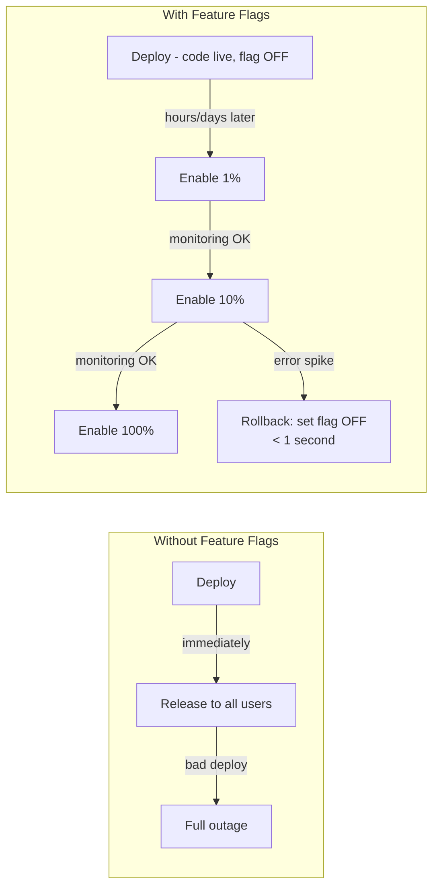
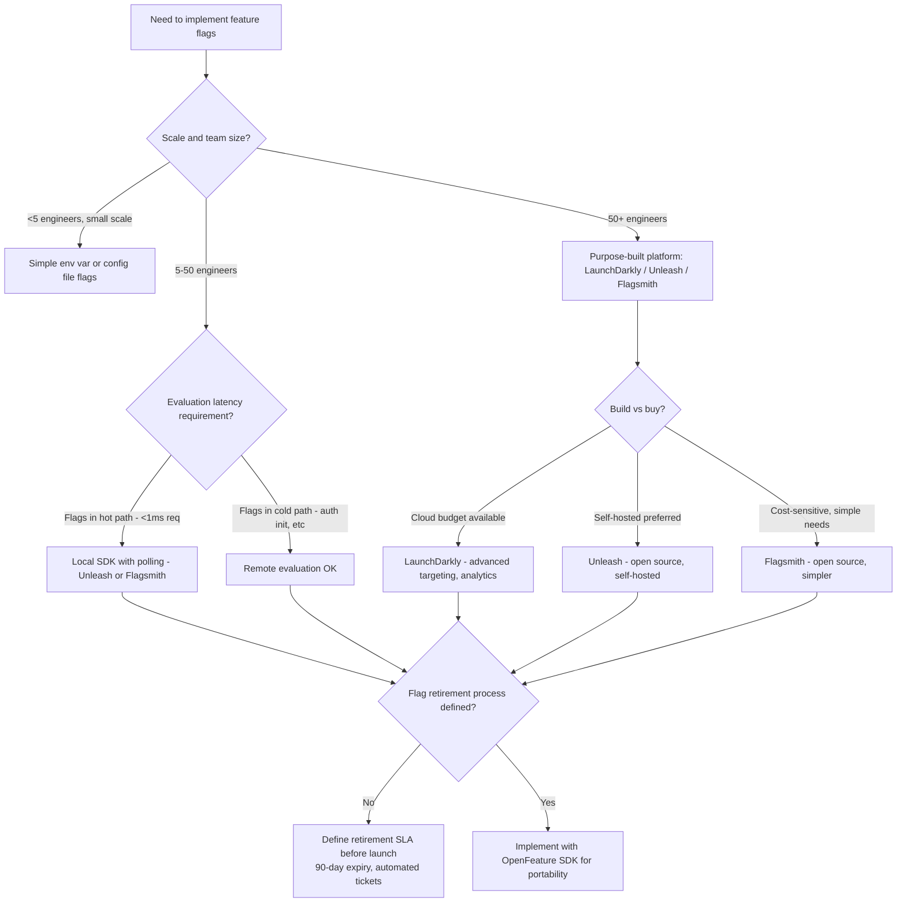

# Feature Flag Architecture: Gradual Rollout, Kill Switches, and Technical Debt

**Feature flags are the easiest way to reduce deployment risk and the easiest way to accumulate catastrophic technical debt. A mature flags system with 500 live flags has a test surface of 2^500 combinations — more states than atoms in the observable universe. This article covers how to use flags effectively and, critically, how to retire them before they collapse your system.**

---

## The Problem Class `[Mid]`

Imagine you've built a new checkout flow. It's tested, reviewed, and ready. But your last major checkout change caused a 2-hour outage that cost $800K in lost revenue. You want to deploy the code without exposing all users simultaneously.

Without feature flags, you have two choices:
1. Deploy to all users at once (full blast radius)
2. Wait for a low-traffic window, accept slow iteration

With feature flags:
```
deploy code    → 0% of users see new flow (flag OFF)
verify startup → no crashes, no memory leaks
enable 1%      → 1% of users see new flow
monitor 30min  → error rate OK, conversion rate OK
enable 10%     → 10% of users
monitor 1 hour → business metrics stable
enable 100%    → full rollout
cleanup        → remove flag and dead code (THIS STEP IS CRITICAL)
```

The decoupling of **deploy** (shipping code) from **release** (exposing functionality to users) is the core value proposition.

> 💡 **What this means in practice:** You ship code on Tuesday. You release the feature to users on Thursday after the team has verified it in production with real traffic. They're independent decisions made by different people (engineering vs product).



The deploy-release decoupling diagram shows two workflows. In the top flow, deploy and release are the same event — a bad deploy immediately affects all users. In the bottom flow, deployment is separate from enablement. Rollback is instant (change the flag value) rather than requiring a new deployment.

---

## Why the Obvious Solution Fails `[Senior]`

**Why not just use branch-based releases (git branches per feature)?**

Long-lived feature branches diverge from main over time. A 3-month feature branch will have merge conflicts that take days to resolve. Feature flags allow trunk-based development — all code ships to main, but is disabled by flags. Facebook, Google, and Netflix all practice trunk-based development at scale.

**Why not just use environment-based releases (staging → prod)?**

Environment promotion doesn't give you the ability to enable for 1% of production users. Staging traffic is synthetic; it doesn't represent real user behavior. Feature flags give you the gradual rollout control that environment promotion can't.

**Why not just accept the deployment risk?**

At small scale (one service, one team, 10K users), full deployment risk is acceptable. At scale (100 services, 50 teams, 10M users), a bad deployment causes measurable revenue loss. At Etsy's scale, 50 deployments per day with full blast radius would make deployment a high-stakes event — slowing velocity. Feature flags make deployment boring, which is exactly what you want.

**The non-obvious failure: flag proliferation**

```
Month 1: 10 flags
Month 6: 80 flags
Month 12: 200 flags
Month 18: 400 flags

Test coverage for 400 flags: 2^400 state combinations
Even if 80% of flags are independent: 2^80 relevant combinations
Your QA suite covers ~100 combinations

Result: unknown combinations of flags produce unknown behavior.
Production incidents caused by flag interactions become undiagnosable.
```

Flag debt is not hypothetical — Knight Capital's 2012 trading loss ($440M in 45 minutes) was caused by an undocumented feature flag that activated dormant code. The flag was never cleaned up.

---

## The Solution Landscape `[Senior]`

### Solution 1: Boolean Release Flags (On/Off)

**What it is**

The simplest flag type: a feature is either enabled or disabled for a given context. Used for gradual rollouts, kill switches, and A/B tests with only two variants.

**How it actually works at depth**

```python
# Boolean flag evaluation — simple on/off
class BooleanFlag:
    def __init__(self, name: str, default: bool = False):
        self.name = name
        self.default = default

    def is_enabled(self, context: dict) -> bool:
        rule = flag_store.get(self.name)  # fetch from flag store
        if rule is None:
            return self.default

        # Percentage-based rollout
        if rule.rollout_percentage < 100:
            user_id = context.get('user_id', '')
            # Deterministic hash: same user always gets same experience
            bucket = hash(f"{self.name}:{user_id}") % 100
            return bucket < rule.rollout_percentage

        return rule.enabled

# Usage
new_checkout = BooleanFlag('new-checkout-flow')

def process_checkout(user_id: str, order: dict):
    ctx = {'user_id': user_id, 'plan': user.plan}

    if new_checkout.is_enabled(ctx):
        return new_checkout_service.process(order)
    else:
        return legacy_checkout_service.process(order)
```

> 💡 **What this means in practice:** The deterministic hash ensures user consistency — if you're in the 10% seeing the new checkout, you always see it (not sometimes old, sometimes new). This is crucial for multi-step flows where inconsistency would be confusing.

**Sizing guidance** `[Staff+]`

Flag evaluation latency:
- Local SDK (flag values cached in memory): < 0.1ms per evaluation
- Remote evaluation (HTTP call per evaluation): 10-50ms — never do this in hot paths
- SDK polling interval: refresh local cache every 30-60 seconds

Flag SDK memory:
- 1,000 flags at 1 KB config each = 1 MB — negligible
- 10,000 flags: 10 MB — still negligible
- Memory is not the constraint; flag count is a developer velocity and testing constraint

**Configuration decisions that matter** `[Staff+]`

- **Default value on SDK initialization failure**: If the flag store is unreachable, what does `is_enabled()` return? Return `false` (safe default — new feature is off, existing behavior preserved). Never return the last known value — stale state is worse than a known-safe default.
- **Flag targeting order**: User-level targeting > segment targeting > percentage rollout > default. Be explicit about precedence in your flag evaluation logic.
- **Flag audit logging**: Every flag value change must be logged: who changed it, when, what value. This is your deployment audit trail for flag-related incidents.

---

### Solution 2: Multivariate Flags (A/B/C Testing)

**What it is**

Instead of on/off, a flag returns one of N string values. Different users get different variants. Used for A/B/C tests, configuration experimentation, and progressive migration between multiple implementation strategies.

**How it actually works at depth**

```python
# Multivariate flag — returns one of N variants
class MultivariateFlag:
    def get_variant(self, context: dict) -> str:
        rule = flag_store.get(self.name)
        user_id = context.get('user_id', '')

        # Bucket user into variant based on hash
        bucket = hash(f"{self.name}:{user_id}") % 100

        cumulative = 0
        for variant in rule.variants:
            cumulative += variant.weight
            if bucket < cumulative:
                return variant.key

        return rule.default_variant

# Usage in checkout — testing three layouts
checkout_layout = MultivariateFlag('checkout-layout')

def render_checkout(user_id: str):
    variant = checkout_layout.get_variant({'user_id': user_id})

    # Track which variant this user sees (for analysis)
    analytics.track('checkout_variant_assigned', {
        'user_id': user_id,
        'variant': variant
    })

    layouts = {
        'control': render_original_layout,
        'one-page': render_single_page_checkout,
        'progressive': render_progressive_disclosure_checkout
    }
    return layouts[variant]()
```

> 💡 **What this means in practice:** A/B testing via multivariate flags replaces the need for a separate experimentation platform at small scale. At larger scale (>1M users), you need statistical rigor — t-tests, p-values, minimum detectable effect calculation — that purpose-built experimentation platforms provide.

**Sizing guidance** `[Staff+]`

For A/B test statistical validity:
```
Minimum sample size for a 5% lift, 95% confidence:
  baseline_rate = 0.03 (3% conversion)
  minimum_detectable_effect = 0.05 (5% relative lift = 0.0015 absolute)

  n = (z_alpha + z_beta)^2 × (p1×(1-p1) + p2×(1-p2)) / (p1-p2)^2
  n ≈ 75,000 users per variant

At 10% of users in experiment (10K users/day):
  Per variant at 50/50 split: 5K users/day
  Time to significance: 75,000 / 5,000 = 15 days per variant
```

Never call an A/B test early based on early trends. 3 days of data showing lift often reverses by day 15.

---

### Solution 3: Targeting Rules (Segment + Attribute-Based)

**What it is**

Enable flags for specific user segments (paid users, beta users, internal users), geographic regions, or application attributes (specific API version, platform type). Targeting allows controlled rollout to subpopulations.

**How it actually works at depth**

```python
# Targeting rules: segment + attribute-based evaluation
class TargetedFlag:
    def evaluate(self, context: FlagContext) -> bool:
        rule = flag_store.get(self.name)

        # Rules evaluated in priority order (first match wins)
        for targeting_rule in rule.targeting_rules:
            if self._matches(targeting_rule.conditions, context):
                return targeting_rule.serve  # True or False

        # Fall through to default rollout
        return self._percentage_rollout(rule.rollout, context)

    def _matches(self, conditions: list, context: FlagContext) -> bool:
        return all(
            self._evaluate_condition(cond, context)
            for cond in conditions
        )

    def _evaluate_condition(self, condition, context):
        value = context.get(condition.attribute)
        if condition.operator == 'in':
            return value in condition.values
        elif condition.operator == 'contains':
            return condition.value in (value or '')
        # ... etc

# Context carries attributes for targeting
context = FlagContext(
    user_id='usr_12345',
    attributes={
        'plan': 'enterprise',
        'region': 'us-west-2',
        'beta_user': True,
        'account_age_days': 720,
        'platform': 'ios'
    }
)

# Flag rule: enable for enterprise users in us-west-2 who are beta users
# OR enable for 5% of all users
if feature_flag.evaluate(context):
    show_new_feature()
```

---

### Solution 4: Kill Switches (Operational Flags)

**What it is**

A flag designed specifically as an emergency off switch for a feature in production. Unlike gradual rollout flags, kill switches are permanent infrastructure — they live indefinitely as a resilience mechanism.

**How it actually works at depth**

```python
# Kill switch pattern — emergency circuit breaker for features
class KillSwitch:
    def __init__(self, name: str, description: str, owner: str):
        self.name = name
        # Kill switches default to ON (feature enabled)
        # Flipping to OFF = emergency disable

    def is_feature_enabled(self) -> bool:
        # Check flag store with circuit breaker
        # If flag store is unreachable: return True (default safe = feature ON)
        # Kill switches protect against known-risky features
        # Default ON means "flag store failure doesn't disable feature"
        return not flag_store.get_with_fallback(
            key=f"kill_switch:{self.name}",
            fallback=False  # fallback=False means kill switch is NOT triggered
        )

# In inventory service — protects expensive external pricing API call
pricing_kill_switch = KillSwitch(
    name='external-pricing-api',
    description='Disable live pricing API, fallback to cached prices',
    owner='pricing-team'
)

def get_item_price(item_id: str) -> Price:
    if pricing_kill_switch.is_feature_enabled():
        try:
            return external_pricing_api.get_price(item_id)
        except Exception:
            # Kill switch also protects against transient failures
            return price_cache.get(item_id)
    else:
        # Kill switch triggered — use cache, no external call
        return price_cache.get(item_id)
```

> 💡 **What this means in practice:** Kill switches are different from rollout flags. A rollout flag starts OFF and goes ON. A kill switch starts ON and is flipped OFF during incidents. They're your emergency brake — you should be able to flip one in under 30 seconds during an outage, without a deployment.

---

## Flag Lifecycle Management `[Staff+]`

**The four stages of a flag's life:**

```
BIRTH       → Flag created, starts at 0% rollout
             → Code has both old and new paths
             → Flag in all tests as both ON and OFF states

MATURITY    → Flag at 100% rollout
             → Old code path still exists but dead
             → Flag in test suite as ON only

RETIREMENT  → Flag cleanup ticket created (should be automatic, 90-day expiry)
             → Old code path removed
             → Flag removed from code

DELETION    → Flag removed from flag store
             → Any calls to this flag now return default (safe value)
```

**The flag retirement rule** `[Staff+]`

Every flag must have an expiry date set at creation. A flag that reaches 100% rollout and is stable for 30 days should be retired. Retiring means:

```python
# BEFORE retirement: code has two paths
def process_order(order: Order) -> Result:
    if new_order_flow.is_enabled({'user_id': order.user_id}):
        return new_order_processor.process(order)  # new path
    else:
        return legacy_order_processor.process(order)  # old path

# AFTER retirement: one path, no flag
def process_order(order: Order) -> Result:
    return new_order_processor.process(order)  # only path
```

The effort to retire is small (one PR). The cost of not retiring compounds: 100 unretired flags = 100 dead code paths that still have test coverage requirements, documentation requirements, and cognitive overhead for every engineer who reads the code.

---

## Trade-off Matrix `[Senior]` → `[Staff+]`

| Dimension | Local SDK Evaluation | Remote Evaluation | Centralized Platform (LaunchDarkly) |
|---|---|---|---|
| **Evaluation latency** | < 0.1ms | 10-50ms | < 0.1ms (SDK caches locally) |
| **Flag propagation delay** | 30-60s (poll interval) | Instant | < 1s (streaming) |
| **Operational complexity** | Medium (host SDK) | Low | Low (SaaS) |
| **Cost at 100M evaluations/month** | ~$0 (self-hosted) | ~$0 (self-hosted) | ~$500-2000/month |
| **Vendor lock-in** | None | None | Medium (OpenFeature mitigates) |
| **Targeting capabilities** | Custom | Custom | Advanced (geo, segments, etc) |
| **Analytics integration** | Manual | Manual | Built-in (click-to-flag analysis) |

---

## Decision Framework `[Senior]` → `[Staff+]`



---

## Production Failure Story `[Staff+]`

**The 2,000-Flag Codebase — A Large-Scale SaaS Platform**

A 400-engineer SaaS company used feature flags extensively. Over 4 years with no retirement policy, they accumulated 2,000 flags in their codebase. 800 were "dead" (always 100% or 0%, never changing). 400 were "zombie" flags — nobody knew what they controlled or who owned them.

Three incidents in one quarter were traced to flag interactions:
1. A zombie flag (name: `enable_new_cache`) was still being evaluated but the flag store had deleted the record. The SDK returned `false` (safe default). But "safe default" for this flag was supposed to be `true` (new cache was faster). Old cache was 10x slower for a specific query type. Degraded performance for 15% of queries, unnoticed for 3 months.
2. Two flags (`dark_mode_v2` and `new_dashboard_layout`) each individually worked fine. Together, their combined CSS caused layout breaks for users with both enabled. Neither flag's tests covered the combined state.
3. A flag retirement PR removed a flag constant from code. A different service was using the same constant name for a different flag. Silent override — wrong behavior for one team.

**Fix**:
1. Automated flag expiry: any flag not modified in 90 days generates a Jira ticket assigned to the owning team
2. Flag namespace by team: `checkout.new-flow` not just `new-flow`
3. Flag review in PRs: `git diff` output that touches flag evaluation logic requires flag owner review
4. Flag interaction testing: CI runs a "flag combination matrix" for flags marked as potentially interacting

---

## Observability Playbook `[Staff+]`

**Per-flag metrics**:
- `flag_evaluations_total{flag_name, variant, result}` — evaluation count
- `flag_evaluation_duration_ms{flag_name}` — evaluation latency (should be < 1ms for local SDK)
- `flag_store_sync_age_seconds` — how stale is the local SDK cache

**Flag health dashboard**:
- Flag evaluation volume over time (detect when flags stop being evaluated — zombie flag signal)
- SDK sync failures (flag store unreachable)
- Flag value distribution over time (detect when flags get "stuck" at unexpected percentages)

**Alert triggers**:
- Flag store unreachable for > 60 seconds: all evaluations returning defaults — page on-call
- SDK cache age > 300 seconds (5x poll interval): flag updates not propagating
- New flag deployed with no evaluation within 24 hours: likely misconfiguration

---

## Architectural Evolution `[Staff+]`

**2026 perspective**:

**OpenFeature** (CNCF standard, GA in 2024) provides a vendor-neutral SDK interface. Teams write `openfeature.getBooleanValue('flag-name', false, context)` instead of `launchdarkly.variation('flag-name', false, context)`. Switching vendors requires only changing the provider implementation, not all application code.

**GitOps flags**: Flag configurations managed as YAML in git repositories, applied via CI/CD. This gives flags the same review, audit, and rollback capabilities as infrastructure code. Tools like Flipt support this model.

**AI-assisted flag retirement**: In 2025, SaaS flag platforms began offering automated flag retirement recommendations based on evaluation patterns — "this flag has been 100% ON for 47 days, usage pattern suggests it's safe to retire." Reduces the cognitive overhead of managing large flag inventories.

**Flags as SLO inputs**: Modern observability platforms track deployments and flag changes as annotations on SLO dashboards. A flag change that precedes an error rate spike is automatically correlated and surfaced during incident review — removing the "did anyone change a flag?" manual investigation step.

---

## Decision Framework Checklist `[All Levels]`

- [ ] Defined flag lifecycle policy: birth → rollout → retirement → deletion with timelines
- [ ] Set 90-day expiry on all new flags at creation time
- [ ] Namespaced flags by team or service to avoid naming collisions
- [ ] Defined safe default values for flag store unreachability
- [ ] Implemented deterministic user bucketing (hash-based, not random-per-request)
- [ ] Added evaluation tracking for all flags (analytics need variant assignment data)
- [ ] Kill switches identified for all features with known risk and added to runbook
- [ ] Flag SDK uses local caching with polling (never remote evaluation in hot paths)
- [ ] CI runs tests with flags in both ON and OFF states
- [ ] Flag retirement process automated: closed flags generate cleanup tickets
- [ ] Adopted OpenFeature SDK (or vendor SDK wrapped behind interface) for portability
- [ ] Business metrics tracked per flag variant (not just error rate)

*Written by Gaurav Porwal — 10+ Year Engineer | Tech Lead | Product Owner | Business-Minded Builder*
*Last updated: 2026-03-18*
