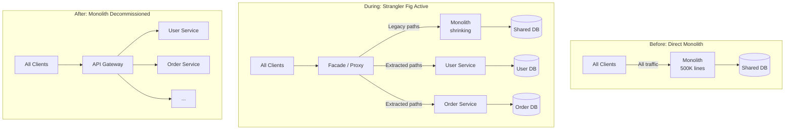
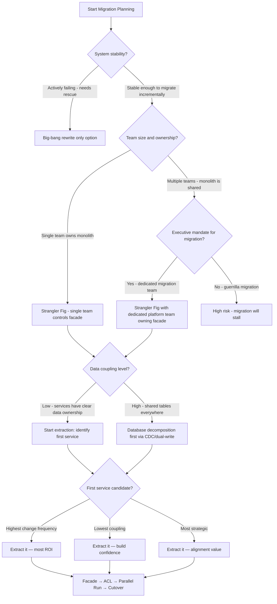

# Strangler Fig Migration: Incremental Monolith Decomposition Patterns

**Every system design discussion about microservices assumes you're starting fresh. You're not. You have a 500K-line Rails monolith handling $50M/day in transactions, and you need to decompose it without a single minute of planned downtime.**

**The Strangler Fig pattern is the only sane path. But "strangler fig" is not a plan — it's a philosophy. Here's the engineering.**

---

## The Problem Class `[Mid]`

Martin Fowler coined the term in 2004, inspired by the strangler fig tree: a vine that grows around a host tree, eventually replacing it entirely while the original trunk rots away. Applied to software: wrap the monolith with a facade, route new traffic to new microservices, gradually starve the monolith of work until it can be safely decommissioned.

The failure mode is attempting this naively:

```
Week 1: Extract User Service
Week 2: Monolith still has "user" code paths
Week 8: Two sources of truth for user data
Week 16: User Service and monolith disagree on email format
Week 24: Can't tell which is authoritative
Result: Worse than the monolith
```

The problem is not technical — it's architectural discipline. The strangler fig requires a proxy layer that can route traffic, an anti-corruption layer that prevents legacy concepts from leaking into new services, and a parallel-run strategy for validating correctness before cutting over.



---

## Why the Obvious Solution Fails `[Senior]`

**Why not a big-bang rewrite?**

The "Second System Effect" (Fred Brooks, 1975) applies here. You're simultaneously trying to:
1. Replicate all existing behavior (much of it undocumented)
2. Build new architecture
3. Keep the original system running during development
4. Validate correctness against a moving target

Netscape 6, Microsoft Longhorn, Fusion IO — large rewrites fail at an alarming rate. The monolith's behavior IS the specification, including all the bugs that customers have worked around.

**Why not extract by layer (horizontal slicing)?**

"Extract all persistence code first, then services, then APIs" doesn't map to business capabilities. You end up with a distributed monolith — all services deployed separately but all coupled to a shared database and each other's domain models.

**Why not extract the easiest service first?**

The easiest service to extract is usually the least business-critical. You'll have done six months of work, have one microservice in production, and made zero progress on the high-value but high-complexity core. Migration fatigue kills the project.

Extract by **business capability** (vertical slice), starting with capabilities that have:
- Clear ownership boundaries
- Well-defined APIs within the monolith
- Low coupling to other capabilities (measured by shared data models)
- High change frequency (most bang for isolation buck)

---

## The Solution Landscape `[Senior]`

Strangler Fig has four core mechanisms that must work together: **Facade/Proxy**, **Anti-Corruption Layer**, **Traffic Routing**, and **Parallel Run**.

---

### Solution 1: Facade / Proxy Interception

**What it is**

A reverse proxy or API gateway sits in front of the monolith and intercepts all traffic. Rules route requests to either the monolith or the new microservice based on path, headers, or feature flag.

**How it actually works at depth**

Start with NGINX or a purpose-built gateway (Kong, Envoy, AWS ALB with routing rules):

```nginx
# Nginx routing configuration - strangler fig in action
server {
    listen 443 ssl;

    # User service extracted - route to new service
    location /api/v1/users {
        proxy_pass http://user-service:8080;
    }

    # Order service extracted for specific plans only
    location /api/v1/orders {
        # Feature flag check via header
        if ($http_x_feature_new_orders = "true") {
            proxy_pass http://order-service:8080;
        }
        # Default to monolith
        proxy_pass http://monolith:3000;
    }

    # Everything else goes to monolith
    location / {
        proxy_pass http://monolith:3000;
    }
}
```

The facade must be stateless and highly available — it's now in the critical path for all traffic. Deploy minimum 3 replicas behind a load balancer.

**Sizing guidance** `[Staff+]`

Facade overhead per request: 0.3-0.8ms added latency (TCP connection to upstream + proxy processing). At 50K RPS through a single Nginx instance:
- CPU: ~2 vCPU for 50K RPS plain proxying
- Memory: ~150 MB resident (mostly connection state)
- Max throughput without SSL termination: ~100K RPS per Nginx worker process

For SSL termination at the facade layer, TLS handshake costs ~2ms (TLS 1.3 with session tickets: ~0.5ms for resumptions). Use session ticket reuse aggressively.

**Configuration decisions that matter** `[Staff+]`

- **Routing granularity**: Route by URL path prefix (coarse, fast) vs request body inspection (fine-grained, expensive). Never inspect request bodies in the routing layer — it breaks streaming and costs CPU.
- **Timeout alignment**: Set facade timeout > max downstream service timeout. A 30s facade timeout with a 60s service timeout causes facade to close the connection before the service responds.
- **Circuit breaker at facade**: If User Service is down, route `/api/v1/users` back to monolith (if monolith still has that code path). This is the escape hatch for early extraction failures.
- **Request/response logging**: Log which upstream handled each request with a `X-Handled-By: user-service|monolith` header. Critical for parallel run comparison.

**Failure modes** `[Staff+]`

1. **Facade becomes a new monolith**: Routing logic grows to include business logic (auth, rate limiting, request transformation). Keep the facade as routing-only; push all business logic to services.
2. **Configuration drift**: Nginx configs diverge across environments. Manage routing rules as code (Helm chart, Terraform) with the same deployment pipeline as services.
3. **Facade as SPOF**: If the facade has a deployment bug, all traffic fails. Blue-green deploy the facade itself; never do in-place updates.

---

### Solution 2: Anti-Corruption Layer (ACL)

**What it is**

A translation layer between the new microservice's domain model and the monolith's legacy domain model. Prevents the new service from being "corrupted" by the monolith's data shapes, naming conventions, and business logic.

**How it actually works at depth**

The monolith has a `users` table with columns shaped by 10 years of accretion:

```sql
-- Legacy monolith schema
CREATE TABLE users (
  usr_id        INTEGER,
  usr_email_1   VARCHAR(255),  -- "primary email"
  usr_email_2   VARCHAR(255),  -- "backup email"
  acct_status   CHAR(1),       -- 'A'=active, 'S'=suspended, 'D'=deleted
  cust_tier     INTEGER,       -- 1=free, 2=pro, 3=enterprise (undocumented)
  created_dt    INTEGER        -- Unix timestamp, not TIMESTAMPTZ
);
```

Your new User Service has a clean domain model:

```typescript
// New service domain model
interface User {
  id: string;          // UUID, not integer
  email: string;       // single canonical email
  status: 'active' | 'suspended' | 'deleted';
  plan: 'free' | 'pro' | 'enterprise';
  createdAt: Date;
}
```

The ACL translates between them:

```typescript
class UserAntiCorruptionLayer {
  // Monolith → New Service
  fromLegacy(legacyUser: LegacyUser): User {
    return {
      id: this.idMapping.get(legacyUser.usr_id) ?? uuidv4(),
      email: legacyUser.usr_email_1,  // canonical choice
      status: this.mapStatus(legacyUser.acct_status),
      plan: this.mapPlan(legacyUser.cust_tier),
      createdAt: new Date(legacyUser.created_dt * 1000),
    };
  }

  // New Service → Monolith (for dual-write period)
  toLegacy(user: User): Partial<LegacyUser> {
    return {
      usr_id: this.idMapping.getReverse(user.id),
      usr_email_1: user.email,
      acct_status: this.reverseMapStatus(user.status),
      cust_tier: this.reverseMapPlan(user.plan),
    };
  }

  private mapStatus(code: string): User['status'] {
    const map = { 'A': 'active', 'S': 'suspended', 'D': 'deleted' };
    return map[code] ?? 'active';
  }
}
```

**Sizing guidance** `[Staff+]`

ACL transformation cost is typically CPU-bound: simple field mapping at 1M records/sec per core is realistic. The expensive operations are:
- ID mapping table lookups (cache in Redis, ~0.1ms per lookup)
- Schema validation (JSON Schema validation: ~0.5ms per record)
- Dual-write synchronization (see below)

During dual-write, every write to User Service also writes back to monolith through the ACL. At 1K writes/sec sustained:
- ACL translation: < 1ms
- Monolith write (DB call): 5-20ms
- Total dual-write latency addition: 5-20ms on write path

If the monolith write fails during dual-write, what is correct behavior? This is a policy decision: accept the write (eventual sync) or reject it (strong consistency). Most teams accept the write and sync asynchronously via CDC.

---

### Solution 3: Parallel Run Strategy

**What it is**

Route the same request to both monolith and new service simultaneously. Compare responses. Use one as authoritative (usually monolith during validation). Flag discrepancies. Only cut over when discrepancy rate drops below threshold.

**How it actually works at depth**

```typescript
class ParallelRunMiddleware {
  async handleRequest(req: Request): Promise<Response> {
    // Fire both requests concurrently
    const [legacyResult, newResult] = await Promise.allSettled([
      this.monolithClient.call(req),
      this.newServiceClient.call(req),
    ]);

    const primary = legacyResult;  // monolith is authoritative during validation

    // Async comparison — don't add to response latency
    setImmediate(() => {
      this.compareAndLog(req, legacyResult, newResult);
    });

    return primary.status === 'fulfilled'
      ? primary.value
      : this.handleError(legacyResult.reason);
  }

  private compareAndLog(req, legacy, newSvc) {
    const discrepancy = this.differ.compare(legacy.value, newSvc.value);
    if (discrepancy) {
      metrics.increment('parallel_run.discrepancy', {
        endpoint: req.path,
        field: discrepancy.field,
      });
      logger.warn('parallel_run_mismatch', { req_id: req.id, discrepancy });
    } else {
      metrics.increment('parallel_run.match', { endpoint: req.path });
    }
  }
}
```

**Sizing guidance** `[Staff+]`

Parallel run doubles the load on downstream services. Budget for:
- 2x upstream calls per request during parallel run period
- New service sized for full production traffic (not just test traffic)
- Comparison logging: ~500 bytes per comparison × RPS × duration — budget storage

Shadow traffic (fire-and-forget to new service, don't include in response): lower fidelity but half the latency impact. Use shadow traffic for initial validation, full parallel run for pre-cutover confidence.

---

## Trade-off Matrix `[Senior]` → `[Staff+]`

| Dimension | Big-Bang Rewrite | Strangler Fig |
|---|---|---|
| **Risk** | Maximum — one large cutover | Minimal — incremental cutovers |
| **Time to first value** | 12-18 months | 4-8 weeks (first service) |
| **Operational complexity** | Low during dev, high at cutover | Medium throughout |
| **Dual-write period cost** | None | CPU + DB write amplification |
| **Rollback capability** | "Rollback" = restart rewrite | Per-service rollback in minutes |
| **Staff morale impact** | High burnout risk | Iterative wins |
| **Data consistency** | Clean cutover | Complex sync during migration |
| **Timeline predictability** | Unpredictable | Predictable per-service |

| Dimension | Facade-Only | Facade + ACL |
|---|---|---|
| **Legacy model leak** | High — new service sees legacy shapes | None — ACL translates |
| **Migration correctness** | Fragile | Verifiable via parallel run |
| **Complexity** | Lower | Higher (ACL must be maintained) |
| **Long-term maintainability** | Technical debt accumulates | Clean domain model from day 1 |

---

## Decision Framework `[Senior]` → `[Staff+]`



---

## Production Failure Story `[Staff+]`

**The ACL That Wasn't — A Payments Migration**

A fintech company extracted their Transaction Service from a monolith using a proxy facade. They skipped the ACL, reasoning "we'll clean up the domain model later." The new Transaction Service accepted the legacy monolith's `amount` as an integer (cents in USD).

Six months later, they needed to support GBP. The monolith used integers for GBP too (pence). The new Transaction Service had no currency concept — it just stored integers and assumed USD.

Adding multi-currency support required a schema migration on the Transaction Service that was now in production with 50M records, plus a backfill to add currency codes to all historical records. The backfill took 3 weeks and required a maintenance window for the schema change — exactly the kind of migration risk they were trying to escape.

**The ACL would have forced this conversation on day one.** When translating `amount: 1099` from the monolith, the ACL developer would have needed to decide the domain model representation — `{ amount: 10.99, currency: 'USD' }` — and documented the decision. The technical debt was created by skipping the ACL, not by moving too fast.

---

## Observability Playbook `[Staff+]`

**Migration health metrics**:

- `traffic_ratio{handler="monolith|service"}` — percentage of traffic handled by each side. This is your migration progress metric.
- `parallel_run_discrepancy_rate{endpoint}` — discrepancy percentage per endpoint. Threshold to cut over: < 0.1% discrepancy for 7 consecutive days.
- `dual_write_lag_seconds` — how far behind is the secondary write. Should be < 1 second.
- `acl_translation_error_total` — ACL translation failures indicate schema or business logic divergence.

**Operational runbook triggers**:
- Discrepancy rate > 5%: halt cutover, investigate root cause
- Dual-write lag > 30 seconds: route all writes back to monolith, page on-call
- New service error rate > monolith error rate: route all traffic back to monolith

---

## Architectural Evolution `[Staff+]`

**2026 perspective on tooling**:

- **Feature flag platforms** (LaunchDarkly, Flagsmith, Unleash) are now the routing layer of choice for strangler fig migrations. Instead of NGINX routing rules, feature flags control which service handles which request — with user-segment targeting (beta users get new service), percentage rollouts, and instant kill switches. This gives product and operations teams control over migration pace without deploying new proxy configs.

- **CDC-based dual-write** (Debezium → Kafka → new service consumer) has replaced application-level dual-write for most migrations. The monolith writes to its DB; Debezium captures changes from WAL; the new service consumes and applies. This eliminates write amplification in the application tier and provides a natural catch-up mechanism after new service downtime.

- **Service mesh migration support**: Istio's traffic management (VirtualService, DestinationRule) handles facade routing natively in Kubernetes environments. Weighted routing between monolith and new service, header-based routing for internal testing, and automatic retries are all available without a separate proxy tier.

- **AI-assisted migration**: In 2025-2026, tools like Grit.io and Moderne use AI to suggest extraction candidates based on change frequency analysis and dependency graphs, reducing the upfront planning effort from weeks to hours.

The strangler fig migration itself is not changing — but the tooling making the proxy/routing/dual-write layers easier to implement continues to mature.

---

## Decision Framework Checklist `[All Levels]`

- [ ] Identified first extraction candidate based on business capability boundary (not technical layer)
- [ ] Mapped all data owned by target service — no shared tables remain after extraction
- [ ] Designed Anti-Corruption Layer before writing any service code
- [ ] Facade is deployed and routing some traffic before service code is complete
- [ ] Parallel run configured — discrepancy logging operational before cutover
- [ ] Dual-write period defined with exit criteria (e.g., 7 days clean parallel run)
- [ ] Rollback plan per service: routing rule to revert to monolith tested and documented
- [ ] Feature flags or routing rules managed as code, deployed via CI/CD
- [ ] Monolith's code path for extracted capability marked with deprecation comment (not deleted yet)
- [ ] Migration health dashboard live: traffic ratio, discrepancy rate, dual-write lag
- [ ] Team agreement on when monolith code path is deleted (after dual-write period)
- [ ] ACL translation tests have >90% coverage including edge cases from legacy data analysis

*Written by Gaurav Porwal — 10+ Year Engineer | Tech Lead | Product Owner | Business-Minded Builder*
*Last updated: 2026-03-18*
