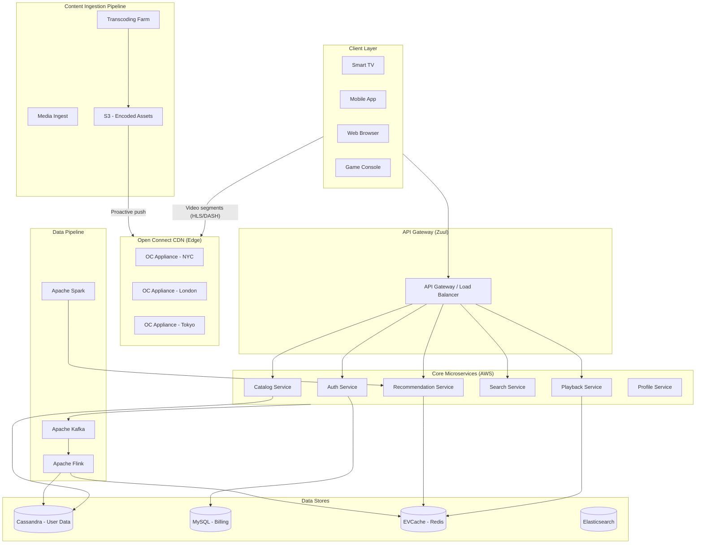
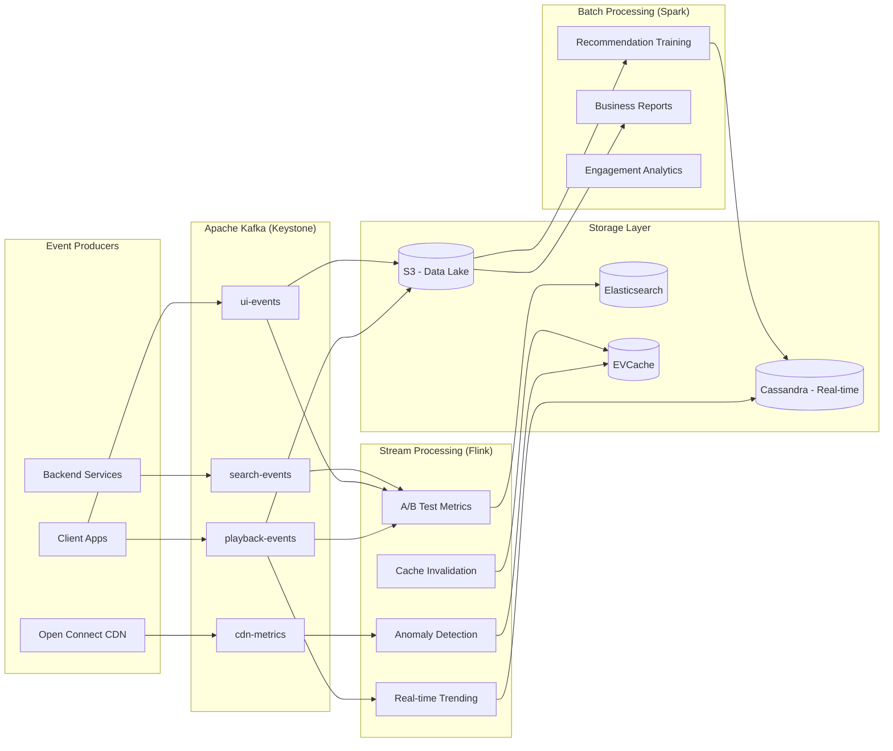

# Design Netflix Streaming Platform

**Difficulty**: 🔴 Advanced
**Time**: 60 minutes
**Companies**: Netflix, Disney+, Hulu, Amazon Prime Video, YouTube (Common for senior/staff roles)

---

> Every time you press play on Netflix and your show starts in under 2 seconds — on your phone, your TV, or your laptop — a staggering amount of engineering is working invisibly on your behalf. Netflix delivers **15% of all global internet traffic**, serves **200M+ subscribers in 190 countries**, and runs on **700+ microservices**. When Stranger Things dropped its final season, millions of concurrent streams launched within minutes. How do you build a system that doesn't crumble under that weight?

---

## 1. Problem Statement

Design a global video streaming platform that ingests movies and TV shows, encodes them into multiple formats, distributes them worldwide, and plays them back smoothly on any device.

**Scale reference (Netflix 2024):**

```
Subscribers:            220 million+ globally
Countries:              190+
Daily active streams:   100 million+
Peak concurrent streams: ~15 million
Share of global internet traffic: ~15%
Microservices:          700+
Content library:        17,000+ titles
Video stored:           Petabytes of encoded content
Open Connect servers:   15,000+ globally
CDN cache hit rate:     ~95%
Startup latency target: < 2 seconds
```

**The core challenge:**

```
User clicks "Play" on any device, anywhere in the world.
Within 2 seconds:
  1. Authenticate the user and check entitlements
  2. Select the best server (CDN edge) near the user
  3. Determine the optimal quality (codec, bitrate, resolution)
  4. Start streaming — adapt quality in real-time as bandwidth changes
  5. Handle 15M other people doing the same thing simultaneously

AND:
  - Never lose a frame of premium licensed content
  - Degrade gracefully on slow networks (3G in India, rural broadband)
  - Support 2,000+ device types (TVs, phones, browsers, game consoles)
  - Run A/B tests on everything (thumbnails, UI, playback algorithms)
  - Recover instantly from datacenter failures
```

## 2. Requirements

### Functional Requirements
1. Upload and ingest raw video content (studio masters, 4K HDR source files)
2. Transcode video into multiple codecs, resolutions, and bitrate ladders
3. Deliver video globally with low latency using a CDN
4. Adaptive bitrate (ABR) streaming that adjusts quality to network conditions
5. User authentication, profiles, and subscription management
6. Personalized content recommendation and discovery
7. Search, browse, and content metadata
8. Resume playback across devices

### Non-Functional Requirements
1. **Startup latency** < 2 seconds to first frame
2. **Availability** 99.99% for playback (< 1 hour downtime/year)
3. **Scalability** to 15M+ concurrent streams at peak
4. **Adaptability** — degrade gracefully on poor networks
5. **Global reach** — serve 190 countries from nearby servers
6. **Durability** — never lose content; originals archived permanently
7. **Security** — DRM for licensed content; no piracy leakage

### Out of Scope
- Live streaming and live events
- User-generated content upload
- Third-party licensing and rights management systems
- Billing and payment processing

## 3. High-Level Architecture



## 4. Video Ingestion and Transcoding Pipeline

### The Problem with Raw Studio Files

```
A studio delivers a movie to Netflix:
  Format: ProRes 4444 XQ (lossless, studio-grade)
  Resolution: 4096 × 2160 (4K DCI)
  File size: ~2 TB for a 2-hour film
  Audio: 7.1 surround, Dolby Atmos
  Subtitles: 20+ languages

Netflix must convert this into:
  • 20+ video quality levels (4K, 1080p, 720p, 480p, 360p, 240p)
  • 5+ codecs (H.264, H.265/HEVC, VP9, AV1, Dolby Vision)
  • ~60 audio tracks (languages, formats: AAC, Dolby Digital, Atmos)
  • 30+ subtitle tracks
  • Thumbnail sprites for scrubbing preview
  • DRM encryption for all formats

Total output: ~100+ encoded variants per title
```

### Transcoding Architecture

```
┌─────────────────────────────────────────────────────────────────┐
│                  Media Ingest & Transcoding Pipeline            │
│                                                                 │
│  Studio Upload                                                  │
│  ┌──────────┐   SFTP/API   ┌────────────────┐                  │
│  │  Studio  │─────────────▶│ Ingest Service │                  │
│  │  Deliver │              │                │                  │
│  └──────────┘              │  1. Verify     │                  │
│                            │  2. QC check   │                  │
│                            │  3. Store raw  │                  │
│                            └───────┬────────┘                  │
│                                    │ emit job                  │
│                                    ▼                           │
│  ┌──────────────────────────────────────────────────────────┐  │
│  │               Transcoding Orchestrator (Temporal)        │  │
│  │                                                          │  │
│  │   Splits work into parallel tasks:                       │  │
│  │                                                          │  │
│  │   ┌──────────┐ ┌──────────┐ ┌──────────┐ ┌──────────┐  │  │
│  │   │ 4K H.265 │ │4K Dolby  │ │1080p AV1 │ │1080p H264│  │  │
│  │   │ Encode   │ │ Vision   │ │ Encode   │ │ Encode   │  │  │
│  │   └──────────┘ └──────────┘ └──────────┘ └──────────┘  │  │
│  │   ┌──────────┐ ┌──────────┐ ┌──────────┐ ┌──────────┐  │  │
│  │   │720p VP9  │ │480p H264 │ │ Audio    │ │ Subtitle │  │  │
│  │   │ Encode   │ │ Encode   │ │ Transcode│ │ Processing│ │  │
│  │   └──────────┘ └──────────┘ └──────────┘ └──────────┘  │  │
│  │   ... (100+ parallel workers)                           │  │
│  │                                                          │  │
│  └──────────────────────────────────────────────────────────┘  │
│                                    │                           │
│                                    ▼                           │
│               ┌────────────────────────────────┐               │
│               │   CMAF Packaging & DRM         │               │
│               │   Generate HLS + DASH manifests│               │
│               │   Encrypt with Widevine/FairPlay│              │
│               └──────────────┬─────────────────┘               │
│                              │                                 │
│                              ▼                                 │
│               ┌────────────────────────────────┐               │
│               │   Amazon S3 (Encoded Assets)   │               │
│               │   + Push to Open Connect CDN   │               │
│               └────────────────────────────────┘               │
└─────────────────────────────────────────────────────────────────┘
```

### Codec Strategy — AV1 as Netflix's Bet

```
Netflix's codec evolution:
  2010s: H.264 everywhere (universally supported)
  2016:   VP9 for Android/Chrome (30% smaller than H.264)
  2018:   H.265/HEVC for 4K TV devices (50% smaller than H.264)
  2020+:  AV1 (royalty-free, 50% smaller than H.264)

Codec comparison for 1080p, same quality:
  H.264:  5 Mbps  (baseline compatibility)
  H.265:  2.5 Mbps (50% saving, but patent royalties)
  VP9:    3 Mbps  (35% saving, royalty-free)
  AV1:    2 Mbps  (60% saving, royalty-free)

At Netflix scale:
  100M daily streams × 2 hours avg × 5 Mbps (H.264) = massive bandwidth
  Switching to AV1 saves 60% bandwidth = hundreds of millions $/year

Trade-off:
  AV1 encoding: 10–50x slower than H.264
  Solution: Encode at ingest time (offline), not at stream time
  The encode cost is fixed; the playback savings are ongoing
```

### Per-Title Encoding — Netflix's Secret Sauce

```
Traditional encoding: One bitrate ladder for all content
  720p = 2.5 Mbps for everything

Problem:
  Simple interview scene: 2.5 Mbps is overkill (wastes bandwidth)
  Fast-action CGI: 2.5 Mbps is too low (artifacts)

Netflix per-title encoding:
  Analyze scene complexity of each title
  Generate a custom bitrate ladder per title

Example:
  "My Dinner with Andre" (dialogue, static shots):
    720p = 1.2 Mbps ← custom lower bitrate, same quality
  "Avengers: Endgame" (fast action, explosions):
    720p = 3.5 Mbps ← custom higher bitrate to avoid artifacts

  Result:
    - Better quality at same bandwidth, OR
    - Same quality at lower bandwidth (saves 20% on average)
    - Both viewer experience and cost improved
```

### Pseudocode: Transcoding Pipeline Worker

```javascript
// Transcoding worker — runs on EC2 spot instances
async function transcodeSegment(job) {
  const {
    sourceS3Key,    // raw video location
    outputProfile,  // { codec, resolution, bitrate, ... }
    segmentStart,   // seconds
    segmentEnd,
    jobId
  } = job;

  // 1. Download segment from S3 to local NVMe
  const localInput = await downloadFromS3(sourceS3Key, {
    byteRange: secondsToBytes(segmentStart, segmentEnd)
  });

  // 2. Run FFmpeg with profile parameters
  const outputFile = await runFFmpeg({
    input: localInput,
    codec: outputProfile.codec,         // 'libx265', 'libaom-av1', 'libvpx-vp9'
    resolution: outputProfile.resolution, // '1920x1080'
    bitrate: outputProfile.bitrate,     // '2000k'
    preset: outputProfile.preset,       // 'slow' for AV1 quality
    crf: outputProfile.crf,             // perceptual quality target
    keyframeInterval: 2,                // 2-second segments for ABR
    drmEncryption: {
      method: 'cenc',
      keyId: await getContentKey(job.contentId),
    }
  });

  // 3. Upload encoded segment to S3
  const outputKey = buildS3Key(job.contentId, outputProfile, segmentStart);
  await uploadToS3(outputFile, outputKey);

  // 4. Report completion to orchestrator
  await reportProgress(jobId, {
    status: 'complete',
    outputKey,
    actualBitrate: outputFile.actualBitrate,
    vmaf: outputFile.vmafScore,   // perceptual quality score
  });
}

// Orchestrator decides how many parallel workers to spawn
async function orchestrateTranscoding(contentId, sourceKey) {
  const manifest = await analyzeSource(sourceKey);
  // manifest = { duration: 7200, complexity: 'high', fps: 24, ... }

  const profiles = await generateBitrateladder(manifest);
  // Per-title encoding: profiles = [{ resolution, bitrate, codec }, ...]

  const segments = splitIntoSegments(manifest.duration, SEGMENT_DURATION_SECS);

  // Fan out: one job per (segment × profile) combination
  const jobs = profiles.flatMap(profile =>
    segments.map(seg => ({
      sourceS3Key: sourceKey,
      outputProfile: profile,
      segmentStart: seg.start,
      segmentEnd: seg.end,
      contentId,
      jobId: uuid(),
    }))
  );

  // Enqueue all jobs — workers pick up from SQS
  await enqueueJobs(jobs);

  // Monitor until all complete
  await waitForCompletion(jobs.map(j => j.jobId));

  // Package all segments into HLS/DASH manifests
  await packageContent(contentId, profiles, segments);

  // Push to Open Connect CDN
  await proactivelyPushToCDN(contentId);
}
```

## 5. Open Connect — Netflix's Private CDN

### Why Netflix Built Its Own CDN

```
Problem with public CDNs in 2011:
  Netflix was paying $50M+/year to Akamai, Limelight, Level3
  Quality was variable (not tuned for video streaming)
  No visibility or control over caching decisions
  ISP peering was poor — video had to traverse many hops

Solution: Open Connect (launched 2012)
  Netflix-branded CDN hardware placed directly in ISPs and IXPs
  15,000+ Open Connect Appliances (OCAs) worldwide
  Partners with 1,000+ ISPs globally

Benefits:
  - ISPs get free appliances + reduced transit costs
  - Netflix gets control, quality, and massive cost savings
  - Users get faster streaming from a server in their own ISP
```

### Open Connect Architecture

```
┌─────────────────────────────────────────────────────────────────┐
│                    Open Connect Topology                        │
│                                                                 │
│  Netflix Cloud (AWS)                                            │
│  ┌─────────────────────────────────────────────────────────┐   │
│  │  Encoding Farm → S3 (master store of all encoded assets)│   │
│  └───────────────────────────┬─────────────────────────────┘   │
│                              │ proactive push (nightly fill)   │
│                              ▼                                 │
│  Internet Exchange Points (IXPs)                               │
│  ┌─────────────────────────────────────────────────────────┐   │
│  │  Large OCA clusters: 100Gbps+ capacity                  │   │
│  │  Store: Top ~10,000 most popular titles                 │   │
│  │  Serve: Large metro areas from IXP                      │   │
│  └───────────────────────────┬─────────────────────────────┘   │
│                              │ pull/push                      │
│                              ▼                                 │
│  ISP Embedded OCAs (in Comcast, AT&T, BT, etc.)               │
│  ┌─────────────────────────────────────────────────────────┐   │
│  │  Small-medium OCA boxes: 10-40 Gbps                     │   │
│  │  Store: Top 1,000-5,000 titles for that ISP's users     │   │
│  │  Serve: Subscribers of that ISP directly                │   │
│  │  Latency: <5ms — literally inside subscriber's ISP      │   │
│  └─────────────────────────────────────────────────────────┘   │
│                                                                 │
│  Result:                                                        │
│  ~95% of Netflix traffic never leaves the subscriber's ISP     │
│  Remaining ~5% fetched from IXP or AWS (cache miss / rare)     │
└─────────────────────────────────────────────────────────────────┘
```

### Proactive Cache Warming

```
Netflix uses predictive pre-positioning vs reactive caching:

Reactive CDN (YouTube, traditional):
  User requests video → CDN checks cache → miss → fetch from origin
  Popular content: OK (cached after first request)
  New releases: Thundering herd on origin when content first released

Netflix proactive push:
  Off-peak hours (2–6 AM local time), Netflix:
    1. Analyzes what users in each region will watch tomorrow
       (based on schedule, popularity, trending, region preferences)
    2. Pushes those video files to relevant OCAs before requests come
    3. When users wake up and play Stranger Things → already cached!

  Algorithm input:
    - New releases this week (known in advance)
    - Historical popularity patterns by country/city
    - Day-of-week and time-of-day viewing patterns
    - Current trending content
```

### Pseudocode: Cache Warming Strategy

```javascript
// Runs nightly, fills OCAs proactively
async function warmCacheForRegion(regionId, date) {
  const oca = await getOCAForRegion(regionId);

  // 1. Predict what will be watched tomorrow in this region
  const predictions = await predictContentDemand({
    regionId,
    date,
    factors: {
      newReleases: await getScheduledReleases(date),
      historicalTopN: await getHistoricalTop(regionId, dayOfWeek(date), 200),
      trendingContent: await getTrending(regionId),
      localHoliday: await getLocalCalendar(regionId, date),
    }
  });
  // predictions = [{ contentId, estimatedStreams, priority }, ...]

  // 2. Determine what's already cached vs needs pushing
  const ocaInventory = await oca.getCurrentInventory();
  const contentToEvict = ocaInventory
    .filter(item => !predictions.find(p => p.contentId === item.contentId))
    .sort((a, b) => a.lastAccessedAt - b.lastAccessedAt) // LRU candidates
    .slice(0, predictions.length);

  // 3. Evict lowest-value content to make room
  for (const item of contentToEvict) {
    await oca.evict(item.contentId);
  }

  // 4. Push predicted content from S3 to OCA
  const contentToPush = predictions
    .filter(p => !ocaInventory.find(i => i.contentId === p.contentId))
    .sort((a, b) => b.priority - a.priority); // highest priority first

  for (const prediction of contentToPush) {
    const encodedFiles = await getEncodedVariants(prediction.contentId, {
      region: regionId,     // push region-relevant codecs/languages
      topFormats: true,     // only push top 5-6 most popular formats
    });

    await oca.push(encodedFiles, {
      priority: prediction.priority,
      ttl: 7 * 24 * 3600, // keep for 7 days
    });
  }

  await reportCacheWarmingMetrics(regionId, {
    pushed: contentToPush.length,
    evicted: contentToEvict.length,
    estimatedHitRate: predictions.reduce((s, p) => s + p.estimatedStreams, 0),
  });
}
```

## 6. Adaptive Bitrate Streaming (ABR)

### How DASH/HLS Manifests Work at Netflix

```
When you click "Play" on a Netflix title:

1. Playback Service returns a manifest URL + license endpoint
2. Client fetches the DASH manifest (MPD file):

   <MPD type="dynamic" ...>
     <Period>
       <AdaptationSet mimeType="video/mp4">
         <!-- 4K Dolby Vision, AV1 codec -->
         <Representation id="v1" bandwidth="15000000"
           width="3840" height="2160" codecs="av01.0.13M.10">
           <SegmentTemplate timescale="90000"
             media="v1/seg-$Number$.m4s"
             initialization="v1/init.mp4" />
         </Representation>
         <!-- 1080p H.264 -->
         <Representation id="v5" bandwidth="4500000"
           width="1920" height="1080" codecs="avc1.640028">
           ...
         </Representation>
         <!-- 720p H.264 -->
         <Representation id="v8" bandwidth="2350000"
           width="1280" height="720" codecs="avc1.4d401f">
           ...
         </Representation>
         <!-- ... 16 more representations ... -->
       </AdaptationSet>
       <AdaptationSet mimeType="audio/mp4">
         <!-- Dolby Atmos, English -->
         <Representation id="a1" bandwidth="768000" audioSamplingRate="48000"
           codecs="ec-3">...</Representation>
         <!-- AAC Stereo, English -->
         <Representation id="a5" bandwidth="192000" codecs="mp4a.40.2">
           ...
         </Representation>
         <!-- 40+ more audio tracks... -->
       </AdaptationSet>
     </Period>
   </MPD>

3. ABR algorithm selects the starting quality
4. Player downloads segment-by-segment, switching quality as needed
```

### Netflix's ABR Algorithm — BOLA and Beyond

```
Naive ABR: Rate-based
  Measure download speed of last segment
  If speed > 5 Mbps → select 1080p (needs 4.5 Mbps)
  If speed < 2.5 Mbps → select 720p (needs 2.35 Mbps)

Problem: Bandwidth is bursty! Network can spike and drop.
  Downloading one segment fast doesn't mean the next will be fast.
  This causes oscillation: 1080p → 480p → 1080p → 720p → ...
  Oscillation is more annoying to viewers than steady lower quality.

Netflix's approach: Buffer-based (BOLA variant)
  Focus on buffer health, not just instantaneous bandwidth.
  Goal: Keep buffer full, prefer stability over chasing peak quality.

Buffer states:
  EMPTY       (0-2s):   Play whatever you can get, lowest quality
  CRITICAL    (2-5s):   Stay at current quality, don't risk rebuffering
  STABLE      (5-15s):  Can try upgrading quality
  FULL        (15-30s): Target highest quality the bandwidth supports
  OVERFLOW    (30s+):   Pause downloading, already have enough buffered
```

### Pseudocode: ABR Algorithm

```javascript
class NetflixABRAlgorithm {
  constructor(representations) {
    this.representations = representations.sort((a, b) => a.bandwidth - b.bandwidth);
    this.currentRepIdx = 0;
    this.downloadHistory = [];
  }

  // Called before each segment download to decide which quality to fetch
  selectNextQuality(bufferLengthSecs, downloadedSegments) {
    const bufferState = this.classifyBuffer(bufferLengthSecs);
    const estimatedBandwidth = this.estimateBandwidth(downloadedSegments);

    switch (bufferState) {
      case 'EMPTY':
        // Emergency: grab lowest quality immediately
        return this.representations[0];

      case 'CRITICAL':
        // Don't risk a rebuffer: stay at current or step down
        return this.representations[
          Math.max(0, this.currentRepIdx - 1)
        ];

      case 'STABLE':
        // Cautiously upgrade if bandwidth supports it
        // But use 0.85 safety margin to avoid oscillation
        const safeTarget = estimatedBandwidth * 0.85;
        const bestAffordable = this.highestAffordable(safeTarget);

        // Don't jump more than 1 level at a time (smoothness)
        const maxAllowed = this.representations[
          Math.min(this.representations.length - 1, this.currentRepIdx + 1)
        ];
        return bestAffordable.bandwidth < maxAllowed.bandwidth
          ? bestAffordable
          : maxAllowed;

      case 'FULL':
        // Buffer is healthy: be more aggressive about quality
        return this.highestAffordable(estimatedBandwidth * 0.9);

      case 'OVERFLOW':
        // Pause downloads; buffer is over-full
        return null;
    }
  }

  classifyBuffer(bufferSecs) {
    if (bufferSecs < 2) return 'EMPTY';
    if (bufferSecs < 5) return 'CRITICAL';
    if (bufferSecs < 15) return 'STABLE';
    if (bufferSecs < 30) return 'FULL';
    return 'OVERFLOW';
  }

  estimateBandwidth(history) {
    // Harmonic mean of recent download speeds (conservative estimate)
    // Harmonic mean penalizes outliers — prefers a stable lower estimate
    const recent = history.slice(-5);
    if (recent.length === 0) return 0;
    const harmonicMean = recent.length /
      recent.reduce((sum, s) => sum + 1 / s.downloadSpeed, 0);
    return harmonicMean;
  }

  highestAffordable(availableBandwidth) {
    // Find highest quality that fits within available bandwidth
    const affordable = this.representations
      .filter(r => r.bandwidth <= availableBandwidth);
    return affordable[affordable.length - 1] || this.representations[0];
  }
}
```

### Startup Optimization — Getting to First Frame in < 2 Seconds

```
Startup sequence (optimized):

T=0ms:    User clicks Play
T=50ms:   Playback Service returns manifest URL + DRM license URL
T=100ms:  Playback client fetches DASH manifest from CDN (nearby OCA)
T=150ms:  Client selects starting quality (lower = faster startup)
T=150ms:  Simultaneously:
            - Fetch DRM license key (async, parallel)
            - Fetch first video segment (4-second chunk, lowest quality)
            - Fetch first audio segment
T=600ms:  First segment arrives, decrypted with license key
T=700ms:  Video starts playing at 480p (startup quality)
T=1500ms: Buffer fills; ABR upgrades to 1080p for subsequent segments
T=2000ms: --- Netflix's target: 2 second startup ---

Key optimizations:
  1. Parallel requests: manifest + license + first segment simultaneously
  2. Start at lower quality (faster to download first segment)
  3. Pre-warming: OCA has content ready (no cache miss delay)
  4. TCP fast open + HTTP/2 multiplexing (no new connection overhead)
  5. Client-side prediction: pre-fetch manifest before user clicks Play
     (Netflix starts prefetching when cursor hovers over thumbnail)
```

## 7. Microservices Architecture

### 700+ Services — How Netflix Manages Complexity

```
Netflix's journey:
  2008: Monolith — single Java application
  2011: Began breaking into services (database corruption incident)
  2016: Completed migration to microservices on AWS
  2024: 700+ independent microservices

Service decomposition example (Playback path):
  ┌─────────────────────────────────────────────────────────────┐
  │                   Play Button Click                         │
  │                         │                                  │
  │   ┌────────────┬────────▼──────────┬────────────────────┐  │
  │   │            │                   │                    │  │
  │   ▼            ▼                   ▼                    ▼  │
  │ Auth        Profile              Catalog            Licensing│
  │ Service     Service              Service             Service │
  │ (is user    (which device,       (what's the        (is user│
  │  valid?)    which profile?)      content metadata?) entitled?)
  │   │            │                   │                    │  │
  │   └────────────┴───────────────────┴────────────────────┘  │
  │                             │                              │
  │                             ▼                              │
  │                     Playback Service                        │
  │                  (orchestrates the rest)                    │
  │                             │                              │
  │              ┌──────────────┼──────────────┐               │
  │              ▼              ▼              ▼               │
  │        OCA Steering    DRM License    ABR Selection         │
  │        (which CDN      (generate      (which quality        │
  │         server?)        keys)          ladder?)             │
  └─────────────────────────────────────────────────────────────┘
```

### API Gateway — Zuul

```
Netflix open-sourced Zuul (and later Zuul 2):

Client → Zuul Gateway → Microservice

Zuul responsibilities:
  1. Authentication — verify JWT token on every request
  2. Routing — route /api/v2/playback → Playback Service
  3. Rate limiting — prevent abuse (per user, per IP)
  4. Canary routing — send 1% of traffic to new service version
  5. Request/response transformation — add headers, normalize payload
  6. Logging — centralized access logs
  7. Circuit breaking — if Catalog Service is down, fail fast

Zuul filter chain (simplified):
  Pre-filters:   Auth → Rate limit → Route decision → Log request
  Routing:       Forward to upstream service
  Post-filters:  Add response headers → Log response → Metrics
  Error-filters: If any filter throws, route to error handler

Example filter code (Groovy/Java DSL):
  class AuthPreFilter extends ZuulFilter {
    @Override
    Object run() {
      RequestContext ctx = RequestContext.getCurrentContext();
      String token = ctx.getRequest().getHeader("Authorization");

      if (!tokenValidator.isValid(token)) {
        ctx.setSendZuulResponse(false);  // stop processing
        ctx.setResponseStatusCode(401);
        ctx.setResponseBody('{"error": "Unauthorized"}');
      }
      return null;  // continue to next filter
    }
  }
```

### Service Discovery — Eureka

```
With 700+ services, how does Playback Service find Catalog Service?

Netflix Eureka (service registry):

  Service startup:
    Catalog Service starts → registers with Eureka:
      { serviceName: "catalog-service",
        instanceId: "i-abc123",
        host: "10.1.2.3",
        port: 8080,
        healthCheckUrl: "http://10.1.2.3:8080/health" }

  Service discovery:
    Playback Service needs to call Catalog:
    1. Ask Eureka: "Where is catalog-service?"
    2. Eureka returns list of healthy instances
    3. Playback Service picks one (round-robin or load-balanced)
    4. Calls that instance directly (no proxy hop)

  Health tracking:
    Every 30 seconds, each service sends heartbeat to Eureka
    If no heartbeat for 90 seconds → Eureka removes from registry
    Clients cache the registry locally (refresh every 30s)
    Self-preservation mode: if many services drop at once,
    Eureka suspects network partition, doesn't evict (safety)
```

## 8. Resilience Engineering

### Chaos Engineering — Breaking Things on Purpose

```
The insight:
  "Anything that can fail, will fail in production."
  Better to find failures proactively than have them surprise you.

Netflix Simian Army (chaos engineering tools):

  Chaos Monkey (2011):
    Randomly terminates EC2 instances during business hours
    Forces engineers to build services that survive instance death
    "If your service can't survive a random instance dying,
     you'll find out before 3 AM on a Friday."

  Chaos Gorilla:
    Terminates an entire AWS Availability Zone
    Tests multi-AZ failover and data replication

  Chaos Kong:
    Simulates failure of an entire AWS region
    Forces traffic to failover to another region
    Netflix runs this deliberately to test regional failover

  Latency Monkey:
    Introduces artificial delays in service-to-service calls
    Exposes services that don't have timeouts set correctly

  Doctor Monkey:
    Checks for unhealthy instances and removes from load balancer
    (Based on CPU, memory, latency metrics)

Results of Chaos Engineering:
  Netflix's services have become more resilient over years
  Engineers design for failure as a first principle
  "We find and fix problems before customers see them"
```

### Circuit Breakers — Hystrix

```
Problem: Cascading failures
  If Recommendation Service is slow/down:
    Playback Service calls Recommendation Service
    Waits for timeout (30 seconds)
    Thread is blocked for 30 seconds
    1000 concurrent users → 1000 blocked threads → Thread pool exhausted
    Playback Service is now also down!
    Auth Service calls Playback Service → also starts blocking
    → ENTIRE SYSTEM CASCADES DOWN from one service being slow

Solution: Circuit Breaker (Hystrix, now Resilience4j)

  States:
    CLOSED:   Normal operation, all requests go through
    OPEN:     Recent failures exceeded threshold; return error immediately
    HALF-OPEN: Test if service recovered; let one request through

  ┌──────────────────────────────────────────────────────────────┐
  │                  Circuit Breaker States                      │
  │                                                              │
  │         failures > threshold                                 │
  │  CLOSED ────────────────────────▶ OPEN                       │
  │   ↑                               │                          │
  │   │ success                       │ after timeout (10s)      │
  │   │                               ▼                          │
  │   └───────────────────────── HALF-OPEN                       │
  │                               │                              │
  │                               │ failure → back to OPEN       │
  └──────────────────────────────────────────────────────────────┘
```

### Pseudocode: Circuit Breaker Implementation

```javascript
class CircuitBreaker {
  constructor(options = {}) {
    this.failureThreshold = options.failureThreshold || 5;  // failures before opening
    this.successThreshold = options.successThreshold || 2;  // successes to close from half-open
    this.timeout = options.timeout || 10000;                // ms before trying again
    this.callTimeout = options.callTimeout || 3000;         // ms per individual call

    this.state = 'CLOSED';
    this.failureCount = 0;
    this.successCount = 0;
    this.lastFailureTime = null;
    this.windowSize = options.windowSize || 60000;          // 60-second rolling window
    this.recentResults = [];
  }

  async execute(fn, fallback) {
    if (this.state === 'OPEN') {
      // Check if we should try half-open
      if (Date.now() - this.lastFailureTime > this.timeout) {
        this.state = 'HALF_OPEN';
        this.successCount = 0;
      } else {
        // Circuit is open: fail fast, return fallback
        return fallback ? fallback() : Promise.reject(new Error('Circuit open'));
      }
    }

    try {
      const result = await Promise.race([
        fn(),
        new Promise((_, reject) =>
          setTimeout(() => reject(new Error('Call timeout')), this.callTimeout)
        )
      ]);

      this.onSuccess();
      return result;
    } catch (error) {
      this.onFailure();
      // Return fallback if available (graceful degradation)
      if (fallback) return fallback();
      throw error;
    }
  }

  onSuccess() {
    this.failureCount = 0;
    if (this.state === 'HALF_OPEN') {
      this.successCount++;
      if (this.successCount >= this.successThreshold) {
        this.state = 'CLOSED';
        console.log('Circuit closed — service recovered');
      }
    }
  }

  onFailure() {
    this.failureCount++;
    this.lastFailureTime = Date.now();
    if (this.failureCount >= this.failureThreshold) {
      this.state = 'OPEN';
      console.log(`Circuit opened after ${this.failureCount} failures`);
    }
  }
}

// Usage in Playback Service calling Recommendation Service
const recommendCircuit = new CircuitBreaker({
  failureThreshold: 5,
  timeout: 10000,
  callTimeout: 2000,  // recommendations must respond in 2s
});

async function getRecommendations(userId) {
  return recommendCircuit.execute(
    () => recommendationService.get(userId),          // primary call
    () => getPopularContentFallback(userId)           // fallback: return popular content
  );
}
// Even if Recommendation Service is down,
// users still get content recommendations (just not personalized)
// This is graceful degradation — Netflix defines acceptable degradation paths
```

### Fallback Hierarchy — Graceful Degradation

```
Netflix designs explicit fallback paths for every service:

Recommendation Service failure fallback chain:
  1st: Try recommendation service (personalized)
  2nd: Return cached recommendations (< 5 minutes old)
  3rd: Return user's "continue watching" list
  4th: Return country-level top 20 trending
  5th: Return global top 20 (hardcoded, always available)

Fallbacks are pre-defined, not ad hoc:
  Teams define "what is acceptable degradation?" at design time
  When failure occurs, system automatically degrades gracefully
  Users notice reduced personalization, not outright failures

This is why Netflix availability appears high:
  The system rarely truly "goes down"
  It degrades to a less personalized, less optimal experience
  But streaming still works
```

## 9. Recommendation Engine

### The Scale of the Problem

```
Netflix recommendation goals:
  - 200M users × 17,000 titles = 3.4 billion possible pairings
  - Need to rank ~17,000 titles for each user in real-time
  - Recommendations drive 80% of content watched on Netflix

Why recommendations matter so much:
  Netflix pays billions in content licensing
  Content nobody watches = wasted money
  Good recommendations = higher engagement = lower churn

The "2-minute rule":
  If a user doesn't find something to watch in 2 minutes, they leave.
  Recommendations must be instantly relevant.
```

### Two-Stage Recommendation Architecture

```
Stage 1: Candidate Generation (offline, batch)
  For each user, generate ~1,000 candidate titles
  Uses collaborative filtering, content-based, and trending signals
  Runs via Apache Spark on the full 200M × 17,000 matrix
  Output: user_candidates table in offline store

Stage 2: Ranking / Re-ranking (online, real-time)
  At request time, take the 1,000 candidates
  Apply real-time signals:
    - What user watched in the last session
    - Time of day (morning → light content, evening → binge)
    - Device (phone → shorter content, TV → movies)
    - Recently added to library
    - "Trending now" boost
  Use ML model to score and rank the 1,000 candidates
  Return top 40 for display

┌────────────────────────────────────────────────────────────────┐
│                   Two-Stage Recommendation                     │
│                                                                │
│   Offline (batch, every few hours):                            │
│   ┌────────────┐   Spark      ┌─────────────────────────────┐ │
│   │  200M user │──────────────▶ Candidate generation         │ │
│   │  17K items │  Collaborative│ (ALS matrix factorization)  │ │
│   │  history   │  Filtering    │ Output: 1,000 candidates    │ │
│   └────────────┘              │ per user, stored in Cassandra│ │
│                               └─────────────────────────────┘ │
│                                                                │
│   Online (real-time, per request):                             │
│   ┌────────────┐              ┌─────────────────────────────┐ │
│   │ User opens │  userId      │ Fetch candidates from       │ │
│   │ Netflix    │─────────────▶│ Cassandra (~1000 items)     │ │
│   └────────────┘              │                             │ │
│                               │ Apply real-time features:   │ │
│                               │  - recent history           │ │
│                               │  - device context           │ │
│                               │  - time of day              │ │
│                               │  - trending boosts          │ │
│                               │                             │ │
│                               │ Neural ranking model        │ │
│                               │ → Re-rank to top 40         │ │
│                               └──────────────┬──────────────┘ │
│                                              ▼                │
│                                   Home page rows              │
│                              "Because you watched...",        │
│                              "Top Picks for You", etc.        │
└────────────────────────────────────────────────────────────────┘
```

### Recommendation Data Pipeline

```javascript
// Offline pipeline — runs on Apache Spark every few hours

// Step 1: Collect user interaction events (from Kafka → S3)
const interactions = spark.read.parquet('s3://netflix-events/interactions/');
// Schema: { userId, contentId, event: 'play|pause|complete|rate', timestamp, watchedPct }

// Step 2: Build implicit rating matrix
// "Completed 80%+ of a title" → strong positive signal
// "Played for 5 minutes then stopped" → negative signal
const ratings = interactions
  .groupBy('userId', 'contentId')
  .agg(
    when(col('watchedPct') > 0.8, 2.0)  // strong positive
    .when(col('watchedPct') > 0.3, 1.0) // moderate positive
    .otherwise(-0.5)                    // negative signal
    .as('implicitRating')
  );

// Step 3: Matrix Factorization (ALS — Alternating Least Squares)
// Decomposes the 200M × 17K matrix into:
//   user_factors: 200M × 128 dimensional vectors
//   item_factors: 17K × 128 dimensional vectors
// Users/items in the same direction in latent space = similar taste
const als = new ALS({
  rank: 128,             // latent factor dimensions
  maxIter: 10,
  regParam: 0.01,
  implicitPrefs: true,  // we have implicit feedback, not explicit ratings
  alpha: 40,            // confidence parameter for implicit feedback
});
const model = als.fit(ratings);

// Step 4: Generate candidates for all users
// For each user, find top 1000 items by dot product similarity
const candidates = model.recommendForAllUsers(1000);

// Step 5: Write to Cassandra for online serving
candidates.write
  .format('cassandra')
  .option('table', 'user_recommendations')
  .option('keyspace', 'recommendations')
  .save();

// Online serving — real-time re-ranking at request time
async function getRankedRecommendations(userId, context) {
  // Fetch pre-computed candidates
  const candidates = await cassandra.query(
    'SELECT content_ids FROM user_recommendations WHERE user_id = ?',
    [userId]
  );

  // Fetch real-time features
  const [recentHistory, deviceContext, trendingScores] = await Promise.all([
    getRecentWatchHistory(userId, { limit: 10 }),
    getDeviceContext(context.deviceId),
    getTrendingScores(context.countryCode),
  ]);

  // Score each candidate with real-time features
  const scoredCandidates = candidates.map(contentId => ({
    contentId,
    score: rankingModel.predict({
      userId,
      contentId,
      userFactors: getUserFactors(userId),
      itemFactors: getItemFactors(contentId),
      recencyBoost: recentHistory.includes(contentId) ? 0 : 1, // don't re-recommend
      deviceAffinityScore: deviceContext.getAffinityFor(contentId),
      trendingScore: trendingScores[contentId] || 0,
      timeOfDay: context.hour,
      dayOfWeek: context.dayOfWeek,
    })
  }));

  // Sort and return top 40 for display
  return scoredCandidates
    .sort((a, b) => b.score - a.score)
    .slice(0, 40)
    .map(c => c.contentId);
}
```

## 10. Data Pipeline — Kafka, Flink, Spark

### Event-Driven Architecture at Scale

```
Netflix generates massive streams of events:
  - Every play, pause, seek, stop: ~500M events/day
  - Every UI impression (which thumbnails were shown)
  - Every search query
  - Every device heartbeat
  - Every CDN segment request

These events feed:
  - Real-time analytics (what's trending right now?)
  - A/B test measurement (is new UI better?)
  - Recommendation training data
  - Anomaly detection (is something broken?)
  - Billing verification
  - Cache invalidation triggers
```

### Pipeline Architecture



### Kafka at Netflix Scale — "Keystone"

```
Netflix's internal Kafka platform: "Keystone"

Scale:
  ~2 trillion messages per day
  Peak: ~100 billion messages/day on busy days
  ~1,000 Kafka clusters
  Multiple data centers + AWS regions

Key design decisions:

1. Tiered storage (Kafka 3.6+):
   Hot data: Last 24 hours in Kafka broker (fast, SSD)
   Warm data: 7-30 days in S3 (slower but cheap)
   Consumers can replay from S3 if needed
   Enables long-term replay without huge broker storage

2. Schema registry:
   All messages use Avro with schemas in a central registry
   Prevents breaking changes: producers can't send unknown fields
   Consumers can handle schema evolution automatically

3. Consumer group management:
   Multiple consumer groups subscribe to same topic
   Real-time Flink consumers and batch Spark consumers are independent
   Failure in batch pipeline doesn't affect real-time

4. Cross-region replication:
   Events replicated US → EU → APAC with MirrorMaker
   Regional analytics can run locally
   Disaster recovery: replay from another region
```

## 11. Caching Strategy — EVCache

### Cache Hierarchy

```
Netflix's EVCache (Extended Velocity Cache) — based on Memcached:

L1: Client-side in-process cache (JVM heap)
    ~100 items, sub-millisecond access
    Content: Current user's data for this request

L2: EVCache (Memcached cluster per Availability Zone)
    Millions of items, ~1ms access
    Content: User profiles, recommendations, metadata, sessions

L3: Database (Cassandra, MySQL)
    Full dataset, 5-20ms access
    Content: Source of truth

Data Flow:
  Request → Check L1 → Check L2 (EVCache) → Query database → populate L2 → respond

EVCache cluster topology:
  Each AWS Availability Zone has its own EVCache cluster
  Writes go to ALL zones (writes are synchronous, replicated)
  Reads come from LOCAL zone (lower latency)
  Why: Availability Zone failure → other zones still have full data
```

### Cache Warming After Deployments

```
Problem: Cold cache after a new deployment
  EVCache deploys or restarts → cache is empty → all requests hit database
  Database can't handle sudden 100x read spike → database overloaded

Solution: Cache warming strategy

1. Staged rollout (canary):
   Deploy new cache nodes with small traffic first
   5% → 10% → 25% → 50% → 100% (over hours, not minutes)
   Cache warms gradually with live traffic

2. Pre-warming from snapshots:
   Before draining old cache nodes, dump content to S3
   New nodes load from snapshot at startup
   15 minutes to warm vs 2+ hours organic warming

3. Request shadowing:
   Mirror 10% of production reads to new (empty) cache cluster
   Pre-warm before switching traffic over

4. Sentinel values:
   "Null caching": if a database query returns nothing,
   cache a null/empty sentinel for short TTL (e.g., 60 seconds)
   Prevents cache stampede on absent keys
```

```javascript
// EVCache wrapper with multi-tier and fallback
class MultiTierCache {
  constructor(config) {
    this.l1Cache = new LRUCache({ max: 100, ttl: 30000 });     // 30s, in-process
    this.l2Cache = new EVCacheClient(config.evcacheServers);   // distributed
  }

  async get(key) {
    // L1: In-process cache (sub-millisecond)
    const l1Hit = this.l1Cache.get(key);
    if (l1Hit !== undefined) {
      metrics.increment('cache.l1.hit');
      return l1Hit;
    }

    // L2: EVCache / Memcached (~1ms)
    try {
      const l2Hit = await this.l2Cache.get(key);
      if (l2Hit !== null) {
        metrics.increment('cache.l2.hit');
        this.l1Cache.set(key, l2Hit);   // populate L1 from L2
        return l2Hit;
      }
    } catch (evcacheError) {
      metrics.increment('cache.l2.error');
      // L2 is down → fall through to database, don't fail
    }

    metrics.increment('cache.miss');
    return null;   // caller must query database
  }

  async set(key, value, ttlSecs = 300) {
    this.l1Cache.set(key, value);

    // Write to ALL EVCache zones (async, don't block response)
    this.l2Cache.setAsync(key, value, ttlSecs).catch(err => {
      metrics.increment('cache.write.error');
      logger.warn('EVCache write failed', { key, err });
    });
  }
}
```

## 12. A/B Testing at Scale

### Testing Everything

```
Netflix's approach: Data drives every decision.
  Thumbnail images A/B tested (which gets more clicks?)
  Playback start quality (lower quality faster vs higher quality slower?)
  Recommendation algorithms (which gets more viewing hours?)
  UI layouts (vertical vs horizontal scroll?)

Scale:
  300+ concurrent A/B tests running at any time
  Each test: statistical significance requires thousands of user-days
  Results evaluated using "member-hours of joy" (engagement metric)

A/B test infrastructure:

Allocation:
  User ID → hash → bucket assignment (A or B)
  Deterministic: same user always gets same bucket
  Consistent: user on phone and TV gets same bucket

  bucketAssignment = murmurhash(userId + testId) % 100
  if (bucketAssignment < test.treatmentPercentage):
    return 'TREATMENT'  // gets new feature
  else:
    return 'CONTROL'    // gets current feature

Logging:
  Every request logs which tests the user was in
  Events flow through Kafka → Flink (real-time) → Spark (batch)
  Statistical analysis runs on Spark

Guardrails (auto-stop):
  If streaming errors increase by >5% in treatment → auto-stop test
  If playback failures increase → auto-stop
  Prevents bad experiments from hurting the product
```

### Thumbnail A/B Testing — A Deep Dive

```
Thumbnails drive click-through rate dramatically:
  A high-quality thumbnail can increase plays by 30%+
  Netflix tests 10-30 thumbnail variants per title

How it works:
  1. Content team creates 20 thumbnail variants for "Narcos"
  2. A/B test: show different thumbnails to different users
  3. Measure: click-through rate (CTR) per thumbnail
  4. After 2 weeks: thumbnail B has 25% higher CTR → make it default

Personalization layer:
  Not just one winner globally!
  Different thumbnails perform better for different user segments:
    Action fans: Show shoot-out scene thumbnail
    Drama fans: Show emotional scene thumbnail
  Netflix personalizes thumbnails per user based on their taste profile

Implementation:
  Thumbnail Service returns personalized thumbnail URL per user:
  GET /thumbnails/title-123?userId=u-456
    → Returns URL of thumbnail that ML model predicts user will click
```

## 13. Key Technical Decisions and Trade-offs

### Decision 1: Own CDN (Open Connect) vs Third-Party CDN

```
Option A: Third-party CDN (Akamai, Cloudflare, Fastly)
  Pros:
    - Instant global coverage
    - No hardware/ops overhead
    - Proven reliability
  Cons:
    - High cost at Netflix scale ($50M+/year pre-2012)
    - No control over caching decisions
    - Can't optimize for Netflix's specific streaming patterns
    - ISP peering not in Netflix's control

Option B: Open Connect (Netflix's own CDN)
  Pros:
    - 80% cost reduction vs third-party CDN (estimated)
    - Full control — can optimize for video streaming specifically
    - Proactive cache pushing (not just reactive caching)
    - ISP partners: traffic never leaves subscriber's ISP
    - Netflix-tuned: segment sizes, eviction policies, prefetching
  Cons:
    - Massive capital investment (15,000+ servers)
    - Hardware operations team required
    - Partnership management with 1,000+ ISPs
    - Not viable for small companies

Decision: Netflix chose Open Connect at ~$2B+ scale.
  At Netflix's traffic volume, the economics of owning infrastructure
  strongly favor control and cost over the simplicity of a vendor.
  The 95% cache hit rate at ISP level is a direct result.
```

### Decision 2: AV1 Codec Adoption

```
Option A: Stick with H.264 (universal compatibility)
  Pros:
    - Supported on every device (back to 2010)
    - Fast encoding
    - No royalty concerns
  Cons:
    - Higher bandwidth cost at massive scale

Option B: Per-codec strategy (H.264 + H.265 + VP9 + AV1)
  Pros:
    - AV1: 60% smaller files than H.264 at same quality
    - VP9: 35% smaller, widely supported on Android/Chrome
    - Royalty-free (no H.265 patent pools)
  Cons:
    - Encode every title 4x (one per codec) — storage and compute cost
    - AV1 encoding is 10-50x slower
    - Client-side decoder support varies by device

Decision: Netflix encodes ALL new content in AV1 + legacy codecs.
  The ongoing bandwidth savings justify the upfront encoding cost.
  Bandwidth savings at 100M+ daily streams compound enormously.
  AV1 served to ~50%+ of Netflix streams as of 2023.
```

### Decision 3: Cassandra for User Data

```
Options considered:
  MySQL:      Good for structured data, ACID transactions
  PostgreSQL: Same, with better JSON support
  Cassandra:  Wide-column NoSQL, optimized for writes, distributed

Netflix's requirements for user data:
  - Extremely high write throughput (every interaction logged)
  - Global distribution (data near users in 190 countries)
  - High availability (can't lose viewing history)
  - Reads slightly less critical than writes
  - Eventual consistency acceptable (viewing history doesn't need strong consistency)

Decision: Cassandra
  Write-optimized (log-structured storage, no update-in-place)
  Masterless: any node can serve any request (no single point of failure)
  Tunable consistency: CL=ONE for writes (speed) vs CL=QUORUM for reads (consistency)
  Multi-datacenter replication built-in
  Netflix is one of the largest Cassandra operators in the world
  They've contributed extensively to the open-source project
```

## 14. How Netflix Actually Built This — Real Details

### The 2008 Database Corruption Incident

```
Netflix's monolith era:
  2008: Entire Netflix ran on a single Oracle database
  A database corruption took Netflix down for 3 days
  Users couldn't stream, rent, or access their queues

Aftermath: "Never again"
  Netflix committed to:
    1. Migrating to microservices (no single point of failure)
    2. Moving to Amazon AWS (cloud resilience)
    3. Building on distributed, fault-tolerant storage

This incident is why Netflix became a champion of:
  - Chaos engineering (Chaos Monkey came from this)
  - Stateless services that can be restarted anywhere
  - Distributed databases (Cassandra, DynamoDB)
  - The "design for failure" philosophy
```

### Netflix's Migration to AWS (2008–2016)

```
The 7-year migration journey:

2008: Database corruption → decided to move to cloud
2009: Began migrating streaming (not DVDs) to AWS
2011: Chaos Monkey released; culture of resilience building
2012: Open Connect CDN launched (moved streaming off 3rd-party CDN)
2015: 80% of services on AWS
2016: Final completion — DVDs still run on-prem
      (DVD and streaming are completely separate now)

Lessons shared by Netflix:
  "We didn't just lift-and-shift. We re-architected for the cloud."
  Stateless services: don't store anything locally (use S3, Cassandra)
  Horizontal scaling: every service scales by adding instances
  AWS multi-AZ: deploy across 3 AZs minimum

Netflix runs primarily in 3 AWS regions:
  us-east-1 (primary)
  us-west-2 (secondary)
  eu-west-1 (Europe)
  Plus regional OCAs for CDN in every ISP globally
```

### Per-Title Encoding Innovation (2015)

```
Netflix's paper "Optimized Adaptive Streaming with Super-Resolution"
(ICCV 2015) described the problem:

Traditional encoding:
  Fixed bitrate ladder for all content
  Action movie + talking-head documentary → same bitrates
  One is wasteful, other has artifacts

Netflix's innovation:
  Run a convex hull algorithm on each title:
    1. Encode at 20+ different (resolution, bitrate) combinations
    2. Measure perceptual quality (VMAF score) at each point
    3. Build a "quality frontier" — for each quality level,
       what's the minimum bitrate needed?
    4. Generate a custom bitrate ladder per title

Results:
  Average 20% reduction in bitrate at same quality
  Better quality on complex content (no artificial cap)
  Enabled 4K streaming at ~20 Mbps vs 40 Mbps naive

VMAF (Video Multi-method Assessment Fusion):
  Netflix's perceptual quality metric, open-sourced in 2016
  Correlates better with human perception than PSNR or SSIM
  Now industry standard — used by Apple, Google, Meta
  Netflix donated this to the entire streaming industry
```

## 15. Common Interview Questions

**Q1: How does Netflix achieve < 2 second startup time?**

```
Multiple parallel optimizations:
1. Pre-positioned content: OCA appliance is in the subscriber's ISP,
   so round-trip time is <5ms vs 50-100ms to a remote CDN.

2. Parallel fetches: Client simultaneously fetches:
   - DASH manifest (small, ~10KB)
   - DRM license key (50ms)
   - First video segment (480p, download in ~200ms)

3. Lower startup quality: Start at 480p (downloads faster),
   upgrade to 1080p/4K after buffer fills. User sees instant start,
   not perfect-quality-delayed start.

4. HTTP/2: Multiple requests over single TCP connection.
   No connection setup overhead for parallel requests.

5. Pre-hover prefetch: Netflix SDK starts fetching the manifest
   when user hovers over a thumbnail (anticipatory prefetch).
```

**Q2: How does Netflix handle 15 million concurrent streams?**

```
Three-tier answer:

1. CDN absorbs 95% of load:
   OCAs serve video bytes directly to users.
   Netflix's API servers don't handle video bytes at all.
   Only ~750K requests/sec to backend APIs (much smaller than 15M streams).

2. Microservices scale independently:
   Playback Service: scale out during evening hours
   Recommendation Service: can be slower (precomputed anyway)
   Each service has its own scaling group and auto-scaling policy

3. Geographic distribution:
   US East, US West, Europe, APAC each handle their own region
   A failure in US-East doesn't affect Europe streams
   Auto-scaling groups respond to traffic spikes within minutes

Stateless services:
   Any Playback Service instance can handle any request
   No sticky sessions → load balancer can spread evenly
```

**Q3: What happens when a microservice fails?**

```
Layered failure handling:

1. Load balancer health checks:
   Unhealthy instances removed from rotation within 30 seconds

2. Hystrix circuit breaker:
   If Recommendation Service fails 5 times in 60 seconds → circuit opens
   All subsequent calls return fallback (popular content) immediately
   No thread pool exhaustion, no cascading failure

3. Fallback hierarchy:
   Recommendation fails → personalized cache → trending → top 20
   User gets content to watch, just less personalized

4. Chaos Monkey already tested this:
   Engineers have already experienced and fixed recovery paths
   Every morning, Chaos Monkey kills random instances
   If your service can't handle it, you'll know before production incident

5. Runbook automation:
   PagerDuty alert → automated runbook executes → tries common fixes
   Human on-call only needed if automated recovery fails
```

**Q4: How does Netflix handle new content releases?**

```
The "Stranger Things S5" problem:
  Millions of users press play within minutes of release
  Without preparation: thundering herd on OCAs → CDN miss storm

Netflix's solution: Proactive preparation

Before release:
  1. Encode with highest priority (weeks ahead of release)
  2. Push to ALL OCAs worldwide 24-48 hours before release
  3. Cache warming: top 200+ OCA locations pre-loaded
  4. Increase OCA capacity for known popular content

At release:
  - First viewer in any city → local OCA cache HIT
  - No cache miss storm (content is already there)
  - Scale out API services before release (predictive auto-scaling)

Post-release monitoring:
  Real-time Flink dashboards tracking:
    - OCA hit rates (should be >95%)
    - Playback error rates
    - Startup time percentiles
  On-call team watching for anomalies
```

**Q5: How would you design Netflix's recommendation system?**

```
Interview framework:

1. Define the goal:
   "Maximize member enjoyment" → proxy metric: viewing hours
   But not just hours: also account for "gave up after 5 min"

2. Two-stage design:
   Stage 1 (offline): Candidate generation (1000 titles per user)
     - Collaborative filtering (ALS matrix factorization)
     - Content-based filtering (genre, actors, themes)
     - Trending/new releases

   Stage 2 (online): Real-time ranking
     - Personal ML model scores each candidate
     - Real-time context: device, time, recent history
     - Final ranking → 40 results returned

3. Feedback loop:
   User watches → signal back into training data → model improves
   Keep/discard loops: user thumbs up/down; watchtime

4. Scale considerations:
   200M × 17K = 3.4B pairs → Spark for batch processing
   Online ranking of 1000 items < 50ms → low-latency serving
   Cassandra stores precomputed candidates

5. Evaluation:
   A/B test new recommendation models
   Metric: engagement rate per recommendation shown
   Holdout set: never seen by model during training
```

## 16. Key Takeaways

```
1. Own your critical infrastructure at scale
   Netflix's Open Connect CDN serves 95% of traffic within each ISP.
   At Netflix's scale, owning the CDN saves hundreds of millions/year
   and provides control no third-party can match.

2. Proactive > reactive caching
   Predicting and pre-positioning content overnight beats reactive
   caching every time. New releases start with 100% cache hit rates
   because content is already on every OCA before the first play.

3. Adaptive quality beats best quality
   Starting at 480p and upgrading smoothly beats buffering at 1080p.
   Netflix's ABR algorithm optimizes for stability, not peak quality.
   A steady 720p experience beats oscillating 4K/480p/1080p.

4. Design for failure explicitly
   Chaos Monkey, circuit breakers, and fallback hierarchies aren't
   "nice to have." They're the reason Netflix's 700 services don't
   cascade into each other. Every service must define: what is my
   acceptable degradation?

5. Per-title optimization compounds across scale
   Custom bitrate ladders (per-title encoding) and AV1 codec each
   save 20-60% of bandwidth. At 100M daily streams × 2 hours avg,
   each percentage saved = millions of dollars annually.

6. Two-stage pipelines for personalization at scale
   Offline batch (Spark) generates 1000 candidates per user.
   Online real-time ranking re-scores with fresh context.
   This pattern decouples the expensive offline work from
   the latency-sensitive online path.

7. A/B test everything, trust data over intuition
   300+ concurrent A/B tests. Thumbnails, playback algorithms,
   UI layouts — all data-driven. Netflix engineers know that
   human intuition about what users want is often wrong.

8. The 2-minute rule defines the whole system
   Everything — recommendations, startup time, ABR, CDN placement —
   is ultimately optimized to help the user find and play something
   enjoyable before they give up. Every architectural decision
   traces back to this user experience constraint.
```

---

## Further Reading

- [Netflix Tech Blog](https://netflixtechblog.com) — primary source for all Netflix engineering decisions
- [Chaos Engineering book](https://www.oreilly.com/library/view/chaos-engineering/9781491988459/) — Netflix's own engineers wrote this
- [VMAF on GitHub](https://github.com/Netflix/vmaf) — Netflix's open-source perceptual quality metric
- [Open Connect overview](https://openconnect.netflix.com/en/) — Netflix's ISP partnership CDN program
- [Hystrix (archived)](https://github.com/Netflix/Hystrix) — Netflix's circuit breaker library (now in maintenance)
- [Eureka on GitHub](https://github.com/Netflix/eureka) — Netflix's service discovery
- [Zuul on GitHub](https://github.com/Netflix/zuul) — Netflix's API gateway
