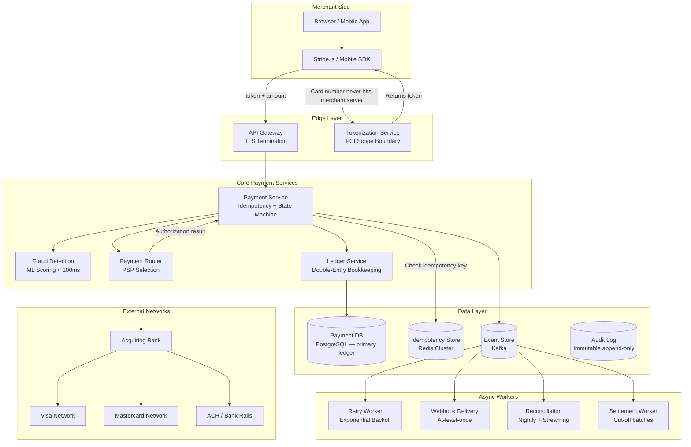
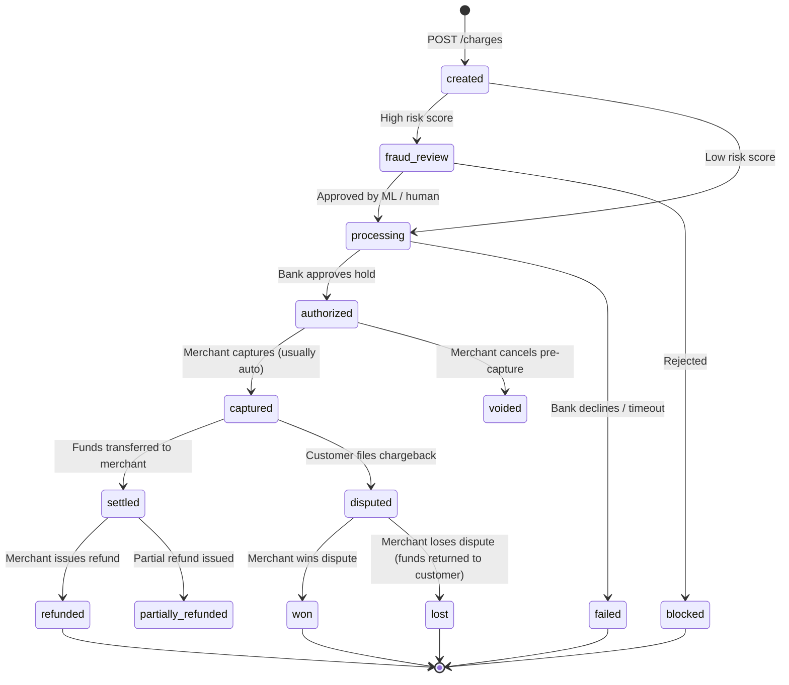
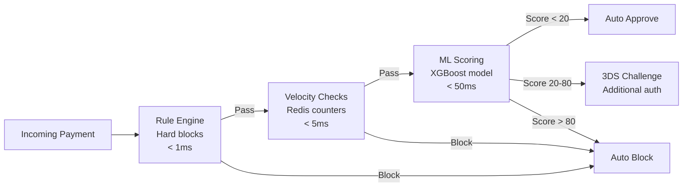
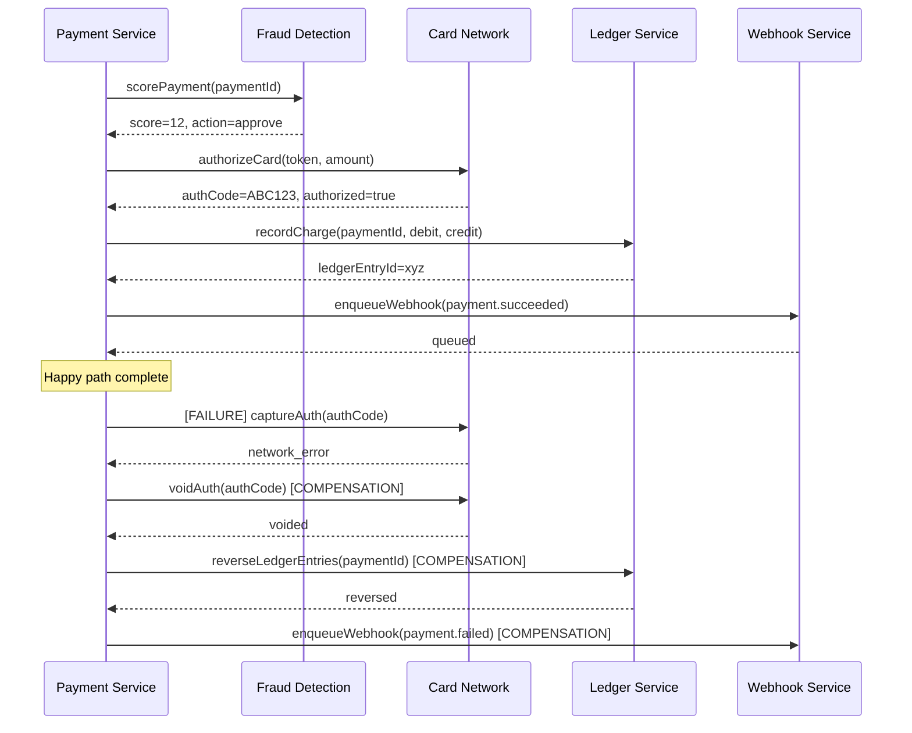
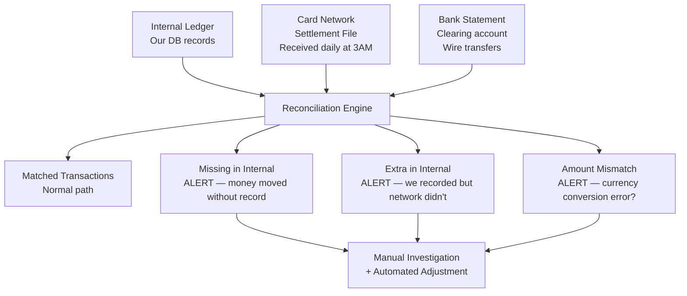

# Design a Payment System (Stripe / PayPal)

**Difficulty**: 🔴 Advanced
**Time**: 60 minutes
**Companies**: Stripe, PayPal, Square, Visa, Mastercard, Adyen, Braintree

---

> **The stakes are brutal.** A bug that charges a customer twice costs you $30–$90 in dispute fees per chargeback, plus the refund. A bug that charges the wrong amount triggers regulatory scrutiny. A bug that fails silently — where money left the account but no goods were delivered — can bankrupt small merchants overnight. Stripe processes **$817 billion per year**. At that scale, even a 0.001% error rate means $817 million in misdirected money. Payment systems are the most unforgiving distributed systems you will ever build.

---

## 1. Problem Statement

Design a payment processing platform that allows businesses to accept, process, and reconcile payments from customers globally.

**Scale reference (Stripe, 2024):**

```
Annual volume:       $817 billion processed
Transactions/day:    ~50 million
Peak TPS:            ~10,000 transactions/second
Uptime SLA:          99.9999% (~32 seconds downtime/year)
Countries:           46+
Currencies:          135+
Card network latency: < 2 seconds end-to-end
Fraud rate:          < 0.1% (industry avg: 0.6%)
```

**The core challenge — money cannot be lost or duplicated:**

```
Customer clicks "Pay $99.99"
  → Browser sends POST /charges
  → Network hiccup — did it arrive?
  → Retry POST /charges
  → Did we charge them once or twice?
  → Bank says "approved" but our DB write fails — did money move?
  → Card network times out — do we retry? What if it went through?

Every ambiguous state = real money at risk.
```

The fundamental paradox: payments require **exactly-once semantics** in a world where networks guarantee **at-most-once delivery** (lost packets) or **at-least-once delivery** (retries), but never exactly-once.

## 2. Requirements

### Functional Requirements

1. **Charge** a customer's payment method (card, bank account, wallet)
2. **Refund** a charge, partially or fully
3. **Transfer** funds between accounts (payouts to merchants)
4. **Dispute/Chargeback** handling — respond to bank disputes
5. **Multi-currency** — accept and settle in 135+ currencies
6. **Webhooks** — notify merchants of payment state changes
7. **Dashboard** — merchants view transactions, reconcile, export reports
8. **Fraud detection** — score and block suspicious transactions in real-time
9. **Reconciliation** — match internal ledger against bank/card network statements

### Non-Functional Requirements

| Requirement | Target |
|-------------|--------|
| Availability | 99.9999% (32 sec/year downtime) |
| Payment latency | < 2 seconds (p99) |
| Exactly-once processing | Zero double-charges |
| Data durability | Zero data loss (RPO = 0) |
| Fraud detection latency | < 100ms inline |
| PCI DSS compliance | Level 1 (highest) |
| Throughput | 10,000+ TPS peak |
| Audit trail | 7-year immutable history |

### Out of Scope

- Cryptocurrency payments
- Physical POS terminal firmware
- Banking core ledger (we integrate with banks, not replace them)

## 3. High-Level Architecture



## 4. Core Components

### 4.1 Idempotency Keys — The Most Critical Concept

Idempotency is the property that performing an operation multiple times produces the same result as performing it once. For payments, this means: **no matter how many times you retry a charge request, the customer is billed exactly once.**

**Why networks make this hard:**

```
Scenario A: Request lost in transit
  Client → [network drop] → Server
  Client retries → Server processes → OK
  Result: 1 charge ✓

Scenario B: Response lost in transit
  Client → Server processes charge → [network drop]
  Client retries → Server MUST recognize duplicate → return cached result
  Result: 1 charge ✓ (without idempotency: 2 charges ✗)

Scenario C: Server crashed after processing but before responding
  Client → Server processes charge → Server crashes
  Client retries → Server restarts → MUST recognize duplicate
  Result: 1 charge ✓ (without idempotency: 2 charges ✗)
```

**Implementation:**

```javascript
// Merchant generates a unique idempotency key per payment intent
// This key is stable across retries for the same logical operation

class IdempotencyService {
  constructor(redisCluster, paymentDB) {
    this.redis = redisCluster;
    this.db = paymentDB;
    this.TTL_SECONDS = 86400 * 7; // 7 days
  }

  async processWithIdempotency(idempotencyKey, requestFingerprint, operation) {
    const lockKey = `idempotency:lock:${idempotencyKey}`;
    const resultKey = `idempotency:result:${idempotencyKey}`;

    // Phase 1: Check for existing result (fast path)
    const cached = await this.redis.get(resultKey);
    if (cached) {
      const result = JSON.parse(cached);
      // Verify request fingerprint matches (same amount, currency, etc.)
      if (result.requestFingerprint !== requestFingerprint) {
        throw new IdempotencyConflictError(
          'Same idempotency key used with different request parameters'
        );
      }
      return { result: result.data, fromCache: true };
    }

    // Phase 2: Acquire distributed lock to prevent concurrent duplicate processing
    const acquired = await this.redis.set(
      lockKey,
      'processing',
      'NX',     // only set if not exists
      'EX', 30  // 30-second lock expiry (longer than max payment timeout)
    );

    if (!acquired) {
      // Another request with same key is in-flight — return 409 Conflict
      // Merchant should poll or wait, not retry immediately
      throw new DuplicateRequestInFlightError(idempotencyKey);
    }

    try {
      // Phase 3: Double-check DB (Redis may have evicted the key)
      const dbRecord = await this.db.idempotencyRecords.findOne({
        where: { key: idempotencyKey }
      });

      if (dbRecord) {
        // Restore to cache and return
        await this.redis.set(
          resultKey,
          JSON.stringify(dbRecord.result),
          'EX', this.TTL_SECONDS
        );
        return { result: dbRecord.result.data, fromCache: true };
      }

      // Phase 4: Execute the actual operation
      const result = await operation();

      // Phase 5: Persist result atomically (DB first, then cache)
      await this.db.idempotencyRecords.create({
        key: idempotencyKey,
        requestFingerprint,
        result: { data: result },
        createdAt: new Date()
      });

      await this.redis.set(
        resultKey,
        JSON.stringify({ data: result, requestFingerprint }),
        'EX', this.TTL_SECONDS
      );

      return { result, fromCache: false };

    } finally {
      await this.redis.del(lockKey);
    }
  }
}

// Usage in payment endpoint
app.post('/v1/charges', async (req, res) => {
  const idempotencyKey = req.headers['idempotency-key'];
  if (!idempotencyKey) {
    return res.status(400).json({ error: 'Idempotency-Key header required' });
  }

  const fingerprint = hashRequest({
    amount: req.body.amount,
    currency: req.body.currency,
    source: req.body.source,
    merchantId: req.merchantId
  });

  try {
    const { result, fromCache } = await idempotencyService.processWithIdempotency(
      idempotencyKey,
      fingerprint,
      () => paymentService.charge(req.body)
    );

    res.status(fromCache ? 200 : 201).json(result);
  } catch (err) {
    if (err instanceof DuplicateRequestInFlightError) {
      res.status(409).json({ error: 'Request in progress, retry after 5s' });
    } else {
      throw err;
    }
  }
});
```

### 4.2 Payment State Machine

A payment is not a single operation — it transitions through states. Modeling this explicitly prevents invalid transitions and makes the system auditable.



```javascript
// Payment state machine implementation
const VALID_TRANSITIONS = {
  created:            ['fraud_review', 'processing'],
  fraud_review:       ['processing', 'blocked'],
  processing:         ['authorized', 'failed'],
  authorized:         ['captured', 'voided'],
  captured:           ['settled', 'disputed', 'refunded', 'partially_refunded'],
  settled:            ['refunded', 'partially_refunded', 'disputed'],
  disputed:           ['won', 'lost'],
};

class PaymentStateMachine {
  async transition(paymentId, newState, metadata, tx) {
    // All state transitions happen inside a DB transaction
    const payment = await tx.payments.findOne({
      where: { id: paymentId },
      lock: tx.LOCK.UPDATE // SELECT FOR UPDATE — prevent race conditions
    });

    if (!payment) throw new PaymentNotFoundError(paymentId);

    const allowed = VALID_TRANSITIONS[payment.status] || [];
    if (!allowed.includes(newState)) {
      throw new InvalidTransitionError(
        `Cannot transition ${payment.status} → ${newState}`
      );
    }

    // Write state change as an event (event sourcing)
    await tx.paymentEvents.create({
      paymentId,
      fromState: payment.status,
      toState: newState,
      metadata,
      timestamp: new Date(),
      actorId: metadata.actorId // who/what triggered this
    });

    // Update denormalized current state
    await tx.payments.update(
      { status: newState, updatedAt: new Date() },
      { where: { id: paymentId }, transaction: tx }
    );

    return { previousState: payment.status, newState };
  }
}
```

### 4.3 Double-Entry Ledger

Every payment system ultimately is a ledger system. Double-entry bookkeeping (invented in 1494) is the only correct way to track money: **every debit must have a corresponding credit, and the sum of all entries must always equal zero.**

```javascript
// Ledger entry creation — every money movement creates two entries
class LedgerService {
  async recordPayment(payment, tx) {
    const entries = [];

    // Debit customer's account (money leaves)
    entries.push({
      accountId: payment.customerId,
      type: 'debit',
      amount: payment.amount,
      currency: payment.currency,
      paymentId: payment.id,
      description: `Charge: ${payment.description}`,
      timestamp: new Date()
    });

    // Credit merchant's pending balance (money arrives, not yet settled)
    entries.push({
      accountId: payment.merchantId,
      type: 'credit',
      amount: payment.amount - payment.platformFee,
      currency: payment.currency,
      paymentId: payment.id,
      description: `Payment received: ${payment.description}`,
      timestamp: new Date()
    });

    // Credit platform fee account
    entries.push({
      accountId: 'platform_revenue',
      type: 'credit',
      amount: payment.platformFee,
      currency: payment.currency,
      paymentId: payment.id,
      description: `Platform fee: ${payment.id}`,
      timestamp: new Date()
    });

    // Invariant check: debits must equal credits
    const totalDebits = entries
      .filter(e => e.type === 'debit')
      .reduce((sum, e) => sum + e.amount, 0);
    const totalCredits = entries
      .filter(e => e.type === 'credit')
      .reduce((sum, e) => sum + e.amount, 0);

    if (totalDebits !== totalCredits) {
      throw new LedgerImbalanceError(
        `Debits ${totalDebits} ≠ Credits ${totalCredits} for payment ${payment.id}`
      );
    }

    // Insert all entries atomically — never partial writes
    await tx.ledgerEntries.bulkCreate(entries);

    // Update account balances (denormalized for fast reads)
    await this.updateBalances(entries, tx);
  }

  async updateBalances(entries, tx) {
    for (const entry of entries) {
      const delta = entry.type === 'credit' ? entry.amount : -entry.amount;

      await tx.accountBalances.increment('balance', {
        by: delta,
        where: { accountId: entry.accountId, currency: entry.currency },
        transaction: tx
      });

      // Verify balance never goes negative (business rule)
      const balance = await tx.accountBalances.findOne({
        where: { accountId: entry.accountId, currency: entry.currency },
        transaction: tx,
        lock: tx.LOCK.UPDATE
      });

      if (balance.balance < 0 && !balance.allowNegative) {
        throw new InsufficientFundsError(entry.accountId);
      }
    }
  }
}
```

### 4.4 Retry with Exponential Backoff and Jitter

Payment failures are often transient. The correct retry strategy avoids thundering herd problems on the card network.

```javascript
class PaymentRetryWorker {
  constructor(paymentService, eventBus) {
    this.paymentService = paymentService;
    this.eventBus = eventBus;
    this.MAX_RETRIES = 4;
    this.BASE_DELAY_MS = 1000; // 1 second
    this.MAX_DELAY_MS = 60000; // 60 seconds cap
  }

  // Exponential backoff: 1s, 2s, 4s, 8s (with jitter)
  calculateDelay(attempt) {
    const exponential = this.BASE_DELAY_MS * Math.pow(2, attempt);
    const capped = Math.min(exponential, this.MAX_DELAY_MS);
    // Full jitter: random between 0 and capped value
    // Prevents all retries from hitting the network simultaneously
    const jitter = Math.random() * capped;
    return Math.floor(jitter);
  }

  isRetryable(error) {
    // Retryable: network timeouts, gateway errors, rate limits
    const retryableCodes = [
      'network_timeout',
      'gateway_timeout',
      'processing_error',
      'rate_limit_exceeded',
      'service_unavailable'
    ];
    // NOT retryable: insufficient funds, stolen card, expired card
    const terminalCodes = [
      'card_declined',
      'insufficient_funds',
      'stolen_card',
      'expired_card',
      'do_not_honor'
    ];
    return retryableCodes.includes(error.code)
      && !terminalCodes.includes(error.code);
  }

  async processRetryQueue() {
    const due = await this.getRetrysDue(); // payments where next_retry_at <= now

    for (const payment of due) {
      if (payment.retryCount >= this.MAX_RETRIES) {
        await this.markPermanentlyFailed(payment);
        await this.eventBus.emit('payment.permanently_failed', payment);
        continue;
      }

      try {
        const result = await this.paymentService.attemptCharge(payment);
        await this.markSucceeded(payment, result);
        await this.eventBus.emit('payment.succeeded', payment);

      } catch (error) {
        if (!this.isRetryable(error)) {
          await this.markPermanentlyFailed(payment, error);
          await this.eventBus.emit('payment.permanently_failed', payment);
          return;
        }

        const nextAttempt = payment.retryCount + 1;
        const delayMs = this.calculateDelay(nextAttempt);

        await this.scheduleRetry(payment, {
          retryCount: nextAttempt,
          nextRetryAt: new Date(Date.now() + delayMs),
          lastError: error.code
        });

        console.log(
          `Payment ${payment.id} scheduled for retry ${nextAttempt}/${this.MAX_RETRIES} ` +
          `in ${delayMs}ms (error: ${error.code})`
        );
      }
    }
  }
}
```

### 4.5 Fraud Detection Pipeline

Fraud detection must be **inline** (blocks the payment), **fast** (< 100ms), and **accurate** (low false positive rate — blocking legitimate payments loses merchant revenue).



```javascript
class FraudDetectionService {
  async score(paymentContext) {
    const startTime = Date.now();

    // Layer 1: Hard rules (< 1ms) — binary, no ML needed
    const hardBlock = await this.checkHardRules(paymentContext);
    if (hardBlock) {
      return { score: 100, reason: hardBlock, action: 'block' };
    }

    // Layer 2: Velocity checks (< 5ms) — Redis sliding window counters
    const velocityFlags = await this.checkVelocity(paymentContext);

    // Layer 3: ML model (< 50ms) — feature extraction + inference
    const features = await this.extractFeatures(paymentContext, velocityFlags);
    const mlScore = await this.mlModel.predict(features);

    const totalMs = Date.now() - startTime;
    if (totalMs > 100) {
      // Alert but don't block — SLA breach
      metrics.increment('fraud_detection.sla_breach');
    }

    return this.decisionFromScore(mlScore, velocityFlags);
  }

  async checkHardRules(ctx) {
    // Blocklist: stolen card BINs, sanctioned countries (OFAC), blocked customers
    if (await this.isBlocklisted(ctx.cardBin)) return 'blocklisted_card_bin';
    if (await this.isSanctionedCountry(ctx.billingCountry)) return 'ofac_sanctions';
    if (await this.isBlockedCustomer(ctx.customerId)) return 'blocked_customer';

    // Impossible geography: customer in NY 2 min after purchase in Tokyo
    if (await this.isImpossibleGeo(ctx.customerId, ctx.ipCountry)) {
      return 'impossible_geography';
    }

    return null; // No hard block
  }

  async checkVelocity(ctx) {
    const flags = [];
    const window1h = 3600;
    const window24h = 86400;

    // Cards tried per customer in last hour (card testing attack pattern)
    const cardsTriedHour = await redis.incr(
      `velocity:cards_tried:${ctx.customerId}:${hourBucket()}`,
      { EX: window1h }
    );
    if (cardsTriedHour > 3) flags.push('high_card_velocity');

    // Failed payments in last 24h per IP
    const failedByIp = await redis.get(
      `velocity:failures:ip:${ctx.ipAddress}:${dayBucket()}`
    );
    if (failedByIp > 10) flags.push('high_failure_ip');

    // Amount anomaly: $5000 from customer whose avg transaction is $25
    const avgAmount = await this.getCustomerAvgAmount(ctx.customerId);
    if (ctx.amount > avgAmount * 10) flags.push('amount_anomaly');

    return flags;
  }

  extractFeatures(ctx, velocityFlags) {
    return {
      // Card features
      cardCountry: ctx.card.country,
      cardType: ctx.card.type, // debit/credit/prepaid
      cardFunding: ctx.card.funding,
      binRiskScore: this.binRiskDb.lookup(ctx.cardBin),

      // Transaction features
      amount: ctx.amount,
      amountVsHistoricalAvg: ctx.amount / (ctx.customerAvgAmount || ctx.amount),
      isInternational: ctx.merchantCountry !== ctx.cardCountry,
      hourOfDay: new Date().getHours(),
      dayOfWeek: new Date().getDay(),

      // Customer features
      accountAgeDays: ctx.customer.accountAgeDays,
      previousChargebacks: ctx.customer.chargebackCount,
      successfulPayments: ctx.customer.successfulPaymentCount,

      // Network features
      ipProxy: ctx.ipMetadata.isProxy,
      ipTor: ctx.ipMetadata.isTor,
      ipCountryMatchesBilling: ctx.ipCountry === ctx.billingCountry,

      // Velocity features
      velocityFlags: velocityFlags.length,
      ...velocityFlags.reduce((acc, f) => ({ ...acc, [`flag_${f}`]: 1 }), {})
    };
  }
}
```

### 4.6 Distributed Transactions — Saga Pattern

A payment involves multiple services: fraud check, card network authorization, ledger update, notification. If any step fails, we must compensate. Two approaches:

**Two-Phase Commit (2PC) — Why Payments Avoid It:**

```
Phase 1 (Prepare): Ask all services "can you commit?"
  → FraudService: yes
  → CardNetwork: yes (hold placed)
  → LedgerService: yes

Phase 2 (Commit): Tell all services "commit now"
  → FraudService: ✓ committed
  → CardNetwork: [TIMEOUT] — network partition
  → LedgerService: waiting...

Result: System is stuck. CardNetwork might have committed, might not.
Funds are in limbo. The coordinator is a single point of failure.
Card networks have 2-second SLAs — 2PC latency is incompatible.
```

**Saga Pattern — What Payments Actually Use:**



```javascript
class PaymentSaga {
  constructor(services) {
    this.steps = [
      {
        name: 'fraud_check',
        execute: (ctx) => services.fraud.score(ctx.payment),
        compensate: async (ctx) => { /* nothing to undo for a read */ }
      },
      {
        name: 'card_authorization',
        execute: (ctx) => services.cardNetwork.authorize(ctx.payment),
        compensate: (ctx) => services.cardNetwork.void(ctx.authCode)
      },
      {
        name: 'ledger_record',
        execute: (ctx) => services.ledger.recordCharge(ctx.payment, ctx.authCode),
        compensate: (ctx) => services.ledger.reverseCharge(ctx.payment.id)
      },
      {
        name: 'webhook_notify',
        execute: (ctx) => services.webhook.enqueue('payment.succeeded', ctx.payment),
        compensate: (ctx) => services.webhook.enqueue('payment.failed', ctx.payment)
      }
    ];
  }

  async execute(payment) {
    const context = { payment };
    const completedSteps = [];

    for (const step of this.steps) {
      try {
        const result = await step.execute(context);
        context[step.name] = result; // save result for subsequent steps and compensation
        completedSteps.push(step);

        // Persist saga state after each step (for crash recovery)
        await this.persistSagaState(payment.id, step.name, 'completed', context);

      } catch (error) {
        console.error(`Saga step ${step.name} failed: ${error.message}`);

        // Run compensations in reverse order
        for (const completedStep of completedSteps.reverse()) {
          try {
            await completedStep.compensate(context);
            await this.persistSagaState(payment.id, completedStep.name, 'compensated', context);
          } catch (compError) {
            // Compensation failed — alert on-call, requires manual intervention
            await this.alertOperations({
              paymentId: payment.id,
              failedStep: step.name,
              failedCompensation: completedStep.name,
              error: compError
            });
          }
        }

        throw new SagaFailedError(payment.id, step.name, error);
      }
    }

    return context;
  }
}
```

### 4.7 Webhook Delivery Guarantees

Merchants depend on webhooks for fulfillment (shipping orders, activating subscriptions). Lost webhooks = unfulfilled orders. The system must guarantee **at-least-once delivery** with idempotent webhook handlers on the merchant side.

```javascript
class WebhookDeliveryService {
  async deliver(webhookId) {
    const webhook = await this.db.webhooks.findOne({ id: webhookId });
    const endpoint = await this.db.webhookEndpoints.findOne({
      merchantId: webhook.merchantId,
      active: true
    });

    const payload = JSON.stringify(webhook.event);
    const signature = this.sign(payload, endpoint.secret); // HMAC-SHA256

    try {
      const response = await fetch(endpoint.url, {
        method: 'POST',
        headers: {
          'Content-Type': 'application/json',
          'Stripe-Signature': `t=${Date.now()},v1=${signature}`,
          'Stripe-Idempotency-Key': webhookId // merchant can deduplicate
        },
        body: payload,
        signal: AbortSignal.timeout(30000) // 30s timeout
      });

      if (response.ok) {
        await this.markDelivered(webhookId);
        return;
      }

      // Non-2xx response — treat as failure, schedule retry
      throw new WebhookFailedError(response.status);

    } catch (error) {
      const attempt = webhook.attemptCount + 1;

      if (attempt >= 5) {
        await this.markFailed(webhookId, 'max_retries_exceeded');
        return; // Merchant must poll /events endpoint
      }

      // Retry schedule: 5m, 30m, 2h, 8h, 24h
      const delays = [300, 1800, 7200, 28800, 86400];
      const nextAttemptAt = new Date(Date.now() + delays[attempt - 1] * 1000);

      await this.scheduleRetry(webhookId, attempt, nextAttemptAt);
    }
  }
}
```

### 4.8 Reconciliation System

Even with idempotency and exactly-once processing, discrepancies can arise between our internal ledger and what the card networks/banks report. Nightly reconciliation catches these.



```javascript
class ReconciliationWorker {
  async reconcileDay(date) {
    const [internalTxns, networkTxns] = await Promise.all([
      this.fetchInternalTransactions(date),
      this.fetchCardNetworkSettlement(date) // ISO 8583 format file
    ]);

    const internalMap = new Map(internalTxns.map(t => [t.networkTransactionId, t]));
    const networkMap = new Map(networkTxns.map(t => [t.transactionId, t]));

    const results = {
      matched: [],
      missingInternal: [],  // In network file but not in our DB — critical
      extraInternal: [],    // In our DB but not in network file
      amountMismatch: [],   // Present in both but amounts differ
    };

    for (const [txnId, networkTxn] of networkMap) {
      const internal = internalMap.get(txnId);

      if (!internal) {
        results.missingInternal.push({ networkTxn });
        continue;
      }

      const amountDiff = Math.abs(internal.amount - networkTxn.settledAmount);
      if (amountDiff > 0) { // Any discrepancy, even cents
        results.amountMismatch.push({ internal, networkTxn, diff: amountDiff });
      } else {
        results.matched.push({ internal, networkTxn });
      }
    }

    for (const [txnId, internal] of internalMap) {
      if (!networkMap.has(txnId)) {
        results.extraInternal.push({ internal });
      }
    }

    // Alert if exceptions exceed threshold
    const exceptionRate = (
      results.missingInternal.length +
      results.extraInternal.length +
      results.amountMismatch.length
    ) / networkTxns.length;

    if (exceptionRate > 0.0001) { // > 0.01% exception rate triggers alert
      await this.alertFinanceTeam(results);
    }

    await this.storeReconciliationReport(date, results);
    return results;
  }
}
```

## 5. Key Technical Decisions

### Decision 1: SQL vs NoSQL for the Ledger

**Choice: PostgreSQL (relational)**

| Factor | SQL (PostgreSQL) | NoSQL (Cassandra/DynamoDB) |
|--------|------------------|---------------------------|
| ACID transactions | Native — critical for money | Eventual consistency is unacceptable |
| Foreign key integrity | Enforced | Must enforce in application |
| Complex queries (reconciliation) | JOIN-native | Requires denormalization, expensive |
| Horizontal scaling | Harder (sharding) | Excellent |
| Audit queries | Simple GROUP BY | Scatter-gather across partitions |

**Verdict**: Money requires ACID. The ledger is PostgreSQL. High-volume analytics run against a read replica or data warehouse (Redshift/BigQuery), not the primary.

### Decision 2: Synchronous vs Asynchronous Card Network Call

**Choice: Synchronous for authorization, asynchronous for capture/settlement**

- **Authorization** (does the customer have funds?): Synchronous — customer is waiting for "Payment Accepted"
- **Capture** (actually move money): Can be async — happens within 24–72h of authorization
- **Settlement** (batch transfer to merchant): Async — processed in daily cut-off batches by card networks

This is how all real payment systems work. It's why hotel pre-authorizations appear on your card immediately but the charge appears after checkout.

### Decision 3: Saga vs 2PC for Distributed Transactions

**Choice: Saga pattern**

- 2PC requires all participants to be available simultaneously and hold locks during the protocol — incompatible with 2-second card network SLAs
- Card networks don't support 2PC protocols
- Saga with compensating transactions provides the right trade-offs: each step is independently atomic, compensation is explicit, no distributed locks needed

### Decision 4: How to Handle Currency Conversion

```javascript
// NEVER store amounts as floats — use integers (smallest currency unit)
// $10.99 → stored as 1099 (cents)
// ¥1000 → stored as 1000 (yen, no subunit)
// KWD 1.234 → stored as 1234 (fils, 3 decimal places)

class MoneyAmount {
  constructor(amount, currency) {
    this.amount = amount;         // integer, in smallest unit
    this.currency = currency;     // ISO 4217
  }

  toDecimal() {
    const subunitFactor = CURRENCY_SUBUNITS[this.currency]; // e.g., USD=100, JPY=1
    return this.amount / subunitFactor;
  }

  // Exchange rates: snapshot rate at transaction time, store it
  // Never recompute historical FX — rates change, disputes arise months later
  convert(targetCurrency, exchangeRate) {
    const sourceDecimal = this.toDecimal();
    const targetDecimal = sourceDecimal * exchangeRate;
    const targetFactor = CURRENCY_SUBUNITS[targetCurrency];
    return new MoneyAmount(
      Math.round(targetDecimal * targetFactor), // round, never truncate
      targetCurrency
    );
  }
}
```

### Decision 5: PCI DSS Compliance Architecture

PCI DSS Level 1 (required for >6M transactions/year) mandates strict controls over cardholder data. The architecture minimizes PCI scope:

```
PCI Scope (must be audited, hardened, monitored):
  ┌─────────────────────────────────────────┐
  │  Tokenization Service                    │
  │  - Receives raw card numbers             │
  │  - Returns opaque token (e.g., tok_xxx)  │
  │  - Hardware Security Module (HSM)        │
  │    stores encryption keys               │
  │  - Isolated network segment             │
  │  - All access logged and alerting       │
  └─────────────────────────────────────────┘

Outside PCI scope (merchant servers, all other services):
  - Only see tokens, never raw PANs
  - Network-isolated from tokenization service
  - Audit requirements dramatically reduced
```

Card numbers in transit: always via Stripe.js/mobile SDK directly to Stripe's servers — the merchant's server never sees the raw PAN.

## 6. Real-World Details

### Card Network Integration (Visa/Mastercard Rails)

```
Merchant → Acquiring Bank → Card Network → Issuing Bank
                                ↕
                         Settlement (T+1 or T+2)
```

**Authorization flow (real-time, ~1.5 seconds):**
1. Merchant terminal / Stripe sends authorization request (ISO 8583 message)
2. Acquiring bank forwards to Visa/Mastercard network
3. Card network routes to issuing bank (the bank that issued the card)
4. Issuing bank checks: credit limit, fraud rules, account standing
5. Issuing bank returns approve/decline + authorization code
6. Response travels back in reverse within the 2-second SLA

**Interchange fees** (why card payments cost money):
- Issuing bank: ~1.5% (for providing credit risk, fraud protection)
- Card network: ~0.1% (for running the rails)
- Acquiring bank: ~0.3% (for merchant relationship)
- Stripe charges merchant: 2.9% + $0.30 (covers all of above + margin)

### Settlement and Clearing

- **Authorization**: Funds reserved on customer's card (immediate)
- **Capture**: Merchant confirms goods/services delivered (within 7 days)
- **Clearing**: Card network processes the batch (T+1)
- **Settlement**: Actual wire transfer to merchant's bank account (T+2 for Visa, T+1 for some networks)

Stripe's accelerated payout (Instant Payouts) fronts the money from their own balance, taking on the settlement risk.

### Scale Numbers

```
Peak transaction rate:    10,000 TPS
Database writes/sec:      ~50,000 (ledger entries: 3-5 per transaction)
Redis operations/sec:     ~500,000 (idempotency checks, velocity counters)
Kafka events/sec:         ~30,000
Card network connections: Persistent TCP/IP via ISO 8583 over private lines
Data centers:             Multi-region active-active (US, EU, APAC)
```

### Disaster Recovery

```
RPO (Recovery Point Objective):  0 — zero data loss (synchronous replication)
RTO (Recovery Time Objective):   < 60 seconds (automated failover)
Active-active regions:           Transactions can be processed from any region
Data replication:                Synchronous within region, async cross-region
Failover testing:                Chaos engineering — monthly failover drills
```

## 7. Common Interview Questions

**Q: How do you prevent double-charging a customer?**

Use idempotency keys. The client generates a UUID for each payment intent. The server checks this key before processing — if it's seen before, return the cached result. The key is stored in both Redis (fast) and PostgreSQL (durable). A distributed lock prevents concurrent duplicate processing during the window before the result is cached.

**Q: How does exactly-once payment processing work given network unreliability?**

The payment system achieves exactly-once semantics through idempotency + atomic DB transactions. Network delivery is at-most-once or at-least-once, but by making operations idempotent, we can safely retry until we receive a response. The response may be from a real execution or from the idempotency cache — the result is the same to the caller.

**Q: What happens if your server crashes after charging the card but before updating your database?**

This is a critical scenario. The auth code exists at the card network but your DB doesn't reflect it. Options:
1. **Saga compensation**: The saga recovery worker detects the incomplete saga state, fetches the auth code from the card network, and records it.
2. **Outbox pattern**: The charge operation writes to a local "outbox" table in the same DB transaction as the card network call is triggered. A separate worker reads the outbox and persists the result, ensuring at-least-once write of every authorization.

**Q: How do you handle a currency conversion that changes between display and charge?**

Snapshot the exchange rate at authorization time and store it with the transaction. The customer is shown "approximately $10 USD" with the current rate, and the final charged amount is locked at authorization. Rate validity windows (typically 1–4 hours) ensure the rate isn't stale at capture time.

**Q: How do you detect fraud without adding too much latency to payments?**

Three-layer approach with aggressive time budgets: hard rules in < 1ms (blocklists, OFAC), velocity checks in < 5ms (Redis), ML model in < 50ms (pre-loaded model, feature engineering pre-computed). If total scoring exceeds 100ms SLA, fail open (approve and flag for review) rather than blocking the user — declining legitimate transactions has immediate revenue cost.

**Q: How does your reconciliation system work?**

Card networks send daily settlement files (ISO 8583 batch format) containing every transaction they processed. Our reconciliation worker compares this file against our internal ledger. Discrepancies are categorized: missing in internal (network processed, we didn't record — critical alert), extra in internal (we recorded, network didn't — investigate pending settlement), amount mismatch (FX conversion or rounding issue). Exception rate > 0.01% triggers finance team alert.

**Q: How do you design the database schema to support both fast payment processing and complex reconciliation queries?**

Write path: payments table (normalized, optimized for single-payment lookups by id), ledger_entries table (append-only, indexed on account_id + timestamp). Read path: async ETL to a columnar data warehouse (BigQuery/Redshift) for reconciliation aggregation queries. Never run complex analytics on the OLTP primary.

**Q: How do you guarantee webhook delivery?**

Webhooks use at-least-once delivery semantics. Events are persisted to Kafka before delivery is attempted. A delivery worker fetches events and POSTs to merchant URLs. HTTP 2xx = mark delivered. Non-2xx or timeout = schedule retry with exponential backoff (5m, 30m, 2h, 8h, 24h). After 5 failures, webhook is marked failed and merchants are expected to use the /events polling endpoint. Merchant handlers must be idempotent (using the idempotency key in the webhook header).

## 8. Key Takeaways

| Concept | One-Line Summary |
|---------|-----------------|
| **Idempotency keys** | The single most important concept — enables safe retries without double-charging |
| **Double-entry ledger** | Every money movement has a debit and credit; the books must always balance |
| **Saga pattern** | Break distributed transactions into compensatable steps; never use 2PC with external networks |
| **State machine** | Model payment lifecycle explicitly to prevent invalid transitions and enable auditability |
| **PCI scope minimization** | Tokenize at the edge so your servers never touch raw card numbers |
| **Fraud: fail open** | Missing a real fraudster costs less than blocking a real customer — tune thresholds accordingly |
| **Integer money** | Never use floats for currency; use integers in smallest denomination unit |
| **Reconciliation** | Even perfect systems drift; automated daily reconciliation is non-negotiable |
| **Snapshots, not recomputes** | Store exchange rates and fees at transaction time; never recompute historical values |
| **Exactly-once is impossible** | Achieve it by making operations idempotent and using at-least-once delivery |

---

**The payment system is a microcosm of the hardest distributed systems problems**: consistency without coordination, fault tolerance without duplication, speed without compromise on correctness. Every design decision cascades into real financial consequences. Getting this right is why companies like Stripe are worth $50B+.
