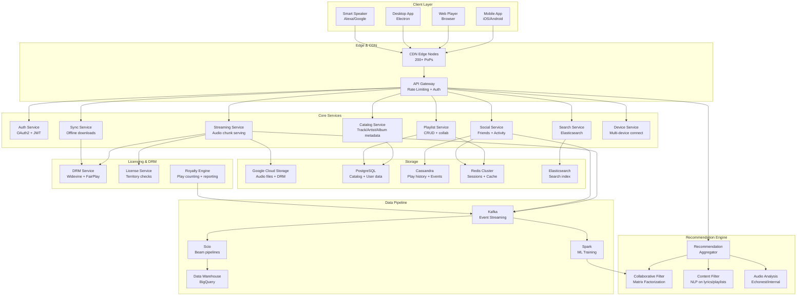

# Design Spotify (Music Streaming Platform)

**Difficulty**: 🔴 Advanced
**Time**: 45 minutes
**Companies**: Spotify, Apple Music, Tidal, Amazon Music, YouTube Music (Common for senior roles)

---

## 1. Problem Statement

Design a global music streaming platform where 600 million users can instantly stream 100 million songs, get personalized recommendations that feel like a mind-reading DJ, download music for offline playback, and discover new content before they even know they want it.

**The hard parts aren't obvious:**

```
What looks easy:              What's actually hard:
─────────────────             ─────────────────────────────────────────────
"Just stream audio"     →     Sub-second buffering across 184 countries
"Store music files"     →     DRM enforcement per track per territory
"Recommend songs"       →     Personalization for 600M distinct taste profiles
"Offline mode"          →     Sync 10K songs across 5 devices without conflicts
"Show friend activity"  →     Real-time presence at social network scale
```

**Scale reference (Spotify, 2024):**

```
Monthly active users:         600 million+
Daily active users:           250 million+
Songs in catalog:             100 million+
Podcasts:                     80 million+ episodes
Streams per day:              30+ billion
Data transferred per day:     200+ petabytes
Average song size (OGG 160k): ~4MB
Countries served:             184
CDN edge locations:           200+
Discover Weekly recipients:   170 million users every Monday
```

---

## 2. Requirements

### Functional Requirements

1. **Stream music** - Play songs on demand with sub-2-second start time
2. **Audio quality** - Multiple bitrates (24kbps, 96kbps, 160kbps, 320kbps, lossless)
3. **Search and browse** - Find songs, artists, albums, playlists
4. **Playlists** - Create, edit, share, and collaborate on playlists
5. **Recommendations** - Discover Weekly, Daily Mix, Radio, Release Radar
6. **Offline mode** - Download up to 10,000 songs across 5 devices
7. **Social features** - Friend activity feed, collaborative playlists
8. **Podcasts** - On-demand audio, different from music (no DRM, larger files)
9. **Cross-device** - Seamless playback handoff between phone, desktop, speaker
10. **Artist/label portal** - Upload music, view analytics

### Non-Functional Requirements

```
Latency:
  - Audio start time: < 2 seconds (target < 500ms for premium)
  - Search results: < 100ms
  - Recommendation load: < 200ms
  - Real-time sync: < 500ms

Availability:
  - Streaming: 99.99% (< 52 min downtime/year)
  - Recommendations: 99.9% (degraded gracefully)
  - Upload/ingestion: 99.5%

Scale:
  - 250M concurrent listeners at peak
  - 100M songs × multiple quality levels = ~800M audio files
  - 30B stream events per day → analytics pipeline

Durability:
  - Never lose a licensed track (legal obligation)
  - User playlist data: never lose (reputation)

Licensing compliance:
  - Track plays must be accurately reported to labels/PROs
  - DRM prevents unauthorized downloads
  - Geographic restrictions enforced per track
```

### Out of Scope

- Live audio (Spotify Live was sunset)
- Video content beyond podcast video
- Ticketing / concerts
- Merch / e-commerce

---

## 3. Architecture Diagram



---

## 4. Core Components

### 4.1 Audio Streaming Pipeline

The core insight: audio streaming is fundamentally different from video streaming. Songs are short (3-5 min), frequently replayed, and need to start **instantly**. Spotify uses a preloading strategy that makes the next song ready before you know you want it.

```
Audio Quality Tiers:
────────────────────────────────────────────────────────────
Tier         Bitrate     Codec       File size   Use case
────────────────────────────────────────────────────────────
Low          24 kbps     OGG Vorbis  ~700KB/song  Low data mode
Normal       96 kbps     OGG Vorbis  ~2.8MB/song  Default mobile
High        160 kbps     OGG Vorbis  ~4.5MB/song  Default desktop
Very High   320 kbps     OGG Vorbis  ~9MB/song    Premium
Lossless    1411 kbps    FLAC        ~35MB/song   Spotify HiFi
────────────────────────────────────────────────────────────
Why OGG Vorbis and not MP3?
  - Better quality at same bitrate (perceptual coding improvements)
  - No patent licensing fees (royalty-free codec)
  - Good browser/device support
  - ~30% smaller than MP3 at equivalent perceived quality

Why not AAC (used by Apple)?
  - OGG is fully open-source; Apple's AAC has licensing complexity
  - Spotify standardized on OGG early and built tooling around it
  - AAC used for podcasts (compatibility with podcast ecosystem)
```

**Audio chunk serving logic:**

```javascript
// Audio Streaming Service - chunk delivery with DRM
class AudioStreamingService {
  async streamTrack(req, res) {
    const { trackId, quality, deviceId } = req.params;
    const userId = req.user.id;

    // Step 1: License validation (territory + subscription check)
    const license = await this.licenseService.validate({
      trackId,
      userId,
      territory: req.geoLocation.countryCode,
      requestedQuality: quality
    });

    if (!license.allowed) {
      // Graceful degradation: serve lower quality if HiFi not licensed
      if (license.reason === 'QUALITY_NOT_LICENSED') {
        return this.streamTrack(req, res, { quality: 'HIGH' });
      }
      return res.status(403).json({ error: license.reason });
    }

    // Step 2: Resolve storage location
    const audioFile = await this.catalogService.getAudioFile(trackId, license.effectiveQuality);
    // audioFile = { gcsPath: 'gs://spotify-audio/tracks/abc123_320.ogg', size: 9437184 }

    // Step 3: Generate time-limited signed URL or CDN token
    const cdnToken = await this.drmService.generateStreamToken({
      trackId,
      userId,
      deviceId,
      expiresIn: 3600,  // 1 hour - forces re-auth if session expires
      allowedIPs: [req.ip]  // IP binding prevents URL sharing
    });

    const cdnUrl = `https://audio-edge.spotify.com/tracks/${trackId}_${license.effectiveQuality}.ogg?token=${cdnToken}`;

    // Step 4: Log stream start event (for royalty reporting)
    this.royaltyEngine.recordStreamStart({
      trackId,
      userId,
      quality: license.effectiveQuality,
      timestamp: Date.now(),
      territory: req.geoLocation.countryCode
    });

    // Step 5: Return streaming URL to client
    // Client fetches audio directly from CDN (not proxied through this service)
    res.json({
      streamUrl: cdnUrl,
      format: 'OGG_VORBIS',
      bitrate: license.effectiveBitrate,
      expiresAt: Date.now() + 3600000,
      preloadNextTrack: true  // hint to client
    });
  }
}
```

**Client-side preloading strategy:**

```javascript
// Spotify desktop/mobile client: aggressive preloading
class SpotifyPlayer {
  constructor() {
    this.preloadBuffer = new Map();   // trackId → ArrayBuffer
    this.PRELOAD_AHEAD = 2;           // preload next 2 tracks in queue
    this.GAPLESS_CROSSFADE_MS = 12;   // sub-perceptible gapless playback
  }

  onTrackStarted(currentTrack, queue) {
    // Preload next N tracks immediately
    const upcomingTracks = queue.slice(0, this.PRELOAD_AHEAD);

    for (const track of upcomingTracks) {
      if (!this.preloadBuffer.has(track.id)) {
        this.preloadTrack(track.id);
      }
    }

    // Evict tracks more than 2 positions back to free memory
    const evictBefore = queue.indexOf(currentTrack) - 2;
    if (evictBefore > 0) {
      const evictId = queue[evictBefore].id;
      this.preloadBuffer.delete(evictId);
    }
  }

  async preloadTrack(trackId) {
    // Fetch stream URL (fast - just metadata, no audio bytes yet)
    const { streamUrl, format } = await api.getStreamUrl(trackId);

    // Start downloading audio in background
    // Uses HTTP Range requests so we can start playback immediately
    const buffer = await fetch(streamUrl, {
      headers: { 'Range': 'bytes=0-524288' }  // Preload first 512KB
    });

    this.preloadBuffer.set(trackId, {
      url: streamUrl,
      buffer: await buffer.arrayBuffer(),
      loadedBytes: 524288
    });
  }

  async playTrack(trackId) {
    const cached = this.preloadBuffer.get(trackId);

    if (cached) {
      // Start playback from preloaded buffer instantly (<50ms)
      await this.audioEngine.playFromBuffer(cached.buffer, cached.url);
    } else {
      // Cold start: fetch stream URL then begin streaming
      const { streamUrl } = await api.getStreamUrl(trackId);
      await this.audioEngine.playFromUrl(streamUrl);
    }
  }
}
```

---

### 4.2 Recommendation & Discovery System

Spotify's recommendations are its primary competitive moat. Discover Weekly's "how did they know?" effect is engineered through three complementary systems working in concert.

```
Three Pillars of Spotify Recommendations:
──────────────────────────────────────────────────────────────────────
1. Collaborative Filtering (CF)
   "Users like you also listened to..."
   - Matrix factorization (ALS) on 600M users × 100M tracks
   - Implicit feedback: plays, skips, saves, playlist adds
   - Extremely powerful for mainstream content
   - Weakness: cold start (new artists/users)

2. Natural Language Processing (NLP)
   "This song appears in playlists about midnight drives..."
   - Crawls playlist titles, track names, editorial descriptions
   - Word2Vec / BERT embeddings on playlist text
   - Cultural context without needing audio
   - Solves cold start for new tracks via playlist metadata

3. Audio Feature Analysis (inherited from Echo Nest acquisition)
   "Acoustically similar to your saved tracks..."
   - Raw audio → features: tempo, key, danceability, energy, acousticness
   - Deep learning on spectrograms
   - Language/lyrics-agnostic (helps global recommendations)
   - Identifies "sounds like" independent of popularity

Final Ranking:
  score = w1 * CF_score + w2 * NLP_score + w3 * audio_score
  + context_boost (morning, workout, mood)
  + diversity_penalty (avoid same artist 3x in row)
  + freshness_bonus (new releases boosted for relevant users)
```

**Recommendation pipeline (simplified):**

```python
# Offline pipeline (runs weekly for Discover Weekly, daily for Daily Mix)
class RecommendationPipeline:
    """
    Spark + Scio pipeline running on Google Dataflow.
    Full Discover Weekly run: ~12 hours for 170M users.
    Incremental Daily Mix: ~2 hours.
    """

    def build_user_embedding(self, user_id: str, play_history: List[StreamEvent]) -> np.ndarray:
        """
        Create 128-dim user taste vector from listening history.
        Uses weighted recency: recent plays count more.
        """
        track_embeddings = []
        for event in play_history:
            if event.completion_ratio < 0.3:
                continue  # Skipped early - negative signal, ignore

            track_vec = self.track_embeddings[event.track_id]  # 128-dim
            # Recency weight: exponential decay, half-life = 30 days
            days_ago = (now() - event.played_at).days
            weight = 0.5 ** (days_ago / 30)

            # Engagement weight: saved > full play > partial play > added to playlist
            engagement_weight = {
                'saved': 3.0,
                'playlist_add': 2.0,
                'full_play': 1.0,
                'partial_play': event.completion_ratio
            }.get(event.engagement_type, 1.0)

            track_embeddings.append(track_vec * weight * engagement_weight)

        return np.mean(track_embeddings, axis=0)  # Weighted average

    def generate_discover_weekly(self, user_id: str) -> List[str]:
        """
        Generate 30-song playlist for Discover Weekly.
        """
        user_vec = self.build_user_embedding(user_id, self.get_play_history(user_id, days=90))

        # Step 1: Candidate generation (approximate nearest neighbor search)
        # ANN search in 128-dim space using FAISS index of 100M tracks
        candidate_track_ids = self.ann_index.search(
            query=user_vec,
            k=500,          # Top 500 candidates
            exclude=self.get_recently_played(user_id, days=30)  # No repeats
        )

        # Step 2: Re-rank with additional signals
        ranked = []
        for track_id in candidate_track_ids:
            track = self.catalog.get_track(track_id)

            score = self.cf_score(user_vec, track_id)        # Collaborative
            score += 0.3 * self.nlp_score(user_id, track_id) # NLP
            score += 0.2 * self.audio_score(user_vec, track_id) # Audio features

            # Diversity: penalize if same artist already in top-50
            artist_count = sum(1 for t in ranked[:50] if t.artist_id == track.artist_id)
            score *= max(0.1, 1.0 - (artist_count * 0.4))

            # Discovery factor: prefer tracks user hasn't heard of (< 10K plays)
            if track.global_play_count < 10_000:
                score *= 1.2  # "Hidden gem" boost

            ranked.append((score, track_id))

        # Step 3: Select final 30 songs with diversity enforcement
        ranked.sort(reverse=True)
        final_tracks = self.diversity_select(ranked, n=30, max_per_artist=2)

        return final_tracks

    def diversity_select(self, ranked_tracks, n: int, max_per_artist: int) -> List[str]:
        """
        Greedy diversity selection: take top-ranked while enforcing artist diversity.
        """
        selected = []
        artist_counts = defaultdict(int)

        for score, track_id in ranked_tracks:
            if len(selected) >= n:
                break
            artist_id = self.catalog.get_artist_id(track_id)
            if artist_counts[artist_id] < max_per_artist:
                selected.append(track_id)
                artist_counts[artist_id] += 1

        return selected
```

**Real-time personalization (for Radio / Autoplay):**

```python
# Online inference service - must respond in < 50ms
class RealTimeRecommender:
    def __init__(self):
        # Pre-computed user vectors loaded into memory (Redis)
        self.user_vectors = RedisVectorStore()
        # Track vectors in-process FAISS index (loaded at startup)
        self.track_index = faiss.read_index('track_embeddings.faiss')

    def get_next_track(self, user_id: str, current_track_id: str,
                       played_queue: List[str]) -> str:
        """
        Called ~30 seconds before current track ends.
        Must return in < 50ms.
        """
        # Fetch pre-computed user vector from Redis (< 1ms)
        user_vec = self.user_vectors.get(user_id)  # 128-dim float32

        # Adjust vector toward current track's neighborhood
        # (user is "in the mood" for this sound right now)
        current_track_vec = self.track_index.reconstruct(
            self.track_id_to_idx[current_track_id]
        )
        # Nudge user vector: 70% historical taste, 30% current session context
        session_adjusted_vec = 0.7 * user_vec + 0.3 * current_track_vec

        # ANN search (< 10ms for 100M tracks with FAISS IVF index)
        distances, indices = self.track_index.search(
            session_adjusted_vec.reshape(1, -1), k=20
        )

        # Filter already played and apply rules
        candidates = [
            self.idx_to_track_id[idx] for idx in indices[0]
            if self.idx_to_track_id[idx] not in played_queue
        ]

        return candidates[0] if candidates else self.get_fallback_track(user_id)
```

---

### 4.3 Cache Strategy for Popular Tracks

```
Cache Hit Rates at Spotify:
  Top 1% of tracks → 80% of all streams
  Top 10% of tracks → 95% of all streams
  Bottom 90% of tracks → 5% of streams (long tail)

Caching architecture (layered):

L1: Client-side buffer (in-app)
    - Currently playing track: fully buffered in memory
    - Next 1-2 tracks: preloaded (see 4.1)
    - Recently played: cached in device storage (30 min eviction)

L2: CDN Edge (200+ PoPs globally)
    - Popular tracks (top 1M): pinned at all edge nodes
    - Regional hits: pinned at regional edges
    - Cache TTL: 7 days (tracks don't change content)
    - Hit rate goal: > 95% for popular tracks

L3: CDN Origin Shield (regional aggregation)
    - Shields Google Cloud Storage from CDN misses
    - Acts as second-level cache, reducing GCS read costs
    - Covers long-tail tracks that miss L2

L4: Google Cloud Storage (origin)
    - All tracks stored in multiple quality versions
    - Served only for L2+L3 cache misses (< 5% of requests)
```

```python
# CDN cache warming for newly released popular tracks
class CacheWarmingService:
    """
    When a major artist releases a new album, pre-warm CDN edges
    BEFORE it's available to prevent thundering herd at midnight.
    """
    def warm_release(self, release: AlbumRelease):
        tracks = release.tracks
        release_time = release.release_utc  # e.g., midnight Friday UTC

        # Estimate demand: pre-warm 30 minutes before release
        warm_start = release_time - timedelta(minutes=30)

        # Priority: warm edges in regions where artist is most popular
        artist_top_regions = self.analytics.get_artist_top_regions(
            release.artist_id, top_n=20
        )

        for region in artist_top_regions:
            edge_nodes = self.cdn.get_edge_nodes(region)
            for track in tracks:
                for quality in ['160k', '320k']:
                    self.cdn.schedule_prefetch(
                        url=f'gs://spotify-audio/tracks/{track.id}_{quality}.ogg',
                        edge_nodes=edge_nodes,
                        at=warm_start,
                        pin_duration_hours=48  # Pin for first 48h post-release
                    )

        # Example: Taylor Swift midnight drop
        # 20 regions × 13 tracks × 2 qualities = 520 prefetch jobs
        # Scheduled 30 min early → CDN fully warm at midnight → 0 origin hits
```

---

### 4.4 Offline Mode & Sync Algorithm

Offline mode is deceptively hard: you need to manage licenses, keep content fresh, handle cross-device conflicts, and respect the DRM constraint that offline content must expire when premium lapses.

```
Offline Mode Constraints:
  - Max 10,000 songs per account (Spotify limit)
  - Max 5 devices per account (DRM restriction)
  - Downloaded files must be encrypted (DRM prevents extraction)
  - License must be refreshed every 30 days (forces online check)
  - If premium lapses: all offline content immediately unplayable
  - Sync state must be consistent across devices (no duplicates)

Offline file storage:
  Device storage:
    /spotify/offline/
      tracks/
        {trackId}_{quality}.encrypted  ← DRM-encrypted OGG
        {trackId}_{quality}.key        ← Encrypted content key (keybox)
      playlists/
        {playlistId}.json              ← Playlist metadata snapshot
      sync_state.db                   ← SQLite: what's downloaded, versions
```

**Offline sync algorithm:**

```python
class OfflineSyncService:
    """
    Runs on device (background service).
    Syncs when on WiFi (default) or always (user setting).
    """

    def sync(self, device_id: str):
        """Main sync loop - called on app foreground or WiFi connect."""

        # Phase 1: Pull server state
        server_state = self.api.get_offline_state(device_id)
        # server_state = {
        #   playlists: [{ id, version, tracks: [...], action: 'KEEP'|'ADD'|'REMOVE' }],
        #   license_valid_until: timestamp,
        #   max_tracks: 10000
        # }

        local_state = self.local_db.get_sync_state()

        diff = self.compute_diff(local_state, server_state)

        # Phase 2: Remove deleted/changed playlists
        for item in diff.to_remove:
            self.delete_encrypted_file(item.trackId, item.quality)
            self.local_db.mark_removed(item.trackId)
            # Remove DRM key so decryption fails even if file survives
            self.keybox.revoke_key(item.trackId)

        # Phase 3: Download new tracks
        download_queue = sorted(diff.to_add, key=lambda t: t.playlist_priority)
        for track in download_queue:
            if self.local_db.track_count() >= server_state.max_tracks:
                break  # Respect 10K limit

            await self.download_track(track)

        # Phase 4: Refresh licenses expiring within 7 days
        for track in local_state.tracks:
            if track.license_expires_in_days < 7:
                await self.refresh_license(track.trackId)

        self.local_db.update_sync_timestamp()

    async def download_track(self, track: TrackDownloadJob):
        """Download encrypted audio file + DRM key."""

        # Get download URL with download token (different from stream token)
        download_info = await self.api.get_download_url(
            trackId=track.id,
            quality=self.settings.offline_quality,
            deviceId=self.device_id
        )
        # download_info = { url, encryptedContentKey, licenseExpiry }

        # Download encrypted file (CDN serves same file as streaming)
        encrypted_bytes = await self.http.download(download_info.url)

        # Store encrypted file (cannot be played without keybox)
        self.file_system.write(
            f'/spotify/offline/tracks/{track.id}_{quality}.encrypted',
            encrypted_bytes
        )

        # Store encrypted content key in secure keybox
        # (Uses device TPM/Keychain - platform-specific)
        self.keybox.store_key(
            trackId=track.id,
            encryptedKey=download_info.encryptedContentKey,
            expiresAt=download_info.licenseExpiry
        )

        self.local_db.mark_downloaded(track.id, quality, download_info.licenseExpiry)

    def compute_diff(self, local: SyncState, server: SyncState) -> SyncDiff:
        """
        Compute minimal set of adds/removes to bring local in sync with server.
        Uses track IDs + playlist version vectors to detect changes.
        """
        local_tracks = set(local.downloaded_track_ids)
        server_tracks = set()

        for playlist in server.playlists:
            if playlist.action in ('KEEP', 'ADD'):
                server_tracks.update(playlist.track_ids)

        to_add = [t for t in server_tracks if t not in local_tracks]
        to_remove = [t for t in local_tracks if t not in server_tracks]

        return SyncDiff(to_add=to_add, to_remove=to_remove)
```

---

### 4.5 Real-Time Features: Friend Activity & Collaborative Playlists

```
Real-time requirements:
  Friend Activity: "Alice is listening to Bad Guy – Billie Eilish"
    - Latency: < 2 seconds from Alice pressing play
    - Scale: 250M concurrent users × polling/push

  Collaborative Playlists: two users editing the same playlist
    - Conflict resolution: last-write-wins per operation
    - Latency: < 500ms for changes to appear for collaborators
```

```
Architecture for Friend Activity:

┌──────────┐  play event  ┌──────────────┐  publish  ┌────────────────┐
│  Alice's │─────────────▶│  Streaming   │──────────▶│    Kafka       │
│  Client  │              │  Service     │           │  (play events) │
└──────────┘              └──────────────┘           └───────┬────────┘
                                                             │
                                                    ┌────────▼────────┐
                                                    │  Friend Activity │
                                                    │  Consumer        │
                                                    │  (Kafka→Redis)   │
                                                    └────────┬────────┘
                                                             │ PUBLISH
                                                    ┌────────▼────────┐
                                                    │  Redis Pub/Sub   │
                                                    │  channel:        │
                                                    │  friends:{userId}│
                                                    └────────┬────────┘
                                                             │
┌──────────┐  WebSocket   ┌──────────────┐  SUBSCRIBE  ────▶│
│  Bob's   │◀────────────│  Activity    │◀────────────────┘
│  Client  │  push update │  Service     │
└──────────┘              └──────────────┘

Privacy controls:
  - User can set "Private Session" → no events published
  - User can block specific friends from seeing activity
  - Activity feed only shows last 1 track (not full history)

Fanout optimization:
  - Don't fan out to friends who are offline (waste)
  - Check online_friends = redis.smembers(f"online:{userId}:friends")
  - Only publish to intersection of friends who are active
```

```python
# Collaborative Playlist - operational transformation (simplified)
class CollaborativePlaylists:
    """
    Uses Cassandra for playlist operations with CAS (Compare-and-Swap).
    Each operation is an event appended to an operation log.
    """
    def add_track(self, playlist_id: str, track_id: str, position: int,
                  user_id: str, client_version: int):
        """
        Add track to collaborative playlist.
        Returns updated version to client for optimistic UI.
        """
        operation = PlaylistOperation(
            type='ADD_TRACK',
            playlist_id=playlist_id,
            track_id=track_id,
            position=position,
            user_id=user_id,
            timestamp=time.time_ns(),  # Nanosecond for ordering
            client_version=client_version
        )

        # Write to Cassandra operation log (append-only)
        self.ops_log.append(operation)

        # Materialize current state (LWW - last write wins per position)
        new_version = self.materialize_playlist(playlist_id)

        # Push to all active collaborators via WebSocket
        collaborators = self.get_online_collaborators(playlist_id)
        for collaborator_socket in collaborators:
            collaborator_socket.send({
                'type': 'PLAYLIST_UPDATE',
                'operation': operation,
                'newVersion': new_version
            })

        return new_version
```

---

### 4.6 Playlist Management at Scale

```
Playlist statistics:
  - Total playlists: 4+ billion
  - Average tracks per playlist: ~50
  - Largest playlists: millions of tracks (algorithmic mixes)
  - Collaborative playlists: ~1% of all playlists

Storage design:
  - Playlist metadata: PostgreSQL (owner, name, description, privacy)
  - Playlist tracks: Cassandra (ordered list, high write throughput)
  - Playlist images: GCS + CDN (user-uploaded covers)

Schema:
```

```sql
-- PostgreSQL: Playlist metadata
CREATE TABLE playlists (
    playlist_id UUID PRIMARY KEY DEFAULT gen_random_uuid(),
    owner_id BIGINT NOT NULL REFERENCES users(id),
    name TEXT NOT NULL,
    description TEXT,
    is_public BOOLEAN DEFAULT true,
    is_collaborative BOOLEAN DEFAULT false,
    follower_count BIGINT DEFAULT 0,
    track_count INT DEFAULT 0,
    cover_image_url TEXT,
    created_at TIMESTAMPTZ DEFAULT NOW(),
    updated_at TIMESTAMPTZ DEFAULT NOW(),
    version BIGINT DEFAULT 1  -- optimistic locking
);

CREATE INDEX idx_playlists_owner ON playlists(owner_id);
CREATE INDEX idx_playlists_updated ON playlists(updated_at DESC);
```

```
-- Cassandra: Playlist tracks (ordered, high write throughput)
-- Partition by playlist_id, cluster by position for fast range scans
CREATE TABLE playlist_tracks (
    playlist_id UUID,
    position INT,
    track_id TEXT,
    added_by UUID,
    added_at TIMESTAMP,
    PRIMARY KEY (playlist_id, position)
) WITH CLUSTERING ORDER BY (position ASC);
```

---

### 4.7 Music Catalog Storage & DRM

```
Catalog at scale:
  100 million songs × 5 quality levels = 500 million audio files
  Average size (weighted): ~5 MB per file
  Total audio storage: ~2.5 petabytes
  Plus metadata indices: ~500 TB
  Total: ~3 petabytes (before replication)

DRM: Widevine (Android/Web) + FairPlay (iOS/macOS)

How DRM works for streaming:
  1. Track stored in GCS as AES-128 encrypted .ogg/.flac
  2. Encryption key stored in Spotify's key management service (KMS)
  3. Client requests stream → auth check → CDN token issued
  4. CDN serves encrypted bytes (even CDN doesn't have keys)
  5. Client's DRM module fetches decryption key from license server
  6. Audio decoded in DRM sandbox (cannot be extracted to disk)

For offline downloads:
  1. Encrypted file stored on device (same bytes as streaming)
  2. Decryption key stored in device's secure enclave (TPM/Keychain)
  3. Key bound to device ID + account ID + expiry
  4. If premium lapses → license server revokes keys → files unplayable
  5. 30-day refresh window: must go online at least monthly

Label requirements (why DRM is non-negotiable):
  - Major labels (Universal, Sony, Warner) require DRM as contract terms
  - Without DRM, licenses revoked → no content → no Spotify
  - Apple and Amazon have same DRM requirements
```

---

## 5. Key Technical Decisions

### 5.1 Why Google Cloud (after Datacenter → GCP migration)

```
Spotify migrated entirely to Google Cloud Platform (2016-2022):
Before: Self-managed datacenters in Stockholm, London, Ashburn, San Jose
After:  100% Google Cloud

Reasons:
  1. Machine Learning infra
     - TPUs for recommendation model training
     - BigQuery for petabyte-scale analytics
     - Dataflow (Apache Beam) for stream processing
     - TensorFlow integration with Google Brain research

  2. Kubernetes at scale
     - Spotify is a top-5 Kubernetes user globally
     - GKE autopilot reduces ops overhead
     - 1500+ microservices running on GKE

  3. Global footprint
     - GCP's 35+ regions match Spotify's 184-country presence
     - Cloud CDN + GCS gives global low-latency delivery
     - Cross-region replication for durability

  4. Cost at scale
     - Negotiated enterprise pricing (Spotify is a major anchor customer)
     - Committed use discounts on compute
     - Free data transfer within GCP (huge: 200 PB/day of audio)

Trade-off:
  - Vendor lock-in risk (mitigated by Kubernetes + open standards)
  - Some latency vs self-hosted (acceptable: 99.9% of streams < 2s start)
```

### 5.2 Cassandra vs PostgreSQL decision

```
PostgreSQL used for:
  - User accounts and profiles (strong consistency needed)
  - Playlist metadata (relational queries: "find playlists by owner")
  - Catalog metadata (track/artist/album data; updated by ingestion pipeline)
  - Licensing/rights data (correctness critical)

Cassandra used for:
  - Play history (write-heavy, 30B events/day, eventual consistency ok)
  - Friend activity (time-series, write-heavy)
  - Playlist tracks (ordered lists, high write throughput, partition by playlist_id)
  - User preferences per device (partition by user_id)

Decision rule: Does this data need transactions or complex queries?
  YES → PostgreSQL
  NO, but needs massive write scale + time-series? → Cassandra

Cassandra sizing for play history:
  30B events/day × 365 days × 3 years = ~33 trillion rows
  Compacted size per event: ~200 bytes
  Total: ~6.6 petabytes (compressed with LZ4: ~1.5 PB)
  Managed via TTL: play history older than 3 years auto-expires
```

### 5.3 Podcast vs Music Architecture Differences

```
Music:                          Podcasts:
──────────────────────────────────────────────────────────────
DRM encrypted                   No DRM (podcasts are free/open)
OGG Vorbis                      MP3 / AAC (creator-uploaded)
4MB average file                50-500MB average episode
Pre-processed to 5 qualities    Serve original file (no transcode)
CDN-optimized (short, popular)  CDN for popular, S3 direct for niche
Royalty reporting required      No per-play royalties (show-level deals)
Offline: DRM-bound license      Offline: simple download (no expiry)
Catalog managed by Spotify      RSS feed ingestion from 3M+ shows
Licensing per territory         Generally no territory restrictions

Podcast ingestion pipeline:
  1. RSS crawler polls 3M+ feeds (every 1-15 min depending on frequency)
  2. New episode detected → download original audio file from creator's host
  3. Store in GCS (original format, no transcoding)
  4. Generate transcript (speech-to-text for search indexing)
  5. Update search index with transcript text
  6. Publish to listeners who follow the show
```

### 5.4 The Royalty Engine

```
This is a financial system disguised as a technical feature.
Wrong royalty counts = regulatory/legal consequences.

Per-stream reporting requirements:
  - Count every stream > 30 seconds as 1 "play" (label contracts)
  - Report monthly to 3 major labels + thousands of indie labels
  - Report to PROs (ASCAP, BMI, SESAC for composition rights)
  - Different rates by territory (US, EU, etc.)
  - Mechanical royalties (composition) separate from master recording

Royalty pipeline:
  Stream event → Kafka → Exactly-once consumer → Royalty DB

  Exactly-once is CRITICAL here:
  - Kafka consumer uses idempotent writes (event_id as idempotency key)
  - Postgres UPSERT: INSERT ... ON CONFLICT (event_id) DO NOTHING
  - Guarantees no double-counting even during consumer restarts

Monthly report generation:
  BigQuery job aggregates:
    SELECT track_id, territory, COUNT(*) as plays, SUM(duration_played) as seconds
    FROM stream_events
    WHERE played_at >= '2024-10-01' AND played_at < '2024-11-01'
      AND seconds_played >= 30  -- only monetizable plays
    GROUP BY track_id, territory

  Output: ~100GB CSV per month → encrypted delivery to each label
```

---

## 6. Real-World Details: How Spotify Actually Built This

```
Key engineering milestones:

2006:  Founded. First prototype used a P2P CDN to reduce bandwidth costs.
       Peers would share audio chunks with each other (like BitTorrent).
       Brilliant for 2006; abandoned as CDN costs dropped and P2P became
       a legal/security concern.

2010:  Desktop client with local cache was dominant.
       Architecture: single monolith ("Backend" service).

2014:  Microservices migration begins.
       "The Spotify Model" for autonomous squads introduced.
       Broke monolith into 100s of services.
       Transport: Hermes (custom pub/sub), later migrated to gRPC.

2015:  Acquired The Echo Nest (music intelligence company).
       Brought audio analysis + taste profiling capabilities in-house.
       Became the foundation of Discover Weekly (launched 2015).

2016-2022: GCP migration.
       Moved all datacenter workloads to Google Cloud.
       Now running on ~5000 GKE nodes across multiple GCP regions.

2017:  Discover Weekly reaches 40M users.
       Recommendation team published "BaRT" (Bandits for Recommendations
       as Treatments) paper on contextual bandits for playlist generation.

2021:  Spotify Greenroom / Live audio (Clubhouse competitor).
       Later renamed Spotify Live, then sunset in 2023.
       Lesson: live audio is a fundamentally harder product problem.

2022:  "Car Thing" hardware discontinued.
       Hard lesson: hardware product development is expensive and risky.

2023:  AI DJ feature launched (GPT-based commentary + recommendations).
       Used OpenAI API initially, likely moving toward custom models.

2024:  Daylist feature: playlist that changes throughout the day
       (morning indie folk → afternoon electronic → evening chill).
       Requires real-time personalization pipeline running continuously.
```

**Backstage: The open-source infrastructure platform:**

```
Spotify open-sourced "Backstage" in 2020 - their internal developer portal.
It became a CNCF graduated project.

Backstage solves the microservices sprawl problem:
  1500+ services → How does a new engineer know which service does what?

  Backstage provides:
  - Software catalog (every service, its owner, its APIs)
  - TechDocs (documentation lives with code)
  - Templates (scaffold new services with correct defaults)
  - Plugins (Kubernetes, PagerDuty, Datadog - all in one place)

  This is a real-world example of: at scale, developer experience
  becomes an engineering priority, not just a nice-to-have.
```

---

## 7. Data Pipeline for ML Training

```
End-to-end data flow for recommendation model training:

┌──────────────┐
│  User actions│  play, skip, save, playlist add, search
│  (30B/day)  │
└──────┬───────┘
       │ Kafka (stream)
┌──────▼───────┐
│   Scio/Beam  │  Real-time aggregation (session stitching, dedup)
│  (Dataflow)  │
└──────┬───────┘
       │
┌──────▼───────┐         ┌─────────────────┐
│   BigQuery   │◀────────│  Batch jobs      │
│  Data Lake   │         │  (nightly Spark) │
│  (petabytes) │         └─────────────────┘
└──────┬───────┘
       │ Training data exports
┌──────▼───────────────────────────────────────────┐
│              Model Training (GCP + TPUs)          │
│                                                   │
│  ┌────────────┐  ┌────────────┐  ┌────────────┐  │
│  │  ALS/MF    │  │  Word2Vec  │  │  Neural    │  │
│  │ (collab    │  │  (NLP on   │  │  Audio     │  │
│  │  filter)   │  │  playlists)│  │  Analysis  │  │
│  └─────┬──────┘  └─────┬──────┘  └─────┬──────┘  │
│        └───────────────┼────────────────┘         │
│                        │ Track + User embeddings   │
│               ┌────────▼────────┐                 │
│               │  Ranking Model  │                 │
│               │  (GBDT / DNN)   │                 │
│               └────────┬────────┘                 │
└────────────────────────┼──────────────────────────┘
                         │ Export
              ┌──────────▼──────────┐
              │  Serving Layer      │
              │  - FAISS index      │  ← 100M track vectors
              │  - Redis user vecs  │  ← 600M user vectors (128-dim × 4 bytes = 300GB)
              │  - Feature store    │
              └─────────────────────┘

Training schedule:
  ALS collaborative filter:  Weekly (heavy, full recompute)
  NLP embeddings:            Weekly (new playlists + tracks)
  Audio analysis:            On ingestion (once per track)
  Ranking model:             Daily (fast online learning)
  User vectors (Redis):      Daily update for active users
                             Weekly for inactive users
```

---

## 8. Common Interview Questions

### Q1: How do you handle a new song being uploaded? Walk through the pipeline.

```
Answer framework (5 minutes):

1. Ingestion (label/distributor portal or Spotify for Artists)
   - Upload via SFTP or API: original master file (WAV/FLAC, 24-bit/96kHz)
   - Metadata submission: title, artist, album, ISRC, ISWC, release date, territories

2. Processing pipeline (async, ~15-30 minutes)
   a. Virus scan + format validation
   b. Audio normalization (EBU R128 loudness standard, -14 LUFS target)
      → Ensures "Whisper" and "Metallica" play at comparable perceived volume
   c. Transcode to 5 quality levels (OGG 24/96/160/320kbps + FLAC)
   d. DRM encryption per track (AES-128, unique key per track)
   e. Upload encrypted files to GCS
   f. Audio feature extraction (tempo, key, energy, danceability, etc.)
   g. Insert catalog record in PostgreSQL (status: PENDING_REVIEW)

3. Content review (automated + manual)
   - Auto-scan: copyright detection (ContentID equivalent)
   - Territory rights validation (is this allowed in all requested countries?)
   - Manual review if flagged

4. Indexing (on publish)
   - Update Elasticsearch search index
   - Update recommendation system candidate pool
   - Trigger cache warming if high-demand release

Follow-up: How do you handle re-encoding if Spotify changes codec?
  - Keep raw master in GCS Coldline forever
  - Re-encoding job: read master → transcode → replace quality versions
  - ISRC is stable identifier across re-encodes
```

### Q2: How does Discover Weekly avoid being stuck in a filter bubble?

```
Answer:
  Three mechanisms:

  1. Serendipity injection (explicit)
     - Deliberately include ~3/30 tracks outside user's comfort zone
     - Tracks from adjacent genres with high quality signals
     - "Discovery factor" in scoring formula (hidden gem boost)

  2. Playlist context (NLP solves cold start)
     - A new artist with 5 plays can still appear in Discover Weekly
       if they appear in well-titled playlists that match user taste
     - "late night drive electronica" playlist → new track inherits context

  3. Exploration-exploitation tradeoff (contextual bandits)
     - Treat Discover Weekly as a recommendation experiment
     - Track skip rates, save rates per recommendation
     - Use Thompson sampling to explore new song-user pairings
     - Users who skip a lot → reduce exploration rate for that user
```

### Q3: How do you handle offline playback without letting users "steal" music?

```
Answer:
  Two-layer protection:

  1. Encryption (technical)
     - Audio files stored encrypted on device
     - Decryption key in secure enclave (iOS Keychain, Android Keystore)
     - Key bound to: device ID + Spotify account + expiry timestamp
     - Even root access cannot extract audio bytes (hardware-backed key)

  2. License expiry (business enforcement)
     - 30-day online check requirement: must connect to Spotify servers
     - License server checks: premium active? Account valid? Device allowed?
     - If premium lapses → license server returns REVOKED → offline tracks gone
     - 5-device limit enforced at license-issuance time

  What if someone clones a device? (advanced follow-up)
     - Device attestation: iOS App Attest, Android SafetyNet/Play Integrity
     - Detects rooted/emulated devices
     - License not issued to devices failing attestation
```

### Q4: System is processing 30B stream events per day. How do you ensure royalties are calculated exactly once?

```
Answer: Idempotent exactly-once processing via Kafka + database

  Problem: Kafka consumers can fail mid-batch. On restart, events
  get re-delivered. Double counting a stream event = paying double royalties
  or underpaying (if we deduplicate incorrectly).

  Solution:
  1. Each stream event has a globally unique event_id
     (generated client-side: UUID or [userId:timestamp:trackId hash])

  2. Kafka consumer uses manual offset commit (not auto-commit)
     - Process batch of events
     - Upsert to PostgreSQL with ON CONFLICT (event_id) DO NOTHING
     - Only commit Kafka offset AFTER successful DB write
     - On crash: re-deliver events, but DB ignores duplicates

  3. For reporting, aggregate from the deduplicated event table
     - Monthly BigQuery job → count events per track per territory
     - Cross-check: total streams this month vs CDN logs (sanity check)

  4. Audit trail: events never deleted, archived to BigQuery Coldline
     - Labels can audit historical data
     - Regulatory compliance in EU/US
```

---

## 9. Key Takeaways

```
1. Preloading transforms perceived performance
   Spotify's < 500ms song start time is mostly an illusion:
   the next track is already buffered. Measure latency from
   the user's perspective, then engineer backwards.

2. Three-pillar recommendations beat any single approach
   Collaborative filtering (social proof) + NLP (cultural context)
   + audio analysis (acoustic similarity) = results that feel magical.
   No single algorithm can do all three.

3. CDN cache hit rate is the business model
   Audio is immutable after encoding. Cache TTL of 7 days +
   proactive warming for new releases = 95%+ cache hit rate.
   At 200 PB/day, the difference between 95% and 90% hit rate
   is $10M+/month in origin transfer costs.

4. DRM is a technical constraint imposed by a business contract
   Labels require it. Without it, there's no content. Design the
   entire offline/streaming architecture around DRM from day one,
   not as an afterthought.

5. Royalty reporting is a financial system, not a metrics system
   Exactly-once semantics, idempotent writes, and audit trails are
   mandatory. "Eventual consistency is fine" does not apply here.

6. Offline sync is a distributed systems problem
   10,000 songs across 5 devices with license expiry, conflict
   resolution, and bandwidth sensitivity = a full distributed
   systems design. The "download button" in the UI hides months
   of engineering.

7. Microservices sprawl requires platform investment
   1500+ services → Backstage (developer portal) became a
   necessary infrastructure layer. At scale, developer experience
   is a product, not a perk.

8. Context matters for recommendations
   Same user, same catalog → different recommendation at 7am
   (morning commute) vs 11pm (can't sleep). Real-time context
   signals (time of day, device type, listening speed) lift
   recommendation quality more than better offline models.
```

---

## Further Reading

- [Spotify Engineering Blog - How We Built Discover Weekly](https://engineering.atspotify.com/)
- [Spotify Research - Bandits for Recommendations as Treatments (BaRT)](https://research.atspotify.com/)
- [Backstage.io - Spotify's Open Source Developer Portal](https://backstage.io/)
- [Spotify's GCP Migration Case Study](https://cloud.google.com/customers/spotify)
- [The Echo Nest Acoustic Features Explained](https://developer.spotify.com/documentation/web-api/reference/get-audio-features)
