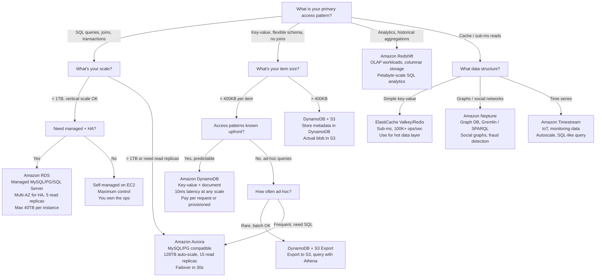
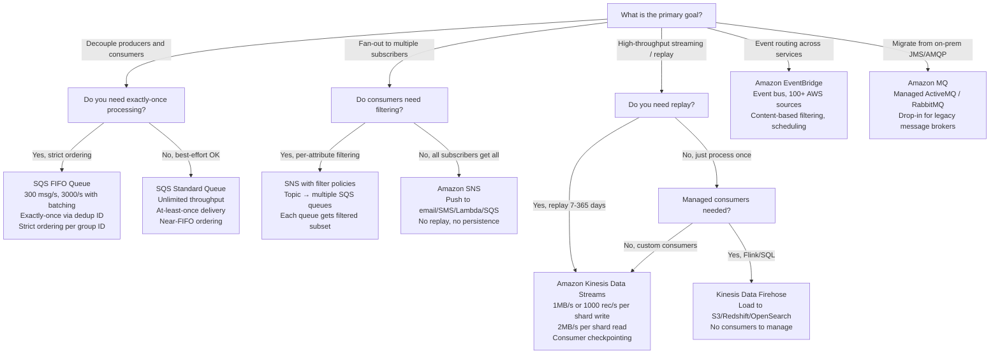
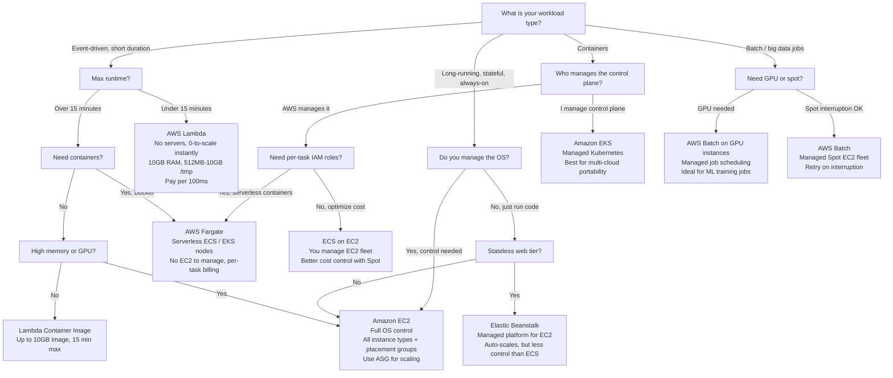
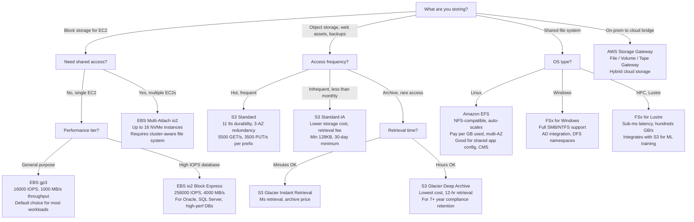
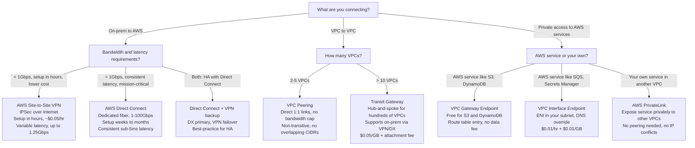

# AWS Solutions Architect Interview Master Guide

> This is the capstone guide for the entire AWS interview prep section. It covers 50 questions actually asked in Solutions Architect interviews and on the AWS SAA-C03 certification exam, organized by theme, with model answers that show the SA thought process — not just the right answer, but *why* it's right and *how* to arrive at it under pressure.

**Who this is for**: Engineers preparing for AWS SA interviews, the SAA-C03 certification, or senior engineering roles where infrastructure decisions are expected.

**How to use it**: Read the "SA thought process" first. That's the mental model. The specific service answers flow naturally once you think the right way.

---

## Section 1: Service Selection Decision Trees

These decision trees answer the "which service?" question. In an SA interview, saying "I'd use DynamoDB" is table stakes. Knowing *which* DynamoDB configuration and *why you rejected the alternatives* is what separates a candidate.

### 1.1 Which Database?



**The key insight**: Start with the access pattern, not the data shape. DynamoDB wins when you know the queries. Redshift wins when you don't.

---

### 1.2 Which Messaging Service?



**The key insight**: SQS = work queues. SNS = notifications/fan-out. Kinesis = ordered streaming with replay. EventBridge = event routing. MQ = you're migrating from existing JMS/AMQP broker.

---

### 1.3 Which Compute?



---

### 1.4 Which Storage?



---

### 1.5 Which Connectivity?



**The key insight**: VPN = quick, cheap, internet-based. Direct Connect = dedicated, consistent, expensive. VPC Peering = simple 1:1. Transit Gateway = hub for many. Gateway Endpoints = free for S3/DynamoDB. Interface Endpoints = paid but cover all AWS services.

---

## Section 2: Top 50 SA Interview Questions

### Category A: Networking (Questions 1-8)

---

#### Question 1: "Design the VPC architecture for a 3-tier web app"

**What the interviewer is really asking**: Do you think in layers? Can you identify which components need internet exposure and which don't? Do you understand blast radius?

**Wrong answer candidates give**: "I'd put everything in a public subnet for simplicity." or giving a technically correct answer without explaining *why* each layer is where it is.

**SA Thought Process**: When I hear "3-tier," I immediately think **public / private / isolated** subnet model. The web tier (ALB) is public-facing. App servers are private — they receive traffic only from the ALB, not from the internet. Database is isolated — reachable only from app servers.

**Model Answer**:

I'd design the VPC with a `/16` CIDR like `10.0.0.0/16`, spread across 2 AZs minimum (3 for production):

- **Public subnets** (`10.0.1.0/24`, `10.0.2.0/24`): ALB and NAT Gateways live here. Route table has a `0.0.0.0/0 → Internet Gateway` entry. NAT Gateways enable private instances to make outbound calls (patch downloads, third-party APIs) without being reachable inbound.

- **Private subnets** (`10.0.11.0/24`, `10.0.12.0/24`): EC2 app servers and ECS tasks live here. Route table has `0.0.0.0/0 → NAT Gateway`. No direct internet route in — traffic arrives only via the ALB. Security groups allow traffic from the ALB security group ID only.

- **Isolated DB subnets** (`10.0.21.0/24`, `10.0.22.0/24`): RDS (Multi-AZ) lives here. No route to NAT or IGW. Security groups allow traffic only from the app server security group ID. This subnet is completely dark to the internet.

- **VPC Endpoints**: I'd add Gateway Endpoints for S3 and DynamoDB (free), and Interface Endpoints for Secrets Manager and SQS if those services are used — keeps that traffic off the NAT Gateway (NAT Gateway costs $0.045/GB of data processed).

**Exam Trap**: A subnet is only "private" because it lacks an Internet Gateway route. The subnet type itself means nothing — it's the route table that matters.

---

#### Question 2: "A private EC2 needs to talk to S3 without going through the internet"

**Wrong answer**: "I'd give it a public IP." or "I'd move it to a public subnet."

**SA Thought Process**: The word "without going through the internet" is the signal. There are exactly two tools for this: **VPC Gateway Endpoint** (for S3 and DynamoDB, free) and **VPC Interface Endpoint** (for other AWS services, paid).

**Model Answer**:

Create a **VPC Gateway Endpoint for S3**. This is free — no hourly charge, no data transfer fee. Here's the exact mechanism:

1. Create a Gateway Endpoint and associate it with the route table for the private subnet.
2. AWS automatically injects a route like `pl-xxxxx (S3 prefix list) → vpce-xxxxxxxx` into the route table.
3. Traffic to S3 now routes through AWS's internal network, never leaving the AWS backbone.

Bucket policies can then enforce that *only* traffic from the VPC endpoint is allowed:
```json
{
  "Condition": {
    "StringNotEquals": {
      "aws:sourceVpce": "vpce-xxxxxxxx"
    }
  },
  "Effect": "Deny"
}
```

This is the secure pattern for HIPAA/PCI environments where you need to prove S3 data never traversed the public internet.

**Exam Trap**: Gateway Endpoints work for S3 and DynamoDB only. For Secrets Manager, SQS, or ECR — you need **Interface Endpoints** (ENIs in your subnet, with a per-hour and per-GB charge).

---

#### Question 3: "How do you connect 50 VPCs without a peering mesh?"

**Wrong answer**: "I'd set up VPC peering between each pair." (That's 1,225 peering connections for 50 VPCs — completely unmanageable.)

**SA Thought Process**: When I hear "many VPCs," I immediately think **Transit Gateway**. VPC peering is 1:1 and non-transitive. Transit Gateway is the hub-and-spoke model for scale.

**Model Answer**:

Deploy a **Transit Gateway** (TGW) in the hub account:

- Each VPC attaches to the TGW (`$0.05/hr per attachment`)
- TGW handles routing between all attached VPCs — each VPC just needs one attachment
- Route tables on the TGW control which VPCs can talk to which (you can segment dev/prod/shared-services)
- TGW also connects to on-premises via Direct Connect Gateway or Site-to-Site VPN — single connection from on-prem reaches all 50 VPCs

For a multi-account setup, **Resource Access Manager (RAM)** shares the TGW across accounts.

**Cost**: `50 VPCs × $0.05/hr = $2.50/hr` in attachments, plus `$0.02/GB` data processed. Compare that to 1,225 peering connections with no data transfer fee — TGW is more expensive per-GB but infinitely more manageable and supports transitive routing.

**Exam Trap**: VPC Peering is non-transitive. If VPC-A peers with VPC-B, and VPC-B peers with VPC-C, VPC-A cannot reach VPC-C through VPC-B. You need TGW or a full mesh.

---

#### Question 4: "You need consistent sub-5ms latency from data center to AWS"

**Wrong answer**: "I'd use a VPN with QoS settings."

**SA Thought Process**: VPNs run over the public internet — variable latency, packet loss, unreliable. The only way to guarantee consistent latency is a dedicated, private physical connection.

**Model Answer**:

**AWS Direct Connect** — a dedicated fiber connection from your data center to an AWS Direct Connect location (DX location). Key specifics:

- **Speed options**: 1Gbps, 10Gbps, 100Gbps dedicated connections. Sub-1Gbps via hosted connections through partners.
- **Latency**: Consistent since traffic never hops through the public internet.
- **Setup time**: 2-8 weeks minimum (physical fiber procurement, cross-connects, BGP peering configuration).
- **HA design**: Two DX connections from two different DX locations (or DX + VPN backup). A single DX has no SLA for the physical layer.

For sub-5ms with HA: **2x Direct Connect from different DX PoPs + Site-to-Site VPN as backup**. BGP prefers DX routes; VPN activates automatically if DX fails.

**Exam Trap**: Direct Connect itself doesn't provide encryption. For encryption over DX, you tunnel a VPN connection *through* the DX connection, or use MACsec (Layer 2 encryption) on dedicated connections.

---

#### Question 5: "An attacker is hammering your ALB with DDoS. How do you stop it?"

**Wrong answer**: "I'd add more EC2 instances behind the ALB." (That just makes the attack more expensive for you, not the attacker.)

**SA Thought Process**: Layers of defense. The question is really testing whether you know the **AWS Shield / WAF / CloudFront** stack and how each layer handles a different type of attack.

**Model Answer**:

Layered defense — the attack type determines the response:

**Layer 3/4 volumetric (UDP floods, SYN floods)**:
- **AWS Shield Standard** (free, always-on) handles this automatically for ALB/CloudFront/Route 53. Absorbs and mitigates network-level floods.
- **AWS Shield Advanced** ($3,000/month): 24/7 DDoS response team, cost protection (AWS reimburses the bill spike from DDoS traffic), enhanced attack diagnostics.

**Layer 7 application attacks (HTTP floods, slowloris)**:
- **AWS WAF** attached to the ALB. Create rate-based rules: "block any IP sending > 2,000 requests in 5 minutes." This stops HTTP floods.
- WAF managed rule groups: AWS Managed Rules block known bad IPs, SQLi, XSS automatically.
- **AWS Firewall Manager** to enforce WAF rules org-wide.

**Geographic blocking** (optional): If attack is from a specific region you don't serve, WAF geo-blocking rule.

**CloudFront in front of ALB**: Adds global edge-level DDoS absorption. The ALB becomes private, accessible only from CloudFront IPs. WAF can be attached to CloudFront.

**Exam Trap**: Shield Standard is free but only covers network-layer attacks. WAF costs money but is required to stop application-layer floods. Shield Advanced gives you DDoS cost protection — without it, a large DDoS attack can generate a massive AWS bill even if you have WAF.

---

#### Question 6: "How do NACLs and Security Groups differ? When do you use each?"

**Wrong answer**: "They're basically the same, just at different levels."

**Model Answer**:

| | Security Group | NACL |
|---|---|---|
| Level | Instance/ENI level | Subnet level |
| State | Stateful (return traffic auto-allowed) | Stateless (must explicitly allow both directions) |
| Rules | Allow only | Allow and Deny |
| Evaluation | All rules evaluated | Rules evaluated in order (lowest number wins) |
| Default | Deny all inbound, allow all outbound | Allow all inbound and outbound |

**When I use NACLs**: For an explicit subnet-level block. Classic use case: you're being attacked from a known IP range — add a NACL Deny rule to block that entire CIDR at the subnet level, regardless of what security groups say. NACLs are your "nuclear option" for blocking.

**When I use Security Groups**: For everything else. They're far easier to manage — reference other security groups by ID (e.g., "allow traffic from the ALB security group") instead of managing IP ranges. Use security groups for normal application traffic control.

**Exam Trap**: NACL rules are evaluated in order. If you add a DENY for an IP at rule 100, but there's an ALLOW at rule 50 — the ALLOW wins because 50 < 100. Always put explicit DENY rules at a *lower* number than your catch-all ALLOWs.

---

#### Question 7: "Design the DNS strategy for a multi-region application"

**SA Thought Process**: Multi-region DNS has three goals: route users to the nearest healthy region, detect region failures, failover automatically.

**Model Answer**:

Use **Route 53** with multiple routing policies stacked:

**Active-Active (both regions serve traffic):**
- **Latency-based routing**: Route 53 measures latency from the user's region and directs traffic to the lowest-latency endpoint. Users in Europe hit `eu-west-1`, users in US hit `us-east-1`.
- **Health checks on each region**: Route 53 runs health checks every 10-30 seconds. If a region fails health checks, Route 53 stops routing traffic to it.
- Combine latency routing with a **Failover record** as backup: primary = latency-based, secondary = static fallback.

**Active-Passive (one region is DR):**
- **Failover routing**: primary record = `us-east-1` ALB with health check. Secondary record = `eu-west-1` ALB. Route 53 only activates the secondary when primary health check fails.

**Global Accelerator alternative**: For non-DNS-based routing. Provides two static anycast IPs. Routes traffic to the nearest healthy endpoint using the AWS backbone. Eliminates the DNS TTL propagation delay — failover in seconds, not minutes.

**Exam Trap**: DNS TTL matters. A TTL of 300 seconds (5 minutes) means after a region fails, some clients may still send traffic there for up to 5 minutes. Route 53 health check failover updates DNS, but client caches are outside your control. Global Accelerator avoids this — routing is at the network layer, not DNS layer.

---

#### Question 8: "How does traffic actually flow from a user to your EC2 in a private subnet?"

**Model Answer** (trace the path):

1. **User's browser** resolves `api.example.com` via DNS → Route 53 returns the ALB DNS name → OS resolves ALB DNS to ALB's public IP (one of the ALB nodes' IPs).

2. **Internet → ALB**: The user's HTTP/HTTPS request hits the ALB's public IP. The ALB is in a public subnet, which has a route to the Internet Gateway. The Internet Gateway handles the NAT for the public IP.

3. **ALB → EC2**: The ALB performs health checks against the registered target group. For the matching request, it selects a healthy EC2 in a private subnet, and forwards the request to the EC2's *private IP* on the target port. The security group on the EC2 allows inbound from the ALB's security group.

4. **EC2 → ALB (response)**: The EC2 sends the response to the ALB's private IP (the ALB has ENIs in both AZ subnets). Security Groups are stateful — the return traffic is automatically allowed.

5. **ALB → User**: The ALB aggregates and returns the response to the user.

The EC2 never has a public IP — it never receives traffic directly from the internet. The ALB is the only internet-facing component.

---

### Category B: Compute & Scaling (Questions 9-16)

---

#### Question 9: "Design an auto-scaling strategy for unpredictable traffic spikes (10x in 60 seconds)"

**Wrong answer**: "I'd set up an Auto Scaling Group with a target tracking policy for CPU at 60%." (That's too slow — EC2 ASG takes 2-5 minutes to launch new instances.)

**SA Thought Process**: The key constraint is "10x in 60 seconds." No EC2-based approach can react in 60 seconds — EC2 launch time alone is 60-90 seconds, plus your bootstrap time. This is the Lambda/container pre-scaling problem.

**Model Answer**:

The 60-second constraint forces a different architecture:

**Option A: Lambda (if workload fits)**
- Lambda scales from 0 to 10,000 concurrent in seconds (burst limit: 3,000 concurrent/minute in most regions, then +500/minute).
- No warm-up, no pre-provisioning needed. Handles the spike instantly.
- Only viable if tasks are < 15 minutes and stateless.

**Option B: ECS Fargate with pre-scaling**
- For longer-running tasks. Pre-scale before known spikes using **Application Auto Scaling** with scheduled scaling.
- For unknown spikes: ECS scales slower than Lambda but faster than EC2. Set a very low scale-out threshold (CPU > 30%) to get ahead of demand.

**Option C: SQS queue + Lambda/ECS consumers**
- Put a buffer between your front-end and backend. API Gateway or ALB writes requests to **SQS**.
- Lambda consumers scale instantly based on queue depth (Lambda event source mapping polls SQS).
- Backend processing is decoupled from the spike — queue absorbs the burst.

**Exam Trap**: EC2 ASG scaling has a "cooldown period" (default 300 seconds) to prevent thrashing. During a spike, you might hit the cooldown and stop scaling before you've scaled enough. Always tune cooldown to 60-90 seconds for spike workloads, or switch to step scaling which skips cooldown on large metric jumps.

---

#### Question 10: "When do you use Lambda vs ECS vs EC2?"

**Model Answer** (the mental framework):

| Dimension | Lambda | ECS/Fargate | EC2 |
|---|---|---|---|
| Runtime limit | 15 minutes max | No limit | No limit |
| Cold start | Yes (ms to seconds) | Yes (30-60s for Fargate) | No (already running) |
| State | Stateless only | Stateless (Fargate) | Stateful OK |
| Cost model | Pay per 100ms | Pay per task/second | Pay per hour (instance running) |
| Ops overhead | Zero | Low | High |
| Networking | VPC optional | VPC native | VPC native |

**My decision framework**:
- **Lambda**: Event-driven, < 15 min, latency tolerance for cold starts is OK, stateless. Best for: API backends, event processing, scheduled jobs, file processing triggers.
- **ECS/Fargate**: Containers, no time limit, microservices, you want Docker but not EC2 management. Best for: Web services, ML inference, long-running jobs.
- **EC2**: You need OS-level control, GPU, specific hardware, persistent local storage, or need to minimize cost at very high compute density. Best for: databases (self-managed), ML training, high-performance computing.

---

#### Question 11: "A Lambda function takes 15 minutes to process. What do you do?"

**Wrong answer**: "Increase the timeout." (Lambda's maximum timeout is 15 minutes — you can't increase beyond that.)

**Model Answer**:

Three approaches, in order of preference:

**1. Break the task into smaller chunks (Step Functions)**
If the 15-minute task has logical steps, use **AWS Step Functions** to orchestrate multiple Lambda functions. Each function handles one step under 15 minutes. Step Functions passes state between them. This is the canonical answer.

**2. Move to ECS Fargate or Batch**
If the task is truly monolithic (can't be split), move it to a container. ECS Fargate tasks have no execution time limit. The trigger remains the same (SQS, EventBridge, etc.) but the compute layer can run for hours.

**3. Move to AWS Batch**
If this is a batch workload (e.g., nightly report generation, ML training), AWS Batch is purpose-built for this. It manages an EC2/Spot fleet and schedules jobs. No time limit.

**Exam Trap**: Lambda's 15-minute limit is hard. No amount of configuration increases it. This question is specifically testing whether you know that limit and can design around it.

---

#### Question 12: "How do you deploy a new version with zero downtime?"

**Model Answer** (depends on the compute layer):

**For EC2 / ALB**: **Rolling deployment** via ASG or a **Blue/Green deployment**:
- **Blue/Green**: Spin up an entirely new fleet (green) with the new version. Shift traffic from the ALB by updating the target group. If the green fleet has issues, shift traffic back to blue in seconds. No downtime, instant rollback.
- **CodeDeploy with ALB integration** automates this. It gradually shifts traffic (canary: 10% → 100%) while monitoring CloudWatch alarms. If an alarm fires, CodeDeploy automatically rolls back.

**For Lambda**: Publish a new **Lambda version** and use **Lambda aliases** with traffic shifting:
- Alias `PROD` points to version `$LATEST`. Shift traffic: `PROD = 90% v42 + 10% v43`. Watch error rates. Shift to 100% when stable.

**For ECS**: **Rolling updates** with `minimum healthy percent = 50%, maximum percent = 200%`. ECS launches new tasks, waits for them to pass health checks, then drains old tasks.

**For RDS**: Database schema changes are the hard part. Use **backward-compatible migrations** — add columns before deploying code that writes to them. Never remove columns in the same deploy as the code that stops using them.

---

#### Question 13: "Design a container orchestration strategy for 500 microservices"

**SA Thought Process**: 500 microservices means multi-team ownership, different scaling requirements, different languages, and a shared infrastructure platform. The question tests whether you think about the *operational model*, not just the technology.

**Model Answer**:

**Compute layer**: **EKS (Kubernetes)** for the control plane. At 500 services, you need the ecosystem: Helm charts, Karpenter for node autoscaling, KEDA for workload-based scaling. Fargate for EKS on less critical services to remove node management.

**Service mesh**: **AWS App Mesh** (or Istio on EKS) for service-to-service mTLS, traffic shaping, observability. At 500 services, you cannot manage individual security group rules — the mesh handles it.

**Multi-account**: **One AWS account per team or per service group** (AWS Organizations). Each team owns their EKS namespace or separate cluster. Shared services cluster (ingress, monitoring) is owned by platform team.

**Deployment**: **GitOps with ArgoCD** or **CodePipeline per service**. Each microservice has its own pipeline. Platform team provides a standard pipeline template that teams fork.

**Service discovery**: **AWS Cloud Map** for DNS-based discovery within EKS. External traffic via **ALB Ingress Controller** (one ALB per cluster, routes by hostname/path).

**Observability**: **CloudWatch Container Insights** for metrics, **X-Ray** for distributed tracing across the 500 services, **OpenSearch** for log aggregation.

---

#### Question 14: "How do you handle Lambda cold starts in a latency-sensitive application?"

**Model Answer**:

Cold starts happen when Lambda needs to initialize a new execution environment. Duration: 100ms-1s for interpreted languages (Python, Node.js), 1-5s for JVM languages (Java) on first start.

**Solutions in order of effectiveness**:

1. **Provisioned Concurrency** (the direct fix): Pre-warm a specific number of Lambda instances. They're always initialized and ready — zero cold start for those instances. Cost: ~10% more than standard Lambda pricing. Use this for latency-sensitive paths.

2. **Choose the right runtime**: Python and Node.js cold start in 100-300ms. Java cold starts in 1-5s. If latency matters, avoid JVM runtimes — or use GraalVM native compilation.

3. **Minimize initialization code**: Move heavy initialization (DB connections, config loading) outside the handler into the global scope. On warm invocations, that code doesn't re-run. Keep package sizes small — smaller zip = faster initialization.

4. **Lambda SnapStart** (Java only): Pre-initializes the JVM snapshot and restores it instead of re-initializing. Reduces Java cold starts from 5s to < 1s.

5. **Architectural pattern**: Put SQS between the API and Lambda. Callers get an immediate `202 Accepted`. Lambda processes asynchronously. Cold start doesn't affect user-perceived latency.

**Exam Trap**: Provisioned Concurrency doesn't eliminate cold starts entirely — it pre-warms a fixed number of instances. If traffic bursts beyond provisioned concurrency, new instances still cold start.

---

#### Question 15: "What's the difference between an ASG scaling policy and scheduled scaling?"

**Model Answer**:

| | Dynamic Scaling | Scheduled Scaling |
|---|---|---|
| Trigger | CloudWatch metric threshold | Time-based (cron) |
| Use case | Unknown, unpredictable traffic | Known, predictable traffic |
| Reaction time | 1-5 minutes | Proactive, runs before traffic arrives |
| Example | "Scale out when CPU > 70%" | "At 8 AM Monday, set min capacity to 20" |

**Dynamic scaling policies**:
- **Target tracking**: "Keep average CPU at 50%." ASG automatically adjusts. Simplest to configure.
- **Step scaling**: "If CPU > 60%, add 2 instances; if CPU > 80%, add 5 instances." More control, no cooldown wait.
- **Simple scaling**: Old-style. Adds fixed count, waits for cooldown. Avoid in favor of step scaling.

**The SA answer**: Combine both. Use scheduled scaling to proactively set a higher minimum before a known event (Black Friday sale, morning traffic ramp), then rely on dynamic scaling to handle variability *within* that baseline. This prevents the initial spike from hitting before dynamic scaling can react.

---

#### Question 16: "Your EC2 fleet needs to process jobs from a queue. Design the architecture"

**Model Answer**:

Classic **SQS + ASG + EC2** pattern:

```
Jobs → SQS Standard Queue → EC2 ASG (consumers) → Results to DynamoDB/S3
```

**Scaling trigger**: Use a **custom CloudWatch metric** based on `ApproximateNumberOfMessages / Running EC2 instances`. This gives you "messages per consumer" — scale out when each consumer has more than N messages, scale in when it drops.

Alternatively, **AWS Application Auto Scaling** with SQS backlog per instance metric makes this native.

**Dead Letter Queue**: Configure a DLQ on the main SQS queue. After 3-5 failed processing attempts, messages move to the DLQ. This prevents poison-pill messages from blocking the queue. Alert on DLQ depth.

**Visibility timeout**: Set to 2x your maximum job processing time. If a job takes up to 5 minutes, set visibility timeout to 10 minutes. This prevents other consumers from picking up an in-flight job before the first consumer finishes.

**Cost optimization**: Use **Spot Instances** for the consumer fleet. When Spot is interrupted, the current message becomes visible again after the visibility timeout expires and another instance picks it up. Requires idempotent job processing.

**Exam Trap**: SQS Standard queue delivers at-least-once — your processing code must be idempotent. Store a processed job ID in DynamoDB. Before processing, check if it's already been done. If yes, delete from queue and skip.

---

### Category C: Storage & Database (Questions 17-26)

---

#### Question 17: "DynamoDB or RDS — how do you choose?"

> This is the single most common database question in SA interviews. Get this answer exactly right.

**Wrong answer**: "DynamoDB is NoSQL so it's better for unstructured data." (This is the wrong framing — it's about access patterns, not data structure.)

**SA Thought Process**: I always ask: "Tell me your access patterns." Not "Tell me your data model." Access patterns determine everything.

**Model Answer**:

The decision framework in one rule: **"If you know all your queries upfront, consider DynamoDB. If you need ad-hoc SQL queries, use RDS/Aurora."**

**Choose DynamoDB when**:
- Access patterns are known and fixed (e.g., "always query by user ID + timestamp")
- You need single-digit millisecond latency at any scale (DynamoDB global tables: < 10ms anywhere)
- Scale is unpredictable or massive (DynamoDB auto-scales, no instance resizing needed)
- You need global distribution (DynamoDB Global Tables — multi-region active-active, < 1s replication)
- Serverless / event-driven architecture where you want zero operational overhead
- Schema flexibility — different items can have different attributes

**Choose RDS/Aurora when**:
- You need SQL joins across multiple entities
- Complex transactions across multiple tables (`BEGIN; UPDATE accounts; UPDATE ledger; COMMIT;`)
- Reporting queries not known in advance
- Migrating an existing relational application (DMS makes it easy)
- Team knows SQL and doesn't want to learn DynamoDB's query model

**The trap**: Choosing DynamoDB without defining access patterns first. Candidates say "I'd use DynamoDB for scale" but don't know how they'd query it. You cannot do ad-hoc queries on DynamoDB efficiently — every access pattern needs a pre-designed key or GSI.

---

#### Question 18: "How do you design a DynamoDB partition key for a social media platform?"

**SA Thought Process**: A bad partition key creates hot partitions. A hot partition limits you to 3,000 RCU and 1,000 WCU per second — the max for a single partition. If your most popular user gets more reads than that, you have a problem.

**Model Answer**:

The most common entities in a social platform and their keys:

**Users**: `PK = USER#<userId>`. Simple and effective. User reads are naturally distributed. You'll never have billions of reads on a single user ID.

**Posts**: `PK = USER#<userId>`, `SK = POST#<timestamp>`. This puts all posts by a user in the same partition (good for "get all posts by user") and allows sorting by timestamp.

**Social feed (the hard one)**: Naive design = `PK = FEED#<userId>`, `SK = POST#<timestamp>`. Problem: any write to a popular user's followers triggers fan-out. If a user has 10M followers, you'd write to 10M partitions per post.

Better design: **Pull-based feed**. Store posts from each user separately. When a user opens their feed, read from the "following" list and query each followed user's posts. Use **DAX (DynamoDB Accelerator)** to cache the hot reads. For mega-influencers (> 1M followers), pre-cache their feed.

**Hot partition mitigation**: If a specific partition key is hot (e.g., a famous user), add a random suffix to the PK (`USER#<userId>#<1-10>`) and scatter reads across 10 logical partitions. Aggregate in application code. Alternatively, use **DAX** for a 10x read throughput multiplier in front of DynamoDB.

---

#### Question 19: "How do you achieve RTO of 1 minute and RPO of 0 for a critical database?"

**SA Thought Process**: RPO = 0 means zero data loss. The only way to achieve zero data loss is **synchronous replication** — the write doesn't acknowledge until it's committed in both the primary and the replica. RTO = 1 minute means failover must be automatic and complete in 60 seconds.

**Model Answer**:

**Aurora Multi-AZ** is the right answer:

- Aurora automatically synchronously replicates 6 copies of your data across 3 AZs (2 copies per AZ). A write only succeeds when 4 of 6 copies acknowledge — this is synchronous, so RPO = 0.
- Aurora **Auto Failover** (Read Replica promotion): When the primary fails, Aurora promotes one of up to 15 read replicas to primary. Failover completes in typically **30 seconds** — within your 1-minute RTO.
- Aurora's cluster endpoint automatically updates DNS to point to the new primary after failover.

**For RDS (non-Aurora)**: Multi-AZ RDS uses synchronous block-level replication to a standby in another AZ. RPO = 0 (synchronous). Failover is ~60-90 seconds (DNS TTL + instance promotion). This is on the edge of your 1-minute RTO. Aurora is more reliable here.

**For DynamoDB**: Global Tables is always synchronous within a region. Cross-region replication is asynchronous (seconds) — so RPO is near-zero but not exactly 0 for cross-region.

**Exam Trap**: Multi-AZ standby for RDS is NOT a read replica — you cannot send read traffic to it. It's purely for HA failover. To offload reads, create additional read replicas.

---

#### Question 20: "Design a caching strategy for a database that gets 100K reads/second"

**SA Thought Process**: 100K reads/second is a lot. Even a well-tuned RDS Aurora instance maxes out around 135,000 read IOPS under ideal conditions — and that's if every read is a cache hit at the storage layer. We need application-level caching.

**Model Answer**:

**Cache-aside (lazy loading)** with **ElastiCache (Valkey/Redis)**:

```
App → ElastiCache?
  Hit: return cached value
  Miss: query RDS → store in cache with TTL → return value
```

**Cache layer design**:
- **ElastiCache cluster**: Cluster mode enabled (multiple shards for horizontal scale). Each shard handles ~100K ops/sec. For 100K reads/second with mixed cache/DB traffic, start with 3-6 shards.
- **TTL strategy**: Set TTL based on data staleness tolerance. User session data: 30 minutes. Product catalog: 1 hour. Real-time pricing: 5 seconds or no cache.
- **Cache key design**: `<entity_type>:<id>:<version>` — allows targeted invalidation by pattern.

**For read replicas**: Aurora read replicas can handle the cache-miss traffic. They don't help with the 100K/second peak (cache hit rate should be 90%+), but they handle the 10K/second cache misses distributed across 5 read replicas = 2K misses/second per replica — very manageable.

**Write strategies**:
- **Write-through**: Update cache on every write. Cache always fresh but adds write latency.
- **Write-behind (write-back)**: Write to cache, async write to DB. Lower latency but risk of data loss if cache fails.
- For financial data: write-through. For session data: either works.

---

#### Question 21: "How do you migrate a 10TB on-premises MySQL database to AWS with <1 hour downtime?"

**Model Answer**:

Use the **AWS Database Migration Service (DMS)** continuous replication approach:

**Phase 1 — Full load (no downtime yet)**:
1. Create the target Aurora MySQL cluster.
2. DMS runs a **full load** — dumps and migrates all 10TB of data. This takes hours. Source DB continues serving production traffic.
3. Enable **binary log replication** (change data capture) on the source MySQL. DMS reads the binlog and applies all changes that happened during the full load to the target.

**Phase 2 — Catch-up replication (ongoing)**:
- DMS runs in continuous replication mode. Source and target are now in near-sync (< seconds of lag).
- Monitor DMS replication lag in CloudWatch. Wait for lag to drop to < 1 second.

**Phase 3 — Cutover (< 1 hour downtime window)**:
1. Schedule maintenance window.
2. Stop writes to the source (application config change or put app in read-only mode).
3. Wait for DMS to drain the remaining lag to 0 (seconds).
4. Update application DB connection string to Aurora endpoint.
5. Validate the application is working against Aurora.
6. Total downtime: typically 5-15 minutes, well within the 1-hour window.

**Schema conversion**: Use the **AWS Schema Conversion Tool (SCT)** upfront to convert stored procedures, functions, and triggers. Not all MySQL syntax maps perfectly to Aurora — fix these incompatibilities before the cutover.

---

#### Question 22: "S3 bucket has 5 billion objects. How do you query them cost-effectively?"

**Model Answer**:

**Option A: S3 Select** (cheapest for simple queries)
- SQL-like queries against a single S3 object (CSV, JSON, Parquet).
- `SELECT * FROM s3object WHERE user_id = '12345'`
- Only scans and returns relevant data — billed per GB scanned, not full object download.
- Works at the object level, not across objects.

**Option B: Amazon Athena** (for ad-hoc SQL across many objects)
- **Serverless SQL engine** that queries S3 directly.
- Pay per TB scanned (`$5/TB`). For 5 billion objects, optimize with:
  - **Columnar format (Parquet/ORC)**: Stores data column-by-column. Queries that filter on specific columns scan only those columns — 90%+ cost reduction vs. CSV.
  - **Partitioning**: Organize S3 objects by date/region/etc. (`s3://bucket/year=2024/month=01/`). Athena uses partition pruning to skip irrelevant data.
  - **Compression (Snappy, Zstd)**: Reduces data scanned further.
- **AWS Glue Data Catalog**: Creates a schema on top of S3 objects so Athena knows how to parse them.

**Option C: S3 Inventory + Athena**
- For metadata queries (how many objects? What's the size distribution?): **S3 Inventory** generates daily/weekly CSV/Parquet manifests with object metadata. Query the inventory file with Athena for near-zero cost.

**Exam Trap**: Athena charges per bytes scanned, not per query. A full table scan of 5 billion unpartitioned CSV files would be catastrophic. Always partition + convert to Parquet before running Athena at scale.

---

#### Question 23: "Design a data lake for 1 petabyte of clickstream data"

**Model Answer**:

**Ingestion Layer**:
- Clickstream events → **Amazon Kinesis Data Streams** → **Kinesis Data Firehose** → S3 raw bucket.
- Firehose buffers, batches, and delivers records to S3 in 1-15 minute micro-batches. Can optionally convert to Parquet in-flight using AWS Glue.

**Storage Layer (S3 data lake)**:
- **Landing zone (raw)**: Exactly as received. Never modify. S3 Standard.
- **Processed zone (curated)**: Converted to Parquet, partitioned by `year/month/day/hour`. S3 Standard-IA after 30 days.
- **Aggregate zone**: Pre-computed summaries for common queries. S3 Standard.
- **Lifecycle policies**: Move raw data to S3 Glacier Instant Retrieval after 90 days, Deep Archive after 1 year.

**Processing Layer**:
- **AWS Glue ETL** for batch transformations (daily/hourly jobs). Converts raw JSON to Parquet, validates schema.
- **AWS Glue Data Catalog**: Schema registry for all S3 data. Makes data queryable by Athena, Redshift Spectrum, EMR.
- **Amazon EMR** for large-scale Spark jobs (joins across multiple petabytes, ML feature engineering).

**Query Layer**:
- **Athena**: Ad-hoc SQL for analysts. No infrastructure, pay per scan.
- **Redshift Spectrum**: Run Redshift SQL on S3 data. Blends data lake with Redshift warehouse data.

**For 1 PB**: Parquet + Snappy compression reduces raw 1PB to ~150-250GB effective. Athena queries cost = `(GB scanned) × $5/TB`.

---

#### Question 24: "How does Aurora differ from RDS? When is Aurora worth the cost?"

**Model Answer**:

**Architecture difference**: RDS runs a standard MySQL/PostgreSQL engine on an EC2 instance with EBS storage. Aurora uses a completely redesigned storage layer — a **distributed log-structured storage system** across 6 copies in 3 AZs, accessed via a storage fleet of hundreds of nodes.

| | RDS | Aurora |
|---|---|---|
| Storage | EBS (single node) | Distributed, 6 copies, 3 AZ |
| Max storage | 64TB | 128TB (auto-scales, no provisioning) |
| Read replicas | 5 | 15 |
| Failover time | 60-90 seconds | ~30 seconds |
| Replication lag | Seconds (async) | Milliseconds (shared storage) |
| Cost | Lower | ~20% more for similar instance |
| Compatibility | MySQL, PG, SQL Server, Oracle | MySQL, PostgreSQL only |

**Aurora is worth it when**:
- You need 15 read replicas (RDS maxes at 5)
- You need sub-30s failover (Aurora beats RDS Multi-AZ)
- You have read-heavy workloads (Aurora reader endpoints distribute reads across all 15 replicas)
- You want serverless variable billing (**Aurora Serverless v2** scales compute between 0.5-128 ACUs per second — pay only for what you use)
- You need cross-region read replicas (**Aurora Global Database** — 1 primary + 5 secondary regions with < 1s replication lag)

**RDS is fine when**: Budget matters more than the extra HA guarantees, or you need SQL Server/Oracle compatibility, or workloads are small and the Aurora cost premium isn't justified.

---

#### Question 25: "Your RDS is at 100% CPU. Walk me through how you diagnose and fix it"

**Model Answer** (show the diagnostic process — this tests experience):

**Step 1: Identify what's causing the CPU spike**
- **CloudWatch Metrics**: Look at `DatabaseConnections`, `ReadIOPS`, `WriteIOPS`, `ReadLatency` alongside CPU. Is it query-bound or I/O-bound?
- **Performance Insights** (enable on RDS): Shows a real-time breakdown of CPU by wait state and top SQL queries. The "Top SQL" tab shows which queries are consuming the most DB time. This is the single best tool for diagnosing RDS performance issues.

**Step 2: Address the root cause**

*If caused by a few specific queries (most common)*:
- Enable **slow query log** in RDS Parameter Group. Review queries taking > 1 second.
- Add **indexes** for missing table scans (`EXPLAIN` shows full table scans without an index).
- Rewrite inefficient queries.

*If caused by connection overload (too many connections)*:
- Use **RDS Proxy**: Pools and multiplexes connections. 1,000 application connections → 100 DB connections. Reduces CPU overhead of connection management and prevents "too many connections" errors.

*If caused by read volume*:
- Add **read replicas**. Update application to route `SELECT` queries to the reader endpoint.
- Add **ElastiCache** in front of frequent, cacheable reads.

*If caused by instance being too small*:
- **Scale up the instance** (vertical scaling). In RDS, this requires a reboot — schedule for maintenance window. Multi-AZ minimizes downtime (~60 seconds).
- Move to a **Graviton (r7g) instance** — typically 20-40% better price/performance for RDS.

**Exam Trap**: Performance Insights is the right tool. Candidates often say "I'd check CloudWatch" — CloudWatch shows THAT there's a CPU problem, but not WHY. Performance Insights shows the specific SQL causing it.

---

#### Question 26: "Design storage for a media platform storing 100M user-uploaded videos"

**Model Answer**:

**Upload path**:
- Users upload directly to **S3 via pre-signed URLs** — the upload never touches your servers. S3 can handle massive parallel uploads.
- Use **S3 Multipart Upload** for videos > 100MB. Allows parallel part uploads, automatic retry of failed parts.
- Trigger: S3 Event Notification → **Lambda** (or **SQS** → **ECS task**) for video transcoding on upload.

**Transcoding**:
- **AWS Elemental MediaConvert**: Managed video transcoding. Converts uploaded video to multiple resolutions (4K, 1080p, 720p, 480p) and formats (HLS, DASH for adaptive bitrate streaming).
- Output transcode files to a separate S3 bucket.

**Storage strategy**:
- **Raw uploads**: S3 Standard (30 days) → S3 Standard-IA (30-180 days) → S3 Glacier Instant Retrieval (180+ days). Most raw originals are never re-accessed after initial processing.
- **Transcoded files (actively served)**: S3 Standard. These are served to users.
- **S3 Intelligent-Tiering**: For any tier you're unsure about — automatically moves objects between frequent/infrequent access based on actual access patterns.

**Delivery**:
- **CloudFront** in front of S3 for video delivery. Cache popular videos at 450+ edge locations globally. Signed URLs or signed cookies to restrict access to authorized users.
- CloudFront + HLS adaptive bitrate = seamless quality switching based on user bandwidth.

**Cost at 100M videos**: At ~5GB average per video = 500 PB. S3 Standard-IA for most of it (`$0.0125/GB-month`) = ~$6M/month. Use Glacier Deep Archive for old content (`$0.00099/GB-month`) = ~$500K/month. Lifecycle policies do this automatically.

---

### Category D: Security & Compliance (Questions 27-34)

---

#### Question 27: "How do you prove compliance with SOC2 for your AWS infrastructure?"

**Model Answer**:

SOC2 is about demonstrating controls across five trust principles (security, availability, confidentiality, processing integrity, privacy). AWS gives you native tooling for most of it:

**Evidence collection**:
- **AWS Config**: Continuously records configuration state of every resource. Create Config Rules that check compliance (e.g., "is S3 server-side encryption enabled?"). Non-compliant resources get flagged.
- **AWS CloudTrail**: Every API call — who did what, when, from where. CloudTrail logs are the audit trail evidence for SOC2. Store in a separate, locked-down S3 bucket with Object Lock.
- **AWS Security Hub**: Aggregates findings from GuardDuty, Inspector, Macie into a single dashboard. Shows compliance posture against CIS AWS Foundations, PCI DSS, AWS Foundational Security Best Practices.

**Access controls (SOC2 requirement)**:
- **IAM Access Analyzer**: Identifies resources shared with external accounts.
- **AWS Organizations SCPs**: Prevent any account from disabling CloudTrail, Config, or GuardDuty.
- **IAM Identity Center (SSO)**: Enforce MFA for all human access. Provides access logs per user.

**Automated evidence**: **Audit Manager** — maps AWS evidence to SOC2 control requirements. Automatically collects evidence from Config, CloudTrail, Security Hub. Generates audit-ready reports.

**Exam Trap**: Compliance is not a one-time audit. AWS Config rules run continuously — you get near-real-time compliance status. The SOC2 auditor will ask for *ongoing* evidence over a 6-12 month period, not a point-in-time snapshot.

---

#### Question 28: "A developer accidentally made an S3 bucket public. How do you prevent this org-wide?"

**Model Answer** (this is a multi-layer defense question):

**Layer 1 — Block Public Access (BPA) at account and org level**:
- Enable **S3 Block Public Access** at the AWS account level. This overrides any bucket-level or object-level ACL that attempts to grant public access. Takes 30 seconds to enable. Do this immediately.
- Enable BPA via **Organizations SCP**: Create an SCP that denies `s3:PutBucketPublicAccessBlock` with a condition that would set `BlockPublicAcls = false`. Applies to all 200+ accounts automatically.

**Layer 2 — AWS Config Rule**:
- Create a Config Rule `s3-bucket-public-read-prohibited`. This detects any bucket that becomes public and flags it as non-compliant.
- Add **AWS Config Auto Remediation**: Lambda function that automatically re-enables BPA on the offending bucket.

**Layer 3 — AWS GuardDuty**:
- GuardDuty detects `Discovery:S3/AnomalousBehavior` — unusual public access patterns on S3. Alerts when a bucket is accessed unusually.

**Layer 4 — IAM Permission Boundary**:
- Add a permission boundary to all developer IAM roles that excludes `s3:PutBucketAcl` and `s3:PutBucketPolicy` for buckets not in an allowed list. Developers can't grant public access even if they try.

**Layer 5 — Access Analyzer**:
- **IAM Access Analyzer for S3** continuously monitors and alerts when any bucket becomes publicly accessible.

**Exam Trap**: S3 Block Public Access doesn't prevent pre-signed URLs from being shared publicly — a developer can generate a pre-signed URL that gives anyone access to a private object. That's intentional design, not a vulnerability. BPA only blocks bucket ACL/policy-based public access.

---

#### Question 29: "Design IAM strategy for 200 developers with different permission levels"

**Model Answer**:

**Foundation: AWS Organizations + Accounts**
- Separate accounts by environment (dev/staging/prod) and team. Developers never have direct prod access.
- All human access via **IAM Identity Center (SSO)** — no individual IAM users. SSO integrates with your IdP (Okta, Active Directory).

**Role-based access**:
- Define roles in IAM Identity Center: `developer-read-only`, `developer-sandbox`, `platform-admin`, `security-audit`.
- Map these to **Permission Sets** (IAM Identity Center) that map to IAM roles in each account.

**Permission sets by role**:
- **`developer-read-only`** (most developers): `ReadOnlyAccess` AWS managed policy + `CloudWatchLogs:GetLogEvents` for debugging.
- **`developer-sandbox`** (their own sandbox account): `PowerUserAccess` in their personal sandbox — full access to experiment. Zero access to shared environments.
- **`developer-staging`** (deploy to staging): Scoped policy: can deploy to specific ECS clusters and Lambda functions in staging. Cannot touch IAM, networking, or billing.
- **`platform-admin`** (platform team): `AdministratorAccess` in prod, with mandatory MFA and session recording via AWS CloudShell or Session Manager.

**Guardrails via SCPs**:
- `deny-leave-org`: No account can leave the AWS Organization.
- `deny-disable-cloudtrail`: CloudTrail cannot be disabled.
- `deny-create-iam-user`: Force all access through SSO, no IAM users.
- `deny-root-account-actions`: Root account can only be used for billing.

**Exam Trap**: SCPs are not grants — they are restrictions. An SCP that allows `"Action": "*"` does not grant permissions; it allows the principal's IAM policies to grant up to `*`. If IAM denies an action, an SCP cannot override it.

---

#### Question 30: "How do you detect if AWS credentials were leaked?"

**Model Answer**:

**Automated detection**:
- **Amazon GuardDuty**: Continuously analyzes CloudTrail logs, VPC Flow Logs, and DNS logs for anomalous patterns. Specific findings for leaked credentials:
  - `UnauthorizedAccess:IAMUser/InstanceCredentialExfiltration.OutsideAWS` — EC2 instance credentials used from an external IP.
  - `UnauthorizedAccess:IAMUser/ConsoleLoginSuccess.B` — successful console login from an unusual location.
  - `Recon:IAMUser/MaliciousIPCaller` — API calls from known malicious IPs.
- GuardDuty findings trigger **EventBridge** → **SNS** → PagerDuty/Slack alert.

**AWS-native credential scanning**:
- **AWS Secrets Manager + Macie**: If credentials are accidentally committed to S3-hosted code repos, Macie detects credential patterns.
- **GitHub/GitLab secret scanning**: Enable built-in secret scanning — GitHub automatically revokes AWS credentials that appear in public repos and notifies AWS.

**Response playbook** (for when credentials ARE leaked):
1. Immediately **deactivate the access key** in IAM (not delete — deactivate first to test impact).
2. **Attach a deny-all policy** to the compromised IAM user/role immediately.
3. Review CloudTrail for the past 90 days for all API calls made with that key.
4. Check for: new IAM users created, S3 data accessed, EC2 instances launched, Lambda functions created.
5. If credentials were EC2 instance profile: terminate the instance (credentials are tied to it).
6. Rotate all related credentials (the leaked key may have been used to access other secrets).

---

#### Question 31: "How do you manage database passwords at scale?"

**Wrong answer**: "I'd put them in environment variables." (Exposed in ECS task definitions, CloudFormation templates, Lambda console.)

**Model Answer**:

**AWS Secrets Manager** — the canonical answer:

- Store DB credentials as a secret: `{"username": "admin", "password": "..."}`.
- Application retrieves the secret at startup via Secrets Manager API. Never hardcodes credentials.
- **Automatic rotation**: Secrets Manager can automatically rotate RDS credentials on a schedule (every 30-90 days). During rotation, the old password remains valid briefly to prevent connection errors.
- **IAM-based access**: The application's IAM role has `secretsmanager:GetSecretValue` permission only for its specific secret. No developer needs to know the actual password.

**For RDS specifically**: Enable **RDS IAM Authentication** — the application generates a temporary IAM token (valid 15 minutes) instead of using a password. Zero password management, rotates automatically with IAM. Works for MySQL/PostgreSQL.

**Systems Manager Parameter Store**: Cheaper alternative. `SecureString` parameters are encrypted with KMS. No automatic rotation. Good for non-rotating secrets (API keys, config values). Free for standard parameters; $0.05/10K API calls.

**Exam Trap**: Secrets Manager costs `$0.40/secret/month` + API calls. At scale (10,000+ secrets), this adds up. Use Parameter Store for config values that don't need rotation. Use Secrets Manager for credentials that benefit from automatic rotation.

---

#### Question 32: "Design authentication for a mobile app that needs direct S3 uploads"

**Model Answer**:

**Cognito Identity Pools + S3 pre-signed URLs** — two valid approaches:

**Approach A — Cognito Identity Pool (temporary credentials)**:
1. User authenticates via **Cognito User Pool** (email/password, social login).
2. Cognito User Pool issues JWT token.
3. App exchanges JWT for **temporary AWS credentials** via **Cognito Identity Pool** (Federation).
4. Identity Pool maps the authenticated user to an IAM role.
5. IAM role has S3 access restricted to their own "folder": `s3:PutObject` on `arn:aws:s3:::my-bucket/uploads/${cognito-identity.amazonaws.com:sub}/*`
6. App uses those temporary credentials to upload directly to S3.

**Approach B — Pre-signed URLs (simpler)**:
1. User authenticates to your API.
2. API calls S3 SDK to generate a **pre-signed URL** for a specific object key. URL expires in 5-15 minutes.
3. App uploads directly to S3 using the pre-signed URL. No AWS credentials needed on the device.
4. Server-side: after upload, S3 event notification triggers Lambda to process the file.

**When to use which**:
- Pre-signed URLs: simpler, stateless, the object key is known upfront. Best for profile photo uploads, document submissions.
- Cognito Identity Pool: when the app needs ongoing AWS SDK access (multiple uploads, S3 listing, other AWS services). Higher complexity but more flexible.

**Exam Trap**: Pre-signed URLs carry the permissions of the IAM role that signed them. If your backend Lambda has `s3:*` and generates a pre-signed upload URL, the pre-signed URL can upload to any path unless you scope it to a specific key. Always generate pre-signed URLs for the *specific* destination path.

---

#### Question 33: "How do you encrypt data at rest and in transit for a PCI-DSS workload?"

**Model Answer**:

**In transit**:
- **TLS 1.2+ everywhere**: ALB enforces TLS 1.2 minimum policy. API Gateway defaults to TLS. CloudFront enforces TLS. No HTTP.
- **VPC internal traffic**: Enable TLS for RDS connections (SSL parameter). For ECS service-to-service: use **App Mesh with mTLS** — mutual TLS where both sides present certificates.
- **Direct Connect**: Traffic over DX is not encrypted by default. Tunnel a **VPN over DX** for encryption, or use **MACsec** (hardware-level encryption on dedicated DX connections).

**At rest**:
- **RDS**: Enable encryption at creation. Uses AWS KMS CMK. Snapshots, read replicas, and Multi-AZ standby are all encrypted. Note: you cannot enable encryption on an existing unencrypted RDS — you must snapshot, copy with encryption, restore.
- **S3**: Enable **S3 Default Encryption** with SSE-KMS. All objects encrypted with your KMS key. Enforce with bucket policy: `"Condition": {"StringNotEquals": {"s3:x-amz-server-side-encryption": "aws:kms"}}` → Deny if not using KMS.
- **EBS**: Enable encryption by default at the account level. All new EBS volumes encrypted. Existing volumes require snapshot + copy.
- **DynamoDB**: Encryption at rest with KMS (enabled by default). Optional: use your own KMS key instead of AWS-managed.

**Key management**:
- **AWS KMS with CMK (Customer Managed Keys)**: You control the key policy, rotation, and deletion. For PCI-DSS, use KMS with automatic annual rotation enabled.
- **CloudHSM**: If PCI-DSS requires you to own the hardware HSM (some QSAs require this). CloudHSM gives you a dedicated hardware module. More expensive, requires more operational overhead.

**Exam Trap**: KMS keys are regional. If you have a multi-region RDS with Global Database, each region needs its own KMS key, and Aurora manages cross-region re-encryption automatically.

---

#### Question 34: "A security audit found port 22 open on 50 EC2s. How do you prevent this recurring?"

**Model Answer**:

**Immediate fix** (but not sufficient long-term):
- Close port 22 on all 50 security groups. Automate with AWS CLI or SSM Automation document.

**Root cause + prevention**:

The real problem: developers needed SSH access and opened port 22 because they didn't have a better tool.

**The replacement**: **AWS Systems Manager Session Manager** — browser-based and CLI shell access to EC2 instances with NO inbound ports needed. Session Manager communicates over HTTPS outbound (from the instance to SSM). Security group with 0 inbound rules. IAM controls access instead of SSH keys.

**Prevention of future violations**:
1. **AWS Config Rule**: `ec2-security-group-ingress-restricted-ssh` — detects any security group that allows SSH (`TCP:22`) from `0.0.0.0/0` or any source. Flags as non-compliant.
2. **Config Auto Remediation**: Lambda that automatically removes the offending ingress rule.
3. **SCP**: Deny `ec2:AuthorizeSecurityGroupIngress` when `IpPermissions.FromPort = 22` — prevents anyone from adding the rule in the first place.
4. **VPC Flow Logs + GuardDuty**: GuardDuty detects `CryptoCurrency:EC2/BitcoinTool.B!DNS` and `UnauthorizedAccess:EC2/SSHBruteForce` — signs that open SSH was found and attacked.

**Exam Trap**: Session Manager requires the SSM Agent installed (pre-installed on Amazon Linux 2 and Windows AMIs) and an instance role with `AmazonSSMManagedInstanceCore`. If the instance has no role, Session Manager doesn't work even if the port is closed.

---

### Category E: Architecture & Design Patterns (Questions 35-44)

---

#### Question 35: "Design a URL shortener that handles 10 billion URLs and 100K requests/second"

**SA Thought Process**: Two operations — write (shorten) and read (redirect). Read:write ratio is massively skewed toward reads (probably 100:1). This shapes the entire architecture.

**Model Answer**:

**URL Generation**:
- Encode to 7-character base62 (`a-z`, `A-Z`, `0-9`) = 62^7 = 3.5 trillion possible URLs. More than enough for 10 billion.
- Use a **distributed ID generator** (like the Twitter Snowflake approach): 64-bit ID, convert to base62.
- Or simpler: **DynamoDB atomic counter** — each new URL increments a counter, counter value becomes the short code.

**Storage**:
- **DynamoDB**: `PK = shortCode`, attributes = `originalUrl, createdAt, userId, clickCount`.
- At 10 billion rows and ~200 bytes per item = ~2TB total. DynamoDB handles this trivially.
- Access pattern is always `GET by shortCode` — perfect for DynamoDB's key-value model.

**Read path (the critical path, 100K RPS)**:
- **CloudFront in front of everything**: Most redirects are cache hits. Popular short URLs (trending links) are served from 450+ edge locations globally. Cache TTL = 24 hours (or lower if URLs can be updated/expired).
- Cache hit rate for a URL shortener: 80-90% (the same trending URLs get clicked millions of times). CloudFront absorbs most of the 100K RPS.
- Cache miss → **Lambda@Edge** or **API Gateway + Lambda** → DynamoDB → 301 redirect.
- **ElastiCache (Redis)** in front of DynamoDB for the 10-20% CloudFront misses. Cache the `shortCode → originalUrl` mapping. TTL = 1 hour.

**Analytics**:
- Log clicks to **Kinesis Data Firehose** → S3 → Athena for analytics. Never block the redirect on analytics writes.

**Exam Trap**: A 301 redirect is permanent — browsers cache it forever. A 302 redirect is temporary — every click hits your servers. For analytics tracking, use 302 (or 307). For pure performance, use 301. This is a product decision hidden in a technical question.

---

#### Question 36: "Design a notification system that handles 10M notifications/day"

**Model Answer**:

10M/day = ~115/second average. But notifications have spikes — alert storms, marketing blasts, breaking news. Design for 10x peak = 1,150/second.

**Ingestion layer**:
- Producers (order service, alert service) publish to **Amazon SNS topics** (one topic per notification type) or **EventBridge**.

**Routing layer**:
- SNS fan-out to multiple **SQS queues** per channel (email queue, SMS queue, push queue, webhook queue).
- Each queue has independent consumers with independent scaling.

**Delivery by channel**:
- **Email**: SQS → Lambda → **Amazon SES**. SES handles SMTP, bounces, unsubscribes, deliverability. Rate limits: 14 emails/second on SES Sandbox; request production limit increase.
- **SMS**: SQS → Lambda → **Amazon SNS** (yes, SNS is also the SMS delivery service). Or **Amazon Pinpoint** for marketing SMS with templates and scheduling.
- **Push notifications (iOS/Android)**: SQS → Lambda → **Amazon SNS Mobile Push** (wraps APNs, FCM). One SNS endpoint per device token, or use topics for broadcast.
- **Webhooks**: SQS → Lambda → HTTP POST to user's endpoint with exponential backoff retry.

**Throttling and deduplication**:
- Token bucket rate limiter in ElastiCache (Redis) per user — prevent notification spam.
- DynamoDB deduplication table: store notification ID with TTL = 24 hours. Lambda checks before sending. Idempotency on retries.

**Preferences**: DynamoDB table `userId → {email: true, sms: false, push: true}`. Lambda queries before routing. Respect opt-outs.

---

#### Question 37: "How do you design for 99.999% availability on AWS?"

**SA Thought Process**: 99.999% = five nines = 5.26 minutes of downtime per year. This is extremely hard. Single-region Multi-AZ gives you ~99.99%. To get the last nine, you need multi-region.

**Model Answer**:

**Five nines requires eliminating every single point of failure**, including an entire AWS region.

**Multi-region active-active**:
- Deploy to 2 (preferably 3) AWS regions. All regions serve live traffic.
- **Route 53 latency-based routing + health checks**: Automatically routes away from a failed region in under 60 seconds (health check interval = 10s, 3 failures = 30s + DNS propagation).
- **Aurora Global Database**: Cross-region replication with < 1s lag. On failure, promote a secondary region to primary in < 1 minute.
- **DynamoDB Global Tables**: Multi-region active-active for DynamoDB. < 1s replication.

**Elimination of single-region SPOFs**:
- Multi-AZ for every stateful resource (RDS, ElastiCache, EFS).
- ALB automatically spans multiple AZs.
- ECS/ASG targets multiple AZs.
- NAT Gateway per AZ (one NAT Gateway per AZ — don't send all private subnet traffic through a single AZ's NAT).

**Chaos Engineering**: Test your multi-region failover regularly. **AWS Fault Injection Simulator (FIS)** can simulate AZ outages, region failures, and API throttling.

**Exam Trap**: 99.999% sounds achievable with Multi-AZ, but AWS's own SLAs for most services are 99.99%. The fifth nine comes from multi-region redundancy and careful dependency analysis. Identify every third-party dependency (payment processors, external APIs) — they may limit your availability regardless of your AWS architecture.

---

#### Question 38: "Design a payment processing system that's PCI-DSS compliant"

**Model Answer**:

PCI-DSS rule #1: **Minimize your cardholder data environment (CDE).** The fewer systems that touch raw card numbers, the smaller the audit scope.

**The right architecture**: Don't store raw card numbers at all. Use a **payment tokenization provider** (Stripe, Braintree, Adyen):
- User enters card details → goes directly to payment provider's iframe/SDK (never touches your servers)
- Payment provider returns a token (e.g., `tok_xxx`)
- Your API stores only the token in DynamoDB
- To charge: API calls payment provider with token + amount
- PCI scope: minimal (your servers don't touch card data)

**If you must handle card data** (rare — ISOs and payment processors):

**Network isolation**:
- **Dedicated VPC** for CDE, separate from all other workloads.
- No VPC peering to non-CDE VPCs. Use PrivateLink for specific API calls.
- All traffic logged via VPC Flow Logs.
- WAF + AWS Shield on every public endpoint.

**Encryption**:
- Card data encrypted with **CloudHSM** (hardware HSM — some QSAs require dedicated hardware). KMS for everything else.
- TLS 1.2+ mandatory. No SSLv3, TLS 1.0, TLS 1.1.

**Access control**:
- No developer has production access. Break-glass procedure with recorded session via Session Manager.
- MFA required for all human access. 90-day credential rotation.

**Audit logging**:
- CloudTrail, VPC Flow Logs, and application logs to a **separate, locked S3 bucket** with Object Lock (WORM — write once, read many). PCI requires 1 year retention, 3 months immediately available.

---

#### Question 39: "How do you handle a traffic spike from 1K to 100K requests/second in 5 minutes?"

**Model Answer**:

100x spike in 5 minutes = Lambda or pre-scaled compute. There is no way EC2 ASG can scale from 1K to 100K RPS in 5 minutes from a cold start.

**Fully serverless (recommended for extreme spikes)**:

```
CloudFront → API Gateway → Lambda → DynamoDB
```

- **CloudFront**: Caches responses at edge. If 80% of 100K RPS are for the same data, CloudFront serves 80K from cache. Lambda sees 20K RPS.
- **API Gateway**: Regional API Gateway is a fully managed, horizontally scalable entry point. Default throttle limit is 10K RPS — request a limit increase for 100K. Burst limit of 5,000 RPS in addition to the base.
- **Lambda**: Scales to thousands of concurrent functions in seconds. Concurrency limit = 1,000 by default — request a limit increase. Provisioned Concurrency eliminates cold starts for the pre-provisioned pool.
- **DynamoDB**: On-demand mode scales reads/writes automatically. No capacity planning.

**Pre-scaling for known events** (product launches, Black Friday):
- Use **Lambda Provisioned Concurrency** hours before the event. Pre-warm 1,000+ Lambda instances.
- Request temporary API Gateway and Lambda limit increases from AWS Support (takes 24-48 hours — plan ahead).
- Pre-warm CloudFront by issuing requests to the distribution before the event goes live.

**Exam Trap**: API Gateway has a default account-level throttle of 10,000 RPS. This is a soft limit — but you must request the increase proactively. On the day of a spike, you can't call Support and get it instantly.

---

#### Question 40: "Design an event-driven order processing system"

**Model Answer**:

```
Customer → API GW → Order Service → DynamoDB + EventBridge → downstream services
```

**Order lifecycle via events**:

1. `OrderPlaced` event → EventBridge
   - Rule 1 → Payment Service (SQS) — charge the customer
   - Rule 2 → Inventory Service (SQS) — reserve stock
   - Rule 3 → Notification Service (SQS) — send order confirmation

2. `PaymentSucceeded` event → EventBridge
   - Rule 1 → Fulfillment Service (SQS) — start picking + shipping
   - Rule 2 → Analytics (Kinesis Firehose) — record revenue event

3. `PaymentFailed` event → EventBridge
   - Rule 1 → Order Service — mark order as failed
   - Rule 2 → Notification Service — send payment failure notification
   - Rule 3 → Inventory Service — release reserved stock

**Why EventBridge over direct calls**:
- Order service doesn't know about payment service. Decoupled — either can change without the other.
- New downstream services subscribe without modifying order service.
- EventBridge retries on delivery failure, archives events for replay.

**Saga pattern for distributed transactions**:
- No single ACID transaction spans all services. Use the **Saga pattern**: each service has a compensating action.
- Payment charged but fulfillment fails? → Saga coordinator issues `RefundPayment` command.
- **AWS Step Functions** (standard workflow) is ideal for orchestrating sagas — has compensation logic, visual debugger.

**Exam Trap**: EventBridge delivers at-least-once. Each downstream service must be idempotent — same event processed twice must not double-charge or double-ship. Use an idempotency key (order ID + event ID) stored in DynamoDB.

---

#### Question 41: "How do you build a real-time analytics dashboard for 1M events/second?"

**Model Answer**:

**Ingestion**:
- Events → **Amazon Kinesis Data Streams** (scale shards: 1M events/sec = 1,000 shards at 1,000 records/s each, or fewer shards with aggregation).
- OR **Amazon MSK (Managed Kafka)** — better for teams already on Kafka. Kafka producers handle 1M/s on a well-provisioned cluster.

**Processing (real-time aggregation)**:
- **Amazon Kinesis Data Analytics for Apache Flink** — streaming SQL on Kinesis. Compute rolling aggregates: "events per user per minute," "error rate last 60 seconds."
- Flink windows: tumbling window (non-overlapping 1-minute buckets) or sliding window (last 5 minutes, updated every 30 seconds).
- Output aggregated metrics to ElastiCache (Redis) for the dashboard to poll, and to DynamoDB for persistence.

**Dashboard**:
- Dashboard polls ElastiCache every 1-5 seconds. Redis returns pre-computed aggregates in < 1ms.
- For true real-time push: **API Gateway WebSocket API** or **AWS AppSync subscriptions** — server pushes updates to the browser when Flink emits new aggregates.

**Historical queries**:
- Kinesis Firehose delivers raw events to S3 (1-minute batches).
- Athena queries S3 for historical analysis.
- Glue crawlers maintain the data catalog.

**Exam Trap**: "Real-time" means different things. True real-time (< 1 second) requires Kinesis + Flink + ElastiCache. Near-real-time (1-5 minutes) can use Firehose + S3 + Athena. The dashboard requirement drives the architecture choice. Clarify the SLA.

---

#### Question 42: "Design a multi-region active-active architecture"

**Model Answer**:

**Definition**: Both regions serve read AND write traffic. No region is just a standby.

**The hard problem**: Write conflicts. If User A updates their profile in us-east-1 at the same time User B updates the same profile in eu-west-1, which write wins?

**Solutions by data type**:

**Session data** (easy): Sessions are tied to a user. Route each user to one region consistently using Route 53 geolocation routing. Session writes stay in one region. ElastiCache or DynamoDB Global Tables handles replication.

**User-owned data** (medium): Assign each user a "home region" (stored in DynamoDB Global Table). Route writes for that user to their home region. Reads can go to any region (replicated). Only writes go cross-region.

**Shared mutable state** (hard): Inventory counts, financial balances — need coordination. Options:
- **Last-write-wins** (DynamoDB Global Tables default): Whichever write has the later timestamp wins. Risk of losing a conflicting write.
- **Vector clocks / CRDT**: Conflict-free replicated data types. Counters can be merged without conflicts.
- **Single-region ownership for contended data**: Inventory and financial data owned by one region. Other regions route writes to the owner. Higher latency for those writes but no conflicts.

**Traffic routing**:
- Route 53 latency-based routing + health checks.
- ALB + CloudFront in each region.
- Global Accelerator for non-HTTP traffic (anycast IP, AWS-backbone routing).

---

#### Question 43: "How do you orchestrate a complex business workflow with 20 steps?"

**Model Answer**:

**AWS Step Functions** — built exactly for this. Standard workflows for durable, auditable business processes.

**Why Step Functions over hand-rolled orchestration**:
- **Visual debugger**: See exactly which step failed, with input/output at each step.
- **Durable execution**: Workflow state persists for up to 1 year. A step can wait for a human approval (`.waitForTaskToken`) for hours or days.
- **Automatic retry with exponential backoff**: Define retry policy per step. Transient failures handled without code.
- **Compensation**: Catch errors at each step, route to compensating steps.
- **No coordination code in services**: Each service (Lambda, ECS task, SNS publish, DynamoDB write) is just a task state. Step Functions coordinates the flow.

**Standard vs. Express Workflows**:
- **Standard**: Durable, up to 1 year, exactly-once (auditing). $0.025 per 1,000 state transitions. Best for business processes.
- **Express**: High volume (100K/sec), runs up to 5 minutes, at-least-once, cheaper. Best for real-time event processing, high-throughput microservices.

**For 20 steps**: Use Standard Workflow with parallel states where steps can be concurrent:
```
Step 1 → Step 2 → [Parallel: Steps 3,4,5] → Step 6 → Choice (approve/reject) → Steps 7-20
```

**Exam Trap**: Step Functions has a payload size limit of 256KB per state transition. If you're passing large objects between steps, store the object in S3 and pass only the S3 key between steps.

---

#### Question 44: "Design a file processing pipeline for 1M PDF uploads/day"

**Model Answer**:

1M/day = ~11.5 uploads/second. Not a massive throughput problem, but files are large (PDFs can be 1-50MB) and processing is CPU-intensive.

**Upload**:
- Direct upload to S3 via **pre-signed URLs** from your API. Clients upload to `s3://uploads-bucket/pending/<userId>/<timestamp>.pdf`.
- No size limit per S3 object (up to 5TB). Multipart upload for files > 100MB.

**Trigger**:
- **S3 Event Notification** on `s3:ObjectCreated:*` → **SQS queue** (not Lambda directly — SQS decouples the trigger from processing and prevents overwhelming your processors).

**Processing fleet**:
- **ECS on Spot EC2** or **AWS Batch**: SQS → ECS tasks pick up messages. Each task:
  1. Downloads PDF from S3.
  2. Extracts text (Apache PDFBox, AWS Textract for OCR).
  3. Validates, transforms.
  4. Stores results in S3 `processed/` prefix and metadata in DynamoDB.
  5. Deletes message from SQS.
- ECS tasks scale based on SQS queue depth. AWS Application Auto Scaling policy: scale out when `(queue depth / running tasks) > threshold`.

**Textract for OCR**:
- If PDFs contain scanned images: **Amazon Textract** — managed ML service for text, tables, forms extraction. Asynchronous API for large documents (StartDocumentAnalysis → poll/webhook for completion).

**Error handling**:
- SQS DLQ: failed messages after 3 attempts go to DLQ. Alert on DLQ depth.
- CloudWatch dashboard: track processing latency, error rate, queue depth.

**Exam Trap**: Lambda has a 512MB /tmp storage limit (3GB with ephemeral storage). A 50MB PDF that expands to several hundred MB during processing may hit this limit. Use ECS with attached EBS, or download directly to memory without writing to disk.

---

### Category F: Cost Optimization (Questions 45-48)

---

#### Question 45: "Your AWS bill went from $10K to $50K/month. Walk me through how you diagnose it"

**Model Answer** (show the systematic approach):

**Step 1: Identify what changed**
- **AWS Cost Explorer**: Filter by service. Compare current month vs. previous. Identify which service increased — EC2? Data transfer? S3? NAT Gateway?
- **Cost Anomaly Detection**: AWS ML service that detects unusual spend. Should have alerted you already if configured.
- **Cost and Usage Report (CUR)**: Line-item detail for every resource. Export to S3, query with Athena. Find the specific resource IDs driving cost.

**Step 2: Common culprits (in order of likelihood)**:

- **Data transfer**: NAT Gateway charges `$0.045/GB`. An EC2 downloading 100TB from the internet via NAT Gateway = `$4,500`. Fix: S3 VPC Endpoints for S3 traffic, Interface Endpoints for other services.
- **EC2 On-Demand**: Did someone launch a fleet of `p3.16xlarge` instances for a test? Tag enforcement + budget alerts with auto-action (stop/terminate resources when budget exceeded).
- **RDS provisioned IOPS**: `io1` EBS at 30,000 IOPS costs `$4,500/month`. Downgrade to `gp3` which gives 16,000 IOPS for `$0.08/GB-month`.
- **Forgotten resources**: Dev/test environments left running. ELBs with no targets still charge `$0.008/hr`. Enable **AWS Compute Optimizer** to identify idle resources.
- **DynamoDB on-demand explosion**: On-demand DynamoDB is `$1.25/million WCU` — a runaway write loop can generate a massive bill. Set budget alerts specifically for DynamoDB.

**Step 3: Prevent recurrence**
- **AWS Budgets**: Set alerts at 80% and 100% of expected monthly cost. Action: notify SNS → PagerDuty.
- **Cost allocation tags**: Mandatory tags (`team`, `environment`, `project`) via SCP. Cost Explorer filters by tag.

---

#### Question 46: "How do you save 60% on EC2 costs?"

**Model Answer**:

The 60% number is achievable through a combination:

**Savings Plans and Reserved Instances (40-60% savings)**:
- **Compute Savings Plans**: Commit to `$X/hour` of EC2 usage for 1 or 3 years, any instance family, region, OS. AWS gives 66% off On-Demand rates. Most flexible RI option.
- **EC2 Instance Savings Plans**: Commit to a specific instance family in a region. 72% off. Less flexible but higher savings.
- **1-year No-Upfront Savings Plan**: Good balance. 3-year All-Upfront is maximum savings but ties up capital.

**Spot Instances (70-90% savings, for tolerant workloads)**:
- Spot Instances use spare EC2 capacity at 70-90% discount. Can be interrupted with 2-minute notice.
- Use for: batch jobs, ML training, CI/CD build agents, stateless web tier behind ALB (ASG with mixed instances).
- **Spot Fleet or ASG with mixed instances**: Specify multiple instance types. When one type is interrupted, ASG uses another. Rarely experience interruption if using diverse instance pool.

**Right-sizing (10-40% savings)**:
- **AWS Compute Optimizer**: Analyzes CloudWatch metrics and recommends optimal instance type. Flags instances running at < 20% CPU that could downsize.
- Migrate to **Graviton (ARM) instances**: Same workloads, 20-40% cheaper. Most modern languages (Python, Node.js, Java, Go) work on Graviton without code changes.

**Combined**: A team that right-sizes (saves 20%) + buys Savings Plans (saves 40%) + uses Spot for batch (saves 70% on batch portion) can easily exceed 60% overall savings.

---

#### Question 47: "Design S3 storage to minimize cost for compliance data (keep 7 years)"

**Model Answer**:

**Lifecycle policy design**:

| Age | Storage Class | Cost/GB/month | Notes |
|---|---|---|---|
| 0-30 days | S3 Standard | $0.023 | Active compliance period |
| 30-90 days | S3 Standard-IA | $0.0125 | Accessed occasionally for audits |
| 90-365 days | S3 Glacier Instant Retrieval | $0.004 | Rare access, ms retrieval |
| 1-7 years | S3 Glacier Deep Archive | $0.00099 | Archive, 12-hr retrieval, lowest cost |

Set these as automatic lifecycle rules. No manual action needed.

**For compliance (immutability)**:
- Enable **S3 Object Lock** in Compliance mode with `RetentionPeriod = 7 years`. Objects cannot be deleted or modified — not even by root.
- OR use **Governance mode**: Same protection but admin can override with proper IAM permissions (less strict, easier if you need to delete early in some cases).
- **MFA Delete**: Requires MFA to permanently delete objects or disable versioning. Extra layer for compliance.

**Cost estimate** (100TB over 7 years):
- Years 1-7 in Deep Archive: `100,000 GB × $0.00099 = $99/month = ~$8,300/7 years`
- Retrieval cost: 12-hour retrieval, `$0.02/GB` (Standard retrieval). Budget for retrieval on demand.

**Exam Trap**: Glacier Deep Archive has a 40KB minimum billable object size and a 180-day minimum storage duration charge. Don't use it for small, frequently-modified files — the minimum storage charge will exceed what you'd pay in Standard.

---

#### Question 48: "How do you optimize DynamoDB costs for a read-heavy workload?"

**Model Answer**:

**Option 1: DAX (DynamoDB Accelerator)**
- In-memory cache in front of DynamoDB. Read-through cache — application code change minimal.
- Reduces RCU consumption because reads are served from cache (no DynamoDB charges for cache hits).
- DAX nodes cost `$0.27-$3.79/hour`. Cost-effective if you're spending > `$500/month` on DynamoDB RCUs.
- Latency drops from ~10ms to microseconds for cached reads.

**Option 2: Switch to Provisioned + Reserved Capacity**
- On-demand pricing: `$0.25/million RCU`. Provisioned: `$0.00013/RCU-hour`.
- If your workload is predictable, provisioned is 5-10x cheaper.
- **Reserved Capacity**: Commit to 100 RCU for 1-3 years → 76% discount vs. on-demand.
- Autoscaling on provisioned capacity handles variable load within bounds.

**Option 3: Read replica via Global Tables (if multi-region anyway)**
- If you have Global Tables deployed, reads can go to any region. This doesn't save DynamoDB cost but reduces latency and spreads the load.

**Option 4: Reduce item size**
- DynamoDB charges per 4KB of read. An item that's 3.9KB = 1 RCU. An item that's 4.1KB = 2 RCUs.
- Compress large attributes (use gzip on JSON blobs stored as Binary). Separate "hot" small attributes from "cold" large attributes into a separate item or S3.

**Option 5: Projection optimization on GSIs**
- If a GSI projects all attributes (`INCLUDE ALL`), reads on the GSI read the full item. If only a few attributes are needed, specify `INCLUDE` with only those attributes — reduces RCU.

---

### Category G: DR & Operations (Questions 49-50)

---

#### Question 49: "Design DR strategy for RTO=1hr, RPO=15min. What AWS services?"

**Model Answer**:

**DR strategy selection**:

| Strategy | RTO | RPO | Cost |
|---|---|---|---|
| Backup & Restore | Hours-days | Hours | Lowest |
| Pilot Light | 30-60 min | Minutes | Low |
| Warm Standby | Minutes | Seconds | Medium |
| Active-Active | < 1 min | ~0 | Highest |

RTO=1hr, RPO=15min → **Pilot Light** is sufficient (faster than Backup & Restore, cheaper than Warm Standby).

**Pilot Light design**:
- **Primary region (us-east-1)**: Full production stack running.
- **DR region (us-west-2)**: Minimal "pilot light" — just the data replication components running 24/7.

**Data replication (achieves RPO=15min)**:
- **RDS**: Automated backups to S3 (point-in-time recovery). Cross-region automated backup copy enabled. RPO = backup interval (up to 5-minute granularity for point-in-time recovery). OR use RDS Cross-Region Read Replica for continuous replication (~seconds of lag).
- **DynamoDB**: Global Tables for automatic multi-region replication (seconds).
- **S3**: Cross-region replication (CRR) for all S3 buckets.
- **Secrets Manager**: Use cross-region replication of secrets.

**Infrastructure readiness (achieves RTO=1hr)**:
- **CloudFormation / Terraform**: All infrastructure defined as code. DR activation = run the IaC in the DR region. Estimated time: 20-45 minutes to provision EC2 ASG, ECS cluster, ALB.
- **AMI replication**: Copy production AMIs to DR region. EC2 launch time is faster with a pre-copied AMI.
- **Route 53 health check + failover routing**: When primary health check fails, Route 53 automatically routes to a failover record pointing to the DR region ALB. Propagation: < 60 seconds.

**DR activation playbook** (must be written, tested, and automated):
1. Promote RDS cross-region read replica to standalone (< 10 minutes).
2. Run CloudFormation to bring up app tier in DR region (20-30 minutes).
3. Route 53 fails over automatically (< 1 minute if health check configured).
4. Validate DR environment, notify stakeholders.

**Exam Trap**: Tested DR is completely different from untested DR. Test your DR plan quarterly. RTO/RPO claims mean nothing if your team has never actually executed the failover. AWS FIS (Fault Injection Simulator) can simulate regional failures in a controlled way.

---

#### Question 50: "How do you deploy infrastructure changes to 100 AWS accounts simultaneously?"

**Model Answer**:

**AWS CloudFormation StackSets** — purpose-built for multi-account, multi-region deployments.

**Setup**:
- **AWS Organizations integration**: StackSets deploys to organizational units (OUs) automatically. New accounts joining an OU get the StackSet deployed automatically (auto-deployment).
- **Administrator account**: Define the StackSet here (management account or a dedicated tooling account).
- **Target accounts**: Receive stack instances (one per account per region).

**Deployment with StackSets**:
```
StackSet → 100 target accounts → deploys CloudFormation stack in each
```
- **Parallelism**: `MaxConcurrentPercentage = 20%` means 20 accounts deploy simultaneously. `FailureTolerancePercentage = 5%` means up to 5 failed stacks before the rollout halts.
- **Rollback**: StackSets rolls back individual stacks on failure. The rest continue.

**For infrastructure changes that need to be immediate and coordinated**:
- **AWS Service Catalog + Organizations**: Manage a portfolio of approved CloudFormation templates. Accounts launch products from the catalog — central team updates the product definition, accounts can update or auto-update.

**For security baseline enforcement**:
- **AWS Control Tower + Customizations for Control Tower (CfCT)**: Control Tower manages the landing zone (StackSets for security controls). CfCT extends it with custom SCPs, CloudTrail config, and Config rules deployed to all accounts.

**GitOps approach**:
- Store CloudFormation templates in Git. CI/CD pipeline (CodePipeline) triggers on merge to main → runs CloudFormation StackSets API → deploys to all 100 accounts.

**Exam Trap**: StackSets require a trust relationship between the administrator account and target accounts. With AWS Organizations, this is automatic (service-managed StackSets). Without Organizations, you manually create IAM roles in each target account. At 100+ accounts, always use Organizations-integrated StackSets.

---

## Section 3: The 10 Most Common SA Interview Mistakes

### Mistake 1: Using Lambda for Everything

Lambda is powerful but has hard limits: **15-minute maximum execution time, 10GB memory, 512MB /tmp (3GB ephemeral)**. Candidates default to Lambda without asking "how long does this job run?" A 30-minute ML inference job, a 2-hour data migration, a long-running WebSocket connection — none of these work in Lambda.

**The tell**: Saying "I'd use Lambda" before asking about the workload duration or memory requirements.

**The fix**: Lead with the constraint questions. Duration, memory, state, latency sensitivity. Lambda fits once you've confirmed the constraints, not before.

---

### Mistake 2: Forgetting Multi-AZ for RDS

RDS Multi-AZ is not optional for production workloads. Without it, a single AZ failure takes down your database with no automatic recovery. Yet candidates frequently design production systems with single-AZ RDS to "keep it simple."

**The tell**: A design diagram with a single RDS instance and no mention of Multi-AZ or read replicas.

**The fix**: Every RDS instance in a production design is Multi-AZ by default. State it explicitly. "RDS Multi-AZ for synchronous replication and automatic failover in 60-90 seconds."

---

### Mistake 3: Using VPC Peering When Transit Gateway Is Needed

VPC Peering is 1:1 and non-transitive. Candidates reach for VPC Peering because it's familiar, then miss that it doesn't scale. 10 VPCs = 45 peering connections. 50 VPCs = 1,225 connections.

**The tell**: "I'd connect all the VPCs with VPC Peering" when there are more than 5-6 VPCs.

**The fix**: The threshold is roughly 5-10 VPCs. Below that, peering is fine (simpler, no additional cost per GB). Above that, Transit Gateway is the right answer.

---

### Mistake 4: Using CloudFront When Global Accelerator Is Needed (or Vice Versa)

CloudFront = CDN for HTTP/HTTPS content. It caches. It's optimized for web content and APIs. Global Accelerator = network-layer acceleration for any TCP/UDP traffic. It doesn't cache.

**The tell**: Using CloudFront for a multiplayer gaming backend, IoT device traffic, or financial API where caching is irrelevant or harmful.

**When to use Global Accelerator**: Non-HTTP protocols (UDP, gaming), scenarios where caching would be wrong (real-time data, unique per-user responses), or when you need static anycast IPs (CloudFront uses DNS, Global Accelerator gives you two static IPs).

---

### Mistake 5: Treating SCPs as IAM Grants

Service Control Policies (SCPs) are **restrictions**, not grants. An SCP that says `"Effect": "Allow", "Action": "*"` does not grant any permissions — it simply doesn't restrict them. IAM policies still govern what the principal can actually do.

**The tell**: "I'd create an SCP to allow developers to access EC2."

**The fix**: SCPs define the maximum permissions possible in an account. You still need IAM policies for the actual grant. SCPs are used to restrict, not to grant.

---

### Mistake 6: Choosing DynamoDB Without Defining Access Patterns First

DynamoDB requires you to define your access patterns upfront because secondary indexes must be designed at table creation time. A developer who says "I'd use DynamoDB for this social app" without knowing how they'll query the feed, search users, or paginate results will end up with an unqueryable table.

**The tell**: "I'd put everything in DynamoDB" without answering "how do you query it?"

**The fix**: Before choosing DynamoDB, list every query the application makes. Only then design the partition key, sort key, and GSIs. If you can't list the queries, use RDS where you can write ad-hoc SQL.

---

### Mistake 7: Not Considering Cost in Architecture Decisions

Great architecture is the intersection of performance, reliability, AND cost. Candidates design five-nines architectures for features that don't need it — three read replicas, multi-region active-active, Provisioned Concurrency on every Lambda, io2 EBS everywhere.

**The tell**: A design that maximizes every dimension without justifying the cost.

**The fix**: Always state your cost trade-offs. "I'm recommending gp3 EBS instead of io2 because the workload's IOPS requirement is 8,000, well within gp3's 16,000 IOPS limit at a fraction of the cost."

---

### Mistake 8: Forgetting That NAT Gateway Costs Money per GB

NAT Gateway is often treated as a "free" routing component. It is not. NAT Gateway charges `$0.045/GB` of processed data. An EC2 instance downloading 100TB of updates through NAT Gateway = `$4,500`. A microservices mesh routing 10TB/day through NAT Gateway = `$135,000/month`.

**The fix**: Use VPC Endpoints for AWS service traffic (S3, DynamoDB — free; others — Interface Endpoint at `$0.01/GB`, still cheaper than NAT). Design traffic flows to minimize cross-zone NAT traffic.

---

### Mistake 9: Forgetting That Direct Connect Requires Dedicated Fiber (Not Instant)

Candidates propose Direct Connect as the solution for "we need a private connection to AWS" without realizing the operational lead time. Direct Connect requires physically ordering a cross-connect at a DX location or working with a DX partner. This takes **2-8 weeks minimum**, sometimes months for fiber provisioning.

**The fix**: If you need connectivity now, start with VPN. Order Direct Connect in parallel for the long-term solution. Design the transition: VPN as backup when DX is live, VPN as primary while DX is being provisioned.

---

### Mistake 10: Choosing OpenSearch When Athena+S3 Would Work at a Fraction of the Cost

Amazon OpenSearch Service (managed Elasticsearch) is powerful but expensive — you pay for always-on EC2 nodes (typically `$200-$2,000+/month` for production clusters). Candidates reach for it whenever they need search or analytics.

**The fix questions**:
- Do you need sub-second query latency? If no, Athena + S3 is `$5/TB scanned` — far cheaper for infrequent queries.
- Do you need full-text search with ranking? Yes → OpenSearch.
- Do you need log analytics with Kibana dashboards? CloudWatch Logs Insights is cheaper for AWS-native logs.
- Do you need to query structured data? Athena.

Only choose OpenSearch when you need: full-text search with relevance ranking, vector search (k-NN), or Kibana/OpenSearch Dashboards with near-real-time log streaming.

---

## Section 4: The SA Mental Framework

Every Solutions Architect brings the same 5 questions to every design problem, regardless of the specific service question being asked:

### Question 1: What's the SLA?

**Why it matters**: SLA determines the architecture's complexity tier.

- 99.9% = 8.7 hours/year downtime. Single-region Multi-AZ.
- 99.99% = 52 minutes/year. Multi-AZ + aggressive health checks + auto-recovery.
- 99.999% = 5 minutes/year. Multi-region active-active.
- "Best effort" = Single-AZ is fine for non-critical workloads.

Also ask: **latency SLA** (p50 vs. p99 matters), **data durability** (11 nines for S3, less for others), **RPO/RTO** for disaster scenarios.

### Question 2: What's the Data Access Pattern?

**Why it matters**: Access patterns determine storage service choice more than anything else.

Ask:
- Read-heavy or write-heavy? (Read-heavy → caching, read replicas)
- Random access or sequential? (Random → DynamoDB/SSD; sequential → S3/Glacier)
- What queries run? (Known, fixed → DynamoDB; ad-hoc SQL → RDS/Athena; full-text → OpenSearch)
- What's the read:write ratio? (100:1 → aggressive caching layer)
- What's the item/object size? (DynamoDB max 400KB; S3 unlimited)

### Question 3: What's the Scale?

**Why it matters**: Scale drives the difference between a simple single-instance solution and a distributed system.

Ask:
- Current requests per second? Expected in 3-5 years?
- Data volume today and growth rate?
- Peak-to-average ratio? (10x peaks need very different architecture than 1.2x)
- Geographic distribution? (Users in one region vs. globally)
- Concurrency? (How many simultaneous users/sessions?)

### Question 4: What are the Compliance Requirements?

**Why it matters**: Compliance constraints restrict your architecture choices and require specific AWS services.

| Regulation | Key Constraints |
|---|---|
| PCI-DSS | No raw card data unless absolutely necessary; dedicated CDE VPC; CloudHSM for some QSAs |
| HIPAA | Business Associate Agreement (BAA) with AWS; encryption everywhere; audit logs |
| SOC2 | CloudTrail, Config, GuardDuty mandatory; 1 year log retention |
| GDPR | Data residency (specific regions only); right to erasure (can DynamoDB delete really delete?) |
| FedRAMP | AWS GovCloud regions only; specific service restrictions |

### Question 5: What's the Budget?

**Why it matters**: The best architecture is the cheapest one that meets the SLA. Never over-engineer.

Ask:
- What's the monthly budget for this service?
- Is this a cost-sensitive startup or an enterprise where reliability > cost?
- Are Savings Plans/Reserved Instances already purchased?
- Is Spot viable? (Tolerates interruption?)
- What's the cost of downtime? (Justifies the HA cost?)

---

## Section 5: AWS Service Number Cheat Sheet

Memorize these for certification and interviews. An SA who can quote these numbers builds credibility instantly.

### Lambda
| Parameter | Limit |
|---|---|
| Max execution time | **15 minutes** |
| Max memory | **10 GB** |
| /tmp storage | **512 MB** default, **10 GB** with ephemeral storage |
| Default concurrent executions | **1,000** (per account, per region — soft limit) |
| Burst concurrency | **3,000/minute** (us-east-1, us-west-2, eu-west-1), **500/minute** elsewhere |
| Deployment package (zip) | **50 MB** compressed, **250 MB** unzipped |
| Container image | **10 GB** |
| Payload (sync) | **6 MB** request + **6 MB** response |
| Payload (async) | **256 KB** |

### S3
| Parameter | Limit |
|---|---|
| Max object size | **5 TB** |
| Min object size (Glacier IA billing) | **128 KB** minimum billable |
| PUT/COPY/POST/DELETE | **3,500 requests/second per prefix** |
| GET/HEAD | **5,500 requests/second per prefix** |
| Multipart upload recommended at | **> 100 MB** |
| Multipart upload required at | **> 5 GB** (max single PUT is 5 GB) |
| Durability | **11 nines (99.999999999%)** |

### DynamoDB
| Parameter | Limit |
|---|---|
| Max item size | **400 KB** |
| Max partition throughput | **3,000 RCU** and **1,000 WCU** per partition |
| Max partition size | **10 GB** |
| GSIs per table | **20** (default) |
| LSIs per table | **5** |
| Read consistency | **Strongly consistent** = 2x the RCU of eventually consistent |
| Global Table replication lag | **< 1 second** typical |
| DynamoDB Streams retention | **24 hours** |

### SQS
| Parameter | Limit |
|---|---|
| Max message size | **256 KB** |
| Standard queue throughput | **Unlimited** |
| FIFO queue throughput | **3,000 msg/s** with batching, **300 msg/s** without |
| Max visibility timeout | **12 hours** |
| Max retention | **14 days** (default 4 days) |
| Long polling wait time | Up to **20 seconds** |
| Max batch size | **10 messages** |

### Kinesis Data Streams
| Parameter | Limit |
|---|---|
| Write per shard | **1 MB/s** or **1,000 records/s** (whichever is lower) |
| Read per shard | **2 MB/s** (shared across all consumers) |
| Enhanced fan-out read | **2 MB/s per consumer** per shard |
| Default shard limit | **500 per region** (soft limit) |
| Data retention | **24 hours** default, up to **365 days** |
| Max record size | **1 MB** |

### RDS & Aurora
| Parameter | RDS | Aurora |
|---|---|---|
| Max storage | **64 TB** (gp3/io1) | **128 TB** (auto-scales) |
| Read replicas | **5** | **15** |
| Multi-AZ failover | **60-90 seconds** | **~30 seconds** |
| Automated backup retention | **35 days** max | **35 days** max |
| Cross-region read replica lag | **Seconds** | **< 1 second** (Global Database) |
| Point-in-time recovery granularity | **5 minutes** | **5 minutes** |

### EC2 Networking
| Parameter | Limit |
|---|---|
| Baseline network (most instances) | **Up to 25 Gbps** (depends on instance type) |
| Cluster placement group | **Up to 100 Gbps** (enhanced networking + placement group) |
| Security groups per ENI | **5** (default) |
| Rules per security group | **60 inbound + 60 outbound** (default) |

### CloudFront
| Parameter | Limit |
|---|---|
| Edge locations | **450+** globally |
| TTL range | **0 to 31,536,000 seconds** (0 = no cache) |
| Max cache object size | **30 GB** |
| Price class | Price Class 100 (cheapest, fewer edges) to All (most edges) |

### ALB / NLB
| Parameter | ALB | NLB |
|---|---|---|
| Protocol | **HTTP/HTTPS/gRPC** | **TCP/UDP/TLS** |
| Connection | **HTTP layer 7** | **Network layer 4** |
| Timeout | **60 seconds** (max configurable) | **350 seconds** (TCP) |
| Target types | EC2, IP, Lambda | EC2, IP, ALB |
| Static IP | No (DNS only) | **Yes (per AZ)** |

### EBS
| Volume Type | Max IOPS | Max Throughput | Use Case |
|---|---|---|---|
| gp3 | **16,000 IOPS** | **1,000 MB/s** | General purpose, default choice |
| gp2 | 16,000 IOPS | 250 MB/s | Legacy, prefer gp3 |
| io2 | **64,000 IOPS** (256K with Block Express) | **4,000 MB/s** | High-performance databases |
| st1 | 500 IOPS | **500 MB/s** | Throughput-optimized HDD, big data |
| sc1 | 250 IOPS | 250 MB/s | Cold HDD, lowest cost |
| Max volume size | — | — | **64 TB** (io2 BE), **16 TB** (others) |

---

## Final Checklist: Before You Walk Into an SA Interview

**Technical preparation**:
- [ ] Can you draw the 5 decision trees from Section 1 from memory?
- [ ] Can you answer "which database?" in < 30 seconds with a clear framework?
- [ ] Do you know the difference between SQS, SNS, EventBridge, and Kinesis and when to use each?
- [ ] Can you design a 3-tier VPC architecture on a whiteboard in 5 minutes?
- [ ] Do you know the Lambda limits cold (15 min, 10GB, 1K concurrency)?
- [ ] Can you explain Active-Active vs. Pilot Light DR and when each is appropriate?

**SA mindset preparation**:
- [ ] Practice asking the 5 SA questions (SLA, access pattern, scale, compliance, budget) before answering any design question
- [ ] Practice saying "the wrong answer would be X, and here's why" — shows senior-level thinking
- [ ] Prepare 2-3 real examples from your own experience applying these patterns
- [ ] Know the cost dimensions of every service you mention (shows operational maturity)

**What separates candidates**:
- A junior candidate names the right service.
- A mid-level candidate names the right service and explains *why*.
- A senior SA names the right service, explains why, names two alternatives they rejected and *why they rejected them*, and mentions the cost trade-off.

The SA interview is not a test of knowledge. It is a test of judgment.

---

*Related articles: [VPC Networking](./vpc-networking) · [DynamoDB](./dynamodb-nosql) · [RDS & Aurora](./rds-databases) · [Lambda & Serverless](./lambda-serverless) · [Disaster Recovery](./disaster-recovery) · [IAM Roles & Policies](./iam-roles-policies) · [SQS / SNS / EventBridge](./sqs-sns-eventbridge) · [Well-Architected Framework](./aws-well-architected)*
