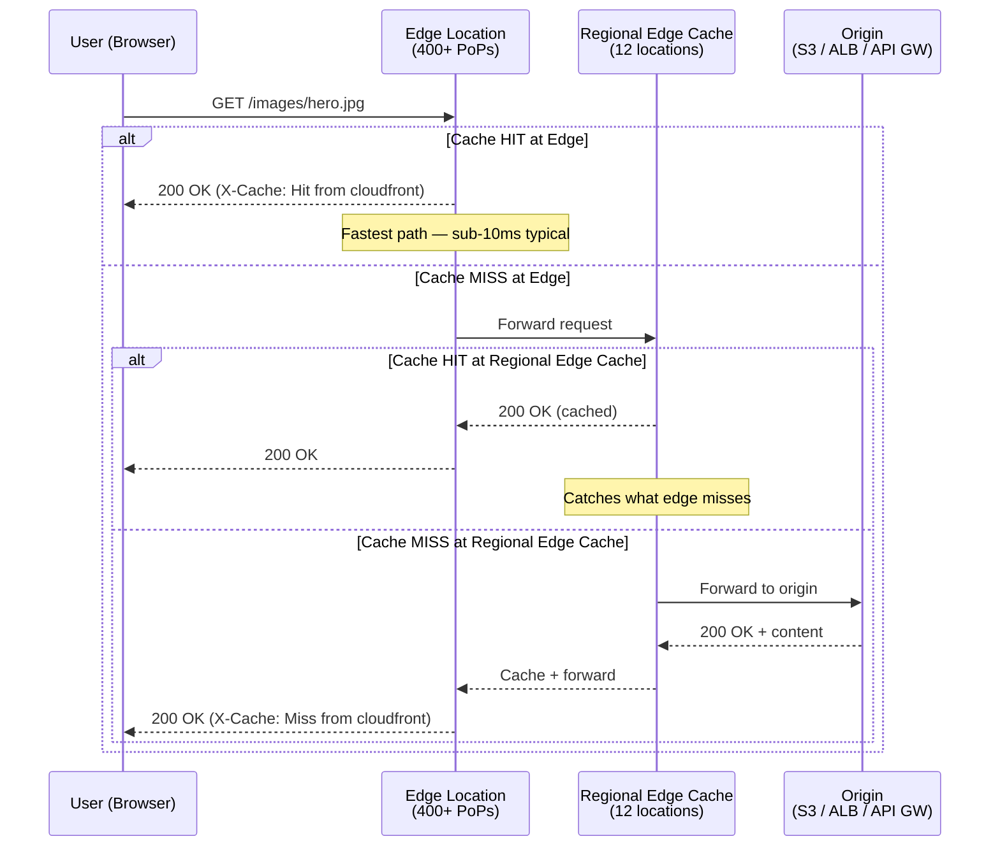
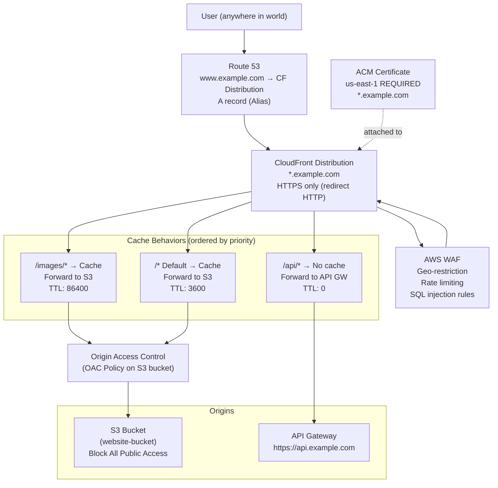
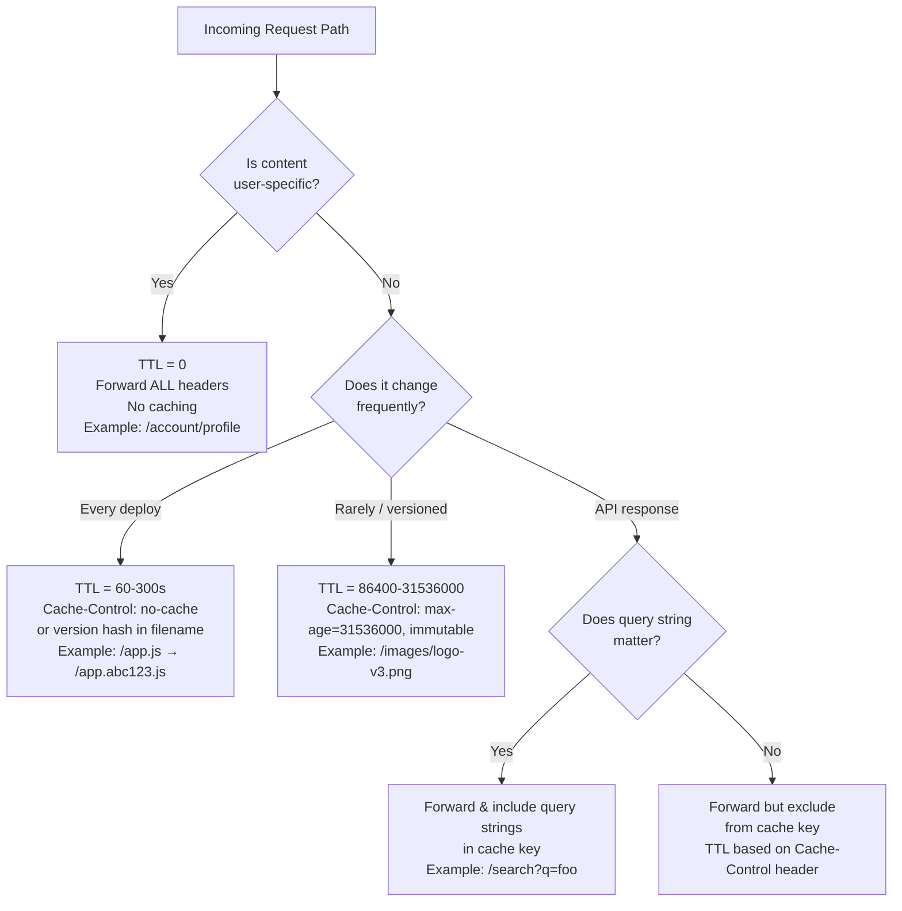

# AWS CloudFront: CDN, Caching, and Global Content Delivery

> **Common Interview Questions**: "How does CloudFront work, and how is it different from S3 Transfer Acceleration?" / "You need to serve dynamic API responses from CloudFront — what are the caching considerations?" / "How do you restrict S3 bucket access so only CloudFront can read it?" / "Design a global static website with custom domain, HTTPS, and geo-restriction."

Common in: AWS Solutions Architect, Senior Backend, Platform Engineering, and AWS SAA/SAP certification exams

---

## Quick Answer (30-second version)

- **CloudFront** = AWS's global CDN with 400+ edge locations. Caches content close to users, reducing latency and origin load.
- **CloudFront vs S3 Transfer Acceleration**: CF caches at the edge for reads. S3TA accelerates uploads to S3 over AWS backbone — different problems.
- **Origin Access Control (OAC)** = The right way to make S3 buckets private while allowing only CloudFront access (replaces the older OAI).
- **Cache Behaviors** = URL path pattern rules that say "requests matching `/api/*` → don't cache, requests matching `/images/*` → cache 30 days."
- **Lambda@Edge** = Run Node.js at CloudFront's regional edge caches (4 trigger points). For complex logic: A/B testing, auth, request rewriting.
- **CloudFront Functions** = Run JS at every edge location (viewer request/response only). For simple logic: redirects, header manipulation. 10x cheaper than Lambda@Edge.
- **Signed URLs** = Time-limited access to one specific file. **Signed Cookies** = Time-limited access to many files (streaming, paywalled content).
- **Cache invalidation**: `/*` wildcard clears everything. First 1,000 paths/month free, then $0.005 per path.

---

## Why This Matters / The Thought Process

When an interviewer asks about CloudFront, they're testing whether you understand **the layers of content delivery** and can make the right trade-offs between caching aggressiveness, freshness, and cost.

The real questions behind the question:

- Do you know that edge location, regional edge cache, and origin form a 3-tier hierarchy — and that a cache miss at the edge hits the regional cache first, not origin?
- Can you reason about when to cache vs when to always hit origin (dynamic user-specific content)?
- Do you understand that OAC is not just a best practice — it's the current recommended approach, and OAI is legacy?
- Do you know the cost model? CloudFront isn't free — data transfer out to internet is charged. The value is that you pay less for compute at origin because fewer requests hit it.

Think like an SA: Every request that hits your origin instead of a CloudFront edge is a request that costs you compute, database queries, and latency. The question is never "should I use CloudFront?" for public content — it's "what's the right cache strategy?"

**The mental model that trips people up**: CloudFront is not just for static content. It's a programmable global proxy. You can route different paths to different origins, transform requests and responses, implement auth, do A/B testing — all before the request ever hits your origin.

---

## Architecture: CloudFront Request Flow



---

## Architecture: Global Static Website (S3 + CloudFront + Route53 + ACM)



---

## Decision Framework: What Cache Behavior to Apply?



---

## Core Concept: Origin Access Control (OAC) vs OAI

This is a frequent exam and interview question. OAC is the **current recommended** approach.

| Feature | OAI (Legacy) | OAC (Current) |
|---|---|---|
| S3 SSE-KMS support | No | Yes |
| All S3 regions | Mostly | All |
| POST/PUT/DELETE to S3 | No | Yes |
| AWS Signature Version | v2 (outdated) | v4 |
| Recommendation | Migrate away | Use this |

**How OAC works**: CloudFront signs requests to S3 using AWS SigV4. The S3 bucket policy grants access only to the specific CloudFront distribution's service principal — no public access needed.

The S3 bucket policy with OAC:

```json
{
  "Version": "2012-10-17",
  "Statement": [
    {
      "Sid": "AllowCloudFrontServicePrincipal",
      "Effect": "Allow",
      "Principal": {
        "Service": "cloudfront.amazonaws.com"
      },
      "Action": "s3:GetObject",
      "Resource": "arn:aws:s3:::my-website-bucket/*",
      "Condition": {
        "StringEquals": {
          "AWS:SourceArn": "arn:aws:cloudfront::123456789:distribution/EDFDVBD6EXAMPLE"
        }
      }
    }
  ]
}
```

**The trap**: Many candidates say "make the S3 bucket public." Wrong. Block All Public Access should be ON. CloudFront accesses it privately via OAC.

---

## Core Concept: Lambda@Edge vs CloudFront Functions

This trips up even experienced engineers.

| | CloudFront Functions | Lambda@Edge |
|---|---|---|
| Trigger points | Viewer Request, Viewer Response | Viewer Request, Viewer Response, Origin Request, Origin Response |
| Execution location | All 400+ edge PoPs | 13 regional edge locations |
| Max execution time | 1ms | 5s (viewer), 30s (origin) |
| Memory | 2MB | 128MB–10GB |
| Network access | No | Yes |
| Pricing | $0.10/million | $0.60/million + duration |
| Use case | Header manipulation, URL rewrites, simple A/B | Auth, dynamic routing, request body inspection |
| Runtime | CloudFront JS (limited) | Node.js, Python |

**When to use CloudFront Functions**:
- Add security headers (Strict-Transport-Security, X-Frame-Options)
- Normalize URL before caching (lowercase, remove trailing slash)
- Simple A/B test via cookie (just set a cookie — don't need the logic)
- Redirect HTTP to HTTPS at edge (though CF does this natively)

**When to use Lambda@Edge**:
- Validate JWT at the edge before hitting origin
- Dynamic origin selection based on device type or geography
- Request body transformation
- Fetch from DynamoDB to personalize response

**The 4 trigger points** (draw this on the whiteboard):

```
User → [Viewer Request] → CloudFront → [Origin Request] → Origin
User ← [Viewer Response] ← CloudFront ← [Origin Response] ← Origin
```

Viewer triggers: Can't see origin response, can't make network calls (CF Functions). Good for lightweight request/response manipulation.

Origin triggers: Lambda@Edge only. Runs at regional edge cache, has network access. Good for complex routing, cache key manipulation.

---

## Core Concept: Signed URLs vs Signed Cookies

Both restrict access to CloudFront content. Choose based on scope.

| | Signed URL | Signed Cookie |
|---|---|---|
| Scope | Single file | Multiple files |
| Use case | One-time download link, single video | Video streaming (multiple segments), paywalled site section |
| URL structure | Modified URL with signature params | `CloudFront-Policy`, `CloudFront-Signature`, `CloudFront-Key-Pair-Id` cookies |
| RTMP (legacy) | Yes | No |
| Practical example | "Download your invoice PDF" | "Netflix subscriber watching a show" |

**Netflix example**: A show has thousands of video segments (`.ts` files in HLS). You can't sign each URL individually. You sign one cookie that grants access to `/shows/breaking-bad/*` for the next 4 hours.

**Signed URL generation (Node.js)**:

```js
const { CloudFrontClient, GetDistributionCommand } = require('@aws-sdk/client-cloudfront');
const { getSignedUrl } = require('@aws-sdk/cloudfront-signer');
const fs = require('fs');

function generateSignedUrl(key, expirySeconds = 3600) {
  // Private key from CloudFront key pair (stored in Secrets Manager)
  const privateKey = fs.readFileSync('/path/to/private-key.pem', 'utf8');

  const url = `https://d1234example.cloudfront.net/${key}`;
  const dateLessThan = new Date(Date.now() + expirySeconds * 1000).toISOString();

  const signedUrl = getSignedUrl({
    url,
    keyPairId: 'K2JCJMDEHXQW5F',  // from CloudFront key group
    dateLessThan,
    privateKey,
  });

  return signedUrl;
}

// Usage: share a private report
const downloadLink = generateSignedUrl('reports/user-123/invoice-2024.pdf', 300);
// Link expires in 5 minutes
```

---

## Cache Behaviors Deep Dive

Cache behaviors are evaluated in **priority order** (lower number = higher priority). Default behavior is always last (catches everything not matched).

```
Priority 0:  /api/*          → Origin: API Gateway, TTL: 0, no caching
Priority 1:  /assets/v*/*    → Origin: S3, TTL: 31536000 (1 year, versioned files)
Priority 2:  /images/*       → Origin: S3, TTL: 86400 (24h)
Priority 3:  /admin/*        → Origin: ALB, Restrict viewer access: signed cookies
Default:     /*              → Origin: S3, TTL: 3600 (1h)
```

**Query string caching — the gotcha**: By default, CloudFront strips query strings and doesn't include them in the cache key. This means `/search?q=foo` and `/search?q=bar` return the same cached response. You must explicitly configure which query strings to include in the cache key.

**Cache-Control headers from origin override TTL settings** when you configure behaviors to "use origin cache headers." The hierarchy:

1. CloudFront behavior minimum TTL: if origin says `max-age=0`, CF enforces the minimum.
2. CloudFront behavior maximum TTL: if origin says `max-age=999999`, CF caps it.
3. CloudFront behavior default TTL: used when origin sends no Cache-Control header.

---

## Cache Invalidation

**When to invalidate**:
- Emergency fix deployed to production (bugs, security issues)
- Content that couldn't be versioned (like `index.html`)
- User uploaded content that replaced an existing file at same key

**What NOT to do**: Invalidate on every deploy. Instead, use **cache-busting through filename versioning**:
- Bad: `/app.js` → deployed new version → invalidate `/app.js`
- Good: `/app.abc123.js` → deploy `/app.def456.js` → update `index.html` reference → no invalidation needed

**Invalidation cost**:
- First 1,000 invalidation paths per month: free
- After that: $0.005 per path
- `/images/*` = 1 path (wildcard counts as 1)
- `/images/hero.jpg`, `/images/logo.png` = 2 paths

**AWS CLI invalidation**:

```bash
# Invalidate specific files
aws cloudfront create-invalidation \
  --distribution-id EDFDVBD6EXAMPLE \
  --paths "/index.html" "/app.js"

# Invalidate everything (one path = one charge)
aws cloudfront create-invalidation \
  --distribution-id EDFDVBD6EXAMPLE \
  --paths "/*"

# Wait for invalidation to complete (takes 1-5 minutes typically)
aws cloudfront wait invalidation-completed \
  --distribution-id EDFDVBD6EXAMPLE \
  --id I2J0I21PCUYOIK
```

---

## Code Example: Full Terraform — CloudFront + S3 + OAC

```hcl
# cloudfront-s3-website.tf

# S3 bucket — block all public access
resource "aws_s3_bucket" "website" {
  bucket = "my-global-website-${var.environment}"
}

resource "aws_s3_bucket_public_access_block" "website" {
  bucket = aws_s3_bucket.website.id

  block_public_acls       = true
  block_public_policy     = true
  ignore_public_acls      = true
  restrict_public_buckets = true
}

# ACM Certificate — MUST be in us-east-1 for CloudFront
# If your Terraform provider is in another region, use a separate provider
provider "aws" {
  alias  = "us_east_1"
  region = "us-east-1"
}

resource "aws_acm_certificate" "website" {
  provider          = aws.us_east_1
  domain_name       = "www.example.com"
  validation_method = "DNS"

  subject_alternative_names = ["example.com", "*.example.com"]

  lifecycle {
    create_before_destroy = true
  }
}

# CloudFront Origin Access Control (OAC) — replaces OAI
resource "aws_cloudfront_origin_access_control" "website" {
  name                              = "website-oac"
  origin_access_control_origin_type = "s3"
  signing_behavior                  = "always"
  signing_protocol                  = "sigv4"
}

# CloudFront Distribution
resource "aws_cloudfront_distribution" "website" {
  enabled             = true
  is_ipv6_enabled     = true
  default_root_object = "index.html"
  aliases             = ["www.example.com", "example.com"]
  price_class         = "PriceClass_100"  # US/Europe/Canada only (cheapest)
  # PriceClass_200 = adds Asia/ME/Africa
  # PriceClass_All = all edge locations (most expensive)

  # S3 Origin
  origin {
    domain_name              = aws_s3_bucket.website.bucket_regional_domain_name
    origin_id                = "S3-website"
    origin_access_control_id = aws_cloudfront_origin_access_control.website.id
  }

  # API Gateway Origin
  origin {
    domain_name = "${aws_api_gateway_rest_api.main.id}.execute-api.us-east-1.amazonaws.com"
    origin_id   = "APIGateway"

    custom_origin_config {
      http_port              = 80
      https_port             = 443
      origin_protocol_policy = "https-only"
      origin_ssl_protocols   = ["TLSv1.2"]
    }
  }

  # Cache behavior for API — NO caching
  ordered_cache_behavior {
    path_pattern     = "/api/*"
    target_origin_id = "APIGateway"
    allowed_methods  = ["DELETE", "GET", "HEAD", "OPTIONS", "PATCH", "POST", "PUT"]
    cached_methods   = ["GET", "HEAD"]

    forwarded_values {
      query_string = true
      headers      = ["Authorization", "Origin", "Accept"]
      cookies {
        forward = "all"
      }
    }

    viewer_protocol_policy = "https-only"
    min_ttl                = 0
    default_ttl            = 0
    max_ttl                = 0
  }

  # Cache behavior for versioned assets — long TTL
  ordered_cache_behavior {
    path_pattern     = "/assets/v*/*"
    target_origin_id = "S3-website"
    allowed_methods  = ["GET", "HEAD", "OPTIONS"]
    cached_methods   = ["GET", "HEAD"]

    forwarded_values {
      query_string = false
      cookies { forward = "none" }
    }

    viewer_protocol_policy = "redirect-to-https"
    min_ttl                = 0
    default_ttl            = 31536000  # 1 year
    max_ttl                = 31536000
    compress               = true      # Gzip/Brotli compression
  }

  # Default behavior — moderate TTL
  default_cache_behavior {
    target_origin_id = "S3-website"
    allowed_methods  = ["GET", "HEAD", "OPTIONS"]
    cached_methods   = ["GET", "HEAD"]

    forwarded_values {
      query_string = false
      cookies { forward = "none" }
    }

    viewer_protocol_policy = "redirect-to-https"
    min_ttl                = 0
    default_ttl            = 3600    # 1 hour
    max_ttl                = 86400   # 24 hours
    compress               = true

    # CloudFront Function for security headers
    function_association {
      event_type   = "viewer-response"
      function_arn = aws_cloudfront_function.security_headers.arn
    }
  }

  # Geo-restriction — block specific countries
  restrictions {
    geo_restriction {
      restriction_type = "blacklist"
      locations        = ["KP", "IR", "CU", "SY"]  # OFAC restricted countries
      # OR: whitelist = ["US", "CA", "GB", "DE", "AU"]
    }
  }

  # Custom error page — SPA routing support
  custom_error_response {
    error_code            = 403
    response_code         = 200
    response_page_path    = "/index.html"  # React Router: return app shell
    error_caching_min_ttl = 10
  }

  custom_error_response {
    error_code            = 404
    response_code         = 404
    response_page_path    = "/error/404.html"
    error_caching_min_ttl = 300
  }

  viewer_certificate {
    acm_certificate_arn      = aws_acm_certificate.website.arn
    ssl_support_method       = "sni-only"  # SNI is free; dedicated IP is $600/month
    minimum_protocol_version = "TLSv1.2_2021"
  }

  # Web Application Firewall
  web_acl_id = aws_wafv2_web_acl.cloudfront.arn  # WAF must be in us-east-1 for CF
}

# CloudFront Function for security response headers
resource "aws_cloudfront_function" "security_headers" {
  name    = "security-headers"
  runtime = "cloudfront-js-1.0"
  code    = <<-EOF
    function handler(event) {
      var response = event.response;
      var headers = response.headers;

      headers['strict-transport-security'] = { value: 'max-age=63072000; includeSubDomains; preload' };
      headers['x-content-type-options'] = { value: 'nosniff' };
      headers['x-frame-options'] = { value: 'DENY' };
      headers['x-xss-protection'] = { value: '1; mode=block' };
      headers['referrer-policy'] = { value: 'strict-origin-when-cross-origin' };
      headers['permissions-policy'] = { value: 'camera=(), microphone=(), geolocation=()' };

      return response;
    }
  EOF
}

# S3 bucket policy — only CloudFront can access
resource "aws_s3_bucket_policy" "website" {
  bucket = aws_s3_bucket.website.id
  policy = jsonencode({
    Version = "2012-10-17"
    Statement = [
      {
        Sid    = "AllowCloudFrontOAC"
        Effect = "Allow"
        Principal = {
          Service = "cloudfront.amazonaws.com"
        }
        Action   = "s3:GetObject"
        Resource = "${aws_s3_bucket.website.arn}/*"
        Condition = {
          StringEquals = {
            "AWS:SourceArn" = aws_cloudfront_distribution.website.arn
          }
        }
      }
    ]
  })
}
```

---

## Code Example: Lambda@Edge for A/B Testing

This runs at the **origin request** trigger — allowing you to route traffic to different S3 paths without the user seeing a different URL.

```js
// lambda-edge-ab-test.js
// Deployed as Lambda@Edge in us-east-1
// Trigger: Origin Request

'use strict';

exports.handler = async (event) => {
  const request = event.Records[0].cf.request;
  const headers = request.headers;

  // Check for existing A/B assignment cookie
  let variant = 'control';

  const cookieHeader = headers['cookie'];
  if (cookieHeader) {
    const cookies = cookieHeader[0].value.split(';');
    for (const cookie of cookies) {
      const [name, value] = cookie.trim().split('=');
      if (name === 'ab-variant') {
        variant = value;
        break;
      }
    }
  }

  // Assign variant if not already assigned (50/50 split)
  if (variant === 'control' && !cookieHeader?.some(c => c.value.includes('ab-variant'))) {
    variant = Math.random() < 0.5 ? 'control' : 'treatment';
  }

  // Rewrite origin path based on variant
  // Users in 'treatment' get the new design from /v2/ prefix
  if (variant === 'treatment' && request.uri.startsWith('/')) {
    // Only A/B test the homepage and product pages
    if (request.uri === '/' || request.uri.startsWith('/product/')) {
      request.uri = `/v2${request.uri}`;
    }
  }

  // Log for analysis (goes to CloudWatch in us-east-1)
  console.log(JSON.stringify({
    variant,
    uri: request.uri,
    originalUri: event.Records[0].cf.request.uri,
    userAgent: headers['user-agent']?.[0]?.value,
  }));

  return request;
};

// Note: To set the cookie in the response, use a Viewer Response trigger
// Lambda@Edge for Viewer Response:
exports.viewerResponseHandler = async (event) => {
  const response = event.Records[0].cf.response;
  const request = event.Records[0].cf.request;

  // Extract variant from rewritten URI
  const isVariant = request.uri.startsWith('/v2/');
  const variant = isVariant ? 'treatment' : 'control';

  // Set cookie to persist assignment
  const cookieExpiry = new Date(Date.now() + 30 * 24 * 60 * 60 * 1000).toUTCString();
  response.headers['set-cookie'] = [{
    key: 'Set-Cookie',
    value: `ab-variant=${variant}; Path=/; Expires=${cookieExpiry}; SameSite=Lax`
  }];

  return response;
};
```

---

## Real-World Scenario: Netflix Video Delivery

Netflix serves petabytes of video daily. Their CloudFront architecture illustrates every concept above.

**The problem**: A user clicks "Play" on a show. How does Netflix get 4K video to their browser in < 2 seconds startup time?

**The architecture**:

1. **Metadata request** (`/api/title/123/manifest`) → Route 53 → CloudFront → API Gateway → Lambda (dynamic, never cached)
2. **Manifest file** (`/content/bb-s1e1/master.m3u8`) → CloudFront, TTL: 60s (changes as CDN load varies)
3. **Video segments** (`/content/bb-s1e1/720p/segment-001.ts`) → CloudFront, TTL: 24h (immutable once created)
4. **Subtitles** (`/content/bb-s1e1/en.vtt`) → CloudFront, TTL: 7 days

**Access control**: Signed cookies granted at play-time. One cookie grants access to `/content/bb-s1e1/*` for 4 hours. No signed URLs (thousands of segments per episode).

**Geo-restriction**: Licensing requires blocking content in certain countries. CloudFront's geo-restriction by country, combined with Lambda@Edge for more granular licensing checks.

**Cache invalidation**: Netflix almost never invalidates. Segments are content-addressed (hash in filename). When encoding changes, it's a new file with a new name.

---

## Common Interview Follow-ups

**Q: "CloudFront says it's a global service — what does that actually mean for region selection?"**

A: CloudFront distributions have no region. You create them and they're deployed globally. However: ACM certificates for CloudFront must be in `us-east-1`. WAF rules for CloudFront must be in `us-east-1`. Lambda@Edge functions are deployed from `us-east-1` but replicated to regional edge locations.

**Q: "What happens if your S3 origin has a 5xx error? Does CloudFront cache it?"**

A: By default, CloudFront does cache 5xx errors for 5 minutes (the "error caching minimum TTL"). This means if your S3 bucket has a permissions error, users will see 5xx for up to 5 minutes even after you fix it. You can set `error_caching_min_ttl = 0` to disable error caching, but this increases origin load during outages.

**Q: "How do you handle CORS in CloudFront?"**

A: Two approaches:
1. Let your origin set CORS headers. Configure CF behavior to forward the `Origin` header — this makes CF cache different responses per requesting origin.
2. Use a CloudFront Function to add CORS headers to every response. Simpler, but you're hardcoding which origins are allowed.

**Q: "CloudFront vs API Gateway for global API distribution — which do you choose?"**

A: Both together. API Gateway is your origin; CloudFront is the global front door. This gives you: edge termination of TLS, caching of GET responses, WAF at edge, custom domain without Route53 API GW setup, and DDoS protection via Shield Standard (free with CloudFront).

**Q: "How do you force HTTPS on CloudFront?"**

A: Behavior setting: `viewer_protocol_policy = "redirect-to-https"`. This makes CloudFront respond to HTTP requests with a 301/302 redirect to HTTPS — the redirect happens at the edge, so the response is fast.

**Q: "What is S3 Transfer Acceleration and when would you use it over CloudFront?"**

A: S3 Transfer Acceleration routes upload traffic over the AWS backbone from the nearest edge location to the S3 bucket. Use it when users are **uploading large files to S3** from around the world. CloudFront is for downloads/reads. These are complementary — CF for delivery, S3TA for ingestion.

---

## AWS Certification Exam Tips

- **ACM cert for CloudFront = must be in us-east-1**, even if your infrastructure is in ap-southeast-1. Trick question: "Your cert is in ap-southeast-1 — why can't you attach it to CloudFront?"
- **CloudFront is a Global Service** — not tied to a region. The console shows distributions globally.
- **Edge Locations vs Regional Edge Caches**: Edge locations (400+) are smaller PoPs. Regional Edge Caches (12) are larger intermediate caches. Content that misses the edge hits the regional cache before origin. Objects that are accessed infrequently at one edge location may be in regional cache.
- **OAI vs OAC**: Exam may still reference OAI (Origin Access Identity). Know that OAC is the replacement and why (SigV4, KMS support, all regions).
- **Price Classes**: `PriceClass_100` = cheapest (US/Europe/Canada). Not using all edge locations doesn't mean worse performance — users in covered regions still get edge caching.
- **Signed URLs require a CloudFront key pair** (not the same as IAM key pairs). Key pairs are managed at the AWS account level (not IAM). Modern approach uses key groups.
- **Lambda@Edge limitations**: No environment variables (use SSM Parameter Store or bake into the function). No VPC access. 5s timeout for viewer triggers, 30s for origin triggers. Billed per execution at each regional location.
- **Custom error pages from S3**: When origin returns a 403 (object not found in private bucket = 403 not 404), you configure CloudFront to return a custom 404.html with HTTP 404. This is the SPA pattern — S3 returns 403 for unknown routes, CF converts to 200 with index.html.
- **Compression**: Enable `compress = true` to get Gzip/Brotli at no extra cost. CloudFront compresses objects > 1KB. Significant bandwidth savings.
- **Cache key customization**: CloudFront Policies (not inline forwarded_values) are the modern approach. Cache Policy = what's in the cache key. Origin Request Policy = what's forwarded to origin but not in cache key.

---

## Key Takeaways

1. **CloudFront is a 3-tier hierarchy**: edge location → regional edge cache → origin. A cache miss doesn't always hit your origin.
2. **OAC is the current standard** for S3 private access — not OAI. Know both for the exam, but recommend OAC.
3. **Cache behaviors are evaluated in priority order**. Path-specific behaviors override the default. Use this to have different TTLs and origins per URL pattern.
4. **Lambda@Edge for complex logic; CloudFront Functions for simple, low-latency manipulation**. Cost and capability differ significantly.
5. **Signed URLs = one file; Signed Cookies = multiple files**. Netflix uses signed cookies for video streaming.
6. **ACM certificate must be in us-east-1** for CloudFront — this is the most common gotcha on both the exam and in real projects.
7. **Cache invalidation is expensive at scale** — design around it with filename versioning. Only invalidate for emergencies.
8. **Never make S3 buckets public for CloudFront** — use OAC. Block All Public Access should always be enabled.
