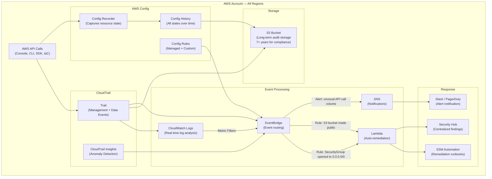
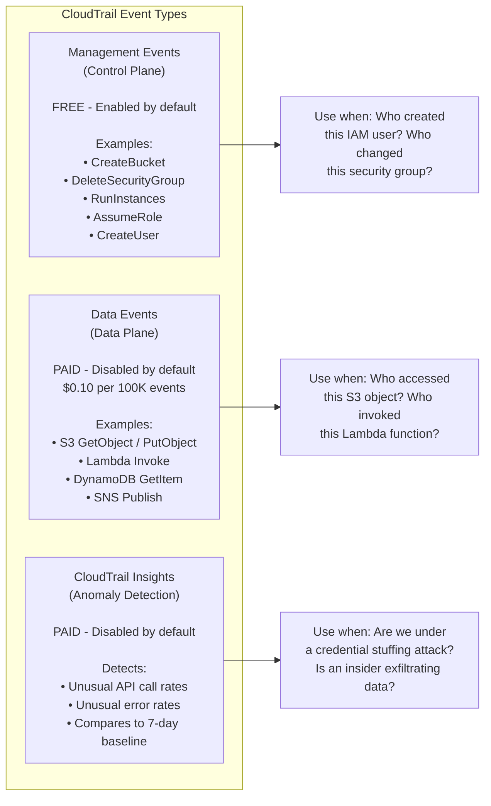
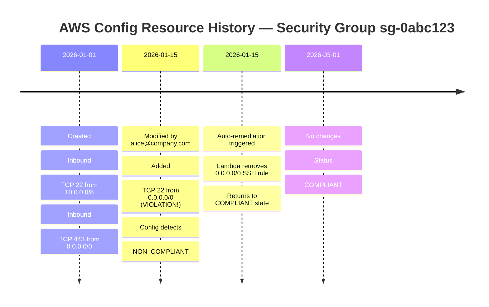
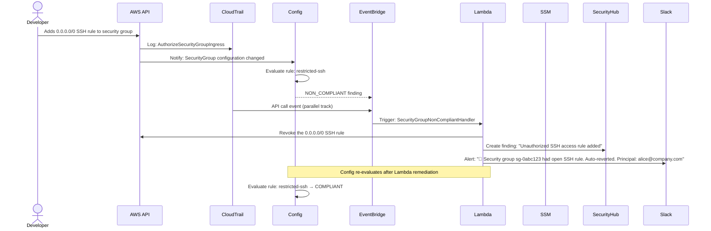

# AWS CloudTrail & Config: Audit, Governance, and Compliance

> **Common Interview Question**: "How do you prove who deleted the S3 bucket? How do you detect when someone changes a security group? How do you achieve continuous compliance across 50 AWS accounts?"

Common in: AWS Solutions Architect, Security Engineering, Compliance/Governance, DevSecOps, CISO-level platform interviews

---

## Quick Answer (30-second version)

- **CloudTrail** = Records every API call made in your AWS account — who did what, from where, and when. Your audit log for all control-plane actions.
- **CloudTrail Management Events** = Control-plane actions (CreateBucket, DeleteSecurityGroup, AssumeRole). Enabled by default in most accounts.
- **CloudTrail Data Events** = Data-plane actions (S3 GetObject, PutObject, Lambda Invoke). NOT enabled by default — costs extra.
- **CloudTrail Insights** = Anomaly detection on API call volume (suddenly 100x more EC2 terminations than usual).
- **AWS Config** = Tracks the configuration state of your AWS resources over time. Answers "what did this security group look like 30 days ago?" and "are any resources violating compliance rules right now?"
- **Config Rules** = Managed or custom rules that evaluate resource configurations. Non-compliant = alert, auto-remediate, or block.
- **Key difference**: CloudTrail records *actions* (API calls). Config records *states* (resource configurations). You need both for full audit + compliance.

---

## Why This Matters / The Thought Process

When an interviewer asks about CloudTrail and Config, they're testing whether you understand the difference between **audit logging** and **compliance monitoring** — two distinct concepts that solve two different problems.

The real questions behind the question:
- Do you know that "who deleted the bucket?" requires CloudTrail, not Config?
- Do you know that "was this security group ever open to the internet?" requires Config history, not CloudTrail?
- Can you design a pipeline that auto-remediates compliance violations in real time?
- Do you understand what events go to CloudWatch vs Config vs EventBridge?

Think like an SA: At companies like Netflix, Stripe, or Airbnb operating under SOC2 or PCI-DSS, **every API call is evidence**. Auditors want to see the exact timeline: who did what, when, from which IP, using which role. CloudTrail IS your audit trail. Config IS your compliance posture. Neither replaces the other.

The mental model:
- **CloudTrail** = Security camera footage (what happened, frame by frame)
- **AWS Config** = Building inspection report (what the building looks like at any point in time, is it up to code?)
- **EventBridge + Lambda** = Security guard who watches the footage and calls the fire department if something's wrong

---

## Architecture: CloudTrail + Config + Automated Remediation



**Key insight**: The pipeline has two parallel tracks:
1. CloudTrail → CloudWatch → EventBridge = Who did it (API call history)
2. Config → Config Rules → EventBridge = What it looks like now (configuration state)

Both feed into EventBridge, which triggers Lambda for remediation.

---

## Deep Dive: AWS CloudTrail

### What CloudTrail Records

Every CloudTrail event captures the "5 Ws":

| Field | Example | What it tells you |
|-------|---------|-------------------|
| `userIdentity` | `arn:aws:iam::123456789:user/alice` | **Who** made the call |
| `eventName` | `DeleteBucket` | **What** action was taken |
| `eventTime` | `2026-03-20T14:23:11Z` | **When** it happened |
| `sourceIPAddress` | `72.21.198.66` | **From where** |
| `requestParameters` | `{"bucketName": "prod-data"}` | **On what** resource |
| `responseElements` | success/failure, ARNs created | **Result** of the call |
| `userAgent` | `aws-cli/2.9.0` | **How** (console, CLI, SDK) |

### Management Events vs Data Events vs Insights



**Critical cost note**: Data events can be extremely expensive at scale. An S3 bucket receiving 1 billion GET requests/month = **$100,000/month** in CloudTrail data event costs. Only enable for high-value buckets (secrets, PII, prod assets).

### CloudTrail: Multi-Region and Organization Trails

```
Single-region trail:       Only captures events in one region
Multi-region trail:        Captures events in ALL regions (recommended)
Organization trail:        Captures events across ALL accounts in AWS Organization
                          Created in management account, applies to all member accounts
```

**Best practice for enterprises**: Create one Organization Trail in your management account:
- All 50 accounts automatically covered
- Member accounts cannot delete or modify it (protection from insider threats)
- All logs ship to a centralized S3 bucket in a dedicated security account

### CloudTrail Log File Integrity

CloudTrail signs each log file with a SHA-256 hash. You can validate that logs haven't been tampered with:

```bash
# Validate that log files haven't been modified
aws cloudtrail validate-logs \
  --trail-arn arn:aws:cloudtrail:us-east-1:123456789:trail/org-trail \
  --start-time 2026-01-01T00:00:00Z \
  --end-time 2026-01-31T23:59:59Z
```

For SOC2 and PCI-DSS compliance, log integrity validation is a required control.

---

## Deep Dive: AWS Config

### What AWS Config Tracks

Config continuously records the configuration of every supported AWS resource. It answers:
- "What did this resource look like on January 15th?"
- "When did this security group change, and what was it before?"
- "Which S3 buckets currently have public access enabled?"
- "Are all RDS instances encrypted at rest?"



### Config Rules — Managed vs Custom

**AWS Managed Rules** (100+ pre-built):

| Rule Name | What it checks |
|-----------|---------------|
| `restricted-ssh` | Security groups don't allow unrestricted SSH (0.0.0.0/0 on port 22) |
| `s3-bucket-public-read-prohibited` | No S3 buckets allow public read |
| `rds-storage-encrypted` | All RDS instances have encryption at rest |
| `root-account-mfa-enabled` | Root account has MFA enabled |
| `iam-password-policy` | IAM password policy meets requirements |
| `encrypted-volumes` | All EBS volumes are encrypted |
| `vpc-default-security-group-closed` | Default security group has no inbound/outbound rules |
| `access-keys-rotated` | IAM access keys rotated within 90 days |
| `cloudtrail-enabled` | CloudTrail is enabled in every region |
| `guardduty-enabled-centralized` | GuardDuty is enabled in every member account |

**Custom Config Rules** (Lambda-powered):

```javascript
// Custom Lambda Config Rule: Check that all EC2 instances have a "CostCenter" tag
exports.handler = async (event) => {
  const configItem = JSON.parse(event.invokingEvent).configurationItem;
  const resourceType = configItem.resourceType;
  const tags = configItem.tags || {};

  // Only evaluate EC2 instances
  if (resourceType !== 'AWS::EC2::Instance') {
    return putEvaluation(event, 'NOT_APPLICABLE');
  }

  // Check for required tag
  const hasCostCenter = 'CostCenter' in tags && tags['CostCenter'].length > 0;

  const compliance = hasCostCenter ? 'COMPLIANT' : 'NON_COMPLIANT';
  const annotation = hasCostCenter
    ? 'Instance has required CostCenter tag'
    : 'Instance missing required CostCenter tag — will be stopped in 24h';

  return putEvaluation(event, compliance, annotation, configItem);
};

async function putEvaluation(event, complianceType, annotation, configItem) {
  const { ConfigServiceClient, PutEvaluationsCommand } = require('@aws-sdk/client-config-service');
  const client = new ConfigServiceClient({});

  await client.send(new PutEvaluationsCommand({
    Evaluations: [{
      ComplianceResourceType: configItem.resourceType,
      ComplianceResourceId: configItem.resourceId,
      ComplianceType: complianceType,
      Annotation: annotation,
      OrderingTimestamp: new Date(configItem.configurationItemCaptureTime)
    }],
    ResultToken: event.resultToken
  }));
}
```

### Config Remediation Actions

Config supports two remediation modes:

| Mode | How it works | When to use |
|------|-------------|-------------|
| **Manual remediation** | Marks resource as non-compliant, you fix it | Sensitive changes where auto-fix could break things |
| **Automatic remediation** | Triggers SSM Automation document immediately | Well-understood violations with safe auto-fix |

**Example auto-remediation**: When Config detects an S3 bucket with public access enabled, automatically call the SSM Automation document `AWS-DisableS3BucketPublicReadWrite` to remove public access.

---

## CloudTrail vs CloudWatch Logs vs Config — The Decision Table

This is the most important comparison for interviews. Memorize this.

| Question | Service to use | Why |
|----------|---------------|-----|
| "Who deleted the S3 bucket?" | **CloudTrail** | API call audit log |
| "Who changed this security group 30 days ago?" | **CloudTrail** | API call history |
| "What did this security group look like on Jan 15?" | **AWS Config** | Configuration state history |
| "Is any security group open to the internet RIGHT NOW?" | **AWS Config** | Current compliance state |
| "Alert me in real-time when someone calls DeleteBucket" | **CloudWatch** | CloudTrail → CloudWatch log metric filter → Alarm |
| "Our EC2 application logs show 500 errors" | **CloudWatch** | Application log monitoring |
| "Detect unusual API call volumes" | **CloudTrail Insights** | Anomaly detection |
| "Did someone access this specific S3 object?" | **CloudTrail** (Data Events) | S3 object-level logging |
| "Are all 50 accounts compliant with our security baseline?" | **AWS Config** (Org-wide) | Multi-account compliance |

**The trap**: Config does NOT store API call history. If you ask "who changed this?" Config can tell you WHAT changed and WHEN, but NOT WHO (that's CloudTrail). You need both.

---

## Interview Scenarios — Walk-Through Answers

### Scenario 1: "How do you prove who deleted the S3 bucket?"

**Thinking out loud (what the interviewer wants to hear):**

> "I'd go to CloudTrail. Every API call is logged, including `DeleteBucket`. I'd search CloudTrail Event History for the event name `DeleteBucket` in the relevant time window. The event will show me the IAM principal (user ARN, role ARN, or federated identity), the source IP, the timestamp, and the user agent (was it from the console, CLI, or a specific SDK?).
>
> If the deletion happened more than 90 days ago (CloudTrail Event History only goes back 90 days), I'd query the S3 bucket where we archive CloudTrail logs using Athena.
>
> For compliance, this is why we require a CloudTrail trail with S3 archival configured — S3 retains logs for 7+ years, giving us the full audit trail for SOC2 auditors."

**The command:**
```bash
aws cloudtrail lookup-events \
  --lookup-attributes AttributeKey=EventName,AttributeValue=DeleteBucket \
  --start-time 2026-03-01T00:00:00Z \
  --end-time 2026-03-20T23:59:59Z \
  --query 'Events[*].{Time:EventTime,User:Username,Source:CloudTrailEvent}' \
  --output table
```

**For older events — Athena query against S3:**
```sql
-- Query CloudTrail logs in S3 via Athena
SELECT
  eventtime,
  useridentity.arn AS principal,
  sourceipaddress,
  useragent,
  requestparameters
FROM cloudtrail_logs
WHERE
  eventname = 'DeleteBucket'
  AND eventtime BETWEEN '2026-01-01' AND '2026-03-20'
ORDER BY eventtime DESC;
```

---

### Scenario 2: "How do you detect when someone changes a security group?"

**The answer uses BOTH CloudTrail and Config:**

**Option A: CloudTrail → CloudWatch → EventBridge (detect the API call)**
1. CloudTrail captures `AuthorizeSecurityGroupIngress` or `RevokeSecurityGroupIngress`
2. CloudTrail sends to CloudWatch Logs
3. CloudWatch metric filter matches the event name
4. CloudWatch Alarm fires → SNS → Slack notification

**Option B: AWS Config Rule (detect the resulting state)**
1. Config Rule `restricted-ssh` evaluates the security group after the change
2. If security group now allows 0.0.0.0/0 on port 22 → NON_COMPLIANT
3. Config triggers EventBridge → Lambda → auto-removes the rule + alerts

**Which is better?** Use both:
- CloudTrail catches the action (who did it, even if Config hasn't evaluated yet)
- Config validates the resulting state (correct even if multiple changes happen together)
- Together: complete detection AND auto-remediation

---

### Scenario 3: "How do you achieve continuous compliance across 50 AWS accounts?"

**The architect's answer:**

1. **AWS Organizations** — all accounts in one Organization
2. **Organization-wide Config** — enable Config recorder in all accounts from the management account, aggregate findings in a dedicated Security account (Config Aggregator)
3. **Conformance Packs** — deploy a set of Config rules as a single package across all 50 accounts (e.g., "NIST 800-53 Conformance Pack" or custom company baseline)
4. **Security Hub** — aggregates Config findings from all accounts into one dashboard
5. **Service Control Policies (SCPs)** — prevent member accounts from disabling Config or CloudTrail
6. **EventBridge + Lambda** — automated remediation for well-understood violations

```
Management Account
├── SCP: Deny cloudtrail:StopLogging, Deny config:StopConfigurationRecorder
├── Organization Trail → S3 (security account)
├── Organization Config → Config Aggregator (security account)
└── Conformance Pack: company-security-baseline (deployed to all 50 accounts)

Security Account
├── Centralized CloudTrail S3 bucket
├── Config Aggregator Dashboard
├── Security Hub (aggregates findings)
└── Lambda auto-remediation functions
```

---

## Integration Pattern: Full Automated Remediation Pipeline



---

## Code Example: Lambda Auto-Remediation for Open Security Groups

```javascript
// Lambda function: Auto-remediate security groups that open SSH to 0.0.0.0/0
// Triggered by EventBridge rule on Config NON_COMPLIANT finding

const { EC2Client, DescribeSecurityGroupsCommand, RevokeSecurityGroupIngressCommand } = require('@aws-sdk/client-ec2');
const { SecurityHubClient, BatchImportFindingsCommand } = require('@aws-sdk/client-securityhub');

const ec2 = new EC2Client({});
const securityHub = new SecurityHubClient({});

exports.handler = async (event) => {
  console.log('Config compliance event:', JSON.stringify(event, null, 2));

  // EventBridge delivers Config compliance change events
  const detail = event.detail;
  const resourceId = detail.resourceId; // e.g., "sg-0abc123def456"
  const accountId = detail.awsAccountId;
  const region = event.region;

  if (detail.newEvaluationResult.complianceType !== 'NON_COMPLIANT') {
    console.log('Not a non-compliant event, skipping');
    return;
  }

  try {
    // 1. Get the current security group rules
    const describeResp = await ec2.send(new DescribeSecurityGroupsCommand({
      GroupIds: [resourceId]
    }));

    const sg = describeResp.SecurityGroups[0];
    if (!sg) {
      console.error(`Security group ${resourceId} not found`);
      return;
    }

    // 2. Find all inbound rules that allow SSH (port 22) from anywhere
    const openSshRules = sg.IpPermissions.filter(permission => {
      const isSSH = permission.FromPort === 22 && permission.ToPort === 22;
      const isOpenIPv4 = permission.IpRanges?.some(range => range.CidrIp === '0.0.0.0/0');
      const isOpenIPv6 = permission.Ipv6Ranges?.some(range => range.CidrIpv6 === '::/0');
      return isSSH && (isOpenIPv4 || isOpenIPv6);
    });

    if (openSshRules.length === 0) {
      console.log('No open SSH rules found — Config rule may have already been remediated');
      return;
    }

    // 3. Revoke the violating rules
    await ec2.send(new RevokeSecurityGroupIngressCommand({
      GroupId: resourceId,
      IpPermissions: openSshRules
    }));

    console.log(`Successfully revoked ${openSshRules.length} open SSH rule(s) from ${resourceId}`);

    // 4. Create a finding in Security Hub for visibility
    const findingId = `open-ssh-remediated-${resourceId}-${Date.now()}`;
    await securityHub.send(new BatchImportFindingsCommand({
      Findings: [{
        SchemaVersion: '2018-10-08',
        Id: findingId,
        ProductArn: `arn:aws:securityhub:${region}:${accountId}:product/${accountId}/default`,
        GeneratorId: 'auto-remediation-open-ssh',
        AwsAccountId: accountId,
        Types: ['Software and Configuration Checks/AWS Security Best Practices'],
        CreatedAt: new Date().toISOString(),
        UpdatedAt: new Date().toISOString(),
        Severity: { Label: 'HIGH', Normalized: 70 },
        Title: `Open SSH access detected and auto-remediated on ${resourceId}`,
        Description: `Security group ${resourceId} had an inbound SSH rule allowing access from 0.0.0.0/0. The rule was automatically removed. Review CloudTrail for the IAM principal that added this rule.`,
        Resources: [{
          Type: 'AwsEc2SecurityGroup',
          Id: `arn:aws:ec2:${region}:${accountId}:security-group/${resourceId}`,
          Region: region
        }],
        Compliance: { Status: 'FAILED' },
        Workflow: { Status: 'NEW' },
        RecordState: 'ACTIVE',
        // Note: For production, also notify Slack/PagerDuty here
        Note: {
          Text: `Auto-remediated by Lambda. Check CloudTrail event AuthorizeSecurityGroupIngress for the responsible principal.`,
          UpdatedAt: new Date().toISOString(),
          UpdatedBy: 'auto-remediation-lambda'
        }
      }]
    }));

    console.log(`Security Hub finding created: ${findingId}`);
    return { statusCode: 200, body: `Remediated ${openSshRules.length} open SSH rule(s)` };

  } catch (error) {
    console.error('Remediation failed:', error);
    // In production: send alert to PagerDuty if auto-remediation fails
    throw error;
  }
};
```

**EventBridge rule to trigger this Lambda:**
```json
{
  "source": ["aws.config"],
  "detail-type": ["Config Rules Compliance Change"],
  "detail": {
    "configRuleName": ["restricted-ssh"],
    "newEvaluationResult": {
      "complianceType": ["NON_COMPLIANT"]
    }
  }
}
```

---

## Real-World Scenario: SOC2 Compliance at Stripe/Netflix Scale

**The compliance problem**: SOC2 Type II requires continuous evidence that security controls are in place. Auditors want:
- Proof that no unauthorized changes were made to production infrastructure
- Evidence that sensitive data was accessed only by authorized principals
- Log retention for at least 12 months (often 7 years for regulated industries)

**How the architecture solves it:**

```
Evidence Category          | AWS Service Used          | What it proves
---------------------------|---------------------------|----------------------------------
Change management          | CloudTrail (Management)   | Every infrastructure change logged
Privileged access audit    | CloudTrail (Management)   | AssumeRole events show who accessed what
Data access logging        | CloudTrail (Data Events)  | S3 object access for sensitive buckets
Security group compliance  | Config (restricted-ssh)   | No open SSH at any point in time
Encryption compliance      | Config (rds-encrypted)    | All databases encrypted at rest
Log integrity              | CloudTrail log validation | Logs haven't been tampered with
Incident response speed    | EventBridge + Lambda      | Security violations remediated < 5 min
```

**Retention strategy:**
- CloudTrail logs → S3 with lifecycle policy: 90 days Standard → Glacier → 7 years
- S3 bucket policy: Deny `s3:DeleteObject` even from bucket owner (WORM-like protection)
- S3 Object Lock (Compliance mode): Prevents deletion even by root account until retention period expires

**Audit query pattern using Athena:**
```sql
-- Monthly compliance report: All IAM role assumptions from production accounts
-- Run by compliance team for SOC2 evidence
SELECT
  eventtime,
  useridentity.arn AS assumed_by,
  requestparameters.roleArn AS role_assumed,
  sourceipaddress,
  useragent
FROM cloudtrail_logs
WHERE
  eventname = 'AssumeRole'
  AND requestparameters.roleArn LIKE '%prod%'
  AND eventtime >= date_format(current_date - interval '30' day, '%Y-%m-%d')
ORDER BY eventtime DESC;
```

---

## Common Interview Follow-ups

**Q: "What's the difference between CloudTrail and CloudWatch Logs?"**

> "CloudTrail records AWS API calls — the control plane actions like CreateBucket, DeleteUser, RunInstances. It's your audit log of who did what in AWS. CloudWatch Logs is a general-purpose log aggregation service — it collects application logs, system logs, Lambda function logs, VPC Flow Logs, etc. CloudTrail actually sends its events to CloudWatch Logs, which lets you set up metric filters and alarms on specific API call patterns. They complement each other: CloudTrail for 'what AWS API calls were made?', CloudWatch for 'what is happening inside my applications?'"

**Q: "Can AWS Config prevent a misconfiguration from happening?"**

> "By default, Config is detective, not preventive — it detects misconfigurations after they happen and alerts or auto-remediates. For prevention, you'd layer in other controls: SCPs at the Organization level, IAM permission boundaries, or AWS Control Tower guardrails. AWS Config Proactive Rules (newer feature) can evaluate CloudFormation templates before deployment to prevent misconfigurations from reaching production. But the primary model is detect-and-remediate, not block."

**Q: "CloudTrail is enabled by default — so we're fine, right?"**

> "Not quite. CloudTrail creates a default 'event history' for 90 days in each region, but that's not the same as a proper trail. A proper trail sends logs to S3 for long-term retention, can cover all regions (not just the current one), and can be enabled at the organization level. Without a proper trail, you lose audit history after 90 days. Also, Data Events are NOT enabled by default — if someone exfiltrates data from S3 or invokes Lambda functions, you won't see those events without explicitly enabling Data Events on the relevant resources."

**Q: "How do you query CloudTrail logs at scale?"**

> "For recent events (< 90 days), use the CloudTrail Console or CLI with `lookup-events`. For historical analysis or large-scale queries, use Athena. Set up an Athena table over your CloudTrail S3 bucket with the CloudTrail partition projection — this lets you query months of logs in seconds with SQL. For security operations centers doing real-time analysis, you'd stream CloudTrail logs to OpenSearch (via Kinesis Data Firehose) for fast search and dashboards."

**Q: "What's the cheapest way to get compliance visibility across 20 AWS accounts?"**

> "Enable AWS Config with Organization-wide rules and a Config Aggregator in a centralized security account. The Aggregator pulls compliance data from all member accounts. Then use Security Hub (which integrates directly with Config) for a unified dashboard. The cost is proportional to the number of Config rules × number of evaluations. You can keep costs down by using only the managed rules you actually need, rather than enabling every possible rule. A typical 20-account setup with 20-30 focused Config rules runs roughly $50-200/month."

---

## AWS Certification Exam Tips

1. **CloudTrail is NOT real-time by default** — logs are delivered to S3 within 15 minutes of the API call. For real-time alerting, route CloudTrail to CloudWatch Logs and use metric filters + alarms.

2. **Config does NOT record API calls** — Config records resource configuration states. The trap question: "who changed the security group?" — Config shows you WHAT changed and WHEN, but not WHO. For WHO, you need CloudTrail.

3. **CloudTrail Data Events cost money** — management events are free (for first trail per region). S3 and Lambda data events are $0.10 per 100K events. Don't accidentally enable for all S3 buckets in a high-traffic account.

4. **CloudTrail Insights is expensive** — charged per event analyzed. Only enable on trails where you actually want anomaly detection.

5. **Config vs CloudTrail for "what did this look like before?"** — Config has full configuration history per resource. CloudTrail can show you the API call that changed it, but not the full before/after configuration. Use Config for "what was the configuration state?"

6. **Organization Trail vs member account trail** — Organization Trails are created in the management account and automatically cover all member accounts. Member accounts cannot disable an Organization Trail (protection from insider threats). This is the correct architecture for enterprises.

7. **S3 bucket for CloudTrail** — the S3 bucket should be in a separate, dedicated security account with an S3 bucket policy that prevents deletion. Use S3 Object Lock (Compliance mode) for immutable logs required by regulations.

8. **Config Conformance Packs** — pre-packaged sets of Config rules + remediation. AWS provides conformance packs for CIS, NIST, PCI-DSS, HIPAA. Deploy them to all accounts via Organizations in one operation.

9. **CloudWatch Logs metric filter** — you can create alarms on specific CloudTrail events: root login, IAM changes, CloudTrail being disabled. These are commonly required by security benchmarks like CIS AWS Foundations.

10. **Auto-remediation with SSM vs Lambda** — AWS Config has built-in integration with SSM Automation documents for remediation. For simple fixes (disable public S3 access, revoke security group rules), use the pre-built SSM documents. For complex logic, write a Lambda function.

---

## Key Takeaways

- **CloudTrail** = who did what API call, when, from where. Your audit log. Essential for answering "who deleted the bucket?"
- **AWS Config** = what does each resource look like, is it compliant, and what did it look like in the past. Your compliance posture monitor.
- **CloudWatch Logs** = application + service logs. CloudTrail feeds INTO CloudWatch for real-time alerting.
- The three work together: CloudTrail → CloudWatch Logs (real-time alert on API calls) + Config Rules (compliance state) → EventBridge → Lambda (auto-remediation)
- For enterprises: enable **Organization Trail** + **Organization Config** from the management account so no member account can disable auditing
- **Data Events** are NOT enabled by default and cost money — enable only for high-value, sensitive resources
- Config cannot tell you WHO made a change — that's CloudTrail. Both are needed for complete audit + compliance.
- Retain CloudTrail logs in S3 with S3 Object Lock for immutable compliance evidence

## Related Topics

- [AWS IAM — Roles, Policies, and Multi-Account Security](/12-interview-prep/quick-reference/aws-cloud/iam-roles-policies)
- [AWS CloudWatch Monitoring](/12-interview-prep/quick-reference/aws-cloud/cloudwatch-monitoring)
- [WAF, Shield, and GuardDuty — Threat Protection](/12-interview-prep/quick-reference/aws-cloud/waf-shield-guardduty)
- [AWS VPC Networking](/12-interview-prep/quick-reference/aws-cloud/vpc-networking)
