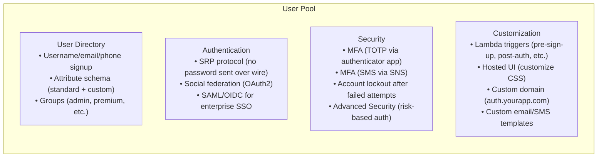
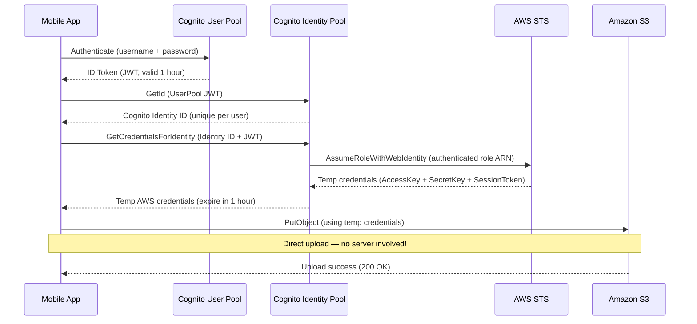
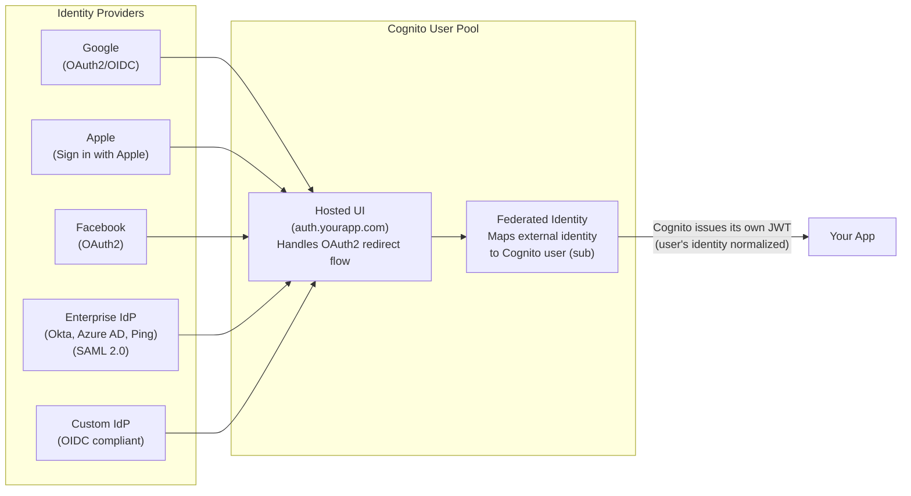
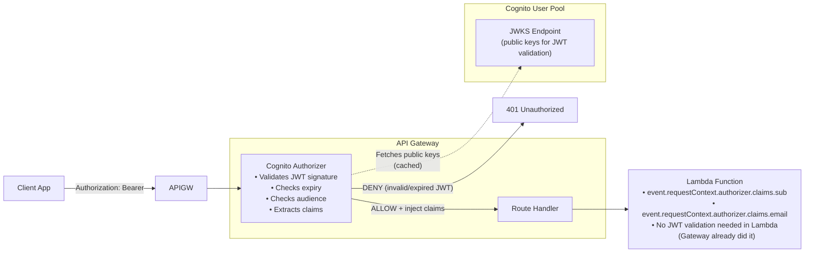

# AWS Cognito: User Pools, Identity Pools, and Authentication Flows

> **Common Interview Question**: "Design authentication for a mobile app that needs to upload images directly to S3. How does the mobile app get AWS credentials? What's the difference between a User Pool and an Identity Pool?"

Common in: AWS Solutions Architect, Senior Backend, Mobile/App Backend, FAANG-style system design interviews

---

## Quick Answer (30-second version)

- **Cognito User Pool** = A user directory. Handles sign-up, sign-in, MFA, password policies, social login via federation. Returns JWT tokens (ID token, access token, refresh token). **Does NOT give you AWS credentials.**
- **Cognito Identity Pool** (Federated Identities) = Exchanges identity tokens (from User Pool, Google, Apple, etc.) for **temporary AWS credentials** via STS AssumeRoleWithWebIdentity. Lets unauthenticated or authenticated users access AWS services directly (S3, DynamoDB, etc.).
- **The core distinction**: User Pool = authentication (who are you?). Identity Pool = authorization for AWS resources (what AWS services can you access?).
- **JWT tokens from User Pool**:
  - **ID Token** = Who you are (user attributes: email, name, sub). Used to authorize your own backend APIs.
  - **Access Token** = What you're allowed to do in Cognito (change password, update user attributes). Used with Cognito APIs.
  - **Refresh Token** = Long-lived token to get new ID/access tokens without re-login. Store it securely.
- **Mobile app → S3 pattern**: User Pool (authenticate) → Identity Pool (get temp AWS creds) → Direct S3 upload (no server needed).

---

## Why This Matters / The Thought Process

Cognito is one of the most confusing AWS services because it has two completely separate products under one name. Interviewers love this because candidates — even experienced ones — mix them up.

The mental model to internalize:

```
User Pool  =  Think "Auth0" or "Firebase Auth"
             → user database, login flows, JWT tokens
             → your app talks to User Pool to authenticate users
             → result: JWT tokens (no AWS access)

Identity Pool  =  Think "AWS IAM vending machine for end users"
                → takes a trusted identity (your User Pool JWT, or a Google token)
                → exchanges it for temporary AWS credentials (STS)
                → result: access_key_id + secret_access_key + session_token
                          that expire in 1 hour
```

The interviewer is testing whether you understand the difference between:
1. **Authenticating your user** (proving they are who they say they are) — User Pool
2. **Granting AWS resource access** (letting them directly call AWS APIs) — Identity Pool

Think like an SA: The "mobile app uploads to S3" scenario is a classic architecture question because the naive solution (proxy all uploads through your server) doesn't scale. The correct solution uses Cognito Identity Pool to give the mobile app temporary, scoped AWS credentials so it uploads directly to S3, bypassing your servers entirely. This eliminates a bottleneck, reduces server costs, and scales to millions of uploads without your backend being in the critical path.

---

## Architecture: The Full Cognito Picture

```mermaid
graph TB
    subgraph "What Each Service Does"
        subgraph "Cognito User Pool"
            UP["User Pool\n\n• User directory (sign-up/sign-in)\n• MFA (TOTP, SMS)\n• Password policies\n• Email/phone verification\n• Hosted UI (pre-built login page)\n• Social federation (Google, Apple, Facebook)\n• Enterprise federation (SAML, OIDC)\n\nOutput: JWT tokens\n(ID token, Access token, Refresh token)"]
        end

        subgraph "Cognito Identity Pool"
            IP["Identity Pool\n\n• Accepts: User Pool JWT, Google, Apple, Facebook,\n  Twitter, Amazon, SAML, custom developer auth\n• Maps identity to IAM Role\n  (authenticated role vs unauthenticated role)\n• Calls STS: AssumeRoleWithWebIdentity\n\nOutput: Temporary AWS Credentials\n(AccessKeyId + SecretKey + SessionToken)\nExpiry: 1 hour (configurable 15min-12h)"]
        end
    end

    subgraph "IAM Roles"
        AUTH_ROLE["Authenticated IAM Role\n\nExample policy:\ns3:PutObject on\narn:aws:s3:::photos/${cognito-identity.amazonaws.com:sub}/*\n\n(User can ONLY write to their own S3 prefix!)"]

        UNAUTH_ROLE["Unauthenticated IAM Role\n\nExample policy:\ns3:GetObject on\narn:aws:s3:::public-content/*\n\n(Anonymous users can read public content)"]
    end

    APP["Mobile/Web App"] -->|1. Sign in| UP
    UP -->|2. Returns JWT tokens| APP
    APP -->|3. Exchange JWT for AWS creds| IP
    IP -->|4. Calls STS AssumeRoleWithWebIdentity| STS["AWS STS"]
    STS -->|5. Temp credentials (1h)| IP
    IP -->|6. Temp credentials| APP
    APP -->|7. Direct AWS API call| S3["S3 Bucket\nDynamoDB\nAPI Gateway\netc."]

    IP --> AUTH_ROLE
    IP --> UNAUTH_ROLE
```

---

## Deep Dive: Cognito User Pools

### User Pool Core Features



### Lambda Triggers — When to Use Them

| Trigger | When it fires | Common use case |
|---------|--------------|-----------------|
| `Pre sign-up` | Before user is created | Block email domains, validate invite codes |
| `Post confirmation` | After email/phone verified | Create user record in your DB, send welcome email |
| `Pre authentication` | Before password verified | Custom auth logic, block specific users |
| `Post authentication` | After successful login | Log sign-in event, update last-login timestamp |
| `Pre token generation` | Before JWT tokens issued | Add custom claims to JWT (user_tier: "premium") |
| `Custom message` | Generating verification/MFA messages | Custom verification email templates |
| `Define/Create/Verify auth challenge` | Custom auth flow | Passwordless auth (magic link, TOTP without standard MFA) |

### JWT Token Deep Dive

After a user authenticates with a User Pool, Cognito returns three tokens:

```
ID Token (JWT)
├── Header: algorithm (RS256), key ID
├── Payload:
│   ├── sub: "unique-user-id-in-cognito"        ← use this as your user ID
│   ├── email: "alice@example.com"
│   ├── email_verified: true
│   ├── name: "Alice Smith"
│   ├── cognito:groups: ["admin"]               ← group memberships
│   ├── custom:user_tier: "premium"             ← custom attributes
│   ├── iss: "https://cognito-idp.us-east-1.amazonaws.com/us-east-1_PoolId"
│   ├── aud: "your-app-client-id"
│   ├── iat: 1710000000                         ← issued at (Unix timestamp)
│   └── exp: 1710003600                         ← expires in 1 hour
└── Signature (RS256, signed by Cognito's private key)

Access Token (JWT)
├── Used for: Cognito API operations (change password, update user attrs)
├── Scope: "openid profile email"
├── NOT typically used for your own API authorization
└── Expires: 1 hour (default)

Refresh Token
├── Used for: getting new ID + Access tokens without re-login
├── Stored securely (HttpOnly cookie or secure storage)
├── Expires: 30 days (default, configurable 1-3650 days)
└── Revocable: call Cognito RevokeToken to invalidate all sessions
```

**Critical interview point**: Use the **ID token** to authorize requests to your backend API, NOT the access token. The access token is for Cognito's own APIs, not your custom APIs. Your API validates the ID token's signature using Cognito's JWKS (public keys) endpoint.

---

## Deep Dive: Cognito Identity Pools

### How Temporary Credentials Work

The Identity Pool is a broker. It says: "I trust these identity sources. When a user presents a valid token from one of them, I'll assume an IAM role on their behalf and give them temporary AWS credentials."



### Identity Pool IAM Role + Variable Interpolation

The most powerful feature of Identity Pool is using Cognito identity variables in IAM policies. This lets each user only access their own data:

```json
{
  "Version": "2012-10-17",
  "Statement": [
    {
      "Effect": "Allow",
      "Action": ["s3:PutObject", "s3:GetObject", "s3:DeleteObject"],
      "Resource": "arn:aws:s3:::my-app-photos/${cognito-identity.amazonaws.com:sub}/*"
    }
  ]
}
```

**What this does**: The `${cognito-identity.amazonaws.com:sub}` variable is replaced at runtime with the user's unique Cognito Identity ID. So user `us-east-1:abc123` can ONLY access `my-app-photos/us-east-1:abc123/*`. They literally cannot write to or read from any other user's prefix — it's enforced at the IAM policy level, not the application level.

**Same pattern for DynamoDB row-level security:**
```json
{
  "Effect": "Allow",
  "Action": ["dynamodb:GetItem", "dynamodb:PutItem", "dynamodb:UpdateItem"],
  "Resource": "arn:aws:dynamodb:us-east-1:123456789:table/UserData",
  "Condition": {
    "ForAllValues:StringEquals": {
      "dynamodb:LeadingKeys": ["${cognito-identity.amazonaws.com:sub}"]
    }
  }
}
```

---

## Interview Scenario: Mobile App with Direct S3 Upload

**The question**: "Design authentication for a mobile app that needs to allow users to upload profile photos directly to S3. Users can sign in with Google or Apple. Photos should be stored per-user, and users should not be able to access other users' photos."

**The architecture answer:**

```mermaid
graph TB
    subgraph "Mobile App (iOS/Android)"
        APP["App\n1. Sign in with Google/Apple\n2. Get Cognito JWT\n3. Exchange for AWS creds\n4. Upload directly to S3"]
    end

    subgraph "Cognito"
        UP["User Pool\n• Google IdP configured\n• Apple IdP configured\n• Returns ID token after social login"]
        IP["Identity Pool\n• Trusts User Pool\n• Authenticated role: s3:PutObject\n  on users/sub/* only"]
    end

    subgraph "AWS"
        STS["STS\nIssues temp creds\n(1 hour TTL)"]
        S3["S3 Bucket: my-app-photos\nPrefix: users/{cognito-sub}/\nBucket policy: no public access"]
    end

    GOOGLE["Google OAuth2"] --> UP
    APPLE["Apple Sign In"] --> UP
    APP -->|Sign in via Google/Apple| UP
    UP -->|ID Token (JWT)| APP
    APP -->|Exchange token| IP
    IP -->|AssumeRoleWithWebIdentity| STS
    STS -->|Temp creds (1h)| APP
    APP -->|PutObject: users/sub/photo.jpg| S3
```

**Step-by-step implementation:**

**1. Create Cognito User Pool with Google/Apple federated identity:**
- In User Pool: Add Google as an identity provider (register your app in Google Cloud Console, get client ID/secret)
- Add Apple as an identity provider (register in Apple Developer portal)
- Create App Client with OAuth2 flows: authorization_code

**2. Create Identity Pool:**
- Add Cognito User Pool as an authentication source
- Create authenticated IAM role with per-user S3 policy (shown above)
- Create unauthenticated IAM role (if supporting guest users)

**3. Mobile app flow:**

```javascript
// React Native / Amplify example
import { Amplify, Auth, Storage } from 'aws-amplify';

// Configure Amplify (from amplifyconfiguration.json)
Amplify.configure({
  Auth: {
    userPoolId: 'us-east-1_xxxxxxxx',
    userPoolWebClientId: 'xxxxxxxxxxxxxxxxxx',
    identityPoolId: 'us-east-1:xxxxxxxx-xxxx-xxxx-xxxx-xxxxxxxxxxxx',
    region: 'us-east-1'
  },
  Storage: {
    AWSS3: {
      bucket: 'my-app-photos',
      region: 'us-east-1'
    }
  }
});

// Sign in with Google (Hosted UI)
async function signInWithGoogle() {
  await Auth.federatedSignIn({ provider: 'Google' });
  // Cognito Hosted UI handles the OAuth2 flow
  // App receives ID token + access token on return
}

// Upload photo directly to S3 (Amplify uses Identity Pool creds automatically)
async function uploadProfilePhoto(imageFile) {
  const user = await Auth.currentAuthenticatedUser();
  const userId = user.attributes.sub;

  // Amplify Storage automatically:
  // 1. Gets current Cognito Identity Pool credentials
  // 2. Refreshes them if expired
  // 3. Uploads directly to S3 using those credentials
  const result = await Storage.put(
    `users/${userId}/profile.jpg`,
    imageFile,
    {
      contentType: 'image/jpeg',
      level: 'private'  // Only accessible by this user's credentials
    }
  );

  return result.key;
}
```

---

## Validating Cognito JWT Tokens in Your Backend API

When your mobile app calls your backend API (Lambda, EC2, ECS), it includes the ID token in the Authorization header. Your backend must validate this token.

**API Gateway with Cognito Authorizer** (recommended — no code needed):

```
Client → API Gateway (Cognito Authorizer) → Lambda
                     ↓
         Validates JWT automatically:
         - Checks signature (downloads Cognito JWKS)
         - Checks expiry
         - Checks audience (app client ID)
         - Passes claims to Lambda in context
```

**Manual JWT validation in Node.js** (when not using API Gateway Cognito Authorizer):

```javascript
// Validate Cognito JWT token in your backend
const jwt = require('jsonwebtoken');
const jwksClient = require('jwks-rsa');

const COGNITO_REGION = 'us-east-1';
const USER_POOL_ID = 'us-east-1_xxxxxxxxx';
const APP_CLIENT_ID = 'xxxxxxxxxxxxxxxxxx';

// Cache JWKS client (don't recreate for every request)
const jwksUri = `https://cognito-idp.${COGNITO_REGION}.amazonaws.com/${USER_POOL_ID}/.well-known/jwks.json`;
const client = jwksClient({
  jwksUri,
  cache: true,
  cacheMaxEntries: 5,
  cacheMaxAge: 10 * 60 * 1000  // 10 minutes
});

function getSigningKey(header, callback) {
  client.getSigningKey(header.kid, (err, key) => {
    if (err) return callback(err);
    callback(null, key.getPublicKey());
  });
}

async function validateCognitoToken(token) {
  return new Promise((resolve, reject) => {
    jwt.verify(
      token,
      getSigningKey,
      {
        algorithms: ['RS256'],
        audience: APP_CLIENT_ID,
        issuer: `https://cognito-idp.${COGNITO_REGION}.amazonaws.com/${USER_POOL_ID}`
      },
      (err, decoded) => {
        if (err) return reject(new Error(`Invalid token: ${err.message}`));
        resolve(decoded);
      }
    );
  });
}

// Express middleware example
async function cognitoAuthMiddleware(req, res, next) {
  const authHeader = req.headers.authorization;
  if (!authHeader?.startsWith('Bearer ')) {
    return res.status(401).json({ error: 'Missing or invalid Authorization header' });
  }

  const token = authHeader.substring(7);

  try {
    const claims = await validateCognitoToken(token);

    // Attach user info to request
    req.user = {
      sub: claims.sub,            // Unique user ID (use this as your DB key)
      email: claims.email,
      groups: claims['cognito:groups'] || [],
      tier: claims['custom:user_tier'] || 'free'
    };

    next();
  } catch (error) {
    return res.status(401).json({ error: error.message });
  }
}

// Usage in Express route
app.get('/api/profile', cognitoAuthMiddleware, async (req, res) => {
  const userId = req.user.sub;  // Safe to use — validated JWT claim
  const profile = await db.getUser(userId);
  res.json(profile);
});
```

**Important**: Always validate:
1. JWT signature (using Cognito's public keys from JWKS endpoint)
2. Token expiry (`exp` claim)
3. Token audience (`aud` claim must be your app client ID)
4. Token issuer (`iss` claim must be your User Pool URL)

---

## User Pool vs Identity Pool — The Definitive Comparison

This is the most confusing Cognito concept. Here's the complete comparison:

| | User Pool | Identity Pool |
|--|-----------|--------------|
| **Purpose** | Authenticate users (who are you?) | Authorize AWS resource access (what can you do?) |
| **What it manages** | User accounts, passwords, MFA, groups | IAM role mappings, temp credential vending |
| **What it returns** | JWT tokens (ID, Access, Refresh) | Temporary AWS credentials (via STS) |
| **Does it store users?** | Yes — full user directory | No — just maps identities to IAM roles |
| **Social login support** | Yes — configure Google/Apple/Facebook as IdPs | Yes — also accepts Google/Apple tokens directly (without User Pool) |
| **Can be used without the other?** | Yes — for backend API auth (JWT only) | Yes — accept Google token directly, no User Pool needed |
| **When you need BOTH** | User authenticates to User Pool, then gets AWS creds via Identity Pool | Classic mobile app pattern |
| **Analogous to** | Auth0, Firebase Auth, Okta | AWS STS's AssumeRoleWithWebIdentity, but user-friendly |

**The decision tree:**

```
Does your app need to call AWS APIs directly (S3, DynamoDB, etc.) from the client?
├── YES → You need an Identity Pool
│         (Plus a User Pool if you want Cognito for authentication)
│
└── NO → You only need a User Pool
         (Your backend validates the JWT, calls AWS APIs server-side)
```

---

## Social Federation Architecture



**Why User Pool federation is useful**: Instead of integrating with 5 different OAuth2 providers in your app, you integrate with Cognito once. Cognito handles Google, Apple, Facebook, SAML, and OIDC. Your app receives a consistent Cognito JWT regardless of how the user logged in.

**Enterprise SSO with SAML** (common in B2B products):
- Configure your company's IdP (Okta, Azure AD) as a SAML provider in Cognito User Pool
- User goes to your app → redirected to Okta login → authenticates with corporate credentials → Okta sends SAML assertion to Cognito → Cognito issues JWT
- Your app works the same regardless of whether the user logged in with email/password or SSO

---

## Migrating from Custom Auth to Cognito

**Scenario**: "We have a custom auth system with 1M users in PostgreSQL. We want to migrate to Cognito without forcing users to reset passwords."

**Migration strategy using Lambda triggers:**

```javascript
// Migration Lambda trigger: User Migration
// Cognito calls this when a user tries to sign in but doesn't exist in the User Pool
exports.handler = async (event) => {
  // Only run during sign-in (not sign-up)
  if (event.triggerSource !== 'UserMigration_Authentication') {
    return event;
  }

  const { userName, request } = event;
  const password = request.password;  // Available only during migration trigger

  try {
    // 1. Validate credentials against your old system
    const user = await legacyDb.authenticate(userName, password);

    if (!user) {
      // Don't throw — returning without setting response = migration skipped
      // Cognito will treat it as wrong password
      return event;
    }

    // 2. Provide user attributes to Cognito
    event.response.userAttributes = {
      email: user.email,
      email_verified: 'true',
      'custom:legacy_id': String(user.id),
      'custom:user_tier': user.subscriptionTier
    };

    // 3. Tell Cognito what to do with this migrated user
    event.response.finalUserStatus = 'CONFIRMED';  // No email verification needed
    event.response.messageAction = 'SUPPRESS';     // Don't send welcome email

    console.log(`Migrated user: ${userName}`);
    return event;

  } catch (error) {
    console.error(`Migration error for ${userName}:`, error);
    return event;  // Fail gracefully — don't expose error to user
  }
};
```

**How this works**:
1. User tries to sign in to the new Cognito-backed app
2. Cognito looks up the user in the User Pool — not found
3. Cognito calls your `User Migration` Lambda with the username and password
4. Lambda validates against your old database
5. If valid, Lambda returns user attributes; Cognito creates the user automatically
6. Next time the user logs in, they're already in Cognito — no Lambda trigger needed
7. After 12-18 months, decommission the old auth system

---

## Cognito + API Gateway Integration



**ALB Authentication** (alternative to API Gateway):

You can also configure an ALB to authenticate users with Cognito before routing to your application:

```
User → ALB → (redirects to Cognito Hosted UI if not authenticated)
           → Authenticated → EC2 / ECS target
           → Sets X-Amzn-Oidc-Identity header with user claims
```

This is useful for internal tools, admin dashboards, or any web app where you want Cognito auth without modifying the application code.

---

## Common Interview Follow-ups

**Q: "What's the difference between an ID token and an access token in Cognito?"**

> "In Cognito (following the OAuth2/OIDC standard), the ID token contains identity claims — who the user is. It has their email, name, Cognito user ID (sub), custom attributes, and group memberships. The access token contains authorization claims — what OAuth2 scopes the user has been granted. In practice, for Cognito-backed apps, you use the ID token to authenticate requests to your own backend APIs. The access token is for Cognito's own user management APIs (like calling GetUser or ChangePassword). The refresh token is for getting new ID/access tokens without requiring the user to re-enter their password."

**Q: "Can you use an Identity Pool without a User Pool?"**

> "Yes. An Identity Pool can accept tokens directly from Google, Apple, Facebook, Amazon, or any OIDC/SAML provider, without going through a Cognito User Pool. The User Pool is optional — it's just one of many supported identity sources. The reason to use a User Pool is when you want Cognito to manage the user directory itself (username/password, MFA, groups, etc.) rather than delegating authentication entirely to an external IdP."

**Q: "How do you implement role-based access control (RBAC) with Cognito?"**

> "Two approaches. First: Cognito User Pool groups. You create groups (admin, editor, viewer) and assign users to them. The `cognito:groups` claim in the ID token lists the user's groups. Your backend reads this claim and enforces access control. This is simple and works well for most apps. Second: Identity Pool role mapping. You can configure the Identity Pool to assign different IAM roles based on group membership — admins get a role with broader S3 access, viewers get read-only. This is useful when different user types need different AWS resource permissions directly."

**Q: "What happens when the ID token expires during a session?"**

> "The app uses the refresh token to request new ID and access tokens from Cognito. The refresh token is valid for 30 days by default (configurable up to 10 years). The Amplify SDK handles this automatically — it silently refreshes expired tokens in the background. In a custom implementation, you catch a 401 error from your API, call Cognito's token endpoint with the refresh token to get new tokens, store the new tokens, and retry the original request. If the refresh token itself has expired, the user must re-authenticate."

**Q: "How do you handle Cognito in a multi-tenant SaaS?"**

> "Two common patterns. First: one User Pool per tenant (maximum isolation, separate admin controls, separate domains). This gets expensive and complex to manage at scale (limit: 500 User Pools per region). Second: one User Pool for all tenants, with custom attributes (custom:tenant_id) and Cognito groups per tenant. Add tenant_id to every JWT via a Pre Token Generation Lambda trigger. Your backend validates that the user's tenant_id matches the tenant they're accessing. The second pattern is more practical for most SaaS companies — simpler management, single codebase."

**Q: "Cognito vs Auth0 — when would you choose each?"**

> "Cognito has deep AWS integration (native API Gateway authorizer, ALB auth, works seamlessly with IAM, built-in Identity Pool for AWS credential vending). It's the right choice for AWS-native apps where you need users to access AWS services directly, or where you're already all-in on AWS. Auth0 is more feature-rich for authentication specifically — better customization of login flows, more flexible rules/hooks, better developer experience, better support for B2B/enterprise SSO. For a multi-cloud or complex enterprise auth requirement, Auth0 may be worth the cost. For a standard AWS application, Cognito is sufficient and cheaper."

---

## AWS Certification Exam Tips

1. **User Pool = authentication, Identity Pool = AWS authorization** — this is the most tested Cognito concept. A User Pool issues JWT tokens. An Identity Pool issues AWS temporary credentials. Never mix these up.

2. **User Pools do NOT give you AWS credentials** — a common distractor answer on exams. "A User Pool issues AWS credentials for direct S3 access" is FALSE. That's the Identity Pool.

3. **Cognito Sync vs AppSync** — Cognito Sync (deprecated, replaced by AppSync) synced user data across devices. If an exam question asks about syncing user data across mobile devices, the current answer is AppSync with a Cognito authorizer, not Cognito Sync.

4. **Hosted UI is optional** — Cognito provides a pre-built login page (Hosted UI) at `<your-domain>.auth.us-east-1.amazoncognito.com`. You can use it, customize it with CSS, or build your own login UI using the Cognito SDK directly.

5. **App Clients control what flows are allowed** — each App Client (one per application) can be configured to allow: user+password auth, SRP, client credentials (for machine-to-machine). You disable flows you don't use for security.

6. **Refresh token revocation** — calling `RevokeToken` with a refresh token invalidates all tokens issued from that refresh token. Use this for logout-everywhere functionality. Without revocation, old access tokens remain valid until they expire (1 hour).

7. **Identity Pool unauthenticated access** — Identity Pools support unauthenticated (guest) identities. You can give anonymous users limited AWS access (e.g., read-only S3 for a public image gallery) without them signing in. This is configured in the Identity Pool settings.

8. **Custom attributes are immutable once User Pool is created** — you can add custom attributes to the User Pool schema, but once created, they can't be removed. Plan your schema carefully.

9. **User migration trigger** — if you're migrating users from an existing system, use the `User Migration` Lambda trigger. Cognito will call your Lambda when a user tries to sign in but doesn't exist in the User Pool yet, allowing you to validate against your legacy system and migrate on first login.

10. **ALB vs API Gateway Cognito integration** — both support Cognito JWT authorization, but ALB authenticates at the load balancer level (redirecting to Cognito Hosted UI) while API Gateway Cognito Authorizer validates a Bearer token passed in the Authorization header. Use ALB auth for web apps with a browser, API Gateway Cognito Authorizer for REST/HTTP APIs called by mobile apps or other clients.

---

## Key Takeaways

- **User Pool = user directory + authentication** → returns JWT tokens. No AWS credential access.
- **Identity Pool = IAM role vending machine** → takes a trusted identity token, returns temporary AWS credentials via STS.
- The classic mobile pattern: User Pool (authenticate user) → Identity Pool (get temp AWS creds) → Direct S3/DynamoDB access (no server bottleneck).
- **ID token** = who you are (use for your backend API auth). **Access token** = for Cognito APIs. **Refresh token** = long-lived, gets new ID/access tokens.
- Use **IAM policy variables** (`${cognito-identity.amazonaws.com:sub}`) to give each user access only to their own S3 prefix or DynamoDB rows — enforced at AWS level, not application level.
- **API Gateway Cognito Authorizer** = zero-code JWT validation. Your Lambda receives validated claims in the request context.
- Social login (Google, Apple, SAML) integrates at the User Pool level — your app sees a normalized Cognito JWT regardless of which IdP the user used.
- **Refresh token** default is 30 days. Logout requires explicit token revocation, not just deleting local tokens.

## Related Topics

- [AWS IAM — Roles, Policies, and Multi-Account Security](/12-interview-prep/quick-reference/aws-cloud/iam-roles-policies)
- [API Gateway](/12-interview-prep/quick-reference/aws-cloud/api-gateway)
- [AWS Lambda — Serverless](/12-interview-prep/quick-reference/aws-cloud/lambda-serverless)
- [S3 Storage and TPS Limits](/12-interview-prep/quick-reference/aws-cloud/s3-tps-limits)
