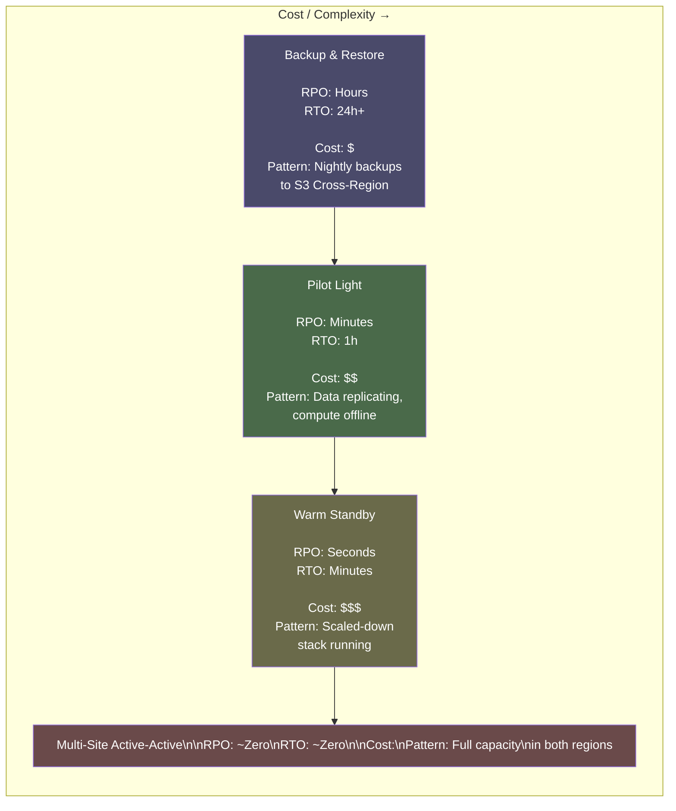
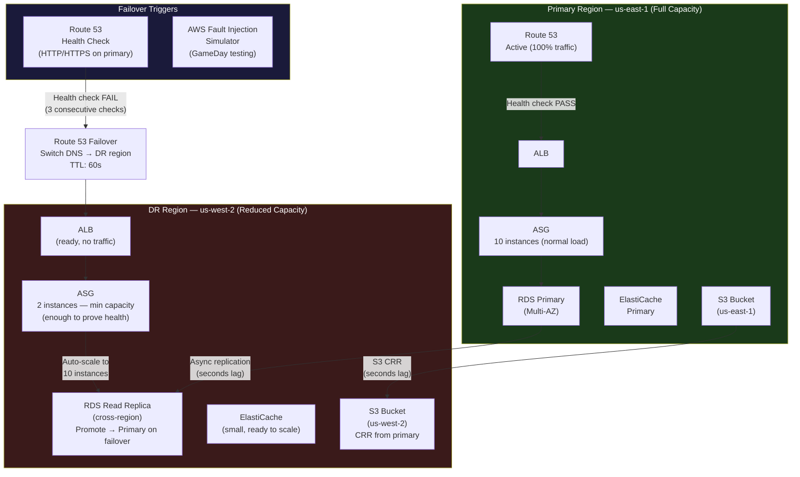

# AWS Disaster Recovery: RTO, RPO, and the 4 DR Strategies

> **Common Interview Questions**: "What's the difference between RTO and RPO, and how do they drive DR strategy selection?" / "Explain the 4 AWS DR strategies." / "Design a DR strategy for a financial system that can't lose more than 1 minute of data." / "Your primary region goes down — walk me through the failover process."

Common in: AWS Solutions Architect Professional, Senior Platform/SRE, and systems design interviews at financial services companies, healthcare, and FAANG.

---

## Quick Answer (30-second version)

- **RPO (Recovery Point Objective)** = How much data loss is acceptable? "We can lose up to 5 minutes of transactions." Drives your replication strategy.
- **RTO (Recovery Time Objective)** = How long can the system be down? "We must be back online within 30 minutes." Drives your compute standby strategy.
- **4 strategies, lowest to highest cost/complexity**:
  1. **Backup & Restore** — RPO: hours, RTO: 24h. Cheapest. Restore from S3/AWS Backup.
  2. **Pilot Light** — RPO: minutes, RTO: 1h. Core data replication running; compute needs to be launched.
  3. **Warm Standby** — RPO: seconds, RTO: minutes. Scaled-down version running in DR region.
  4. **Multi-Site Active-Active** — RPO: ~0, RTO: ~0. Full capacity in both regions. Most expensive.
- **Key rule**: RPO drives data layer decisions (replication frequency). RTO drives compute layer decisions (pre-provisioned capacity).

---

## Why This Matters / The Thought Process

DR is one of the most nuanced architecture questions because the **right answer depends on the business cost of downtime** — not on what's technically possible.

The real questions behind the question:
- Can you articulate the difference between RPO and RTO without confusing them?
- Do you understand that every reduction in RTO/RPO costs money — and that the engineering challenge is justifying that cost to the business?
- Can you describe the data replication mechanisms (S3 CRR, RDS cross-region replica, DynamoDB Global Tables) that underpin each strategy?
- Do you have a mental model for the failover orchestration — DNS, compute promotion, data layer promotion?

Think like an SA: A bank that loses 1 hour of transactions because they chose "Backup & Restore" to save $5,000/month will spend millions on recovery, regulatory fines, and customer losses. The DR strategy must match the business continuity SLA — not the infrastructure budget preference.

**The trap candidates fall into**: Saying "we should use Multi-Site Active-Active" for every workload. That's a 2x cost answer. The right answer is to ask "what are the RPO and RTO requirements?" and design the minimum viable DR that meets those requirements.

---

## Architecture: The 4 DR Strategies on the RTO/RPO Spectrum



---

## Architecture: Warm Standby (the Most Common "Right Answer" for Critical Systems)



---

## RPO vs RTO Deep Dive

**RPO — Recovery Point Objective**

RPO answers: "If a disaster happens right now, what's the oldest data we can recover to?"

- RPO = 0: No data loss. Requires **synchronous** replication (every write confirmed in both regions before acknowledging to client). High latency cost — adds network round-trip to every write.
- RPO = 1 minute: Up to 1 minute of data loss acceptable. Requires **asynchronous** replication with frequent checkpoints (transaction log shipping, S3 CRR, RDS replica with replication lag monitoring).
- RPO = 1 hour: Can restore from hourly backup. Much cheaper — just snapshot-based.
- RPO = 24 hours: Nightly backup restore.

**RTO — Recovery Time Objective**

RTO answers: "After a disaster is declared, how long do we have to be operational?"

- RTO = 0 (or seconds): Requires **pre-provisioned capacity** in DR region and **DNS failover** already pointing there. Traffic must be routable to DR with minimal DNS TTL.
- RTO = 15 minutes: Pre-provisioned data layer (DB replica already running), compute can be launched from AMIs.
- RTO = 1 hour: Core services in pilot light, compute needs to be launched and configured.
- RTO = 24 hours: Full restore from backup. Need time to provision, restore, test, and re-route.

**How they interact**: You can have mismatched RPO/RTO:
- RPO = 1 min, RTO = 1 hour: Data is replicated continuously, but you take your time recovering compute. The data is safe; you're slow to restart.
- RPO = 1 hour, RTO = 5 min: You have fast failover to a pre-provisioned standby, but that standby was only synced an hour ago. You lose data.

**Financial sector example**:

```
Trading Platform Requirements:
  RPO: 0 seconds (no trade data loss — regulatory requirement)
  RTO: 30 seconds (trading must resume quickly or market exposure locked)

→ Drives: Multi-Site Active-Active with synchronous replication
→ Cost: ~2x infrastructure cost, plus replication latency overhead

Core Banking Requirements:
  RPO: 1 minute (regulatory threshold for transaction data)
  RTO: 4 hours (overnight window acceptable for non-trading operations)

→ Drives: Warm Standby with RDS cross-region replica
→ Cost: ~1.3x infrastructure cost
```

---

## DR Strategy Comparison Table

| Strategy | RPO | RTO | Monthly Cost (relative) | What's Running in DR | What Needs to Start |
|---|---|---|---|---|---|
| Backup & Restore | Hours–Days | 24h+ | 1x (backup storage only) | S3 backups, snapshots | Everything: EC2, RDS restore, networking |
| Pilot Light | Minutes | 30–60 min | 1.1x | RDS replica, S3 CRR | EC2 fleet, load balancers, DNS update |
| Warm Standby | Seconds | 5–15 min | 1.3–1.5x | Scaled-down EC2 (2-3 instances), RDS replica | ASG scale-out to full capacity |
| Multi-Site Active-Active | ~0 | ~0 | 2x | Everything at full capacity | Nothing (traffic already routing there) |

---

## Strategy 1: Backup & Restore

**Best for**: Dev/test environments, non-critical applications, archival data, workloads with RPO of hours.

**Components**:
- AWS Backup: centralized backup management. Create backup plans with policies.
- S3 Cross-Region Replication (CRR): replicate S3 buckets to DR region automatically.
- RDS automated backups: stored in S3 within the region. Cross-region copy for DR.
- AMI copying to DR region: ensures you can launch compute.

**What people forget**: You don't just need the data in the DR region — you also need:
- VPC, subnets, security groups (recreate or pre-create with IaC)
- IAM roles (global, no action needed)
- Secrets Manager / Parameter Store values copied to DR region
- DNS records updated to point to DR resources
- Application configuration pointing to DR databases

**The "surprise cost"**: Data transfer for cross-region backup copies. Large databases (1TB+) incur significant data transfer costs for initial copy and ongoing incremental.

---

## Strategy 2: Pilot Light

**Best for**: Applications with RPO < 30 min and RTO < 1 hour. Core data is precious but compute can wait.

**Components**:
- RDS cross-region read replica: continuously replicating, can be promoted to primary.
- S3 CRR: all objects replicated to DR bucket.
- EC2 AMIs: pre-built and copied to DR region (for fast instance launch).
- Elastic IPs allocated (but not attached).
- Scaling documentation or runbook.

**Critical detail on RDS replica promotion**: When you promote a read replica to primary, it:
1. Stops replication immediately
2. Creates a new Multi-AZ standby (takes 2-5 minutes)
3. Becomes an independent primary with a new endpoint

Your application must be configured to use the new RDS endpoint (or use a CNAME/Route53 CNAME for the DB endpoint that you can update).

---

## Strategy 3: Warm Standby

**Best for**: Applications with RPO of seconds and RTO of 5-15 minutes. The most common enterprise choice for critical systems.

**Components**:
- All primary components running at reduced capacity in DR region
- ASG minimum capacity: 1-2 instances (prove the app works, not serve full traffic)
- RDS replica: running, being promoted on failover
- ElastiCache: small cluster (scaling during failover adds minutes)
- Route 53: health checks on primary, failover routing policy

**The warm standby failover sequence** (RTO depends on how fast each step completes):

```
T+0:    Route 53 health check detects primary failure (3 checks × 10s = 30s detection)
T+30s:  Route 53 failover routing kicks in. DNS TTL propagates (keep TTL at 60s).
T+90s:  Client DNS cache expires. Traffic starts hitting DR ALB.
T+90s:  Trigger RDS read replica promotion (takes 2-3 minutes for Multi-AZ setup)
T+4m:   RDS promoted. Update Parameter Store with new DB endpoint.
T+4m:   ASG scaling policy triggered — scale from 2 to 10 instances (EC2 launch ~2-3 min)
T+7m:   Full capacity online. Monitoring confirms healthy request rate.
```

RTO: ~7 minutes for a well-prepared warm standby.

---

## Strategy 4: Multi-Site Active-Active

**Best for**: Zero tolerance for downtime or data loss. Global user base requiring low-latency reads everywhere.

**Components**:
- Full infrastructure in 2+ regions, each serving production traffic.
- DynamoDB Global Tables: multi-master, sub-second replication between regions.
- Route 53 latency routing or geolocation routing to direct users to closest region.
- Global databases only: DynamoDB Global Tables, Aurora Global Database, or application-level conflict resolution.

**The hard problem**: **Data conflicts**. If user A updates their record in us-east-1 simultaneously with user B reading/writing the same record in eu-west-1, you have a conflict. DynamoDB Global Tables uses "last writer wins" — the higher-timestamp write wins. Aurora Global Database uses a single primary writer (one region owns writes, others are read replicas — not truly active-active for writes).

**True multi-master** is extremely difficult. Most "active-active" systems are actually:
- Active-active for reads (route reads to any region)
- Active-passive for writes (route writes to primary region, with regional ownership per user/shard)

---

## Key Components: Data Layer

### S3 Cross-Region Replication (CRR)

- Replicates objects automatically to a destination bucket in another region.
- **Requires versioning enabled** on both source and destination buckets.
- Replication lag: usually seconds, but there's no guaranteed SLA.
- S3 Replication Time Control (RTC): guarantees 99.99% of objects replicated within 15 minutes, with monitoring. Extra cost.
- **Does not replicate**: objects that existed before CRR was enabled (use S3 Batch Replication for existing objects), objects encrypted with SSE-C (customer-managed keys), lifecycle-expired objects, delete markers (optional).

### S3 CRR vs S3 Versioning vs S3 Multi-Region Access Points

| Feature | Use For |
|---|---|
| S3 Versioning | Protect against accidental deletes/overwrites (same region). Required for CRR. |
| S3 CRR | Replicate to another region for DR or latency. Asynchronous. |
| S3 Multi-Region Access Points (MRAP) | Single global S3 endpoint. Routes to lowest-latency bucket. Active-active reads. |

**MRAP** is underused — it's the active-active story for S3 object access. Clients don't need to know which region. Failover is automatic. Replication between regions via MRAP replication rules.

### RDS Cross-Region Read Replica

```
Primary (us-east-1, Multi-AZ)
    └── Read Replica (us-west-2) ← replication lag typically < 1 second
           └── On failover: promote to standalone primary
                  └── Takes 2-5 min for Multi-AZ creation
                  └── New endpoint: mydb.cluster-xyz.us-west-2.rds.amazonaws.com
```

**Replication lag monitoring**: Use CloudWatch metric `ReplicaLag`. Alert if > 30 seconds for RPO-sensitive workloads. High lag = more data loss on failover.

### DynamoDB Global Tables

- Multi-master replication across regions. Seconds-level replication lag.
- Last-writer-wins conflict resolution (by timestamp).
- Automatic failover: if one region goes down, traffic routes to other regions automatically.
- Cost: each region is independently billed. Replicated writes are charged in each region.
- Ideal for: session data, user preferences, feature flags, shopping carts — workloads that can tolerate eventual consistency and last-writer-wins.

---

## Key Components: DNS Failover with Route 53

Route 53 is the control plane for DR failover. Without automated DNS failover, RTO is manual.

**Health check configuration**:
- Check type: HTTP/HTTPS/TCP
- Check interval: 10 seconds (fast — extra cost) or 30 seconds (standard)
- Failure threshold: 3 consecutive failures before marking unhealthy
- **Minimum detection time**: 10s interval × 3 failures = 30 seconds

**Failover routing policy**:
- PRIMARY record: your main region ALB. Health check attached.
- SECONDARY record: your DR region ALB. No health check (always healthy — it's the fallback).
- Route 53 returns PRIMARY when healthy; SECONDARY when PRIMARY fails.
- TTL: set to 60 seconds on failover records (not 300s — you want failover to propagate fast).

**The TTL trap**: If your DNS TTL is 300 seconds, clients with cached DNS take up to 5 minutes to re-query after failover. With 60s TTL, worst case is 60 seconds from Route 53 update to client using new IP. Set short TTLs on your failover records.

---

## Code Example: Terraform — Route 53 Health Check + Failover Records

```hcl
# route53-dr-failover.tf

# Health check for primary region
resource "aws_route53_health_check" "primary" {
  fqdn              = "api-primary.example.com"
  port              = 443
  type              = "HTTPS"
  resource_path     = "/health"
  failure_threshold = 3
  request_interval  = 10  # Fast health checks (30s detection window)

  tags = {
    Name = "primary-region-health-check"
  }
}

# CloudWatch alarm on health check — for SNS alerting
resource "aws_cloudwatch_metric_alarm" "primary_health" {
  alarm_name          = "primary-region-unhealthy"
  comparison_operator = "LessThanThreshold"
  evaluation_periods  = 1
  metric_name         = "HealthCheckStatus"
  namespace           = "AWS/Route53"
  period              = 60
  statistic           = "Minimum"
  threshold           = 1

  dimensions = {
    HealthCheckId = aws_route53_health_check.primary.id
  }

  alarm_actions = [aws_sns_topic.dr_alerts.arn]
}

# Primary DNS record (Active)
resource "aws_route53_record" "api_primary" {
  zone_id = data.aws_route53_zone.main.zone_id
  name    = "api.example.com"
  type    = "A"

  alias {
    name                   = aws_lb.primary.dns_name
    zone_id                = aws_lb.primary.zone_id
    evaluate_target_health = true
  }

  failover_routing_policy {
    type = "PRIMARY"
  }

  set_identifier  = "primary"
  health_check_id = aws_route53_health_check.primary.id
}

# DR DNS record (Secondary - activated on primary failure)
resource "aws_route53_record" "api_secondary" {
  zone_id = data.aws_route53_zone.main.zone_id
  name    = "api.example.com"
  type    = "A"

  alias {
    name                   = aws_lb.dr.dns_name
    zone_id                = aws_lb.dr.zone_id
    evaluate_target_health = true
  }

  failover_routing_policy {
    type = "SECONDARY"
  }

  set_identifier = "secondary"
  # No health_check_id on secondary — always available as fallback
}

# RDS Cross-Region Read Replica in DR region
resource "aws_db_instance" "dr_replica" {
  provider = aws.dr_region  # us-west-2

  identifier             = "myapp-dr-replica"
  replicate_source_db    = aws_db_instance.primary.arn  # cross-region ARN
  instance_class         = "db.t3.medium"  # Smaller than primary — scale up on failover
  publicly_accessible    = false
  db_subnet_group_name   = aws_db_subnet_group.dr.name
  vpc_security_group_ids = [aws_security_group.rds_dr.id]

  # Auto-scaling storage matches primary
  max_allocated_storage = 1000

  tags = {
    Role   = "dr-replica"
    Promote = "on-failover"
  }
}
```

---

## Code Example: Lambda for Automated DR Failover Orchestration

```js
// dr-failover-orchestrator.js
// Triggered by: CloudWatch Alarm → SNS → Lambda
// Purpose: Orchestrate warm standby failover when primary region degrades

const AWS = require('@aws-sdk/client-rds');
const { RDSClient, PromoteReadReplicaCommand } = require('@aws-sdk/client-rds');
const { AutoScalingClient, UpdateAutoScalingGroupCommand } = require('@aws-sdk/client-auto-scaling');
const { SSMClient, PutParameterCommand } = require('@aws-sdk/client-ssm');
const { SNSClient, PublishCommand } = require('@aws-sdk/client-sns');

const DR_REGION = 'us-west-2';
const rds = new RDSClient({ region: DR_REGION });
const asg = new AutoScalingClient({ region: DR_REGION });
const ssm = new SSMClient({ region: DR_REGION });
const sns = new SNSClient({ region: 'us-east-1' });

const CONFIG = {
  rdsReplicaIdentifier: 'myapp-dr-replica',
  asgName: 'myapp-dr-asg',
  targetCapacity: 10,        // Scale DR ASG to full capacity
  ssmDbEndpointKey: '/myapp/dr/db-endpoint',
  alertTopicArn: process.env.ALERT_TOPIC_ARN,
};

exports.handler = async (event) => {
  console.log('DR Failover triggered:', JSON.stringify(event, null, 2));

  const steps = [];

  try {
    // Step 1: Promote RDS read replica to standalone primary
    console.log('Step 1: Promoting RDS read replica...');
    await rds.send(new PromoteReadReplicaCommand({
      DBInstanceIdentifier: CONFIG.rdsReplicaIdentifier,
      BackupRetentionPeriod: 7,
    }));
    steps.push({ step: 'RDS promotion initiated', status: 'OK', time: new Date().toISOString() });

    // Step 2: Scale up DR ASG to full capacity
    console.log('Step 2: Scaling DR ASG to full capacity...');
    await asg.send(new UpdateAutoScalingGroupCommand({
      AutoScalingGroupName: CONFIG.asgName,
      MinSize: CONFIG.targetCapacity,
      DesiredCapacity: CONFIG.targetCapacity,
    }));
    steps.push({ step: 'ASG scale-out initiated', status: 'OK', capacity: CONFIG.targetCapacity });

    // Step 3: Wait for RDS to be available (polling)
    console.log('Step 3: Waiting for RDS promotion to complete...');
    const dbEndpoint = await waitForRDSAvailable(CONFIG.rdsReplicaIdentifier);
    steps.push({ step: 'RDS promoted and available', endpoint: dbEndpoint });

    // Step 4: Update SSM Parameter Store with new DB endpoint
    // Applications read their DB endpoint from SSM — no config redeploy needed
    await ssm.send(new PutParameterCommand({
      Name: CONFIG.ssmDbEndpointKey,
      Value: dbEndpoint,
      Type: 'String',
      Overwrite: true,
    }));
    steps.push({ step: 'SSM DB endpoint updated', endpoint: dbEndpoint });

    // Step 5: Send incident notification
    await sns.send(new PublishCommand({
      TopicArn: CONFIG.alertTopicArn,
      Subject: 'DR FAILOVER COMPLETED — myapp',
      Message: JSON.stringify({
        severity: 'CRITICAL',
        event: 'DR_FAILOVER_COMPLETED',
        drRegion: DR_REGION,
        steps,
        timestamp: new Date().toISOString(),
        action_required: [
          'Verify application health in DR region',
          'Monitor RDS replication lag (now standalone — no replica)',
          'Begin primary region recovery',
          'Plan failback when primary is healthy',
        ],
      }, null, 2),
    }));

    return { statusCode: 200, steps };

  } catch (error) {
    console.error('DR failover step failed:', error);

    // Alert on failure — manual intervention required
    await sns.send(new PublishCommand({
      TopicArn: CONFIG.alertTopicArn,
      Subject: 'DR FAILOVER FAILED — MANUAL INTERVENTION REQUIRED',
      Message: `DR failover failed at step: ${JSON.stringify(steps)}\nError: ${error.message}\nStack: ${error.stack}`,
    }));

    throw error;
  }
};

async function waitForRDSAvailable(dbIdentifier, maxWaitMs = 300000) {
  const { waitUntilDBInstanceAvailable } = require('@aws-sdk/client-rds');

  await waitUntilDBInstanceAvailable(
    { client: rds, maxWaitTime: maxWaitMs / 1000 },
    { DBInstanceIdentifier: dbIdentifier }
  );

  // Fetch the new endpoint
  const { DescribeDBInstancesCommand } = require('@aws-sdk/client-rds');
  const response = await rds.send(new DescribeDBInstancesCommand({
    DBInstanceIdentifier: dbIdentifier,
  }));

  return response.DBInstances[0].Endpoint.Address;
}
```

---

## Real-World Scenario: Banking System — RPO 1 min, RTO 5 min

**Requirements from the business**:
- RPO: 1 minute (regulatory threshold for transaction data loss)
- RTO: 5 minutes (SLA with payment networks — delayed ACH processing = regulatory issue)
- Compliance: SOC2 Type II, PCI DSS

**Architecture decision**:

Warm Standby (with aggressive configuration) is the answer. Here's why Active-Active is wrong for this scenario: the application uses PostgreSQL for financial transactions. You can't have two masters writing financial records simultaneously without complex conflict resolution (which introduces bugs and audit complexity). Synchronous multi-master would be needed for RPO=0, but RPO=1 minute with async RDS replica is achievable.

**The architecture**:

```
Primary (us-east-1):
  - RDS PostgreSQL Multi-AZ (synchronous within region)
  - Aurora with automated failover (within region)
  - EC2 ASG: 10 instances, t3.large
  - S3 for document storage
  - ElastiCache for session tokens

DR (us-west-2) — Warm Standby:
  - RDS Cross-Region Read Replica (async, monitored: alert if lag > 30s)
  - ASG: 2 instances running (health checks pass, not serving traffic)
  - S3 with CRR + S3 RTC (Replication Time Control) for < 15min guarantee
  - ElastiCache: 1 node (scale up on failover)

DNS:
  - Route 53 failover routing, TTL: 60s
  - Health check: HTTPS /health/deep (checks DB connectivity, not just HTTP)
  - Check interval: 10s, threshold: 3 failures → 30s detection

RTO breakdown:
  T+30s:  Failure detected, Route 53 failover initiated
  T+90s:  DNS propagation complete, traffic hitting DR ALB
  T+90s:  RDS promotion initiated (async)
  T+3m:   RDS promoted (Multi-AZ setup complete)
  T+3m:   ASG scale from 2 to 10 instances
  T+5m:   Instances healthy, full capacity serving

RPO analysis:
  Replication lag typically < 5 seconds
  In worst case (network congestion): up to 60 seconds lag
  Monitor ReplicaLag metric, alert at > 30s, page at > 60s
```

**What to verify in GameDay**:
1. Force terminate primary RDS → does Route 53 failover trigger?
2. Promote read replica manually → does app reconnect to new endpoint?
3. Run load test at 50% capacity → does DR ASG scale correctly?
4. Simulate S3 region failure → does MRAP route to DR bucket?

---

## Chaos Engineering: Testing DR Before You Need It

**AWS Fault Injection Simulator (FIS)** lets you run controlled failure experiments:

```json
{
  "description": "Simulate AZ failure in us-east-1",
  "targets": {
    "ec2-instances-az-a": {
      "resourceType": "aws:ec2:instance",
      "resourceTags": {"Environment": "production", "AZ": "us-east-1a"},
      "selectionMode": "ALL"
    }
  },
  "actions": {
    "stop-instances": {
      "actionId": "aws:ec2:stop-instances",
      "targets": { "Instances": "ec2-instances-az-a" },
      "parameters": {}
    }
  },
  "stopConditions": [
    {
      "source": "aws:cloudwatch:alarm",
      "value": "arn:aws:cloudwatch:us-east-1:123456789:alarm/ErrorRateCritical"
    }
  ],
  "roleArn": "arn:aws:iam::123456789:role/FISRole"
}
```

**GameDay discipline**: Schedule quarterly DR tests. Document:
- What failed
- Actual RTO/RPO achieved vs target
- Manual steps taken (automation gaps)
- Post-incident improvements

---

## Common Interview Follow-ups

**Q: "S3 CRR vs S3 Versioning — when do you need each?"**

A: They solve different problems. Versioning protects against accidental overwrites and deletes within a single region (you can roll back). CRR copies objects to another region for DR or compliance. CRR **requires** versioning to be enabled. In practice, for DR you always need both.

**Q: "Can you achieve RPO=0 with RDS?"**

A: Not with standard RDS cross-region replication — it's asynchronous. For RPO=0 you need: synchronous replication (which Aurora Multi-Master provided in limited form, now deprecated), or application-level dual-write to two regions (complex and error-prone), or DynamoDB Global Tables (which is multi-master but not relational). The honest answer: true RPO=0 for relational writes is extremely difficult. Most "RPO=0" claims are actually very small (sub-second) RPOs with async replication.

**Q: "What's the difference between HA (High Availability) and DR (Disaster Recovery)?"**

A: HA is protection against failures within a region (AZ failure). Multi-AZ RDS, Multi-AZ ALB, cross-AZ ASG are HA features. DR is protection against entire region failure. They're complementary: you should have both HA (for common failures) and DR (for rare but catastrophic failures). HA reduces RTO within a region to seconds. DR is for when an entire region is unavailable.

**Q: "How do you handle the database failover endpoint problem?"**

A: Three approaches:
1. Application reads DB endpoint from SSM Parameter Store — update SSM on failover, application restarts pick it up.
2. Route 53 CNAME for the database hostname (`db.internal.example.com`) — update CNAME on failover.
3. Application connection pool with retry logic — catches connection errors, re-resolves DNS on reconnect.
The worst approach: hardcoded connection strings in application config.

**Q: "What is AWS Backup and when would you use it over custom backup scripts?"**

A: AWS Backup is centralized, policy-driven backup management across multiple AWS services (EC2, RDS, DynamoDB, EFS, S3). Use it when: managing backups across many accounts/regions (AWS Organizations integration), needing compliance reporting (backup audit manager), wanting unified restore workflow. Custom scripts are for cases where you need logic AWS Backup doesn't support (e.g., pre-backup database flush, custom restore logic).

---

## AWS Certification Exam Tips

- **RTO vs RPO**: RTO is about time to recovery (compute/application layer). RPO is about data loss (data/replication layer). The exam will give you a scenario and ask which strategy is appropriate based on stated RTO/RPO values.
- **DR strategies by name**: The exam uses the exact AWS naming: Backup & Restore, Pilot Light, Warm Standby, Multi-Site Active-Active. Know the cost and time characteristics of each.
- **S3 CRR requires versioning**: This is a frequent distractor. The answer to "what do you need before enabling CRR?" is always "versioning on both buckets."
- **DynamoDB Global Tables = Active-Active**: This is the AWS-native answer for multi-region active-active with automatic replication. No custom replication needed.
- **Aurora Global Database vs Global Tables**: Aurora Global = single writer region (reads anywhere, writes to primary). DynamoDB Global Tables = multi-master writes anywhere.
- **Route 53 health check minimum interval**: 10 seconds (with fast health checks, extra cost). Default is 30 seconds. Important for calculating minimum detection time in RTO analysis.
- **RDS promote read replica**: When you promote, replication stops immediately. The new primary accepts writes. The old primary (if it recovers) is now independent — you'd need to re-establish replication or run both as independent databases.
- **AWS Backup cross-region**: Backup plans can include cross-region copy rules. This is how you get Backup & Restore DR with AWS Backup rather than manual snapshot copy scripts.
- **Pilot Light compute**: The "core" that stays on in pilot light is the **data layer** (RDS, ElastiCache with data). Compute (EC2) is off. "Pilot light" is the metaphor — the flame that ignites the furnace (the full stack).

---

## Key Takeaways

1. **RPO drives replication design. RTO drives compute standby design.** Never conflate them.
2. **The 4 strategies form a spectrum** — more availability = more cost. Always match strategy to business RPO/RTO requirements, not to what's technically impressive.
3. **Warm Standby is the most common "right answer"** for critical production systems — good RTO/RPO at ~1.3x cost.
4. **Route 53 failover is the control plane** — health checks detect failure, failover routing redirects traffic. Short TTLs (60s) are essential.
5. **RDS promotion takes time** — 2-5 minutes for Multi-AZ setup after promotion. Factor this into your RTO calculation.
6. **DynamoDB Global Tables = Active-Active with multi-master.** The only AWS-native true active-active database. Aurora Global = active-passive (single writer).
7. **Test your DR**. Untested DR is not DR — it's a plan. Use AWS FIS and scheduled GameDays to verify RTO/RPO assumptions.
8. **S3 CRR requires versioning on both buckets.** This is a prerequisite exam candidates frequently miss.
