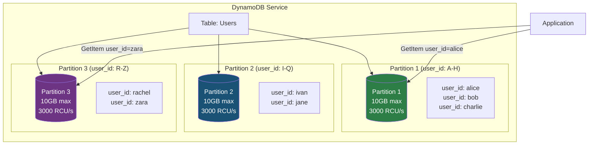
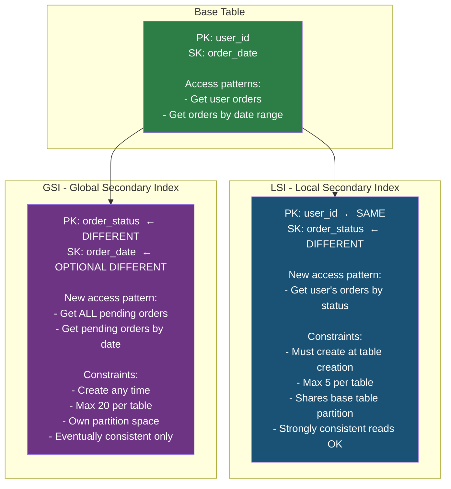
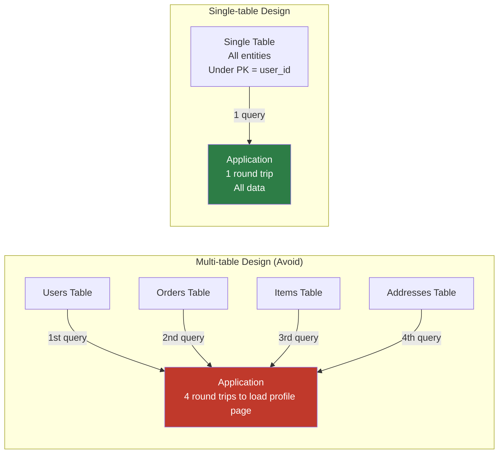
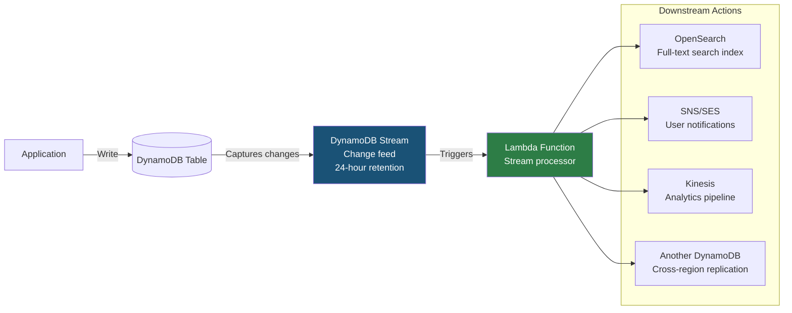
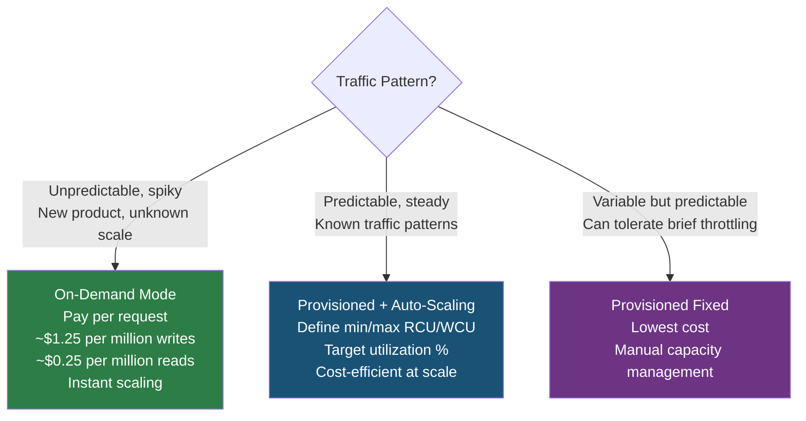
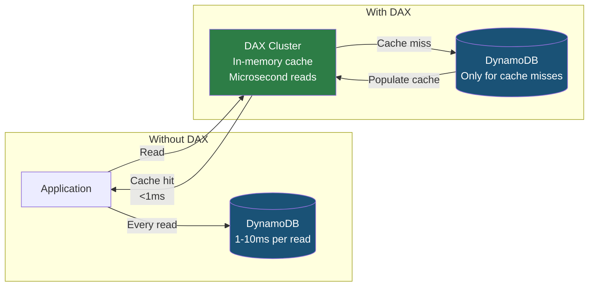

# AWS DynamoDB: Partition Keys, GSI/LSI, and NoSQL Design

## Question

**"How do you choose a partition key for DynamoDB? What happens if you pick a bad one?"**

Common in: AWS Solutions Architect, FAANG backend, system design with NoSQL requirements

---

## Quick Answer (30-second version)

- **DynamoDB** = Fully managed NoSQL key-value/document store. Infinite scale, single-digit millisecond latency, no schema enforcement.
- **Partition key** = The key that determines which physical server (partition) stores your data. Bad choice → hot partition → throttling → everything breaks.
- **Good partition key**: High cardinality, even distribution. `user_id` is good. `country` is bad (200 countries, most traffic from US).
- **GSI** (Global Secondary Index): Different partition key, optional sort key. Eventually consistent reads. Created any time.
- **LSI** (Local Secondary Index): Same partition key, different sort key. Strongly consistent possible. Must be created at table creation.
- **Single-table design**: Store all entity types in one DynamoDB table. Counter-intuitive but correct for DynamoDB.
- **DAX**: In-memory cache for DynamoDB. Microsecond reads. Write-through caching. Drop-in replacement.

---

## Why This Matters — The Thought Process

DynamoDB interview questions test whether you understand the fundamental constraint: **DynamoDB is only as fast as your slowest hot partition.**

AWS splits your table data across partitions. Each partition has a hard limit:
- 3,000 RCUs (Read Capacity Units) per second
- 1,000 WCUs (Write Capacity Units) per second
- 10 GB of data

If all your traffic goes to one partition key value, you have a "hot partition" — you've built a system that can only use 1/Nth of your provisioned capacity.

**The mental model**: Partition key = routing key. Think of partitions as servers in a consistent hash ring. If all traffic says "route me to server 3", server 3 is overwhelmed while servers 1, 2, 4, and 5 sit idle.

This is why experienced engineers get deep into partition key design before writing any code.

---

## Architecture: DynamoDB Storage Model



**How DynamoDB routes a request:**
1. Take the partition key value (e.g., `user_id = "alice"`)
2. Hash it using an internal consistent hashing algorithm
3. Determine which partition that hash maps to
4. Read/write data from that specific partition

This means: **all items with the same partition key value always live on the same partition.** This is both a feature (you can query all items for a user efficiently) and a footgun (one hot user can saturate a partition).

---

## Partition Key Design: Good vs Bad

### Bad Partition Keys (Hot Partitions)

```javascript
// BAD: Country as partition key
// US has 50% of your traffic → "US" partition gets throttled
// 200 countries but 10 receive 95% of traffic
{
  PK: "US",               // Hot partition!
  SK: "user:alice",
  email: "alice@example.com"
}

// BAD: Status as partition key
// "active" gets 99% of writes, "archived" gets 1%
{
  PK: "active",           // All writes go here!
  SK: "order:12345",
  amount: 99.99
}

// BAD: Date (day) as partition key
// Today's date gets ALL writes. Yesterday's partition sits idle.
{
  PK: "2026-03-20",       // Write hotspot!
  SK: "event:xyz",
  type: "page_view"
}

// BAD: Boolean partition key
// Only 2 values — only 2 partitions. Most tables need more.
{
  PK: "true",             // All active items here
  SK: "subscription:123",
}
```

### Good Partition Keys (Even Distribution)

```javascript
// GOOD: User ID (UUID or high-cardinality ID)
// Millions of users → millions of partition values → even distribution
{
  PK: "user#7f3a2b1c-4e5d-6f7a-8b9c-0d1e2f3a4b5c",
  SK: "profile",
  email: "alice@example.com",
  country: "US"
}

// GOOD: Order ID for order table
{
  PK: "order#ord-2026032001234",
  SK: "details",
  userId: "user#abc123",
  total: 149.99
}

// GOOD: Session ID for session store
{
  PK: "session#sess-7f3a2b1c",
  SK: "data",
  userId: "user#abc123",
  expiresAt: 1742500000
}
```

### Write Sharding for Hot Partitions

```javascript
// Problem: You MUST use a low-cardinality key (e.g., game leaderboard by game ID)
// There are only 100 game types — that's only 100 partitions, easily hot

// Solution: Add a random suffix (shard ID) to artificially distribute writes
const NUM_SHARDS = 20;

function getShardedKey(gameId) {
  const shardId = Math.floor(Math.random() * NUM_SHARDS);
  return `game#${gameId}#shard${shardId.toString().padStart(2, '0')}`;
}

// Write: distribute across shards
async function incrementGameScore(gameId, userId, points) {
  const shardedPK = getShardedKey(gameId);  // game#chess#shard07

  await dynamodb.update({
    TableName: 'Leaderboard',
    Key: { PK: shardedPK, SK: `player#${userId}` },
    UpdateExpression: 'ADD score :pts',
    ExpressionAttributeValues: { ':pts': points }
  }).promise();
}

// Read: must query ALL shards and aggregate
async function getTopPlayers(gameId, limit = 10) {
  const shardQueries = [];

  for (let i = 0; i < NUM_SHARDS; i++) {
    const shardId = i.toString().padStart(2, '0');
    shardQueries.push(
      dynamodb.query({
        TableName: 'Leaderboard',
        KeyConditionExpression: 'PK = :pk',
        ExpressionAttributeValues: {
          ':pk': `game#${gameId}#shard${shardId}`
        },
        ScanIndexForward: false,          // descending order
        Limit: limit
      }).promise()
    );
  }

  const results = await Promise.all(shardQueries);
  const allPlayers = results.flatMap(r => r.Items);

  // Merge and sort in application layer
  return allPlayers
    .sort((a, b) => b.score - a.score)
    .slice(0, limit);
}
```

---

## Composite Keys: PK + SK for Hierarchical Data

The **sort key** (SK) transforms DynamoDB from a flat key-value store into a hierarchical query engine. This is where DynamoDB's power comes from.

```
Composite Key Pattern:
  PK = entity identifier (who/what)
  SK = entity relationship + ordering (what action/child entity)

  Key queries enabled by composite keys:
  - Get exactly one item:      PK = "user#123", SK = "profile"
  - Get all items for user:    PK = "user#123", SK begins_with("")
  - Get user's orders:         PK = "user#123", SK begins_with("order#")
  - Get recent orders:         PK = "user#123", SK > "order#2026-01-01"
  - Get order's items:         PK = "order#456", SK begins_with("item#")
```

```javascript
// Example: E-commerce single-table with composite keys
const tableItems = [
  // User profile
  { PK: "user#u123", SK: "profile",           email: "alice@example.com", name: "Alice" },

  // User's orders (sort by date for recency)
  { PK: "user#u123", SK: "order#2026-03-20#ord-001",  total: 149.99, status: "shipped" },
  { PK: "user#u123", SK: "order#2026-03-15#ord-002",  total: 29.99,  status: "delivered" },

  // Order details (different PK — order itself)
  { PK: "order#ord-001", SK: "details",        userId: "u123", total: 149.99 },
  { PK: "order#ord-001", SK: "item#prod-A",    quantity: 2, price: 49.99 },
  { PK: "order#ord-001", SK: "item#prod-B",    quantity: 1, price: 50.01 },

  // User's addresses
  { PK: "user#u123", SK: "address#home",       street: "123 Main St", city: "New York" },
  { PK: "user#u123", SK: "address#work",       street: "456 Office Ave", city: "New York" },
];

// Query: Get all of user's recent orders (most recent first)
const recentOrders = await dynamodb.query({
  TableName: 'ecommerce',
  KeyConditionExpression: 'PK = :pk AND begins_with(SK, :prefix)',
  ExpressionAttributeValues: {
    ':pk': 'user#u123',
    ':prefix': 'order#'
  },
  ScanIndexForward: false,    // Descending SK = newest first
  Limit: 10
}).promise();

// Query: Get all items in an order
const orderItems = await dynamodb.query({
  TableName: 'ecommerce',
  KeyConditionExpression: 'PK = :pk AND begins_with(SK, :prefix)',
  ExpressionAttributeValues: {
    ':pk': 'order#ord-001',
    ':prefix': 'item#'
  }
}).promise();
```

---

## GSI vs LSI — Architecture and Query Patterns



### GSI vs LSI Decision Guide

| Question | LSI | GSI |
|----------|-----|-----|
| Can query without knowing partition key? | No | Yes |
| Strongly consistent reads? | Yes | No (eventually consistent) |
| Create after table exists? | No | Yes |
| Shares partition with base table? | Yes | No (own partitions) |
| Different partition key from base? | No | Yes |
| Max per table | 5 | 20 |
| Best for | Alternative sort orders within a user's data | Cross-user queries, admin dashboards, reporting |

**Interview decision rule**:
- "I know the user, but want to sort/filter differently" → LSI
- "I don't know the user, I want to query by a different attribute entirely" → GSI

### GSI in Practice

```javascript
// Scenario: Find all orders with status "pending" across all users
// Base table PK = user_id. You don't know the user_id.
// GSI on (status, created_at) solves this.

// Table definition with GSI
const tableParams = {
  TableName: 'Orders',
  KeySchema: [
    { AttributeName: 'user_id', KeyType: 'HASH' },
    { AttributeName: 'order_date', KeyType: 'RANGE' }
  ],
  AttributeDefinitions: [
    { AttributeName: 'user_id', AttributeType: 'S' },
    { AttributeName: 'order_date', AttributeType: 'S' },
    { AttributeName: 'status', AttributeType: 'S' },
    { AttributeName: 'created_at', AttributeType: 'S' }
  ],
  GlobalSecondaryIndexes: [{
    IndexName: 'status-createdAt-index',
    KeySchema: [
      { AttributeName: 'status', KeyType: 'HASH' },
      { AttributeName: 'created_at', KeyType: 'RANGE' }
    ],
    Projection: { ProjectionType: 'ALL' },   // or KEYS_ONLY or INCLUDE
    BillingMode: 'PAY_PER_REQUEST'
  }],
  BillingMode: 'PAY_PER_REQUEST'
};

// Query: Get all pending orders, newest first
async function getPendingOrders(limit = 50) {
  const result = await dynamodb.query({
    TableName: 'Orders',
    IndexName: 'status-createdAt-index',
    KeyConditionExpression: '#status = :status',
    ExpressionAttributeNames: { '#status': 'status' },  // 'status' is a reserved word
    ExpressionAttributeValues: { ':status': 'pending' },
    ScanIndexForward: false,     // newest first
    Limit: limit
  }).promise();

  return result.Items;
}

// Query: Get pending orders from last 24 hours
async function getRecentPendingOrders() {
  const yesterday = new Date(Date.now() - 86400000).toISOString();

  const result = await dynamodb.query({
    TableName: 'Orders',
    IndexName: 'status-createdAt-index',
    KeyConditionExpression: '#status = :status AND created_at > :since',
    ExpressionAttributeNames: { '#status': 'status' },
    ExpressionAttributeValues: {
      ':status': 'pending',
      ':since': yesterday
    }
  }).promise();

  return result.Items;
}
```

### LSI in Practice

```javascript
// Scenario: User wants to see their orders sorted by status (not date)
// Base table: PK = user_id, SK = order_date
// LSI: PK = user_id (same), SK = status (different)

const tableWithLSI = {
  TableName: 'Orders',
  KeySchema: [
    { AttributeName: 'user_id', KeyType: 'HASH' },
    { AttributeName: 'order_date', KeyType: 'RANGE' }
  ],
  LocalSecondaryIndexes: [{
    IndexName: 'user-status-index',
    KeySchema: [
      { AttributeName: 'user_id', KeyType: 'HASH' },     // same PK
      { AttributeName: 'status', KeyType: 'RANGE' }       // different SK
    ],
    Projection: { ProjectionType: 'ALL' }
  }],
  AttributeDefinitions: [
    { AttributeName: 'user_id', AttributeType: 'S' },
    { AttributeName: 'order_date', AttributeType: 'S' },
    { AttributeName: 'status', AttributeType: 'S' }
  ],
  BillingMode: 'PAY_PER_REQUEST'
};

// Query: Get all shipped orders for a specific user
async function getUserShippedOrders(userId) {
  const result = await dynamodb.query({
    TableName: 'Orders',
    IndexName: 'user-status-index',
    KeyConditionExpression: 'user_id = :uid AND #status = :status',
    ExpressionAttributeNames: { '#status': 'status' },
    ExpressionAttributeValues: {
      ':uid': userId,
      ':status': 'shipped'
    },
    ConsistentRead: true   // LSI supports strongly consistent reads!
  }).promise();

  return result.Items;
}
```

---

## Single-Table Design

DynamoDB experts advocate for storing multiple entity types in one table. This sounds wrong if you're thinking in relational terms — but it's the correct pattern for DynamoDB.

**Why single-table?**
- DynamoDB joins don't exist. The "join" is done in a single query by having related entities under the same partition key.
- Multiple tables = multiple round trips = higher latency.
- Single table = one query fetches all related data for an entity.



```javascript
// single-table-design.js
// All entities in one table: Users, Orders, Products, Reviews

const { DynamoDBClient } = require('@aws-sdk/client-dynamodb');
const { DynamoDBDocumentClient, PutCommand, GetCommand,
        QueryCommand, TransactWriteCommand } = require('@aws-sdk/lib-dynamodb');

const client = new DynamoDBDocumentClient(new DynamoDBClient({ region: 'us-east-1' }));
const TABLE = 'AppData';

// ========== USER OPERATIONS ==========

async function createUser(userId, email, name) {
  await client.send(new PutCommand({
    TableName: TABLE,
    Item: {
      PK: `user#${userId}`,
      SK: 'profile',
      GSI1PK: `email#${email}`,          // GSI for email lookup
      GSI1SK: `user#${userId}`,
      entityType: 'USER',
      email,
      name,
      createdAt: new Date().toISOString()
    }
  }));
}

async function getUser(userId) {
  const result = await client.send(new GetCommand({
    TableName: TABLE,
    Key: { PK: `user#${userId}`, SK: 'profile' }
  }));
  return result.Item;
}

// ========== ORDER OPERATIONS ==========

async function createOrder(userId, orderId, items, total) {
  const now = new Date().toISOString();

  // Transactionally create order + update user's order count
  await client.send(new TransactWriteCommand({
    TransactItems: [
      // Order record (queryable from order ID)
      {
        Put: {
          TableName: TABLE,
          Item: {
            PK: `order#${orderId}`,
            SK: 'details',
            GSI1PK: `user#${userId}`,           // GSI: get all orders for user
            GSI1SK: `order#${now}#${orderId}`,  // Sort by date
            entityType: 'ORDER',
            userId,
            total,
            status: 'pending',
            createdAt: now
          }
        }
      },
      // Order items
      ...items.map(item => ({
        Put: {
          TableName: TABLE,
          Item: {
            PK: `order#${orderId}`,
            SK: `item#${item.productId}`,
            entityType: 'ORDER_ITEM',
            productId: item.productId,
            quantity: item.quantity,
            price: item.price
          }
        }
      }))
    ]
  }));
}

// Get all orders for a user via GSI (user_id → orders)
async function getUserOrders(userId, limit = 20) {
  const result = await client.send(new QueryCommand({
    TableName: TABLE,
    IndexName: 'GSI1',
    KeyConditionExpression: 'GSI1PK = :pk AND begins_with(GSI1SK, :prefix)',
    ExpressionAttributeValues: {
      ':pk': `user#${userId}`,
      ':prefix': 'order#'
    },
    ScanIndexForward: false,      // newest first
    Limit: limit
  }));
  return result.Items;
}

// Get order + all its items in ONE query
async function getOrderWithItems(orderId) {
  const result = await client.send(new QueryCommand({
    TableName: TABLE,
    KeyConditionExpression: 'PK = :pk',
    ExpressionAttributeValues: {
      ':pk': `order#${orderId}`
    }
  }));

  const items = result.Items;
  const details = items.find(i => i.SK === 'details');
  const orderItems = items.filter(i => i.SK.startsWith('item#'));

  return { ...details, items: orderItems };
}
```

---

## DynamoDB Streams + Lambda: Event-Driven Patterns

**DynamoDB Streams** captures a time-ordered sequence of item-level changes. Every insert, update, or delete creates a stream record.



```javascript
// dynamodb-streams-processor.js
// Lambda triggered by DynamoDB Stream — processes changes for search indexing

const { Client } = require('@opensearch-project/opensearch');
const searchClient = new Client({ node: process.env.OPENSEARCH_ENDPOINT });

exports.handler = async (event) => {
  console.log(`Processing ${event.Records.length} stream records`);

  const operations = [];

  for (const record of event.Records) {
    const eventName = record.eventName;  // INSERT, MODIFY, REMOVE

    // Only process user profile changes
    if (!record.dynamodb.Keys.SK?.S === 'profile') continue;

    if (eventName === 'REMOVE') {
      // Item deleted — remove from search index
      operations.push({
        delete: { _index: 'users', _id: record.dynamodb.Keys.PK.S }
      });
    } else {
      // INSERT or MODIFY — upsert into search index
      const newImage = record.dynamodb.NewImage;

      if (!newImage) continue;

      operations.push(
        { index: { _index: 'users', _id: newImage.PK.S } },
        {
          userId: newImage.PK.S,
          name: newImage.name?.S,
          email: newImage.email?.S,
          updatedAt: newImage.updatedAt?.S
        }
      );
    }
  }

  if (operations.length > 0) {
    const response = await searchClient.bulk({ body: operations });
    if (response.body.errors) {
      console.error('Some indexing operations failed:', JSON.stringify(response.body.items));
    }
  }

  return { statusCode: 200, processed: event.Records.length };
};

// Stream event structure (for understanding):
/*
{
  "Records": [{
    "eventName": "INSERT",
    "dynamodb": {
      "Keys": { "PK": { "S": "user#u123" }, "SK": { "S": "profile" } },
      "NewImage": {
        "PK": { "S": "user#u123" },
        "SK": { "S": "profile" },
        "name": { "S": "Alice" },
        "email": { "S": "alice@example.com" }
      },
      "OldImage": null   // null for INSERT, populated for MODIFY/REMOVE
    }
  }]
}
*/
```

---

## Capacity Modes: On-Demand vs Provisioned



**Cost comparison at scale:**
```
On-Demand:
  1 million writes/day × $1.25/million = $1.25/day = $37.50/month
  10 million reads/day × $0.25/million = $2.50/day = $75/month
  Total: ~$112.50/month

Provisioned (1000 WCU, 5000 RCU):
  1000 WCU × $0.00065/WCU-hour × 730 hours = $474.50/month
  5000 RCU × $0.00013/RCU-hour × 730 hours = $474.50/month
  Total: ~$949/month

Wait — provisioned costs MORE at this scale? Yes, unless you use auto-scaling.
With auto-scaling (min 100 WCU / max 1000 WCU, scale at 70%), you'd average much less.
The crossover point is typically around sustained, predictable high traffic.
```

---

## DAX (DynamoDB Accelerator)

**Problem**: DynamoDB is single-digit milliseconds. You need microseconds.
**Solution**: DAX — in-memory cache that sits in front of DynamoDB.



**DAX key facts:**
- Write-through: DAX writes to both cache and DynamoDB synchronously.
- Item cache: Caches GetItem and BatchGetItem results.
- Query cache: Caches Query and Scan results (based on parameters).
- NOT compatible with strongly consistent reads (those bypass DAX).
- DAX is VPC-only — it doesn't have a public endpoint.
- Node sizes: dax.r4.large (13.5GB) up to dax.r4.16xlarge (488GB).

**When NOT to use DAX:**
- Write-heavy workloads (DAX doesn't help writes, and you pay for the cluster).
- Strongly consistent reads required (they bypass DAX anyway).
- Large result sets (DAX caches individual items efficiently, not large scans).
- Already using ElastiCache — don't double-cache.

---

## DynamoDB Transactions

DynamoDB supports ACID-like transactions across multiple items and tables.

```javascript
// transactions.js
// Use case: Transfer credits between two users atomically

async function transferCredits(fromUserId, toUserId, amount) {
  const { TransactWriteCommand } = require('@aws-sdk/lib-dynamodb');

  try {
    await client.send(new TransactWriteCommand({
      TransactItems: [
        // Deduct from sender (with condition: must have sufficient balance)
        {
          Update: {
            TableName: 'Users',
            Key: { PK: `user#${fromUserId}`, SK: 'wallet' },
            UpdateExpression: 'SET balance = balance - :amount',
            ConditionExpression: 'balance >= :amount',    // fails if insufficient
            ExpressionAttributeValues: { ':amount': amount }
          }
        },
        // Add to recipient
        {
          Update: {
            TableName: 'Users',
            Key: { PK: `user#${toUserId}`, SK: 'wallet' },
            UpdateExpression: 'SET balance = balance + :amount',
            ExpressionAttributeValues: { ':amount': amount }
          }
        },
        // Record transaction
        {
          Put: {
            TableName: 'Transactions',
            Item: {
              PK: `tx#${Date.now()}-${fromUserId}`,
              SK: 'details',
              from: fromUserId,
              to: toUserId,
              amount,
              createdAt: new Date().toISOString()
            }
          }
        }
      ]
    }));

    console.log(`Transferred ${amount} credits from ${fromUserId} to ${toUserId}`);
  } catch (err) {
    if (err.name === 'TransactionCanceledException') {
      // One of the conditions failed — insufficient balance
      throw new Error('Insufficient balance');
    }
    throw err;
  }
}

// Limits:
// - Up to 25 TransactItems per request
// - Up to 4MB total request size
// - Costs 2x the normal read/write cost (DynamoDB reads items to check conditions)
```

---

## TTL (Time to Live) — Automatic Expiration

```javascript
// TTL: Automatically delete expired items — free, no WCU consumed
// Use cases: sessions, rate limiting tokens, temporary data, cache entries

async function createSession(sessionId, userId, expiresInSeconds = 3600) {
  const expiresAt = Math.floor(Date.now() / 1000) + expiresInSeconds;  // Unix timestamp

  await client.send(new PutCommand({
    TableName: 'Sessions',
    Item: {
      PK: `session#${sessionId}`,
      SK: 'data',
      userId,
      createdAt: new Date().toISOString(),
      ttl: expiresAt    // DynamoDB TTL attribute — must be a Unix timestamp (number)
    }
  }));
}

// DynamoDB deletes expired items within 48 hours of TTL expiry
// TTL deletion is best-effort — don't rely on it for exact timing
// Deleted items appear in DynamoDB Streams (eventName: REMOVE) — useful for cleanup

// Enable TTL on table (one-time setup):
// aws dynamodb update-time-to-live \
//   --table-name Sessions \
//   --time-to-live-specification "Enabled=true, AttributeName=ttl"
```

---

## Real-World Scenario: Amazon Shopping Cart in DynamoDB

**Why DynamoDB for shopping carts?**

Amazon's shopping cart is the canonical DynamoDB use case. Key requirements:
- Always writable (can always add to cart, even if other services are down)
- Per-user data (user_id is the natural partition key)
- Variable items per cart (document model fits naturally)
- Survives failures (DynamoDB's 99.999% availability SLA)

```javascript
// shopping-cart.js
// Single-table design for shopping cart

const CART_TABLE = 'ShoppingCarts';

// Add item to cart (idempotent — PUT overwrites)
async function addToCart(userId, productId, quantity, price) {
  await client.send(new PutCommand({
    TableName: CART_TABLE,
    Item: {
      PK: `user#${userId}`,
      SK: `cart-item#${productId}`,
      entityType: 'CART_ITEM',
      productId,
      quantity,
      price,
      addedAt: new Date().toISOString(),
      // TTL: abandon cart after 30 days
      ttl: Math.floor(Date.now() / 1000) + (30 * 24 * 60 * 60)
    }
  }));
}

// Update quantity (atomic increment)
async function updateQuantity(userId, productId, delta) {
  await client.send(new UpdateCommand({
    TableName: CART_TABLE,
    Key: {
      PK: `user#${userId}`,
      SK: `cart-item#${productId}`
    },
    UpdateExpression: 'SET quantity = quantity + :delta',
    ConditionExpression: 'attribute_exists(PK)',   // item must exist
    ExpressionAttributeValues: { ':delta': delta }
  }));
}

// Get entire cart — one query
async function getCart(userId) {
  const result = await client.send(new QueryCommand({
    TableName: CART_TABLE,
    KeyConditionExpression: 'PK = :pk AND begins_with(SK, :prefix)',
    ExpressionAttributeValues: {
      ':pk': `user#${userId}`,
      ':prefix': 'cart-item#'
    }
  }));

  const total = result.Items.reduce((sum, item) => sum + item.price * item.quantity, 0);
  return { items: result.Items, total, itemCount: result.Items.length };
}

// Checkout: move cart to order transactionally
async function checkout(userId, orderId) {
  const cart = await getCart(userId);

  if (cart.items.length === 0) throw new Error('Cart is empty');

  // Create order items + delete cart items in one transaction
  const transactItems = [
    // Create order record
    {
      Put: {
        TableName: 'Orders',
        Item: {
          PK: `order#${orderId}`,
          SK: 'details',
          userId,
          total: cart.total,
          status: 'pending',
          createdAt: new Date().toISOString()
        }
      }
    },
    // Delete each cart item
    ...cart.items.map(item => ({
      Delete: {
        TableName: CART_TABLE,
        Key: {
          PK: `user#${userId}`,
          SK: `cart-item#${item.productId}`
        }
      }
    }))
  ];

  await client.send(new TransactWriteCommand({ TransactItems: transactItems }));
  return orderId;
}
```

---

## Common Interview Follow-ups

**Q: "What is a DynamoDB scan and why should you avoid it?"**
A: "A scan reads every item in the table and filters afterwards. For a 100M item table, it reads all 100M items even if you only want 10. It consumes enormous read capacity and gets slower as the table grows. The solution is always to design your access patterns upfront so you can use queries (which use partition key to go directly to the right partition) instead of scans."

**Q: "How do you handle DynamoDB hot partitions in production?"**
A: "Three approaches: 1) Write sharding — add a random suffix to the partition key (1-N), writes distribute across N logical partitions, reads must fan out and aggregate. 2) Exponential backoff and retry on ProvisionedThroughputExceededException — AWS SDKs do this automatically with jitter. 3) DAX as a read cache to reduce read pressure. For writes, only write sharding helps."

**Q: "DynamoDB vs RDS — how do you choose?"**
A: "RDS when: you need complex queries (JOINs, aggregations), strong consistency is critical, you have an existing relational schema, or your team knows SQL. DynamoDB when: you need massive scale (millions of requests/second), your access patterns are simple (key-value or limited range queries), you have globally distributed users (Global Tables), or you need serverless auto-scaling to zero. DynamoDB forces you to define access patterns upfront — it's inflexible but performant. RDS is flexible but has scaling limits."

**Q: "Can DynamoDB replace a message queue?"**
A: "Partially. DynamoDB Streams can be used as an event log — you process changes as they happen via Lambda triggers. But it's not a queue — you can't pop messages, there's no visibility timeout, and there's no dead-letter queue. For proper queue semantics, use SQS. DynamoDB Streams is better for CDC (change data capture) and event sourcing patterns."

---

## AWS Certification Exam Tips

**Most tested DynamoDB concepts on AWS SAA/SAP:**

1. **Items max 400KB** — if you need larger items, store in S3, keep reference in DynamoDB.

2. **LSI = Local = Same partition key. GSI = Global = can have different partition key.**
   LSI must be created at table creation. GSI can be added/deleted anytime.

3. **TTL is best-effort** — items may survive up to 48 hours past the TTL timestamp. Don't use for security-sensitive expiration.

4. **DynamoDB Global Tables** = multi-region, multi-master. Every region can accept writes. Conflicts resolved by "last writer wins" (based on timestamp). Use for globally distributed apps needing low-latency writes worldwide.

5. **On-demand mode doesn't throttle** (up to previous peak × 2). Provisioned mode throttles at your set capacity.

6. **Partition capacity limits**: 3000 RCU/s and 1000 WCU/s PER PARTITION. Adaptive capacity helps some hot partitions but can't exceed the limits.

7. **Read consistency**: Eventually consistent reads (default, cheaper) vs Strongly consistent reads (1 RCU per 4KB). GSIs only support eventually consistent reads.

8. **DynamoDB Streams ViewType options**: KEYS_ONLY, NEW_IMAGE, OLD_IMAGE, NEW_AND_OLD_IMAGES.

9. **BatchGetItem**: Reads up to 100 items in one API call. Still consistent per-item, just reduces round trips.

10. **Conditional writes** (ConditionExpression) are free — the condition check doesn't cost extra RCUs/WCUs.

---

## Key Takeaways

- Partition key design is the most critical DynamoDB decision — bad keys cause hot partitions that throttle your entire workload.
- GSI = cross-partition queries (different PK), LSI = alternative sort order (same PK). Both are critical for flexible access patterns.
- Single-table design reduces latency by co-locating related entities under the same partition key.
- DynamoDB Streams enables event-driven architectures — CDC, search indexing, cross-region replication, all without polling.
- On-demand mode trades cost for operational simplicity. Provisioned + auto-scaling trades complexity for cost efficiency at scale.

---

## Related Questions

- [RDS Databases](/interview-prep/quick-reference/aws-cloud/rds-databases)
- [ElastiCache Redis](/interview-prep/quick-reference/aws-cloud/elasticache-redis)
- [Lambda Serverless](/interview-prep/quick-reference/aws-cloud/lambda-serverless)
- [Auto-Scaling Groups](/interview-prep/quick-reference/aws-cloud/auto-scaling)
