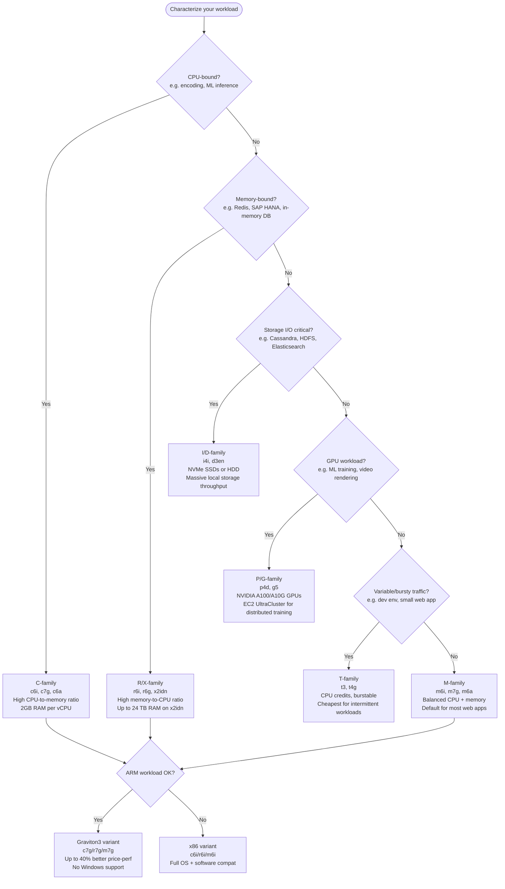
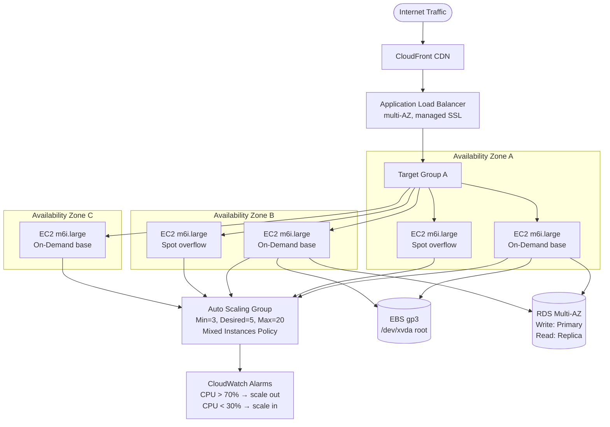
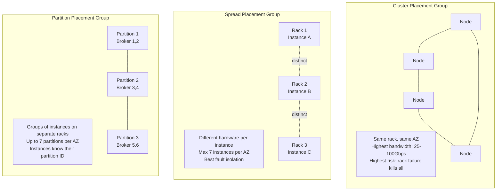
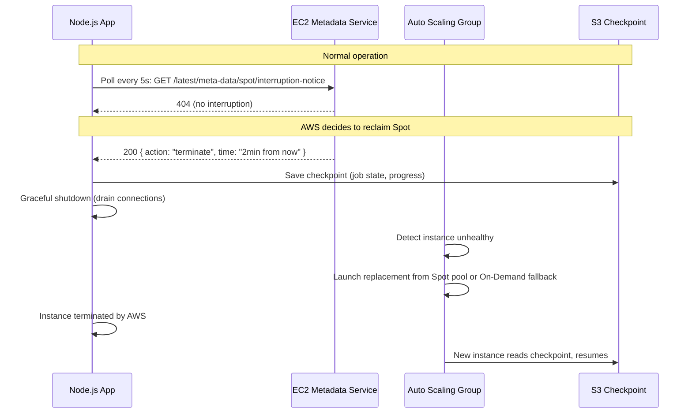

# AWS EC2: Instance Types, Purchase Options & Fleet Design

## Question
**"How do you choose the right EC2 instance type for a workload? Walk me through your decision process. What's the difference between On-Demand, Reserved, Spot, and Savings Plans?"**

Common in: AWS Solutions Architect interviews, Cloud Engineering, DevOps, AWS SAA/SAP certification exams

---

## Quick Answer (30-second version)

**EC2 instance choice = workload type + cost sensitivity + availability requirements**

- **Instance family**: Match to workload (compute → C-family, memory → R-family, storage → I-family, balanced → M/T-family)
- **Purchase model**: On-Demand for flexibility, Reserved for predictable baseline, Spot for fault-tolerant batch, Savings Plans for committed spend
- **Placement groups**: Cluster (HPC/low-latency), Spread (fault isolation for critical instances), Partition (distributed systems like Kafka/Cassandra)
- **EBS vs Instance Store**: EBS persists across stops/reboots, Instance Store is ephemeral NVMe — use Instance Store for cache/temp, EBS for everything else

**The interviewer wants to hear**: You understand the cost-performance trade-offs, not just the feature list.

---

## Why This Matters / The Thought Process

Every EC2 decision involves competing forces. An interviewer is testing whether you can navigate them:

1. **Underprovisioning** → application crashes under load, SLA breached
2. **Overprovisioning** → burning budget, looks bad in FinOps review
3. **Wrong purchase type** → paying On-Demand for a workload that runs 24/7 (1-year RI would save 40%)
4. **Wrong placement group** → HPC job with terrible inter-node latency because you used "Spread" instead of "Cluster"

The mental model: **Start with the workload, then match the instance, then optimize the purchase, then tune placement and storage.**

---

## Architecture: EC2 Instance Family Decision Tree



---

## Architecture: ASG + ALB Multi-AZ (The Standard Web Tier)



**Key insight**: The ASG spans 3 AZs. If AZ-A fails, ASG redistributes capacity to B and C. ALB health checks stop sending traffic to the failed AZ within 30 seconds. This is **how Netflix survived the 2011 AWS us-east-1 outage** — they were already multi-AZ.

---

## Decision Framework: EC2 Purchase Options

### Break-Even Analysis Table

| Purchase Type | Upfront | Monthly Est. (m6i.xlarge, us-east-1) | Break-Even | Best For |
|---|---|---|---|---|
| **On-Demand** | $0 | ~$153 | N/A baseline | Unpredictable, short-lived |
| **1-yr RI No Upfront** | $0 | ~$97 | Immediately | Steady 24/7 workloads |
| **1-yr RI Partial** | $534 | ~$52 | ~7 months | Steady 24/7 + lower monthly |
| **1-yr RI All Upfront** | $1,102 | $0 | ~7 months | Best 1-yr saving (~40% off) |
| **3-yr RI All Upfront** | $1,766 | $0 | ~12 months | Committed long-term (~60% off) |
| **Compute Savings Plan** | $0 | ~$97 | Immediately | Flexible (instance family, AZ, OS) |
| **Spot (interruptible)** | $0 | ~$35-60 (variable) | N/A | Fault-tolerant batch/stateless |

### When to Use Each

```
On-Demand:
  ✅ Unpredictable spikes (traffic surges, load tests)
  ✅ Dev/test environments (don't need 24/7)
  ✅ Short-lived jobs (< 1 month)
  ✅ First month while you measure actual usage

Reserved Instances (RI):
  ✅ Workloads running > 8 hours/day consistently
  ✅ Production databases (RDS, ElasticSearch)
  ✅ Baseline web tier capacity
  ✅ You can predict the instance family + region for 1-3 years

Compute Savings Plans:
  ✅ Flexible variant of RI — applies across instance families, sizes, AZs, OS
  ✅ You know your total EC2 spend but might change instance types
  ✅ Covers Lambda too (EC2 Instance Savings Plans don't)

Spot Instances:
  ✅ Stateless web servers (behind ALB, ASG replaces interrupted instances)
  ✅ Batch processing (can checkpoint and resume)
  ✅ CI/CD workers (Jenkins agents, GitHub Actions runners)
  ✅ Big Data (EMR, Spark jobs)
  ✅ ML training (with checkpointing to S3)
  ❌ Databases (Spot can be terminated with 2-min notice)
  ❌ Anything that can't tolerate interruption
```

### The Fleet Design Interview Answer

> "For a production web tier, I'd use a **mixed instance policy in the ASG**: 30% On-Demand base (guaranteed capacity), 70% Spot from a diversified pool of 4-5 instance types and sizes. Spot price diversification — c6i.xlarge, c6a.xlarge, m6i.large, m5.xlarge — keeps interruption rate under 5%. ASG replaces interrupted Spot instances automatically. Combine with 1-year Reserved Instances for the On-Demand base, since that capacity is predictable."

---

## Placement Groups



### When Placement Groups Matter

**Cluster — Use when:**
- HPC (High Performance Computing), MPI workloads
- Hadoop/Spark clusters where inter-node bandwidth is the bottleneck
- Real-time ML inference clusters needing low-latency model synchronization
- **10 Gbps → 25 Gbps → 100 Gbps Elastic Network Adapter** — only achievable in Cluster PG
- **Risk**: One rack failure kills all instances → pair with checkpointing

**Spread — Use when:**
- Small number of truly critical instances (maximum 7 per AZ)
- Primary + replicas of a stateful system (e.g., Zookeeper quorum, 3 instances on 3 separate racks)
- Instances where you want guaranteed hardware fault isolation
- **Limit**: Only 7 per AZ — not for large fleets

**Partition — Use when:**
- Large distributed systems: Kafka, Cassandra, HBase, HDFS
- You need to correlate instances with racks (so you can place Kafka replicas on different partitions)
- Applications that are rack-aware and can be configured accordingly
- Partition ID exposed to the OS via instance metadata

```
Interviewer follow-up: "Can a Cluster placement group span AZs?"
Answer: No — Cluster PGs are single-AZ. Spread and Partition can span AZs.

"What if you can't launch an instance into a Cluster PG?"
Answer: "Insufficient capacity error" — AWS doesn't have rack space for that instance type.
Solution: Stop all instances in the PG, then start them all together (AWS reallocates the rack).
```

---

## EBS Volume Types: The Real Comparison

| Volume Type | IOPS | Throughput | Use Case | Cost |
|---|---|---|---|---|
| **gp3** | 3,000 baseline, up to 16,000 (configurable) | 125-1,000 MB/s | General purpose, root volumes | Cheapest SSD baseline |
| **gp2** | 3 IOPS/GB, up to 16,000 | 128-250 MB/s | Legacy default (use gp3 instead) | 20% more than gp3 |
| **io2 Block Express** | Up to 256,000 IOPS | 4,000 MB/s | High-perf databases (Oracle, SQL Server) | Premium |
| **io1** | Up to 64,000 IOPS | 1,000 MB/s | Databases, legacy io1 | Expensive |
| **st1** | Not IOPS-optimized | 500 MB/s | Sequential: Kafka logs, big data, ETL | Cheap HDD |
| **sc1** | Not IOPS-optimized | 250 MB/s | Cold data, infrequent access | Cheapest HDD |

### gp2 vs gp3 — The Common Exam Trap

```
gp2 (old default):
  - IOPS = 3 × volume size in GB (min 100, max 16,000)
  - 100 GB volume = 300 IOPS
  - To get 3,000 IOPS you need 1,000 GB — wasteful
  - Credit-based bursting — can spike but not sustained

gp3 (new default, always use this):
  - Flat 3,000 IOPS regardless of size
  - Can provision up to 16,000 IOPS independently
  - IOPS and throughput decoupled from size
  - 20% cheaper than gp2
  - No credit system — consistent performance

→ Always migrate gp2 → gp3 for cost savings + better performance baseline
```

### EBS vs Instance Store

```
EBS (Elastic Block Store):
  - Network-attached storage (slight latency)
  - Persists across instance stop/start/reboot
  - AZ-specific: You cannot attach an EBS volume to an instance in a different AZ
  - Snapshots: Point-in-time backups, stored in S3 (regionally replicated)
  - Snapshots are REGIONAL: can copy to other regions for DR
  - Multi-Attach: io1/io2 can attach to up to 16 instances simultaneously (specialized clustering)

Instance Store (NVMe SSD local to the physical host):
  - Directly attached → 10-35x lower latency than EBS
  - Ephemeral: Data LOST on stop, terminate, or hardware failure
  - Not lost on reboot
  - Use cases: Buffer/cache layers, temporary scratch space, replica nodes
  - Examples: i4i instances have up to 30 TB NVMe instance store
  - Cannot be detached and reattached

Key exam question: "What happens to instance store data when you stop an EC2?"
Answer: It is PERMANENTLY LOST. Unlike reboot (data preserved), a stop deallocates the physical host.
```

---

## Spot Interruption Handling



---

## ASG Health Check Failure Flow

> **Interview question**: "What happens when an EC2 instance in an ASG fails a health check?"

```
1. Health check types:
   a. EC2 health check (default): AWS checks instance status (hardware/OS level)
      - Impaired: system failure, reachability failure
      - Detected by AWS hypervisor — catches hardware failures

   b. ELB health check: ALB probes /health endpoint
      - Catches application-level failures (app crashes, OOM, slow responses)
      - Recommended for web tiers — EC2 check alone won't catch app crashes

   c. Custom health checks: External system marks instance unhealthy via API

2. On unhealthy detection:
   - ASG marks instance InService → Unhealthy
   - Cooldown period respected (default 300s) — prevents flapping
   - ASG terminates unhealthy instance (sends termination to OS → SIGTERM → wait → kill)
   - ASG launches replacement instance to maintain desired capacity
   - New instance registers with ALB target group
   - ALB health check passes → traffic flows

3. Connection draining (deregistration delay):
   - ALB waits up to 300s (default) for in-flight requests to complete
   - No new requests routed to draining instance
   - Prevents request drops during scale-in
```

---

## Code: Spot Instance Interruption Handler (Node.js)

```javascript
// spot-interruption-handler.js
// Polls EC2 instance metadata every 5 seconds for Spot interruption notice
// Must run as a sidecar or background process in your application

const http = require('http');

const METADATA_URL = 'http://169.254.169.254/latest/meta-data/spot/interruption-notice';
const CHECK_INTERVAL_MS = 5000;

let isShuttingDown = false;
let checkpointInProgress = false;

function checkSpotInterruption() {
  const req = http.get(METADATA_URL, { timeout: 2000 }, (res) => {
    if (res.statusCode === 200) {
      // Interruption notice received — we have ~2 minutes
      let body = '';
      res.on('data', (chunk) => body += chunk);
      res.on('end', () => {
        const notice = JSON.parse(body);
        console.log(`[SPOT] Interruption notice received: ${JSON.stringify(notice)}`);
        console.log(`[SPOT] Instance will be terminated at: ${notice.time}`);

        handleInterruption(notice);
      });
    }
    // 404 = no interruption, continue polling
  });

  req.on('error', () => {
    // Metadata service unreachable — could mean we're already being terminated
    // Or just a transient error. Keep polling.
  });

  req.on('timeout', () => {
    req.destroy();
  });
}

async function handleInterruption(notice) {
  if (isShuttingDown) return;
  isShuttingDown = true;

  console.log('[SPOT] Starting graceful shutdown sequence...');

  try {
    // 1. Stop accepting new work
    global.acceptingNewWork = false;

    // 2. Checkpoint current state to S3
    await saveCheckpoint();

    // 3. Drain in-flight requests (signal to load balancer)
    await deregisterFromLoadBalancer();

    // 4. Close database connections
    await closeDatabaseConnections();

    console.log('[SPOT] Graceful shutdown complete. Waiting for termination.');
  } catch (err) {
    console.error('[SPOT] Error during shutdown:', err);
    // Still save checkpoint even if other cleanup fails
    await saveCheckpoint();
  }
}

async function saveCheckpoint() {
  if (checkpointInProgress) return;
  checkpointInProgress = true;

  const AWS = require('@aws-sdk/client-s3');
  const s3 = new AWS.S3Client({ region: process.env.AWS_REGION });

  const checkpointData = {
    timestamp: new Date().toISOString(),
    instanceId: await getInstanceId(),
    jobState: global.currentJobState, // Your application state
    processedItems: global.processedCount,
    lastProcessedId: global.lastProcessedId,
  };

  await s3.send(new AWS.PutObjectCommand({
    Bucket: process.env.CHECKPOINT_BUCKET,
    Key: `checkpoints/${checkpointData.instanceId}-${Date.now()}.json`,
    Body: JSON.stringify(checkpointData),
    ContentType: 'application/json',
  }));

  console.log('[SPOT] Checkpoint saved to S3');
}

async function getInstanceId() {
  return new Promise((resolve, reject) => {
    http.get('http://169.254.169.254/latest/meta-data/instance-id', (res) => {
      let body = '';
      res.on('data', (chunk) => body += chunk);
      res.on('end', () => resolve(body));
    }).on('error', reject);
  });
}

async function deregisterFromLoadBalancer() {
  // Signal ALB to stop routing traffic — it will drain existing connections
  // In practice: update instance health check to return 503
  global.healthCheckOverride = 503;
  // Wait for connection drain (ALB deregistration delay is typically 30-300s)
  // We have ~2 min max, so wait up to 90s
  await new Promise(resolve => setTimeout(resolve, Math.min(90000, 90000)));
}

async function closeDatabaseConnections() {
  if (global.dbPool) {
    await global.dbPool.end();
    console.log('[SPOT] Database connections closed');
  }
}

// Start polling
const intervalId = setInterval(checkSpotInterruption, CHECK_INTERVAL_MS);
console.log('[SPOT] Interruption handler active. Polling every 5 seconds.');

// Also listen for SIGTERM (ASG lifecycle hook termination)
process.on('SIGTERM', async () => {
  console.log('[SIGTERM] Received. Starting graceful shutdown...');
  clearInterval(intervalId);
  await handleInterruption({ reason: 'SIGTERM', time: new Date().toISOString() });
  process.exit(0);
});

module.exports = { isShuttingDown: () => isShuttingDown };
```

---

## Code: Mixed Instance Fleet with Spot (Terraform)

```hcl
# main.tf — Production EC2 fleet: On-Demand base + Spot overflow

resource "aws_launch_template" "app" {
  name_prefix   = "myapp-"
  image_id      = data.aws_ami.amazon_linux_2023.id
  instance_type = "m6i.large" # Default, overridden by mixed policy

  iam_instance_profile {
    name = aws_iam_instance_profile.app.name
  }

  network_interfaces {
    associate_public_ip_address = false
    security_groups             = [aws_security_group.app.id]
  }

  block_device_mappings {
    device_name = "/dev/xvda"
    ebs {
      volume_size           = 20
      volume_type           = "gp3"
      iops                  = 3000    # Baseline, no extra cost
      throughput            = 125     # MB/s baseline
      encrypted             = true
      delete_on_termination = true
    }
  }

  user_data = base64encode(<<-EOF
    #!/bin/bash
    # Install spot interruption handler as a systemd service
    curl -fsSL https://raw.githubusercontent.com/myorg/spot-handler/main/install.sh | bash
    systemctl enable spot-handler
    systemctl start spot-handler

    # Start application
    cd /app
    npm start
  EOF
  )

  tag_specifications {
    resource_type = "instance"
    tags = {
      Name        = "myapp-asg"
      Environment = "production"
    }
  }

  lifecycle {
    create_before_destroy = true
  }
}

resource "aws_autoscaling_group" "app" {
  name                = "myapp-asg"
  vpc_zone_identifier = [aws_subnet.private_a.id, aws_subnet.private_b.id, aws_subnet.private_c.id]
  target_group_arns   = [aws_lb_target_group.app.arn]
  health_check_type   = "ELB"     # Use ALB health check, not just EC2
  health_check_grace_period = 120 # Wait 2 min for app to start before checking

  min_size         = 3
  max_size         = 20
  desired_capacity = 5

  # Mixed instances policy: On-Demand base + Spot overflow
  mixed_instances_policy {
    instances_distribution {
      # 2 On-Demand instances always running (base capacity)
      on_demand_base_capacity = 2

      # Above the base: 30% On-Demand, 70% Spot
      on_demand_percentage_above_base_capacity = 30

      # Spot allocation: spread across pools to minimize interruption
      spot_allocation_strategy = "capacity-optimized"
      # capacity-optimized: picks from pools with most capacity → lowest interruption rate
      # lowest-price: cheapest but highest interruption rate

      # Maximum price you'll pay for Spot (optional — omit to use On-Demand price as cap)
      # spot_max_price = "0.10"
    }

    launch_template {
      launch_template_specification {
        launch_template_id = aws_launch_template.app.id
        version            = "$Latest"
      }

      # Diversify across multiple instance types — reduces interruption risk
      override {
        instance_type     = "m6i.large"
        weighted_capacity = "1"
      }

      override {
        instance_type     = "m6a.large"
        weighted_capacity = "1"
      }

      override {
        instance_type     = "m5.large"
        weighted_capacity = "1"
      }

      override {
        instance_type     = "m5a.large"
        weighted_capacity = "1"
      }

      override {
        instance_type     = "c6i.xlarge" # 2x CPU, useful for compute-heavy spikes
        weighted_capacity = "2"          # Counts as 2 units of capacity
      }
    }
  }

  tag {
    key                 = "Name"
    value               = "myapp-asg"
    propagate_at_launch = true
  }
}

# CPU-based scaling policy
resource "aws_autoscaling_policy" "cpu_tracking" {
  name                   = "myapp-cpu-tracking"
  autoscaling_group_name = aws_autoscaling_group.app.name
  policy_type            = "TargetTrackingScaling"

  target_tracking_configuration {
    predefined_metric_specification {
      predefined_metric_type = "ASGAverageCPUUtilization"
    }
    target_value = 70.0 # Scale out when CPU > 70%, scale in when < 70%
  }
}

# ALB request count scaling (better than CPU for API workloads)
resource "aws_autoscaling_policy" "request_tracking" {
  name                   = "myapp-request-tracking"
  autoscaling_group_name = aws_autoscaling_group.app.name
  policy_type            = "TargetTrackingScaling"

  target_tracking_configuration {
    predefined_metric_specification {
      predefined_metric_type = "ALBRequestCountPerTarget"
      resource_label         = "${aws_lb.app.arn_suffix}/${aws_lb_target_group.app.arn_suffix}"
    }
    target_value = 1000 # 1000 requests per instance target
  }
}
```

---

## Common Interview Follow-ups

**Q: Your application has CPU spikes every 15 minutes. How do you handle this cost-effectively?**

> "First question: is it predictable? If yes, use scheduled scaling — pre-warm the ASG 5 minutes before the spike. If the spike is sudden, use T3/T4g instances with CPU credits for bursty workloads, or step scaling with a small cooldown. T3 unlimited mode allows sustained performance past the credit baseline at a small per-CPU-hour cost. For truly unpredictable spikes, target tracking on CPU utilization at 60-70% gives headroom to absorb spikes while scaling catches up."

**Q: What's the difference between ASG scale-in and termination policies?**

> "Termination policy controls which instance the ASG terminates during scale-in. Default policy: oldest launch template, then AZ balance, then random. Custom policies: `NewestInstance` for testing new AMIs, `OldestInstance` for rolling AMI upgrades, `ClosestToNextInstanceHour` to minimize waste. Spot Instance termination is always controlled by AWS — you handle that via the 2-minute interruption notice."

**Q: Can you attach an EBS volume to two EC2 instances at the same time?**

> "Only io1 and io2 volumes support Multi-Attach, to up to 16 Nitro-based instances in the same AZ. You're responsible for coordinating writes — this isn't a distributed filesystem, it's raw block access. Typical use case: clustered databases like MSSQL Server on Windows Server Failover Clustering. For most use cases, EFS (NFS) or S3 is the right shared-storage answer."

**Q: How does EC2 Hibernate work?**

> "Hibernate saves the in-memory RAM state to the root EBS volume, then stops the instance. On start, the RAM is restored — apps resume from where they left off rather than cold-starting. Useful for long-running computations, faster boot-up for Java apps that take minutes to JIT warm up. Limits: instance must be backed by EBS (not instance store), RAM must be less than 150 GB, the root EBS volume must be large enough to hold the RAM dump."

---

## AWS Certification Exam Tips

```
SAA-C03 / SAP-C02 Exam Hot Topics:

1. EBS is AZ-SPECIFIC
   - You cannot attach a us-east-1a EBS volume to a us-east-1b instance
   - To move: create snapshot → create new volume in target AZ from snapshot

2. Snapshots are REGIONAL (not AZ-specific)
   - Snapshots stored in S3 (managed by AWS, you don't see the bucket)
   - Cross-region copy via "Copy Snapshot" for DR

3. AMIs can be cross-region (copy or share)
   - AMIs are regional but can be copied to any region
   - Community AMIs: shared publicly by AWS or community

4. gp2 vs gp3 exam trap:
   - "You need 10,000 IOPS with a 1 TB EBS volume. Which type?"
   - gp2: 1000 GB × 3 IOPS/GB = 3,000 IOPS (not enough)
   - gp3: Provision 10,000 IOPS independently → correct answer
   - io2 would also work but is significantly more expensive

5. Spot Instance hibernation:
   - If instance is configured for hibernation: RAM saved to EBS on interruption
   - On resume: instance restores from RAM snapshot

6. Placement groups are FREE
   - No additional charge for placement groups
   - "Insufficient capacity" error = stop all PG instances, start together

7. Instance store:
   - "Which EBS volume provides the HIGHEST IOPS?"
   - Trap: Instance store (NVMe local) can vastly exceed EBS io2 IOPS
   - But instance store is ephemeral — not EBS at all

8. Savings Plans vs Reserved Instances:
   - Savings Plans: More flexible (any instance family), covers Lambda
   - RI: Specific instance type, can sell on Reserved Instance Marketplace
   - Convertible RI: Can change instance family — lower discount but more flexible
```

---

## Key Takeaways

1. **Instance family = workload type**: C (CPU), R (RAM), I (NVMe/storage), M (general), T (bursty), P/G (GPU)
2. **Graviton3 = 40% better price-performance**: Always evaluate Arm compatibility first
3. **Mixed instance fleet** with Spot saves 50-70% vs pure On-Demand for stateless web tiers
4. **Spot requires interruption handling**: 2-minute notice, checkpoint to S3, ASG replaces automatically
5. **gp3 over gp2 always**: Same max IOPS, independently configurable, 20% cheaper
6. **EBS = AZ-bound; Snapshots = Regional; AMIs = Regional (copyable cross-region)**
7. **Cluster PG** for HPC/low-latency; **Spread PG** for critical isolated instances (max 7/AZ); **Partition PG** for Kafka/Cassandra
8. **Health check type = ELB** for web tiers — EC2 check alone misses application failures

---

## Related Questions

- [AWS Load Balancers: ELB, ALB, NLB](/interview-prep/aws-cloud/load-balancer)
- [Auto Scaling Groups](/interview-prep/aws-cloud/auto-scaling)
- [AWS Lambda for Serverless Architecture](/interview-prep/aws-cloud/lambda-serverless)
- [CloudWatch Monitoring](/interview-prep/aws-cloud/cloudwatch-monitoring)
- [ECS, EKS & Fargate](/interview-prep/aws-cloud/ecs-eks-fargate)
