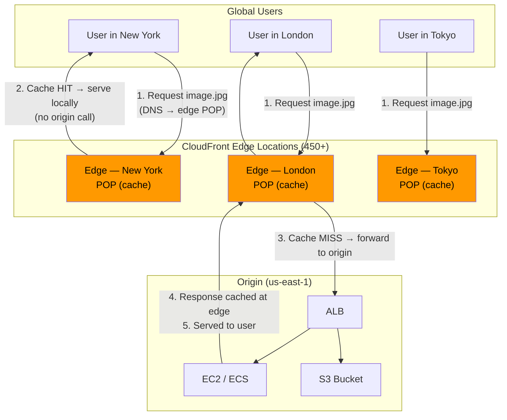
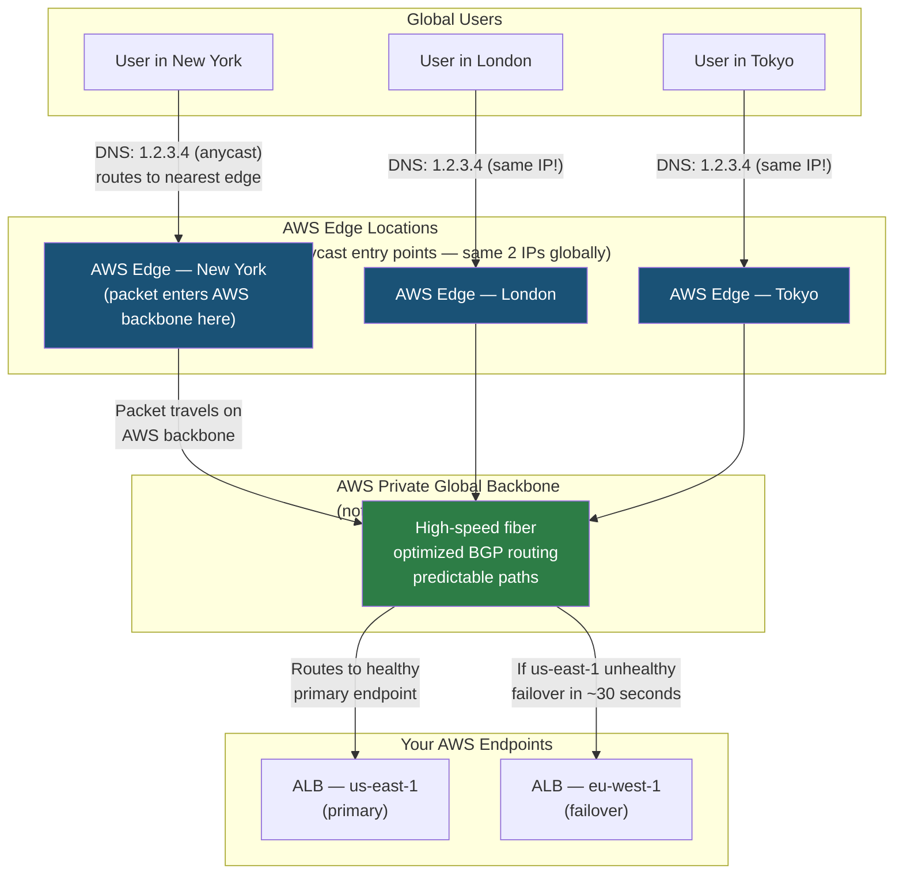
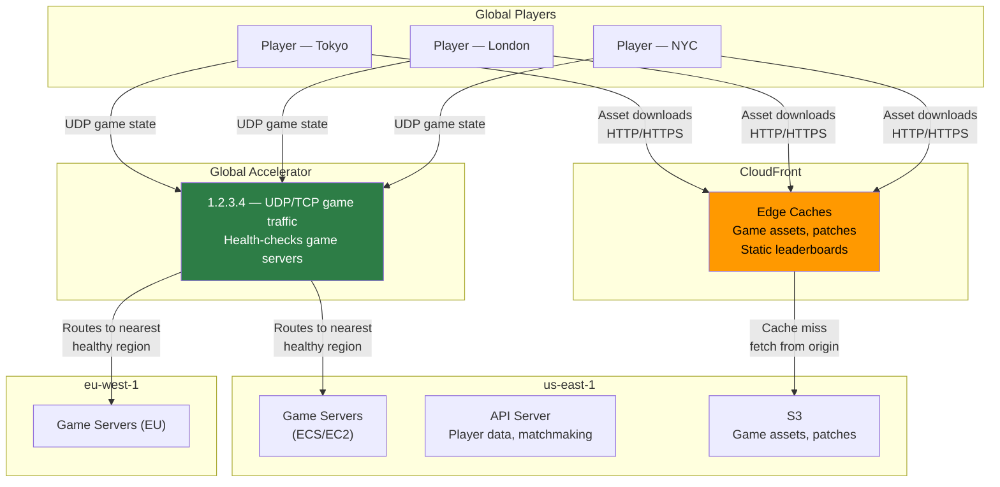
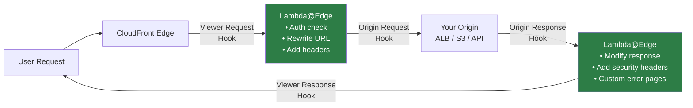

# AWS Global Accelerator vs CloudFront: Global Traffic Routing

> **Common Interview Question**: "We're building a global gaming platform for 50 million users where every millisecond of latency matters. Which AWS service do you use to route traffic — Global Accelerator or CloudFront? What's the difference?"

Common in: AWS Solutions Architect, Senior Backend, Platform Engineering, and Gaming/Media infrastructure interviews

---

## Quick Answer (30-second version)

- **CloudFront** = CDN. Caches content at 450+ edge locations. HTTP/HTTPS only. Reduces load on your origin by serving cached responses. Great for images, video, static sites, and cacheable APIs.
- **Global Accelerator** = Smart traffic router. No caching. Routes packets to your nearest healthy AWS endpoint via the AWS backbone (not the public internet). TCP/UDP. 2 static anycast IPs. Great for real-time APIs, gaming, VoIP, IoT.
- **The critical difference**: CloudFront CACHES content at the edge. Global Accelerator ROUTES traffic to your region faster. One reduces origin load, the other reduces network latency.
- **If someone needs to whitelist an IP in a firewall**, use Global Accelerator (static anycast IPs). CloudFront uses hundreds of dynamic IPs.
- **UDP traffic** = Global Accelerator only. CloudFront doesn't support UDP.

---

## Why This Matters / The Thought Process

The #1 mistake candidates make is treating these as interchangeable. They're not solving the same problem.

**CloudFront**: "How do I serve content to global users without hammering my origin?"
- Answer: Cache the content at 450+ points of presence worldwide. The user gets the content from an edge server 10ms away instead of your origin server 200ms away.

**Global Accelerator**: "How do I get my users' packets from their laptop to my AWS region as fast as possible?"
- Answer: Use AWS's private global network backbone. The user's request enters the AWS network at the nearest edge location, then travels on AWS's high-speed internal backbone to your region — instead of hopping through unpredictable public internet routers.

**The insight**: CloudFront solves the problem by NOT sending traffic to your origin at all (cache hit). Global Accelerator solves it by making the journey to your origin faster.

Think like an SA: Ask yourself — "Is this traffic cacheable?" If yes, CloudFront. If the content is personalized, real-time, or stateful (games, trades, sensor data), CloudFront's caching doesn't help. That's Global Accelerator territory.

---

## Architecture: How Each Service Works

### CloudFront: Edge Caching



**Cache hit path**: User → Edge (10ms) → Response. Origin never contacted.
**Cache miss path**: User → Edge (10ms) → Origin (200ms) → Response cached at edge for next user.

### Global Accelerator: Anycast Routing



**What "anycast" means**: Both your accelerator IPs are advertised from ALL AWS edge locations simultaneously. When a user sends a packet to 1.2.3.4, the internet routes it to the NEAREST AWS edge location announcing that IP. Magic: same IP, different physical destinations based on proximity.

---

## The Critical Differences Table

| Dimension | CloudFront | Global Accelerator |
|-----------|-----------|-------------------|
| **Primary purpose** | Content caching/delivery | Traffic routing acceleration |
| **Protocol** | HTTP/HTTPS only | TCP and UDP |
| **Caching** | Yes — content cached at edge | No — just routing, no cache |
| **Static IPs** | No (dynamic IPs, changes) | Yes — 2 static anycast IPs |
| **Edge count** | 450+ PoPs | 100+ (fewer but still global) |
| **Health checks** | No real-time failover to regions | Yes — health-based failover ~30s |
| **Use case** | Static/dynamic content, video | Real-time APIs, gaming, non-HTTP |
| **Lambda@Edge** | Yes | No |
| **Geo-restriction** | Yes | No |
| **DDoS** | AWS Shield Standard (free) | AWS Shield Standard (free) |
| **Pricing** | Per request + data transfer | $0.025/accelerator-hr + $0.01-0.08/GB |
| **IP whitelisting** | Not possible (dynamic IPs) | Possible (2 static anycast IPs) |

---

## How AWS Backbone Routing Reduces Latency

Why does Global Accelerator actually help? The public internet is... unreliable.

```
Public internet path (New York → Tokyo):
  User → ISP router → Tier 1 backbone A → Peering point →
  Tier 1 backbone B → ISP → your server

  Hops: 15-25
  Typical latency: 180-250ms
  Variability: High (BGP churn, congestion)

Global Accelerator path (New York → Tokyo):
  User → AWS edge PoP New York (1 hop, ~5ms) →
  AWS private fiber backbone (optimized route) →
  ALB in Tokyo

  Hops into AWS: 1 (to edge)
  Typical latency: 150-180ms
  Variability: Very low (private network, managed)
```

**The improvement**: ~30-70ms reduction in latency + significantly lower jitter. For real-time applications (gaming, voice), jitter matters as much as absolute latency.

**Why AWS backbone is faster**: AWS runs its own fiber, uses custom BGP optimization, and pre-engineers routes between regions. They don't have to negotiate with 15 transit providers like your traffic does on the public internet.

---

## Decision Framework

```
Does your traffic need caching (images, CSS, JS, video segments, cacheable API responses)?
  YES → CloudFront (caching is the primary win)
  NO  ↓

Is the protocol UDP?
  YES → Global Accelerator (CloudFront doesn't support UDP)
  NO  ↓

Do you need to whitelist static IPs in a firewall or allowlist?
  YES → Global Accelerator (2 static anycast IPs per accelerator)
  NO  ↓

Is this real-time with strict latency requirements (gaming, trading, VoIP)?
  YES → Global Accelerator (consistent routing via backbone)
  NO  ↓

Is it primarily HTTP/HTTPS content for global users?
  YES → CloudFront (more PoPs, caching, Lambda@Edge, geo-blocking)
  NO  ↓

Do you need Lambda@Edge for request manipulation at the edge?
  YES → CloudFront only
```

### Quick Cheat Sheet by Use Case

| Use Case | Winner | Why |
|----------|--------|-----|
| Serve images/CSS/JS globally | CloudFront | Caching eliminates origin calls |
| 4K video streaming | CloudFront | Edge caching + streaming optimizations |
| Gaming UDP traffic | Global Accelerator | UDP + consistent routing |
| REST API with global users | Global Accelerator | No caching benefit, need low latency |
| Static website | CloudFront | Cache entire site at edge |
| IoT device data collection | Global Accelerator | TCP/UDP, real-time, low latency |
| Financial API (no caching) | Global Accelerator | Consistent latency, static IPs for compliance |
| A/B testing at edge | CloudFront + Lambda@Edge | Edge logic execution |
| Multi-region failover (ALB) | Global Accelerator | Health-based failover across regions |
| Geo-block specific countries | CloudFront | Built-in geo-restriction feature |

---

## Interview Scenario 1: Global Gaming Platform

> **"Design a gaming platform for 50 million global users where latency matters most."**

**SA thought process:**

Gaming traffic characteristics:
- Real-time state updates: low-latency, bidirectional
- Often UDP (game state packets — dropped packets are OK, latency is not)
- Match results, leaderboards: HTTP, cacheable
- Player inventory, purchases: HTTP, NOT cacheable (personalized)

**Architecture:**



**Answer breakdown:**
1. **Global Accelerator** for game traffic (UDP state updates, matchmaking API) — consistent routing, UDP support, health-based region failover
2. **CloudFront** for game assets (maps, skins, patches) — 10 GB patch cached at 450 PoPs, players download at full speed without hitting your S3 every time
3. **S3 + CloudFront** for static game files — S3 is the origin, CloudFront serves 99% of requests from cache
4. **Multi-region game servers** with GA health checks — if us-east-1 game servers go down, GA reroutes players to eu-west-1 in ~30 seconds

---

## Interview Scenario 2: Global Media Company — 4K Video

> **"A media company serves 4K video to 100 million users. How do you optimize bandwidth costs and latency?"**

**SA thought process:**

Video streaming characteristics:
- Large files (4K segment: 10-30 MB per 6-second chunk)
- Highly cacheable (same content served to many users)
- HTTP-based (HLS, DASH protocols)
- Origin bandwidth = the bottleneck without caching

At 100M users each watching 1 hour of 4K video (25 Mbps):
- Without caching: 100M × 25 Mbps = 2.5 Petabits/second from origin. **Impossible.**
- With CloudFront caching: Popular content cached at edge. Origin only serves cache misses.

**Answer:**

1. **CloudFront is the obvious choice** — video is HTTP-based and the caching benefit is massive
2. **S3 as origin** — store video segments in S3, CloudFront caches at edge
3. **CloudFront streaming**: Set high TTL for video segments (immutable content), short TTL for manifests (.m3u8 files change as live stream progresses)
4. **Regional Edge Caches**: Between edge PoPs and S3 origin — popular content cached closer, even less origin traffic
5. **Signed URLs**: Pay-per-view content served via CloudFront signed URLs — only authenticated users can access
6. **AWS Elemental MediaConvert**: Transcode video to multiple quality levels (adaptive bitrate) and store all qualities in S3

**Cost math at 100M users:**
- Without CloudFront: 100M users × 3.6 GB/hr × $0.09/GB = **$32.4M/hour** in data transfer from S3. Bankrupt.
- With CloudFront: cache hit ratio ~95% for popular content. Only 5% hits origin. Costs drop 95%.

---

## Lambda@Edge: CloudFront's Superpower

CloudFront has a capability Global Accelerator does not: running code at the edge.



**Lambda@Edge use cases:**
- **A/B testing**: Route 10% of users to a new feature
- **Authentication**: Validate JWT at edge before forwarding to origin
- **URL rewriting**: `/old-path` → `/new-path` without changing origin
- **Dynamic content generation**: Serve personalized HTML at edge (edge SSR)
- **Security headers**: Add `Strict-Transport-Security`, `X-Frame-Options` to every response

**Global Accelerator cannot do this** — it's a pure traffic router. No code execution.

---

## Common Interview Follow-ups

**Q: "Can you use both CloudFront AND Global Accelerator together?"**

Yes, and it can make sense for specific architectures:
- CloudFront for cacheable content (images, static assets)
- Global Accelerator for your API endpoints that need consistent latency and static IPs
- Different domains: `cdn.example.com` → CloudFront, `api.example.com` → Global Accelerator

**Q: "What are CloudFront's 2 static anycast IPs?"**

CloudFront does NOT have static IPs — this is a common trap. CloudFront uses a large pool of dynamic IP addresses at its edge locations, and these change. This makes CloudFront incompatible with:
- Firewall IP allowlisting
- Banking/enterprise security policies that require whitelisted IPs

Global Accelerator gives you exactly 2 static anycast IPs per accelerator. These never change and can be firewalled.

**Q: "How does Global Accelerator handle health checks?"**

Global Accelerator performs health checks on your endpoints (ALBs, EC2s, Elastic IPs) every 30 seconds. If an endpoint becomes unhealthy:
- Traffic is rerouted to the next healthy endpoint
- Failover time: ~30 seconds
- This is faster than Route 53 DNS failover (DNS TTL = 60-300 seconds + resolver caching)

**Q: "When would you NOT use CloudFront?"**

- Real-time WebSocket connections (CloudFront supports WebSockets but isn't ideal for long-lived connections)
- Non-HTTP protocols (use Global Accelerator)
- Content that's 100% unique per user and never cacheable (the CDN overhead isn't worth it)
- Very low-traffic, single-region applications (CloudFront adds cost and complexity for no benefit)

**Q: "How does CloudFront handle cache invalidation?"**

- Each invalidation request for up to 1,000 paths/month is free, then $0.005 per path
- `CreateInvalidation` API: specify `/images/*` to invalidate all cached images
- Alternative: use cache-busting versioned URLs (`/image.v2.jpg` instead of `/image.jpg`) — no invalidation needed, just deploy with a new URL

---

## AWS Certification Exam Tips

1. **Global Accelerator does NOT cache** — any exam question mentioning caching improvement points to CloudFront.

2. **CloudFront = HTTP/HTTPS only** — questions about UDP, gaming, IoT, or non-HTTP protocols point to Global Accelerator.

3. **Static IPs**: Global Accelerator has 2 static anycast IPs per accelerator. CloudFront has dynamic IPs. Exam question: "Firewall must whitelist the service's IPs" → Global Accelerator.

4. **Lambda@Edge runs with CloudFront, not Global Accelerator** — any question about "run code at the edge" or "modify requests at PoP" = CloudFront + Lambda@Edge.

5. **Anycast routing**: Global Accelerator uses anycast — multiple servers share the same IP address, and the internet routes to the nearest one. This is how 2 IPs cover the whole globe.

6. **CloudFront geo-restriction**: CloudFront can block specific countries. Global Accelerator cannot. "Block users from certain countries" = CloudFront.

7. **Price model difference**: CloudFront charges per HTTP request + data. Global Accelerator charges hourly ($0.025/hr per accelerator) + data transfer. GA is more predictable for steady traffic; CloudFront scales to zero if no traffic.

8. **Origin types**: CloudFront origins = S3, ALB, EC2, API Gateway, custom HTTP server. Global Accelerator endpoints = ALB, NLB, EC2, Elastic IP. Different origin types!

9. **Shield Advanced integration**: Both CloudFront and Global Accelerator work with AWS Shield Advanced for enhanced DDoS protection. Shield Standard is free and included with both.

10. **Regional Edge Caches**: CloudFront has 13 Regional Edge Caches between PoPs and origins — a middle-tier cache. Global Accelerator has no caching layers.

---

## Key Takeaways

- **CloudFront = CDN** — caches content at the edge, HTTP/HTTPS, 450+ PoPs. Reduces origin load by serving cached responses to global users.
- **Global Accelerator = Smart router** — no caching, routes TCP/UDP traffic over the AWS backbone. Reduces latency by avoiding the unpredictable public internet.
- **The question to ask**: "Is this traffic cacheable?" → Yes: CloudFront. No: Global Accelerator.
- **UDP traffic** requires Global Accelerator — CloudFront cannot handle it.
- **Firewall IP allowlisting** requires Global Accelerator — 2 static anycast IPs vs CloudFront's dynamic IPs.
- **Lambda@Edge** runs only with CloudFront — for edge logic, auth, A/B testing, or URL rewriting.
- Using both together is valid: CloudFront for assets, Global Accelerator for real-time APIs.

## Related Topics

- [AWS CloudFront CDN](/12-interview-prep/quick-reference/aws-cloud/cloudfront-cdn)
- [AWS Route 53 DNS](/12-interview-prep/quick-reference/aws-cloud/route53-dns)
- [AWS Load Balancer (ALB vs NLB)](/12-interview-prep/quick-reference/aws-cloud/load-balancer)
- [AWS VPC Networking](/12-interview-prep/quick-reference/aws-cloud/vpc-networking)
