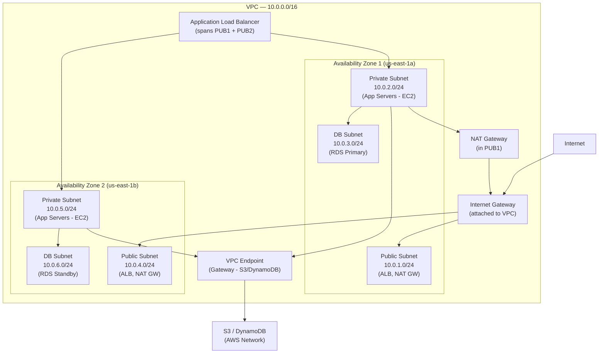
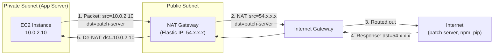
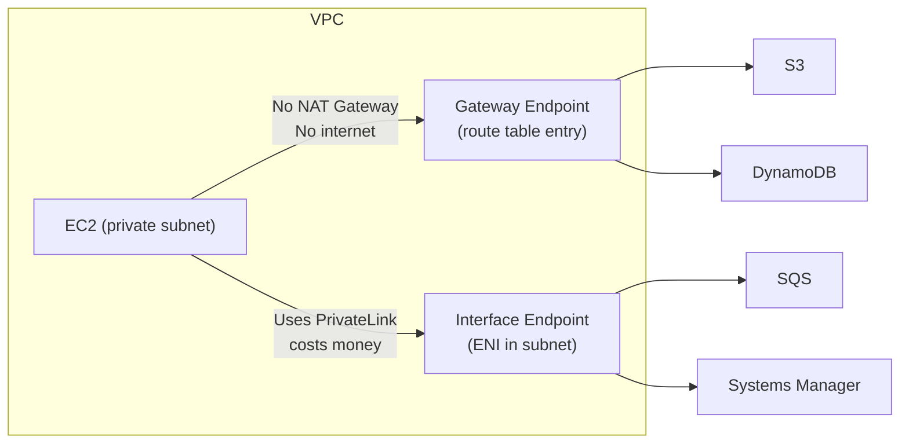
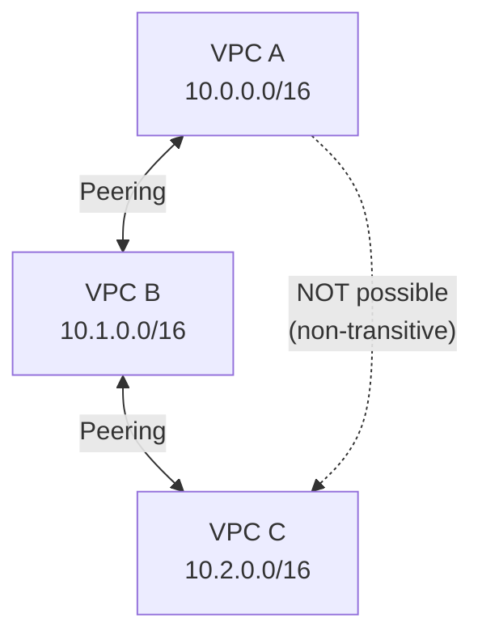
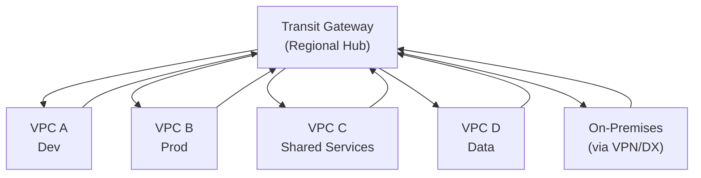

# AWS VPC Networking: Design, Subnets, and Connectivity

> **Common Interview Question**: "Walk me through how you'd design the VPC architecture for a 3-tier web application. What's the difference between Security Groups and NACLs? A private EC2 instance needs internet access to download patches — how do you set this up without exposing it to inbound traffic?"

Common in: AWS Solutions Architect, Senior Backend, Platform/Infrastructure, Cloud Architecture interviews

---

## Quick Answer (30-second version)

- **VPC** = Your own isolated network inside AWS. Every resource you launch lives in a VPC.
- **3-tier VPC** = Public subnets (ALB, NAT GW), Private subnets (app servers), DB subnets (RDS) — across 2+ AZs
- **Security Groups** = Stateful firewall at the instance level. Return traffic is automatically allowed.
- **NACLs** = Stateless firewall at the subnet level. You must explicitly allow inbound AND outbound.
- **NAT Gateway** = Allows private instances to initiate outbound internet connections. Inbound connections blocked.
- **VPC Endpoints** = Private route to AWS services (S3, DynamoDB) without touching the internet.
- **VPC Peering** = Direct 1:1 connection between VPCs. Non-transitive — doesn't scale beyond ~10 VPCs.
- **Transit Gateway** = Hub-and-spoke model. Connects hundreds of VPCs and on-prem networks through one gateway.

---

## Why This Matters / The Thought Process

When an interviewer asks about VPC design, they're testing whether you understand **network isolation, blast radius reduction, and the principle of least network privilege**.

The real questions behind the question:
- Can you identify which resources need internet access vs which need zero exposure?
- Do you understand that security groups and NACLs solve different problems at different layers?
- Can you reason about the cost of NAT Gateway vs VPC endpoints?
- Do you know when VPC peering breaks down and you need Transit Gateway?

Think like an SA: A misconfigured VPC is the #1 cause of accidental data exposure. The difference between a public and private subnet is just a route table entry — but that route table entry is the difference between "secured" and "breached."

---

## Architecture: 3-Tier VPC Design



**Route Table Summary:**

| Subnet | Destination | Target |
|--------|-------------|--------|
| Public | 0.0.0.0/0 | Internet Gateway |
| Private | 0.0.0.0/0 | NAT Gateway |
| Private | S3 prefix | VPC Endpoint (Gateway) |
| DB | (no internet route) | local only |

**Critical insight**: DB subnets have NO route to the internet — not even via NAT Gateway. They can only receive connections from within the VPC.

---

## Egress Flow: IGW vs NAT Gateway vs NAT Instance



**Why NAT Gateway and NOT a public IP on the EC2?**
- NAT Gateway allows OUTBOUND-initiated connections only
- No inbound connections from internet are possible (security)
- The EC2 itself has no Elastic IP — invisible to the internet
- NAT Gateway is managed (HA within AZ), vs NAT Instance (you manage it)

**NAT Instance vs NAT Gateway:**

| | NAT Gateway | NAT Instance |
|--|-------------|--------------|
| Managed | Yes (AWS managed) | No (you patch it) |
| Availability | Highly available within AZ | Single point of failure |
| Bandwidth | Up to 45 Gbps | Limited by instance type |
| Cost | ~$0.045/hr + data | EC2 cost (cheaper for low traffic) |
| Security Groups | Cannot attach | Can attach |
| When to use | Production | Dev/cost-sensitive |

---

## Security Groups vs NACLs — The Critical Difference

This is one of the most common interview trip-ups. Memorize this table.

| | Security Group | NACL |
|--|----------------|------|
| **Layer** | Instance level | Subnet level |
| **State** | **Stateful** (return traffic auto-allowed) | **Stateless** (must allow both directions) |
| **Rules** | Allow only | Allow and Deny |
| **Evaluation** | All rules evaluated | Rules evaluated in order (lowest # wins) |
| **Default** | Deny all inbound, allow all outbound | Allow all (default NACL) |
| **Apply to** | Specific EC2/RDS instances | All instances in subnet |

### Stateful vs Stateless — Concrete Example

**Security Group (Stateful):**
```
Inbound: Allow TCP 443 from 0.0.0.0/0
# That's it. Response traffic on ephemeral ports automatically allowed.
```

**NACL (Stateless) — you must explicitly allow both:**
```
Inbound Rule 100:  Allow TCP 443 from 0.0.0.0/0
Outbound Rule 100: Allow TCP 1024-65535 to 0.0.0.0/0  # ephemeral ports for response!
# Without the outbound rule, the response packet is DROPPED
```

### When Do You Need BOTH?

**Defense in depth**: Security Groups are your primary defense. NACLs are a secondary layer.

Use NACLs when you need to:
- **Block specific IPs** (DDoS mitigation — SGs can't deny, only NACLs can)
- **Subnet-wide rules** without touching every security group
- **Compliance** requiring subnet-level firewall controls

**Common interview scenario**: "An attacker is hammering your ALB from IP 1.2.3.4. Security Groups can't help — they don't have deny rules. Add a NACL deny rule on the public subnet."

---

## VPC Endpoints — Gateway vs Interface

VPC Endpoints let you access AWS services without leaving the AWS network — no internet, no NAT Gateway.



| | Gateway Endpoint | Interface Endpoint (PrivateLink) |
|--|------------------|----------------------------------|
| **Supports** | S3, DynamoDB only | 100+ AWS services |
| **Cost** | **Free** | ~$0.01/hr per AZ + data |
| **How it works** | Route table entry | ENI in your subnet |
| **DNS** | No DNS change | Private DNS override |
| **Cross-region** | No | No |

**Interview gold**: "Always use Gateway Endpoints for S3 and DynamoDB — they're free and eliminate NAT Gateway costs for those services. A busy service uploading to S3 through NAT Gateway can cost hundreds of dollars/month unnecessarily."

### Cost Impact Example:
- 1 TB/month of EC2 → S3 traffic through NAT Gateway = **$45/month** in NAT data charges
- Same traffic through S3 Gateway Endpoint = **$0**

---

## VPC Peering vs Transit Gateway vs PrivateLink

### VPC Peering — Direct 1:1 Connection



**VPC Peering limitations:**
- **Non-transitive**: A→B and B→C does NOT mean A→C. You need A→C peering too.
- **No overlapping CIDRs**: VPCs must have different IP ranges.
- **No edge-to-edge routing**: Can't route through peering to reach the internet, VPN, or Direct Connect.
- **Scales poorly**: 10 VPCs requires 45 peering connections (n*(n-1)/2).

### Transit Gateway — Hub and Spoke



**Transit Gateway advantages:**
- **Transitive routing**: All VPCs can communicate through TGW
- **Scales to thousands** of VPCs
- **On-premises connectivity**: Attach VPN or Direct Connect
- **Route tables**: Control which VPCs can talk to each other (isolation)
- **Cross-account**: Works across AWS accounts in an Organization

**Cost**: ~$0.05/hr per attachment + $0.02/GB data. VPC peering is cheaper for simple 2-VPC scenarios.

### Decision Framework: Which to Use?

| Scenario | Use | Reason |
|----------|-----|--------|
| 2-3 VPCs, simple connectivity | VPC Peering | Free, low complexity |
| 5+ VPCs, hub-spoke model | Transit Gateway | Avoids peering mesh |
| Expose a service to other accounts | PrivateLink | Consumer doesn't need VPC access |
| On-premises + multi-VPC | Transit Gateway | Single DX/VPN attachment |
| Cross-region VPC connectivity | VPC Peering (inter-region) or TGW peering | TGW peering for complex topologies |

---

## CIDR Planning Best Practices

**The interview trap**: "We just need 10 servers, can't we use a /28?" — No. Here's why.

### Planning Rules:
1. **Start big** — VPC CIDR should be at least /16 (65,536 IPs)
2. **AWS reserves 5 IPs per subnet** — first 4 and last 1 (e.g., .0, .1, .2, .3, .255)
3. **Leave room for growth** — subnets can't be resized after creation
4. **Avoid overlapping with on-premises** — you can't peer or connect via VPN with overlapping CIDRs
5. **Use RFC 1918** — 10.0.0.0/8, 172.16.0.0/12, 192.168.0.0/16

### Example CIDR Plan for 3-Tier Multi-AZ:
```
VPC:          10.0.0.0/16  (65,536 IPs total)

AZ-1:
  Public:     10.0.0.0/20  (4,096 IPs - ALB, NAT GW)
  Private:    10.0.16.0/20 (4,096 IPs - App servers)
  DB:         10.0.32.0/24 (256 IPs - RDS)

AZ-2:
  Public:     10.0.64.0/20
  Private:    10.0.80.0/20
  DB:         10.0.96.0/24

Reserved for future AZ or services: 10.0.128.0/17
```

---

## Real-World Scenario: E-Commerce Platform on AWS

**Situation**: You're designing a VPC for a retail platform expecting 10M users. Black Friday traffic is 10x normal.

**Architecture decisions and reasoning:**

1. **Multi-AZ (minimum 2, prefer 3)**: Single AZ failure shouldn't take down the site.
2. **NAT Gateway per AZ**: Don't route AZ-1 app servers through AZ-2 NAT GW — cross-AZ data transfer costs money and adds latency.
3. **S3 Gateway Endpoint**: Product images, static assets go to S3. Saves $50-200/month in NAT costs.
4. **Private subnets for everything except ALB**: App servers, RDS, ElastiCache — nothing public.
5. **Interface Endpoints for SSM**: Patch management without bastion hosts. Security team loves this.
6. **NACLs for known-bad IPs**: DDoS blacklisting at subnet level during attacks.

**Interview follow-up**: "How does your EC2 in the private subnet communicate with RDS?"
- EC2 (10.0.16.5) → Route table has no specific route → Stays local (10.0.0.0/16 → local)
- Security Group on RDS allows TCP 5432 from the EC2's Security Group ID (not IP — SG reference)
- No internet involved. Purely within VPC local routing.

---

## Common Interview Follow-ups

**Q: "You have an EC2 in a private subnet. How does a developer SSH into it without a public IP?"**

Options (in order of preference):
1. **AWS Systems Manager Session Manager** — No SSH, no bastion, no open ports. Uses SSM agent + IAM role. Modern approach.
2. **Bastion Host (Jump Box)** — EC2 in public subnet, SSH hop. Open port 22 only from company IP via Security Group.
3. **AWS Client VPN** — Full VPN tunnel into VPC. Good for teams.

**Q: "What's VPC Flow Logs? When would you enable them?"**
- Logs IP traffic metadata (not payload) to CloudWatch or S3
- Use cases: Security forensics, network troubleshooting, compliance
- Cost consideration: High-traffic VPCs generate massive flow logs — set retention policies

**Q: "Can two VPCs have the same CIDR?"**
- Yes they CAN exist independently, but you CANNOT peer them or connect them via Transit Gateway
- Plan CIDRs globally if you ever need cross-VPC connectivity

**Q: "What happens if both a Security Group and NACL deny traffic?"**
- Either deny blocks the traffic. Most restrictive wins.
- NACL evaluated first (subnet level), then Security Group (instance level).

---

## Code Example: Terraform VPC Setup

```hcl
# vpc-main.tf — Production-grade 3-tier VPC

variable "vpc_cidr" {
  default = "10.0.0.0/16"
}

variable "availability_zones" {
  default = ["us-east-1a", "us-east-1b"]
}

# ============================
# VPC
# ============================
resource "aws_vpc" "main" {
  cidr_block           = var.vpc_cidr
  enable_dns_hostnames = true   # Required for VPC endpoints
  enable_dns_support   = true

  tags = { Name = "production-vpc" }
}

# ============================
# Internet Gateway
# ============================
resource "aws_internet_gateway" "main" {
  vpc_id = aws_vpc.main.id
  tags   = { Name = "production-igw" }
}

# ============================
# Public Subnets (ALB + NAT GW)
# ============================
resource "aws_subnet" "public" {
  count             = length(var.availability_zones)
  vpc_id            = aws_vpc.main.id
  cidr_block        = cidrsubnet(var.vpc_cidr, 4, count.index)  # /20 subnets
  availability_zone = var.availability_zones[count.index]
  map_public_ip_on_launch = false  # Explicitly false — control via SG

  tags = { Name = "public-${var.availability_zones[count.index]}", Tier = "public" }
}

# ============================
# Private Subnets (App Servers)
# ============================
resource "aws_subnet" "private" {
  count             = length(var.availability_zones)
  vpc_id            = aws_vpc.main.id
  cidr_block        = cidrsubnet(var.vpc_cidr, 4, count.index + 4)  # offset by 4
  availability_zone = var.availability_zones[count.index]

  tags = { Name = "private-${var.availability_zones[count.index]}", Tier = "private" }
}

# ============================
# DB Subnets
# ============================
resource "aws_subnet" "db" {
  count             = length(var.availability_zones)
  vpc_id            = aws_vpc.main.id
  cidr_block        = cidrsubnet(var.vpc_cidr, 8, count.index + 32)  # /24 subnets
  availability_zone = var.availability_zones[count.index]

  tags = { Name = "db-${var.availability_zones[count.index]}", Tier = "db" }
}

# ============================
# NAT Gateways (one per AZ — HA)
# ============================
resource "aws_eip" "nat" {
  count  = length(var.availability_zones)
  domain = "vpc"
}

resource "aws_nat_gateway" "main" {
  count         = length(var.availability_zones)
  allocation_id = aws_eip.nat[count.index].id
  subnet_id     = aws_subnet.public[count.index].id

  tags = { Name = "nat-gw-${var.availability_zones[count.index]}" }
  depends_on = [aws_internet_gateway.main]
}

# ============================
# Route Tables
# ============================
resource "aws_route_table" "public" {
  vpc_id = aws_vpc.main.id

  route {
    cidr_block = "0.0.0.0/0"
    gateway_id = aws_internet_gateway.main.id
  }

  tags = { Name = "public-rt" }
}

resource "aws_route_table" "private" {
  count  = length(var.availability_zones)
  vpc_id = aws_vpc.main.id

  route {
    cidr_block     = "0.0.0.0/0"
    nat_gateway_id = aws_nat_gateway.main[count.index].id  # AZ-local NAT
  }

  tags = { Name = "private-rt-${var.availability_zones[count.index]}" }
}

resource "aws_route_table" "db" {
  vpc_id = aws_vpc.main.id
  # No internet route — DB subnets isolated
  tags   = { Name = "db-rt" }
}

# ============================
# S3 Gateway Endpoint (FREE)
# ============================
resource "aws_vpc_endpoint" "s3" {
  vpc_id            = aws_vpc.main.id
  service_name      = "com.amazonaws.us-east-1.s3"
  vpc_endpoint_type = "Gateway"
  route_table_ids   = aws_route_table.private[*].id

  tags = { Name = "s3-gateway-endpoint" }
}

# ============================
# Security Group: App Servers
# ============================
resource "aws_security_group" "app" {
  name   = "app-servers"
  vpc_id = aws_vpc.main.id

  # Allow inbound only from ALB security group
  ingress {
    from_port       = 8080
    to_port         = 8080
    protocol        = "tcp"
    security_groups = [aws_security_group.alb.id]  # SG reference, not CIDR
  }

  # Allow all outbound (for package downloads via NAT GW)
  egress {
    from_port   = 0
    to_port     = 0
    protocol    = "-1"
    cidr_blocks = ["0.0.0.0/0"]
  }
}

resource "aws_security_group" "rds" {
  name   = "rds-postgres"
  vpc_id = aws_vpc.main.id

  # Only allow traffic from app security group
  ingress {
    from_port       = 5432
    to_port         = 5432
    protocol        = "tcp"
    security_groups = [aws_security_group.app.id]
  }
  # No egress rules needed for RDS
}
```

---

## AWS Certification Exam Tips

1. **Subnet = public if it has a route to IGW** in its route table. No other requirement.
2. **RDS always goes in private subnets** — exam questions always test this. DB Subnet Group requires subnets in 2+ AZs.
3. **NAT Gateway vs NAT Instance**: Exam loves this. NAT GW = managed, no SG, costs more. NAT Instance = EC2, needs SG, must disable source/dest check.
4. **VPC Endpoints**: S3 and DynamoDB use Gateway (free, route table). Everything else uses Interface (PrivateLink, costs money, needs DNS).
5. **Security Groups are stateful**: If you allow inbound 443, the response is automatically allowed. NACLs are stateless — you need both inbound and outbound rules.
6. **VPC Peering is non-transitive**: If asked "can A talk to C via B?" — No, unless you add A-C peering.
7. **Flow Logs**: Capture at VPC, subnet, or ENI level. Go to CloudWatch Logs or S3.
8. **CIDR blocks can't be changed**: Plan ahead. You CAN add secondary CIDRs to an existing VPC.
9. **Bastion host pattern**: EC2 in public subnet, SG allows SSH from your IP only, from there SSH to private instances.
10. **Default VPC**: Every region has one. Subnets are public by default. Never use for production.

---

## Key Takeaways

- Design VPCs with **public (ALB/NAT) → private (app) → isolated (DB)** tiers, replicated across 2+ AZs
- **Security Groups are stateful** (preferred, used always) + **NACLs are stateless** (second layer, used for subnet-wide denies)
- Private instances get internet access via **NAT Gateway** — outbound only, no inbound exposure
- Use **Gateway Endpoints** for S3/DynamoDB (free) and **Interface Endpoints** (PrivateLink) for other AWS services to avoid NAT Gateway costs
- **VPC Peering** for simple 1:1 VPC connections; **Transit Gateway** for hub-spoke multi-VPC or on-premises connectivity
- Plan CIDR blocks upfront — overlapping ranges block peering and Transit Gateway

## Related Topics

- [Load Balancer (ALB vs NLB)](/12-interview-prep/quick-reference/aws-cloud/load-balancer)
- [Auto Scaling](/12-interview-prep/quick-reference/aws-cloud/auto-scaling)
- [IAM Roles and Policies](/12-interview-prep/quick-reference/aws-cloud/iam-roles-policies)
- [CloudWatch Monitoring](/12-interview-prep/quick-reference/aws-cloud/cloudwatch-monitoring)
