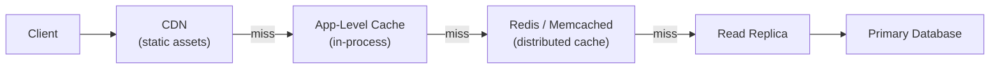

# Caching Strategies: Redis, Memcached, CDN, Application-Level

## 🗺️ Quick Overview



*Cache layers are ordered by latency — each level absorbs the majority of reads before reaching the expensive database.*

## 🎯 The $12M Question

How do you reduce database load by **95%** and API latency from **850ms → 12ms** (70x faster)?

**Facebook's Answer:** Aggressive caching with Memcached stores **75% of all reads** in memory, serving **1 trillion requests/day** with sub-millisecond latency.

---

## 💰 The $12M Problem

**Stack Overflow's Challenge (2013):**
- **6,000 requests/sec** hitting database
- **PostgreSQL maxed out** at 800 queries/sec
- **$12M/year** quoted for database scaling (adding 15+ read replicas)
- **Response time:** 850ms (unacceptable for users)

**The Fix:**
Implemented **Redis caching** + **application-level caching** + **HTTP caching** → reduced database queries from **6,000/sec → 300/sec** (95% cache hit rate), latency from **850ms → 12ms** (70x faster), and **avoided $12M in hardware costs**.

---

## 🚫 Anti-Patterns (What NOT to Do)

### ❌ **Wrong: Caching Everything**
```javascript
// BAD: Cache data that changes frequently
cache.set('active_users_count', db.count('users WHERE online = true'), 60);
// Problem: Count changes every second, cache is always stale

// BAD: Cache user-specific data in shared cache
cache.set('user_feed_123', generateFeed(userId: 123), 300);
// Problem: Cache pollution (millions of user-specific keys)
```

**Why This Fails:**
- **Stale data** (60-second delay on real-time data)
- **Cache pollution** (fills memory with rarely-accessed keys)
- **Poor hit rate** (data invalidated before reuse)

### ❌ **Wrong: Cache-Aside Without TTL**
```javascript
// BAD: No expiration
const user = cache.get('user:123');
if (!user) {
  user = db.users.findById(123);
  cache.set('user:123', user);  // ← No TTL!
}

// Problem: User updates in DB, cache never expires
// Result: Serving stale data forever
```

### ❌ **Wrong: Ignoring Cache Invalidation**
```javascript
// Update user in database
db.users.update({ id: 123, name: 'New Name' });

// Forget to invalidate cache
// cache.delete('user:123');  ← MISSING!

// Result: API still returns old name for hours
```

---

## 💡 Paradigm Shift

> **"The fastest query is the one you never make."**

**The Key Insight:** Cache at multiple layers (browser → CDN → app → database) for maximum benefit.

**Stack Overflow's Multi-Layer Caching:**
```
Browser Cache (HTTP headers)
    ↓ (cache miss)
CDN Cache (Cloudflare, 200+ locations)
    ↓ (cache miss)
Application Cache (Redis, in-memory)
    ↓ (cache miss)
Database (PostgreSQL)
```

**Result:** Only **5% of requests** reach the database.

---

## ✅ The Solution: Four Caching Strategies

### **1. Cache-Aside (Lazy Loading)**

**When to Use:** Read-heavy workloads, data doesn't change often

**Pattern:**
```javascript
// Read from cache first, fallback to DB
async function getUser(userId) {
  const cacheKey = `user:${userId}`;

  // Try cache first
  let user = await cache.get(cacheKey);

  if (user) {
    console.log('Cache HIT');
    return JSON.parse(user);
  }

  // Cache miss: fetch from database
  console.log('Cache MISS');
  user = await db.users.findById(userId);

  // Store in cache with TTL
  await cache.setex(cacheKey, 3600, JSON.stringify(user));  // 1 hour

  return user;
}

// Update: Invalidate cache
async function updateUser(userId, updates) {
  await db.users.update({ id: userId }, updates);

  // CRITICAL: Invalidate cache
  await cache.del(`user:${userId}`);

  return db.users.findById(userId);
}
```

**Pros:**
- ✅ **Simple** (cache only what's requested)
- ✅ **Cache-friendly** (only popular data cached)
- ✅ **Resilient** (cache failure = slower, not broken)

**Cons:**
- ❌ **Cache misses add latency** (database + cache write)
- ❌ **Thundering herd** (many requests miss cache simultaneously)

**Real-World:**
- **Facebook:** Memcached for user profiles
- **Pinterest:** Redis for image metadata
- **Reddit:** Redis for post data

---

### **2. Write-Through Cache**

**When to Use:** Write-heavy workloads, consistency critical

**Pattern:**
```javascript
// Write to cache AND database together
async function createPost(postData) {
  // Write to database first
  const post = await db.posts.create(postData);

  // Then update cache
  const cacheKey = `post:${post.id}`;
  await cache.setex(cacheKey, 3600, JSON.stringify(post));

  return post;
}

async function updatePost(postId, updates) {
  // Update database
  const post = await db.posts.update({ id: postId }, updates);

  // Update cache immediately
  const cacheKey = `post:${postId}`;
  await cache.setex(cacheKey, 3600, JSON.stringify(post));

  return post;
}

// Read is simple (cache always up-to-date)
async function getPost(postId) {
  const cached = await cache.get(`post:${postId}`);
  if (cached) return JSON.parse(cached);

  // Cache should always have it, but fallback to DB
  return db.posts.findById(postId);
}
```

**Pros:**
- ✅ **Always consistent** (cache mirrors database)
- ✅ **Reads are fast** (cache always populated)
- ✅ **No stale data** (writes update both)

**Cons:**
- ❌ **Writes are slower** (2 operations)
- ❌ **Wastes cache** (caches rarely-read data)
- ❌ **Complex failure handling** (what if cache write fails?)

**Real-World:**
- **DynamoDB Accelerator (DAX):** Write-through for DynamoDB
- **Amazon ElastiCache:** Optional write-through mode

---

### **3. Write-Behind (Write-Back) Cache**

**When to Use:** Very high write throughput, eventual consistency OK

**Pattern:**
```javascript
// Queue for async DB writes
const writeQueue = [];

async function updatePost(postId, updates) {
  // Write to cache immediately (fast response)
  const cacheKey = `post:${postId}`;
  let post = await cache.get(cacheKey) || await db.posts.findById(postId);

  post = { ...post, ...updates };
  await cache.setex(cacheKey, 3600, JSON.stringify(post));

  // Queue database write (async)
  writeQueue.push({ postId, updates });

  return post;
}

// Background worker: flush queue to database
setInterval(async () => {
  while (writeQueue.length > 0) {
    const batch = writeQueue.splice(0, 100);  // Process 100 at a time

    // Batch update database
    await Promise.all(
      batch.map(({ postId, updates }) =>
        db.posts.update({ id: postId }, updates)
      )
    );

    console.log(`Flushed ${batch.length} writes to database`);
  }
}, 5000);  // Flush every 5 seconds
```

**Pros:**
- ✅ **Extremely fast writes** (cache only)
- ✅ **Batch efficiency** (group DB writes)
- ✅ **High throughput** (1000s of writes/sec)

**Cons:**
- ❌ **Risk of data loss** (cache crash before flush)
- ❌ **Eventual consistency** (DB lags behind cache)
- ❌ **Complex recovery** (need write-ahead log)

**Real-World:**
- **Instagram:** Write-behind for likes/comments (high volume)
- **Twitter:** Write-behind for timeline updates

---

### **4. Read-Through Cache**

**When to Use:** Cache provider manages data loading automatically

**Pattern:**
```javascript
// Cache automatically loads data on miss
const Redis = require('ioredis');
const redis = new Redis();

// Wrapper that implements read-through
class ReadThroughCache {
  constructor(redis, loader, ttl = 3600) {
    this.redis = redis;
    this.loader = loader;  // Function to load data on miss
    this.ttl = ttl;
  }

  async get(key) {
    // Try cache
    let value = await this.redis.get(key);

    if (value) {
      return JSON.parse(value);
    }

    // Cache miss: load data
    value = await this.loader(key);

    // Store in cache
    await this.redis.setex(key, this.ttl, JSON.stringify(value));

    return value;
  }
}

// Usage
const userCache = new ReadThroughCache(
  redis,
  async (key) => {
    const userId = key.split(':')[1];
    return db.users.findById(userId);
  },
  3600
);

// Application code doesn't know about cache misses
const user = await userCache.get('user:123');
```

**Pros:**
- ✅ **Transparent** (application doesn't handle misses)
- ✅ **Consistent API** (always returns data)
- ✅ **Lazy loading** (only cache what's needed)

**Cons:**
- ❌ **First request slow** (cold cache)
- ❌ **Thundering herd** (many misses at once)

**Real-World:**
- **Spring Cache:** Java framework's default pattern
- **Rails.cache.fetch:** Ruby on Rails read-through

---

## 🏢 Real-World Multi-Layer Caching

### **Stack Overflow's Architecture**

```
┌─────────────────────────────────────────────┐
│  Stack Overflow: 6,000 req/sec              │
├─────────────────────────────────────────────┤
│                                             │
│  Layer 1: Browser Cache (HTTP headers)     │
│  ├─ Cache-Control: public, max-age=300     │
│  ├─ ETag: "abc123"                          │
│  └─ Hit Rate: 40%                           │
│                                             │
│  Layer 2: CDN (Cloudflare, 200+ locations) │
│  ├─ Caches static assets & public pages    │
│  ├─ Hit Rate: 80% (of remaining 60%)       │
│  └─ Requests reaching origin: 12%          │
│                                             │
│  Layer 3: Application Cache (Redis)        │
│  ├─ Caches database queries, HTML snippets │
│  ├─ Hit Rate: 95% (of remaining 12%)       │
│  └─ Requests reaching DB: 0.6%             │
│                                             │
│  Layer 4: Database (PostgreSQL)            │
│  ├─ Handles 300 queries/sec (was 6,000)    │
│  └─ Cost: $50K/year (vs $12M quoted)       │
│                                             │
└─────────────────────────────────────────────┘

Result: 95% reduction in database load
```

### **Cache Invalidation Strategies**

```javascript
// Strategy 1: TTL-based (simplest)
cache.setex('post:123', 300, data);  // Expire after 5 min

// Strategy 2: Event-based invalidation
eventBus.on('post.updated', async (postId) => {
  await cache.del(`post:${postId}`);
  await cache.del(`user:${post.authorId}:posts`);  // Also invalidate user's posts list
});

// Strategy 3: Cache tags (group invalidation)
await cache.set('post:123', data, { tags: ['user:456', 'category:tech'] });
// Invalidate all posts by user
await cache.invalidateTag('user:456');

// Strategy 4: Version-based (Facebook's approach)
const version = await cache.incr('user:456:version');  // Increment version
cache.set(`user:456:v${version}`, data);  // Store with version
// Old version automatically expires (TTL)
```

---

## 📊 Cache Performance Metrics

### **Facebook's Memcached (Largest Deployment)**

```
Scale:
- 75% of reads from cache (25% hit database)
- 1 trillion requests/day
- 800+ TB of cached data
- <1ms average latency

Configuration:
- 10,000+ Memcached servers
- LRU eviction policy
- Consistent hashing for distribution
- Regional clusters (reduce cross-DC traffic)

Impact:
- Database load: 400K QPS → 100K QPS (75% reduction)
- Response time: 100ms → <1ms (100x faster)
- Cost savings: $50M/year (vs adding DB capacity)
```

### **Twitter's Cache Hit Rates**

```
Timeline Cache:
- Hit rate: 95% (only 5% reach database)
- TTL: 60 seconds (real-time updates)
- Cache size: 200 GB in-memory

Tweet Cache:
- Hit rate: 99% (popular tweets served billions of times)
- TTL: Infinite (tweets are immutable)
- Cache size: 2 TB distributed

User Cache:
- Hit rate: 85% (profile data)
- TTL: 300 seconds
- Invalidation: On profile update
```

---

## 🏆 Key Takeaways

### **When to Use Each Strategy**

| Strategy | Use Case | Example |
|----------|----------|---------|
| **Cache-Aside** | Read-heavy, lazy loading | User profiles, product catalogs |
| **Write-Through** | Strong consistency | Financial transactions, inventory |
| **Write-Behind** | High write throughput | Likes, views, analytics |
| **Read-Through** | Transparent caching | Framework-managed caching |

### **Cache Selection Guide**

| Cache Type | Speed | Persistence | Use Case |
|------------|-------|-------------|----------|
| **Redis** | 100K ops/sec | Optional (RDB/AOF) | Session store, rate limiting |
| **Memcached** | 1M ops/sec | No | Pure cache, simple key-value |
| **CDN** | <50ms globally | Yes (edge cache) | Static assets, public content |
| **Application** | <1ms | No | In-memory objects, hot data |

### **Best Practices**

1. **Set appropriate TTLs**
   - User data: 5-15 minutes
   - Product catalog: 1-24 hours
   - Static content: 1 week - 1 year

2. **Monitor hit rates**
   - Target: 80-95% cache hit rate
   - Alert if hit rate drops <70%

3. **Invalidate on writes**
   - Update: Invalidate cached data
   - Delete: Remove from cache
   - Create: No invalidation needed (cache-aside)

4. **Use cache keys wisely**
   - Pattern: `resource:id:version`
   - Example: `user:123:v5`, `post:456:v2`

5. **Handle cache failures gracefully**
   - Fallback to database
   - Circuit breaker pattern
   - Cache warming strategies

---

## 🚀 Real-World Impact

**Stack Overflow:**
- **95% cache hit rate** (6,000 req/sec → 300 DB queries/sec)
- **$12M saved** annually (avoided database scaling)
- **12ms response time** (was 850ms)

**Facebook:**
- **75% of reads** from Memcached
- **1 trillion requests/day** served from cache
- **$50M/year saved** in database infrastructure

**Twitter:**
- **95% timeline requests** from cache
- **200 GB** timeline cache (60-sec TTL)
- **Handles 6,000 tweets/sec** with minimal DB load

**Pinterest:**
- **99% image metadata** from Redis
- **20 billion images** cached
- **<5ms** cache lookup time

---

## 🎯 Next Steps

1. **Implement cache-aside** for read-heavy workloads
2. **Set TTLs appropriately** (5-15 min for user data)
3. **Monitor cache hit rates** (target 80%+)
4. **Invalidate on writes** (prevent stale data)
5. **Use Redis for sessions** (fast, persistent)

**Up Next:** POC #61 - Cache-Aside Pattern Implementation (Complete working example with Redis)

---

## 📚 References

- [Facebook Memcached Architecture](https://www.facebook.com/notes/facebook-engineering/scaling-memcached-at-facebook/10150468255628920/)
- [Redis Caching Patterns](https://redis.io/docs/manual/patterns/)
- [Stack Overflow Architecture](https://stackexchange.com/performance)
- [Twitter Caching](https://blog.twitter.com/engineering/en_us/topics/infrastructure/2017/the-infrastructure-behind-twitter-scale)
